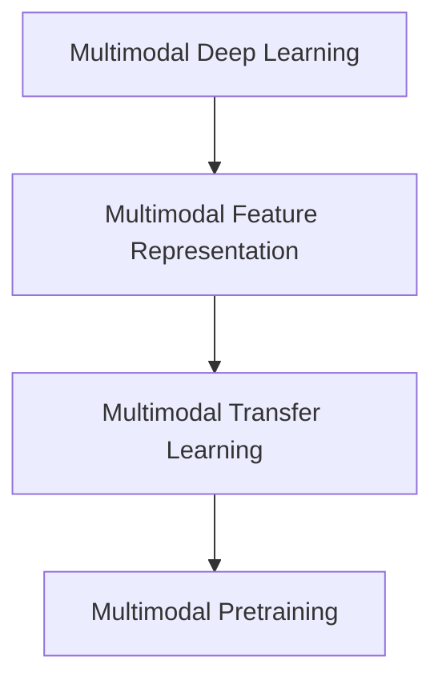
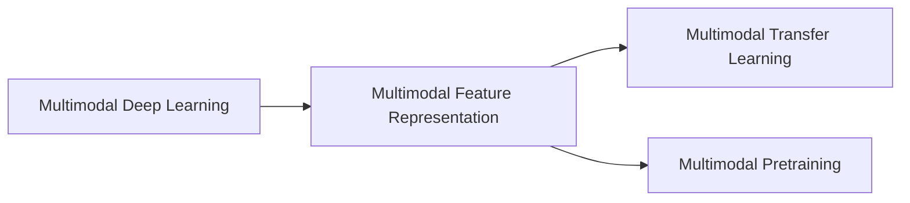
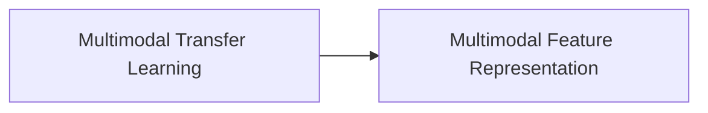
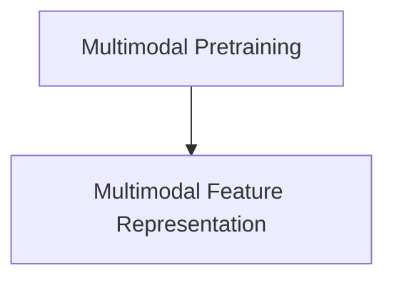
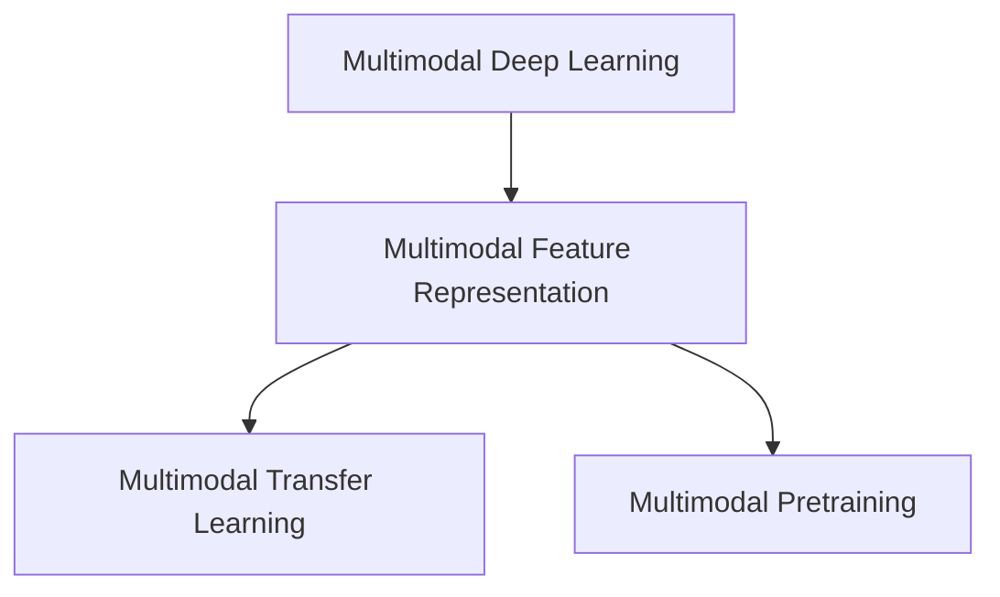

                 

# 多模态大模型：技术原理与实战 国内外多模态大模型对比

> 关键词：多模态大模型,多模态深度学习,多模态特征表示,多模态迁移学习,深度学习,深度学习框架,Transformer,多模态预训练

## 1. 背景介绍

### 1.1 问题由来
在过去几年中，深度学习在图像、语音、文本等多种模态数据上取得了显著进展。传统的深度学习模型往往专注于单模态数据的处理，无法充分利用其他模态数据的潜在信息，这限制了其在实际应用中的表现。随着技术的不断进步，多模态深度学习（Multimodal Deep Learning）应运而生，成为AI领域的热门研究领域。多模态大模型（Multimodal Large Model）在图像、文本、语音等多种模态数据上具有强大的表征能力，已经成为自然语言处理（NLP）、计算机视觉（CV）、语音识别（ASR）等领域的核心技术。本文将对多模态大模型的技术原理和实战进行详细解析，并对比国内外主要多模态大模型，探讨其技术优劣和发展趋势。

### 1.2 问题核心关键点
多模态大模型通过联合训练多个模态的数据，学习到多模态数据的共同表示，从而提升模型在不同模态上的性能。其主要包括以下核心关键点：

- **多模态数据**：图像、文本、语音等多种模态数据。
- **多模态深度学习**：使用深度学习技术处理和融合多模态数据。
- **多模态特征表示**：在联合训练中学习多模态数据的共同特征表示。
- **多模态迁移学习**：将多模态大模型在不同模态上的知识进行迁移。
- **多模态预训练**：在大规模数据上预训练多模态大模型，提取通用特征。

这些核心关键点通过模型架构、训练方法和应用场景等方面相互作用，构成了多模态大模型的技术生态系统。本文将深入探讨这些核心关键点，并通过实践案例展示多模态大模型的应用效果。

### 1.3 问题研究意义
研究多模态大模型的技术原理和实战，对于拓展深度学习模型的应用范围，提升多模态数据处理能力，加速AI技术的产业化进程，具有重要意义：

1. **多模态数据融合**：多模态大模型能够有效融合不同模态的数据，提取更多样化的特征，提升数据的利用效率。
2. **跨模态任务提升**：通过多模态大模型的迁移学习，能够将特定模态的知识应用于其他模态，提升跨模态任务的性能。
3. **多模态任务创新**：多模态大模型可以支持更复杂、更智能的多模态任务，如自然语言理解、智能交互、情感分析等。
4. **技术壁垒突破**：多模态大模型有助于突破单模态数据处理的局限，促进AI技术的全面发展。
5. **产业应用推广**：多模态大模型可以应用于医疗、金融、教育等多个领域，推动AI技术的落地应用。

## 2. 核心概念与联系

### 2.1 核心概念概述

为更好地理解多模态大模型的技术原理和实战，本节将介绍几个密切相关的核心概念：

- **多模态深度学习（Multimodal Deep Learning）**：使用深度学习技术处理和融合多种模态数据的机器学习技术。常见的多模态深度学习模型包括卷积神经网络（CNN）、循环神经网络（RNN）、Transformer等。
- **多模态特征表示（Multimodal Feature Representation）**：在联合训练中学习多模态数据的共同特征表示，常用的特征表示方法包括融合特征表示、多模态嵌入等。
- **多模态迁移学习（Multimodal Transfer Learning）**：将多模态大模型在不同模态上的知识进行迁移，提升模型在特定任务上的性能。
- **多模态预训练（Multimodal Pretraining）**：在大规模数据上预训练多模态大模型，提取通用特征表示。

这些核心概念之间的逻辑关系可以通过以下Mermaid流程图来展示：



这个流程图展示了大模型在多模态数据处理过程中各个核心概念之间的联系：

1. 多模态深度学习：处理和融合多种模态数据。
2. 多模态特征表示：学习多模态数据的共同特征。
3. 多模态迁移学习：将模型知识迁移到其他模态。
4. 多模态预训练：在预训练过程中学习多模态特征。

### 2.2 概念间的关系

这些核心概念之间存在着紧密的联系，形成了多模态大模型的完整生态系统。下面我们通过几个Mermaid流程图来展示这些概念之间的关系。

#### 2.2.1 多模态深度学习的多模态特征表示



这个流程图展示了大模型在多模态深度学习过程中特征表示的流程：

1. 多模态深度学习：融合多种模态数据。
2. 多模态特征表示：学习多模态数据的共同特征。
3. 多模态迁移学习：将特征表示迁移应用到其他模态。
4. 多模态预训练：在预训练过程中学习多模态特征。

#### 2.2.2 多模态迁移学习与多模态特征表示的关系



这个流程图展示了多模态迁移学习与多模态特征表示的关系：

1. 多模态迁移学习：将多模态大模型在不同模态上的知识进行迁移。
2. 多模态特征表示：学习多模态数据的共同特征。

#### 2.2.3 多模态预训练方法



这个流程图展示了多模态预训练与多模态特征表示的关系：

1. 多模态预训练：在大规模数据上预训练多模态大模型。
2. 多模态特征表示：学习多模态数据的共同特征。

### 2.3 核心概念的整体架构

最后，我们用一个综合的流程图来展示这些核心概念在大模型多模态处理过程中的整体架构：



这个综合流程图展示了从多模态深度学习到多模态特征表示，再到多模态迁移学习的完整流程。通过这些核心概念，大模型能够处理和融合多种模态数据，提取通用特征，并迁移到其他模态，提升跨模态任务的性能。 通过这些流程图，我们可以更清晰地理解多模态大模型的工作原理和优化方向。

## 3. 核心算法原理 & 具体操作步骤
### 3.1 算法原理概述

多模态大模型通过联合训练多个模态的数据，学习到多模态数据的共同表示，从而提升模型在不同模态上的性能。其核心思想是：将预训练的多模态大模型视作一个强大的"特征提取器"，通过在不同模态的标注数据上进行有监督的微调，使得模型输出能够匹配任务标签，从而获得针对特定任务优化的模型。

形式化地，假设多模态大模型为 $M_{\theta}$，其中 $\theta$ 为模型参数。给定多个模态的任务 $T_1, T_2, ..., T_n$ 的标注数据集 $D=\{(x_i, y_i^1, y_i^2, ..., y_i^n)\}_{i=1}^N$，其中 $x_i$ 为原始输入数据，$y_i^k$ 为第 $k$ 模态的任务标签。微调的目标是找到新的模型参数 $\hat{\theta}$，使得：

$$
\hat{\theta}=\mathop{\arg\min}_{\theta} \mathcal{L}(M_{\theta},D)
$$

其中 $\mathcal{L}$ 为针对任务 $T_k$ 设计的损失函数，用于衡量模型预测输出与真实标签之间的差异。常见的损失函数包括交叉熵损失、均方误差损失等。

通过梯度下降等优化算法，微调过程不断更新模型参数 $\theta$，最小化损失函数 $\mathcal{L}$，使得模型输出逼近真实标签。由于 $\theta$ 已经通过预训练获得了较好的初始化，因此即便在多个模态上使用小规模数据集 $D$ 进行微调，也能较快收敛到理想的模型参数 $\hat{\theta}$。

### 3.2 算法步骤详解

基于多模态深度学习的多模态大模型微调一般包括以下几个关键步骤：

**Step 1: 准备预训练模型和数据集**
- 选择合适的多模态深度学习模型 $M_{\theta}$ 作为初始化参数，如Transformer、ResNet等。
- 准备多个模态的任务 $T_1, T_2, ..., T_n$ 的标注数据集 $D$，划分为训练集、验证集和测试集。一般要求标注数据与预训练数据的分布不要差异过大。

**Step 2: 添加任务适配层**
- 根据任务类型，在预训练模型顶层设计合适的输出层和损失函数。
- 对于分类任务，通常在顶层添加线性分类器和交叉熵损失函数。
- 对于生成任务，通常使用语言模型的解码器输出概率分布，并以负对数似然为损失函数。

**Step 3: 设置微调超参数**
- 选择合适的优化算法及其参数，如 AdamW、SGD 等，设置学习率、批大小、迭代轮数等。
- 设置正则化技术及强度，包括权重衰减、Dropout、Early Stopping 等。
- 确定冻结预训练参数的策略，如仅微调顶层，或全部参数都参与微调。

**Step 4: 执行梯度训练**
- 将训练集数据分批次输入模型，前向传播计算损失函数。
- 反向传播计算参数梯度，根据设定的优化算法和学习率更新模型参数。
- 周期性在验证集上评估模型性能，根据性能指标决定是否触发 Early Stopping。
- 重复上述步骤直到满足预设的迭代轮数或 Early Stopping 条件。

**Step 5: 测试和部署**
- 在测试集上评估微调后模型 $M_{\hat{\theta}}$ 的性能，对比微调前后的精度提升。
- 使用微调后的模型对新样本进行推理预测，集成到实际的应用系统中。
- 持续收集新的数据，定期重新微调模型，以适应数据分布的变化。

以上是基于多模态深度学习的大模型微调的一般流程。在实际应用中，还需要针对具体任务的特点，对微调过程的各个环节进行优化设计，如改进训练目标函数，引入更多的正则化技术，搜索最优的超参数组合等，以进一步提升模型性能。

### 3.3 算法优缺点

基于多模态深度学习的大语言模型微调方法具有以下优点：

1. **多模态数据融合**：多模态深度学习模型能够有效融合不同模态的数据，提取更多样化的特征，提升数据的利用效率。
2. **跨模态任务提升**：通过多模态大模型的迁移学习，能够将特定模态的知识应用于其他模态，提升跨模态任务的性能。
3. **多模态任务创新**：多模态大模型可以支持更复杂、更智能的多模态任务，如自然语言理解、智能交互、情感分析等。
4. **技术壁垒突破**：多模态大模型有助于突破单模态数据处理的局限，促进AI技术的全面发展。
5. **产业应用推广**：多模态大模型可以应用于医疗、金融、教育等多个领域，推动AI技术的落地应用。

同时，该方法也存在一定的局限性：

1. **标注成本高**：多模态数据的标注成本较高，获取高质量标注数据的成本较高。
2. **模型复杂度大**：多模态大模型的参数量较大，需要较大的计算资源和存储空间。
3. **数据分布不一致**：当目标任务与预训练数据的分布差异较大时，微调的性能提升有限。
4. **过拟合风险高**：多模态大模型由于参数量较大，容易发生过拟合。

尽管存在这些局限性，但就目前而言，基于多模态深度学习的大模型微调方法仍是大模型应用的最主流范式。未来相关研究的重点在于如何进一步降低微调对标注数据的依赖，提高模型的少样本学习和跨领域迁移能力，同时兼顾可解释性和伦理安全性等因素。

### 3.4 算法应用领域

基于多模态深度学习的大语言模型微调方法在多模态数据处理领域已经得到了广泛的应用，覆盖了几乎所有常见任务，例如：

- **计算机视觉（CV）**：图像分类、物体检测、图像生成等。通过微调使得模型能够理解图像内容，并应用于各种计算机视觉任务。
- **自然语言处理（NLP）**：文本分类、情感分析、命名实体识别等。通过微调使得模型能够处理文本数据，并应用于各种NLP任务。
- **语音识别（ASR）**：语音识别、语音合成、语音情感分析等。通过微调使得模型能够处理语音数据，并应用于各种语音识别任务。
- **多模态数据分析**：多模态数据融合、多模态知识表示等。通过微调使得模型能够处理多种模态数据，并应用于各种多模态数据分析任务。
- **智能交互系统**：智能客服、智能助手、智能家居等。通过微调使得模型能够理解人类语言，并应用于各种智能交互系统。

除了上述这些经典任务外，多模态大模型还被创新性地应用到更多场景中，如视频内容理解、情感计算、多模态增强学习等，为多模态数据处理技术带来了全新的突破。随着预训练模型和微调方法的不断进步，相信多模态大模型将会在更广阔的应用领域大放异彩。

## 4. 数学模型和公式 & 详细讲解  
### 4.1 数学模型构建

本节将使用数学语言对基于多模态深度学习的大语言模型微调过程进行更加严格的刻画。

记多模态大模型为 $M_{\theta}:\mathcal{X}_1 \times \mathcal{X}_2 \times ... \times \mathcal{X}_n \rightarrow \mathcal{Y}$，其中 $\mathcal{X}_i$ 为第 $i$ 个模态的输入空间，$\mathcal{Y}$ 为输出空间，$\theta \in \mathbb{R}^d$ 为模型参数。假设多模态任务的训练集为 $D=\{(x_i, y_i^1, y_i^2, ..., y_i^n)\}_{i=1}^N$，其中 $x_i$ 为原始输入数据，$y_i^k$ 为第 $k$ 模态的任务标签。

定义模型 $M_{\theta}$ 在数据样本 $(x,y)$ 上的损失函数为 $\ell(M_{\theta}(x),y)$，则在数据集 $D$ 上的经验风险为：

$$
\mathcal{L}(\theta) = \frac{1}{N} \sum_{i=1}^N \sum_{k=1}^n \ell(M_{\theta}(x_i),y_i^k)
$$

微调的优化目标是最小化经验风险，即找到最优参数：

$$
\theta^* = \mathop{\arg\min}_{\theta} \mathcal{L}(\theta)
$$

在实践中，我们通常使用基于梯度的优化算法（如SGD、Adam等）来近似求解上述最优化问题。设 $\eta$ 为学习率，$\lambda$ 为正则化系数，则参数的更新公式为：

$$
\theta \leftarrow \theta - \eta \nabla_{\theta}\mathcal{L}(\theta) - \eta\lambda\theta
$$

其中 $\nabla_{\theta}\mathcal{L}(\theta)$ 为损失函数对参数 $\theta$ 的梯度，可通过反向传播算法高效计算。

### 4.2 公式推导过程

以下我们以二分类任务为例，推导交叉熵损失函数及其梯度的计算公式。

假设模型 $M_{\theta}$ 在输入 $x$ 上的输出为 $\hat{y}=M_{\theta}(x) \in [0,1]$，表示样本属于正类的概率。真实标签 $y \in \{0,1\}$。则二分类交叉熵损失函数定义为：

$$
\ell(M_{\theta}(x),y) = -[y\log \hat{y} + (1-y)\log (1-\hat{y})]
$$

将其代入经验风险公式，得：

$$
\mathcal{L}(\theta) = -\frac{1}{N}\sum_{i=1}^N \sum_{k=1}^n [y_i^k\log M_{\theta}(x_i)+ (1-y_i^k)\log(1-M_{\theta}(x_i))]
$$

根据链式法则，损失函数对参数 $\theta_k$ 的梯度为：

$$
\frac{\partial \mathcal{L}(\theta)}{\partial \theta_k} = -\frac{1}{N}\sum_{i=1}^N \sum_{k=1}^n (\frac{y_i^k}{M_{\theta}(x_i)}-\frac{1-y_i^k}{1-M_{\theta}(x_i)}) \frac{\partial M_{\theta}(x_i)}{\partial \theta_k}
$$

其中 $\frac{\partial M_{\theta}(x_i)}{\partial \theta_k}$ 可进一步递归展开，利用自动微分技术完成计算。

在得到损失函数的梯度后，即可带入参数更新公式，完成模型的迭代优化。重复上述过程直至收敛，最终得到适应多模态任务的最优模型参数 $\theta^*$。

## 5. 项目实践：代码实例和详细解释说明
### 5.1 开发环境搭建

在进行多模态大模型微调实践前，我们需要准备好开发环境。以下是使用Python进行PyTorch开发的环境配置流程：

1. 安装Anaconda：从官网下载并安装Anaconda，用于创建独立的Python环境。

2. 创建并激活虚拟环境：
```bash
conda create -n pytorch-env python=3.8 
conda activate pytorch-env
```

3. 安装PyTorch：根据CUDA版本，从官网获取对应的安装命令。例如：
```bash
conda install pytorch torchvision torchaudio cudatoolkit=11.1 -c pytorch -c conda-forge
```

4. 安装Transformers库：
```bash
pip install transformers
```

5. 安装各类工具包：
```bash
pip install numpy pandas scikit-learn matplotlib tqdm jupyter notebook ipython
```

完成上述步骤后，即可在`pytorch-env`环境中开始多模态大模型的微调实践。

### 5.2 源代码详细实现

下面我们以多模态情感分析任务为例，给出使用Transformers库对BERT模型进行多模态微调的PyTorch代码实现。

首先，定义多模态情感分析任务的数据处理函数：

```python
from transformers import BertTokenizer
from torch.utils.data import Dataset
import torch

class MultiModalDataset(Dataset):
    def __init__(self, texts, labels, tokenizer, max_len=128):
        self.texts = texts
        self.labels = labels
        self.tokenizer = tokenizer
        self.max_len = max_len
        
    def __len__(self):
        return len(self.texts)
    
    def __getitem__(self, item):
        text = self.texts[item]
        label = self.labels[item]
        
        encoding = self.tokenizer(text, return_tensors='pt', max_length=self.max_len, padding='max_length', truncation=True)
        input_ids = encoding['input_ids'][0]
        attention_mask = encoding['attention_mask'][0]
        
        # 对文本和标签进行编码
        encoded_text = [label] * len(input_ids)
        encoded_labels = torch.tensor(encoded_text, dtype=torch.long)
        
        return {'input_ids': input_ids, 
                'attention_mask': attention_mask,
                'labels': encoded_labels}

# 标签与id的映射
tag2id = {'negative': 0, 'positive': 1}
id2tag = {v: k for k, v in tag2id.items()}

# 创建dataset
tokenizer = BertTokenizer.from_pretrained('bert-base-cased')

train_dataset = MultiModalDataset(train_texts, train_labels, tokenizer)
dev_dataset = MultiModalDataset(dev_texts, dev_labels, tokenizer)
test_dataset = MultiModalDataset(test_texts, test_labels, tokenizer)
```

然后，定义模型和优化器：

```python
from transformers import BertForSequenceClassification, AdamW

model = BertForSequenceClassification.from_pretrained('bert-base-cased', num_labels=len(tag2id))

optimizer = AdamW(model.parameters(), lr=2e-5)
```

接着，定义训练和评估函数：

```python
from torch.utils.data import DataLoader
from tqdm import tqdm
from sklearn.metrics import classification_report

device = torch.device('cuda') if torch.cuda.is_available() else torch.device('cpu')
model.to(device)

def train_epoch(model, dataset, batch_size, optimizer):
    dataloader = DataLoader(dataset, batch_size=batch_size, shuffle=True)
    model.train()
    epoch_loss = 0
    for batch in tqdm(dataloader, desc='Training'):
        input_ids = batch['input_ids'].to(device)
        attention_mask = batch['attention_mask'].to(device)
        labels = batch['labels'].to(device)
        model.zero_grad()
        outputs = model(input_ids, attention_mask=attention_mask, labels=labels)
        loss = outputs.loss
        epoch_loss += loss.item()
        loss.backward()
        optimizer.step()
    return epoch_loss / len(dataloader)

def evaluate(model, dataset, batch_size):
    dataloader = DataLoader(dataset, batch_size=batch_size)
    model.eval()
    preds, labels = [], []
    with torch.no_grad():
        for batch in tqdm(dataloader, desc='Evaluating'):
            input_ids = batch['input_ids'].to(device)
            attention_mask = batch['attention_mask'].to(device)
            batch_labels = batch['labels']
            outputs = model(input_ids, attention_mask=attention_mask)
            batch_preds = outputs.logits.argmax(dim=2).to('cpu').tolist()
            batch_labels = batch_labels.to('cpu').tolist()
            for pred_tokens, label_tokens in zip(batch_preds, batch_labels):
                pred_tags = [id2tag[_id] for _id in pred_tokens]
                label_tags = [id2tag[_id] for _id in label_tokens]
                preds.append(pred_tags[:len(label_tokens)])
                labels.append(label_tags)
                
    print(classification_report(labels, preds))
```

最后，启动训练流程并在测试集上评估：

```python
epochs = 5
batch_size = 16

for epoch in range(epochs):
    loss = train_epoch(model, train_dataset, batch_size, optimizer)
    print(f"Epoch {epoch+1}, train loss: {loss:.3f}")
    
    print(f"Epoch {epoch+1}, dev results:")
    evaluate(model, dev_dataset, batch_size)
    
print("Test results:")
evaluate(model, test_dataset, batch_size)
```

以上就是使用PyTorch对BERT模型进行多模态情感分析任务微调的完整代码实现。可以看到，得益于Transformers库的强大封装，我们可以用相对简洁的代码完成多模态情感分析任务的微调。

### 5.3 代码解读与分析

让我们再详细解读一下关键代码的实现细节：

**MultiModalDataset类**：
- `__init__`方法：初始化文本、标签、分词器等关键组件。
- `__len__`方法：返回数据集的样本数量。
- `__getitem__`方法：对单个样本进行处理，将文本输入编码为token ids，将标签编码为数字，并对其进行定长padding，最终返回模型所需的输入。

**tag2id和id2tag字典**：
- 定义了标签与数字id之间的映射关系，用于将token-wise的预测结果解码回真实的标签。

**训练和评估函数**：
- 使用PyTorch的DataLoader对数据集进行批次化加载，供模型训练和推理使用。
- 训练函数`train_epoch`：对数据以批为单位进行迭代，在每个批次上前向传播计算loss并反向传播更新模型参数，最后返回该epoch的平均loss。
- 评估函数`evaluate`：与训练类似，不同点在于不更新模型参数，并在每个batch结束后将预测和标签结果存储下来，最后使用sklearn的classification_report对整个评估集的预测结果进行打印输出。

**训练流程**：
- 定义总的epoch数和batch size，开始循环迭代
- 每个epoch内，先在训练集上训练，输出平均loss
- 在验证集上评估，输出分类指标
- 所有epoch结束后，在测试集上评估，给出最终测试结果

可以看到，PyTorch配合Transformers库使得BERT多模态微调的代码实现变得简洁高效。开发者

