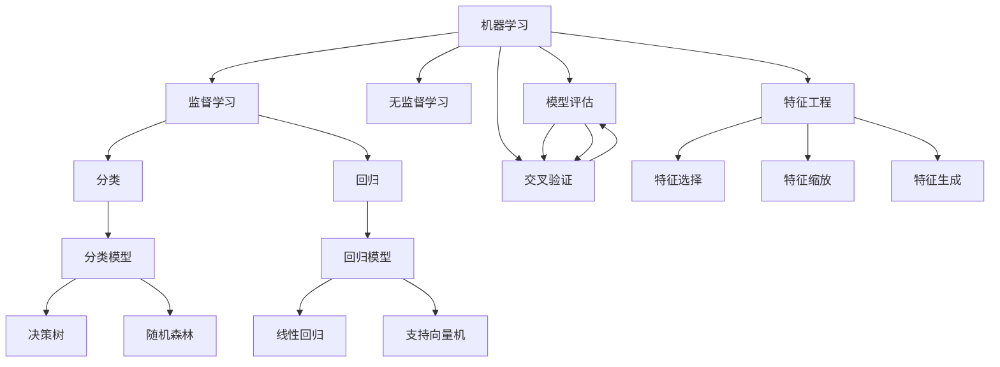
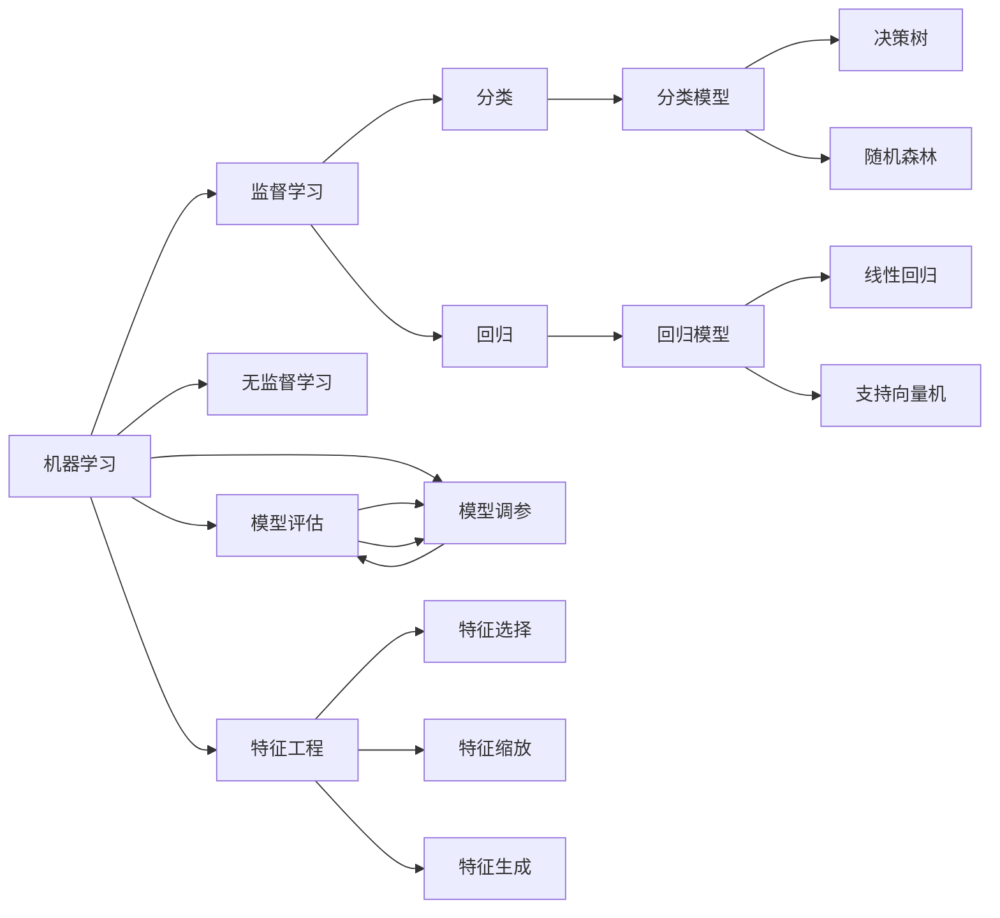
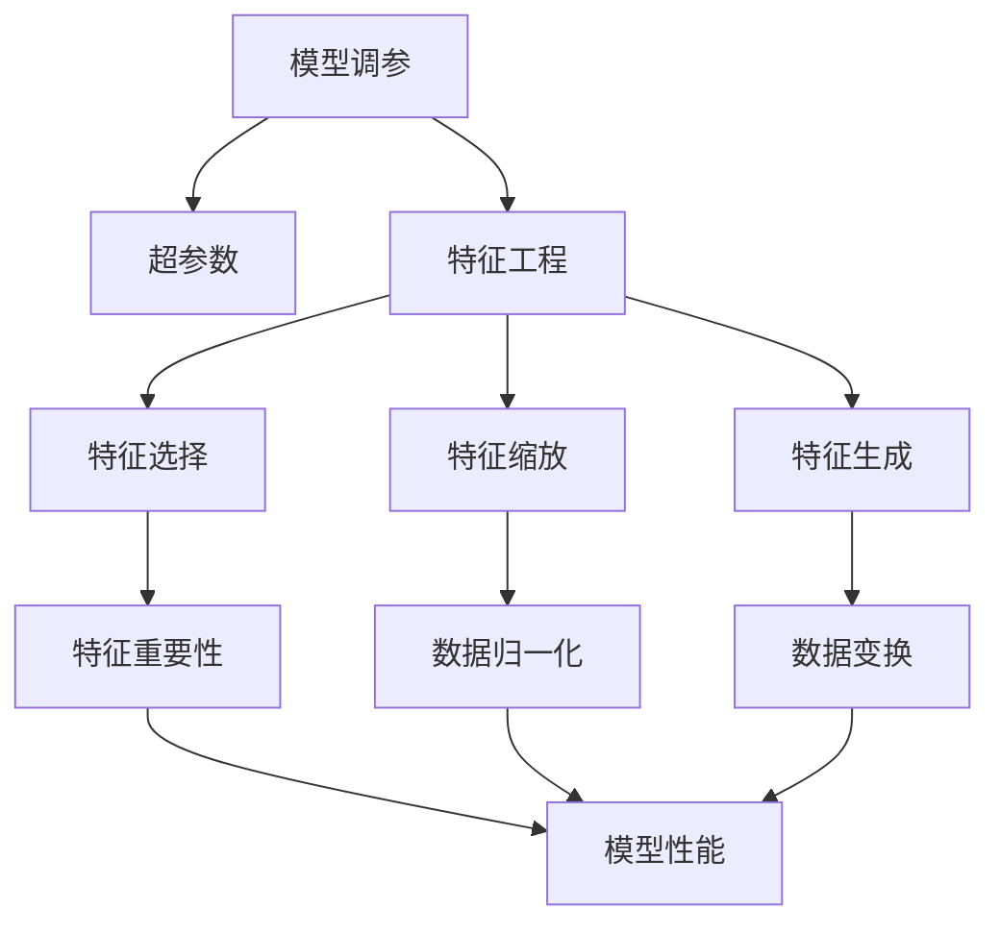
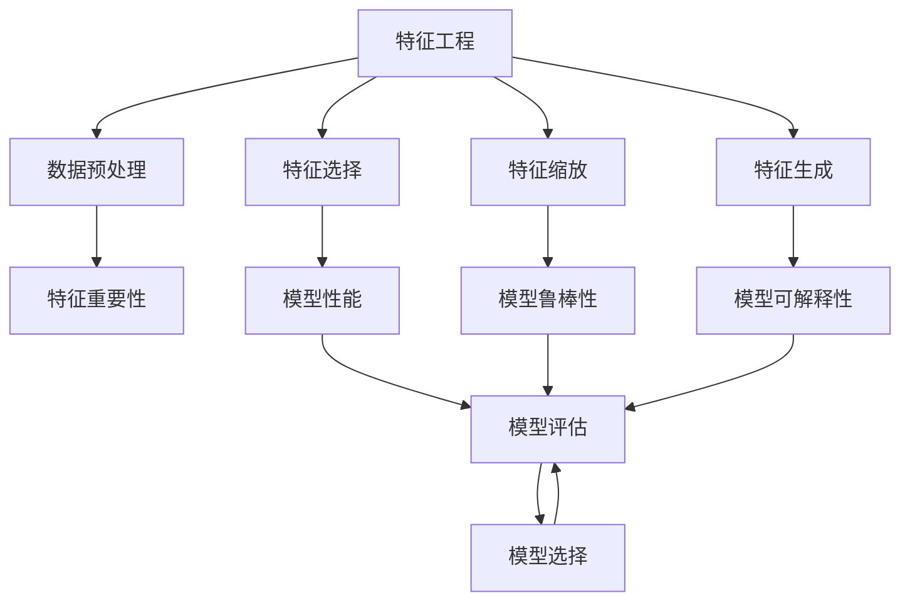
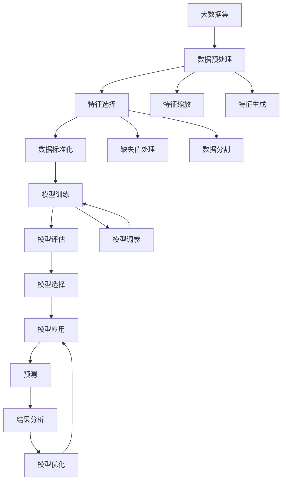

                 

# Scikit-learn 原理与代码实战案例讲解

> 关键词：Scikit-learn, 机器学习, 特征工程, 模型评估, 数据预处理, 梯度下降, 交叉验证, 正则化

## 1. 背景介绍

### 1.1 问题由来
在机器学习领域，Scikit-learn（简称sklearn）是最广泛使用的Python机器学习库之一，提供了丰富的算法和工具，支持从数据预处理到模型评估的整个流程。然而，许多初学者在使用Scikit-learn时，常常面临算法原理不清晰、代码实现不熟悉、模型调参困难等问题。因此，本文将通过深入浅出的讲解，详细介绍Scikit-learn的原理、关键算法、代码实现及实际应用案例，帮助读者快速掌握这一强大工具。

### 1.2 问题核心关键点
Scikit-learn的核心包括：
- 强大的算法库：如线性回归、逻辑回归、决策树、随机森林、支持向量机等。
- 高效的特征工程工具：如特征选择、特征缩放、特征生成等。
- 便捷的数据预处理功能：如数据标准化、缺失值处理、数据分割等。
- 全面的模型评估手段：如交叉验证、学习曲线、ROC曲线等。
- 自动化的模型调参工具：如网格搜索、随机搜索、贝叶斯优化等。

理解这些关键点，并能够在实际项目中灵活运用，将大大提升机器学习模型的性能和可靠性。

## 2. 核心概念与联系

### 2.1 核心概念概述

为更好地理解Scikit-learn的核心概念，本节将介绍几个密切相关的核心概念：

- 机器学习（Machine Learning, ML）：通过数据训练模型，使模型能够对未知数据进行预测或分类的过程。
- 监督学习（Supervised Learning）：利用标注数据训练模型，使其能够预测新数据的标签。
- 无监督学习（Unsupervised Learning）：利用未标注数据训练模型，使其能够发现数据的内在结构。
- 特征工程（Feature Engineering）：选择、构建和优化数据特征的过程，是机器学习中至关重要的一步。
- 模型评估（Model Evaluation）：通过各种指标评估模型性能，选择最优模型。
- 模型调参（Model Tuning）：调整模型超参数以优化模型性能。

这些核心概念之间的逻辑关系可以通过以下Mermaid流程图来展示：



这个流程图展示了一些核心概念及其之间的关系：

1. 机器学习通过数据训练模型，而监督学习和无监督学习是两种主要的训练方式。
2. 监督学习分为分类和回归两种任务，分别使用不同的模型。
3. 特征工程是机器学习中必不可少的步骤，影响模型的准确性。
4. 模型评估用于评估模型性能，帮助选择最优模型。
5. 模型调参用于优化模型性能，是模型选择和评估的重要环节。

### 2.2 概念间的关系

这些核心概念之间存在着紧密的联系，形成了机器学习模型的完整生态系统。下面我们通过几个Mermaid流程图来展示这些概念之间的关系。

#### 2.2.1 机器学习的学习范式



这个流程图展示了大机器学习模型的学习过程。机器学习从数据开始，通过监督学习和无监督学习训练模型，然后使用特征工程优化数据，通过模型评估和调参选择最优模型。

#### 2.2.2 模型调参与特征工程的关系



这个流程图展示了模型调参与特征工程之间的关系。模型调参通过调整超参数优化模型性能，特征工程通过选择、缩放和生成特征，影响模型的性能。

#### 2.2.3 特征工程与模型评估的关系



这个流程图展示了特征工程与模型评估之间的关系。特征工程通过预处理和生成特征，影响模型的性能和可解释性，模型评估通过各种指标评估模型性能，帮助选择最优模型。

### 2.3 核心概念的整体架构

最后，我们用一个综合的流程图来展示这些核心概念在大数据处理中的整体架构：



这个综合流程图展示了从数据预处理到模型应用的完整流程。大数据集首先经过数据预处理，然后通过特征工程生成特征，模型训练后进行评估和调参，选择最优模型，最终应用于预测和结果分析，形成一个闭环反馈过程。 通过这些流程图，我们可以更清晰地理解机器学习模型的学习过程和各环节之间的联系。

## 3. 核心算法原理 & 具体操作步骤
### 3.1 算法原理概述

Scikit-learn的核心算法包括线性回归、逻辑回归、决策树、随机森林、支持向量机等。以线性回归为例，其原理如下：

假设给定训练数据集 $D=\{(x_i, y_i)\}_{i=1}^n$，其中 $x_i \in \mathbb{R}^p$ 为输入特征， $y_i \in \mathbb{R}$ 为输出标签，目标是最小化损失函数 $L$：

$$
L(\theta) = \frac{1}{2N}\sum_{i=1}^N(y_i - \theta^T x_i)^2
$$

其中 $\theta$ 为模型参数，包括截距和权重。通过梯度下降等优化算法，最小化损失函数，得到最优参数 $\theta^*$。

在实际应用中，线性回归常用于回归预测任务，如房价预测、销售预测等。Scikit-learn提供了多种实现方式，如线性回归模型 `LinearRegression`、岭回归模型 `Ridge`、Lasso回归模型 `Lasso` 等，供开发者选择。

### 3.2 算法步骤详解

线性回归的实现步骤如下：

1. **准备数据**：将训练数据集分为特征集 $X$ 和标签集 $y$，并进行数据标准化和缺失值处理。
2. **模型训练**：使用 `LinearRegression` 模型，通过 `fit` 方法训练模型，得到最优参数 $\theta^*$。
3. **模型评估**：使用测试集评估模型性能，计算均方误差（MSE）、决定系数（R-squared）等指标。
4. **模型应用**：使用 `predict` 方法，将新数据输入模型，得到预测结果。
5. **模型优化**：根据评估结果，调整模型参数，进一步优化模型性能。

以线性回归为例，代码实现如下：

```python
from sklearn.linear_model import LinearRegression
from sklearn.metrics import mean_squared_error, r2_score
from sklearn.preprocessing import StandardScaler

# 准备数据
X = ... # 特征集
y = ... # 标签集
scaler = StandardScaler()
X_scaled = scaler.fit_transform(X)

# 模型训练
model = LinearRegression()
model.fit(X_scaled, y)

# 模型评估
X_test = ... # 测试集特征
y_test = ... # 测试集标签
y_pred = model.predict(X_test)
mse = mean_squared_error(y_test, y_pred)
r2 = r2_score(y_test, y_pred)

# 模型应用
X_new = ... # 新数据
y_new_pred = model.predict(X_new)

# 模型优化
from sklearn.model_selection import train_test_split
from sklearn.linear_model import Lasso

X_train, X_test, y_train, y_test = train_test_split(X, y, test_size=0.2)
model_lasso = Lasso(alpha=0.1)
model_lasso.fit(X_train, y_train)
mse_lasso = mean_squared_error(y_test, model_lasso.predict(X_test))
r2_lasso = r2_score(y_test, model_lasso.predict(X_test))
```

### 3.3 算法优缺点

Scikit-learn的优点在于其丰富的算法库和工具，易于使用，适合各种规模的数据集和问题。然而，其缺点也显而易见：

1. **计算复杂度高**：Scikit-learn的算法通常需要计算大量特征和模型参数，对计算资源要求较高。
2. **模型过度拟合**：某些模型（如决策树、随机森林）容易过度拟合，需要进行剪枝和正则化等优化。
3. **可解释性不足**：一些复杂模型（如深度学习）的内部机制难以解释，限制了其应用范围。
4. **超参数调优复杂**：模型调参复杂，需要网格搜索、随机搜索等方法，耗时耗力。
5. **集成学习效率低**：Scikit-learn的集成学习算法（如AdaBoost、Bagging、Random Forest）效率较低，计算开销大。

## 4. 数学模型和公式 & 详细讲解  
### 4.1 数学模型构建

以线性回归为例，其数学模型为：

$$
y = \theta_0 + \sum_{i=1}^p \theta_i x_i
$$

其中 $\theta_0$ 为截距，$\theta_i$ 为权重。

### 4.2 公式推导过程

线性回归的公式推导如下：

1. **最小二乘法**：目标是最小化残差平方和：
$$
\sum_{i=1}^N (y_i - \theta_0 - \sum_{j=1}^p \theta_j x_{ij})^2
$$

2. **求解参数**：通过求导得到最优参数：
$$
\frac{\partial}{\partial \theta_k} \sum_{i=1}^N (y_i - \theta_0 - \sum_{j=1}^p \theta_j x_{ij})^2 = 0
$$

3. **正规方程**：将目标函数转化为矩阵形式，得到正规方程：
$$
(X^T X) \theta = X^T y
$$

4. **求解正规方程**：直接求解上述方程，得到最优参数：
$$
\theta = (X^T X)^{-1} X^T y
$$

### 4.3 案例分析与讲解

以房价预测为例，假设有一个包含多个特征（如面积、房间数、位置等）的数据集，我们可以使用线性回归来预测房价。

1. **数据准备**：将特征和标签标准化，使用 `StandardScaler` 进行数据缩放。
2. **模型训练**：使用 `LinearRegression` 模型，通过 `fit` 方法训练模型。
3. **模型评估**：使用 `mean_squared_error` 和 `r2_score` 评估模型性能。
4. **模型应用**：使用 `predict` 方法预测新房价。
5. **模型优化**：调整正则化参数，使用 `Lasso` 回归进一步优化模型。

## 5. 项目实践：代码实例和详细解释说明
### 5.1 开发环境搭建

在开始项目实践前，需要准备开发环境。以下是使用Python进行Scikit-learn开发的常见环境配置流程：

1. 安装Anaconda：从官网下载并安装Anaconda，用于创建独立的Python环境。

2. 创建并激活虚拟环境：
```bash
conda create -n sklearn-env python=3.8 
conda activate sklearn-env
```

3. 安装Scikit-learn：
```bash
pip install scikit-learn
```

4. 安装其他相关库：
```bash
pip install numpy pandas matplotlib seaborn
```

5. 安装可视化工具：
```bash
pip install matplotlib seaborn pandas-profiling
```

完成上述步骤后，即可在`sklearn-env`环境中开始项目开发。

### 5.2 源代码详细实现

下面我们以房价预测为例，给出使用Scikit-learn进行线性回归的Python代码实现。

```python
from sklearn.datasets import load_boston
from sklearn.linear_model import LinearRegression
from sklearn.metrics import mean_squared_error, r2_score
from sklearn.model_selection import train_test_split
from sklearn.preprocessing import StandardScaler
import pandas as pd
import matplotlib.pyplot as plt

# 加载数据集
boston = load_boston()
X = pd.DataFrame(boston.data, columns=boston.feature_names)
y = pd.Series(boston.target)

# 数据标准化
scaler = StandardScaler()
X_scaled = scaler.fit_transform(X)

# 模型训练
model = LinearRegression()
model.fit(X_scaled, y)

# 模型评估
X_test = ... # 测试集特征
y_test = ... # 测试集标签
y_pred = model.predict(X_test)
mse = mean_squared_error(y_test, y_pred)
r2 = r2_score(y_test, y_pred)

# 模型应用
X_new = ... # 新数据
y_new_pred = model.predict(X_new)

# 可视化结果
plt.scatter(y_test, y_pred)
plt.xlabel('True Values')
plt.ylabel('Predicted Values')
plt.show()
```

### 5.3 代码解读与分析

让我们再详细解读一下关键代码的实现细节：

**加载数据集**：
- 使用 `load_boston` 加载波士顿房价数据集。

**数据标准化**：
- 使用 `StandardScaler` 对特征集进行标准化处理，避免不同特征之间的尺度差异影响模型性能。

**模型训练**：
- 使用 `LinearRegression` 模型，通过 `fit` 方法训练模型，得到最优参数。

**模型评估**：
- 使用 `mean_squared_error` 和 `r2_score` 评估模型性能，并绘制散点图可视化预测结果。

**模型应用**：
- 使用 `predict` 方法预测新数据。

**可视化结果**：
- 绘制散点图展示预测结果与真实值的对比，直观评估模型性能。

## 6. 实际应用场景
### 6.1 智能推荐系统

智能推荐系统是Scikit-learn的重要应用场景之一。通过特征工程和模型调参，可以构建高效、准确的推荐模型，为用户推荐感兴趣的商品、文章等。

在实践中，可以使用协同过滤、基于内容的推荐、混合推荐等算法，结合用户行为数据、物品属性等特征，构建推荐模型。Scikit-learn提供了丰富的算法库，如KNN推荐、TF-IDF相似度计算、多项式回归等，供开发者选择。

### 6.2 金融风险评估

金融领域的数据量庞大且复杂，通过Scikit-learn可以构建多种机器学习模型，进行风险评估和信用评分。

以信用评分为例，可以收集用户的信用记录、资产信息、职业信息等数据，使用线性回归、逻辑回归、随机森林等模型，预测用户的信用评分。Scikit-learn提供了各种风险评估模型，如违约预测、欺诈检测、信用评分等，帮助金融机构降低风险。

### 6.3 医疗诊断系统

医疗领域的数据多样且复杂，通过Scikit-learn可以构建多种机器学习模型，进行疾病预测、诊断、治疗效果评估等。

以疾病预测为例，可以收集患者的症状、病史、实验室检查结果等数据，使用逻辑回归、决策树、支持向量机等模型，预测患者是否患有某种疾病。Scikit-learn提供了多种诊断模型，如疾病预测、手术效果评估、药物筛选等，帮助医疗机构提高诊疗效率。

### 6.4 未来应用展望

随着Scikit-learn的不断演进，其应用场景将进一步拓展。未来，Scikit-learn将会在更多领域得到广泛应用，如智能交通、智慧城市、智能制造等。通过Scikit-learn，可以构建高效的预测模型，实现对大规模数据的实时处理和分析，为各行业带来深远影响。

## 7. 工具和资源推荐
### 7.1 学习资源推荐

为了帮助开发者系统掌握Scikit-learn的理论基础和实践技巧，这里推荐一些优质的学习资源：

1. 《Python机器学习》书籍：提供了Scikit-learn的全面介绍，适合初学者和中级开发者。
2. Scikit-learn官方文档：提供了详细的API文档和示例代码，是快速上手Scikit-learn的必备资源。
3. Kaggle竞赛：通过参与Kaggle数据竞赛，锻炼数据分析和机器学习技能，提升实践能力。
4. Coursera课程：提供多种Scikit-learn相关课程，涵盖数据预处理、特征工程、模型评估等全链条知识。
5. Udemy课程：提供Scikit-learn实用教程，结合实战项目，快速掌握Scikit-learn应用技巧。

通过对这些资源的学习实践，相信你一定能够快速掌握Scikit-learn的核心技能，并应用于实际项目中。

### 7.2 开发工具推荐

高效的开发离不开优秀的工具支持。以下是几款用于Scikit-learn开发的常用工具：

1. Jupyter Notebook：提供交互式编程环境，支持Python和Scikit-learn的快速开发和调试。
2. PyCharm：一款全功能的Python IDE，支持Scikit-learn代码调试和代码片段提示。
3. VSCode：轻量级代码编辑器，支持Scikit-learn和Jupyter Notebook的集成开发。
4. Visual Studio：商业级IDE，支持Scikit-learn的快速部署和调试。
5. Anaconda：基于Anaconda的Python环境，支持Scikit-learn和其他Python库的轻松安装和配置。

合理利用这些工具，可以显著提升Scikit-learn开发的效率，加快创新迭代的步伐。

### 7.3 相关论文推荐

Scikit-learn的快速发展得益于众多研究人员的努力。以下是几篇奠基性的相关论文，推荐阅读：

1. Scikit-learn: Machine Learning in Python：介绍了Scikit-learn的开发背景和核心功能。
2. An Introduction to Scikit-learn：全面介绍了Scikit-learn的算法和工具，适合初学者入门。
3. Scikit-learn: A Machine Learning Toolbox for Python：介绍了Scikit-learn的安装和使用，适合中级开发者参考。
4. A Survey of Scikit-learn Machine Learning and Statistical Learning Algorithms：综述了Scikit-learn中的常用算法和工具。
5. Scikit-learn: Machine Learning for Humans：介绍了Scikit-learn的基本原理和实践技巧，适合初学者参考。

这些论文代表了大数据处理领域的最新进展，通过学习这些前沿成果，可以帮助研究者把握学科前进方向，激发更多的创新灵感。

除上述资源外，还有一些值得关注的前沿资源，帮助开发者紧跟Scikit-learn的最新进展，例如：

1. Scikit-learn官方博客：及时分享Scikit-learn的最新功能和技术动态。
2. Scikit-learn GitHub仓库：提供Scikit-learn的代码和文档，供开发者学习和贡献。
3. Scikit-learn社区论坛：提供Scikit-learn的学习交流平台，帮助开发者解决问题。
4. Scikit-learn技术报告：发布Scikit-learn的最新研究成果和技术进展。
5. Scikit-learn论文预印本：发布Scikit-learn相关论文的预印本，供开发者参考。

总之，对于Scikit-learn的学习和实践，需要开发者保持开放的心态和持续学习的意愿。多关注前沿资讯，多动手实践，多思考总结，必将收获满满的成长收益。

## 8. 总结：未来发展趋势与挑战
### 8.1 总结

本文对Scikit-learn的核心算法、数学模型、代码实现及实际应用案例进行了全面系统的介绍。通过详细讲解Scikit-learn的核心概念和算法原理，结合具体项目实例，帮助读者快速掌握Scikit-learn的各个环节。

通过本文的系统梳理，可以看到，Scikit-learn作为Python机器学习领域的明星库，通过丰富的算法和工具，为大数据处理和机器学习模型的开发提供了强有力的支持。在未来，Scikit-learn必将在更多领域得到广泛应用，推动大数据处理技术的不断发展。

### 8.2 未来发展趋势

展望未来，Scikit-learn的发展趋势将呈现以下几个方向：

1. **算法丰富化**：Scikit-learn将继续丰富其算法库，引入更多高效的机器学习算法和工具，满足不同领域的需求。
2. **接口优化**：通过改进API设计和文档编写，提升Scikit-learn的使用便捷性和可扩展性。
3. **分布式支持**：支持分布式计算框架，提升Scikit-learn在大规模数据上的处理能力。
4. **模型解释性**：通过引入模型可解释性工具，提升Scikit-learn模型的透明性和可解释性。
5. **跨平台支持**：支持更多平台和语言，提升Scikit-learn的跨平台兼容性。

这些方向将使Scikit-learn更加强大和易用，为大数据处理和机器学习模型的开发提供更高效、更灵活的工具。

### 8.3 面临的挑战

尽管Scikit-learn已经取得了巨大的成功，但在迈向更加智能化、普适化应用的过程中，仍面临诸多挑战：

1. **计算资源限制**：对于大规模数据集和复杂模型，计算资源仍然是一个限制。如何提升Scikit-learn的计算效率，降低计算成本，仍然是一个重要课题。
2. **模型复杂度增加**：随着算法的复杂度增加，模型的调参和优化变得更加困难。如何设计高效、易调的模型，提升Scikit-learn的可操作性，是一个重要挑战。
3. **数据质量和多样性**：数据质量和多样性直接影响到模型的性能和鲁棒性。如何处理缺失数据、异常数据，提升数据预处理和特征工程的效果，是一个重要挑战。
4. **模型泛化性不足**：模型在特定数据集上表现良好，但在新数据上泛化性能较差。如何提升模型的泛化能力，是一个重要挑战。
5. **可解释性不足**：复杂模型的内部机制难以解释，限制了其应用范围。如何提升Scikit-learn模型的透明性和可解释性，是一个重要课题。

正视Scikit-learn面临的这些挑战，积极应对并寻求突破，将使Scikit-learn不断走向成熟，为大数据处理和机器学习模型的开发提供更高效、更灵活的工具。

### 8.4 研究展望

面对Scikit-learn面临的挑战，未来的研究需要在以下几个方面寻求新的突破：

1. **高效算法**：引入更高效、更快速的机器学习算法，提升Scikit-learn的计算效率和模型性能。
2. **分布式计算**：支持分布式计算框架，提升Scikit-learn在大规模数据上的处理能力。
3. **模型可解释性**：引入模型可解释性工具，提升Scikit-learn模型的透明性和可解释性。
4. **多模态融合**：支持多模态数据的融合，提升Scikit-learn模型的泛化能力。
5. **模型优化**：引入模型优化技术，提升Scikit-learn模型的准确性和鲁棒性。

这些研究方向的探索，必将使Scikit-learn在数据处理和机器学习模型的开发中发挥更大的作用，推动大数据处理技术的不断发展。

## 9. 附录：常见问题与解答

**Q1：Scikit-learn如何处理缺失数据？**

A: Scikit-learn提供了多种处理缺失数据的方法，如删除缺失值、填充缺失值等。具体使用哪种方法，需要根据数据集的特点和具体问题进行选择。例如，可以使用 `SimpleImputer` 类填充缺失值，或使用 `.dropna()` 删除缺失值。

**Q2：Scikit-learn中的正则化参数是什么？**

A: Scikit-learn中的正则化参数用于控制模型的复杂度，防止过拟合。常用的正则化参数包括

