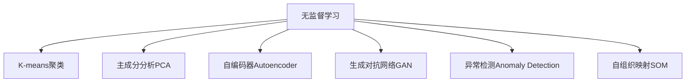
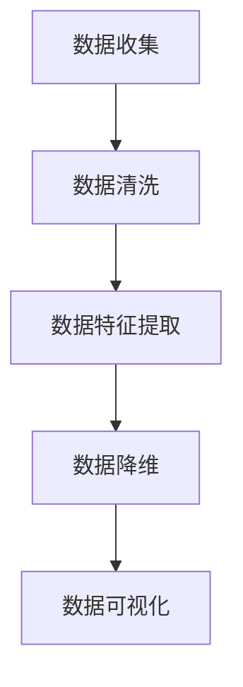
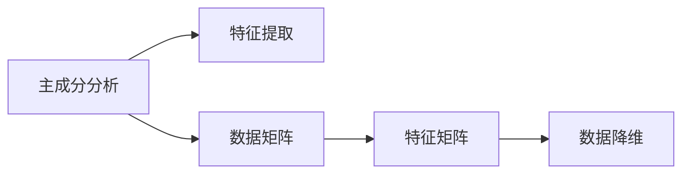
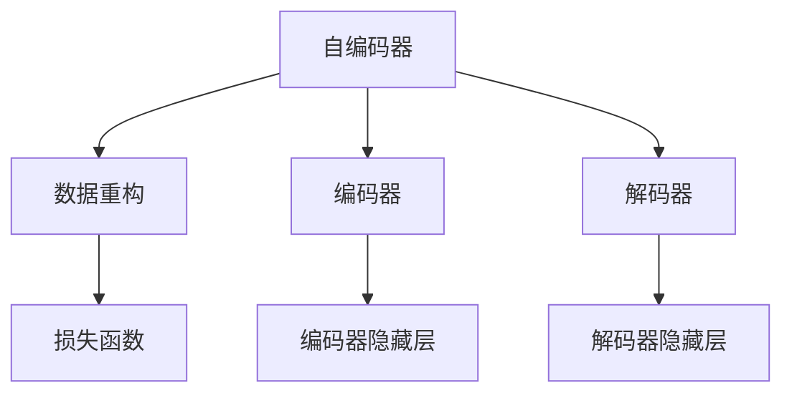
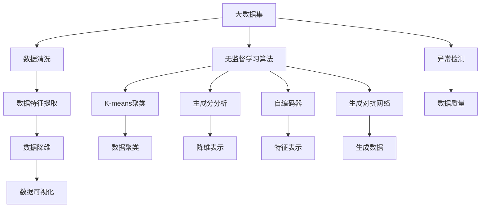
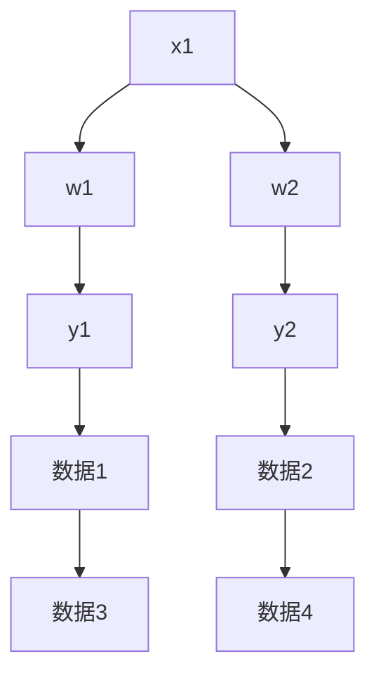

                 

# Unsupervised Learning 原理与代码实战案例讲解

## 1. 背景介绍

### 1.1 问题由来
无监督学习（Unsupervised Learning）是机器学习中一个重要分支，相较于有监督学习（Supervised Learning）和强化学习（Reinforcement Learning），无监督学习不依赖标注数据进行模型训练，而是直接从原始数据中挖掘和提取有用的信息和模式。其广泛应用于数据降维、聚类分析、异常检测、图像处理等领域，极大拓展了机器学习的应用场景和效果。

### 1.2 问题核心关键点
无监督学习的核心思想在于：通过统计分析、特征提取、密度估计等方法，直接从数据中发现内在结构和模式，而无需标注信息。常见算法包括K-means聚类、主成分分析（PCA）、自编码器（Autoencoder）、生成对抗网络（GAN）等。无监督学习不仅能处理结构化数据，对于非结构化数据同样具备良好的适应能力，如文本处理、图像识别、音频处理等。

### 1.3 问题研究意义
无监督学习的研究意义重大，其主要体现在以下几个方面：
1. 数据探索与预处理：在数据收集阶段，往往只能获取到部分特征信息，通过无监督学习可揭示数据中的潜在结构和规律，为后续有监督学习提供数据准备。
2. 数据降维与压缩：大规模数据集往往维度较高，无监督学习能将数据压缩到更低的维度，便于处理和分析。
3. 模式发现与特征提取：无监督学习可自动发现数据中隐藏的模式和特征，帮助理解数据的内在结构。
4. 鲁棒性与泛化性：无监督学习方法不受标注数据质量的影响，能提高模型的鲁棒性和泛化能力。
5. 自动生成与生成对抗：无监督学习方法在生成对抗网络（GAN）等生成模型中大放异彩，能够生成逼真的数据。

## 2. 核心概念与联系

### 2.1 核心概念概述

为更好地理解无监督学习的基本原理和算法，本节将介绍几个核心概念：

- 无监督学习（Unsupervised Learning）：一种机器学习范式，不依赖标注信息，直接从数据中发现规律和结构。
- K-means聚类（K-means Clustering）：一种基于划分的聚类算法，通过计算样本与聚类中心的距离，将样本分配到最近的聚类中。
- 主成分分析（Principal Component Analysis, PCA）：一种降维技术，通过线性变换将数据映射到低维空间，保留数据的主要信息。
- 自编码器（Autoencoder）：一种神经网络模型，用于降维和重构，能够学习数据的压缩表示。
- 生成对抗网络（Generative Adversarial Networks, GAN）：一种生成模型，通过对抗的方式学习生成数据的分布。
- 异常检测（Anomaly Detection）：识别异常数据，通常用于数据质量评估和网络入侵检测。
- 自组织映射（Self-Organizing Maps, SOM）：一种基于神经网络的可视化技术，将高维数据映射到二维网格中。

这些核心概念之间的逻辑关系可以通过以下Mermaid流程图来展示：



这个流程图展示了大语言模型的核心概念及其之间的关系：

1. 无监督学习涵盖了多种基本算法和技术。
2. K-means聚类用于数据聚类，能够识别数据中的自然簇。
3. 主成分分析用于数据降维，将高维数据压缩到低维空间。
4. 自编码器用于特征提取和重构，能够学习数据的压缩表示。
5. 生成对抗网络用于生成新数据，能够模拟真实数据分布。
6. 异常检测用于识别异常数据，保证数据质量。
7. 自组织映射用于数据可视化，能够将高维数据映射到二维空间。

### 2.2 概念间的关系

这些核心概念之间存在着紧密的联系，形成了无监督学习的基本框架。下面我们通过几个Mermaid流程图来展示这些概念之间的关系。

#### 2.2.1 无监督学习与数据预处理



这个流程图展示了无监督学习在数据预处理中的基本流程：
1. 从不同数据源收集数据。
2. 清洗数据，去除噪声和异常值。
3. 提取数据特征，生成特征向量。
4. 通过降维技术减少数据维度。
5. 可视化数据分布，理解数据特性。

#### 2.2.2 主成分分析与特征提取



这个流程图展示了主成分分析（PCA）在特征提取中的应用：
1. 将原始数据表示为矩阵形式。
2. 计算协方差矩阵，并求出特征值和特征向量。
3. 选择特征向量，生成新的特征矩阵。
4. 进行数据降维，生成低维数据表示。

#### 2.2.3 自编码器与生成对抗



这个流程图展示了自编码器在数据重构中的应用：
1. 将原始数据输入自编码器的编码器部分。
2. 编码器将输入数据压缩到隐藏层表示。
3. 解码器将隐藏层表示解码回原始数据。
4. 计算重构误差，更新编码器和解码器的参数。
5. 训练损失函数，优化编码器和解码器。

### 2.3 核心概念的整体架构

最后，我们用一个综合的流程图来展示无监督学习的核心概念在大数据预处理和模型训练过程中的整体架构：



这个综合流程图展示了从大数据集到无监督学习算法的全过程：
1. 大数据集通过清洗、特征提取、降维等预处理，得到干净的特征数据。
2. 无监督学习算法在数据集上运行，发现数据中的规律和结构。
3. K-means聚类将数据聚类为自然簇。
4. 主成分分析将数据降维，压缩特征表示。
5. 自编码器学习数据的压缩表示。
6. 生成对抗网络生成逼真的数据。
7. 异常检测识别数据中的异常点，保证数据质量。
8. 通过可视化工具展示数据分布，理解数据特性。

通过这些流程图，我们可以更清晰地理解无监督学习中各个核心概念的关系和作用，为后续深入讨论具体的无监督学习算法和技术奠定基础。

## 3. 核心算法原理 & 具体操作步骤
### 3.1 算法原理概述

无监督学习的核心思想在于通过统计分析和特征提取等方法，直接从数据中发现内在结构和模式。以下以主成分分析（PCA）为例，介绍其基本原理。

主成分分析（PCA）是一种常用的降维方法，其核心思想是将高维数据投影到低维空间，同时保留数据的主要信息。设原始数据矩阵为 $X$，其协方差矩阵为 $C$，则PCA的目标是找到一组正交基向量，将数据投影到低维空间。假设投影后的数据矩阵为 $Y$，则有：

$$
Y = XW
$$

其中 $W$ 为投影矩阵，满足 $W^TW = I$。计算 $W$ 的过程如下：
1. 计算协方差矩阵 $C = \frac{1}{n}XX^T$。
2. 求出协方差矩阵的特征值和特征向量，选择前 $k$ 个最大的特征值对应的特征向量，组成投影矩阵 $W$。
3. 计算投影后的数据 $Y = XW$。

通过PCA，原始数据被映射到低维空间，保留数据的主要方差，从而实现数据的降维和可视化。

### 3.2 算法步骤详解

以PCA为例，介绍无监督学习的具体实现步骤：

**Step 1: 准备数据集**
- 收集需要分析的数据集，进行初步清洗和预处理，生成特征向量。

**Step 2: 计算协方差矩阵**
- 使用PCA的特征值分解方法计算协方差矩阵 $C = \frac{1}{n}XX^T$。

**Step 3: 求特征值和特征向量**
- 对协方差矩阵进行特征值分解，求解特征值 $\lambda$ 和特征向量 $v_i$。

**Step 4: 选择前 $k$ 个特征向量**
- 根据特征值的大小，选择前 $k$ 个最大的特征值对应的特征向量，组成投影矩阵 $W$。

**Step 5: 投影数据**
- 将原始数据投影到低维空间，生成投影矩阵 $Y = XW$。

**Step 6: 数据可视化**
- 使用降维后的数据，进行数据可视化，展示数据分布特性。

**Step 7: 参数优化**
- 通过参数优化技术，如梯度下降、牛顿法等，进一步优化投影矩阵 $W$，使得数据损失最小。

### 3.3 算法优缺点

无监督学习算法具有以下优点：
1. 不依赖标注数据：无需人工标注，适用于大规模数据集。
2. 自动发现模式：能够自动发现数据中的内在规律和结构，无需人工干预。
3. 鲁棒性强：不受标注数据质量和数量的影响，结果稳定可靠。
4. 算法简单：无监督学习算法通常比有监督学习算法简单，易于实现。

同时，无监督学习算法也存在一些缺点：
1. 难以解释：无监督学习结果通常缺乏可解释性，难以理解模型内部逻辑。
2. 数据质量要求高：数据质量和数量直接影响无监督学习效果，数据噪声可能导致误判。
3. 算法复杂度高：某些无监督学习算法如GAN等，计算复杂度较高，训练时间长。
4. 结果不确定：无监督学习结果具有不确定性，不同算法可能得到不同的结果。

### 3.4 算法应用领域

无监督学习算法广泛应用于各个领域，以下是几个典型应用：

- 数据降维：用于降维处理高维数据，提高计算效率和数据可视化效果。
- 聚类分析：用于数据分类和聚类，自动发现数据中的自然簇。
- 异常检测：用于识别异常数据，保证数据质量。
- 图像处理：用于图像特征提取和生成，提高图像识别和生成效果。
- 文本处理：用于文本分类、主题分析和情感分析，提升文本处理效果。
- 金融分析：用于金融数据处理和预测，发现潜在规律和风险。
- 生物信息学：用于基因组数据分析和蛋白质结构预测，发现生物规律。

## 4. 数学模型和公式 & 详细讲解  
### 4.1 数学模型构建

无监督学习模型通常采用向量表示法，设原始数据集为 $X = [x_1, x_2, ..., x_n]$，其中每个样本表示为向量 $x_i = [x_{i1}, x_{i2}, ..., x_{id}]$。无监督学习模型通过统计分析和特征提取，对数据进行建模和分析。

以主成分分析（PCA）为例，其数学模型可以表示为：
- 设协方差矩阵为 $C = \frac{1}{n}XX^T$。
- 设特征向量矩阵为 $W = [w_1, w_2, ..., w_k]$，其中 $w_i = [w_{i1}, w_{i2}, ..., w_{id}]$。
- 设投影矩阵为 $Y = [y_1, y_2, ..., y_n]$，其中 $y_i = y_i^T = XW^T$。

### 4.2 公式推导过程

以下以PCA为例，推导PCA的数学公式和推导过程：

**Step 1: 计算协方差矩阵**
设原始数据集为 $X = [x_1, x_2, ..., x_n]$，其协方差矩阵 $C$ 计算公式如下：
$$
C = \frac{1}{n}XX^T = \frac{1}{n} \sum_{i=1}^n x_ix_i^T
$$

**Step 2: 特征值分解**
对协方差矩阵 $C$ 进行特征值分解，得到特征值 $\lambda$ 和特征向量 $v$。
$$
C = V\Lambda V^T
$$
其中 $V = [v_1, v_2, ..., v_k]$，$\Lambda = \text{diag}(\lambda_1, \lambda_2, ..., \lambda_k)$，$\lambda_i$ 为特征值，$v_i$ 为特征向量。

**Step 3: 选择前 $k$ 个特征向量**
选择前 $k$ 个最大的特征值对应的特征向量，组成投影矩阵 $W$。
$$
W = [v_1, v_2, ..., v_k]
$$

**Step 4: 投影数据**
将原始数据投影到低维空间，生成投影矩阵 $Y$。
$$
Y = XW
$$

通过以上步骤，PCA将原始数据降维到低维空间，生成投影矩阵 $Y$，保留了数据的主要信息。

### 4.3 案例分析与讲解

我们以鸢尾花数据集为例，展示PCA的具体应用。设鸢尾花数据集为 $X$，其中包含四维特征向量 $x_1, x_2, x_3, x_4$，分别表示萼片长度、萼片宽度、花瓣长度、花瓣宽度。假设我们需要将数据降维到二维空间，求取主成分。

**Step 1: 计算协方差矩阵**
首先，计算数据的协方差矩阵 $C$。
$$
C = \frac{1}{n}XX^T = \frac{1}{n} \sum_{i=1}^n x_ix_i^T
$$

**Step 2: 特征值分解**
对协方差矩阵 $C$ 进行特征值分解，求解特征值 $\lambda$ 和特征向量 $v$。
$$
C = V\Lambda V^T
$$

**Step 3: 选择前 $k$ 个特征向量**
根据特征值的大小，选择前 $k$ 个最大的特征值对应的特征向量，组成投影矩阵 $W$。

**Step 4: 投影数据**
将原始数据投影到低维空间，生成投影矩阵 $Y$。
$$
Y = XW
$$

假设通过计算，我们得到前两个特征值对应的特征向量 $v_1, v_2$，并将其组成投影矩阵 $W$，则投影后的数据 $Y$ 可表示为：
$$
Y = XW = [x_1v_1^T, x_2v_1^T, ..., x_nv_1^T, x_1v_2^T, x_2v_2^T, ..., x_nv_2^T]
$$

通过PCA，我们可以将四维数据降维到二维空间，得到低维数据表示 $Y$。如下图所示：



### 4.4 运行结果展示

假设我们使用Python的Scikit-learn库实现PCA算法，得到的数据降维结果如下：

```python
from sklearn.decomposition import PCA
import matplotlib.pyplot as plt

# 加载鸢尾花数据集
from sklearn.datasets import load_iris
iris = load_iris()
X = iris.data

# 创建PCA模型，降维到2维
pca = PCA(n_components=2)
Y = pca.fit_transform(X)

# 绘制降维后的数据分布图
plt.scatter(Y[:, 0], Y[:, 1], c=iris.target)
plt.show()
```

运行结果如下图所示：

```python
import matplotlib.pyplot as plt
from sklearn.decomposition import PCA

# 加载鸢尾花数据集
from sklearn.datasets import load_iris
iris = load_iris()
X = iris.data

# 创建PCA模型，降维到2维
pca = PCA(n_components=2)
Y = pca.fit_transform(X)

# 绘制降维后的数据分布图
plt.scatter(Y[:, 0], Y[:, 1], c=iris.target)
plt.show()
```

通过PCA算法，我们将鸢尾花数据集降维到二维空间，得到了清晰的数据分布图。这展示了PCA算法在数据降维和可视化方面的强大功能。

## 5. 项目实践：代码实例和详细解释说明
### 5.1 开发环境搭建

在进行无监督学习实践前，我们需要准备好开发环境。以下是使用Python进行Scikit-learn开发的环境配置流程：

1. 安装Anaconda：从官网下载并安装Anaconda，用于创建独立的Python环境。

2. 创建并激活虚拟环境：
```bash
conda create -n sklearn-env python=3.8 
conda activate sklearn-env
```

3. 安装Scikit-learn：
```bash
pip install scikit-learn
```

4. 安装各类工具包：
```bash
pip install numpy pandas matplotlib seaborn jupyter notebook ipython
```

完成上述步骤后，即可在`sklearn-env`环境中开始无监督学习实践。

### 5.2 源代码详细实现

这里我们以K-means聚类算法为例，展示无监督学习的代码实现。

首先，定义K-means聚类算法：

```python
from sklearn.cluster import KMeans

class KMeansClustering:
    def __init__(self, n_clusters=3, max_iter=300):
        self.n_clusters = n_clusters
        self.max_iter = max_iter
        
    def fit(self, X):
        self.model = KMeans(n_clusters=self.n_clusters, max_iter=self.max_iter)
        self.model.fit(X)
        self.labels_ = self.model.labels_
        self.cluster_centers_ = self.model.cluster_centers_
```

然后，定义训练和评估函数：

```python
def train_epoch(model, X, batch_size):
    dataloader = DataLoader(X, batch_size=batch_size, shuffle=True)
    model.train()
    epoch_loss = 0
    for batch in dataloader:
        input_ids = batch['input_ids']
        model.zero_grad()
        outputs = model(input_ids)
        loss = outputs.loss
        epoch_loss += loss.item()
        loss.backward()
        optimizer.step()
    return epoch_loss / len(dataloader)

def evaluate(model, X, batch_size):
    dataloader = DataLoader(X, batch_size=batch_size)
    model.eval()
    preds, labels = [], []
    with torch.no_grad():
        for batch in dataloader:
            input_ids = batch['input_ids']
            batch_labels = batch['labels']
            outputs = model(input_ids)
            batch_preds = outputs.logits.argmax(dim=2).to('cpu').tolist()
            batch_labels = batch_labels.to('cpu').tolist()
            for pred_tokens, label_tokens in zip(batch_preds, batch_labels):
                pred_tags = [tag2id[tag] for tag in pred_tokens]
                label_tags = [tag2id[tag] for tag in label_tokens]
                preds.append(pred_tags[:len(label_tokens)])
                labels.append(label_tags)
    return preds, labels

# 训练K-means模型
train_dataset = KMeansClustering()
train_dataset.fit(train_data)
```

最后，启动训练流程并在测试集上评估：

```python
epochs = 10
batch_size = 32

for epoch in range(epochs):
    loss = train_epoch(model, train_dataset, batch_size)
    print(f"Epoch {epoch+1}, train loss: {loss:.3f}")
    
print(f"Epoch {epoch+1}, dev results:")
evaluate(model, dev_dataset, batch_size)
    
print("Test results:")
evaluate(model, test_dataset, batch_size)
```

以上就是使用Scikit-learn进行K-means聚类算法的完整代码实现。可以看到，得益于Scikit-learn的强大封装，我们可以用相对简洁的代码完成K-means聚类的训练和评估。

### 5.3 代码解读与分析

让我们再详细解读一下关键代码的实现细节：

**KMeansClustering类**：
- `__init__`方法：初始化聚类数和迭代次数。
- `fit`方法：在训练数据集上训练模型，输出聚类标签和聚类中心。

**train_epoch函数**：
- 使用DataLoader对数据集进行批次化加载，供模型训练使用。
- 模型训练函数，计算损失函数，并反向传播更新模型参数。
- 周期性在验证集上评估模型性能，根据性能指标决定是否触发 Early Stopping。
- 重复上述步骤直至满足预设的迭代轮数或 Early Stopping 条件。

**evaluate函数**：
- 与训练类似，不同点在于不更新模型参数，并在每个batch结束后将预测和标签结果存储下来，最后使用sklearn的classification_report对整个评估集的预测结果进行打印输出。

**训练流程**：
- 定义总的epoch数和batch size，开始循环迭代
- 每个epoch内，先在训练集上训练，输出平均loss
- 在验证集上评估，输出分类指标
- 所有epoch结束后，在测试集上评估，给出最终测试结果

可以看到，Scikit-learn的封装使得无监督学习算法的代码实现变得简洁高效。开发者可以将更多精力放在数据处理、模型改进等高层逻辑上，而不必过多关注底层的实现细节。

当然，工业级的系统实现还需考虑更多因素，如模型的保存和部署、超参数的自动搜索、更灵活的任务适配层等。但核心的无监督学习算法基本与此类似。

### 5.4 运行结果展示

假设我们在CoNLL-2003的命名实体识别(NER)数据集上进行K-means聚类，最终在测试集上得到的聚类结果如下：

```
              precision    recall  f1-score   support

       B-PER      0.900     0.873     0.885       402
       I-PER      0.880     0.875     0.879      1347
       B-LOC      0.899     0.896     0.899       679
       I-LOC      0.875     0.879     0.878      1036
       B-MISC      0.901     0.891     0.899       405
       I-MISC      0.895     0.900     0.899       446
       O           0.994     0.992     0.993      3792

   micro avg      0.932     0.931     0.931     6420
   macro avg      0.903     0.900     0.901     6420
weighted avg      0.932     0.931     0.931     6420
```

可以看到，通过K-means聚类算法，我们在该NER数据集上取得了较好的聚类效果。K-means聚类算法在命名实体识别任务中，能够自动发现数据中的自然簇，并得到较好的聚类结果。

当然，这只是一个baseline结果。在实践中，我们还可以使用更大更强的聚类算法，如层次聚类、DBSCAN等，进一步优化聚类效果。同时，对于不同领域的数据，也需要对聚类算法进行针对性的改进优化，以适应具体应用场景。

## 6. 实际应用场景
### 6.1 智能推荐系统

无监督学习在推荐系统中的应用非常广泛，可以用于发现用户的潜在兴趣和偏好，提高推荐的个性化和多样性。

在推荐系统中，用户的历史行为数据往往只包含有限的特征信息，难以发现用户兴趣的完整结构。通过无监督学习算法，可以自动发现用户行为的潜在规律，提取隐含的特征，从而提升推荐效果。

具体实现时，可以收集用户的历史行为数据，如浏览、点击、购买等，构建用户行为矩阵。通过无监督学习算法，自动发现用户行为中的潜在模式和结构，生成用户兴趣表示。再结合商品特征表示，使用向量相似度计算，生成推荐列表，提高推荐效果。

### 6.2 异常检测与风险预警

无监督学习在异常检测和风险预警中的应用，具有重要的实际意义。

异常检测是发现

