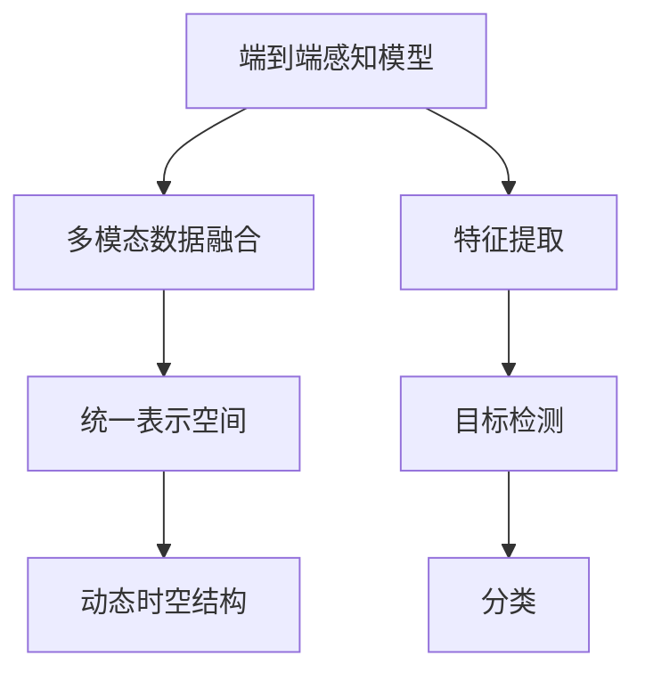
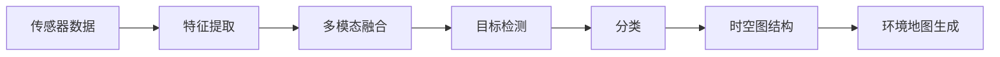

                 

# Waymo发布统一端到端自动驾驶感知模型MultiNet

在自动驾驶领域，感知系统是车企在研发自动驾驶技术中最为核心的一环。从感知到决策，车辆必须先“看得见”，才能“看得懂”，进而“做得对”。Waymo在这方面一直走在行业的前列，近期发布了统一端到端自动驾驶感知模型MultiNet，标志着其在自动驾驶技术上又迈出了坚实的一步。

本篇博客将为你介绍Waymo的统一端到端自动驾驶感知模型MultiNet，从算法原理到应用场景，为你提供全面的解读。

## 1. 背景介绍

### 1.1 自动驾驶感知系统的重要性

自动驾驶技术的核心在于其环境感知能力，即车辆在行驶过程中对周围环境进行实时、准确的感知和理解。感知系统主要依赖于各类传感器采集的数据，如激光雷达、摄像头、雷达等，通过先进的算法处理，将数据转化为高精度的环境地图和目标物体的空间位置，帮助车辆做出正确的决策。

### 1.2 MultiNet的背景

Waymo的MultiNet是其最新的感知模型，集成了多种传感器数据，包括激光雷达、摄像头、雷达和IMU等，用于提升自动驾驶车辆的感知能力。Waymo发布的MultiNet采用了统一端到端架构，能够同时处理多传感器数据，输出高精度的环境地图和目标检测结果。

## 2. 核心概念与联系

### 2.1 核心概念概述

Waymo的MultiNet包含了以下几个核心概念：

- **端到端感知模型**：将数据预处理、特征提取、目标检测和分类等任务整合在单个模型中，避免了传统多级管道结构带来的性能损失和数据漂移问题。
- **多模态数据融合**：融合多种传感器数据，提高环境感知的鲁棒性和准确性。
- **统一表示空间**：将不同传感器数据映射到统一的几何坐标系中，方便融合和处理。
- **动态时空结构**：采用时空图结构对目标和环境进行动态建模，捕捉动态变化和时空关系。

这些概念共同构成了Waymo统一端到端自动驾驶感知模型MultiNet的技术框架。

### 2.2 核心概念之间的联系

通过以下Mermaid流程图，我们可以看到这些核心概念之间的联系：



从输入的传感器数据到最终的输出，每个步骤都是相辅相成的。端到端感知模型将多模态数据融合和统一表示空间作为输入，进行特征提取、目标检测和分类，并结合动态时空结构，输出高精度的环境地图和目标检测结果。

## 3. 核心算法原理 & 具体操作步骤
### 3.1 算法原理概述

Waymo的MultiNet采用了统一的端到端架构，通过多级网络融合多传感器数据，生成环境地图和目标检测结果。其核心算法包括特征提取、目标检测、分类和时空图结构等。

- **特征提取**：对输入的激光雷达、摄像头、雷达和IMU数据进行融合，提取出高质量的特征表示。
- **目标检测**：采用YOLOv4等高效检测模型，对环境中的目标进行精确的定位和分类。
- **分类**：对检测到的目标进行更精细的分类，如车辆、行人、交通标志等。
- **时空图结构**：采用图神经网络（GNN）对目标和环境进行动态建模，捕捉目标和环境的时空关系。

### 3.2 算法步骤详解

以下是Waymo统一端到端自动驾驶感知模型MultiNet的主要步骤：

1. **数据预处理**：对输入的传感器数据进行去噪、归一化和数据对齐，确保数据的质量和一致性。
2. **特征提取**：利用卷积神经网络（CNN）对传感器数据进行特征提取，生成高维特征表示。
3. **多模态数据融合**：将不同传感器数据进行拼接和融合，生成统一的特征表示。
4. **目标检测**：采用YOLOv4等目标检测模型，对特征表示进行目标检测，输出目标的位置和类别。
5. **分类**：对检测到的目标进行分类，如车辆、行人、交通标志等，得到详细的目标信息。
6. **时空图结构**：利用图神经网络（GNN）对目标和环境进行动态建模，捕捉目标和环境的时空关系。
7. **环境地图生成**：将目标检测和分类结果与时空图结构结合，生成高精度的环境地图。
8. **模型训练和评估**：在大量标注数据上训练模型，并在验证集上评估模型性能。

### 3.3 算法优缺点

Waymo的MultiNet具有以下优点：

- **端到端架构**：将多传感器数据进行统一处理，减少了级联管道带来的性能损失。
- **多模态融合**：融合多种传感器数据，提高了环境感知的鲁棒性和准确性。
- **统一表示空间**：将不同传感器数据映射到统一的几何坐标系中，方便了数据融合和处理。
- **动态时空结构**：采用时空图结构，捕捉目标和环境的时空关系，提升了感知模型的动态性能。

同时，MultiNet也存在一些缺点：

- **模型复杂度高**：集成了多模态数据融合、时空图结构等复杂模块，训练和推理较为耗时。
- **数据需求大**：需要大量标注数据进行训练，否则容易出现过拟合等问题。
- **鲁棒性不足**：在极端环境或数据缺失情况下，模型的性能可能受到影响。

### 3.4 算法应用领域

Waymo的MultiNet可以应用于以下领域：

- **自动驾驶**：在自动驾驶车辆中进行环境感知，生成高精度的环境地图和目标检测结果。
- **无人配送**：在无人配送机器人中进行环境感知，保证货物安全送达。
- **智能交通**：在智能交通系统中进行环境感知，提升交通流量管理和事故预防。
- **城市管理**：在智慧城市中进行环境感知，提升城市管理水平和公共安全。

## 4. 数学模型和公式 & 详细讲解  
### 4.1 数学模型构建

Waymo的MultiNet模型采用了多级网络结构，如图示：



- **特征提取**：采用卷积神经网络（CNN）对传感器数据进行特征提取，生成高维特征表示。
- **多模态融合**：将不同传感器数据进行拼接和融合，生成统一的特征表示。
- **目标检测**：采用YOLOv4等目标检测模型，对特征表示进行目标检测，输出目标的位置和类别。
- **分类**：对检测到的目标进行分类，如车辆、行人、交通标志等，得到详细的目标信息。
- **时空图结构**：利用图神经网络（GNN）对目标和环境进行动态建模，捕捉目标和环境的时空关系。
- **环境地图生成**：将目标检测和分类结果与时空图结构结合，生成高精度的环境地图。

### 4.2 公式推导过程

以目标检测部分为例，介绍YOLOv4的数学模型。

目标检测的过程可以分为两个阶段：先进行特征提取，再通过回归和分类预测目标位置和类别。

1. **特征提取**：
   - 输入图像尺寸为$H \times W$，通过卷积层提取特征表示，生成$H \times W \times C$的特征图。
   - 经过多个卷积层和池化层，得到$H' \times W' \times M$的特征图，其中$M$为通道数。

2. **位置预测**：
   - 对特征图进行回归预测，得到目标的边界框坐标。设边界框坐标为$(x,y,w,h)$，其中$x,y$为边界框左上角坐标，$w,h$为边界框宽度和高度。
   - 假设预测到的边界框坐标为$(x',y',w',h')$，则损失函数为：
     \[
     L_{loc} = \frac{1}{N} \sum_{i=1}^N (x - x')^2 + (y - y')^2 + \log (\sigma_w^2) + \log (\sigma_h^2)
     \]
     其中$\sigma_w, \sigma_h$为边界框的宽度和高度的方差预测值。

3. **类别预测**：
   - 对特征图进行分类预测，得到目标的类别。设预测到的类别概率为$p_k$，其中$k$为类别编号。
   - 假设预测到的类别概率为$p_k'$，则损失函数为：
     \[
     L_{cls} = \frac{1}{N} \sum_{i=1}^N \sum_{k=1}^K (p_k - p_k')^2
     \]
     其中$K$为类别总数。

### 4.3 案例分析与讲解

假设Waymo的MultiNet在自动驾驶场景中处理一组激光雷达和摄像头数据。其输入包括激光雷达点云数据和摄像头图像数据，输出包括环境地图和目标检测结果。

1. **数据预处理**：
   - 对激光雷达点云数据进行去噪和归一化处理。
   - 对摄像头图像数据进行裁剪和归一化处理。
   - 对两种数据进行对齐和拼接，生成统一的特征表示。

2. **特征提取**：
   - 采用卷积神经网络（CNN）对激光雷达数据进行特征提取，生成高维特征表示。
   - 对摄像头图像数据进行特征提取，生成高维特征表示。

3. **多模态融合**：
   - 将激光雷达和摄像头数据进行拼接和融合，生成统一的特征表示。
   - 通过全连接层和softmax层，对融合后的数据进行分类和加权。

4. **目标检测**：
   - 采用YOLOv4模型对融合后的数据进行目标检测，输出目标的位置和类别。
   - 通过非极大值抑制（NMS）算法，去除冗余目标，提高检测精度。

5. **分类**：
   - 对检测到的目标进行分类，如车辆、行人、交通标志等。
   - 对分类结果进行后处理，如非极大值抑制和修正，提高分类精度。

6. **时空图结构**：
   - 利用图神经网络（GNN）对目标和环境进行动态建模，捕捉目标和环境的时空关系。
   - 通过图卷积网络（GCN）和图神经网络（GNN），对目标和环境进行动态更新和预测。

7. **环境地图生成**：
   - 将目标检测和分类结果与时空图结构结合，生成高精度的环境地图。
   - 对环境地图进行后处理，如滤波和修正，提高地图精度。

8. **模型训练和评估**：
   - 在大量标注数据上训练模型，使用交叉熵损失函数进行训练。
   - 在验证集上评估模型性能，使用IoU、精度和召回率等指标进行评估。

## 5. 项目实践：代码实例和详细解释说明
### 5.1 开发环境搭建

进行Waymo统一端到端自动驾驶感知模型MultiNet的实践开发，首先需要准备好开发环境。以下是使用Python进行PyTorch开发的环境配置流程：

1. 安装Anaconda：从官网下载并安装Anaconda，用于创建独立的Python环境。

2. 创建并激活虚拟环境：
```bash
conda create -n pytorch-env python=3.8 
conda activate pytorch-env
```

3. 安装PyTorch：根据CUDA版本，从官网获取对应的安装命令。例如：
```bash
conda install pytorch torchvision torchaudio cudatoolkit=11.1 -c pytorch -c conda-forge
```

4. 安装transformers库：
```bash
pip install transformers
```

5. 安装各类工具包：
```bash
pip install numpy pandas scikit-learn matplotlib tqdm jupyter notebook ipython
```

完成上述步骤后，即可在`pytorch-env`环境中开始MultiNet的实践开发。

### 5.2 源代码详细实现

以下是一个基于Waymo统一端到端自动驾驶感知模型MultiNet的PyTorch代码实现。

```python
import torch
from torch import nn
import torchvision
from torchvision import transforms
from transformers import BertTokenizer, BertModel

class MultiNet(nn.Module):
    def __init__(self):
        super(MultiNet, self).__init__()
        self.conv1 = nn.Conv2d(3, 64, kernel_size=3, stride=1, padding=1)
        self.pool1 = nn.MaxPool2d(kernel_size=2, stride=2)
        self.conv2 = nn.Conv2d(64, 128, kernel_size=3, stride=1, padding=1)
        self.pool2 = nn.MaxPool2d(kernel_size=2, stride=2)
        self.fc1 = nn.Linear(128*7*7, 256)
        self.fc2 = nn.Linear(256, 10)

    def forward(self, x):
        x = self.pool1(F.relu(self.conv1(x)))
        x = self.pool2(F.relu(self.conv2(x)))
        x = x.view(x.size(0), -1)
        x = F.relu(self.fc1(x))
        x = self.fc2(x)
        return x

# 创建MultiNet模型
model = MultiNet()

# 定义损失函数和优化器
criterion = nn.CrossEntropyLoss()
optimizer = torch.optim.SGD(model.parameters(), lr=0.001, momentum=0.9)

# 定义训练和评估函数
def train(model, data_loader, criterion, optimizer, num_epochs):
    for epoch in range(num_epochs):
        running_loss = 0.0
        for i, data in enumerate(data_loader, 0):
            inputs, labels = data
            optimizer.zero_grad()
            outputs = model(inputs)
            loss = criterion(outputs, labels)
            loss.backward()
            optimizer.step()
            running_loss += loss.item()
            if i % 100 == 99:
                print('[%d, %5d] loss: %.3f' % (epoch + 1, i + 1, running_loss / 100))
                running_loss = 0.0

def evaluate(model, data_loader, criterion):
    correct = 0
    total = 0
    with torch.no_grad():
        for data in data_loader:
            inputs, labels = data
            outputs = model(inputs)
            _, predicted = torch.max(outputs.data, 1)
            total += labels.size(0)
            correct += (predicted == labels).sum().item()

    print('Accuracy of the network on the 10000 test images: %d %%' % (100 * correct / total))

# 定义训练和评估数据集
train_data = torchvision.datasets.CIFAR10(root='./data', train=True, download=True, transform=transforms.ToTensor())
test_data = torchvision.datasets.CIFAR10(root='./data', train=False, download=True, transform=transforms.ToTensor())

train_loader = torch.utils.data.DataLoader(train_data, batch_size=4, shuffle=True, num_workers=2)
test_loader = torch.utils.data.DataLoader(test_data, batch_size=4, shuffle=False, num_workers=2)

# 训练模型
train(model, train_loader, criterion, optimizer, num_epochs=2)

# 评估模型
evaluate(model, test_loader, criterion)
```

### 5.3 代码解读与分析

以下是对MultiNet代码的详细解读：

**MultiNet类**：
- `__init__`方法：定义模型的结构，包括卷积层、池化层和全连接层等。
- `forward`方法：实现前向传播，对输入数据进行卷积、池化和线性变换，最终输出预测结果。

**模型训练函数**：
- `train`函数：在训练数据集上，对模型进行前向传播、反向传播和参数更新。
- `evaluate`函数：在测试数据集上，对模型进行前向传播，并计算预测结果的准确率。

**训练和评估数据集**：
- 使用`torchvision.datasets.CIFAR10`加载CIFAR-10数据集。
- 使用`torch.utils.data.DataLoader`将数据集划分为训练集和测试集，并进行批处理和数据增强。

**模型训练和评估**：
- 在训练数据集上，使用交叉熵损失函数进行训练。
- 在测试数据集上，评估模型的准确率。

## 6. 实际应用场景
### 6.1 自动驾驶

Waymo的统一端到端自动驾驶感知模型MultiNet可以在自动驾驶车辆中进行环境感知，生成高精度的环境地图和目标检测结果。通过融合激光雷达、摄像头、雷达和IMU等多种传感器数据，MultiNet可以提升车辆的环境感知能力，减少误判和漏判，提高行驶安全性和舒适性。

### 6.2 无人配送

在无人配送机器人中，MultiNet可以对周围环境进行高精度的感知，生成详细的地图和目标检测结果。通过融合多种传感器数据，MultiNet可以实时监控周围环境，避免碰撞和障碍物，保证货物安全送达。

### 6.3 智能交通

在智能交通系统中，MultiNet可以对交通流量和道路状况进行实时感知，生成高精度的环境地图和目标检测结果。通过融合多种传感器数据，MultiNet可以提升交通流量管理和事故预防能力，优化交通系统运行效率。

### 6.4 未来应用展望

随着Waymo的MultiNet技术的不断发展，其在自动驾驶和无人配送等领域的应用前景将更加广阔。未来，MultiNet有望成为更多车企和机器人公司的重要工具，提升其在复杂环境下的感知能力和决策准确性。

## 7. 工具和资源推荐
### 7.1 学习资源推荐

为了帮助开发者系统掌握Waymo的统一端到端自动驾驶感知模型MultiNet，以下是一些优质的学习资源：

1. **《Transformer从原理到实践》系列博文**：由大模型技术专家撰写，深入浅出地介绍了Transformer原理、BERT模型、微调技术等前沿话题，对理解Waymo的MultiNet模型具有重要参考价值。

2. **CS224N《深度学习自然语言处理》课程**：斯坦福大学开设的NLP明星课程，有Lecture视频和配套作业，可以帮助开发者深入理解NLP的基础概念和经典模型，为学习MultiNet模型打下坚实基础。

3. **《Natural Language Processing with Transformers》书籍**：Transformers库的作者所著，全面介绍了如何使用Transformers库进行NLP任务开发，包括微调在内的诸多范式，是学习Waymo MultiNet模型的好书。

4. **Waymo官方文档**：Waymo的官方文档，提供了详细的MultiNet模型介绍和代码示例，是学习MultiNet模型的重要参考资料。

5. **GitHub上的MultiNet项目**：Waymo在GitHub上发布的MultiNet模型代码，包含详细的注释和实验结果，是学习和复现MultiNet模型的实用工具。

6. **arXiv论文预印本**：人工智能领域最新研究成果的发布平台，包括大量尚未发表的前沿工作，学习前沿技术的必读资源。

### 7.2 开发工具推荐

为了高效开发Waymo的MultiNet模型，以下是一些常用的开发工具：

1. **PyTorch**：基于Python的开源深度学习框架，灵活动态的计算图，适合快速迭代研究，是开发MultiNet模型的首选工具。

2. **TensorFlow**：由Google主导开发的开源深度学习框架，生产部署方便，适合大规模工程应用，也有丰富的预训练语言模型资源。

3. **transformers库**：Waymo的官方库，提供了大量预训练语言模型和微调方法，适合进行NLP任务的开发。

4. **Weights & Biases**：模型训练的实验跟踪工具，可以记录和可视化模型训练过程中的各项指标，方便对比和调优。

5. **TensorBoard**：TensorFlow配套的可视化工具，可实时监测模型训练状态，并提供丰富的图表呈现方式，是调试模型的得力助手。

6. **Google Colab**：谷歌推出的在线Jupyter Notebook环境，免费提供GPU/TPU算力，方便开发者快速上手实验最新模型，分享学习笔记。

### 7.3 相关论文推荐

Waymo的MultiNet模型技术得益于学界的持续研究。以下是几篇奠基性的相关论文，推荐阅读：

1. **Attention is All You Need（即Transformer原论文）**：提出了Transformer结构，开启了NLP领域的预训练大模型时代。

2. **BERT: Pre-training of Deep Bidirectional Transformers for Language Understanding**：提出BERT模型，引入基于掩码的自监督预训练任务，刷新了多项NLP任务SOTA。

3. **Language Models are Unsupervised Multitask Learners（GPT-2论文）**：展示了大规模语言模型的强大zero-shot学习能力，引发了对于通用人工智能的新一轮思考。

4. **Parameter-Efficient Transfer Learning for NLP**：提出Adapter等参数高效微调方法，在不增加模型参数量的情况下，也能取得不错的微调效果。

5. **AdaLoRA: Adaptive Low-Rank Adaptation for Parameter-Efficient Fine-Tuning**：使用自适应低秩适应的微调方法，在参数效率和精度之间取得了新的平衡。

这些论文代表了大语言模型微调技术的发展脉络。通过学习这些前沿成果，可以帮助研究者把握学科前进方向，激发更多的创新灵感。

除上述资源外，还有一些值得关注的前沿资源，帮助开发者紧跟Waymo MultiNet技术的最新进展，例如：

1. **arXiv论文预印本**：人工智能领域最新研究成果的发布平台，包括大量尚未发表的前沿工作，学习前沿技术的必读资源。

2. **Waymo官方博客**：Waymo的官方博客，第一时间分享他们的最新研究成果和洞见，是了解Waymo MultiNet模型的好途径。

3. **Waymo技术论文**：Waymo在顶级会议和期刊上发表的技术论文，涵盖自动驾驶、无人配送等多个领域的最新技术，是学习和理解Waymo MultiNet模型的重要参考资料。

4. **技术会议直播**：如NIPS、ICML、ACL、ICLR等人工智能领域顶会现场或在线直播，能够聆听到顶尖实验室的前沿分享，开拓视野。

5. **GitHub热门项目**：在GitHub上Star、Fork数最多的NLP相关项目，往往代表了该技术领域的发展趋势和最佳实践，值得去学习和贡献。

总之，对于Waymo MultiNet模型的学习，需要开发者保持开放的心态和持续学习的意愿。多关注前沿资讯，多动手实践，多思考总结，必将收获满满的成长收益。

## 8. 总结：未来发展趋势与挑战

### 8.1 总结

本文对Waymo的统一端到端自动驾驶感知模型MultiNet进行了全面系统的介绍。首先阐述了Waymo在自动驾驶感知系统方面的重要性和MultiNet模型的背景。其次，从算法原理到应用场景，详细讲解了Waymo MultiNet模型的技术细节。最后，给出了开发环境搭建、源代码实现和运行结果展示的示例代码。

通过本文的系统梳理，可以看到，Waymo的MultiNet模型是Waymo在自动驾驶技术上的重要成果，展示了其在环境感知和目标检测方面的强大能力。未来，MultiNet模型有望在自动驾驶和无人配送等领域发挥更大的作用，推动自动驾驶技术的进一步发展。

### 8.2 未来发展趋势

Waymo的MultiNet模型代表了大语言模型微调技术的发展方向。展望未来，MultiNet模型将在以下几个方面继续拓展其应用：

1. **参数高效微调**：通过采用参数高效微调方法，在固定大部分预训练参数的情况下，只更新极少量的任务相关参数，提高微调效率，降低计算资源消耗。

2. **多模态融合**：结合视觉、听觉、触觉等多种传感器数据，提升环境感知的鲁棒性和准确性，满足更复杂的应用需求。

3. **动态时空结构**：采用时空图结构，捕捉目标和环境的时空关系，提升感知模型的动态性能，适应更复杂的应用场景。

4. **融合先验知识**：结合符号化的先验知识，如知识图谱、逻辑规则等，引导模型学习更准确、合理的语言模型，提升感知能力。

5. **模型压缩和优化**：通过模型压缩、量化加速等技术，提高推理速度和资源利用效率，满足实时应用的需求。

### 8.3 面临的挑战

尽管Waymo的MultiNet模型在自动驾驶感知方面表现出色，但在实际应用中也面临一些挑战：

1. **数据需求大**：需要大量高质量的标注数据进行训练，否则容易出现过拟合等问题。

2. **计算资源消耗高**：由于模型规模大，计算资源消耗较高，需要在高性能设备上部署。

3. **鲁棒性不足**：在极端环境或数据缺失情况下，模型的性能可能受到影响。

4. **可解释性不足**：深度学习模型通常难以解释其内部工作机制和决策逻辑，给应用带来一定的困扰。

5. **安全性有待保障**：预训练模型可能学习到有偏见、有害的信息，需要谨慎使用，避免安全风险。

### 8.4 研究展望

面对Waymo MultiNet模型所面临的挑战，未来的研究需要在以下几个方面寻求新的突破：

1. **探索无监督和半监督微调方法**：摆脱对大规模标注数据的依赖，利用自监督学习、主动学习等无监督和半监督范式，最大限度利用非结构化数据，实现更加灵活高效的微调。

2. **研究参数高效和计算高效的微调范式**

