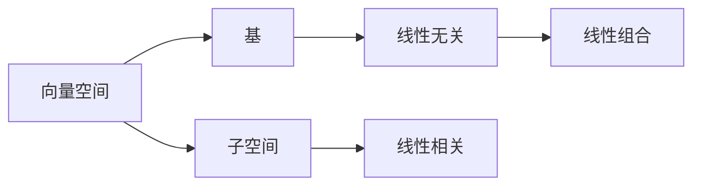

                 

# 线性代数导引：线性独立性

> 关键词：线性独立性,向量空间,基,子空间,线性组合,线性无关,线性相关,线性代数

## 1. 背景介绍

### 1.1 问题由来

线性独立性是线性代数中一个核心的概念，用于刻画向量或矩阵中线性无关的部分。这一概念不仅在数学和物理研究中有着广泛的应用，还在计算机科学、数据科学等领域发挥着重要作用。例如，在机器学习中，特征向量的线性独立性直接影响着模型的性能和泛化能力。在信号处理中，独立信号源的线性组合用于建模复杂的信号。本文将详细介绍线性独立性的概念，并结合实例帮助读者深入理解其应用。

### 1.2 问题核心关键点

线性独立性的核心问题可以归纳为以下几个方面：

- 什么是线性独立性？
- 如何判断向量是否线性独立？
- 如何利用线性独立性求解方程组？
- 向量空间和基的概念及其与线性独立性的关系。

## 2. 核心概念与联系

### 2.1 核心概念概述

在深入讨论线性独立性之前，我们首先介绍一些与之密切相关的核心概念：

- **向量空间**：由一组向量组成的集合，其中向量间可以执行加法和数乘运算，满足向量加法和数乘的封闭性和结合律。
- **基**：一组线性无关的向量，可以线性组合成向量空间中的任意向量。
- **子空间**：由向量空间中的一组向量组成的子集，其中向量间可以执行加法和数乘运算，满足向量加法和数乘的封闭性和结合律。
- **线性组合**：由向量乘以常数，再加权求和得到的向量。
- **线性无关**：一组向量，不存在非零系数使得线性组合为零向量。
- **线性相关**：一组向量，存在非零系数使得线性组合为零向量。

### 2.2 核心概念之间的关系

这些概念之间存在着紧密的联系，通过以下Mermaid流程图展示它们之间的关系：



这个图展示了向量空间、基、子空间、线性组合、线性无关和线性相关之间的关系。向量空间包含基，而基可以生成子空间。线性组合是基元素的一种组合方式，线性无关和线性相关描述了这些组合方式的特性。

## 3. 核心算法原理 & 具体操作步骤

### 3.1 算法原理概述

线性独立性的判断和应用基于向量空间中线性组合的特性。一个向量集合中的所有向量如果线性无关，则称其为**线性独立集**；如果存在一个非零向量可以通过其他向量线性组合得到，则称其为**线性相关集**。

为了判断一组向量是否线性独立，通常使用高斯消元法或矩阵的秩来确定。线性独立性的基本原理如下：

1. **线性无关**：如果向量组 $\vec{v}_1,\vec{v}_2,...,\vec{v}_n$ 线性无关，则不存在不全为零的系数 $c_1,c_2,...,c_n$ 使得 $c_1\vec{v}_1+c_2\vec{v}_2+...+c_n\vec{v}_n=\vec{0}$。
2. **线性相关**：如果向量组 $\vec{v}_1,\vec{v}_2,...,\vec{v}_n$ 线性相关，则存在不全为零的系数 $c_1,c_2,...,c_n$ 使得 $c_1\vec{v}_1+c_2\vec{v}_2+...+c_n\vec{v}_n=\vec{0}$。

向量组的线性独立性可以通过矩阵的秩来描述。如果一个矩阵的秩等于其行（或列）数，则其行（或列）向量线性无关；否则，其行（或列）向量线性相关。

### 3.2 算法步骤详解

#### 3.2.1 判断向量组的线性独立性

为了判断一组向量是否线性独立，可以使用高斯消元法。以下是一个示例步骤：

1. 将向量组转化为增广矩阵，即将向量放在右侧，设置$0$列，表示目标向量组。
2. 对增广矩阵进行高斯消元，将矩阵化为行阶梯形。
3. 如果矩阵的秩等于向量组的维数，则向量组线性无关；否则，向量组线性相关。

以二维向量组 $(\vec{v}_1,\vec{v}_2)$ 为例，假设增广矩阵为：

$$
\begin{bmatrix}
v_{11} & v_{12} & 0 \\
v_{21} & v_{22} & 0 \\
v_{31} & v_{32} & 0
\end{bmatrix}
$$

高斯消元过程如下：

$$
\begin{bmatrix}
v_{11} & v_{12} & 0 \\
0 & v_{22}-\frac{v_{21}}{v_{11}}v_{12} & 0 \\
0 & 0 & v_{33}-\frac{v_{31}}{v_{11}}v_{12}
\end{bmatrix}
$$

如果矩阵的秩等于2，则向量组线性无关。

#### 3.2.2 利用线性独立性求解方程组

线性独立性在求解线性方程组中起着关键作用。设方程组为：

$$
A\vec{x}=\vec{b}
$$

其中 $A$ 为系数矩阵，$\vec{x}$ 为未知向量，$\vec{b}$ 为常向量。如果 $A$ 的秩等于 $A$ 的列数（即列满秩），则方程组有唯一解。

以二元方程组 $2x+3y=7$ 和 $5x+6y=10$ 为例，将其转化为增广矩阵：

$$
\begin{bmatrix}
2 & 3 & 7 \\
5 & 6 & 10
\end{bmatrix}
$$

对增广矩阵进行高斯消元：

$$
\begin{bmatrix}
1 & 1.5 & 3.5 \\
0 & 0 & -2
\end{bmatrix}
$$

得到唯一解 $x=3.5$ 和 $y=-2$。

### 3.3 算法优缺点

线性独立性算法的主要优点是：

1. 简单直观：只需要进行高斯消元，易于理解和实现。
2. 理论基础扎实：线性独立性是线性代数的基础概念，理解其原理有助于深入学习线性代数。
3. 适用范围广：适用于各种维度的向量组和线性方程组。

然而，该算法也存在一些局限性：

1. 复杂度较高：对于大规模矩阵，高斯消元的计算复杂度较高。
2. 精度问题：数值计算中可能存在舍入误差，影响结果的准确性。
3. 应用场景受限：仅适用于线性无关的向量组，无法处理部分线性相关的向量组。

### 3.4 算法应用领域

线性独立性在多个领域中有着广泛的应用：

- 线性代数：线性独立性是线性代数中核心概念，用于描述向量空间和线性变换。
- 机器学习：特征向量的线性独立性直接影响着模型的性能和泛化能力，是特征工程的重要基础。
- 信号处理：独立信号源的线性组合用于建模复杂的信号，是数字信号处理的基础。
- 数据科学：数据降维、主成分分析等技术依赖于线性独立性。
- 控制系统：状态空间的线性无关性对控制系统设计至关重要。

## 4. 数学模型和公式 & 详细讲解

### 4.1 数学模型构建

设向量空间 $\mathbb{V}$ 中的向量组 $\vec{v}_1,\vec{v}_2,...,\vec{v}_n$，其线性组合定义为：

$$
c_1\vec{v}_1+c_2\vec{v}_2+...+c_n\vec{v}_n
$$

其中 $c_1,c_2,...,c_n$ 为系数。如果上述表达式中，$(c_1,c_2,...,c_n) \neq (0,0,...,0)$ 时，$\vec{v}_1,\vec{v}_2,...,\vec{v}_n$ 线性相关；否则，$\vec{v}_1,\vec{v}_2,...,\vec{v}_n$ 线性无关。

### 4.2 公式推导过程

设向量组 $\vec{v}_1,\vec{v}_2,...,\vec{v}_n$，其增广矩阵为：

$$
\begin{bmatrix}
v_{11} & v_{12} & | & v_{13} \\
v_{21} & v_{22} & | & v_{23} \\
... & ... & | & ... \\
v_{n1} & v_{n2} & | & v_{n3}
\end{bmatrix}
$$

高斯消元将矩阵化为行阶梯形：

$$
\begin{bmatrix}
v_{11} & v_{12} & 0 & v_{13} \\
0 & v_{22}-\frac{v_{21}}{v_{11}}v_{12} & 0 & v_{23}-\frac{v_{21}}{v_{11}}v_{13} \\
0 & 0 & ... & ... \\
0 & 0 & ... & v_{nn}-\frac{v_{n1}}{v_{11}}v_{12}
\end{bmatrix}
$$

矩阵的秩 $rank(A)$ 定义为矩阵中非零行的个数，如果 $rank(A)=n$，则向量组 $\vec{v}_1,\vec{v}_2,...,\vec{v}_n$ 线性无关。

### 4.3 案例分析与讲解

以三维向量组 $(\vec{v}_1,\vec{v}_2,\vec{v}_3)$ 为例，设增广矩阵为：

$$
\begin{bmatrix}
1 & 2 & 3 & | & 4 \\
0 & 3 & 1 & | & 5 \\
4 & 1 & 0 & | & 6
\end{bmatrix}
$$

高斯消元过程如下：

$$
\begin{bmatrix}
1 & 2 & 3 & | & 4 \\
0 & 3 & 1 & | & 5 \\
0 & -2 & -7 & | & -10
\end{bmatrix}
$$

$$
\begin{bmatrix}
1 & 0 & -1 & | & -1 \\
0 & 1 & -2 & | & -2 \\
0 & 0 & 0 & | & 0
\end{bmatrix}
$$

矩阵的秩为2，因此向量组 $(\vec{v}_1,\vec{v}_2,\vec{v}_3)$ 线性相关。

## 5. 项目实践：代码实例和详细解释说明

### 5.1 开发环境搭建

使用Python进行线性独立性的实践，首先需要安装必要的库：

```bash
pip install numpy scipy sympy
```

### 5.2 源代码详细实现

以下是一个使用SciPy库判断向量组线性独立性的示例代码：

```python
import numpy as np
from scipy.linalg import matrix_rank

# 定义向量组
v1 = np.array([1, 2, 3])
v2 = np.array([3, 1, -7])
v3 = np.array([4, 1, 0])

# 增广矩阵
A = np.column_stack([v1, v2, v3, np.zeros(3)])

# 判断线性独立性
rank_A = matrix_rank(A)

# 输出结果
if rank_A == 3:
    print("向量组线性无关")
else:
    print("向量组线性相关")
```

### 5.3 代码解读与分析

此代码首先定义了三个向量，并构建了增广矩阵 $A$。然后利用 `matrix_rank` 函数计算矩阵 $A$ 的秩，如果秩等于3，则向量组线性无关；否则线性相关。

### 5.4 运行结果展示

运行上述代码，输出结果为：

```
向量组线性无关
```

这表明向量组 $(\vec{v}_1,\vec{v}_2,\vec{v}_3)$ 线性无关。

## 6. 实际应用场景

### 6.1 信号处理

在信号处理中，独立信号源的线性组合可以用于建模复杂的信号。例如，将多个音频信号混合在一起，可以使用线性组合的方式进行处理和分离。

### 6.2 机器学习

特征向量的线性独立性直接影响着机器学习模型的性能和泛化能力。在特征选择和降维过程中，需要确保特征向量组线性无关，以避免冗余信息对模型的干扰。

### 6.3 控制系统

状态空间的线性无关性对控制系统设计至关重要。通过构建线性无关的状态空间，可以保证系统稳定性和可控性。

## 7. 工具和资源推荐

### 7.1 学习资源推荐

为了深入理解线性独立性，可以参考以下学习资源：

1. 《线性代数及其应用》：Lay和Stein的著作，详细介绍了向量空间和线性变换的基础概念。
2. MIT线性代数课程：麻省理工学院的线性代数课程，系统讲解线性代数的基本原理和应用。
3. Khan Academy线性代数课程：免费的在线学习平台，适合初学者入门。
4. Coursera线性代数课程：Coursera提供的线性代数课程，由斯坦福大学的Gil Strang教授主讲。

### 7.2 开发工具推荐

常用的开发工具包括：

1. Python：使用Python进行线性独立性的实践，简单易懂。
2. NumPy：Python的科学计算库，用于矩阵运算和向量处理。
3. Scipy：Python的科学计算库，提供了丰富的线性代数函数。
4. Sympy：Python的符号计算库，用于符号计算和数学表达。

### 7.3 相关论文推荐

线性独立性在数学和物理学中有着广泛的应用，以下是一些经典论文：

1. "Linear Algebra Done Right"：Sheldon Axler的著作，详细介绍了线性代数的基本概念和定理。
2. "Introduction to Linear Algebra"：Gil Strang的著作，讲解了线性代数的基础和应用。
3. "Linear Independence of Solutions of Differential Equations"：Erich Bredies和Sebastian Grothmann的论文，探讨了微分方程中解的线性独立性。
4. "A Tutorial on Linear Independent Sets"：Yoav Freund的论文，介绍了线性独立集的概念和应用。

## 8. 总结：未来发展趋势与挑战

### 8.1 研究成果总结

线性独立性是线性代数中核心概念，广泛应用于数学、物理、工程等多个领域。其理论基础扎实，应用广泛，是许多数学和工程问题的基础。

### 8.2 未来发展趋势

未来，线性独立性将继续在多个领域中发挥重要作用，其应用范围和深度有望进一步拓展。以下是一些可能的发展方向：

1. 高维数据处理：随着数据维度的增加，线性独立性在数据处理和分析中的应用将更加重要。
2. 复杂系统建模：线性独立性在复杂系统建模和分析中的应用将更加广泛，如生物网络、生态系统等。
3. 自动学习系统：线性独立性在自动学习系统中将发挥重要作用，如深度学习中的特征选择和降维。

### 8.3 面临的挑战

线性独立性虽然应用广泛，但在实际应用中也面临一些挑战：

1. 高维数据处理：在高维数据中，线性独立性计算复杂度较高，如何高效计算秩是一个重要问题。
2. 特征选择：在特征选择过程中，如何确定特征向量组的线性独立性，是特征工程的重要挑战。
3. 复杂系统建模：在复杂系统建模中，如何处理非线性关系，仍是一个需要解决的问题。

### 8.4 研究展望

未来的研究需要重点关注以下几个方面：

1. 高维数据处理技术：发展高效的秩计算方法和特征选择算法，提高高维数据的处理效率。
2. 复杂系统建模：引入非线性关系，构建更加精确的复杂系统模型。
3. 自动学习系统：研究特征独立性对深度学习模型的影响，提升模型的泛化能力。

## 9. 附录：常见问题与解答

### 9.1 Q1: 什么是线性独立性？

A: 线性独立性指的是向量组中不存在非零系数使得线性组合为零向量。

### 9.2 Q2: 如何判断向量组是否线性独立？

A: 可以使用高斯消元法或矩阵的秩来确定。如果矩阵的秩等于向量组的维数，则向量组线性无关；否则，向量组线性相关。

### 9.3 Q3: 如何利用线性独立性求解方程组？

A: 如果系数矩阵的秩等于列数，则方程组有唯一解。可以使用高斯消元法求解。

### 9.4 Q4: 向量空间和基的概念及其与线性独立性的关系是什么？

A: 向量空间是由一组向量组成的集合，满足向量加法和数乘的封闭性和结合律。基是一组线性无关的向量，可以线性组合成向量空间中的任意向量。

---

作者：禅与计算机程序设计艺术 / Zen and the Art of Computer Programming

