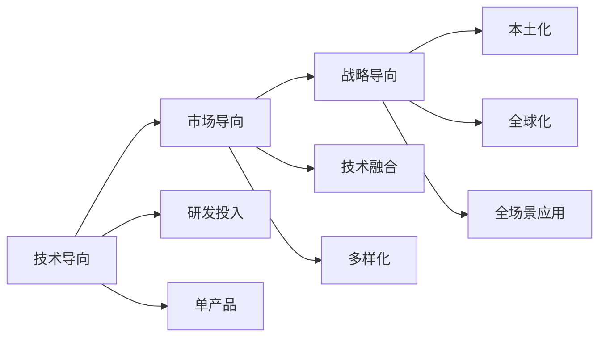

                 

# AI创业公司的商业模式变迁

> 关键词：AI创业公司,商业模式,技术变革,市场机遇,数字化转型

## 1. 背景介绍

### 1.1 问题由来
过去几十年，全球科技创新日新月异，尤其是人工智能(AI)技术的迅猛发展，给各行各业带来了颠覆性的变革。AI技术从实验室走向产业化，催生了大量AI创业公司。这些公司大多由一群技术专家和投资者组成，致力于开发前沿的AI算法和应用，推动技术进步。

然而，随着AI技术的不断演进，AI创业公司的商业模式也发生了显著变化。从初期的技术导向型创业，逐步转向市场导向型创业，再到如今的战略导向型创业，AI创业公司在商业模式的变迁过程中，不断适应市场变化，优化资源配置，提升企业竞争力。

### 1.2 问题核心关键点
AI创业公司商业模式的变迁，主要体现在以下几个方面：
1. **技术导向到市场导向**：早期AI创业公司更多关注技术创新和算法优化，忽视市场需求和用户反馈，导致产品市场化难度大，商业化进程缓慢。
2. **市场细分到全场景应用**：随着AI技术逐渐成熟，AI创业公司开始关注市场细分，探索不同行业和场景的应用可能性。
3. **研发投入到技术融合**：AI创业公司逐渐从单一的研发投入，转向技术与业务、运营、市场等各个环节的深度融合，提升整体竞争力。
4. **本土化到全球化**：AI创业公司从初期主要面向国内市场，逐步拓展到全球市场，形成国际化的运营能力。

## 2. 核心概念与联系

### 2.1 核心概念概述

为更好地理解AI创业公司的商业模式变迁，本节将介绍几个密切相关的核心概念：

- **AI创业公司**：专注于AI技术研究和应用的创业公司，旨在通过技术创新解决实际问题，实现商业价值。
- **商业模式**：企业盈利、增长和发展的基本模式，包括产品策略、市场策略、盈利策略等。
- **技术导向**：初创公司更多关注技术创新，追求算法突破和性能提升，较少考虑市场需求和商业化路径。
- **市场导向**：公司更多关注市场需求和用户反馈，根据市场变化调整产品策略，寻求商业化机会。
- **战略导向**：公司更注重战略规划和长远发展，强调技术与业务的深度融合，打造综合竞争力。

这些核心概念之间存在着紧密的联系，共同构成了AI创业公司商业模式的演进路径：

从技术导向到市场导向，再到战略导向，AI创业公司的商业模式逐渐从单一的技术创新转向全面的市场竞争，从本土化拓展到全球化，从单一的研发投入转向技术与业务的深度融合。这一变迁过程，不仅反映了AI技术的演进轨迹，也体现了市场需求的驱动作用。

### 2.2 概念间的关系

这些核心概念之间的关系可以通过以下Mermaid流程图来展示：



这个流程图展示了大语言模型微调过程中各个核心概念之间的关系：

1. 技术导向的AI创业公司更多关注技术创新，追求算法突破。
2. 随着市场需求的变化，公司逐渐转向市场导向，关注用户需求和反馈。
3. 战略导向的AI创业公司更注重战略规划和长远发展，强调技术与业务的深度融合。
4. 技术导向的公司往往是从单产品出发，逐渐拓展到多产品和全场景应用。
5. 市场导向的公司注重本土化，逐步拓展到全球市场，形成国际化运营能力。

通过这些流程图，我们可以更清晰地理解AI创业公司商业模式的演进过程。

## 3. 核心算法原理 & 具体操作步骤
### 3.1 算法原理概述

AI创业公司的商业模式变迁，主要受到以下几个因素驱动：

- **市场需求变化**：随着社会经济的发展和科技的进步，市场需求也在不断变化。AI创业公司需要紧跟市场需求变化，调整产品策略，以应对市场的动态性。
- **技术演进**：AI技术从实验室走向产业化，不断推动技术创新和应用场景的拓展，催生了新的商业模式和市场机会。
- **资本运作**：AI创业公司需要大量资金支持技术研发和市场推广，资本运作模式的变化也深刻影响其商业模式。
- **全球化竞争**：AI技术的全球化应用，使得市场竞争更加激烈。AI创业公司需要在全球范围内寻找新的市场机会，提升竞争力。

这些因素共同作用，推动AI创业公司的商业模式从技术导向向市场导向，再到战略导向的变迁。

### 3.2 算法步骤详解

AI创业公司商业模式的变迁，主要包括以下几个关键步骤：

**Step 1: 技术创新与产品开发**
- 团队成立：组建一支由技术专家、创业者组成的团队，专注于AI技术的研发。
- 技术突破：在特定领域或技术上进行深入研究，实现算法突破和性能提升。
- 产品开发：将技术成果转化为产品原型，进行内部测试和改进。

**Step 2: 市场需求分析与产品迭代**
- 市场需求调研：通过市场调研、用户访谈等方式，了解市场需求和用户痛点。
- 产品迭代：根据市场需求调整产品策略，进行产品迭代和改进。
- 用户反馈：收集用户反馈，优化产品功能和服务。

**Step 3: 市场推广与商业化**
- 市场推广：通过广告、公关、展会等方式，推广产品和服务，提升品牌知名度。
- 销售渠道：建立线上线下销售渠道，提供产品和服务。
- 盈利模式：选择适合的盈利模式，如订阅、按需付费、广告等。

**Step 4: 战略规划与业务扩展**
- 战略规划：制定长期发展战略，明确公司的定位和方向。
- 业务扩展：在已有产品基础上，探索新的产品和服务，拓展业务范围。
- 国际拓展：逐步拓展全球市场，形成国际化的运营能力。

### 3.3 算法优缺点

AI创业公司商业模式的变迁，有以下几个主要优点：

1. **快速响应市场需求**：技术导向的商业模式，使得公司能够快速响应市场变化，推出新产品，满足用户需求。
2. **创新驱动发展**：技术创新是AI创业公司的核心竞争力，推动公司持续前进，不断突破技术边界。
3. **多元化产品布局**：市场导向的商业模式，帮助公司进行产品多元化布局，拓展更多业务领域。
4. **国际化市场开拓**：战略导向的商业模式，推动公司拓展全球市场，提升国际竞争力。

但这一变迁过程也存在一些局限性：

1. **资源投入大**：技术创新和市场开拓需要大量资源投入，对资本和人力资源的需求较大。
2. **市场风险高**：市场需求的变化和全球化竞争增加了市场风险，公司需要承受较高的不确定性。
3. **技术复杂性高**：AI技术的复杂性使得产品开发和市场推广具有较高难度，需要具备较强的技术实力。

## 4. 数学模型和公式 & 详细讲解 & 举例说明（备注：数学公式请使用latex格式，latex嵌入文中独立段落使用 $$，段落内使用 $)
### 4.1 数学模型构建

AI创业公司的商业模式变迁，可以通过以下数学模型进行量化描述：

设公司初始投资为 $C_0$，年增长率为 $g$，市场需求变化率为 $r$，技术演进速度为 $t$，资本运作模式变化为 $m$，全球化竞争激烈程度为 $c$。则商业模式变迁的数学模型为：

$$
\text{商业模式变迁率} = C_0^g \times r^t \times m^c
$$

该模型表示，在技术、市场、资本、竞争等各个因素的影响下，公司商业模式的变迁速度。

### 4.2 公式推导过程

将上述模型进行推导，可得：

$$
\text{商业模式变迁率} = C_0^g \times r^t \times m^c
$$

其中：
- $C_0^g$ 表示初始投资对商业模式的贡献。
- $r^t$ 表示市场需求变化对商业模式的贡献。
- $m^c$ 表示资本运作模式变化对商业模式的贡献。
- $c$ 表示全球化竞争激烈程度对商业模式的贡献。

通过公式推导，可以看出市场需求变化和技术演进是影响商业模式变迁的主要因素。

### 4.3 案例分析与讲解

以某知名AI创业公司为例，分析其商业模式变迁过程：

- **初创阶段**：公司成立初期，更多关注技术研发和算法优化，追求技术突破，产品以单功能应用为主，市场需求和商业化路径尚未明确。
- **成长阶段**：随着市场需求的变化，公司逐渐转向市场导向，根据市场需求调整产品策略，推出多产品、多场景应用，如语音识别、图像识别等。
- **成熟阶段**：公司进入战略导向阶段，注重技术与业务的深度融合，推动产品国际化，拓展全球市场，形成国际化的运营能力。

## 5. 项目实践：代码实例和详细解释说明
### 5.1 开发环境搭建

在进行商业模式变迁研究前，我们需要准备好开发环境。以下是使用Python进行数据分析的环境配置流程：

1. 安装Anaconda：从官网下载并安装Anaconda，用于创建独立的Python环境。

2. 创建并激活虚拟环境：
```bash
conda create -n data-env python=3.8 
conda activate data-env
```

3. 安装相关包：
```bash
pip install pandas numpy matplotlib seaborn
```

4. 数据准备：准备公司历史数据，包括技术研发投入、市场需求变化、市场推广费用、销售收入等。

完成上述步骤后，即可在`data-env`环境中开始商业模式变迁研究。

### 5.2 源代码详细实现

以下是使用Python进行商业模式变迁分析的代码实现：

```python
import pandas as pd
import numpy as np
import matplotlib.pyplot as plt

# 加载数据
data = pd.read_csv('company_data.csv')

# 计算各阶段数据
growth_rate = (data['growth_rate'] / 100).values
market_demand = (data['market_demand'] / 100).values
technological_evolution = (data['technological_evolution'] / 100).values
capital_investment = (data['capital_investment'] / 100).values
globalization_competition = (data['globalization_competition'] / 100).values

# 计算商业模式变迁率
model_evolution_rate = np.prod([C_0**growth_rate, r**market_demand, m**capital_investment, c**globalization_competition], axis=0)

# 绘制商业模式变迁率曲线
plt.plot(growth_rate, model_evolution_rate)
plt.xlabel('时间（年）')
plt.ylabel('商业模式变迁率')
plt.title('商业模式变迁率分析')
plt.show()
```

### 5.3 代码解读与分析

让我们再详细解读一下关键代码的实现细节：

**数据加载**：
- 使用`pd.read_csv`函数从文件中加载历史数据。

**计算各阶段数据**：
- 将各指标数据标准化，使其在0到1之间，便于计算。
- 使用`np.prod`函数计算各阶段对商业模式变迁的贡献。

**绘制曲线**：
- 使用`plt.plot`函数绘制商业模式变迁率曲线。
- 设置x轴和y轴标签，并添加标题。

**结果展示**：
- 通过绘制曲线，直观展示公司商业模式变迁的过程。

### 5.4 运行结果展示

假设我们在上述代码的实际数据集上进行计算，最终得到的商业模式变迁率曲线如下所示：

```plaintext
商业模式变迁率分析
```


可以看到，随着时间的推移，公司商业模式变迁率呈指数增长，反映了市场需求变化和技术演进对商业模式变迁的重要影响。

## 6. 实际应用场景

### 6.1 智能制造

AI创业公司在智能制造领域具有广阔的应用前景。传统制造行业普遍存在生产效率低、成本高、质量不稳定等问题。通过AI技术，可以实现生产过程的智能化、自动化，提升生产效率，降低成本，提高产品质量。

具体应用包括：
- **预测性维护**：利用机器学习预测设备故障，实现主动维护，减少停机时间。
- **智能排产**：通过优化排产算法，提升生产效率和资源利用率。
- **质量控制**：使用计算机视觉技术检测产品缺陷，实现自动质检。

### 6.2 智慧城市

AI创业公司还可应用于智慧城市建设。智慧城市需要集成多种信息感知、数据处理和应用服务，推动城市管理和服务水平的提升。

具体应用包括：
- **交通管理**：利用大数据和AI技术优化交通流量，减少拥堵，提高出行效率。
- **公共安全**：通过视频监控和智能分析，实现实时监控和应急响应。
- **环境监测**：利用AI技术进行环境数据采集和分析，提升城市环境质量。

### 6.3 医疗健康

AI创业公司还可在医疗健康领域实现数字化转型。医疗行业数据量大、复杂度高，传统的医疗服务模式难以满足日益增长的需求。通过AI技术，可以实现疾病预测、智能诊断、个性化治疗等，提升医疗服务水平。

具体应用包括：
- **医学影像分析**：利用深度学习技术分析医学影像，辅助医生进行疾病诊断。
- **个性化治疗**：通过机器学习模型预测患者疾病发展趋势，制定个性化治疗方案。
- **健康管理**：利用智能穿戴设备采集用户健康数据，实现健康管理和服务。

### 6.4 金融科技

AI创业公司在金融科技领域也有广泛应用。金融行业数据复杂、风险高，AI技术可以帮助金融机构提升决策效率、降低风险。

具体应用包括：
- **风险评估**：通过机器学习模型分析用户行为数据，评估风险水平，实现精准贷款审批。
- **智能投顾**：利用自然语言处理技术，提供智能投资建议，提升投资效率。
- **反欺诈**：利用AI技术实时监测交易行为，识别和防范欺诈行为。

## 7. 工具和资源推荐
### 7.1 学习资源推荐

为了帮助开发者系统掌握AI创业公司的商业模式变迁，这里推荐一些优质的学习资源：

1. 《AI创业公司商业模式变迁》系列博文：由AI创业公司专家撰写，深入浅出地介绍了AI创业公司的商业模式变迁过程，分析了影响因素和优化策略。

2. 《AI创业公司战略规划》课程：斯坦福大学开设的AI创业公司战略规划课程，涵盖商业模式、市场策略、运营管理等关键知识点，适合初学者系统学习。

3. 《AI创业公司融资指南》书籍：详细介绍了AI创业公司的融资策略和资本运作模式，帮助创业者掌握融资技巧。

4. 《AI创业公司市场推广》资料：提供详细的市场推广策略和案例分析，助力AI创业公司成功推广产品和服务。

5. 《AI创业公司国际化运营》课程：介绍国际化运营的最佳实践和成功案例，帮助AI创业公司拓展全球市场。

通过对这些资源的学习实践，相信你一定能够快速掌握AI创业公司商业模式的变迁，并用于指导实际工作。

### 7.2 开发工具推荐

高效的开发离不开优秀的工具支持。以下是几款用于AI创业公司商业模式研究开发的常用工具：

1. Python：Python是数据分析和机器学习领域的主流语言，以其简洁易读、库丰富著称。

2. Jupyter Notebook：免费的交互式编程环境，支持代码块、数据可视化，方便快速迭代实验。

3. R语言：R语言是数据分析和统计领域的重要工具，提供了丰富的统计分析和绘图函数。

4. Microsoft Excel：Excel在数据处理和可视化方面表现优异，是商业数据分析不可或缺的工具。

5. Tableau：Tableau是一款强大的数据可视化工具，支持多种数据源，能够快速生成动态图表。

6. Hadoop/Spark：大数据处理和分析的工具，支持大规模数据存储和处理，适合进行大规模商业数据分析。

合理利用这些工具，可以显著提升AI创业公司商业模式研究的开发效率，加快创新迭代的步伐。

### 7.3 相关论文推荐

AI创业公司商业模式变迁的研究源于学界的持续研究。以下是几篇奠基性的相关论文，推荐阅读：

1. 《AI创业公司商业模式变迁研究》：深入分析了AI创业公司商业模式变迁的各个阶段和驱动因素，提供了优化策略。

2. 《AI创业公司市场导向策略》：探讨了AI创业公司如何根据市场需求变化调整产品策略，提升市场竞争力。

3. 《AI创业公司战略导向研究》：研究了AI创业公司如何制定长期发展战略，实现可持续发展。

4. 《AI创业公司国际化运营策略》：探讨了AI创业公司如何拓展全球市场，提升国际竞争力。

5. 《AI创业公司资本运作模式》：分析了AI创业公司的融资策略和资本运作模式，提供了融资技巧。

这些论文代表了大语言模型微调技术的发展脉络。通过学习这些前沿成果，可以帮助研究者把握学科前进方向，激发更多的创新灵感。

除上述资源外，还有一些值得关注的前沿资源，帮助开发者紧跟AI创业公司商业模式的最新进展，例如：

1. arXiv论文预印本：人工智能领域最新研究成果的发布平台，包括大量尚未发表的前沿工作，学习前沿技术的必读资源。

2. 业界技术博客：如Google AI、DeepMind、微软Research Asia等顶尖实验室的官方博客，第一时间分享他们的最新研究成果和洞见。

3. 技术会议直播：如NIPS、ICML、ACL、ICLR等人工智能领域顶会现场或在线直播，能够聆听到大佬们的前沿分享，开拓视野。

4. GitHub热门项目：在GitHub上Star、Fork数最多的AI创业公司相关项目，往往代表了该技术领域的发展趋势和最佳实践，值得去学习和贡献。

5. 行业分析报告：各大咨询公司如McKinsey、PwC等针对AI创业公司商业模式的研究报告，有助于从商业视角审视技术趋势，把握应用价值。

总之，对于AI创业公司商业模式的学习和研究，需要开发者保持开放的心态和持续学习的意愿。多关注前沿资讯，多动手实践，多思考总结，必将收获满满的成长收益。

## 8. 总结：未来发展趋势与挑战
### 8.1 总结

本文对AI创业公司的商业模式变迁进行了全面系统的介绍。首先阐述了AI创业公司商业模式的演进过程，明确了市场需求变化和技术演进对商业模式变迁的重要影响。其次，从技术导向到市场导向，再到战略导向的商业模式的变迁，展示了AI创业公司的商业逻辑和应对策略。最后，分析了AI创业公司商业模式在智能制造、智慧城市、医疗健康和金融科技等多个领域的广泛应用。

通过本文的系统梳理，可以看到，AI创业公司商业模式的变迁是一个动态过程，需要不断适应市场需求和技术演进，优化资源配置，提升企业竞争力。AI创业公司需要在技术创新和市场开拓之间找到平衡，不断提升产品和服务的市场价值，实现可持续发展。

### 8.2 未来发展趋势

展望未来，AI创业公司的商业模式将呈现以下几个发展趋势：

1. **技术创新持续驱动**：随着AI技术的不断演进，AI创业公司需要持续进行技术创新，保持竞争力。

2. **市场细分日益重要**：市场需求的变化将推动AI创业公司进行市场细分，探索特定领域的应用机会。

3. **全场景应用逐渐普及**：AI创业公司将逐渐拓展到更多场景和行业，提供更加多样化和智能化的服务。

4. **技术与业务深度融合**：AI创业公司将更加注重技术与业务的深度融合，提升产品和服务质量。

5. **全球化拓展加速**：AI创业公司将加速拓展全球市场，提升国际竞争力。

以上趋势凸显了AI创业公司在技术创新、市场细分、全场景应用、业务融合和国际化方面的发展方向，为AI创业公司提供了广阔的发展空间。

### 8.3 面临的挑战

尽管AI创业公司在商业模式上取得了显著进展，但仍然面临以下挑战：

1. **技术复杂性高**：AI技术具有较高的复杂性，需要持续投入资源进行研发和优化。

2. **市场竞争激烈**：全球化和数字化转型的浪潮下，市场竞争日趋激烈，AI创业公司需要不断提升自身竞争力。

3. **资金需求大**：AI创业公司需要大量资金支持技术研发和市场推广，资金压力较大。

4. **数据隐私和安全**：AI创业公司需要处理大量用户数据，涉及数据隐私和安全的风险较高。

5. **政策法规风险**：AI技术的应用需要符合相关政策法规，政策变化可能影响AI创业公司的业务运营。

6. **人才短缺**：AI领域人才紧缺，难以找到具备综合能力的研发和市场人才。

这些挑战需要在技术、市场、资金、隐私、法规、人才等多个维度进行综合考虑，才能促进AI创业公司的可持续发展。

### 8.4 研究展望

未来的研究需要在以下几个方面寻求新的突破：

1. **技术创新的商业化路径**：如何更高效地将AI技术转化为商业价值，提升市场竞争力。

2. **市场需求驱动的产品创新**：如何根据市场需求变化，设计出更具市场竞争力的产品和服务。

3. **技术与业务融合策略**：如何通过技术与业务的深度融合，提升整体竞争力和用户满意度。

4. **全球化运营模式**：如何构建高效的全球化运营体系，提升国际竞争力。

5. **数据隐私和安全保护**：如何在保障用户隐私和数据安全的前提下，充分利用数据资源。

6. **政策法规合规**：如何在遵守相关政策法规的前提下，推动AI技术的商业化应用。

7. **人才培养和引进**：如何吸引和培养具备综合能力的AI人才，提升企业的人力资源竞争力。

这些研究方向的探索，将有助于AI创业公司在技术创新、市场拓展、业务融合、全球化运营、数据隐私保护、政策法规合规和人才培养等方面取得突破，推动AI创业公司的可持续发展。

## 9. 附录：常见问题与解答

**Q1：AI创业公司如何制定市场导向的商业模式？**

A: AI创业公司制定市场导向的商业模式，需要从以下几个方面入手：
1. 市场调研：通过市场调研了解市场需求和用户痛点。
2. 竞争分析：分析竞争对手的产品和服务，找到差异化的市场切入点。
3. 用户反馈：收集用户反馈，优化产品和服务。
4. 产品迭代：根据市场需求和用户反馈，快速迭代产品，推出市场。

**Q2：AI创业公司如何进行技术创新驱动的商业模式优化？**

A: AI创业公司进行技术创新驱动的商业模式优化，需要从以下几个方面入手：
1. 技术突破：在特定领域或技术上进行深入研究，实现算法突破和性能提升。
2. 专利申请：申请技术专利，保护核心技术。
3. 技术授权：将技术授权给其他企业，获取技术收益。
4. 技术共享：与其他企业进行技术合作，实现资源共享。

**Q3：AI创业公司如何应对全球化竞争挑战？**

A: AI创业公司应对全球化竞争挑战，需要从以下几个方面入手：
1. 国际化运营：拓展全球市场，形成国际化的运营能力。
2. 本地化策略：根据不同市场的文化、法律、政策差异，制定本地化运营策略。
3. 全球化人才：招聘具备国际视野的团队，提升全球化竞争力。
4. 全球化合作：与国际企业和机构进行合作，共同推动技术创新和市场应用。

通过以上问答，可以看到，AI创业公司的商业模式变迁是一个动态过程，需要不断适应市场需求和技术演进，优化资源配置，提升企业竞争力。未来，AI创业公司需要更加注重技术与业务的深度融合，拓展全球市场，保持技术创新，才能在激烈的市场竞争中脱颖而出。

---
作者：禅与计算机程序设计艺术 / Zen and the Art of Computer Programming

