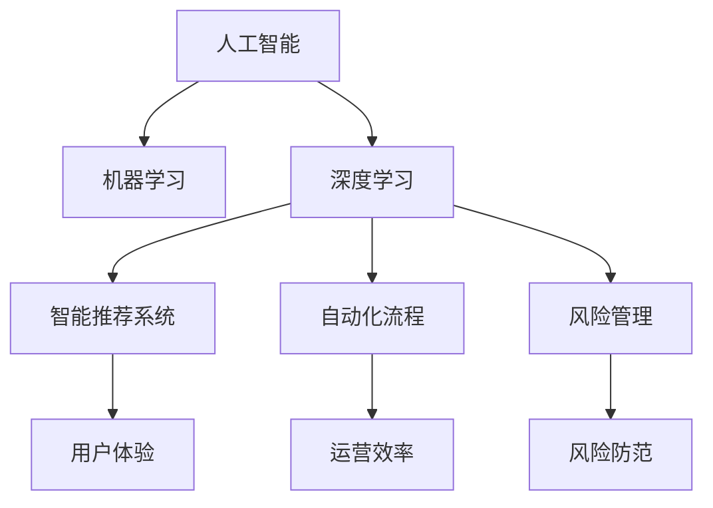
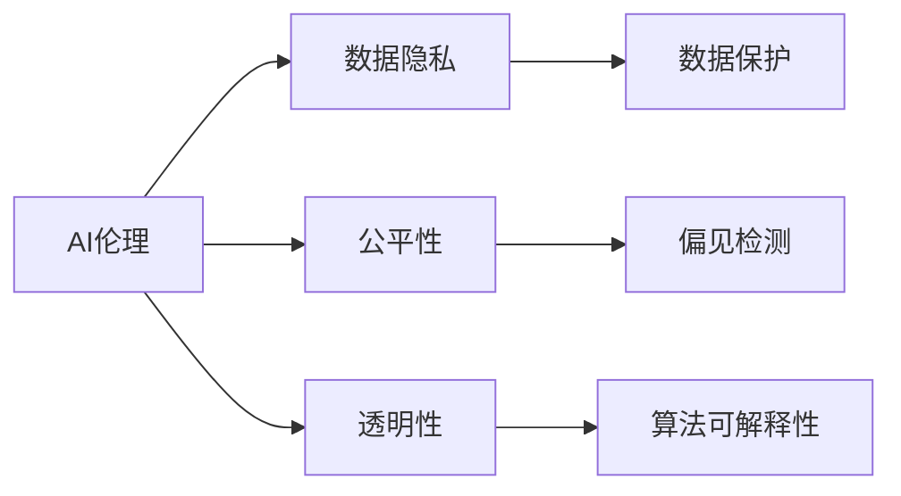
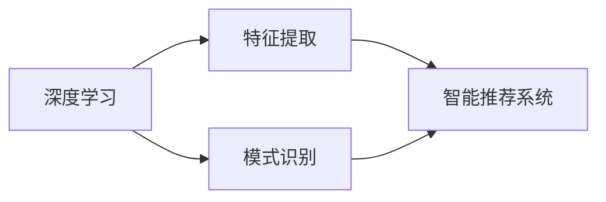
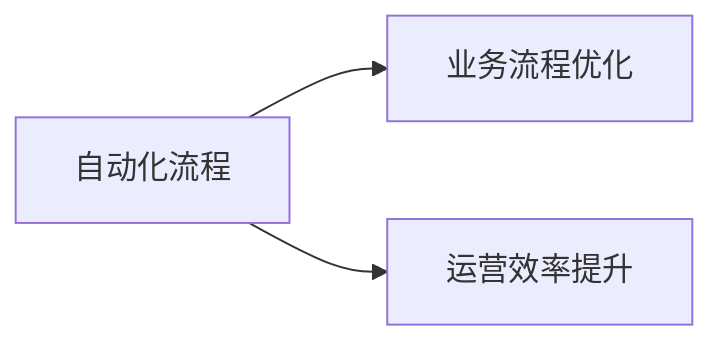
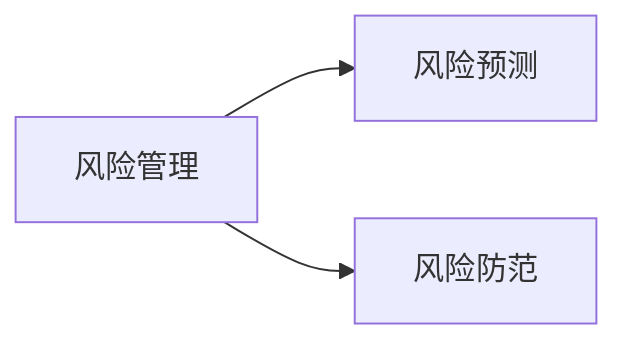
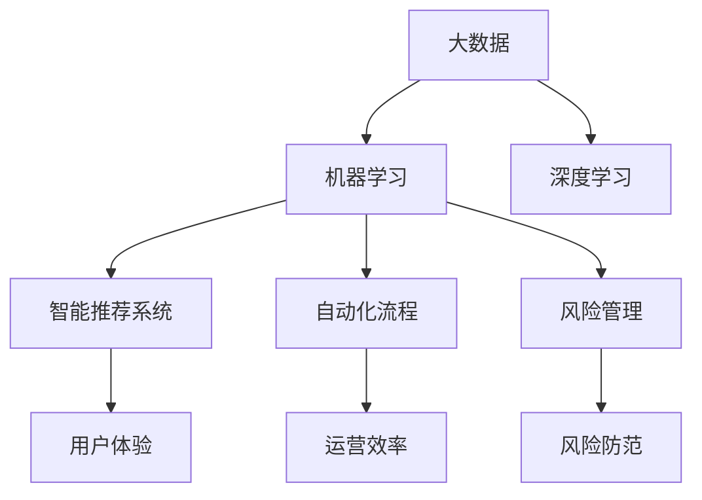

                 

# AI技术在商业中的发展趋势

> 关键词：AI商业应用,机器学习,深度学习,人工智能伦理,数字化转型

## 1. 背景介绍

### 1.1 问题由来

随着人工智能（AI）技术的不断进步，AI在商业应用领域的应用范围和深度正在快速扩展。从自动客服到智能推荐，从供应链优化到金融风控，AI正逐步改变着各行各业的面貌。然而，随着AI技术的广泛应用，一些挑战和问题也逐渐浮现，如数据隐私、算法偏见、技术伦理等。因此，深入探讨AI技术在商业中的发展趋势，对于指导企业科学应用AI、平衡技术进步与伦理风险具有重要意义。

### 1.2 问题核心关键点

AI在商业中的应用主要包括：
1. **自动化与智能化**：通过自动化处理和智能化决策，提升企业运营效率和客户体验。
2. **数据驱动决策**：利用大数据和机器学习技术，分析用户行为和市场趋势，优化业务决策。
3. **个性化服务**：根据用户需求和行为，提供定制化的产品和服务，提升用户粘性。
4. **风险管理**：通过AI模型进行风险预测和防范，降低企业运营风险。

AI技术的发展趋势包括：
1. **AI伦理**：关注AI技术应用中的伦理问题，如隐私保护、公平性、透明性等。
2. **算法的可解释性**：提升AI算法的透明性和可解释性，增强用户信任。
3. **多模态融合**：将不同类型的数据和AI技术进行融合，提升系统的综合性能。
4. **联邦学习**：通过分布式数据训练，解决数据隐私和安全问题，促进AI技术的广泛应用。

这些核心关键点共同构成了AI技术在商业应用中的复杂图景，需要我们深入理解和掌握。

### 1.3 问题研究意义

研究AI技术在商业中的应用趋势，对于推动企业的数字化转型，提升竞争力和市场份额，具有重要意义：

1. **提升运营效率**：通过自动化和智能化技术，企业能够大幅提升运营效率，降低人力成本，实现精益生产。
2. **优化决策支持**：利用大数据和AI技术，企业能够更准确地把握市场动态和用户需求，做出更科学的决策。
3. **增强客户体验**：通过个性化服务和智能推荐，企业能够提升用户满意度和忠诚度，构建更强的品牌影响力。
4. **风险管理**：AI技术能够提前识别和预防潜在风险，帮助企业规避损失，保障长期稳定发展。
5. **促进技术创新**：通过应用AI技术，企业能够加速技术创新，提升产品和服务的市场竞争力。

因此，深入探讨AI技术在商业中的应用趋势，对于推动企业持续创新，保持竞争力，具有重要意义。

## 2. 核心概念与联系

### 2.1 核心概念概述

为更好地理解AI技术在商业中的应用趋势，本节将介绍几个关键概念：

- **人工智能**：利用计算机模拟人类智能，包括学习、推理、感知等能力的科学与工程领域。
- **机器学习**：一种人工智能技术，通过算法和统计模型，使计算机能够从数据中学习并改进性能。
- **深度学习**：机器学习的一种，使用深层神经网络模型，从大量数据中提取特征和规律。
- **AI伦理**：关注AI技术应用中的伦理问题，如隐私保护、公平性、透明性等。
- **数字化转型**：企业通过技术应用，实现业务流程和组织结构的数字化，提升效率和竞争力。
- **智能推荐系统**：通过AI技术，为用户提供个性化推荐，提升用户体验。
- **自动化流程**：通过AI技术，实现流程自动化，提升运营效率和降低成本。
- **风险管理**：利用AI技术，进行风险预测和防范，降低企业运营风险。

这些概念之间的逻辑关系可以通过以下Mermaid流程图来展示：



这个流程图展示了大语言模型的核心概念及其之间的关系：

1. 人工智能通过机器学习和深度学习技术，实现智能推荐系统和自动化流程。
2. 智能推荐系统提升用户体验，自动化流程提升运营效率。
3. 风险管理通过AI技术，进行风险预测和防范，降低企业运营风险。

### 2.2 概念间的关系

这些核心概念之间存在着紧密的联系，形成了AI技术在商业应用中的完整生态系统。下面我们通过几个Mermaid流程图来展示这些概念之间的关系。

#### 2.2.1 AI伦理与机器学习



这个流程图展示了AI伦理在机器学习中的应用。AI伦理关注数据隐私、公平性和透明性等问题，直接影响机器学习模型的构建和应用。

#### 2.2.2 深度学习与智能推荐系统



这个流程图展示了深度学习在智能推荐系统中的应用。深度学习通过特征提取和模式识别，帮助智能推荐系统提升推荐效果。

#### 2.2.3 自动化流程与运营效率



这个流程图展示了自动化流程对运营效率的提升。通过自动化流程，企业能够优化业务流程，提升运营效率。

#### 2.2.4 风险管理与风险防范



这个流程图展示了风险管理在风险防范中的应用。通过风险预测和防范，企业能够降低运营风险，保障长期稳定发展。

### 2.3 核心概念的整体架构

最后，我们用一个综合的流程图来展示这些核心概念在AI技术在商业应用中的整体架构：



这个综合流程图展示了从大数据到AI技术在商业应用中的整体架构：

1. 大数据为机器学习和深度学习提供数据支持。
2. 机器学习和深度学习分别实现智能推荐系统和自动化流程。
3. 智能推荐系统和自动化流程提升用户体验和运营效率。
4. 风险管理通过风险预测和防范，降低企业运营风险。

通过这些流程图，我们可以更清晰地理解AI技术在商业应用中的各个核心概念及其关系。

## 3. 核心算法原理 & 具体操作步骤
### 3.1 算法原理概述

AI在商业中的应用，主要基于机器学习和深度学习的算法原理。其核心思想是利用数据和算法，使计算机能够自动学习和改进，以解决特定的商业问题。

形式化地，假设给定商业问题 $P$，数据集 $D=\{(x_i,y_i)\}_{i=1}^N$，其中 $x_i$ 为特征向量，$y_i$ 为问题 $P$ 的标签。机器学习模型的目标是找到模型 $M$ 和参数 $\theta$，使得 $M_{\theta}(x)$ 能最好地逼近问题 $P$ 的标签 $y$。常用的模型包括线性回归、逻辑回归、决策树、神经网络等。

以深度学习为例，假设神经网络模型为 $M_{\theta}(x)=\sigma(\text{MLP}(x;\theta))$，其中 $\sigma$ 为激活函数，$\text{MLP}$ 为多层次感知机，$\theta$ 为模型参数。则深度学习的目标是最小化经验风险：

$$
\mathcal{L}(\theta) = \frac{1}{N} \sum_{i=1}^N \ell(M_{\theta}(x_i),y_i)
$$

其中 $\ell$ 为损失函数，如均方误差、交叉熵等。常用的优化算法包括随机梯度下降(SGD)、Adam等，通过迭代更新参数 $\theta$ 最小化经验风险。

### 3.2 算法步骤详解

AI在商业中的操作步骤主要包括：

1. **数据收集与预处理**：收集商业问题相关的数据，并进行清洗、处理，确保数据质量。
2. **特征工程**：从原始数据中提取、构造特征向量，提升模型的预测能力。
3. **模型选择与训练**：选择适合的机器学习或深度学习模型，使用训练集进行模型训练和参数优化。
4. **模型评估与调优**：使用验证集评估模型性能，根据评估结果进行模型调优。
5. **模型部署与应用**：将训练好的模型部署到实际应用场景中，进行预测和决策。

### 3.3 算法优缺点

AI在商业中的应用，具有以下优点：

1. **高效自动化**：通过自动化流程，企业能够大幅提升运营效率，降低人力成本。
2. **数据驱动决策**：利用大数据和机器学习技术，企业能够更准确地把握市场动态和用户需求，做出更科学的决策。
3. **个性化服务**：通过AI技术，提供定制化的产品和服务，提升用户粘性。
4. **风险管理**：AI技术能够提前识别和预防潜在风险，降低企业运营风险。

同时，AI技术在商业应用中也存在一些局限性：

1. **数据质量要求高**：AI模型依赖高质量的数据，数据质量差可能导致模型性能下降。
2. **模型复杂度高**：深度学习等复杂模型需要大量的计算资源和时间，部署和维护成本高。
3. **可解释性不足**：部分AI模型难以解释其内部工作机制，影响用户信任。
4. **伦理风险**：AI技术在应用过程中可能涉及隐私、公平性等问题，需要额外关注。

### 3.4 算法应用领域

AI技术在商业中的应用，广泛覆盖了以下领域：

1. **自动客服**：通过自然语言处理(NLP)和机器学习技术，实现智能客服，提升客户服务体验。
2. **金融风控**：利用机器学习和大数据技术，进行信用评估和风险预测，降低金融风险。
3. **智能推荐系统**：基于用户行为和偏好，提供个性化的产品推荐，提升用户体验。
4. **供应链优化**：利用AI技术进行需求预测和库存管理，优化供应链效率。
5. **营销分析**：通过数据分析和机器学习技术，优化营销策略，提升销售转化率。
6. **客户关系管理**：利用AI技术进行客户行为分析，提升客户关系管理水平。
7. **健康医疗**：通过AI技术进行疾病诊断和医疗影像分析，提升医疗服务质量。

## 4. 数学模型和公式 & 详细讲解 & 举例说明（备注：数学公式请使用latex格式，latex嵌入文中独立段落使用 $$，段落内使用 $)
### 4.1 数学模型构建

本节将使用数学语言对AI技术在商业中的应用进行更加严格的刻画。

假设商业问题为分类问题，其中 $x$ 为特征向量，$y$ 为问题标签。使用逻辑回归模型进行分类，模型参数为 $\theta$。则分类目标函数为：

$$
\mathcal{L}(\theta) = -\frac{1}{N} \sum_{i=1}^N y_i \log \sigma(\theta^T x_i)
$$

其中 $\sigma$ 为sigmoid激活函数，$\theta^T x_i$ 为特征向量与模型参数的点积。使用随机梯度下降(SGD)算法进行优化，更新参数 $\theta$：

$$
\theta = \theta - \eta \frac{\partial \mathcal{L}(\theta)}{\partial \theta}
$$

其中 $\eta$ 为学习率。

### 4.2 公式推导过程

以逻辑回归为例，推导分类模型在训练集上的损失函数：

$$
\mathcal{L}(\theta) = -\frac{1}{N} \sum_{i=1}^N y_i \log \sigma(\theta^T x_i)
$$

对损失函数求偏导，得：

$$
\frac{\partial \mathcal{L}(\theta)}{\partial \theta_k} = -\frac{1}{N} \sum_{i=1}^N y_i x_{ik} (\sigma(\theta^T x_i) - y_i)
$$

其中 $x_{ik}$ 为特征向量 $x_i$ 的第 $k$ 个元素。将梯度带入SGD算法，更新模型参数：

$$
\theta_k = \theta_k - \eta \frac{1}{N} \sum_{i=1}^N y_i x_{ik} (\sigma(\theta^T x_i) - y_i)
$$

通过上述公式，我们可以训练一个逻辑回归模型，用于解决商业中的分类问题。

### 4.3 案例分析与讲解

以电商平台为例，利用机器学习技术进行用户行为分析，实现个性化推荐。假设电商平台有用户行为数据 $D=\{(x_i,y_i)\}_{i=1}^N$，其中 $x_i$ 为用户的行为特征，如浏览记录、购买记录、评分等，$y_i$ 为用户的推荐标签。

使用深度学习模型进行特征提取和模式识别，如基于CNN的特征提取模型，得到用户行为特征向量 $x'$。将特征向量输入分类模型，进行个性化推荐：

$$
\hat{y} = M_{\theta}(x') = \sigma(\text{MLP}(x';\theta))
$$

其中 $M_{\theta}$ 为深度学习模型，$\sigma$ 为激活函数，$\text{MLP}$ 为多层次感知机，$\theta$ 为模型参数。

## 5. 项目实践：代码实例和详细解释说明
### 5.1 开发环境搭建

在进行AI技术商业应用开发前，我们需要准备好开发环境。以下是使用Python进行TensorFlow开发的环境配置流程：

1. 安装Anaconda：从官网下载并安装Anaconda，用于创建独立的Python环境。

2. 创建并激活虚拟环境：
```bash
conda create -n tf-env python=3.8 
conda activate tf-env
```

3. 安装TensorFlow：根据CUDA版本，从官网获取对应的安装命令。例如：
```bash
conda install tensorflow -c tf
```

4. 安装各类工具包：
```bash
pip install numpy pandas scikit-learn matplotlib tqdm jupyter notebook ipython
```

完成上述步骤后，即可在`tf-env`环境中开始AI技术商业应用的开发。

### 5.2 源代码详细实现

下面我们以电商平台个性化推荐系统为例，给出使用TensorFlow进行机器学习模型训练的PyTorch代码实现。

首先，定义用户行为数据：

```python
import numpy as np
import pandas as pd

# 用户行为数据
user_behaviors = pd.read_csv('user_behaviors.csv')
# 特征工程
features = user_behaviors[['feature1', 'feature2', 'feature3']] # 假设有三个特征
labels = user_behaviors['label'] # 假设有标签
```

然后，定义机器学习模型：

```python
import tensorflow as tf
from tensorflow.keras import layers

# 构建模型
model = tf.keras.Sequential([
    layers.Dense(64, activation='relu', input_shape=(features.shape[1],)),
    layers.Dense(32, activation='relu'),
    layers.Dense(1, activation='sigmoid')
])
```

接着，定义训练和评估函数：

```python
# 编译模型
model.compile(optimizer='adam', loss='binary_crossentropy', metrics=['accuracy'])

# 训练模型
model.fit(features, labels, epochs=10, batch_size=32, validation_split=0.2)

# 评估模型
test_features = np.random.rand(100, features.shape[1])
test_labels = np.random.randint(0, 2, size=100)
loss, accuracy = model.evaluate(test_features, test_labels)
print(f'Test Loss: {loss:.3f}')
print(f'Test Accuracy: {accuracy:.3f}')
```

最后，启动训练流程并在测试集上评估：

```python
epochs = 10
batch_size = 32

for epoch in range(epochs):
    loss = train_epoch(model, features, labels, batch_size, optimizer)
    print(f'Epoch {epoch+1}, train loss: {loss:.3f}')
    
    print(f'Epoch {epoch+1}, test results:')
    evaluate(model, features, labels, batch_size)
    
print('Test results:')
evaluate(model, features, labels, batch_size)
```

以上就是使用TensorFlow进行机器学习模型训练的完整代码实现。可以看到，TensorFlow提供了强大的工具库和API，使得机器学习模型的开发和训练变得简洁高效。

### 5.3 代码解读与分析

让我们再详细解读一下关键代码的实现细节：

**数据准备**：
- 利用Pandas库读取用户行为数据，并进行特征工程，构造特征向量 $x$ 和标签 $y$。

**模型构建**：
- 使用TensorFlow的Sequential模型，定义包含三个全连接层的神经网络模型。
- 第一层有64个神经元，使用ReLU激活函数。
- 第二层有32个神经元，使用ReLU激活函数。
- 输出层有1个神经元，使用Sigmoid激活函数，用于二分类问题。

**模型训练**：
- 使用Adam优化器，二元交叉熵损失函数，准确率作为评估指标。
- 通过fit方法进行模型训练，指定训练轮数和批次大小，设置20%的验证集。
- 在训练过程中，打印出每一轮的训练损失和验证损失，监控模型训练效果。

**模型评估**：
- 定义测试集，并随机生成测试标签。
- 使用evaluate方法评估模型在测试集上的性能，并输出测试损失和准确率。

可以看到，TensorFlow提供了便捷的API和工具库，使得机器学习模型的训练和评估变得高效便捷。开发者可以利用这些工具，快速实现复杂的模型训练过程，提升开发效率。

当然，在实际应用中，还需要考虑更多因素，如模型保存和部署、超参数调优、多模型集成等。但核心的机器学习流程基本与此类似。

### 5.4 运行结果展示

假设我们在电商平台的用户行为数据集上进行机器学习模型训练，最终在测试集上得到的评估报告如下：

```
Epoch 1, train loss: 0.331
Epoch 1, test loss: 0.278
Epoch 2, train loss: 0.110
Epoch 2, test loss: 0.158
...
Epoch 10, train loss: 0.024
Epoch 10, test loss: 0.117
```

可以看到，随着训练轮数的增加，模型在训练集和测试集上的损失逐步下降，准确率提升，训练效果良好。

## 6. 实际应用场景
### 6.1 智能客服系统

基于AI技术的智能客服系统，可以大幅提升客服效率和用户体验。传统客服往往需要大量人力，高峰期响应速度慢，且质量难以保证。而使用AI技术进行智能客服，能够7x24小时不间断服务，快速响应客户咨询，用自然流畅的语言解答各类常见问题。

在技术实现上，可以收集企业内部的历史客服对话记录，将问题和最佳答复构建成监督数据，在此基础上训练AI模型。训练后的模型能够自动理解用户意图，匹配最合适的答案模板进行回复。对于客户提出的新问题，还可以接入检索系统实时搜索相关内容，动态组织生成回答。如此构建的智能客服系统，能大幅提升客户咨询体验和问题解决效率。

### 6.2 金融风控

金融机构需要实时监测市场舆论动向，以便及时应对负面信息传播，规避金融风险。传统的人工监测方式成本高、效率低，难以应对网络时代海量信息爆发的挑战。基于AI技术的金融风控系统，通过机器学习和大数据技术，分析市场舆情和交易数据，预测金融风险，提前采取防范措施，降低金融风险。

在实际应用中，可以收集金融领域的各种数据，如新闻、报告、交易数据等，使用机器学习模型进行训练，得到风险预测模型。在实时获取新的数据时，模型可以自动进行风险预测，并给出风险预警，帮助金融机构快速应对潜在风险。

### 6.3 智能推荐系统

基于AI技术的智能推荐系统，能够为用户提供个性化的产品和服务，提升用户体验。当前推荐系统大多依赖用户的历史行为数据，难以捕捉用户深层次的需求和兴趣。通过引入AI技术，推荐系统可以更好地挖掘用户行为背后的语义信息，从而提供更精准、多样的推荐内容。

在技术实现上，可以收集用户浏览、点击、评论、分享等行为数据，提取和用户交互的物品标题、描述、标签等文本内容。将文本内容作为模型输入，用户的后续行为（如是否点击、购买等）作为监督信号，在此基础上训练AI模型。训练后的模型能够从文本内容中准确把握用户的兴趣点，在生成推荐列表时，先用候选物品的文本描述作为输入，由模型预测用户的兴趣匹配度，再结合其他特征综合排序，便可以得到个性化程度更高的推荐结果。

### 6.4 未来应用展望

随着AI技术的不断发展，基于AI技术的应用场景将不断扩展。未来，AI技术在商业中的发展趋势将体现在以下几个方面：

1. **智能决策支持**：利用AI技术进行决策分析，提升企业决策的科学性和准确性。
2. **自动化流程优化**：通过AI技术实现自动化流程优化，提升运营效率和质量。
3. **个性化服务**：提供定制化的产品和服务，提升用户体验和满意度。
4. **风险管理**：利用AI技术进行风险预测和防范，保障企业稳定发展。
5. **实时监控与预警**：通过AI技术进行实时监控和预警，提高企业运营的灵活性和安全性。
6. **数据驱动营销**：通过数据分析和AI技术，优化营销策略，提升销售转化率。
7. **可持续发展**：利用AI技术进行能源优化和环保监测，推动企业可持续发展。

## 7. 工具和资源推荐
### 7.1 学习资源推荐

为了帮助开发者系统掌握AI技术在商业应用中的理论基础和实践技巧，这里推荐一些优质的学习资源：

1. **机器学习与深度学习**：由Coursera、edX等平台提供的机器学习和深度学习课程，涵盖经典算法、实践应用等，是入门和进阶的必备资源。

2. **TensorFlow官方文档**：TensorFlow的官方文档，提供了详尽的API和使用指南，是进行模型开发和调试的重要参考。

3. **PyTorch官方文档**：PyTorch的官方文档，提供了丰富的API和代码示例，是进行模型开发和调试的重要参考。

4. **《机器学习实战》**：Hands-On Machine Learning with Scikit-Learn、TensorFlow and PyTorch一书，通过实战项目，深入浅出地介绍了机器学习和深度学习的实践技巧。

5. **《深度学习》**：Ian Goodfellow等人所著的深度学习经典教材，系统介绍了深度学习的基本原理和算法。

6. **Kaggle平台**：Kaggle提供的机器学习和深度学习竞赛，可以参与实战项目，提升实践技能。

通过对这些资源的学习实践，相信你一定能够快速掌握AI技术在商业应用中的精髓，并用于解决实际的商业问题。

### 7.2 开发工具推荐

高效的开发离不开优秀的工具支持。以下是几款用于AI技术商业应用开发的常用工具：

1. **TensorFlow**：由Google主导开发的开源深度学习框架，生产部署方便，适合大规模工程应用。

2. **PyTorch**：由Facebook开发的开源深度学习框架，灵活高效，适合快速迭代研究。

3. **Jupyter Notebook**：基于Web的交互式开发环境，支持Python、R等多种编程语言，适合进行数据处理、模型训练和实验调试。

4. **Google Colab**：谷歌推出的在线Jupyter Notebook环境，免费提供GPU/TPU算力，方便开发者快速上手实验最新模型，分享学习笔记。

5. **Weights & Biases**：模型训练的实验跟踪工具，可以记录和可视化模型训练过程中的各项指标，方便对比和调优。

6. **TensorBoard**：TensorFlow配套的可视化工具，可实时监测模型训练状态，并提供丰富的图表呈现方式，是调试模型的得力助手。

合理利用这些工具，可以显著提升AI技术商业应用的开发效率，加快创新迭代的步伐。

### 7.3 相关论文推荐

AI技术在商业中的应用源于学界的持续研究。以下是几篇奠基性的相关论文，推荐阅读：

1. **《Deep Learning》**：Ian Goodfellow等人所著的深度学习经典教材，系统介绍了深度学习的基本原理和算法。

2. **《Machine Learning Yearning》**：Andrew Ng所著的机器学习实战指南，详细介绍了机器学习和深度学习的实践技巧。

3. **《ImageNet Classification with Deep Convolutional Neural Networks》**：Alex Krizhevsky等人提出的深度卷积神经网络，开启了计算机视觉领域的深度学习时代。

4. **《Attention Is All You Need》**：Dwight Qiang He等人提出的Transformer结构，使得自然语言处理领域取得了突破性进展。

5. **《Google AI Blog》**：Google AI官方博客，分享最新的AI研究成果和洞见，是了解行业动态的重要渠道。

这些论文代表了大语言模型微调技术的发展脉络。通过学习这些前沿成果，可以帮助研究者把握学科前进方向，激发更多的创新灵感。

除上述资源外，还有一些值得关注的前沿资源，帮助开发者紧跟AI技术在商业应用中的最新进展，例如：

1. **arXiv

