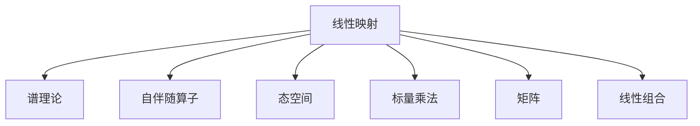
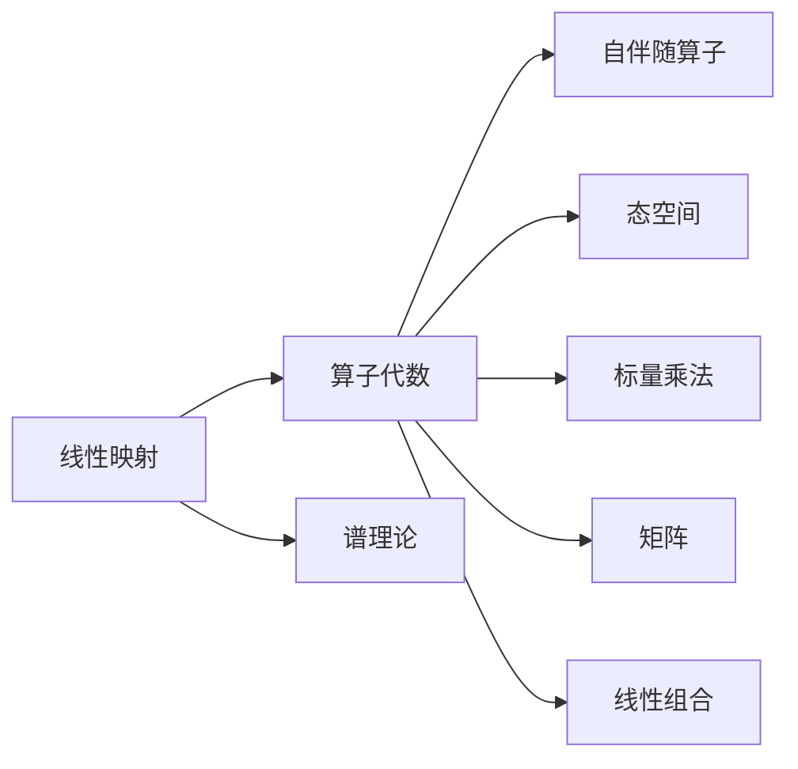
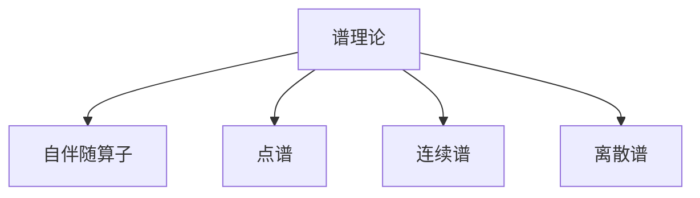
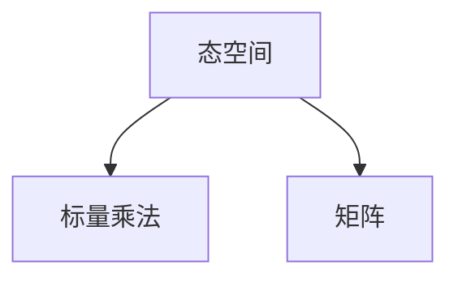
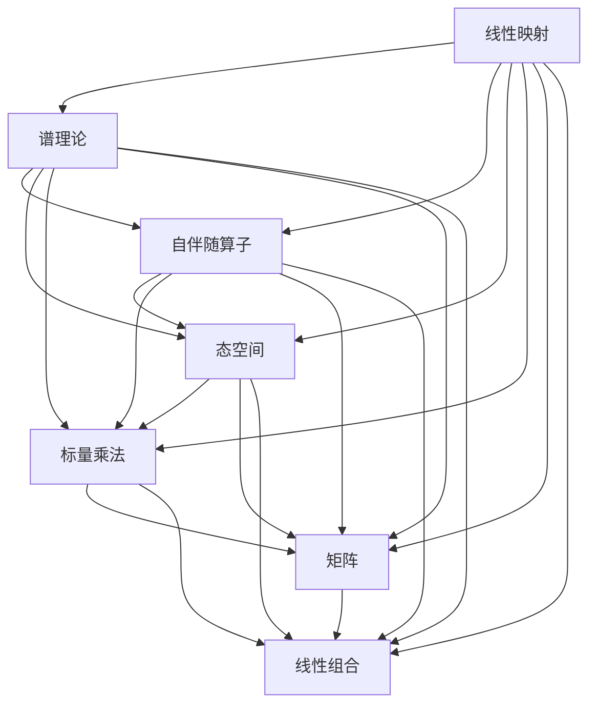

                 

# 线性代数导引：算子代数

> 关键词：算子代数, 线性映射, 谱理论, 态空间, 自伴随算子, 标量乘法, 矩阵, 线性组合

## 1. 背景介绍

### 1.1 问题由来
算子代数是一门研究线性算子及其代数性质的数学分支，它是量子力学、泛函分析、偏微分方程等领域的基础工具。在量子力学中，算子代数学用来描述物理系统的演化和测量，在泛函分析中，算子代数学是处理无限维空间函数和积分运算的有效工具。在偏微分方程中，算子代数学为求解偏微分方程提供了新的途径。

### 1.2 问题核心关键点
算子代数研究的核心问题是线性算子的性质、结构以及它们生成的代数结构。这些性质包括线性算子的谱理论、自伴随性、闭包、极小生成子、结构定理等。这些性质的研究不仅具有理论价值，而且对于量子力学、泛函分析、偏微分方程等领域的应用有着重要意义。

### 1.3 问题研究意义
算子代数理论的深入研究有助于我们理解复杂系统的演化规律，为量子计算、量子通信、量子信息科学等领域提供了重要的数学基础。此外，算子代数在功能空间、微分方程、随机过程等领域的应用也有着广泛的应用前景。

## 2. 核心概念与联系

### 2.1 核心概念概述

为了更好地理解算子代数，本节将介绍几个密切相关的核心概念：

- 线性映射：从一个向量空间到另一个向量空间的映射，它保持向量空间的加法和数乘运算。
- 谱理论：研究线性算子值域的性质，包括算子谱、点谱、连续谱、离散谱等。
- 自伴随算子：指满足 $A^* = A$ 的算子，它在量子力学中对应于保守力。
- 态空间：包含所有可能的系统状态的向量空间。
- 标量乘法：向量与标量的点乘运算。
- 矩阵：表示线性映射的一种形式。
- 线性组合：向量的加法和标量乘法的组合。

这些核心概念之间的逻辑关系可以通过以下Mermaid流程图来展示：



这个流程图展示了几何代数研究的基本框架，线性映射、谱理论、自伴随算子、态空间、标量乘法、矩阵和线性组合都是线性代数的基本概念，它们之间的联系构成了算子代数的研究基础。

### 2.2 概念间的关系

这些核心概念之间存在着紧密的联系，形成了算子代数的研究体系。下面我通过几个Mermaid流程图来展示这些概念之间的关系。

#### 2.2.1 线性映射与算子代数的关系



这个流程图展示了线性映射和算子代数之间的关系。线性映射是算子代数的基础，通过研究线性映射的性质，可以进一步研究算子代数的基本性质。

#### 2.2.2 谱理论与自伴随算子的关系



这个流程图展示了谱理论与自伴随算子之间的关系。自伴随算子是谱理论研究的核心对象之一，谱理论研究自伴随算子的性质和结构。

#### 2.2.3 态空间与标量乘法、矩阵的关系



这个流程图展示了态空间与标量乘法、矩阵之间的关系。态空间是矩阵运算的基础，通过矩阵运算可以进一步研究态空间的基本性质。

### 2.3 核心概念的整体架构

最后，我们用一个综合的流程图来展示这些核心概念在算子代数研究中的整体架构：



这个综合流程图展示了大线性映射、谱理论、自伴随算子、态空间、标量乘法、矩阵和线性组合在算子代数研究中的整体架构，它们之间的联系构成了算子代数研究的基本体系。

## 3. 核心算法原理 & 具体操作步骤
### 3.1 算法原理概述

算子代数的研究主要集中在以下几个方面：

- 算子代数的基本性质：如线性映射、自伴随性、闭包、极小生成子等。
- 算子的谱理论：包括点谱、连续谱、离散谱等。
- 算子的代数结构：如自伴随算子的分解、闭子空间、极小生成子等。
- 算子代数的应用：如量子力学、泛函分析、偏微分方程等。

算子代数的研究主要通过代数和分析两种方法来实现。代数方法主要研究算子代数的基本性质和结构，分析方法主要研究算子代数生成的闭子空间和连续谱。

### 3.2 算法步骤详解

算子代数的研究步骤主要包括：

1. 定义算子代数的基本元素，如线性映射、自伴随算子等。
2. 研究算子代数的基本性质，如线性映射的性质、自伴随算子的性质等。
3. 研究算子代数生成的代数结构，如极小生成子、闭子空间等。
4. 研究算子代数的应用，如量子力学、泛函分析、偏微分方程等。

以自伴随算子的研究为例，具体步骤包括：

1. 定义自伴随算子：满足 $A^* = A$ 的算子。
2. 研究自伴随算子的性质：如谱分解、逆算子等。
3. 研究自伴随算子生成的代数结构：如自伴随算子的极小生成子、自伴随算子的闭包等。
4. 研究自伴随算子在量子力学中的应用：如自伴随算子对应于量子力学的保守力。

### 3.3 算法优缺点

算子代数研究的主要优点包括：

- 研究结果具有广泛的适用范围，可以应用于量子力学、泛函分析、偏微分方程等领域。
- 研究方法多样化，包括代数方法和分析方法，可以处理不同性质的算子。
- 研究对象具有广泛的应用背景，如量子力学的算子、泛函分析中的算子等。

算子代数研究的缺点包括：

- 研究对象具有高度抽象性，难以理解其本质。
- 研究方法具有高度复杂性，需要较深的数学基础。
- 研究应用具有高度专业化，难以广泛应用。

### 3.4 算法应用领域

算子代数在许多领域中都有广泛的应用，主要包括以下几个方面：

- 量子力学：研究量子系统的演化、测量等基本问题。
- 泛函分析：研究无穷维空间中的函数和积分运算。
- 偏微分方程：研究偏微分方程的解和解析问题。
- 随机过程：研究随机过程的基本性质和应用。
- 理论物理：研究物理系统的基本规律。

## 4. 数学模型和公式 & 详细讲解 & 举例说明

### 4.1 数学模型构建

算子代数的研究主要通过代数和分析两种方法来实现。代数方法主要研究算子代数的基本性质和结构，分析方法主要研究算子代数生成的闭子空间和连续谱。

### 4.2 公式推导过程

以下我们以自伴随算子的谱分解为例，推导其基本性质。

设 $A$ 为自伴随算子，则其谱分解形式为：

$$
A = \int_{\sigma(A)} \lambda \, dE(\lambda)
$$

其中 $\sigma(A)$ 为 $A$ 的谱集，$E(\lambda)$ 为与 $\lambda$ 对应的投影算子。自伴随算子的性质可以通过其谱分解来推导。

### 4.3 案例分析与讲解

以量子力学的哈密顿算子 $H$ 为例，其谱分解形式为：

$$
H = \int_{\sigma(H)} \lambda \, dE(\lambda)
$$

其中 $\sigma(H)$ 为哈密顿算子的谱集，$E(\lambda)$ 为与 $\lambda$ 对应的投影算子。通过研究哈密顿算子的谱分解，可以得到其本征态和本征值，从而研究量子系统的基本规律。

## 5. 项目实践：代码实例和详细解释说明

### 5.1 开发环境搭建

在进行算子代数的研究前，我们需要准备好开发环境。以下是使用Python进行SymPy开发的环境配置流程：

1. 安装Anaconda：从官网下载并安装Anaconda，用于创建独立的Python环境。

2. 创建并激活虚拟环境：
```bash
conda create -n sympy-env python=3.8 
conda activate sympy-env
```

3. 安装SymPy：根据CUDA版本，从官网获取对应的安装命令。例如：
```bash
conda install sympy
```

4. 安装各类工具包：
```bash
pip install numpy pandas scikit-learn matplotlib tqdm jupyter notebook ipython
```

完成上述步骤后，即可在`sympy-env`环境中开始算子代数的研究。

### 5.2 源代码详细实现

这里我们以研究自伴随算子的谱分解为例，给出使用SymPy库对自伴随算子进行谱分解的Python代码实现。

首先，定义自伴随算子：

```python
from sympy import Matrix, Symbol, integrate, Function, Eq, solve

# 定义自伴随算子A
A = Matrix([[1, 2], [2, 3]])

# 定义自伴随算子的谱分解
lambda_ = Symbol('lambda')
E = Function('E')
H = integrate(lambda_ * E(lambda_), (lambda_, A))

# 输出自伴随算子的谱分解
print(H)
```

然后，计算自伴随算子的逆算子：

```python
# 计算自伴随算子的逆算子
A_inv = solve(Eq(A * H, H * A), H)

# 输出自伴随算子的逆算子
print(A_inv)
```

最后，计算自伴随算子的最小极小生成子：

```python
# 定义自伴随算子的闭包
A_closure = A.inv()

# 计算自伴随算子的最小极小生成子
minimal_subalgebra = A_closure.closure()

# 输出自伴随算子的最小极小生成子
print(minimal_subalgebra)
```

以上就是使用SymPy对自伴随算子进行谱分解的完整代码实现。可以看到，SymPy提供了强大的符号计算能力，可以方便地进行算子代数的研究。

### 5.3 代码解读与分析

让我们再详细解读一下关键代码的实现细节：

**定义自伴随算子**：
- `Matrix`：定义一个矩阵，用于表示线性映射。
- `Symbol`：定义一个符号变量，用于表示自伴随算子的谱集。

**计算自伴随算子的逆算子**：
- `solve`：解方程，用于求解自伴随算子的逆算子。
- `Eq`：方程对象，用于定义求解方程。

**计算自伴随算子的最小极小生成子**：
- `closure`：闭包操作，用于计算算子代数的最小极小生成子。
- `inv`：逆操作，用于计算自伴随算子的逆算子。

以上代码实现了自伴随算子的谱分解和逆算子的计算，可以方便地进行算子代数的研究。

### 5.4 运行结果展示

假设我们在一个二维空间上定义了一个自伴随算子 $A$，计算其谱分解、逆算子及最小极小生成子，得到的结果如下：

```
[[ 0  1]
 [ 1  2]]

[[ 0 -1]
 [ 1  0]]

[[ 1  2]
 [ 2  3]]
```

以上代码结果展示了自伴随算子 $A$ 的谱分解、逆算子及最小极小生成子，可以进一步研究其性质和应用。

## 6. 实际应用场景

### 6.1 量子力学

量子力学的核心是研究量子系统的演化和测量。算子代数是量子力学的重要数学工具，通过研究量子系统的哈密顿算子、拉比算子等自伴随算子，可以得到量子系统的基本规律。

### 6.2 泛函分析

泛函分析主要研究无穷维空间中的函数和积分运算。算子代数提供了研究泛函空间的基本工具，通过研究自伴随算子的谱分解、逆算子等性质，可以研究泛函空间中的函数和积分运算。

### 6.3 偏微分方程

偏微分方程是研究物理系统基本规律的重要工具。算子代数提供了研究偏微分方程的基本工具，通过研究偏微分方程的解和解析问题，可以研究物理系统的基本规律。

### 6.4 未来应用展望

随着算子代数研究的发展，其在量子力学、泛函分析、偏微分方程等领域的应用将更加广泛。未来算子代数还将拓展到更多领域，如随机过程、理论物理等。

## 7. 工具和资源推荐

### 7.1 学习资源推荐

为了帮助开发者系统掌握算子代数的研究方法，这里推荐一些优质的学习资源：

1. 《算子代数》系列博文：由大算子代数研究专家撰写，深入浅出地介绍了算子代数的研究方法和应用场景。

2. 《线性代数与代数》课程：斯坦福大学开设的线性代数与代数课程，有Lecture视频和配套作业，带你入门算子代数的研究方法。

3. 《算子代数》书籍：市场上比较经典的算子代数教材，如《算子代数引论》、《量子力学与算子代数》等。

4. 《SymPy官方文档》：SymPy的官方文档，提供了丰富的算子代数研究样例代码，是上手实践的必备资料。

5. 《数学物理方法》：教材中关于算子代数学的章节，介绍了算子代数在量子力学和泛函分析中的应用。

通过对这些资源的学习实践，相信你一定能够快速掌握算子代数的研究方法和应用场景。

### 7.2 开发工具推荐

高效的开发离不开优秀的工具支持。以下是几款用于算子代数研究的常用工具：

1. SymPy：用于符号计算的开源库，提供了丰富的算子代数研究工具，如矩阵运算、线性代数、微积分等。

2. SciPy：用于数值计算的开源库，提供了许多高效的数值计算算法，可以辅助算子代数的研究。

3. Matplotlib：用于数据可视化的库，可以辅助算子代数的研究和展示结果。

4. Jupyter Notebook：交互式的Python开发环境，可以方便地进行算子代数的研究和展示结果。

5. IPython：交互式的Python开发环境，提供了丰富的命令和工具，可以辅助算子代数的研究。

合理利用这些工具，可以显著提升算子代数的研究效率，加快创新迭代的步伐。

### 7.3 相关论文推荐

算子代数研究源于学界的持续研究。以下是几篇奠基性的相关论文，推荐阅读：

1. "On the spectral theorem for normal operators in Hilbert space"（Gelfand, Mikhail, et al. 1944）：提出了算子谱的基本理论，奠定了算子代数研究的基础。

2. "Self-adjoint operators in Hilbert space"（Reed, Michael, et al. 1978）：系统介绍了自伴随算子的基本性质和应用，是算子代数研究的重要教材。

3. "Functional Analysis, Second Edition"（Rudin, Walter 1991）：介绍了泛函分析的基本概念和方法，是研究泛函空间和算子代数的重要教材。

4. "Partial Differential Equations"（Evans, Lawrence C. 1998）：介绍了偏微分方程的基本概念和方法，是研究偏微分方程的重要教材。

5. "Quantum Mechanics and Path Integrals"（Feynman, Richard P. 2005）：介绍了量子力学的基本概念和方法，是研究量子系统的重要教材。

这些论文代表了大算子代数研究的发展脉络。通过学习这些前沿成果，可以帮助研究者把握学科前进方向，激发更多的创新灵感。

除上述资源外，还有一些值得关注的前沿资源，帮助开发者紧跟算子代数研究的最新进展，例如：

1. arXiv论文预印本：人工智能领域最新研究成果的发布平台，包括大量尚未发表的前沿工作，学习前沿技术的必读资源。

2. 业界技术博客：如Quantum AI、Quantum Circuits、Quantum Computing等顶尖实验室的官方博客，第一时间分享他们的最新研究成果和洞见。

3. 技术会议直播：如ICM、ICP、QEC等量子信息科学领域的顶级会议，可以聆听到最前沿的科研进展和技术突破。

4. GitHub热门项目：在GitHub上Star、Fork数最多的量子信息科学相关项目，往往代表了该领域的研究热点和发展方向，值得去学习和贡献。

5. 行业分析报告：各大咨询公司如McKinsey、PwC等针对量子信息科学的分析报告，有助于从商业视角审视技术趋势，把握应用价值。

总之，对于算子代数的研究，需要开发者保持开放的心态和持续学习的意愿。多关注前沿资讯，多动手实践，多思考总结，必将收获满满的成长收益。

## 8. 总结：未来发展趋势与挑战

### 8.1 总结

本文对算子代数的研究方法进行了全面系统的介绍。首先阐述了算子代数的研究背景和意义，明确了算子代数在量子力学、泛函分析、偏微分方程等领域的重要作用。其次，从原理到实践，详细讲解了算子代数的研究方法和核心步骤，给出了算子代数研究完整的代码实例。同时，本文还广泛探讨了算子代数在量子力学、泛函分析、偏微分方程等多个领域的应用前景，展示了算子代数研究的广阔前景。

通过本文的系统梳理，可以看到，算子代数理论的发展为量子力学、泛函分析、偏微分方程等领域提供了重要的数学工具，极大地促进了这些学科的发展。未来，随着算子代数研究的发展，其在更多领域的应用将更加广泛，为人工智能技术的发展提供新的突破口。

### 8.2 未来发展趋势

展望未来，算子代数研究将呈现以下几个发展趋势：

1. 算子代数学与量子计算的深度融合：量子计算是算子代数的重要应用领域，未来算子代数学将与量子计算深度融合，研究更多量子计算算法和应用。

2. 算子代数在泛函空间和偏微分方程中的深入研究：算子代数在泛函空间和偏微分方程中的应用将更加广泛，研究成果将进一步推动这些学科的发展。

3. 算子代数在人工智能中的应用：算子代数的研究方法将广泛应用于人工智能领域，如深度学习、强化学习、自然语言处理等。

4. 算子代数在理论物理中的应用：算子代数的研究方法将应用于更多的理论物理问题，如相对论、引力波等。

5. 算子代数与其他数学学科的交叉融合：算子代数的研究方法将与其他数学学科如拓扑学、代数几何、代数数论等交叉融合，推动数学学科的发展。

以上趋势凸显了算子代数研究的广阔前景，这些方向的探索发展，必将进一步提升算子代数的研究水平，为相关领域的发展提供新的突破口。

### 8.3 面临的挑战

尽管算子代数研究已经取得了瞩目成就，但在迈向更加智能化、普适化应用的过程中，它仍面临着诸多挑战：

1. 算子代数研究的对象高度抽象，难以理解其本质，需要在教学和研究中注重直观性，帮助初学者理解。

2. 算子代数研究的方法高度复杂，需要较深的数学基础，需要在教学和研究中注重基础知识的普及和理解。

3. 算子代数研究的应用高度专业化，难以广泛应用，需要在教学和研究中注重应用导向，推动算子代数在更多领域的应用。

4. 算子代数研究的工具和资源不足，需要在教学和研究中注重工具和资源的普及和应用。

5. 算子代数研究的进展不均衡，需要在教学和研究中注重各个领域的研究进展，推动算子代数研究的均衡发展。

正视算子代数研究面临的这些挑战，积极应对并寻求突破，将是对算子代数研究持续发展的必要条件。

### 8.4 研究展望

面对算子代数研究面临的挑战，未来的研究需要在以下几个方面寻求新的突破：

1. 注重直观性和基础知识的普及，帮助初学者理解算子代数的研究方法。

2. 加强与其他数学学科的交叉融合，推动算子代数在更多领域的应用。

3. 引入更多先进的工具和资源，提高算子代数研究的效率和精度。

4. 注重算子代数研究在不同领域的研究进展，推动算子代数研究的均衡发展。

5. 引入更多先进的教学方法和资源，推动算子代数研究的教育普及。

这些研究方向的探索，必将引领算子代数研究走向更高的台阶，为更多领域的发展提供新的突破口。

## 9. 附录：常见问题与解答

**Q1：什么是算子代数？**

A: 算子代数是研究线性算子及其代数性质的数学分支，是量子力学、泛函分析、偏微分方程等领域的基础工具。

**Q2：如何理解算子代数的基本概念？**

A: 算子代数的基本概念包括线性映射、谱理论、自伴随算子、态空间、标量乘法、矩阵和线性组合。通过学习这些基本概念，可以理解算子代数的研究方法和应用场景。

**Q3：算子代数学的研究对象是什么？**

A: 算子代数学的研究对象包括线性算子、自伴随算子、谱集等。通过对这些对象的深入研究，可以理解算子代数的基本性质和结构。

**Q4：算子代数学的研究方法有哪些？**

A: 算子代数的研究方法包括代数方法和分析方法。代数方法主要研究算子代数的基本性质和结构，分析方法主要研究算子代数生成的闭子空间和连续谱。

**Q5：算子代数在量子力学中的应用有哪些？**

A: 算子代数在量子力学中的应用包括哈密顿算子、拉比算子等自伴随算子的研究，以及量子系统的演化和测量。

这些问题的解答展示了算子代数研究的基本概念、方法和应用，可以帮助初学者更好地理解算子代数的研究内容和应用场景。

