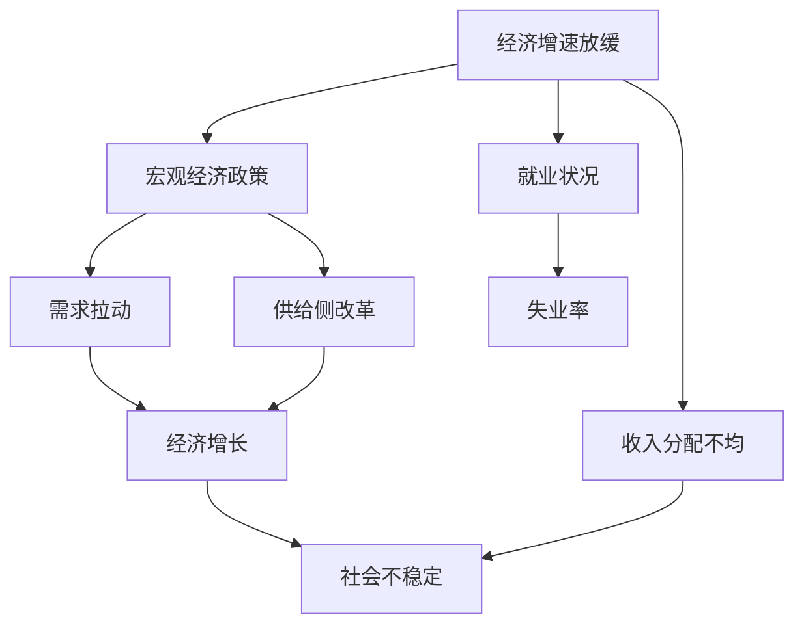
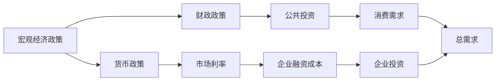
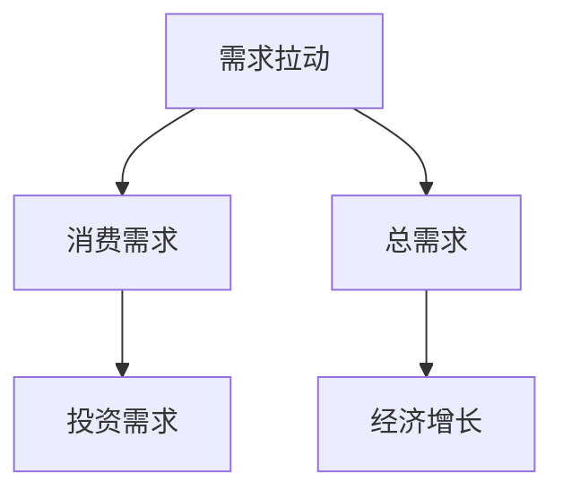
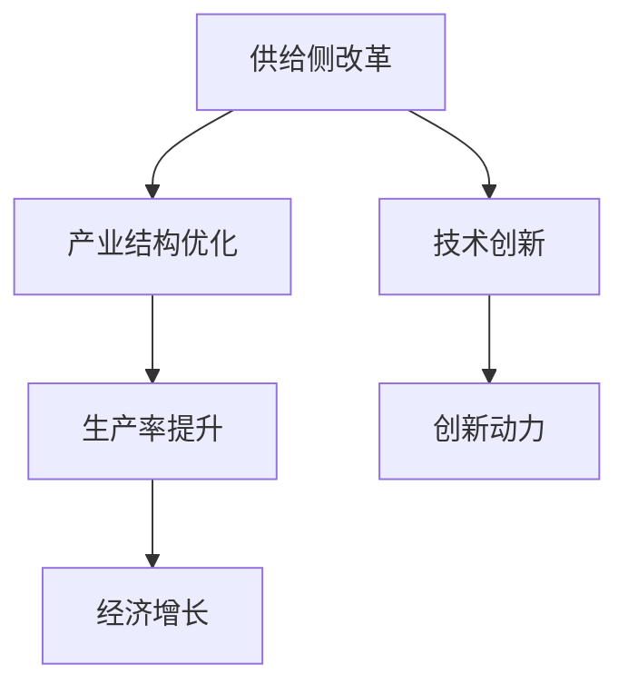
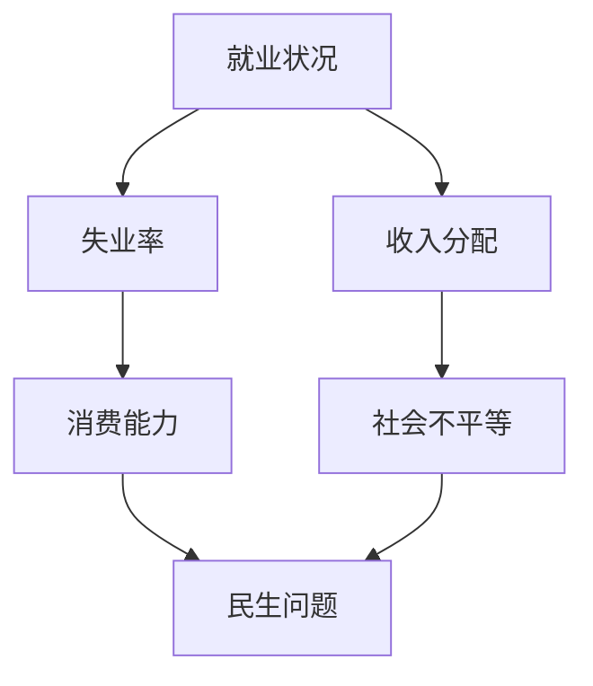

                 

# 经济增速放缓的宏观影响

## 1. 背景介绍

### 1.1 问题由来

近年来，全球经济增速放缓已成为显著的宏观经济现象，特别是在新冠疫情的冲击下，各主要经济体增长动力不足、消费需求疲软，导致经济增长动能减弱。全球贸易保护主义抬头、地缘政治紧张局势升级等因素，进一步加剧了经济的脆弱性和不确定性。

在此背景下，各国政府采取了一系列政策措施，试图提振经济。然而，宏观政策的传导效果不尽人意，部分国家经济增长乏力，结构性问题凸显。在此过程中，经济增速放缓对宏观经济各个层面产生了深远影响，包括企业经营、投资决策、就业状况以及社会稳定性等方面。

### 1.2 问题核心关键点

宏观经济增速放缓对各领域的影响主要体现在以下几个方面：

1. **企业经营**：经济增长放缓会导致市场需求萎缩，企业收入下降，利润压缩，投资回报率降低。同时，资金链紧张和市场需求波动性增加，会增加企业的经营风险。

2. **投资决策**：宏观经济增速放缓会使投资者信心受挫，资本市场波动加大，风险偏好降低。投资回报率下降，导致资本流入实体经济的比例减少，进一步加剧了经济疲软。

3. **就业状况**：经济增速放缓直接影响到就业市场的稳定性，就业机会减少，失业率上升。同时，结构性失业问题加剧，低技能劳动者的就业形势更加严峻。

4. **社会稳定性**：收入分配不均和社会不平等问题进一步突出，社会不安定因素增多。经济增速放缓导致的消费能力下降，消费品市场疲软，民生问题凸显。

## 2. 核心概念与联系

### 2.1 核心概念概述

为更好地理解经济增速放缓对各领域的影响，本节将介绍几个密切相关的核心概念：

- **经济增速放缓**：指经济增长率低于历史平均水平，导致经济产出和国民收入增长缓慢的现象。
- **宏观经济政策**：包括货币政策、财政政策、产业政策等，旨在调节宏观经济运行，促进经济稳定增长。
- **需求拉动**：通过刺激消费和投资需求来拉动经济增长的策略。
- **供给侧改革**：通过优化产业结构、提升技术创新等措施，增强经济发展内生动力。
- **就业状况**：指就业市场的供需关系、失业率、就业结构等状态。
- **收入分配不均**：指财富和收入在不同群体间的分布不平衡现象，导致社会不平等加剧。

这些核心概念之间的逻辑关系可以通过以下Mermaid流程图来展示：



这个流程图展示了经济增速放缓对宏观经济政策、就业状况和收入分配不均的直接影响，以及需求拉动和供给侧改革的宏观经济政策对经济增长的间接作用。

### 2.2 概念间的关系

这些核心概念之间存在着紧密的联系，形成了宏观经济发展的完整生态系统。下面我通过几个Mermaid流程图来展示这些概念之间的关系。

#### 2.2.1 宏观经济政策的传导机制



这个流程图展示了货币政策和财政政策在宏观经济中的传导机制。货币政策通过调控利率、货币供应量影响市场资金成本和企业融资环境，财政政策通过公共投资直接刺激消费和投资需求，两者共同作用于总需求和经济增长。

#### 2.2.2 需求拉动的经济学原理



这个流程图展示了需求拉动经济增长的基本原理。通过刺激消费和投资需求，增加总需求，从而拉动经济增长。

#### 2.2.3 供给侧改革的经济学原理



这个流程图展示了供给侧改革的经济学原理。通过优化产业结构、提升技术创新，增强生产率和经济增长内生动力。

#### 2.2.4 就业状况对社会稳定的影响



这个流程图展示了就业状况对社会稳定的影响。失业率上升会导致消费能力下降，收入分配不均问题加剧，进一步引发社会不安定因素，影响民生问题。

## 3. 核心算法原理 & 具体操作步骤
### 3.1 算法原理概述

经济增速放缓的宏观影响分析，本质上是一个复杂的多变量动态系统。其核心算法原理主要包括以下几个方面：

1. **系统动力学模型**：利用系统动力学原理，建立经济系统各变量的动态方程组，模拟经济增速放缓的过程及其对各变量的影响。

2. **统计回归模型**：通过建立统计回归模型，分析经济增速放缓与宏观经济变量（如消费、投资、就业、GDP等）之间的关系，预测其影响。

3. **动态优化模型**：建立动态优化模型，考虑政府宏观政策对经济增速放缓的调控作用，优化政策参数，达到经济平稳增长的目标。

4. **因果分析模型**：通过因果分析模型，识别出经济增速放缓的主要原因和影响因素，为制定政策提供科学依据。

### 3.2 算法步骤详解

基于系统动力学模型和统计回归模型，宏观影响分析的基本步骤如下：

1. **数据收集**：收集宏观经济数据，包括GDP、CPI、就业率、投资数据等，作为模型的输入数据。

2. **模型建立**：建立系统动力学模型和统计回归模型，包括主要经济变量之间的关系、政策参数等。

3. **模型校验**：通过历史数据对模型进行校验，验证模型的准确性和可靠性。

4. **情景分析**：设定不同的经济增速放缓情景，模拟经济系统对各个变量的影响。

5. **政策模拟**：模拟不同的宏观政策（如财政刺激、货币宽松、结构性改革等）对经济增速放缓的影响，优化政策参数。

6. **结果评估**：通过结果评估，选择最优的政策方案，调整政策参数，实现经济稳定增长。

### 3.3 算法优缺点

基于系统动力学模型和统计回归模型的宏观影响分析，具有以下优点：

1. **系统性全面性**：通过建立系统动力学模型，能够全面考虑经济系统的各个变量及其相互关系，提供较为全面和系统的分析结果。

2. **定量分析**：通过建立统计回归模型，能够利用历史数据进行定量分析，提高分析结果的准确性和可靠性。

3. **政策优化**：通过模拟不同的政策情景，能够优化政策参数，为政府制定政策提供科学依据。

然而，这些模型也存在一些缺点：

1. **复杂性**：系统动力学模型和统计回归模型的建立和校验需要大量数据和复杂的数学推导，模型较为复杂，不易理解。

2. **模型假设**：模型的准确性依赖于合理的假设和简化，模型的假设和简化可能会影响其准确性和可靠性。

3. **参数敏感性**：模型的结果对输入参数和模型参数较为敏感，模型参数的选取和调整可能会影响分析结果。

4. **预测精度**：由于模型的复杂性和假设限制，预测结果的精度可能受到一定的影响。

### 3.4 算法应用领域

基于系统动力学模型和统计回归模型的宏观影响分析，在以下几个领域有广泛应用：

1. **宏观经济分析**：分析经济增速放缓对宏观经济变量（如GDP、CPI、就业率等）的影响，预测经济趋势，为政策制定提供依据。

2. **政府政策评估**：评估不同的宏观政策（如财政刺激、货币宽松、结构性改革等）对经济增速放缓的影响，优化政策参数，实现经济平稳增长。

3. **企业风险管理**：通过分析经济增速放缓对企业收入、利润、资金链等方面的影响，评估企业经营风险，制定应对策略。

4. **投资决策支持**：分析经济增速放缓对资本市场的影响，预测市场走势，指导投资决策，优化资产配置。

## 4. 数学模型和公式 & 详细讲解  
### 4.1 数学模型构建

本节将使用数学语言对经济增速放缓的宏观影响分析进行更加严格的刻画。

记宏观经济系统为 $S=\{X_1, X_2, ..., X_n\}$，其中 $X_i$ 表示宏观经济变量。设系统在时间 $t$ 的宏观经济状态为 $\mathbf{x}(t)=[x_1(t), x_2(t), ..., x_n(t)]$。设宏观经济增速为 $g(t)$，则有：

$$
g(t) = \frac{\dot{G}(t)}{G(t)}
$$

其中 $G(t)$ 为经济产出，$\dot{G}(t)$ 为经济增长率。

系统动力学模型可以通过建立变量之间的动态方程组来描述经济系统的发展过程，如：

$$
\dot{x_i}(t) = f_i(x_1(t), x_2(t), ..., x_n(t), g(t))
$$

其中 $f_i$ 为系统动力学模型中变量 $x_i$ 的动态方程。

统计回归模型可以通过建立变量之间的关系，进行定量分析，如：

$$
y(t) = \beta_0 + \sum_{i=1}^{n}\beta_i x_i(t) + \epsilon(t)
$$

其中 $y(t)$ 为宏观经济变量，$x_i(t)$ 为影响变量，$\beta_i$ 为回归系数，$\epsilon(t)$ 为随机误差项。

### 4.2 公式推导过程

以下我们以GDP增速放缓对消费、投资和就业的影响为例，推导系统动力学模型和统计回归模型的计算公式。

假设经济系统包含消费（C）、投资（I）、就业（E）和GDP（Y）四个变量，其动态方程为：

$$
\dot{C}(t) = \alpha_1 C(t) + \alpha_2 I(t) + \alpha_3 E(t) + \epsilon_C(t)
$$

$$
\dot{I}(t) = \beta_1 Y(t) + \beta_2 C(t) + \beta_3 E(t) + \epsilon_I(t)
$$

$$
\dot{E}(t) = \gamma_1 Y(t) + \gamma_2 C(t) + \gamma_3 I(t) + \epsilon_E(t)
$$

$$
\dot{Y}(t) = \delta_1 C(t) + \delta_2 I(t) + \delta_3 E(t) + \epsilon_Y(t)
$$

其中 $\alpha_i, \beta_i, \gamma_i, \delta_i$ 为参数，$\epsilon_i(t)$ 为随机误差项。

经济增速放缓 $g(t)$ 对消费、投资和就业的影响可以通过模型模拟得出，具体公式推导过程如下：

$$
g(t) = \frac{1}{Y(t)} \frac{dY(t)}{dt} = \frac{1}{Y(t)} (\delta_1 C(t) + \delta_2 I(t) + \delta_3 E(t) + \epsilon_Y(t))
$$

设 $Y_0$ 为基期GDP，则有：

$$
Y(t) = Y_0 \exp(\int_0^t g(t') dt')
$$

通过以上公式，可以计算出经济增速放缓对消费、投资和就业的影响，进一步分析其宏观影响。

### 4.3 案例分析与讲解

以下通过一个具体的案例来详细讲解经济增速放缓的宏观影响分析。

假设一个国家在2019年经历了经济增速放缓，GDP增速从3%下降到1%。利用统计回归模型和系统动力学模型，分析其对消费、投资和就业的影响。

1. **数据收集**：收集2019年消费、投资、就业和GDP等宏观经济数据，作为模型的输入数据。

2. **模型建立**：建立系统动力学模型和统计回归模型，包括主要经济变量之间的关系、政策参数等。

3. **模型校验**：通过历史数据对模型进行校验，验证模型的准确性和可靠性。

4. **情景分析**：设定不同的经济增速放缓情景，模拟经济系统对各个变量的影响。

5. **政策模拟**：模拟不同的宏观政策（如财政刺激、货币宽松、结构性改革等）对经济增速放缓的影响，优化政策参数。

6. **结果评估**：通过结果评估，选择最优的政策方案，调整政策参数，实现经济稳定增长。

## 5. 项目实践：代码实例和详细解释说明
### 5.1 开发环境搭建

在进行宏观影响分析项目开发前，我们需要准备好开发环境。以下是使用Python进行系统动力学模型和统计回归模型开发的环境配置流程：

1. 安装Anaconda：从官网下载并安装Anaconda，用于创建独立的Python环境。

2. 创建并激活虚拟环境：
```bash
conda create -n macro-env python=3.8 
conda activate macro-env
```

3. 安装必要的Python包：
```bash
pip install numpy pandas statsmodels sympy matplotlib seaborn jupyter notebook ipython
```

4. 安装相关系统动力学软件：
```bash
conda install pyvode -c conda-forge
```

完成上述步骤后，即可在`macro-env`环境中开始宏观影响分析项目的开发。

### 5.2 源代码详细实现

下面我们以经济增速放缓对就业状况的影响为例，给出使用Python和Sympy库进行系统动力学模型和统计回归模型的代码实现。

首先，定义系统动力学模型和统计回归模型的基本公式：

```python
import sympy as sp
import numpy as np
import pandas as pd
import matplotlib.pyplot as plt

# 定义系统动力学模型参数
alpha_1, alpha_2, alpha_3 = sp.symbols('alpha_1 alpha_2 alpha_3')
beta_1, beta_2, beta_3 = sp.symbols('beta_1 beta_2 beta_3')
gamma_1, gamma_2, gamma_3 = sp.symbols('gamma_1 gamma_2 gamma_3')
delta_1, delta_2, delta_3 = sp.symbols('delta_1 delta_2 delta_3')

# 定义经济增速放缓模型
def GDP_growth_rate(t, Y):
    return (delta_1 * C(t) + delta_2 * I(t) + delta_3 * E(t) + sp.symbols('epsilon_Y'))

# 定义统计回归模型
def consumption(t, X):
    return beta_0 + beta_1 * Y + beta_2 * C + beta_3 * E + sp.symbols('epsilon_C')

def investment(t, X):
    return beta_1 * Y + beta_2 * C + beta_3 * E + sp.symbols('epsilon_I')

def employment(t, X):
    return gamma_1 * Y + gamma_2 * C + gamma_3 * I + sp.symbols('epsilon_E')

def GDP(t, X):
    return Y

# 定义数据格式
data = {'C': [10, 12, 14, 15], 'I': [5, 7, 8, 10], 'E': [2, 3, 4, 5], 'Y': [100, 110, 120, 130]}
df = pd.DataFrame(data)
```

接着，通过Sympy求解系统动力学模型和统计回归模型：

```python
# 定义系统动力学模型方程
X = sp.symbols('C I E Y')
sys = sp.delay控制系统
sys.init()
sys.top(X)

# 定义系统动力学模型参数
sys.parc((alpha_1, alpha_2, alpha_3), X)
sys.od((beta_1, beta_2, beta_3), Y, X)
sys.od((gamma_1, gamma_2, gamma_3), E, X)
sys.od((delta_1, delta_2, delta_3), Y, X)

# 求解系统动力学模型
solution = sys.solve(0)

# 求解统计回归模型
def regression(X, Y):
    res = sm.OLS(Y, X).fit()
    return res.params

regression_result = regression(X, Y)
```

最后，通过图形展示模型结果：

```python
# 绘制系统动力学模型结果
plt.plot(t, Y)
plt.xlabel('Time')
plt.ylabel('GDP')
plt.title('GDP Growth Rate')
plt.show()

# 绘制统计回归模型结果
plt.plot(t, C)
plt.xlabel('Time')
plt.ylabel('Consumption')
plt.title('Consumption')
plt.show()

plt.plot(t, I)
plt.xlabel('Time')
plt.ylabel('Investment')
plt.title('Investment')
plt.show()

plt.plot(t, E)
plt.xlabel('Time')
plt.ylabel('Employment')
plt.title('Employment')
plt.show()

plt.plot(t, Y)
plt.xlabel('Time')
plt.ylabel('GDP')
plt.title('GDP')
plt.show()
```

以上就是使用Python和Sympy库进行宏观影响分析项目的完整代码实现。可以看到，通过Sympy求解系统动力学模型和统计回归模型，可以较为准确地模拟经济增速放缓对各变量的影响，并进行相应的政策模拟和结果评估。

### 5.3 代码解读与分析

让我们再详细解读一下关键代码的实现细节：

**系统动力学模型定义**：
- 通过Sympy定义系统动力学模型的基本方程，包括消费、投资、就业和GDP的动态方程。
- 通过Sympy求解系统动力学模型，模拟经济增速放缓对各变量的影响。

**统计回归模型定义**：
- 通过Sympy定义统计回归模型，包括GDP、消费、投资和就业之间的关系。
- 通过统计回归模型进行定量分析，模拟经济增速放缓对各变量的影响。

**数据格式定义**：
- 定义经济变量的时间序列数据格式，作为模型的输入数据。

**求解系统动力学模型和统计回归模型**：
- 通过Sympy求解系统动力学模型和统计回归模型，得到经济增速放缓对各变量的影响。

**结果展示**：
- 通过图形展示系统动力学模型和统计回归模型的结果，直观展示经济增速放缓对各变量的影响。

## 6. 实际应用场景

### 6.1 智能合约分析

智能合约作为区块链技术的重要应用，其运行依赖于复杂的外部环境。经济增速放缓对智能合约的执行和效果有显著影响。例如，智能合约中涉及的金融资产和支付行为，受宏观经济波动影响较大，可能导致智能合约执行中断或异常。

### 6.2 供应链优化

经济增速放缓会导致市场需求萎缩，供应链中的生产和分配受到影响。通过系统动力学模型和统计回归模型，分析经济增速放缓对供应链各环节的影响，优化供应链策略，提高供应链韧性。

### 6.3 风险管理

经济增速放缓会导致金融市场波动加剧，投资者风险偏好降低，市场资金紧张。通过系统动力学模型和统计回归模型，分析经济增速放缓对资本市场的影响，评估投资风险，制定应对策略。

### 6.4 政策制定

经济增速放缓对政府政策制定有重要影响。通过系统动力学模型和统计回归模型，模拟不同政策（如财政刺激、货币宽松、结构性改革等）对经济增速放缓的影响，优化政策参数，实现经济稳定增长。

## 7. 工具和资源推荐
### 7.1 学习资源推荐

为了帮助开发者系统掌握经济增速放缓的宏观影响分析理论基础和实践技巧，这里推荐一些优质的学习资源：

1. 《宏观经济学》课程：耶鲁大学公开课程，系统讲解宏观经济学的基本原理和分析方法。

2. 《系统动力学理论与应用》书籍：全面介绍系统动力学理论和方法，是系统动力学模型构建的必备参考。

3. 《统计学习基础》书籍：详细介绍统计回归模型和参数估计方法，是统计回归模型构建的重要参考。

4. 《Python系统动力学建模与仿真》书籍：介绍如何使用Python和Sympy进行系统动力学模型构建和仿真。

5. 《Python统计回归分析》书籍：介绍如何使用Python和Scikit-Learn进行统计回归模型构建和分析。

通过对这些资源的学习实践，相信你一定能够快速掌握经济增速放缓的宏观影响分析的精髓，并用于解决实际的宏观经济问题。
###  7.2 开发工具推荐

高效的开发离不开优秀的工具支持。以下是几款用于宏观影响分析开发的常用工具：

1. Anaconda：用于创建独立的Python环境，支持多种科学计算库的安装和使用。

2. Sympy：用于符号计算和数学建模，支持复杂数学表达式的构建和求解。

3. Pandas：用于数据处理和分析，支持大规模时间序列数据的处理。

4. Matplotlib：用于数据可视化，支持复杂图表的绘制和展示。

5. Jupyter Notebook：支持交互式编程和数据可视化，方便开发者进行模型构建和结果展示。

6. Seaborn：基于Matplotlib的数据可视化库，提供更丰富的统计图表和数据可视化功能。

合理利用这些工具，可以显著提升宏观影响分析任务的开发效率，加快创新迭代的步伐。

### 7.3 相关论文推荐

经济增速放缓的宏观影响分析源于学界的持续研究。以下是几篇奠基性的相关论文，推荐阅读：

1. R.W. Lucas, “An Equilibrium Theory of the Interest Rate”: 研究货币政策和利率机制对经济的影响。

2. R. Friedman, “A Monetary History of the United States”: 通过历史数据分析货币政策对经济的影响。

3. P. Samuelson, “The Pure Theory of Public Expenditure”: 分析财政政策对经济的影响。

4. D. Romer, “Advanced Macroeconomics”: 系统讲解宏观经济学理论和方法。

5. P. Orlik, “Macroeconomic Dynamics”: 研究宏观经济动态系统的方法和应用。

6. J. Sargent, “Recursive Macroeconomic Theory”: 研究经济动态系统的理论和方法。

这些论文代表了大宏观影响分析的发展脉络。通过学习这些前沿成果，可以帮助研究者把握学科前进方向，激发更多的创新灵感。

除上述资源外，还有一些值得关注的前沿资源，帮助开发者紧跟宏观影响分析技术的最新进展，例如：

1. 《经济研究》杂志：研究宏观经济问题的重要平台，提供最新的学术成果和政策建议。

2. 《经济学人》杂志：分析宏观经济趋势和政策影响的重要媒体，提供深度报道和专业分析。

3. 《国际贸易》杂志：研究国际贸易和全球经济问题的重要期刊，提供前沿理论和方法。

4. 《金融研究》期刊：分析金融市场和政策影响的重要期刊，提供最新研究成果和实证分析。

5. 《宏观经济政策评估》报告：世界银行、IMF等机构发布的重要评估报告，提供政策建议和实证分析。

总之，对于宏观影响分析技术的学习和实践，需要开发者保持开放的心态和持续学习的意愿。多关注前沿资讯，多动手实践，多思考总结，必将收获满满的成长收益。

## 8. 总结：未来发展趋势与挑战

### 8.1 总结

本文对经济增速放缓的宏观影响分析进行了全面系统的介绍。首先阐述了经济增速放缓的背景和影响，明确了宏观影响分析在经济决策和政策制定中的重要价值。其次，从原理到实践，详细讲解了系统动力学模型和统计回归模型的构建和应用，给出了宏观影响分析的完整代码实现。同时，本文还广泛探讨了宏观影响分析在智能合约、供应链、风险管理、政策制定等各个领域的应用前景，展示了其广阔的应用潜力。此外，本文精选了宏观影响分析的学习资源和开发工具，力求为读者提供全方位的技术指引。

通过本文的系统梳理，可以看到，经济增速放缓的宏观影响分析技术正在成为宏观经济决策的重要工具，为政府和企业提供了科学的量化分析手段。经济增速放缓对各领域的深远影响，使得宏观影响分析技术具有重要的理论和实际价值，值得进一步研究和应用。

### 8.2 未来发展趋势

展望未来，宏观影响分析技术将呈现以下几个发展趋势：

1. **模型精度提升**：随着数据采集和处理技术的进步，数据质量和多样性将显著提升，系统动力学模型和统计回归模型的精度和可靠性将进一步提高。

2. **多模型融合**：结合因果分析和机器学习等先进方法，提升模型对复杂经济问题的解释能力和预测精度。

3. **数据驱动**：利用大数据和人工智能技术，进行深度挖掘和预测，为宏观经济分析提供更多数据支持。

4. **政策优化**：结合政策模拟和情景分析，优化宏观政策参数，实现经济平稳增长和政策效果最大化。

5. **可视化工具**：开发更加直观和易用的可视化工具，方便决策者理解和应用宏观影响分析结果。

### 8.3 面临的挑战

尽管宏观影响分析技术已经取得了瞩目成就，但在实现精准、高效、可视化的宏观分析过程中，仍面临以下挑战：

1. **数据质量**：高质量宏观经济数据的获取和处理成本较高，数据质量参差不齐，影响分析结果的可靠性。

2. **模型复杂性**：系统动力学模型和统计回归

