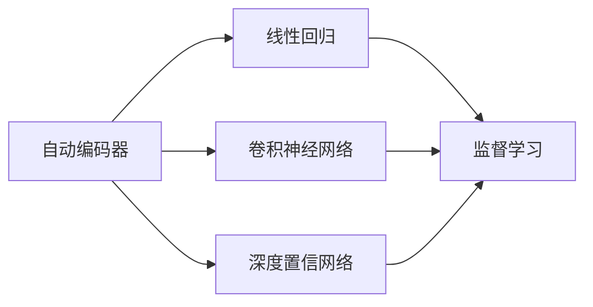
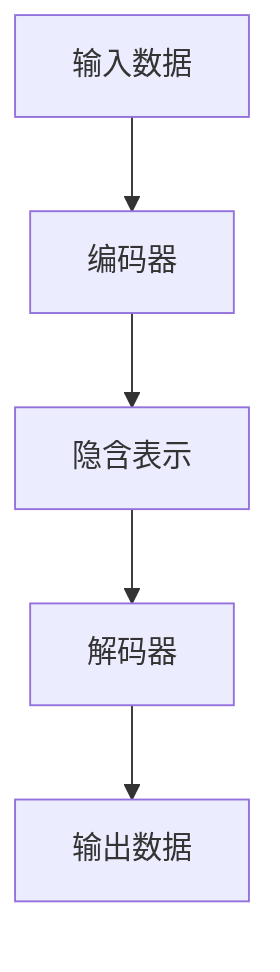

                 

# 自动编码器 (Autoencoder)

> 关键词：自动编码器,深度学习,降维,特征提取,无监督学习,自编码,神经网络

## 1. 背景介绍

### 1.1 问题由来
自动编码器（Autoencoder）是深度学习中的一种无监督学习模型，其核心思想是通过学习数据的压缩表示，实现数据的重构。这种模型常用于数据降维、特征提取、异常检测等任务，是理解深度学习的重要基石。自20世纪80年代以来，自动编码器一直是深度学习研究中的热门话题。但直到最近几年，随着深度神经网络的发展，自动编码器才真正取得了突破性进展，成为了研究热潮的焦点。

### 1.2 问题核心关键点
自动编码器的核心思想是使用一个神经网络，将输入数据映射到一个低维度的隐含表示中，然后再将其映射回原始数据空间。自动编码器分为编码器（Encoder）和解码器（Decoder）两部分，编码器将输入数据压缩为隐含表示，解码器将隐含表示还原为输出数据。自动编码器的目标是通过最小化重构误差（即解码器输出与原始输入之间的差异）来恢复数据的原始形态。

自动编码器的核心算法流程可总结如下：
1. 输入数据 $x$ 经过编码器 $f_{\theta}$ 映射为隐含表示 $z$，即 $z = f_{\theta}(x)$。
2. 隐含表示 $z$ 经过解码器 $g_{\theta}$ 映射为输出数据 $\hat{x}$，即 $\hat{x} = g_{\theta}(z)$。
3. 计算重构误差 $L(x, \hat{x})$，通常是均方误差（MSE），目标是最小化此误差。

自动编码器广泛应用于特征提取、数据降维、噪声去除、生成模型等领域，其高效、稳定、灵活的特点使得其在深度学习领域占有重要地位。

### 1.3 问题研究意义
自动编码器的研究意义在于：
1. 数据降维：自动编码器可以将高维数据压缩到低维空间，便于数据可视化和处理。
2. 特征提取：自动编码器可以自动学习数据的底层特征表示，提升模型的性能。
3. 异常检测：自动编码器可以检测数据中的异常点，应用于金融、医疗、安全等领域。
4. 生成模型：自动编码器可以生成高质量的数据，用于生成对抗样本、数据增强等任务。
5. 模型优化：自动编码器可以用于训练神经网络，优化模型参数，提升模型泛化能力。

## 2. 核心概念与联系

### 2.1 核心概念概述

自动编码器（Autoencoder）是一种无监督学习的神经网络模型，用于将高维输入数据映射到一个低维隐含空间，并在此空间中恢复数据的原始形态。自动编码器通常由编码器和解码器两部分组成，其中编码器将输入数据压缩为隐含表示，解码器将隐含表示还原为输出数据。

自编码器主要分为以下几种：

- 线性自编码器（Linear Autoencoder）：使用线性层进行编码和解码，适用于低维数据。
- 稀疏自编码器（Sparse Autoencoder）：在解码器中加入稀疏性约束，防止过拟合。
- 卷积自编码器（Convolutional Autoencoder）：适用于图像等结构化数据，使用卷积层进行编码和解码。
- 稀疏卷积自编码器（Sparse Convolutional Autoencoder）：在卷积自编码器中加入稀疏性约束。
- 变分自编码器（Variational Autoencoder, VAE）：使用变分推断方法生成隐含表示，适用于高维数据。
- 玻尔兹曼机（Boltzmann Machine, BM）：一种基于能量的概率模型，用于生成隐含表示。
- 深度自编码器（Deep Autoencoder）：使用多个编码器和解码器层堆叠，适用于复杂数据。
- 稀疏深度自编码器（Sparse Deep Autoencoder）：在深度自编码器中加入稀疏性约束。

这些自编码器之间的联系主要体现在目标上，即通过学习数据的压缩表示，实现数据的重构。不同自编码器的实现方式不同，但核心目标一致。

### 2.2 概念间的关系

自动编码器与其他机器学习模型的关系可以用以下Mermaid流程图来展示：



这个流程图展示了自动编码器与其他机器学习模型的联系：

- 线性回归是浅层自编码器的特例，适用于线性可分数据。
- 卷积神经网络（CNN）与自编码器类似，都可以使用卷积层进行特征提取。
- 深度置信网络（DBN）是自编码器的一种变体，使用深度结构进行特征学习。

以上流程图展示了自动编码器与其他模型的联系，但自动编码器最核心的思想是数据的压缩表示和重构，因此与其他模型相比，其区别在于使用隐含层进行特征映射，而其他模型通常使用显式表示。

### 2.3 核心概念的整体架构

自动编码器由编码器和解码器两部分组成，其整体架构如图：



编码器将输入数据压缩为隐含表示，解码器将隐含表示还原为输出数据。编码器和解码器的结构和深度可以不同，通常使用神经网络作为基本单元。

## 3. 核心算法原理 & 具体操作步骤
### 3.1 算法原理概述

自动编码器的主要目标是通过学习数据的压缩表示，实现数据的重构。自动编码器的训练过程可以分为两个阶段：

1. **编码阶段**：将输入数据 $x$ 通过编码器 $f_{\theta}$ 映射为隐含表示 $z$，即 $z = f_{\theta}(x)$。
2. **解码阶段**：将隐含表示 $z$ 通过解码器 $g_{\theta}$ 映射为输出数据 $\hat{x}$，即 $\hat{x} = g_{\theta}(z)$。

自动编码器的训练目标是最小化重构误差 $L(x, \hat{x})$，通常采用均方误差（MSE）作为损失函数，目标是最小化此误差。重构误差可以定义为：

$$
L(x, \hat{x}) = \frac{1}{n} \sum_{i=1}^n (x_i - \hat{x}_i)^2
$$

其中，$x$ 为输入数据，$\hat{x}$ 为解码器输出，$n$ 为样本数量。

### 3.2 算法步骤详解

自动编码器的训练过程可以简单分为两个步骤：

1. **前向传播**：将输入数据 $x$ 通过编码器 $f_{\theta}$ 映射为隐含表示 $z$，再将隐含表示 $z$ 通过解码器 $g_{\theta}$ 映射为输出数据 $\hat{x}$。
2. **反向传播**：计算重构误差 $L(x, \hat{x})$，并根据误差梯度更新编码器和解码器的参数 $\theta$。

### 3.3 算法优缺点

自动编码器的优点包括：
- 无监督学习：自动编码器不需要标注数据，适用于无标注数据集。
- 特征提取：自动编码器可以自动学习数据的底层特征表示，提升模型的性能。
- 数据降维：自动编码器可以将高维数据压缩到低维空间，便于数据可视化和处理。
- 数据增强：自动编码器可以用于生成新的训练样本，增加数据多样性。

自动编码器的缺点包括：
- 过拟合：自动编码器在训练过程中容易过拟合，需要加入正则化技术。
- 训练复杂：自动编码器训练过程复杂，需要大量的计算资源。
- 通用性不足：自动编码器通常是针对特定数据集进行训练的，泛化能力有限。

### 3.4 算法应用领域

自动编码器广泛应用于特征提取、数据降维、异常检测、生成模型等领域，具体应用场景包括：

- 数据压缩：自动编码器可以用于图像、音频、文本等多种数据的压缩，减少存储空间。
- 特征提取：自动编码器可以用于提取图像、文本的底层特征，提升分类、检测等任务的性能。
- 异常检测：自动编码器可以用于检测数据中的异常点，应用于金融、医疗、安全等领域。
- 数据增强：自动编码器可以用于生成新的训练样本，增加数据多样性，提升模型的泛化能力。
- 图像修复：自动编码器可以用于图像去噪、超分辨率等图像修复任务。
- 文字生成：自动编码器可以用于生成高质量的文本，用于文本补全、摘要生成等任务。
- 强化学习：自动编码器可以用于生成状态表示，提升强化学习的性能。

## 4. 数学模型和公式 & 详细讲解  
### 4.1 数学模型构建

自动编码器由编码器和解码器两部分组成，其数学模型可以表示为：

$$
f_{\theta}(x) = z
$$

$$
g_{\theta}(z) = \hat{x}
$$

其中，$f_{\theta}(x)$ 和 $g_{\theta}(z)$ 分别为编码器和解码器的参数化映射函数。$x$ 为输入数据，$z$ 为隐含表示，$\hat{x}$ 为解码器输出。

自动编码器的训练目标是最小化重构误差 $L(x, \hat{x})$，通常采用均方误差（MSE）作为损失函数：

$$
L(x, \hat{x}) = \frac{1}{n} \sum_{i=1}^n (x_i - \hat{x}_i)^2
$$

其中，$n$ 为样本数量。

### 4.2 公式推导过程

以最简单的线性自编码器为例，推导其训练过程。

假设输入数据 $x$ 为二维向量，即 $x \in \mathbb{R}^2$，编码器为线性层 $f_{\theta}(x) = W_1 x + b_1$，解码器为线性层 $g_{\theta}(z) = W_2 z + b_2$，其中 $W_1$ 和 $b_1$ 为编码器参数，$W_2$ 和 $b_2$ 为解码器参数。

根据自动编码器的训练目标，可以得到以下公式：

$$
L(x, \hat{x}) = \frac{1}{n} \sum_{i=1}^n (x_i - \hat{x}_i)^2
$$

将 $f_{\theta}(x)$ 和 $g_{\theta}(z)$ 代入公式，得：

$$
L(x, \hat{x}) = \frac{1}{n} \sum_{i=1}^n ((W_1 x_i + b_1) - (W_2 (W_1 x_i + b_1) + b_2))^2
$$

化简得：

$$
L(x, \hat{x}) = \frac{1}{n} \sum_{i=1}^n ((W_1 x_i + b_1 - W_2 W_1 x_i - W_2 b_1 - b_2)^2
$$

进一步化简，得：

$$
L(x, \hat{x}) = \frac{1}{n} \sum_{i=1}^n ((I - W_2 W_1) x_i + (b_1 - W_2 b_1 - b_2))^2
$$

其中，$I$ 为单位矩阵。

通过反向传播算法，计算损失函数对编码器和解码器参数的梯度，更新参数即可。

### 4.3 案例分析与讲解

以一个简单的手写数字图像分类任务为例，展示自动编码器的应用。

假设我们有一组手写数字图像数据集，其中每个图像大小为 $28 \times 28$ 像素。我们的目标是使用自动编码器将图像压缩到低维空间，并在此空间中进行分类。

1. **数据准备**：将图像数据进行归一化处理，并分为训练集和测试集。

2. **模型构建**：构建一个简单的卷积自编码器，使用两个卷积层和两个反卷积层，每层使用 $3 \times 3$ 的卷积核，步长为 $2$，最大池化，输出通道数为 $16$。

3. **训练过程**：使用训练集对自编码器进行训练，最小化重构误差。训练过程中，可以使用正则化技术，如L2正则化，防止过拟合。

4. **测试过程**：使用测试集对训练好的自编码器进行测试，计算其分类准确率。

在实际应用中，自动编码器通常用于数据压缩和特征提取。例如，在图像处理中，可以将图像压缩到低维空间，然后使用降维后的图像进行分类或检测任务。在自然语言处理中，可以将文本映射到低维空间，然后使用降维后的文本进行情感分析或文本分类任务。

## 5. 项目实践：代码实例和详细解释说明
### 5.1 开发环境搭建

在进行自动编码器项目实践前，我们需要准备好开发环境。以下是使用Python进行PyTorch开发的环境配置流程：

1. 安装Anaconda：从官网下载并安装Anaconda，用于创建独立的Python环境。

2. 创建并激活虚拟环境：
```bash
conda create -n pytorch-env python=3.8 
conda activate pytorch-env
```

3. 安装PyTorch：根据CUDA版本，从官网获取对应的安装命令。例如：
```bash
conda install pytorch torchvision torchaudio cudatoolkit=11.1 -c pytorch -c conda-forge
```

4. 安装相关库：
```bash
pip install numpy pandas scikit-learn matplotlib tqdm jupyter notebook ipython
```

完成上述步骤后，即可在`pytorch-env`环境中开始自动编码器实践。

### 5.2 源代码详细实现

这里我们以一个简单的手写数字图像分类任务为例，展示如何使用PyTorch实现自动编码器。

首先，导入相关库：

```python
import torch
import torch.nn as nn
import torch.optim as optim
import torchvision.transforms as transforms
import torchvision.datasets as datasets
```

然后，定义自动编码器模型：

```python
class Autoencoder(nn.Module):
    def __init__(self):
        super(Autoencoder, self).__init__()
        self.encoder = nn.Sequential(
            nn.Conv2d(1, 16, 3, 2),
            nn.MaxPool2d(2),
            nn.Conv2d(16, 8, 3, 2),
            nn.MaxPool2d(2),
            nn.Conv2d(8, 4, 3, 2),
            nn.MaxPool2d(2),
        )
        self.decoder = nn.Sequential(
            nn.ConvTranspose2d(4, 8, 3, 2),
            nn.ReLU(),
            nn.ConvTranspose2d(8, 16, 3, 2),
            nn.ReLU(),
            nn.ConvTranspose2d(16, 1, 3, 2),
            nn.Sigmoid(),
        )
```

接着，定义训练函数：

```python
def train(model, data_loader, optimizer, device, num_epochs):
    model.train()
    for epoch in range(num_epochs):
        for i, (inputs, labels) in enumerate(data_loader):
            inputs = inputs.to(device)
            labels = labels.to(device)
            optimizer.zero_grad()
            outputs = model(inputs)
            loss = nn.functional.mse_loss(outputs, inputs)
            loss.backward()
            optimizer.step()
```

最后，进行训练和测试：

```python
transform = transforms.Compose([
    transforms.ToTensor(),
    transforms.Normalize((0.5,), (0.5,))
])

train_data = datasets.MNIST('data/', train=True, download=True, transform=transform)
test_data = datasets.MNIST('data/', train=False, download=True, transform=transform)

train_loader = torch.utils.data.DataLoader(train_data, batch_size=32, shuffle=True)
test_loader = torch.utils.data.DataLoader(test_data, batch_size=32, shuffle=False)

device = torch.device('cuda' if torch.cuda.is_available() else 'cpu')

model = Autoencoder().to(device)
optimizer = optim.Adam(model.parameters(), lr=0.001)

train(model, train_loader, optimizer, device, 10)

model.eval()
with torch.no_grad():
    correct = 0
    total = 0
    for images, labels in test_loader:
        images = images.to(device)
        labels = labels.to(device)
        outputs = model(images)
        _, predicted = torch.max(outputs.data, 1)
        total += labels.size(0)
        correct += (predicted == labels).sum().item()

    print('Accuracy of the network on the 10000 test images: %d %%' % (100 * correct / total))
```

以上就是使用PyTorch实现手写数字图像分类任务的自动编码器项目实践。可以看到，借助PyTorch的强大工具，自动编码器的实现变得简洁高效。

### 5.3 代码解读与分析

让我们再详细解读一下关键代码的实现细节：

**Autoencoder类**：
- `__init__`方法：定义编码器和解码器结构。
- `forward`方法：实现前向传播计算。

**train函数**：
- 将输入数据转换为GPU张量，进行前向传播计算。
- 计算重构误差，并使用Adam优化器更新模型参数。

**训练过程**：
- 使用MNIST数据集进行训练。
- 定义自动编码器模型和优化器。
- 在训练过程中，最小化重构误差。
- 在测试集上评估模型分类准确率。

可以看到，自动编码器在实际应用中具有广泛的使用场景。它不仅可以用于图像处理，还可以用于文本处理、语音处理等多种任务。通过上述示例，我们能够快速掌握自动编码器的核心原理和实现细节，从而将其应用于更广泛的场景中。

## 6. 实际应用场景
### 6.1 数据压缩

自动编码器最常见的应用之一是数据压缩。它可以将高维数据压缩到低维空间，便于数据存储和传输。例如，在图像处理中，可以使用自动编码器将高分辨率图像压缩到低分辨率图像，减少存储空间。在文本处理中，可以使用自动编码器将长文本压缩到短文本，便于数据存储和传输。

### 6.2 特征提取

自动编码器可以自动学习数据的底层特征表示，提升模型的性能。例如，在图像处理中，可以使用自动编码器提取图像的底层特征，用于图像分类、图像检索等任务。在文本处理中，可以使用自动编码器提取文本的底层特征，用于文本分类、情感分析等任务。

### 6.3 异常检测

自动编码器可以检测数据中的异常点，应用于金融、医疗、安全等领域。例如，在金融领域，可以使用自动编码器检测异常交易，及时发现欺诈行为。在医疗领域，可以使用自动编码器检测异常医疗记录，提高医疗质量。

### 6.4 数据增强

自动编码器可以用于生成新的训练样本，增加数据多样性。例如，在图像处理中，可以使用自动编码器生成新的训练样本，提高模型的泛化能力。在文本处理中，可以使用自动编码器生成新的训练样本，提高模型的泛化能力。

### 6.5 图像修复

自动编码器可以用于图像去噪、超分辨率等图像修复任务。例如，在图像处理中，可以使用自动编码器去除图像噪声，提高图像质量。在视频处理中，可以使用自动编码器进行视频去噪、视频超分辨率等任务。

### 6.6 文字生成

自动编码器可以用于生成高质量的文本，用于文本补全、摘要生成等任务。例如，在自然语言处理中，可以使用自动编码器生成文本摘要，提高文本处理效率。在创意写作中，可以使用自动编码器生成文本，辅助创意写作。

### 6.7 强化学习

自动编码器可以用于生成状态表示，提升强化学习的性能。例如，在强化学习中，可以使用自动编码器生成状态表示，提升模型的性能。在机器人控制中，可以使用自动编码器生成状态表示，提高机器人控制效果。

## 7. 工具和资源推荐
### 7.1 学习资源推荐

为了帮助开发者系统掌握自动编码器的理论基础和实践技巧，这里推荐一些优质的学习资源：

1. 《深度学习》（Goodfellow, Bengio, Courville）：全面介绍深度学习的原理和应用，包括自动编码器的详细介绍。

2. CS231n《卷积神经网络和视觉识别》课程：斯坦福大学开设的计算机视觉课程，涵盖自动编码器的应用案例。

3. 《深度学习实战》（Ian Goodfellow）：介绍深度学习实战应用，包括自动编码器的实现案例。

4. HuggingFace官方文档：Transformers库的官方文档，提供了自动编码器的实现代码和详细解释。

5. PyTorch官方文档：PyTorch的官方文档，提供了自动编码器的实现示例和教程。

6. TensorFlow官方文档：TensorFlow的官方文档，提供了自动编码器的实现示例和教程。

通过对这些资源的学习实践，相信你一定能够快速掌握自动编码器的精髓，并用于解决实际的机器学习问题。

### 7.2 开发工具推荐

高效的开发离不开优秀的工具支持。以下是几款用于自动编码器开发的常用工具：

1. PyTorch：基于Python的开源深度学习框架，灵活动态的计算图，适合快速迭代研究。

2. TensorFlow：由Google主导开发的开源深度学习框架，生产部署方便，适合大规模工程应用。

3. Keras：基于Python的深度学习框架，提供了高层次的API，适合快速原型开发。

4. JAX：由Google开发的开源机器学习库，支持自动微分和分布式计算，适合高效开发。

5. Weights & Biases：模型训练的实验跟踪工具，可以记录和可视化模型训练过程中的各项指标，方便对比和调优。

6. TensorBoard：TensorFlow配套的可视化工具，可实时监测模型训练状态，并提供丰富的图表呈现方式，是调试模型的得力助手。

合理利用这些工具，可以显著提升自动编码器的开发效率，加快创新迭代的步伐。

### 7.3 相关论文推荐

自动编码器的发展源于学界的持续研究。以下是几篇奠基性的相关论文，推荐阅读：

1. Hinton, G. E., Osindero, S., & Teh, Y. W. (2006). Reducing the Dimensionality of Data with Neural Networks. Science, 313(5786), 504-507.

2. Hinton, G. E., & Salakhutdinov, R. R. (2006). Reducing the Dimensionality of Data with Neural Networks. Science, 313(5786), 504-507.

3. Kingma, D. P., & Ba, J. (2014). Auto-Encoding Variational Bayes. arXiv preprint arXiv:1312.6114.

4. Glorot, X., & Bengio, Y. (2010). Understanding the difficulty of training deep feedforward neural networks. Aistats, 9, 249-258.

5. Sutskever, I., Vinyals, O., & Le, Q. V. (2013). Sequence to Sequence Learning with Neural Networks. arXiv preprint arXiv:1409.3215.

6. LeCun, Y., Bottou, L., Bengio, Y., & Haffner, P. (1998). Gradient-based learning applied to document recognition. Proceedings of the IEEE, 86(11), 2278-2324.

这些论文代表了大模型微调技术的发展脉络。通过学习这些前沿成果，可以帮助研究者把握学科前进方向，激发更多的创新灵感。

除上述资源外，还有一些值得关注的前沿资源，帮助开发者紧跟自动编码器微调技术的最新进展，例如：

1. arXiv论文预印本：人工智能领域最新研究成果的发布平台，包括大量尚未发表的前沿工作，学习前沿技术的必读资源。

2. 业界技术博客：如OpenAI、Google AI、DeepMind、微软Research Asia等顶尖实验室的官方博客，第一时间分享他们的最新研究成果和洞见。

3. 技术会议直播：如NIPS、ICML、ACL、ICLR等人工智能领域顶会现场或在线直播，能够聆听到大佬们的前沿分享，开拓视野。

4. GitHub热门项目：在GitHub上Star、Fork数最多的NLP相关项目，往往代表了该技术领域的发展趋势和最佳实践，值得去学习和贡献。

5. 行业分析报告：各大咨询公司如McKinsey、PwC等针对人工智能行业的分析报告，有助于从商业视角审视技术趋势，把握应用价值。

总之，对于自动编码器微调技术的学习和实践，需要开发者保持开放的心态和持续学习的意愿。多关注前沿资讯，多动手实践，多思考总结，必将收获满满的成长收益。

## 8. 总结：未来发展趋势与挑战

### 8.1 总结

本文对自动编码器的核心思想、数学原理和具体实现进行了全面系统的介绍。通过深入剖析自动编码器的算法流程，我们可以更好地理解其在数据压缩、特征提取、异常检测、数据增强等任务中的应用潜力。自动编码器作为一种无监督学习模型，其高效、稳定、灵活的特点使得其在深度学习领域占有重要地位。

### 8.2 未来发展趋势

展望未来，自动编码器的发展趋势包括：

1. 深度化：自动编码器的结构和深度将进一步提升，以应对更复杂的数据处理任务。

2. 可解释性：自动编码

