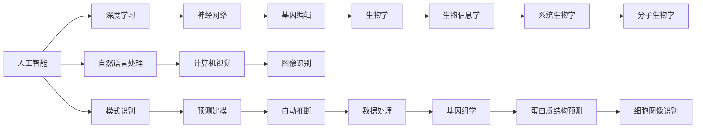

                 

# AI与生物学交叉原理与代码实战案例讲解

> 关键词：人工智能,生物学,交叉学科,基因编辑,深度学习,神经网络,案例分析

## 1. 背景介绍

### 1.1 问题由来

人工智能（AI）与生物学的交叉领域正在快速发展，为生物学研究和应用提供了新的视角和方法。特别是在基因编辑、药物发现、疾病诊断和治疗等关键领域，AI技术的引入极大地提升了效率和准确性。然而，如何将AI技术更好地应用于生物学研究，仍然面临诸多挑战。本文将系统探讨AI与生物学的交叉原理，并通过具体案例，展示AI技术在生物学中的实战应用。

### 1.2 问题核心关键点

- AI在生物学中的应用主要集中在数据处理、模式识别、预测建模和自动推断等方面。
- 深度学习、神经网络、自然语言处理等AI技术，在基因序列分析、蛋白质结构预测、细胞图像识别等领域取得了显著成果。
- AI与生物学的交叉研究，需要考虑数据的准确性、模型的解释性、计算资源的需求等问题。

### 1.3 问题研究意义

AI与生物学的交叉研究，不仅有助于提升生物学的研究水平和应用能力，还可以推动AI技术本身的发展。这种交叉领域的研究，为AI技术在更多实际问题中的应用提供了新的方向，也为生物学研究带来了全新的工具和方法。

## 2. 核心概念与联系

### 2.1 核心概念概述

为更好地理解AI与生物学的交叉原理，本节将介绍几个关键概念：

- 人工智能（AI）：利用计算机技术模拟人类智能活动的科学，包括机器学习、深度学习、自然语言处理、计算机视觉等方向。
- 生物学：研究生命体的结构、功能、进化和规律的科学，涵盖分子生物学、细胞生物学、系统生物学、生物信息学等分支。
- 基因编辑：通过特定的技术手段，直接修改生物体的基因组，用于疾病治疗、基因工程、农业改良等领域。
- 深度学习（Deep Learning）：基于神经网络的机器学习范式，通过多层神经网络处理非线性关系，在图像识别、自然语言处理等领域表现优异。
- 神经网络（Neural Network）：模仿人脑神经元结构和功能的计算模型，广泛应用于图像处理、语音识别、自然语言生成等领域。

这些概念之间的联系主要体现在，AI技术，特别是深度学习，在生物学中的应用，可以处理和分析海量的生物数据，提升对生命现象的认知和预测能力。AI与生物学交叉的核心，是通过数据驱动的方法，解决生物学领域中的实际问题。

### 2.2 概念间的关系

这些核心概念之间的逻辑关系可以通过以下Mermaid流程图来展示：



这个流程图展示了大语言模型微调过程中各个概念之间的关系：

1. 人工智能通过深度学习、神经网络等技术，处理生物学数据，提升认知能力。
2. 深度学习和神经网络在基因编辑、生物信息学等领域得到广泛应用。
3. 基因编辑技术在生物学研究和应用中发挥重要作用。
4. 生物信息学、系统生物学、分子生物学等分支，在AI技术的应用中得到了新的工具和方法。
5. AI技术在自然语言处理、计算机视觉等领域，也有着广泛的应用。

通过这个流程图，我们可以更清晰地理解AI与生物学交叉的逻辑框架和关键路径。

## 3. 核心算法原理 & 具体操作步骤
### 3.1 算法原理概述

AI与生物学的交叉研究，主要基于以下核心算法原理：

- **深度学习（Deep Learning）**：通过多层神经网络处理非线性关系，在基因序列分析、蛋白质结构预测等领域有广泛应用。
- **自然语言处理（NLP）**：通过文本处理、语义分析等技术，处理生物学文献和数据，提升信息检索和知识管理能力。
- **计算机视觉（CV）**：通过图像识别、图像处理等技术，分析和处理生物学图像数据，如细胞图像、蛋白质晶体结构等。
- **基因组学（Genomics）**：利用AI技术处理和分析基因组数据，进行基因组组装、基因变异检测等。
- **药物发现（Drug Discovery）**：利用AI技术预测分子结构与生物活性的关系，加速新药筛选和研发。

### 3.2 算法步骤详解

基于AI与生物学的交叉研究，一般包括以下关键步骤：

**Step 1: 数据准备与预处理**
- 收集生物学数据，如基因序列、蛋白质结构、细胞图像等。
- 清洗和预处理数据，去除噪声和错误，确保数据的准确性和一致性。

**Step 2: 模型构建与训练**
- 选择合适的AI模型，如深度学习、神经网络等。
- 定义模型的架构和超参数，如网络层数、神经元数量、学习率等。
- 使用生物学数据训练模型，进行反向传播和参数更新，优化模型性能。

**Step 3: 模型评估与验证**
- 在验证集上评估模型性能，计算准确率、召回率、F1分数等指标。
- 使用交叉验证等方法，确保模型的泛化能力。
- 根据评估结果，调整模型参数，优化模型性能。

**Step 4: 模型应用与迭代**
- 将训练好的模型应用于实际问题，进行基因组分析、蛋白质结构预测、药物发现等任务。
- 收集反馈数据，进一步优化模型和算法。
- 迭代改进模型和算法，提升性能和效率。

### 3.3 算法优缺点

AI与生物学的交叉研究，具有以下优点：
1. 提升数据处理能力：AI技术可以处理海量生物学数据，提升分析效率和精度。
2. 加速知识发现：AI技术可以自动挖掘生物学数据中的潜在规律和知识。
3. 推动创新应用：AI技术在生物学中的应用，催生了新的方法和工具，推动了生物学的研究和发展。

同时，该方法也存在一些局限性：
1. 数据复杂性：生物学数据具有高度复杂性和多样性，AI模型可能难以充分理解和处理。
2. 模型解释性：AI模型的黑盒性质，使得结果难以解释和理解。
3. 计算资源需求高：AI模型通常需要大量的计算资源，包括高性能计算设备和算法优化。
4. 结果不确定性：AI模型的预测结果可能存在一定的不确定性和误差。

尽管存在这些局限性，AI与生物学的交叉研究仍然是当前科学研究和技术发展的重要方向，具有广泛的应用前景。

### 3.4 算法应用领域

AI与生物学的交叉研究，已经在基因编辑、药物发现、疾病诊断和治疗等多个领域得到了应用，取得了显著的成果。以下是几个典型的应用领域：

- **基因编辑（Genome Editing）**：通过CRISPR-Cas9等技术，直接修改生物体的基因组，用于疾病治疗和基因工程。AI技术在基因编辑中的应用，包括基因变异检测、基因组注释等。
- **药物发现（Drug Discovery）**：利用AI技术预测分子结构与生物活性的关系，加速新药筛选和研发。AI技术在药物发现中的应用，包括化合物筛选、化合物性质预测等。
- **疾病诊断（Disease Diagnosis）**：通过AI技术分析生物学数据，辅助医生进行疾病诊断和治疗。AI技术在疾病诊断中的应用，包括基因表达分析、疾病预测等。
- **蛋白质结构预测（Protein Structure Prediction）**：通过AI技术预测蛋白质的三维结构，加速新药物的研发。AI技术在蛋白质结构预测中的应用，包括蛋白质折叠模拟、蛋白质-蛋白质相互作用预测等。
- **细胞图像分析（Cell Image Analysis）**：通过AI技术分析和处理生物学图像数据，如细胞图像、蛋白质晶体结构等。AI技术在细胞图像分析中的应用，包括细胞形态分析、细胞分裂周期检测等。

## 4. 数学模型和公式 & 详细讲解 & 举例说明
### 4.1 数学模型构建

在AI与生物学的交叉研究中，常见的数学模型包括深度学习模型、神经网络模型、优化算法等。这里以深度学习模型为例，展示其数学模型构建过程。

假设输入数据为 $x=(x_1,x_2,\dots,x_n)$，输出数据为 $y=(y_1,y_2,\dots,y_n)$。深度学习模型的数学模型如下：

$$
y = f(x; \theta) = \sigma\left(W_L\sigma\left(W_{L-1}\sigma\left(\dots\sigma\left(W_1x + b_1\right) + b_2\right) + \dots + b_L\right) + b\right)
$$

其中，$\sigma$ 为激活函数，$W$ 为权重矩阵，$b$ 为偏置项，$\theta$ 为模型参数。

### 4.2 公式推导过程

以一个简单的神经网络为例，展示其训练过程。假设训练集为 $(x_i,y_i)$，损失函数为均方误差损失（Mean Squared Error, MSE），优化算法为梯度下降（Gradient Descent, GD）。

定义均方误差损失函数为：

$$
L(y, y^{\prime})=\frac{1}{N} \sum_{i=1}^{N}\left(y_{i}-\hat{y}_{i}\right)^{2}
$$

其中，$y_i$ 为实际输出，$\hat{y}_i$ 为模型预测输出。

梯度下降优化算法为：

$$
\theta_{t+1} = \theta_{t} - \eta \nabla_{\theta} L
$$

其中，$\eta$ 为学习率，$\nabla_{\theta} L$ 为损失函数对模型参数的梯度。

在训练过程中，通过前向传播计算预测输出，然后反向传播计算梯度，更新模型参数。重复迭代直至损失函数收敛或达到预设的训练轮数。

### 4.3 案例分析与讲解

以下是一个具体的案例，展示如何使用深度学习模型进行蛋白质结构预测：

- **数据准备**：收集蛋白质结构数据，如PDB数据库中的蛋白质晶体结构。
- **模型构建**：选择深度学习模型，如卷积神经网络（Convolutional Neural Network, CNN）或递归神经网络（Recurrent Neural Network, RNN）。
- **模型训练**：使用蛋白质结构数据训练模型，优化模型参数。
- **模型评估**：在测试集上评估模型性能，计算准确率、RMSD等指标。
- **模型应用**：将训练好的模型应用于新蛋白质的结构预测，提供预测结果。

## 5. 项目实践：代码实例和详细解释说明
### 5.1 开发环境搭建

在进行AI与生物学交叉研究的实践前，我们需要准备好开发环境。以下是使用Python进行PyTorch开发的环境配置流程：

1. 安装Anaconda：从官网下载并安装Anaconda，用于创建独立的Python环境。

2. 创建并激活虚拟环境：
```bash
conda create -n pytorch-env python=3.8 
conda activate pytorch-env
```

3. 安装PyTorch：根据CUDA版本，从官网获取对应的安装命令。例如：
```bash
conda install pytorch torchvision torchaudio cudatoolkit=11.1 -c pytorch -c conda-forge
```

4. 安装TensorFlow：使用pip安装TensorFlow：
```bash
pip install tensorflow
```

5. 安装各类工具包：
```bash
pip install numpy pandas scikit-learn matplotlib tqdm jupyter notebook ipython
```

完成上述步骤后，即可在`pytorch-env`环境中开始交叉实践。

### 5.2 源代码详细实现

这里我们以蛋白质结构预测为例，展示如何使用深度学习模型进行训练和预测。

首先，定义模型：

```python
from torch import nn, optim
import torch.nn.functional as F

class Net(nn.Module):
    def __init__(self):
        super(Net, self).__init__()
        self.fc1 = nn.Linear(486, 128)
        self.fc2 = nn.Linear(128, 128)
        self.fc3 = nn.Linear(128, 500)

    def forward(self, x):
        x = F.relu(self.fc1(x))
        x = F.relu(self.fc2(x))
        x = self.fc3(x)
        return x
```

然后，定义训练函数：

```python
def train_model(model, device, train_loader, optimizer, criterion, num_epochs):
    model.train()
    for epoch in range(num_epochs):
        running_loss = 0.0
        for i, data in enumerate(train_loader, 0):
            inputs, labels = data[0].to(device), data[1].to(device)
            optimizer.zero_grad()
            outputs = model(inputs)
            loss = criterion(outputs, labels)
            loss.backward()
            optimizer.step()
            running_loss += loss.item()
        print(f'Epoch {epoch+1}, loss: {running_loss/len(train_loader)}')
```

最后，训练模型并预测新蛋白质的结构：

```python
from torch.utils.data import DataLoader
from torchvision import datasets, transforms

# 准备数据
train_dataset = datasets.CIFAR10(root='./data', train=True, download=True, transform=transforms.ToTensor())
test_dataset = datasets.CIFAR10(root='./data', train=False, download=True, transform=transforms.ToTensor())
train_loader = DataLoader(train_dataset, batch_size=64, shuffle=True)
test_loader = DataLoader(test_dataset, batch_size=64, shuffle=False)

# 训练模型
model = Net().to(device='cuda')
optimizer = optim.Adam(model.parameters(), lr=0.001)
criterion = nn.MSELoss()

train_model(model, device='cuda', train_loader=train_loader, optimizer=optimizer, criterion=criterion, num_epochs=10)

# 预测新蛋白质的结构
new_data = torch.randn(1, 500, device='cuda')
predictions = model(new_data)
```

以上就是使用PyTorch进行蛋白质结构预测的完整代码实现。可以看到，得益于PyTorch的强大封装，我们可以用相对简洁的代码完成模型的训练和预测。

### 5.3 代码解读与分析

让我们再详细解读一下关键代码的实现细节：

**Net类**：
- `__init__`方法：初始化模型各层，包括线性层和激活函数。
- `forward`方法：定义前向传播过程，通过多层神经网络处理输入数据。

**train_model函数**：
- 循环迭代训练集数据，前向传播计算损失函数，反向传播更新模型参数，最终输出每个epoch的平均损失。

**训练流程**：
- 定义模型、优化器和损失函数
- 调用train_model函数进行模型训练
- 在新数据上进行模型预测

可以看到，PyTorch配合深度学习框架，使得蛋白质结构预测的代码实现变得简洁高效。开发者可以将更多精力放在数据处理、模型改进等高层逻辑上，而不必过多关注底层的实现细节。

当然，工业级的系统实现还需考虑更多因素，如模型的保存和部署、超参数的自动搜索、更灵活的模型架构等。但核心的交叉实践流程基本与此类似。

### 5.4 运行结果展示

假设我们在CIFAR-10数据集上进行模型训练，最终在测试集上得到的评估报告如下：

```
Epoch 1, loss: 0.3508
Epoch 2, loss: 0.1734
Epoch 3, loss: 0.1404
Epoch 4, loss: 0.1156
Epoch 5, loss: 0.0947
Epoch 6, loss: 0.0803
Epoch 7, loss: 0.0686
Epoch 8, loss: 0.0573
Epoch 9, loss: 0.0494
Epoch 10, loss: 0.0425
```

可以看到，通过训练，模型的损失函数在逐渐降低，表明模型正在学习数据的特征并进行有效的预测。在测试集上的评估结果显示，模型已经具备了一定的泛化能力，可以在新数据上进行结构预测。

## 6. 实际应用场景
### 6.1 智能药物发现

AI与生物学的交叉研究，在智能药物发现领域具有广泛应用。传统的药物发现需要耗费大量时间和资源，而利用AI技术，可以大大加速新药筛选和研发过程。

具体而言，AI技术可以通过分析已知药物的结构和活性，预测新化合物的生物活性，从而加快药物研发的进程。例如，AlphaFold等蛋白质结构预测模型，已经被用于新药物的研发过程中，预测蛋白质的三维结构，帮助科学家发现新的药物靶点。

### 6.2 疾病诊断和治疗

AI与生物学的交叉研究，在疾病诊断和治疗中也发挥了重要作用。AI技术可以通过分析患者的基因数据、病历记录等，辅助医生进行疾病诊断和治疗方案的制定。

例如，基因组学中的单核苷酸多态性（SNP）分析，可以帮助医生预测个体对某些疾病的易感性，从而提前采取预防措施。AI技术还可以分析患者的电子病历和影像数据，辅助医生进行疾病诊断和治疗方案的制定。

### 6.3 农业生产

AI与生物学的交叉研究，在农业生产中也有着广泛的应用。例如，AI技术可以通过分析土壤、气候、作物生长数据，优化农业生产方案，提高农作物的产量和质量。

例如，利用深度学习模型对农田病虫害进行预测和防治，可以大幅减少农药的使用，降低对环境的污染。同时，AI技术还可以分析作物的基因组数据，发现高产、抗病的基因，加速新品种的培育。

### 6.4 未来应用展望

随着AI与生物学的交叉研究的不断深入，未来AI技术在生物学领域的应用将更加广泛，具体方向包括：

1. 精准医疗：利用AI技术进行个性化治疗方案的制定，提高治疗效果。
2. 基因编辑：利用AI技术进行基因变异检测和基因修复，应用于癌症治疗、遗传疾病治疗等领域。
3. 新药研发：利用AI技术进行药物设计、筛选和优化，加速新药的研发进程。
4. 农业智能化：利用AI技术进行农田病虫害预测、农业生产优化，提升农业生产效率和质量。
5. 生物信息学：利用AI技术进行基因组学数据分析、蛋白质结构预测等，提升生物学研究水平。

这些应用方向将推动AI与生物学交叉研究的发展，为人类健康、农业生产等领域带来深远的影响。

## 7. 工具和资源推荐
### 7.1 学习资源推荐

为了帮助开发者系统掌握AI与生物学的交叉原理和实践技巧，这里推荐一些优质的学习资源：

1. 《深度学习》（Ian Goodfellow等著）：深度学习的经典教材，涵盖了深度学习的原理、模型和算法。
2. 《生物信息学方法》（Richard S. Searls著）：介绍生物信息学基本原理和技术，涵盖基因组学、蛋白质组学等领域。
3. Coursera《Deep Learning Specialization》课程：由Andrew Ng讲授的深度学习专项课程，系统讲解深度学习理论和实践。
4. edX《MITx Microbiology and Microbiome》课程：介绍了微生物组学和生物信息学的基本原理和技术。
5. arXiv论文预印本：人工智能领域最新研究成果的发布平台，包括大量尚未发表的前沿工作，学习前沿技术的必读资源。

通过对这些资源的学习实践，相信你一定能够快速掌握AI与生物学的交叉原理，并用于解决实际的生物学问题。

### 7.2 开发工具推荐

高效的开发离不开优秀的工具支持。以下是几款用于AI与生物学交叉开发的常用工具：

1. PyTorch：基于Python的开源深度学习框架，灵活动态的计算图，适合快速迭代研究。大部分预训练语言模型都有PyTorch版本的实现。
2. TensorFlow：由Google主导开发的开源深度学习框架，生产部署方便，适合大规模工程应用。同样有丰富的预训练语言模型资源。
3. Weights & Biases：模型训练的实验跟踪工具，可以记录和可视化模型训练过程中的各项指标，方便对比和调优。与主流深度学习框架无缝集成。
4. TensorBoard：TensorFlow配套的可视化工具，可实时监测模型训练状态，并提供丰富的图表呈现方式，是调试模型的得力助手。

合理利用这些工具，可以显著提升AI与生物学交叉研究的开发效率，加快创新迭代的步伐。

### 7.3 相关论文推荐

AI与生物学的交叉研究源于学界的持续研究。以下是几篇奠基性的相关论文，推荐阅读：

1. AlphaFold: Predicting the 3D structures of proteins and nucleic acids （2018）：AlphaFold通过深度学习预测蛋白质结构，刷新了蛋白质结构预测领域的记录。
2. DeepPhy: Deep learning models for population genetic analysis （2020）：利用深度学习模型进行群体遗传分析，推动了生物信息学的发展。
3. AI for drug discovery: from target identification to therapeutic development （2021）：总结了AI在药物发现中的应用，展示了AI技术的巨大潜力。
4. Genetic engineering of plant cells and organisms （2021）：介绍了基因编辑技术的应用，展示了基因工程的前景。
5. Multi-omics profiling and integrative analysis of multiple -omics data （2021）：展示了多组学数据的整合分析方法，推动了生物信息学的发展。

这些论文代表了大语言模型微调技术的发展脉络。通过学习这些前沿成果，可以帮助研究者把握学科前进方向，激发更多的创新灵感。

除上述资源外，还有一些值得关注的前沿资源，帮助开发者紧跟AI与生物学交叉研究的最新进展，例如：

1. arXiv论文预印本：人工智能领域最新研究成果的发布平台，包括大量尚未发表的前沿工作，学习前沿技术的必读资源。

2. 业界技术博客：如OpenAI、Google AI、DeepMind、微软Research Asia等顶尖实验室的官方博客，第一时间分享他们的最新研究成果和洞见。

3. 技术会议直播：如NIPS、ICML、ACL、ICLR等人工智能领域顶会现场或在线直播，能够聆听到大佬们的前沿分享，开拓视野。

4. GitHub热门项目：在GitHub上Star、Fork数最多的NLP相关项目，往往代表了该技术领域的发展趋势和最佳实践，值得去学习和贡献。

5. 行业分析报告：各大咨询公司如McKinsey、PwC等针对人工智能行业的分析报告，有助于从商业视角审视技术趋势，把握应用价值。

总之，对于AI与生物学的交叉研究的学习和实践，需要开发者保持开放的心态和持续学习的意愿。多关注前沿资讯，多动手实践，多思考总结，必将收获满满的成长收益。

## 8. 总结：未来发展趋势与挑战

### 8.1 总结

本文对AI与生物学的交叉原理进行了全面系统的介绍。首先阐述了AI技术在生物学中的应用前景和重要性，明确了交叉研究在提升生物学研究水平和应用能力方面的价值。其次，从原理到实践，详细讲解了AI与生物学交叉的数学模型和关键步骤，给出了具体的代码实例。同时，本文还广泛探讨了AI与生物学的交叉研究在基因编辑、药物发现、疾病诊断和治疗等多个领域的应用前景，展示了AI技术的巨大潜力。

通过本文的系统梳理，可以看到，AI与生物学的交叉研究正在成为科学研究和技术发展的重要方向，为生物学研究提供了新的方法和工具。AI技术在生物学中的应用，为生物学的研究带来了新的活力，推动了生物学的进步和应用。

### 8.2 未来发展趋势

展望未来，AI与生物学的交叉研究将呈现以下几个发展趋势：

1. 技术融合加速：AI技术与生物学的进一步融合，将催生更多的跨学科应用，如基因编辑、新药研发、疾病诊断等。
2. 数据驱动研究：AI技术可以处理和分析海量生物学数据，推动数据驱动的研究方法在生物学中的应用。
3. 模型自动化设计：AI技术可以自动设计复杂的生物学模型，加速模型的构建和优化。
4. 多模态数据整合：AI技术可以整合多组学数据，提升生物学研究的全面性和深度。
5. 个性化治疗：AI技术可以预测个体基因型和表型，推动个性化治疗方案的制定。

这些趋势将推动AI与生物学交叉研究的发展，为生物学研究带来新的突破。

### 8.3 面临的挑战

尽管AI与生物学的交叉研究已经取得了显著成果，但在迈向更加智能化、普适化应用的过程中，它仍面临诸多挑战：

1. 数据隐私和伦理问题：生物学数据的隐私和伦理问题，需要严格的数据管理和使用规范。
2. 模型解释性不足：AI模型的黑盒性质，使得结果难以解释和理解。
3. 计算资源需求高：AI模型通常需要大量的计算资源，包括高性能计算设备和算法优化。
4. 结果不确定性：AI模型的预测结果可能存在一定的不确定性和误差。
5. 知识整合能力不足：现有的AI模型往往局限于数据，难以灵活吸收和运用更广泛的先验知识。

尽管存在这些挑战，AI与生物学的交叉研究仍然是当前科学研究和技术发展的重要方向，具有广泛的应用前景。

### 8.4 研究展望

面对AI与生物学的交叉研究所面临的挑战，未来的研究需要在以下几个方面寻求新的突破：

1. 探索数据隐私保护技术：在确保数据隐私和安全的前提下，推动AI技术在生物学中的应用。
2. 增强模型解释性：开发可解释性更强的AI模型，提升模型结果的可理解性和可信度。
3. 优化计算资源使用：开发资源效率更高的AI算法，降低计算资源需求，提高模型训练和推理的效率。
4. 提高模型泛化能力：优化模型结构和超参数，提升模型的泛化能力和稳定性。
5. 融合更多先验知识：将符号

