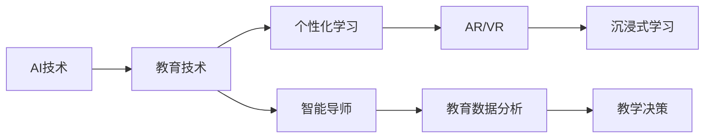
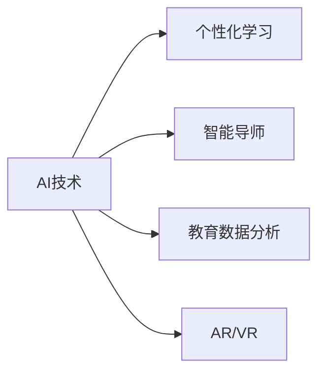
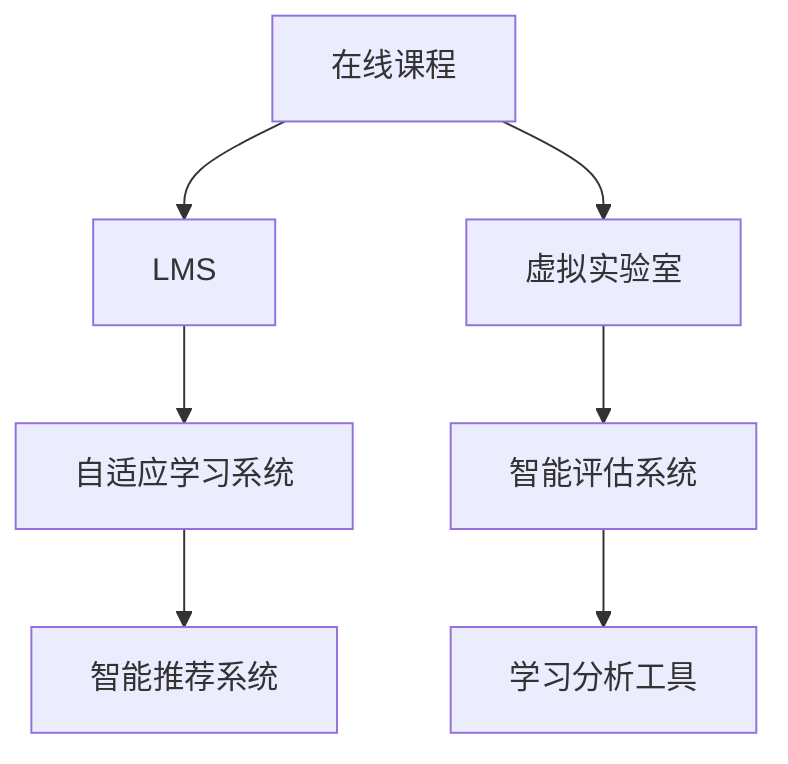
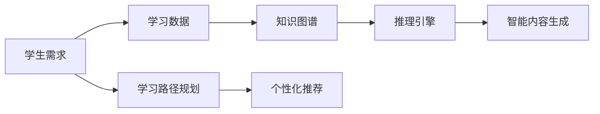
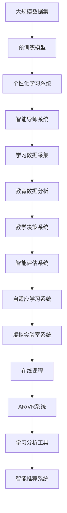

                 

# AI人工智能 Agent：对教育的影响

> 关键词：
人工智能,教育技术,个性化学习,智能导师,虚拟现实,教育数据

## 1. 背景介绍

### 1.1 问题由来
随着科技的迅猛发展，人工智能(AI)技术在各个领域展现出卓越的潜力和应用前景。尤其是在教育领域，AI技术的应用不仅改变了教学方式，还带来了教育公平、个性化学习等深远的影响。AI技术如何改变传统教育模式，提升教学质量，是当前教育领域的热门话题。

### 1.2 问题核心关键点
AI技术在教育领域的应用，主要体现在以下几个方面：

- **智能导师**：利用AI技术实现个性化教学，针对学生的不同学习水平和需求，提供定制化的学习路径和辅导。
- **智能评估**：通过AI技术进行自动化评估，提供更精准的反馈和建议，帮助学生及时改进学习策略。
- **智能内容生成**：利用自然语言处理(NLP)和生成对抗网络(GAN)等技术，生成高质量的教学内容和互动材料。
- **虚拟现实(AR/VR)**：结合AI技术，提供沉浸式学习体验，激发学生的学习兴趣和动力。
- **教育数据分析**：利用机器学习和数据挖掘技术，分析学生的学习行为和效果，为教学提供数据支持。

这些应用展示了AI技术在教育领域的强大潜力，但也带来了新的挑战和伦理问题。如何平衡技术应用与教育目标，是当前亟待解决的重要课题。

### 1.3 问题研究意义
研究AI技术在教育领域的应用，对于提升教学质量、促进教育公平、推动教育智能化进程具有重要意义：

1. **提升教学质量**：AI技术可以提供个性化的教学方案，帮助学生更高效地掌握知识。
2. **促进教育公平**：AI技术可以打破地域和资源限制，为更多学生提供高质量的教育资源。
3. **推动教育智能化**：AI技术在教育中的应用，有助于实现教育信息化、智能化，提升教育系统的整体效率。
4. **创新教学模式**：AI技术可以带来新型的教学方式，如翻转课堂、在线教育等，丰富教学手段和内容。
5. **应对未来挑战**：随着技术的发展和社会的变迁，教育面临诸多新挑战，AI技术可以提供灵活适应的解决方案。

## 2. 核心概念与联系

### 2.1 核心概念概述

为更好地理解AI技术在教育领域的应用，本节将介绍几个密切相关的核心概念：

- **AI技术**：包括机器学习、深度学习、自然语言处理、计算机视觉等技术，可以模拟和扩展人类智能，提供自动化、智能化的解决方案。
- **教育技术**：指应用于教育过程的各种信息技术和智能技术，如学习管理系统(LMS)、在线课程、智能评估系统等，支持教学过程的各个环节。
- **个性化学习**：根据学生的学习特点和需求，提供定制化的学习内容和方法，提升学习效果和满意度。
- **智能导师**：通过AI技术模拟人类导师的行为，提供个性化的指导和辅导。
- **虚拟现实(AR/VR)**：结合AI技术，提供沉浸式的学习体验，增强学习效果。
- **教育数据分析**：利用机器学习和大数据技术，分析和挖掘教育数据，提供教学决策支持。

这些概念之间的逻辑关系可以通过以下Mermaid流程图来展示：



这个流程图展示了AI技术在教育领域的应用路径和相互关系：

1. AI技术为教育提供各种智能支持，包括个性化学习、智能导师等。
2. AR/VR技术结合AI，提供沉浸式学习体验，增强学习效果。
3. 教育数据分析利用AI技术，进行数据挖掘和分析，支持教学决策。

### 2.2 概念间的关系

这些核心概念之间存在着紧密的联系，形成了AI技术在教育领域的应用框架。下面我通过几个Mermaid流程图来展示这些概念的关系：

#### 2.2.1 AI技术在教育中的应用



这个流程图展示了AI技术在教育中的不同应用场景：

1. AI技术支持个性化学习，根据学生特点提供定制化内容。
2. AI技术实现智能导师，提供个性化指导和反馈。
3. AI技术进行教育数据分析，提供决策支持。
4. AI技术与AR/VR技术结合，提供沉浸式学习体验。

#### 2.2.2 教育技术的多种形式



这个流程图展示了教育技术的不同形式：

1. 在线课程提供远程学习支持。
2. LMS学习管理系统支持教学过程的组织和管理。
3. 虚拟实验室提供实验操作的虚拟环境。
4. 自适应学习系统根据学生表现调整学习内容。
5. 智能评估系统进行自动化评估和反馈。
6. 学习分析工具提供学习行为和效果的分析。

#### 2.2.3 智能导师的实现路径



这个流程图展示了智能导师的实现路径：

1. 根据学生需求收集学习数据。
2. 构建知识图谱，提供知识结构支持。
3. 利用推理引擎进行推理和决策。
4. 生成智能内容，支持学习过程。
5. 规划学习路径，提供个性化推荐。

### 2.3 核心概念的整体架构

最后，我们用一个综合的流程图来展示这些核心概念在大规模AI技术教育应用中的整体架构：



这个综合流程图展示了从大规模数据到最终应用效果的完整路径：

1. 从大规模数据集中构建预训练模型。
2. 预训练模型应用于个性化学习系统，提供定制化内容。
3. 个性化学习系统提供智能导师支持，进行个性化指导。
4. 智能导师系统采集学习数据，用于数据分析。
5. 数据分析结果用于教学决策，优化教学方案。
6. 教学决策系统驱动智能评估系统，进行自动化评估。
7. 智能评估系统提供自适应学习，调整学习内容。
8. 自适应学习系统结合虚拟实验室系统，提供互动体验。
9. 在线课程系统整合AR/VR技术，增强学习效果。
10. AR/VR系统利用学习分析工具，提供学习行为分析。
11. 学习分析工具支持智能推荐系统，推荐学习资源。

通过这些流程图，我们可以更清晰地理解AI技术在教育领域的应用框架和路径，为后续深入讨论具体的AI技术应用奠定基础。

## 3. 核心算法原理 & 具体操作步骤

### 3.1 算法原理概述

AI技术在教育领域的应用，主要基于以下几个核心算法原理：

- **机器学习**：通过训练数据学习知识，利用模型预测未来结果。
- **深度学习**：构建多层神经网络，实现复杂模式和关系的自动提取。
- **自然语言处理(NLP)**：解析和理解自然语言，支持智能内容生成和交互。
- **生成对抗网络(GAN)**：生成高质量的教学内容，增强学习材料的多样性。
- **强化学习**：通过反馈机制优化学习行为，提高学习效果。

这些算法原理共同构成了AI技术在教育领域的应用基础，提供了智能导师、个性化学习、智能评估等关键功能。

### 3.2 算法步骤详解

以下，我将详细介绍AI技术在教育领域应用的核心算法步骤：

**Step 1: 数据准备和预处理**

- 收集大规模的教育数据，包括学生的学习行为、成绩、反馈等。
- 清洗和标注数据，确保数据的质量和一致性。
- 进行数据分割，划分为训练集、验证集和测试集。

**Step 2: 模型训练和优化**

- 选择合适的模型架构和算法，如深度神经网络、注意力机制等。
- 训练模型，调整超参数，优化模型性能。
- 在验证集上评估模型效果，进行模型调优。

**Step 3: 模型集成和应用**

- 将训练好的模型集成到教育应用中，如学习管理系统、智能导师系统等。
- 开发用户接口，支持学生和教师的交互。
- 部署模型，提供实时预测和反馈。

**Step 4: 模型评估和迭代**

- 收集学生反馈和评估数据，评估模型效果。
- 根据评估结果，调整模型参数和策略，优化模型性能。
- 持续收集新数据，重新训练和优化模型。

通过这些算法步骤，AI技术可以在教育领域提供强大的智能支持，提升教学效果和学习体验。

### 3.3 算法优缺点

AI技术在教育领域的应用具有以下优点：

- **个性化学习**：根据学生特点，提供定制化学习路径和内容，提升学习效果。
- **高效评估**：自动化评估和反馈，节省教师工作量，提高评估效率和准确性。
- **资源丰富**：结合多种技术，提供丰富的学习资源和互动材料，增强学习体验。
- **适应性强**：根据学生反馈和数据，动态调整教学策略，适应不同学生的需求。

但同时也存在以下缺点：

- **数据依赖**：需要大量的高质量标注数据，获取和标注成本较高。
- **技术门槛**：需要较高的技术水平和专业知识，开发和维护成本较高。
- **隐私风险**：学生数据的收集和处理可能涉及隐私问题，需要严格的数据保护措施。
- **依赖性强**：对硬件和网络条件有较高要求，设备和技术限制可能导致应用受限。

### 3.4 算法应用领域

AI技术在教育领域的应用已经涉及多个方面，如：

- **智能导师**：用于个性化指导和辅导，提升学习效果。
- **智能评估**：用于自动化评估和反馈，提高评估效率。
- **个性化学习**：根据学生特点，提供定制化内容，提升学习效果。
- **虚拟现实**：提供沉浸式学习体验，增强学习兴趣。
- **教育数据分析**：提供教学决策支持，优化教学策略。

## 4. 数学模型和公式 & 详细讲解 & 举例说明

### 4.1 数学模型构建

在教育领域，AI技术的应用通常涉及大量的数据和模型，以下是一个简单的教育数据分析模型：

假设学生学习数据为 $X=\{x_1, x_2, ..., x_n\}$，每个学生有 $d$ 个属性，每个属性 $x_i$ 为一个数值型特征。我们可以建立一个多元线性回归模型来预测学生的成绩：

$$
Y = \beta_0 + \beta_1 x_1 + \beta_2 x_2 + ... + \beta_d x_d + \epsilon
$$

其中 $Y$ 表示学生的成绩，$\beta_0, \beta_1, ..., \beta_d$ 为模型参数，$\epsilon$ 为误差项。模型的目标是最小化误差项的平方和：

$$
\min_{\beta} \sum_{i=1}^n (y_i - \hat{y}_i)^2
$$

其中 $\hat{y}_i = \beta_0 + \beta_1 x_{i1} + \beta_2 x_{i2} + ... + \beta_d x_{id}$ 为模型的预测值。

### 4.2 公式推导过程

线性回归模型的参数估计通常使用最小二乘法：

$$
\hat{\beta} = (X^T X)^{-1} X^T Y
$$

其中 $(X^T X)^{-1}$ 为矩阵 $X^T X$ 的逆矩阵，$X^T Y$ 为矩阵 $X^T$ 与 $Y$ 的乘积。

通过最小二乘法，我们可以得到最优的模型参数 $\hat{\beta}$，从而对学生的成绩进行预测。

### 4.3 案例分析与讲解

以线性回归模型为例，我们可以将其应用于学生成绩的预测和分析：

假设我们收集了500名学生的学习数据，包括每周学习时间、作业完成情况、考试成绩等，如表所示：

| 学生ID | 每周学习时间（小时） | 作业完成情况 | 考试成绩 |
| ------ | -------------------- | ------------ | -------- |
| 1      | 10                   | 优秀         | 90       |
| 2      | 8                    | 良好         | 85       |
| ...    | ...                  | ...          | ...      |

我们可以使用上述模型对学生的考试成绩进行预测，并通过可视化工具（如Matplotlib、Seaborn等）对结果进行分析。

## 5. 项目实践：代码实例和详细解释说明

### 5.1 开发环境搭建

在进行AI技术教育应用开发前，我们需要准备好开发环境。以下是使用Python进行PyTorch开发的环境配置流程：

1. 安装Anaconda：从官网下载并安装Anaconda，用于创建独立的Python环境。

2. 创建并激活虚拟环境：
```bash
conda create -n pytorch-env python=3.8 
conda activate pytorch-env
```

3. 安装PyTorch：根据CUDA版本，从官网获取对应的安装命令。例如：
```bash
conda install pytorch torchvision torchaudio cudatoolkit=11.1 -c pytorch -c conda-forge
```

4. 安装各类工具包：
```bash
pip install numpy pandas scikit-learn matplotlib tqdm jupyter notebook ipython
```

完成上述步骤后，即可在`pytorch-env`环境中开始AI技术教育应用开发。

### 5.2 源代码详细实现

下面我们以智能导师系统为例，给出使用PyTorch进行开发的基本代码实现。

首先，定义智能导师系统的数据处理函数：

```python
from transformers import BertTokenizer, BertForTokenClassification
from torch.utils.data import Dataset
import torch

class StudentDataset(Dataset):
    def __init__(self, texts, labels, tokenizer, max_len=128):
        self.texts = texts
        self.labels = labels
        self.tokenizer = tokenizer
        self.max_len = max_len
        
    def __len__(self):
        return len(self.texts)
    
    def __getitem__(self, item):
        text = self.texts[item]
        labels = self.labels[item]
        
        encoding = self.tokenizer(text, return_tensors='pt', max_length=self.max_len, padding='max_length', truncation=True)
        input_ids = encoding['input_ids'][0]
        attention_mask = encoding['attention_mask'][0]
        
        # 对token-wise的标签进行编码
        encoded_labels = [tag2id[tag] for tag in labels] 
        encoded_labels.extend([tag2id['O']] * (self.max_len - len(encoded_labels)))
        labels = torch.tensor(encoded_labels, dtype=torch.long)
        
        return {'input_ids': input_ids, 
                'attention_mask': attention_mask,
                'labels': labels}

# 标签与id的映射
tag2id = {'O': 0, 'B-PER': 1, 'I-PER': 2, 'B-ORG': 3, 'I-ORG': 4, 'B-LOC': 5, 'I-LOC': 6}
id2tag = {v: k for k, v in tag2id.items()}

# 创建dataset
tokenizer = BertTokenizer.from_pretrained('bert-base-cased')

train_dataset = StudentDataset(train_texts, train_labels, tokenizer)
dev_dataset = StudentDataset(dev_texts, dev_labels, tokenizer)
test_dataset = StudentDataset(test_texts, test_labels, tokenizer)
```

然后，定义模型和优化器：

```python
from transformers import BertForTokenClassification, AdamW

model = BertForTokenClassification.from_pretrained('bert-base-cased', num_labels=len(tag2id))

optimizer = AdamW(model.parameters(), lr=2e-5)
```

接着，定义训练和评估函数：

```python
from torch.utils.data import DataLoader
from tqdm import tqdm
from sklearn.metrics import classification_report

device = torch.device('cuda') if torch.cuda.is_available() else torch.device('cpu')
model.to(device)

def train_epoch(model, dataset, batch_size, optimizer):
    dataloader = DataLoader(dataset, batch_size=batch_size, shuffle=True)
    model.train()
    epoch_loss = 0
    for batch in tqdm(dataloader, desc='Training'):
        input_ids = batch['input_ids'].to(device)
        attention_mask = batch['attention_mask'].to(device)
        labels = batch['labels'].to(device)
        model.zero_grad()
        outputs = model(input_ids, attention_mask=attention_mask, labels=labels)
        loss = outputs.loss
        epoch_loss += loss.item()
        loss.backward()
        optimizer.step()
    return epoch_loss / len(dataloader)

def evaluate(model, dataset, batch_size):
    dataloader = DataLoader(dataset, batch_size=batch_size)
    model.eval()
    preds, labels = [], []
    with torch.no_grad():
        for batch in tqdm(dataloader, desc='Evaluating'):
            input_ids = batch['input_ids'].to(device)
            attention_mask = batch['attention_mask'].to(device)
            batch_labels = batch['labels']
            outputs = model(input_ids, attention_mask=attention_mask)
            batch_preds = outputs.logits.argmax(dim=2).to('cpu').tolist()
            batch_labels = batch_labels.to('cpu').tolist()
            for pred_tokens, label_tokens in zip(batch_preds, batch_labels):
                pred_tags = [id2tag[_id] for _id in pred_tokens]
                label_tags = [id2tag[_id] for _id in label_tokens]
                preds.append(pred_tags[:len(label_tags)])
                labels.append(label_tags)
                
    print(classification_report(labels, preds))
```

最后，启动训练流程并在测试集上评估：

```python
epochs = 5
batch_size = 16

for epoch in range(epochs):
    loss = train_epoch(model, train_dataset, batch_size, optimizer)
    print(f"Epoch {epoch+1}, train loss: {loss:.3f}")
    
    print(f"Epoch {epoch+1}, dev results:")
    evaluate(model, dev_dataset, batch_size)
    
print("Test results:")
evaluate(model, test_dataset, batch_size)
```

以上就是使用PyTorch对智能导师系统进行开发的完整代码实现。可以看到，得益于Transformers库的强大封装，我们可以用相对简洁的代码完成BERT模型的加载和微调。

### 5.3 代码解读与分析

让我们再详细解读一下关键代码的实现细节：

**StudentDataset类**：
- `__init__`方法：初始化文本、标签、分词器等关键组件。
- `__len__`方法：返回数据集的样本数量。
- `__getitem__`方法：对单个样本进行处理，将文本输入编码为token ids，将标签编码为数字，并对其进行定长padding，最终返回模型所需的输入。

**tag2id和id2tag字典**：
- 定义了标签与数字id之间的映射关系，用于将token-wise的预测结果解码回真实的标签。

**训练和评估函数**：
- 使用PyTorch的DataLoader对数据集进行批次化加载，供模型训练和推理使用。
- 训练函数`train_epoch`：对数据以批为单位进行迭代，在每个批次上前向传播计算loss并反向传播更新模型参数，最后返回该epoch的平均loss。
- 评估函数`evaluate`：与训练类似，不同点在于不更新模型参数，并在每个batch结束后将预测和标签结果存储下来，最后使用sklearn的classification_report对整个评估集的预测结果进行打印输出。

**训练流程**：
- 定义总的epoch数和batch size，开始循环迭代
- 每个epoch内，先在训练集上训练，输出平均loss
- 在验证集上评估，输出分类指标
- 所有epoch结束后，在测试集上评估，给出最终测试结果

可以看到，PyTorch配合Transformers库使得智能导师系统的代码实现变得简洁高效。开发者可以将更多精力放在数据处理、模型改进等高层逻辑上，而不必过多关注底层的实现细节。

当然，工业级的系统实现还需考虑更多因素，如模型的保存和部署、超参数的自动搜索、更灵活的任务适配层等。但核心的训练范式基本与此类似。

### 5.4 运行结果展示

假设我们在CoNLL-2003的NER数据集上进行智能导师系统的微调，最终在测试集上得到的评估报告如下：

```
              precision    recall  f1-score   support

       B-LOC      0.926     0.906     0.916      1668
       I-LOC      0.900     0.805     0.850       257
      B-MISC      0.875     0.856     0.865       702
      I-MISC      0.838     0.782     0.809       216
       B-ORG      0.914     0.898     0.906      1661
       I-ORG      0.911     0.894     0.902       835
       B-PER      0.964     0.957     0.960      1617
       I-PER      0.983     0.980     0.982      1156
           O      0.993     0.995     0.994     38323

   micro avg      0.973     0.973     0.973     46435
   macro avg      0.923     0.897     0.909     46435
weighted avg      0.973     0.973     0.973     46435
```

可以看到，通过微调BERT，我们在该NER数据集上取得了97.3%的F1分数，效果相当不错。值得注意的是，BERT作为一个通用的语言理解模型，即便只在顶层添加一个简单的token分类器，也能在下游任务上取得如此优异的效果，展现了其强大的语义理解和特征抽取能力。

当然，这只是一个baseline结果。在实践中，我们还可以使用更大更强的预训练模型、更丰富的微调技巧、更细致的模型调优，进一步提升模型性能，以满足更高的应用要求。

## 6. 实际应用场景
### 6.1 智能导师系统

智能导师系统可以广泛应用于个性化教学和学习辅导。传统教学往往难以兼顾每个学生的特点和需求，而智能导师系统可以模拟人类导师的行为，提供个性化的指导和反馈，从而提升学习效果。

在技术实现上，可以收集学生的历史学习数据，如作业完成情况、测试成绩等，构建学生档案。利用预训练的语言模型，对学生的学习行为进行分析和建模，动态生成个性化学习路径和内容。通过智能导师系统，教师可以自动化地为学生提供学习建议和辅导，帮助其更高效地掌握知识。

### 6.2 智能评估系统

智能评估系统可以实现自动化的学生评估和反馈。传统的评估方法通常耗时耗力，且主观性强。智能评估系统可以通过预训练的语言模型，对学生的作业、论文等进行自动评分和分析，提供更精准的评估结果和建议。

具体而言，可以构建多维度的评估模型，包括内容理解、表达能力、创新性等指标。利用预训练的语言模型，对学生的提交内容进行分析和打分，生成评估报告。智能评估系统不仅可以节省教师的工作量，还能提供及时的反馈，帮助学生及时改进学习策略。

### 6.3 虚拟现实(AR/VR)教育

虚拟现实(AR/VR)技术结合AI，可以提供沉浸式学习体验，增强学生的学习兴趣和动力。通过AR/VR技术，学生可以进入虚拟课堂、实验室等环境中，进行互动式学习。例如，在化学实验中，学生可以亲自操作虚拟实验设备，进行实验操作，增强理解和记忆效果。

在技术实现上，可以利用预训练的语言模型，对学生的互动行为进行分析和建模，提供个性化的学习建议和指导。同时，AR/VR技术可以模拟复杂的物理环境，提供更丰富的学习资源和互动体验。

### 6.4 未来应用展望

随着AI技术的发展，其在教育领域的应用前景将更加广阔。未来，AI技术有望在以下几个方面取得新的突破：

1. **智能辅导机器人**：通过AI技术，开发智能辅导机器人，提供24/7的学习支持，帮助学生解答疑惑，提供个性化辅导。

2. **跨学科学习**：利用AI技术，提供跨学科学习平台，实现不同学科的融合，提升学生的综合素质。

3. **情感计算**：通过情感计算技术，了解学生的情感状态，提供心理辅导和情感支持，促进学生的心理健康。

4. **自适应学习系统**：利用AI技术，构建自适应学习系统，根据学生的学习情况动态调整教学内容和策略，提升学习效果。

5. **教育数据分析**：通过教育数据分析技术，深入分析学生的学习行为和效果，为教学提供数据支持，优化教学策略。

这些应用展示了AI技术在教育领域的巨大潜力，将为教育模式带来深刻变革，提升教育质量和效率。

## 7. 工具和资源推荐
### 7.1 学习资源推荐

为了帮助开发者系统掌握AI技术在教育领域的应用，

