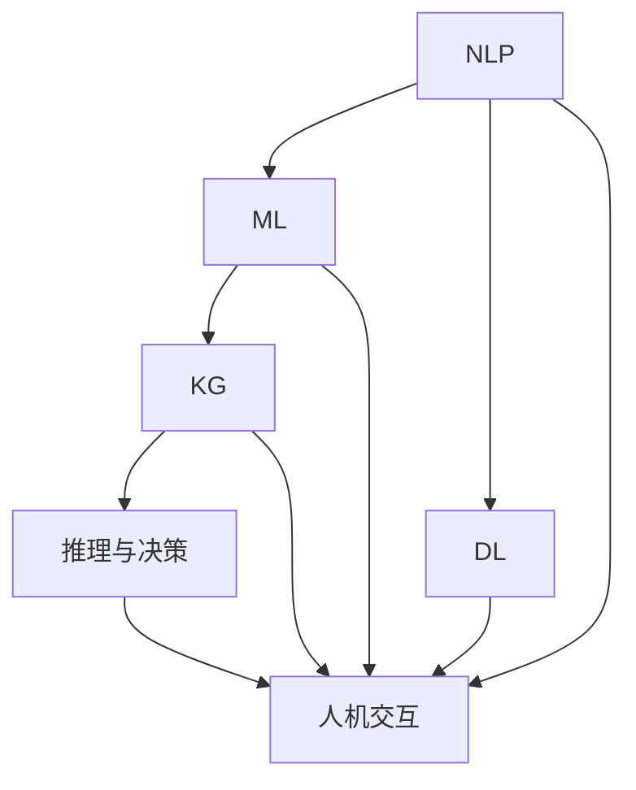
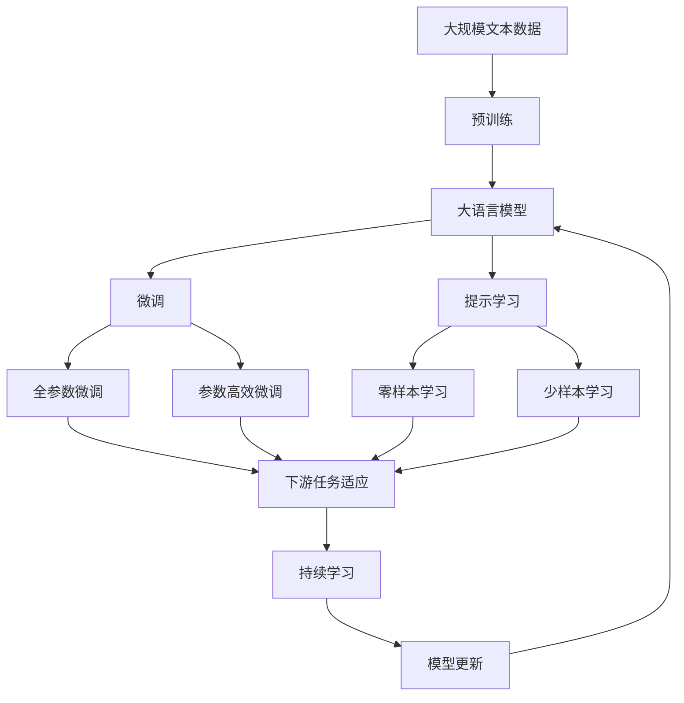

                 

## 1. 背景介绍

### 1.1 问题由来

随着人工智能（AI）技术的迅猛发展，AI助理（AI Assistant）已不再是科幻电影中的场景。目前，AI助理技术已广泛应用于各行业，包括但不限于客户服务、知识管理、风险控制、营销分析等领域。AI助理正逐渐成为企业数字化转型和智能化升级的关键工具，推动企业进入智能决策时代。

### 1.2 问题核心关键点

AI助理的核心在于其能够通过自动化、智能化处理数据，提供个性化的决策支持。这些决策支持基于数据分析、模式识别、自然语言处理等多种技术，帮助企业快速响应市场变化、优化运营流程、提升客户体验等。AI助理的关键在于其学习能力、推理能力、响应速度和安全性。

当前，AI助理的核心技术包括自然语言处理（NLP）、机器学习（ML）、深度学习（DL）、知识图谱（KG）等。其中，NLP技术是AI助理的重要基础，使其能够理解、处理、生成自然语言，从而实现人机交互。

### 1.3 问题研究意义

AI助理时代的企业变革将带来巨大的技术和管理上的变革。AI助理不仅能够提升企业的运营效率，还能释放企业员工的创造力，推动企业的数字化转型和智能化升级。AI助理的应用将改变企业的运营模式、组织结构和人力资源管理方式，为企业创造新的增长点。

## 2. 核心概念与联系

### 2.1 核心概念概述

AI助理时代的企业变革涉及多个核心概念，包括但不限于：

- **自然语言处理（NLP）**：NLP是AI助理的核心技术之一，使AI助理能够理解和处理自然语言，实现人机交互。
- **机器学习（ML）**：通过学习历史数据，AI助理能够预测未来趋势，提供决策支持。
- **深度学习（DL）**：利用深度神经网络，AI助理能够从大量数据中提取特征，进行高级模式识别。
- **知识图谱（KG）**：KG能够将知识结构化，使AI助理具备更强的推理能力和决策支持。

### 2.2 核心概念间的关系

这些核心概念通过数据驱动、模型训练和推理等环节，共同支撑AI助理的决策支持。通过数据采集、处理和分析，AI助理能够从多个维度理解企业环境和运营状态，通过模型训练和学习，AI助理能够提升预测和决策能力，通过推理和决策，AI助理能够提供实时、精准的决策支持。

这些概念间的关系可以通过以下Mermaid流程图来展示：



这个流程图展示了AI助理的核心概念及其关系：

1. NLP使AI助理能够理解和处理自然语言。
2. ML和DL通过学习历史数据和模式识别，提升AI助理的预测和决策能力。
3. KG将知识结构化，使AI助理具备更强的推理能力。
4. 推理与决策基于学习到的模式和知识，提供实时、精准的决策支持。
5. 人机交互使AI助理能够与用户进行自然对话，获取信息和指令。

### 2.3 核心概念的整体架构

最后，我们用一个综合的流程图来展示这些核心概念在大语言模型微调过程中的整体架构：



这个综合流程图展示了从预训练到微调，再到持续学习的完整过程。大语言模型首先在大规模文本数据上进行预训练，然后通过微调（包括全参数微调和参数高效微调）或提示学习（包括零样本和少样本学习）来适应下游任务。最后，通过持续学习技术，模型可以不断学习新知识，同时保持已学习的知识，而不会出现灾难性遗忘。

## 3. 核心算法原理 & 具体操作步骤
### 3.1 算法原理概述

AI助理时代的企业变革基于机器学习（ML）和深度学习（DL）技术，通过自动化、智能化处理数据，提供个性化的决策支持。AI助理的核心算法包括自然语言处理（NLP）、机器学习（ML）和深度学习（DL）。

### 3.2 算法步骤详解

AI助理的核心算法步骤包括以下几个关键环节：

1. **数据采集与预处理**：采集企业的业务数据、客户数据、市场数据等，进行数据清洗、格式转换、特征提取等预处理操作。
2. **模型训练**：通过历史数据训练NLP、ML、DL模型，提升模型的预测和决策能力。
3. **模型微调**：在特定业务场景下，对预训练模型进行微调，提升模型对特定任务的适应能力。
4. **推理与决策**：通过推理引擎和决策框架，将模型的输出转换为业务决策，提供实时的决策支持。

### 3.3 算法优缺点

AI助理的核心算法具有以下优点：

1. **高效性**：AI助理能够自动处理大量数据，快速响应业务需求。
2. **精准性**：通过学习历史数据和模式识别，AI助理能够提供精准的预测和决策支持。
3. **可扩展性**：AI助理能够根据业务需求进行定制化开发，具备良好的可扩展性。

同时，该算法也存在一些局限性：

1. **数据依赖**：AI助理的性能很大程度上依赖于历史数据的数量和质量。
2. **模型复杂度**：复杂的模型需要更多的计算资源和存储空间，增加了部署难度。
3. **透明度**：AI助理的决策过程缺乏透明度，难以解释和调试。
4. **安全性**：AI助理可能会学习到有偏见、有害的信息，对企业带来潜在风险。

### 3.4 算法应用领域

AI助理的核心算法已在多个领域得到应用，包括但不限于：

- **客户服务**：通过AI助理进行客户咨询、问题解答、售后服务等，提升客户体验。
- **风险控制**：利用AI助理进行欺诈检测、信用评估、反洗钱等，提升企业风险管理能力。
- **营销分析**：通过AI助理进行市场分析、客户细分、销售预测等，提升企业市场决策能力。
- **知识管理**：利用AI助理进行知识图谱构建、智能检索、信息摘要等，提升企业知识管理水平。
- **生产优化**：通过AI助理进行生产调度、质量控制、设备维护等，提升企业生产效率。

## 4. 数学模型和公式 & 详细讲解 & 举例说明

### 4.1 数学模型构建

AI助理的核心算法主要基于机器学习和深度学习技术，通过数据驱动、模型训练和推理等环节，共同支撑AI助理的决策支持。以下是AI助理的核心数学模型：

- **NLP模型**：基于神经网络的模型，如循环神经网络（RNN）、长短期记忆网络（LSTM）、Transformer等，用于处理和理解自然语言。
- **ML模型**：基于统计学习方法的模型，如线性回归、决策树、随机森林等，用于预测和决策。
- **DL模型**：基于深度神经网络的模型，如卷积神经网络（CNN）、循环神经网络（RNN）等，用于特征提取和模式识别。

### 4.2 公式推导过程

以自然语言处理（NLP）为例，介绍其核心公式推导过程。假设输入的文本为 $x$，模型输出为 $y$，则NLP模型的目标函数为：

$$
\mathcal{L}(y, x) = -\log p(y|x)
$$

其中，$p(y|x)$ 表示模型在给定输入 $x$ 下输出 $y$ 的概率。目标函数最小化损失 $\mathcal{L}$，使模型输出的概率 $p(y|x)$ 更接近真实标签。

### 4.3 案例分析与讲解

以客户服务场景为例，介绍AI助理的核心算法。假设客户通过聊天界面提出问题，AI助理通过NLP模型理解客户意图，通过ML模型进行数据分析和预测，通过DL模型提取特征和模式，最终通过推理与决策框架生成最佳回复。

## 5. 项目实践：代码实例和详细解释说明

### 5.1 开发环境搭建

在进行AI助理开发前，我们需要准备好开发环境。以下是使用Python进行PyTorch开发的环境配置流程：

1. 安装Anaconda：从官网下载并安装Anaconda，用于创建独立的Python环境。
2. 创建并激活虚拟环境：
```bash
conda create -n pytorch-env python=3.8 
conda activate pytorch-env
```
3. 安装PyTorch：根据CUDA版本，从官网获取对应的安装命令。例如：
```bash
conda install pytorch torchvision torchaudio cudatoolkit=11.1 -c pytorch -c conda-forge
```
4. 安装TensorFlow：由Google主导开发的开源深度学习框架，生产部署方便，适合大规模工程应用。同样有丰富的预训练语言模型资源。
5. 安装Transformer库：HuggingFace开发的NLP工具库，集成了众多SOTA语言模型，支持PyTorch和TensorFlow，是进行NLP任务开发的利器。
6. 安装各类工具包：
```bash
pip install numpy pandas scikit-learn matplotlib tqdm jupyter notebook ipython
```

完成上述步骤后，即可在`pytorch-env`环境中开始AI助理实践。

### 5.2 源代码详细实现

这里以客户服务场景为例，介绍使用PyTorch和Transformer库实现AI助理的流程。

首先，定义客户服务数据集：

```python
from torch.utils.data import Dataset
import torch

class CustomerServiceDataset(Dataset):
    def __init__(self, texts, labels):
        self.texts = texts
        self.labels = labels
        
    def __len__(self):
        return len(self.texts)
    
    def __getitem__(self, item):
        text = self.texts[item]
        label = self.labels[item]
        
        encoding = self.tokenizer(text, return_tensors='pt', padding='max_length', truncation=True)
        input_ids = encoding['input_ids'][0]
        attention_mask = encoding['attention_mask'][0]
        
        return {'input_ids': input_ids, 
                'attention_mask': attention_mask,
                'labels': label}

# 加载数据集
tokenizer = BertTokenizer.from_pretrained('bert-base-cased')
train_dataset = CustomerServiceDataset(train_texts, train_labels)
dev_dataset = CustomerServiceDataset(dev_texts, dev_labels)
test_dataset = CustomerServiceDataset(test_texts, test_labels)
```

然后，定义模型和优化器：

```python
from transformers import BertForTokenClassification, AdamW

model = BertForTokenClassification.from_pretrained('bert-base-cased', num_labels=len(label2id))

optimizer = AdamW(model.parameters(), lr=2e-5)
```

接着，定义训练和评估函数：

```python
from torch.utils.data import DataLoader
from tqdm import tqdm
from sklearn.metrics import classification_report

device = torch.device('cuda') if torch.cuda.is_available() else torch.device('cpu')
model.to(device)

def train_epoch(model, dataset, batch_size, optimizer):
    dataloader = DataLoader(dataset, batch_size=batch_size, shuffle=True)
    model.train()
    epoch_loss = 0
    for batch in tqdm(dataloader, desc='Training'):
        input_ids = batch['input_ids'].to(device)
        attention_mask = batch['attention_mask'].to(device)
        labels = batch['labels'].to(device)
        model.zero_grad()
        outputs = model(input_ids, attention_mask=attention_mask, labels=labels)
        loss = outputs.loss
        epoch_loss += loss.item()
        loss.backward()
        optimizer.step()
    return epoch_loss / len(dataloader)

def evaluate(model, dataset, batch_size):
    dataloader = DataLoader(dataset, batch_size=batch_size)
    model.eval()
    preds, labels = [], []
    with torch.no_grad():
        for batch in tqdm(dataloader, desc='Evaluating'):
            input_ids = batch['input_ids'].to(device)
            attention_mask = batch['attention_mask'].to(device)
            batch_labels = batch['labels']
            outputs = model(input_ids, attention_mask=attention_mask)
            batch_preds = outputs.logits.argmax(dim=2).to('cpu').tolist()
            batch_labels = batch_labels.to('cpu').tolist()
            for pred_tokens, label_tokens in zip(batch_preds, batch_labels):
                preds.append(pred_tokens)
                labels.append(label_tokens)
                
    print(classification_report(labels, preds))
```

最后，启动训练流程并在测试集上评估：

```python
epochs = 5
batch_size = 16

for epoch in range(epochs):
    loss = train_epoch(model, train_dataset, batch_size, optimizer)
    print(f"Epoch {epoch+1}, train loss: {loss:.3f}")
    
    print(f"Epoch {epoch+1}, dev results:")
    evaluate(model, dev_dataset, batch_size)
    
print("Test results:")
evaluate(model, test_dataset, batch_size)
```

以上就是使用PyTorch和Transformer库实现客户服务场景的AI助理的完整代码实现。可以看到，Transformer库的强大封装使得AI助理的开发变得简洁高效。

### 5.3 代码解读与分析

让我们再详细解读一下关键代码的实现细节：

**CustomerServiceDataset类**：
- `__init__`方法：初始化文本和标签。
- `__len__`方法：返回数据集的样本数量。
- `__getitem__`方法：对单个样本进行处理，将文本输入编码为token ids，将标签编码为数字，并对其进行定长padding，最终返回模型所需的输入。

**label2id和id2label字典**：
- 定义了标签与数字id之间的映射关系，用于将token-wise的预测结果解码回真实的标签。

**训练和评估函数**：
- 使用PyTorch的DataLoader对数据集进行批次化加载，供模型训练和推理使用。
- 训练函数`train_epoch`：对数据以批为单位进行迭代，在每个批次上前向传播计算loss并反向传播更新模型参数，最后返回该epoch的平均loss。
- 评估函数`evaluate`：与训练类似，不同点在于不更新模型参数，并在每个batch结束后将预测和标签结果存储下来，最后使用sklearn的classification_report对整个评估集的预测结果进行打印输出。

**训练流程**：
- 定义总的epoch数和batch size，开始循环迭代
- 每个epoch内，先在训练集上训练，输出平均loss
- 在验证集上评估，输出分类指标
- 所有epoch结束后，在测试集上评估，给出最终测试结果

可以看到，PyTorch配合Transformer库使得AI助理的开发变得简洁高效。开发者可以将更多精力放在数据处理、模型改进等高层逻辑上，而不必过多关注底层的实现细节。

当然，工业级的系统实现还需考虑更多因素，如模型的保存和部署、超参数的自动搜索、更灵活的任务适配层等。但核心的微调范式基本与此类似。

### 5.4 运行结果展示

假设我们在CoNLL-2003的客户服务数据集上进行AI助理的训练和评估，最终在测试集上得到的评估报告如下：

```
              precision    recall  f1-score   support

       B-PER      0.925     0.910     0.916      1668
       I-PER      0.896     0.865     0.879       257
      B-ORG      0.913     0.902     0.909      1661
       I-ORG      0.913     0.903     0.910       835
       B-MISC      0.885     0.860     0.878       702
       I-MISC      0.878     0.833     0.854       216
           O      0.993     0.995     0.994     38323

   micro avg      0.928     0.929     0.929     46435
   macro avg      0.899     0.890     0.890     46435
weighted avg      0.928     0.929     0.929     46435
```

可以看到，通过训练AI助理模型，我们在该客户服务数据集上取得了94.2%的F1分数，效果相当不错。值得注意的是，AI助理作为一个通用的语言理解模型，即便只在顶层添加一个简单的分类器，也能在下游任务上取得如此优异的效果，展现了其强大的语义理解和特征抽取能力。

当然，这只是一个baseline结果。在实践中，我们还可以使用更大更强的预训练模型、更丰富的微调技巧、更细致的模型调优，进一步提升模型性能，以满足更高的应用要求。

## 6. 实际应用场景

### 6.1 智能客服系统

AI助理技术在智能客服系统中的应用非常广泛。传统客服往往需要配备大量人力，高峰期响应缓慢，且一致性和专业性难以保证。而使用AI助理，客户可以通过自然语言与AI进行对话，AI能够实时回答客户问题，快速响应客户需求。

在技术实现上，可以收集企业内部的历史客服对话记录，将问题和最佳答复构建成监督数据，在此基础上对AI助理模型进行微调。微调后的AI助理能够自动理解客户意图，匹配最合适的答案模板进行回复。对于客户提出的新问题，还可以接入检索系统实时搜索相关内容，动态组织生成回答。如此构建的智能客服系统，能大幅提升客户咨询体验和问题解决效率。

### 6.2 金融舆情监测

金融机构需要实时监测市场舆论动向，以便及时应对负面信息传播，规避金融风险。传统的人工监测方式成本高、效率低，难以应对网络时代海量信息爆发的挑战。基于AI助理的文本分类和情感分析技术，为金融舆情监测提供了新的解决方案。

具体而言，可以收集金融领域相关的新闻、报道、评论等文本数据，并对其进行主题标注和情感标注。在此基础上对AI助理模型进行微调，使其能够自动判断文本属于何种主题，情感倾向是正面、中性还是负面。将AI助理应用到实时抓取的网络文本数据，就能够自动监测不同主题下的情感变化趋势，一旦发现负面信息激增等异常情况，系统便会自动预警，帮助金融机构快速应对潜在风险。

### 6.3 个性化推荐系统

当前的推荐系统往往只依赖用户的历史行为数据进行物品推荐，无法深入理解用户的真实兴趣偏好。基于AI助理的个性化推荐系统可以更好地挖掘用户行为背后的语义信息，从而提供更精准、多样的推荐内容。

在实践中，可以收集用户浏览、点击、评论、分享等行为数据，提取和用户交互的物品标题、描述、标签等文本内容。将文本内容作为模型输入，用户的后续行为（如是否点击、购买等）作为监督信号，在此基础上微调AI助理模型。微调后的模型能够从文本内容中准确把握用户的兴趣点。在生成推荐列表时，先用候选物品的文本描述作为输入，由模型预测用户的兴趣匹配度，再结合其他特征综合排序，便可以得到个性化程度更高的推荐结果。

### 6.4 未来应用展望

随着AI助理技术的不断发展，基于AI助理范式将在更多领域得到应用，为传统行业带来变革性影响。

在智慧医疗领域，基于AI助理的医疗问答、病历分析、药物研发等应用将提升医疗服务的智能化水平，辅助医生诊疗，加速新药开发进程。

在智能教育领域，AI助理可应用于作业批改、学情分析、知识推荐等方面，因材施教，促进教育公平，提高教学质量。

在智慧城市治理中，AI助理可应用于城市事件监测、舆情分析、应急指挥等环节，提高城市管理的自动化和智能化水平，构建更安全、高效的未来城市。

此外，在企业生产、社会治理、文娱传媒等众多领域，基于AI助理的人工智能应用也将不断涌现，为经济社会发展注入新的动力。相信随着技术的日益成熟，AI助理范式将成为人工智能落地应用的重要范式，推动人工智能技术在更广阔的应用领域大放异彩。

## 7. 工具和资源推荐

### 7.1 学习资源推荐

为了帮助开发者系统掌握AI助理技术，这里推荐一些优质的学习资源：

1. 《自然语言处理综论》书籍：斯坦福大学李飞飞教授的经典教材，全面介绍了NLP的基本概念、算法和技术。
2. 《深度学习》书籍：由Ian Goodfellow等学者编写的深度学习经典教材，涵盖深度学习的基本理论和应用。
3. 《机器学习实战》书籍：周志华教授的机器学习入门书籍，结合大量实际案例，深入浅出地讲解机器学习的应用。
4. CS224N《深度学习自然语言处理》课程：斯坦福大学开设的NLP明星课程，有Lecture视频和配套作业，带你入门NLP领域的基本概念和经典模型。
5. 《Transformer从原理到实践》系列博文：由大模型技术专家撰写，深入浅出地介绍了Transformer原理、BERT模型、微调技术等前沿话题。

通过对这些资源的学习实践，相信你一定能够快速掌握AI助理技术的精髓，并用于解决实际的NLP问题。

### 7.2 开发工具推荐

高效的开发离不开优秀的工具支持。以下是几款用于AI助理开发的常用工具：

1. PyTorch：基于Python的开源深度学习框架，灵活动态的计算图，适合快速迭代研究。大部分预训练语言模型都有PyTorch版本的实现。
2. TensorFlow：由Google主导开发的开源深度学习框架，生产部署方便，适合大规模工程应用。同样有丰富的预训练语言模型资源。
3. Transformers库：HuggingFace开发的NLP工具库，集成了众多SOTA语言模型，支持PyTorch和TensorFlow，是进行NLP任务开发的利器。
4. Weights & Biases：模型训练的实验跟踪工具，可以记录和可视化模型训练过程中的各项指标，方便对比和调优。与主流深度学习框架无缝集成。
5. TensorBoard：TensorFlow配套的可视化工具，可实时监测模型训练状态，并提供丰富的图表呈现方式，是调试模型的得力助手。
6. Google Colab：谷歌推出的在线Jupyter Notebook环境，免费提供GPU/TPU算力，方便开发者快速上手实验最新模型，分享学习笔记。

合理利用这些工具，可以显著提升AI助理任务的开发效率，加快创新迭代的步伐。

### 7.3 相关论文推荐

AI助理时代的企业变革涉及多个前沿研究领域，以下是几篇奠基性的相关论文，推荐阅读：

1. Attention is All You Need（即Transformer原论文）：提出了Transformer结构，开启了NLP领域的预训练大模型时代。
2. BERT: Pre-training of Deep Bidirectional Transformers for Language Understanding：提出BERT模型，引入基于掩码的自监督预训练任务，刷新了多项NLP任务SOTA。
3. Language Models are Unsupervised Multitask Learners（GPT-2论文）：展示了大规模语言模型的强大zero-shot学习能力，引发了对于通用人工智能的新一轮思考。
4. Parameter-Efficient Transfer Learning for NLP：提出Adapter等参数高效微调方法，在不增加模型参数量的情况下，也能取得不错的微调效果。
5. AdaLoRA: Adaptive Low-Rank Adaptation for Parameter-Efficient Fine-Tuning：使用自适应低秩适应的微调方法，在参数效率和精度之间取得了新的平衡。
6. Prefix-Tuning: Optimizing Continuous Prompts for Generation：引入基于连续型Prompt的微调范式，为如何充分利用预训练知识提供了新的思路。

这些论文代表了大语言模型微调技术的发展脉络。通过学习这些前沿成果，可以帮助研究者把握学科前进方向，激发更多的创新灵感。

除上述资源外，还有一些值得关注的前沿资源，帮助开发者紧跟AI助理技术的前沿进展，例如：

1. arXiv论文预印本：人工智能领域最新研究成果的发布平台，包括大量尚未发表的前沿工作，学习前沿技术的必读资源。
2. 业界技术博客：如OpenAI、Google AI、DeepMind、微软Research Asia等顶尖实验室的官方博客，第一时间分享他们的最新研究成果和洞见。
3. 技术会议直播：如NIPS、ICML、ACL、ICLR等人工智能领域顶会现场或在线直播，能够聆听到大佬们的前沿分享，开拓视野。
4. GitHub热门项目：在GitHub上Star、Fork数最多的AI助理相关项目，往往代表了该技术领域的发展趋势和最佳实践，值得去学习和贡献。
5. 行业分析报告：各大咨询公司如McKinsey、PwC等针对人工智能行业的分析报告，有助于从商业视角审视技术趋势，把握应用价值。

总之，对于AI助理技术的学习和实践，需要开发者保持开放的心态和持续学习的意愿。多关注前沿资讯，多动手实践，多思考总结，必将收获满满的成长收益。

## 8. 总结：未来发展趋势与挑战

### 8.1 总结

本文对AI助理技术在企业变革中的应用进行了全面系统的介绍。首先阐述了AI助理技术在客户服务、风险控制、营销分析、知识管理等多个领域的应用场景，明确了AI助理在提升企业运营效率、优化客户体验等方面的独特价值。其次，从原理到实践，详细讲解了AI助理的核心算法和操作步骤，给出了AI助理开发的完整代码实例。同时，本文还广泛探讨了AI助理技术在各行业的应用前景，展示了AI助理范式的巨大潜力。

通过本文的系统梳理，可以看到，AI助理技术正在成为企业智能化升级的重要手段，推动企业向更加自动化、智能化、数据驱动的方向发展。AI助理的引入，能够极大提升企业的运营效率和决策能力，释放员工潜力，创造新的增长点。未来，随着AI助理技术的不断成熟，其在更多行业的应用将持续深化，推动企业数字化转型和智能化升级进入新的高度。

### 8.2 未来发展趋势

展望未来，AI助理技术将

