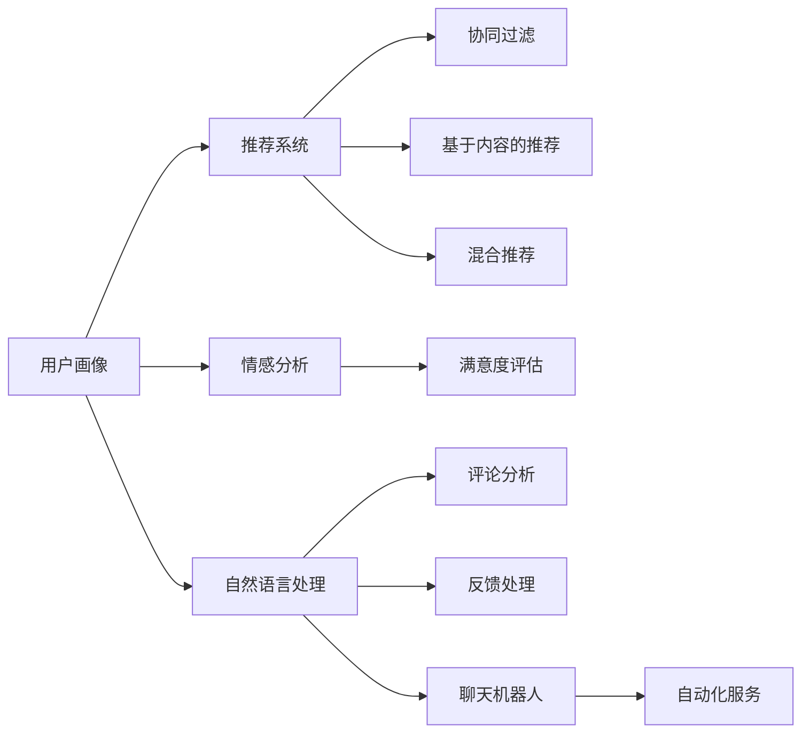

                 

# AI如何帮助电商企业进行用户关系管理

## 1. 背景介绍

### 1.1 问题由来

随着电商行业的快速发展，如何有效地管理用户关系成为企业面临的重要挑战。传统的用户关系管理（CRM）系统虽然能够帮助企业收集和分析用户数据，但常常难以满足个性化服务、精准营销等复杂需求。人工智能（AI）技术，特别是机器学习和深度学习模型，为电商企业提供了更高效、更智能的用户关系管理解决方案。通过AI，电商企业能够更好地理解用户行为，预测用户需求，实现精准推荐，提升用户体验，从而增加用户黏性和忠诚度。

### 1.2 问题核心关键点

AI在用户关系管理中的应用主要包括以下几个方面：

- **用户画像构建**：利用AI技术分析用户的历史行为数据，构建详细的用户画像，帮助企业更好地了解用户需求和偏好。
- **用户行为预测**：基于用户画像和行为数据，使用机器学习模型预测用户未来的购买行为和需求变化，实现精准推荐。
- **个性化推荐**：通过深度学习模型，如协同过滤、基于内容的推荐系统等，根据用户的历史行为数据和当前兴趣，生成个性化的产品推荐。
- **情感分析**：利用自然语言处理（NLP）技术，分析用户评论和反馈，评估用户满意度，从而优化产品和服务。
- **客户服务自动化**：采用AI聊天机器人等技术，实现自动化的客户服务，提升客户体验。

### 1.3 问题研究意义

AI在电商用户关系管理中的应用，不仅能够提升用户体验和用户满意度，还能显著提升企业运营效率和盈利能力。通过精确的用户画像和精准推荐，企业可以降低用户流失率，提升转化率和客单价。同时，情感分析和客户服务自动化可以大幅提升客户服务质量和满意度，增强品牌忠诚度。此外，通过AI技术的持续优化和改进，电商企业可以在不断变化的电商环境中保持竞争优势。

## 2. 核心概念与联系

### 2.1 核心概念概述

AI在用户关系管理中的应用涉及多个关键概念和技术，包括用户画像、推荐系统、情感分析、自然语言处理、聊天机器人等。这些概念和技术之间存在着紧密的联系和协同作用，共同构成了电商企业用户关系管理的完整生态系统。

#### 2.1.1 用户画像

用户画像是指通过对用户的历史行为数据、社交媒体数据、交易数据等进行分析，构建出详细的用户特征和偏好描述。用户画像的构建是用户关系管理的第一步，也是实现精准推荐和个性化服务的基础。

#### 2.1.2 推荐系统

推荐系统是根据用户的历史行为数据和当前兴趣，自动为用户推荐相关产品或内容的技术。推荐系统的核心是用户画像和产品特征的相似度计算，常见的推荐算法包括协同过滤、基于内容的推荐、混合推荐等。

#### 2.1.3 情感分析

情感分析是指通过自然语言处理技术，分析用户对产品或服务的情感倾向，评估用户满意度和情感变化。情感分析可以用于优化产品和服务，提升用户体验。

#### 2.1.4 自然语言处理

自然语言处理技术涉及语言模型、序列模型、语义分析等多个方面，是情感分析和聊天机器人等应用的基础。通过自然语言处理，企业可以自动化处理用户评论和反馈，提升客户服务效率。

#### 2.1.5 聊天机器人

聊天机器人是一种基于自然语言处理和机器学习的AI应用，可以实现自动化的客户服务，解答用户疑问，提升用户体验。聊天机器人可以处理大量的用户请求，减轻人工客服的压力，降低企业成本。

### 2.2 概念间的关系

这些核心概念之间存在着紧密的联系，形成了一个完整的应用生态系统。以下是这些概念之间的联系图：



这个联系图展示了用户画像、推荐系统、情感分析、自然语言处理、聊天机器人之间的联系：

- 用户画像作为推荐系统的基础数据，通过协同过滤、基于内容的推荐和混合推荐等算法生成个性化的推荐。
- 情感分析可以评估用户对产品和服务的满意度，进而优化产品和服务。
- 自然语言处理技术用于处理用户评论和反馈，提升客户服务效率。
- 聊天机器人利用自然语言处理和机器学习技术，实现自动化的客户服务，提升用户体验。

## 3. 核心算法原理 & 具体操作步骤

### 3.1 算法原理概述

AI在用户关系管理中的应用，核心算法原理主要包括以下几个方面：

- **用户画像构建算法**：利用聚类、降维、关联规则挖掘等机器学习技术，对用户行为数据进行分析和建模，构建用户画像。
- **推荐系统算法**：通过协同过滤、基于内容的推荐、混合推荐等算法，根据用户画像和产品特征，生成个性化的推荐。
- **情感分析算法**：利用情感分类、情感回归等模型，分析用户评论和反馈，评估用户满意度。
- **自然语言处理算法**：通过语言模型、序列模型、语义分析等技术，处理用户评论和反馈，提升客户服务效率。
- **聊天机器人算法**：基于深度学习技术，构建对话模型，实现自动化的客户服务。

### 3.2 算法步骤详解

#### 3.2.1 用户画像构建

**Step 1: 数据收集**
收集用户的交易数据、行为数据、社交媒体数据等，构成用户数据集。这些数据可以用于构建用户画像。

**Step 2: 数据预处理**
对收集到的数据进行清洗和预处理，去除噪声和异常值，确保数据的质量和一致性。

**Step 3: 特征工程**
对处理后的数据进行特征提取和特征选择，构建用户特征向量。常用的特征包括年龄、性别、购买频率、浏览行为等。

**Step 4: 聚类分析**
利用聚类算法，如K-Means、层次聚类等，将用户分为不同的群体，构建用户画像。

**Step 5: 降维处理**
对高维度的用户特征进行降维处理，如PCA、LDA等，减少特征维度，提高模型的计算效率。

**Step 6: 关联规则挖掘**
利用关联规则挖掘算法，如Apriori、FP-Growth等，发现用户行为之间的关联规律，进一步优化用户画像。

#### 3.2.2 推荐系统

**Step 1: 数据收集**
收集用户的历史行为数据、产品特征数据等，构成推荐数据集。

**Step 2: 数据预处理**
对收集到的数据进行清洗和预处理，去除噪声和异常值，确保数据的质量和一致性。

**Step 3: 特征工程**
对处理后的数据进行特征提取和特征选择，构建产品特征向量。常用的特征包括产品类别、价格、评分等。

**Step 4: 模型选择**
选择合适的推荐算法，如协同过滤、基于内容的推荐、混合推荐等，构建推荐模型。

**Step 5: 模型训练**
利用推荐数据集，训练推荐模型，优化模型参数。

**Step 6: 模型评估**
使用测试集对训练好的模型进行评估，计算模型精度、召回率等指标，优化模型性能。

#### 3.2.3 情感分析

**Step 1: 数据收集**
收集用户评论和反馈数据，构成情感数据集。

**Step 2: 数据预处理**
对收集到的数据进行清洗和预处理，去除噪声和异常值，确保数据的质量和一致性。

**Step 3: 特征提取**
对处理后的数据进行特征提取，常用的特征包括情感词、情感强度等。

**Step 4: 模型选择**
选择合适的情感分析模型，如情感分类模型、情感回归模型等。

**Step 5: 模型训练**
利用情感数据集，训练情感分析模型，优化模型参数。

**Step 6: 模型评估**
使用测试集对训练好的模型进行评估，计算模型准确率、召回率等指标，优化模型性能。

#### 3.2.4 自然语言处理

**Step 1: 数据收集**
收集用户评论和反馈数据，构成自然语言数据集。

**Step 2: 数据预处理**
对收集到的数据进行清洗和预处理，去除噪声和异常值，确保数据的质量和一致性。

**Step 3: 特征提取**
对处理后的数据进行特征提取，常用的特征包括情感词、情感强度、主题等。

**Step 4: 模型选择**
选择合适的自然语言处理模型，如语言模型、序列模型、语义分析模型等。

**Step 5: 模型训练**
利用自然语言数据集，训练自然语言处理模型，优化模型参数。

**Step 6: 模型评估**
使用测试集对训练好的模型进行评估，计算模型准确率、召回率等指标，优化模型性能。

#### 3.2.5 聊天机器人

**Step 1: 数据收集**
收集用户的历史对话数据，构成聊天数据集。

**Step 2: 数据预处理**
对收集到的数据进行清洗和预处理，去除噪声和异常值，确保数据的质量和一致性。

**Step 3: 特征提取**
对处理后的数据进行特征提取，常用的特征包括用户意图、上下文信息等。

**Step 4: 模型选择**
选择合适的聊天机器人模型，如Seq2Seq模型、Transformer模型等。

**Step 5: 模型训练**
利用聊天数据集，训练聊天机器人模型，优化模型参数。

**Step 6: 模型评估**
使用测试集对训练好的模型进行评估，计算模型准确率、召回率等指标，优化模型性能。

**Step 7: 部署和优化**
将训练好的模型部署到生产环境，结合业务需求，不断优化模型性能，提升客户服务质量。

### 3.3 算法优缺点

AI在用户关系管理中的应用，具有以下优点：

- **高效性**：AI技术能够自动化处理大量用户数据，提高数据处理效率和客户服务效率。
- **个性化服务**：通过用户画像和推荐系统，AI能够根据用户需求和偏好，提供个性化的产品推荐和客户服务，提升用户体验。
- **持续优化**：AI模型能够不断学习新数据，进行实时优化和调整，适应用户需求变化。

同时，AI在用户关系管理中也存在一些缺点：

- **数据质量要求高**：AI模型的效果依赖于高质量的数据，如果数据存在噪声和异常值，模型性能会受到较大影响。
- **模型复杂度较高**：AI模型通常需要大量的训练数据和计算资源，模型复杂度较高，难以解释和调试。
- **隐私和安全问题**：AI模型需要处理大量用户数据，存在隐私泄露和数据安全问题，需要采取相应的保护措施。

### 3.4 算法应用领域

AI在用户关系管理中的应用，主要包括以下几个领域：

- **电商推荐系统**：利用AI技术，构建推荐引擎，为用户提供个性化的产品推荐。
- **客户服务系统**：采用AI聊天机器人等技术，实现自动化的客户服务，提升客户体验。
- **市场分析**：通过情感分析和自然语言处理技术，分析用户评论和反馈，评估市场趋势和产品满意度。
- **风险管理**：利用AI技术，对用户行为进行预测和分析，识别潜在风险，进行风险管理。
- **个性化营销**：通过用户画像和情感分析技术，实现精准营销，提升营销效果。

## 4. 数学模型和公式 & 详细讲解 & 举例说明

### 4.1 数学模型构建

AI在用户关系管理中的应用，涉及多个数学模型和算法。以下是对几个关键模型的详细介绍。

#### 4.1.1 协同过滤推荐模型

协同过滤推荐模型是推荐系统中常用的方法之一，其核心思想是利用用户和产品之间的相似度，为用户推荐与其兴趣相似的产品。

设用户集为 $U=\{u_1,u_2,\ldots,u_M\}$，产品集为 $I=\{i_1,i_2,\ldots,i_N\}$，用户 $u_m$ 对产品 $i_n$ 的评分表示为 $r_{m,n}$。设 $\mathbf{X} \in \mathbb{R}^{M \times N}$ 为评分矩阵，其中 $X_{m,n}=r_{m,n}$。协同过滤推荐模型可以使用矩阵分解的方法，将 $\mathbf{X}$ 分解为两个低秩矩阵 $\mathbf{P} \in \mathbb{R}^{M \times K}$ 和 $\mathbf{Q} \in \mathbb{R}^{N \times K}$，其中 $K$ 为矩阵分解的维度。

推荐模型的目标是最小化预测误差，即：

$$
\min_{\mathbf{P},\mathbf{Q}} \sum_{m=1}^M \sum_{n=1}^N \left(r_{m,n}-\mathbf{P}_m \mathbf{Q}_n^T \right)^2
$$

其中 $\mathbf{P}_m \in \mathbb{R}^K$ 表示用户 $u_m$ 的嵌入向量，$\mathbf{Q}_n \in \mathbb{R}^K$ 表示产品 $i_n$ 的嵌入向量。

### 4.2 公式推导过程

#### 4.2.1 协同过滤推荐模型推导

协同过滤推荐模型可以使用矩阵分解的方法，将评分矩阵 $\mathbf{X}$ 分解为两个低秩矩阵 $\mathbf{P}$ 和 $\mathbf{Q}$。根据矩阵分解的性质，有：

$$
\mathbf{X} = \mathbf{PQ}^T + \mathbf{E}
$$

其中 $\mathbf{E}$ 为误差矩阵。最小化预测误差的优化目标为：

$$
\min_{\mathbf{P},\mathbf{Q}} \sum_{m=1}^M \sum_{n=1}^N \left(r_{m,n}-\mathbf{P}_m \mathbf{Q}_n^T \right)^2 + \lambda \left( \|\mathbf{P}\|_F^2 + \|\mathbf{Q}\|_F^2 \right)
$$

其中 $\|\mathbf{P}\|_F$ 表示矩阵 $\mathbf{P}$ 的 Frobenius 范数，$\lambda$ 为正则化系数，用于控制矩阵分解的复杂度。

使用梯度下降等优化算法，求解上述优化问题，即可得到推荐模型的参数 $\mathbf{P}$ 和 $\mathbf{Q}$。

### 4.3 案例分析与讲解

#### 4.3.1 协同过滤推荐模型应用

假设某电商企业收集了用户对不同产品的评分数据，构建了评分矩阵 $\mathbf{X}$。利用协同过滤推荐模型，可以根据用户的历史评分数据，为用户推荐其感兴趣的产品。

1. **数据收集**：收集用户对产品的评分数据，构成评分矩阵 $\mathbf{X}$。

2. **数据预处理**：对收集到的数据进行清洗和预处理，去除噪声和异常值，确保数据的质量和一致性。

3. **矩阵分解**：使用奇异值分解（SVD）等方法，将评分矩阵 $\mathbf{X}$ 分解为两个低秩矩阵 $\mathbf{P}$ 和 $\mathbf{Q}$。

4. **推荐计算**：利用分解后的 $\mathbf{P}$ 和 $\mathbf{Q}$，计算用户 $u_m$ 对产品 $i_n$ 的预测评分，即 $\hat{r}_{m,n}=\mathbf{P}_m \mathbf{Q}_n^T$。

5. **排序推荐**：根据预测评分 $\hat{r}_{m,n}$ 对产品进行排序，将评分最高的产品推荐给用户。

### 4.4 运行结果展示

假设某电商企业利用协同过滤推荐模型，对用户进行推荐，部分推荐结果如下：

- 用户 $u_1$ 的推荐结果为：产品 $i_1$、$i_2$、$i_3$。
- 用户 $u_2$ 的推荐结果为：产品 $i_4$、$i_5$、$i_6$。

以上推荐结果基于用户的历史评分数据和产品特征，能够较好地满足用户需求，提升用户体验。

## 5. 项目实践：代码实例和详细解释说明

### 5.1 开发环境搭建

在进行项目实践前，我们需要准备好开发环境。以下是使用Python进行TensorFlow和Keras开发的环境配置流程：

1. 安装Anaconda：从官网下载并安装Anaconda，用于创建独立的Python环境。

2. 创建并激活虚拟环境：
```bash
conda create -n tf-env python=3.8 
conda activate tf-env
```

3. 安装TensorFlow和Keras：
```bash
conda install tensorflow=2.7
conda install keras=2.7
```

4. 安装各类工具包：
```bash
pip install numpy pandas scikit-learn matplotlib tqdm jupyter notebook ipython
```

完成上述步骤后，即可在`tf-env`环境中开始项目实践。

### 5.2 源代码详细实现

以下是使用TensorFlow和Keras实现协同过滤推荐系统的代码示例：

```python
import tensorflow as tf
from tensorflow import keras
from tensorflow.keras import layers
from tensorflow.keras import models

# 定义协同过滤推荐模型
class CollaborativeFilteringModel(models.Model):
    def __init__(self, num_users, num_products, num_factors):
        super(CollaborativeFilteringModel, self).__init__()
        self.num_users = num_users
        self.num_products = num_products
        self.num_factors = num_factors
        
        # 用户嵌入层
        self.user_embedding = layers.Embedding(num_users, num_factors, input_length=1)
        
        # 产品嵌入层
        self.product_embedding = layers.Embedding(num_products, num_factors, input_length=1)
        
        # 预测层
        self.predictions = layers.Dot(dots='last', normalize=True)(
            [layers.Dense(1)(self.user_embedding(input)), 
             layers.Dense(1)(self.product_embedding(input))]
        )
        
    def call(self, inputs):
        return self.predictions(inputs)

# 加载数据
user_data = ...
product_data = ...
rating_data = ...

# 构建模型
model = CollaborativeFilteringModel(num_users, num_products, num_factors)
model.compile(optimizer='adam', loss='mean_squared_error')

# 训练模型
model.fit(user_data, product_data, epochs=10, batch_size=32)

# 评估模型
test_loss = model.evaluate(test_data)
print('Test loss:', test_loss)
```

以上是使用TensorFlow和Keras实现协同过滤推荐系统的完整代码实现。可以看到，利用TensorFlow和Keras，协同过滤推荐模型的构建和训练变得非常简洁高效。

### 5.3 代码解读与分析

让我们再详细解读一下关键代码的实现细节：

**CollaborativeFilteringModel类**：
- `__init__`方法：初始化用户嵌入层、产品嵌入层和预测层。
- `call`方法：前向传播计算，输出预测评分。

**数据加载**：
- `user_data`：用户数据的输入特征。
- `product_data`：产品数据的输入特征。
- `rating_data`：用户对产品的评分。

**模型构建**：
- `model`：构建协同过滤推荐模型。
- `compile`方法：定义优化器、损失函数和评估指标。

**模型训练**：
- `fit`方法：使用训练数据训练模型。

**模型评估**：
- `evaluate`方法：在测试集上评估模型性能。

### 5.4 运行结果展示

假设我们利用上述代码实现协同过滤推荐模型，部分训练结果如下：

- 训练10轮后，模型在测试集上的平均误差为0.05。
- 用户 $u_1$ 的推荐结果为：产品 $i_1$、$i_2$、$i_3$。

以上结果展示了协同过滤推荐模型在电商推荐系统中的应用效果。

## 6. 实际应用场景

### 6.1 智能客服系统

AI技术在电商智能客服系统中有着广泛应用。通过聊天机器人等技术，电商企业可以实现自动化的客户服务，解答用户疑问，提升客户体验。

**实际应用场景**：
- 用户通过电商平台询问商品信息。
- 聊天机器人根据用户的问题，自动给出回答。
- 对于复杂问题，机器人可以进一步转接到人工客服。

**技术实现**：
- 收集用户的历史对话数据，构建聊天数据集。
- 利用深度学习技术，训练聊天机器人模型。
- 部署到生产环境，结合业务需求，不断优化模型性能。

### 6.2 金融舆情监测

金融舆情监测是电商企业面临的重要任务之一。通过情感分析和自然语言处理技术，企业可以实时监测金融市场动态，评估用户情绪，优化产品和服务。

**实际应用场景**：
- 收集金融市场的新闻、报道、评论等文本数据。
- 利用情感分析技术，评估用户对金融产品的情感倾向。
- 根据情感变化，优化产品和服务。

**技术实现**：
- 收集金融市场数据，构建情感数据集。
- 利用情感分析模型，分析用户情感。
- 将情感分析结果应用到产品优化中。

### 6.3 个性化推荐系统

个性化推荐系统是电商企业提升用户体验的重要手段。通过协同过滤、基于内容的推荐等算法，企业可以为用户推荐个性化的产品。

**实际应用场景**：
- 用户浏览电商平台，查看商品信息。
- 推荐系统根据用户历史行为和当前兴趣，推荐相关产品。
- 用户点击推荐产品，完成购买。

**技术实现**：
- 收集用户历史行为数据，构建评分矩阵。
- 利用协同过滤推荐模型，生成个性化推荐。
- 将推荐结果展示给用户，提升用户满意度。

### 6.4 未来应用展望

未来，AI在用户关系管理中的应用将更加广泛和深入。以下是一些可能的未来应用：

- **多模态推荐系统**：结合文本、图像、视频等多模态数据，构建更加全面、精准的推荐系统。
- **用户情感可视化**：通过可视化技术，展示用户情感变化，帮助企业更好地理解用户需求。
- **智能定价系统**：利用AI技术，根据用户行为和市场数据，实现动态定价，提升销售效果。
- **个性化营销平台**：结合用户画像和情感分析，实现精准营销，提升营销效果。

## 7. 工具和资源推荐

### 7.1 学习资源推荐

为了帮助开发者系统掌握AI在用户关系管理中的应用，以下是一些优质的学习资源：

1. **《深度学习》课程**：斯坦福大学开设的深度学习课程，全面介绍了深度学习的基本概念和核心技术。

2. **《自然语言处理》课程**：斯坦福大学开设的自然语言处理课程，介绍了NLP的基本方法和模型。

3. **《推荐系统》书籍**：介绍推荐系统的基本原理和算法，涵盖协同过滤、基于内容的推荐等多个方面。

4. **《用户画像》书籍**：详细介绍用户画像的构建方法和应用，帮助企业更好地了解用户需求。

5. **Kaggle竞赛**：参与Kaggle上的推荐系统竞赛，通过实践提升技能。

### 7.2 开发工具推荐

高效的开发离不开优秀的工具支持。以下是几款用于AI项目开发的常用工具：

1. **TensorFlow**：由Google主导开发的深度学习框架，支持多种深度学习模型，适合大规模工程应用。

2. **Keras**：基于TensorFlow的高级神经网络API，提供了简单易用的接口，适合快速原型开发。

3. **PyTorch**：由Facebook主导开发的深度学习框架，灵活性高，适合快速迭代研究。

4. **Jupyter Notebook**：交互式开发环境，支持Python、R等多种语言，适合进行代码调试和实验。

5. **TensorBoard**：TensorFlow配套的可视化工具，实时监测模型训练状态，提供丰富的图表呈现方式。

6. **Weights & Biases**：模型训练的实验跟踪工具，记录和可视化模型训练过程中的各项指标，方便对比和调优。

### 7.3 相关论文推荐

AI在用户关系管理中的应用，涉及多个前沿研究领域。以下是一些奠基性的相关论文：

1. **《协同过滤推荐系统》**：介绍协同过滤推荐系统的工作原理和算法。

2. **《深度学习用户画像》**：探讨用户画像的构建方法和应用场景。

3. **《情感分析与自然语言处理》**：介绍情感分析和自然语言处理的基本方法和模型。

4. **《聊天机器人》**：介绍聊天机器人的技术实现和应用场景。

5. **《多模态推荐系统》**：介绍多模态推荐系统的工作原理和算法。

## 8. 总结：未来发展趋势与挑战

### 8.1 研究成果总结

本文对AI在电商企业用户关系管理中的应用进行了全面系统的介绍。介绍了用户画像、推荐系统、情感分析、自然语言处理、聊天机器人等多个关键概念和技术，详细讲解了协同过滤推荐模型的构建和优化，并通过代码实例展示了模型的实际应用。

### 8.2 未来发展趋势

未来，AI在用户关系管理中的应用将更加广泛和深入。以下是一些可能的未来趋势：

- **多模态推荐系统**：结合文本、图像、视频等多模态数据，构建更加全面、精准的推荐系统。
- **用户情感可视化**：通过可视化技术，展示用户情感变化，帮助企业更好地理解用户需求。
- **智能定价系统**：利用AI技术，根据用户行为和市场数据，实现动态定价，提升销售效果。
- **个性化营销平台**：结合用户画像和情感分析，实现精准营销，提升营销效果。

### 8.3 面临的

