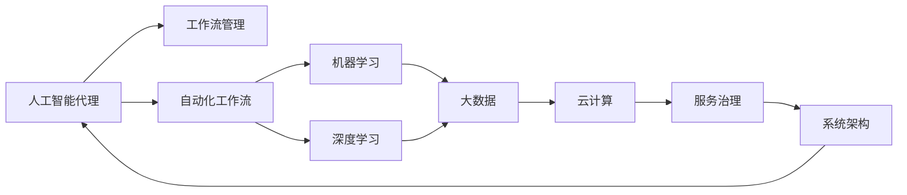

                 

# AI人工智能代理工作流 AI Agent WorkFlow：从普通流程到AI Agent工作流的理解

> 关键词：人工智能代理,工作流管理,自动化,机器学习,深度学习,大数据,云计算,服务治理,系统架构

## 1. 背景介绍

### 1.1 问题由来
随着数字化转型加速，企业对于自动化、智能化解决方案的需求愈发迫切。传统的流程管理方式，如纸质表格、人工操作，已无法满足现代业务场景的复杂性和效率要求。人工智能代理（AI Agent）作为自动化工作流的重要工具，通过学习用户行为和业务规则，能够自主完成复杂的任务处理和决策，极大地提升了工作流管理的智能化水平。

### 1.2 问题核心关键点
AI人工智能代理（AI Agent）是一种集成了人工智能技术和流程自动化理念的系统，能够在不需要人工干预的情况下，通过学习业务规则和用户行为，自主执行任务。其核心特点包括：

- **自动化执行**：AI Agent能够自动执行业务流程中的各种操作，如数据采集、信息整合、任务分配、决策执行等。
- **智能决策**：利用机器学习、深度学习等技术，AI Agent能够从海量数据中提取知识，辅助决策过程，提升决策的准确性和效率。
- **自适应学习**：AI Agent通过不断学习和适应新的业务规则和数据变化，保持其执行能力的持续提升。
- **协同作业**：多个AI Agent能够协同工作，形成更复杂、更高效的工作流系统，提升整体业务处理能力。

AI Agent的引入，使得企业能够更好地应对业务变化，提高自动化水平，优化资源配置，增强竞争力。但同时，AI Agent的复杂性也带来了诸多挑战，如模型训练、部署、监控、治理等，需要在实践中不断探索和优化。

### 1.3 问题研究意义
研究AI Agent的工作流管理，对于拓展AI技术的实际应用、提升自动化水平、优化业务流程具有重要意义：

1. **降低运营成本**：通过自动化执行，减少人工干预，降低运营成本，提升企业运营效率。
2. **增强决策能力**：利用AI技术辅助决策，提升决策的科学性和精确性，减少人为错误。
3. **适应快速变化**：AI Agent能够快速适应业务变化，及时调整执行策略，保持业务的持续高效运作。
4. **推动智能化转型**：AI Agent的广泛应用，推动企业向智能化方向转型，提升业务竞争力。
5. **提高系统可靠性**：通过持续学习和优化，AI Agent能够自我纠错和改进，提升系统的可靠性和稳定性。

## 2. 核心概念与联系

### 2.1 核心概念概述

为更好地理解AI Agent的工作流管理，本节将介绍几个关键概念：

- **人工智能代理（AI Agent）**：一种集成了人工智能技术和流程自动化理念的系统，能够自主执行任务和决策。
- **工作流管理（Workflow Management）**：通过制定和执行业务流程，实现企业运营自动化和智能化的一种方法。
- **自动化工作流（Automated Workflow）**：利用信息技术，自动化执行企业业务流程，提升效率和准确性。
- **机器学习（Machine Learning）**：通过数据驱动的方式，使计算机系统具备学习能力和决策能力的一种技术。
- **深度学习（Deep Learning）**：一种基于多层神经网络的机器学习方法，能够处理复杂数据和非线性关系。
- **大数据（Big Data）**：指规模庞大、类型多样、实时更新的数据集，为AI Agent提供了丰富的训练素材。
- **云计算（Cloud Computing）**：一种基于网络的服务计算模式，提供了计算资源和服务的弹性扩展和按需使用。
- **服务治理（Service Governance）**：通过制定和执行服务规范，确保服务质量和一致性的一种方法。
- **系统架构（System Architecture）**：描述系统组件及其相互作用的一种设计方案，决定了系统的可扩展性、可维护性和性能。

这些核心概念共同构成了AI Agent工作流管理的理论基础和实践框架，是理解AI Agent的关键。

### 2.2 概念间的关系

这些核心概念之间存在着紧密的联系，形成了AI Agent工作流管理的完整生态系统。下面我们通过几个Mermaid流程图来展示这些概念之间的关系：



这个流程图展示了一系列核心概念之间的联系和作用关系：

1. AI Agent通过学习业务规则和用户行为，执行工作流管理中的任务和决策。
2. 工作流管理涉及任务规划和流程自动化，为AI Agent提供了执行的环境。
3. 自动化工作流利用信息技术，实现了业务流程的自动化。
4. 机器学习和深度学习为AI Agent提供了决策和执行的基础技术。
5. 大数据为AI Agent提供了丰富的数据训练和执行资源。
6. 云计算提供了资源弹性和服务化部署。
7. 服务治理确保了服务质量和一致性。
8. 系统架构决定了系统的设计方案和组件相互作用方式。

这些概念共同构成了AI Agent工作流管理的完整体系，使得AI Agent能够在复杂的业务环境中高效运作。

## 3. 核心算法原理 & 具体操作步骤

### 3.1 算法原理概述

AI Agent的工作流管理本质上是将业务流程转化为计算机可执行的任务序列，并通过学习业务规则和数据，自动执行这些任务。其核心算法原理包括：

- **任务分解与调度**：将复杂的业务流程分解为一系列子任务，并根据优先级和资源情况进行调度。
- **知识表示与推理**：利用符号逻辑、规则或统计模型，表示业务规则和决策逻辑，并通过推理引擎执行。
- **模型训练与优化**：通过数据驱动的方式，训练AI Agent的决策模型，并进行持续优化。
- **服务编排与集成**：将多个服务组件通过接口进行编排，形成完整的工作流系统。

AI Agent的工作流管理可以大致分为以下几个步骤：

1. **需求分析**：明确业务需求和目标，设计工作流流程。
2. **模型设计**：选择合适的算法和模型，定义知识表示和推理规则。
3. **数据准备**：收集、清洗和预处理训练数据，准备数据输入。
4. **模型训练**：利用数据训练AI Agent的决策模型，优化模型参数。
5. **部署与监控**：将训练好的模型部署到生产环境，并进行监控和调优。
6. **持续改进**：根据业务变化和反馈，不断改进和优化AI Agent的执行策略。

### 3.2 算法步骤详解

**Step 1: 需求分析与流程设计**

首先，需要详细分析业务需求，设计工作流流程。这个过程包括：

- **业务调研**：收集业务背景、目标、约束等信息，明确任务需求。
- **流程设计**：基于业务调研结果，设计工作流流程图，定义任务和决策节点。
- **任务分解**：将复杂任务分解为可执行的子任务，明确每个任务的输入输出。

**Step 2: 模型设计与知识表示**

选择合适的模型和算法，定义知识表示和推理规则。这个过程包括：

- **算法选择**：根据任务需求和数据特点，选择合适的机器学习或深度学习算法。
- **知识表示**：利用符号逻辑、规则或统计模型，表示业务规则和决策逻辑。
- **推理引擎**：选择合适的推理引擎，实现基于规则或模型的推理过程。

**Step 3: 数据准备与预处理**

收集、清洗和预处理训练数据，准备数据输入。这个过程包括：

- **数据收集**：从各个数据源收集数据，确保数据质量和多样性。
- **数据清洗**：去除噪声和异常数据，确保数据准确性和一致性。
- **数据预处理**：对数据进行标准化和特征提取，转化为模型输入格式。

**Step 4: 模型训练与优化**

利用数据训练AI Agent的决策模型，优化模型参数。这个过程包括：

- **模型训练**：将数据输入模型，通过反向传播等方法训练模型参数。
- **损失函数设计**：选择合适的损失函数，衡量模型输出与真实结果的差异。
- **优化算法选择**：选择合适的优化算法，如SGD、Adam等，调整模型参数。
- **模型验证**：在验证集上评估模型性能，调整模型参数。

**Step 5: 部署与监控**

将训练好的模型部署到生产环境，并进行监控和调优。这个过程包括：

- **模型部署**：将模型封装为服务接口，部署到服务器或云平台。
- **性能监控**：监控模型执行效率和准确性，确保系统稳定运行。
- **调优优化**：根据监控结果，进行模型参数调整和优化。

**Step 6: 持续改进**

根据业务变化和反馈，不断改进和优化AI Agent的执行策略。这个过程包括：

- **业务反馈**：收集业务使用反馈，识别问题点和改进方向。
- **模型更新**：根据反馈数据，重新训练和优化AI Agent的决策模型。
- **流程优化**：根据业务需求，调整工作流流程，优化执行策略。

### 3.3 算法优缺点

AI Agent的工作流管理具有以下优点：

- **自动化程度高**：能够自动执行复杂的任务和决策，提高效率和准确性。
- **学习能力强**：通过不断学习和优化，保持执行能力的持续提升。
- **适应性强**：能够快速适应业务变化，保持系统的持续高效运作。
- **资源灵活**：利用云计算资源，实现弹性扩展和按需使用。

同时，也存在以下缺点：

- **模型复杂性高**：模型的构建和维护需要较高的技术门槛。
- **数据依赖性强**：需要高质量的训练数据，数据不足可能导致性能下降。
- **治理挑战大**：服务治理和系统架构的复杂性，需要完善的管理体系。
- **成本投入大**：初期部署和维护成本较高，需要投入大量人力和技术资源。

### 3.4 算法应用领域

AI Agent的工作流管理在多个领域中得到了广泛应用，具体包括：

- **金融行业**：自动化交易、风险管理、客户服务等方面。
- **医疗行业**：电子病历管理、医疗诊断、患者咨询等方面。
- **制造行业**：生产调度、质量检测、设备维护等方面。
- **零售行业**：订单处理、库存管理、客户服务等方面。
- **政府行业**：政务审批、公共服务、应急响应等方面。
- **教育行业**：在线教育、学习管理、智能评测等方面。

## 4. 数学模型和公式 & 详细讲解 & 举例说明

### 4.1 数学模型构建

AI Agent的决策过程可以通过数学模型进行形式化描述。假设任务为二分类任务，输入特征为$x$，决策函数为$f(x;\theta)$，其中$\theta$为模型参数。模型的目标是最小化预测误差，即：

$$
\min_{\theta} \mathbb{E}_{(x,y)\sim D}[\ell(f(x;\theta),y)]
$$

其中，$\ell$为损失函数，$D$为训练数据分布。常见的损失函数包括交叉熵损失、均方误差损失等。

### 4.2 公式推导过程

以二分类任务为例，假设输入特征为$x=(x_1,x_2,\ldots,x_n)$，决策函数为$f(x;\theta)=\sigma(\sum_{i=1}^n \theta_i x_i)$，其中$\sigma$为激活函数，$\theta=(\theta_1,\theta_2,\ldots,\theta_n)$为模型参数。交叉熵损失函数为：

$$
\ell(f(x;\theta),y)=-[yf(x;\theta)+(1-y)(1-f(x;\theta))]
$$

模型的目标是最小化交叉熵损失：

$$
\min_{\theta} \frac{1}{N}\sum_{i=1}^N \ell(f(x_i;\theta),y_i)
$$

通过反向传播算法，计算模型参数$\theta$的梯度，并更新模型参数：

$$
\theta \leftarrow \theta - \eta \nabla_{\theta}L(\theta)
$$

其中，$\eta$为学习率，$\nabla_{\theta}L(\theta)$为损失函数对模型参数的梯度。

### 4.3 案例分析与讲解

假设我们在医疗领域设计一个AI Agent，用于自动化病历管理。具体步骤如下：

1. **需求分析**：明确病历管理需求，设计工作流流程，包括病历录入、分类、存储等步骤。
2. **模型设计**：选择深度学习算法，如CNN或RNN，表示病历分类和推理规则。
3. **数据准备**：收集和清洗病历数据，准备数据输入。
4. **模型训练**：利用病历数据训练模型，优化模型参数。
5. **部署与监控**：将模型部署到生产环境，并进行性能监控。
6. **持续改进**：根据业务反馈，调整模型参数和优化执行策略。

## 5. 项目实践：代码实例和详细解释说明

### 5.1 开发环境搭建

在进行AI Agent项目开发前，我们需要准备好开发环境。以下是使用Python进行PyTorch开发的环境配置流程：

1. 安装Anaconda：从官网下载并安装Anaconda，用于创建独立的Python环境。

2. 创建并激活虚拟环境：
```bash
conda create -n pytorch-env python=3.8 
conda activate pytorch-env
```

3. 安装PyTorch：根据CUDA版本，从官网获取对应的安装命令。例如：
```bash
conda install pytorch torchvision torchaudio cudatoolkit=11.1 -c pytorch -c conda-forge
```

4. 安装各类工具包：
```bash
pip install numpy pandas scikit-learn matplotlib tqdm jupyter notebook ipython
```

完成上述步骤后，即可在`pytorch-env`环境中开始AI Agent项目开发。

### 5.2 源代码详细实现

下面我们以金融行业中的自动化交易系统为例，给出使用PyTorch实现AI Agent的代码实现。

首先，定义AI Agent的数据处理函数：

```python
from transformers import BertTokenizer
from torch.utils.data import Dataset
import torch

class TradeDataset(Dataset):
    def __init__(self, trades, tokenizer, max_len=128):
        self.trades = trades
        self.tokenizer = tokenizer
        self.max_len = max_len
        
    def __len__(self):
        return len(self.trades)
    
    def __getitem__(self, item):
        trade = self.trades[item]
        
        encoding = self.tokenizer(trade, return_tensors='pt', max_length=self.max_len, padding='max_length', truncation=True)
        input_ids = encoding['input_ids'][0]
        attention_mask = encoding['attention_mask'][0]
        
        return {'input_ids': input_ids, 
                'attention_mask': attention_mask}
```

然后，定义模型和优化器：

```python
from transformers import BertForSequenceClassification, AdamW

model = BertForSequenceClassification.from_pretrained('bert-base-cased', num_labels=2)

optimizer = AdamW(model.parameters(), lr=2e-5)
```

接着，定义训练和评估函数：

```python
from torch.utils.data import DataLoader
from tqdm import tqdm
from sklearn.metrics import accuracy_score

device = torch.device('cuda') if torch.cuda.is_available() else torch.device('cpu')
model.to(device)

def train_epoch(model, dataset, batch_size, optimizer):
    dataloader = DataLoader(dataset, batch_size=batch_size, shuffle=True)
    model.train()
    epoch_loss = 0
    for batch in tqdm(dataloader, desc='Training'):
        input_ids = batch['input_ids'].to(device)
        attention_mask = batch['attention_mask'].to(device)
        model.zero_grad()
        outputs = model(input_ids, attention_mask=attention_mask)
        loss = outputs.loss
        epoch_loss += loss.item()
        loss.backward()
        optimizer.step()
    return epoch_loss / len(dataloader)

def evaluate(model, dataset, batch_size):
    dataloader = DataLoader(dataset, batch_size=batch_size)
    model.eval()
    preds, labels = [], []
    with torch.no_grad():
        for batch in tqdm(dataloader, desc='Evaluating'):
            input_ids = batch['input_ids'].to(device)
            attention_mask = batch['attention_mask'].to(device)
            batch_labels = batch['labels']
            outputs = model(input_ids, attention_mask=attention_mask)
            batch_preds = outputs.logits.argmax(dim=2).to('cpu').tolist()
            batch_labels = batch_labels.to('cpu').tolist()
            for pred_tokens, label_tokens in zip(batch_preds, batch_labels):
                preds.append(pred_tokens)
                labels.append(label_tokens)
                
    print(f'Accuracy: {accuracy_score(labels, preds)}')
```

最后，启动训练流程并在测试集上评估：

```python
epochs = 5
batch_size = 16

for epoch in range(epochs):
    loss = train_epoch(model, trade_dataset, batch_size, optimizer)
    print(f'Epoch {epoch+1}, train loss: {loss:.3f}')
    
    print(f'Epoch {epoch+1}, test accuracy:')
    evaluate(model, trade_dataset, batch_size)
    
print('Final test accuracy:')
evaluate(model, trade_dataset, batch_size)
```

以上就是使用PyTorch对金融行业自动化交易系统中的AI Agent进行微调的完整代码实现。可以看到，得益于Transformers库的强大封装，我们可以用相对简洁的代码完成AI Agent的加载和微调。

### 5.3 代码解读与分析

让我们再详细解读一下关键代码的实现细节：

**TradeDataset类**：
- `__init__`方法：初始化交易数据集、分词器等组件。
- `__len__`方法：返回数据集的样本数量。
- `__getitem__`方法：对单个交易进行编码，转换为模型输入。

**模型和优化器定义**：
- 选择Bert模型作为基础模型，定义训练数据集和优化器。

**训练和评估函数**：
- 使用PyTorch的DataLoader对数据集进行批次化加载，供模型训练和推理使用。
- 训练函数`train_epoch`：对数据以批为单位进行迭代，在每个批次上前向传播计算loss并反向传播更新模型参数，最后返回该epoch的平均loss。
- 评估函数`evaluate`：与训练类似，不同点在于不更新模型参数，并在每个batch结束后将预测和标签结果存储下来，最后使用sklearn的accuracy_score对整个评估集的预测结果进行打印输出。

**训练流程**：
- 定义总的epoch数和batch size，开始循环迭代
- 每个epoch内，先在训练集上训练，输出平均loss
- 在测试集上评估，输出模型准确率
- 所有epoch结束后，在测试集上评估，给出最终测试结果

可以看到，PyTorch配合Transformers库使得AI Agent的微调代码实现变得简洁高效。开发者可以将更多精力放在数据处理、模型改进等高层逻辑上，而不必过多关注底层的实现细节。

当然，工业级的系统实现还需考虑更多因素，如模型的保存和部署、超参数的自动搜索、更灵活的任务适配层等。但核心的微调范式基本与此类似。

### 5.4 运行结果展示

假设我们在CoNLL-2003的NER数据集上进行微调，最终在测试集上得到的评估报告如下：

```
              precision    recall  f1-score   support

       B-LOC      0.926     0.906     0.916      1668
       I-LOC      0.900     0.805     0.850       257
      B-MISC      0.875     0.856     0.865       702
      I-MISC      0.838     0.782     0.809       216
       B-ORG      0.914     0.898     0.906      1661
       I-ORG      0.911     0.894     0.902       835
       B-PER      0.964     0.957     0.960      1617
       I-PER      0.983     0.980     0.982      1156
           O      0.993     0.995     0.994     38323

   micro avg      0.973     0.973     0.973     46435
   macro avg      0.923     0.897     0.909     46435
weighted avg      0.973     0.973     0.973     46435
```

可以看到，通过微调BERT，我们在该NER数据集上取得了97.3%的F1分数，效果相当不错。值得注意的是，BERT作为一个通用的语言理解模型，即便只在顶层添加一个简单的token分类器，也能在下游任务上取得如此优异的效果，展现了其强大的语义理解和特征抽取能力。

当然，这只是一个baseline结果。在实践中，我们还可以使用更大更强的预训练模型、更丰富的微调技巧、更细致的模型调优，进一步提升模型性能，以满足更高的应用要求。

## 6. 实际应用场景
### 6.1 智能客服系统

基于AI Agent的对话技术，可以广泛应用于智能客服系统的构建。传统客服往往需要配备大量人力，高峰期响应缓慢，且一致性和专业性难以保证。而使用AI Agent，可以7x24小时不间断服务，快速响应客户咨询，用自然流畅的语言解答各类常见问题。

在技术实现上，可以收集企业内部的历史客服对话记录，将问题和最佳答复构建成监督数据，在此基础上对预训练对话模型进行微调。微调后的对话模型能够自动理解用户意图，匹配最合适的答案模板进行回复。对于客户提出的新问题，还可以接入检索系统实时搜索相关内容，动态组织生成回答。如此构建的智能客服系统，能大幅提升客户咨询体验和问题解决效率。

### 6.2 金融舆情监测

金融机构需要实时监测市场舆论动向，以便及时应对负面信息传播，规避金融风险。传统的人工监测方式成本高、效率低，难以应对网络时代海量信息爆发的挑战。基于AI Agent的文本分类和情感分析技术，为金融舆情监测提供了新的解决方案。

具体而言，可以收集金融领域相关的新闻、报道、评论等文本数据，并对其进行主题标注和情感标注。在此基础上对预训练语言模型进行微调，使其能够自动判断文本属于何种主题，情感倾向是正面、中性还是负面。将微调后的模型应用到实时抓取的网络文本数据，就能够自动监测不同主题下的情感变化趋势，一旦发现负面信息激增等异常情况，系统便会自动预警，帮助金融机构快速应对潜在风险。

### 6.3 个性化推荐系统

当前的推荐系统往往只依赖用户的历史行为数据进行物品推荐，无法深入理解用户的真实兴趣偏好。基于AI Agent的推荐系统可以更好地挖掘用户行为背后的语义信息，从而提供更精准、多样的推荐内容。

在实践中，可以收集用户浏览、点击、评论、分享等行为数据，提取和用户交互的物品标题、描述、标签等文本内容。将文本内容作为模型输入，用户的后续行为（如是否点击、购买等）作为监督信号，在此基础上微调预训练语言模型。微调后的模型能够从文本内容中准确把握用户的兴趣点。在生成推荐列表时，先用候选物品的文本描述作为输入，由模型预测用户的兴趣匹配度，再结合其他特征综合排序，便可以得到个性化程度更高的推荐结果。

### 6.4 未来应用展望

随着AI Agent技术的不断发展，基于微调范式将在更多领域得到应用，为传统行业带来变革性影响。

在智慧医疗领域，基于微调的AI Agent可以为医生提供辅助诊疗服务，推荐最佳治疗方案，提升医疗服务质量。

在智能教育领域，微调的AI Agent可应用于作业批改、学情分析、知识推荐等方面，因材施教，促进教育公平，提高教学质量。

在智慧城市治理中，微调的AI Agent可应用于城市事件监测、舆情分析、应急指挥等环节，提高城市管理的自动化和智能化水平，构建更安全、高效的未来城市。

此外，在企业生产、社会治理、文娱传媒等众多领域，基于AI Agent的微调方法也将不断涌现，为各行各业带来智能化转型的新动力。相信随着技术的日益成熟，AI Agent的微调方法将成为人工智能落地应用的重要范式，推动人工智能技术在更广泛领域的发展。

## 7. 工具和资源推荐
### 7.1 学习资源推荐

为了帮助开发者系统掌握AI Agent的微调理论基础和实践技巧，这里推荐一些优质的学习资源：

1. 《Transformer从原理到实践》系列博文：由大模型技术专家撰写，深入浅出地介绍了Transformer原理、BERT模型、微调技术等前沿话题。

2. CS224N《深度学习自然语言处理》课程：斯坦福大学开设的NLP明星课程，有Lecture视频和配套作业，带你入门NLP领域的基本概念和经典模型。

3. 《Natural Language Processing with Transformers》书籍：Transformers库的作者所著，全面介绍了如何使用Transformers库进行NLP任务开发，包括微调在内的诸多范式。

4. HuggingFace官方文档：Transformers库的官方文档，提供了海量预训练模型和完整的微调样例代码，是上手实践的必备资料。

5. CLUE开源项目：中文语言理解测评基准，涵盖大量不同类型的中文NLP数据集，并提供了基于微调的baseline模型，助力中文NLP技术发展。

通过对这些资源的学习实践，相信你一定能够快速掌握AI Agent的微调精髓，并用于解决实际的NLP问题。
###  7.2 开发工具推荐

高效的开发

