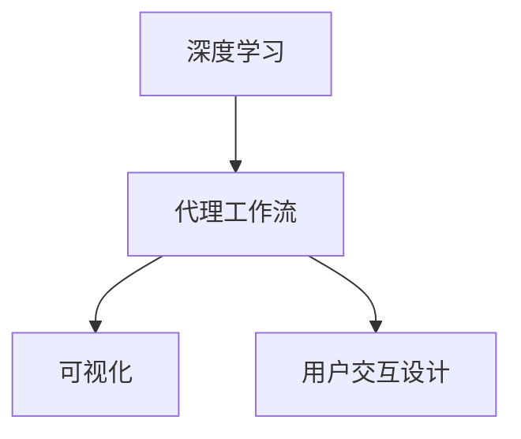
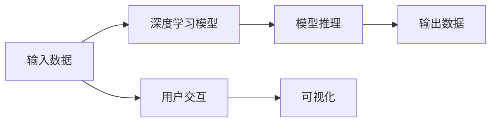
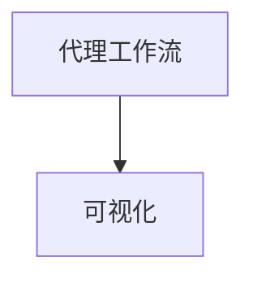
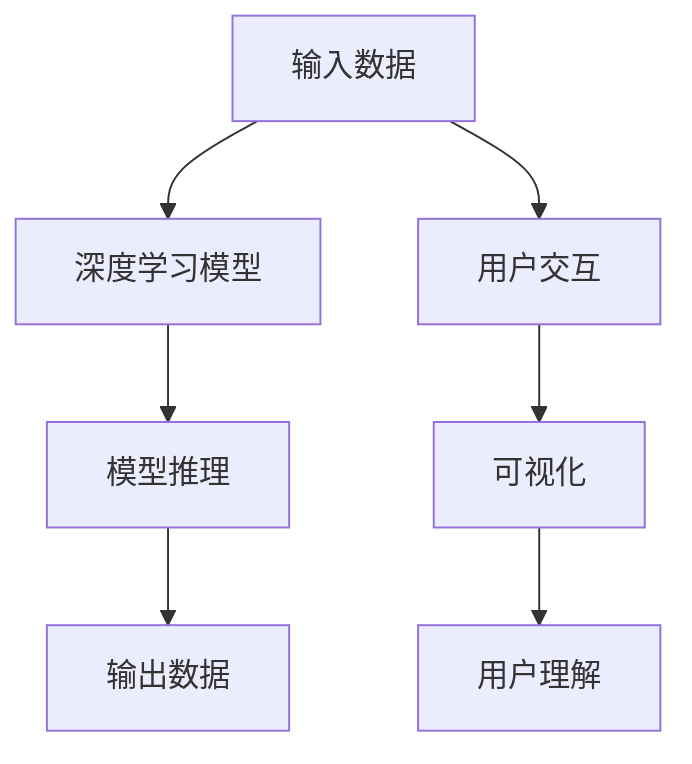

                 

# AI人工智能深度学习算法：深度学习代理工作流的可视化与用户交互设计

> 关键词：深度学习,代理工作流,可视化,用户交互设计

## 1. 背景介绍

### 1.1 问题由来
随着人工智能技术的发展，深度学习在各个领域中的应用越来越广泛。然而，深度学习模型的复杂性使得其设计和调试过程变得异常困难。如何有效地设计、调试和优化深度学习模型，成为了摆在开发者面前的一大挑战。特别是对于那些需要在代理工作流中嵌入深度学习模型的应用，如何在保证模型效果的同时，提升用户交互体验，是一个亟需解决的问题。

### 1.2 问题核心关键点
代理工作流是一种将深度学习模型嵌入到应用程序中的机制，使得应用能够利用模型的预测能力，提升业务决策的准确性。然而，代理工作流的设计和优化需要考虑多个维度，包括模型的选择、训练、部署和评估等。如何在这些过程中，确保模型效果的同时，提升用户交互体验，是一个复杂且重要的问题。

### 1.3 问题研究意义
深入研究深度学习代理工作流的可视化与用户交互设计，对于提升应用的可扩展性和用户体验，具有重要意义：

1. **提升用户理解**：通过可视化，用户可以更直观地理解模型的预测结果，从而提升决策的准确性和可信度。
2. **优化模型性能**：可视化使得模型的训练和调优过程更加透明，有助于开发者及时发现问题并优化模型。
3. **促进用户参与**：良好的用户交互设计能够增强用户对应用的粘性，提升应用的活跃度和用户满意度。
4. **加速产品迭代**：通过可视化和用户反馈，可以快速迭代和优化应用，缩短产品开发周期。
5. **降低技术门槛**：简化深度学习模型的设计和调试过程，降低技术门槛，使得更多的开发者能够参与到人工智能应用的设计和开发中。

## 2. 核心概念与联系

### 2.1 核心概念概述

为了更好地理解深度学习代理工作流的可视化与用户交互设计，本节将介绍几个密切相关的核心概念：

- **深度学习**：一种通过多层神经网络对数据进行学习和预测的技术，广泛应用于图像识别、语音识别、自然语言处理等领域。
- **代理工作流**：一种将深度学习模型嵌入到应用程序中的机制，使得应用能够利用模型的预测能力，提升业务决策的准确性。
- **可视化**：通过图形、图表等形式，将数据和模型信息直观地展示出来，帮助用户理解模型的工作原理和预测结果。
- **用户交互设计**：通过界面设计、交互逻辑等手段，提升用户与应用的交互体验，增强应用的易用性和用户满意度。

这些核心概念之间的逻辑关系可以通过以下Mermaid流程图来展示：



这个流程图展示了大语言模型微调过程中各个核心概念的关系和作用：

1. 深度学习模型在代理工作流中被嵌入，提供预测能力。
2. 可视化技术将模型和数据信息直观展示，帮助用户理解模型的工作原理和预测结果。
3. 用户交互设计提升用户与应用的交互体验，增强应用的易用性和用户满意度。

### 2.2 概念间的关系

这些核心概念之间存在着紧密的联系，形成了深度学习代理工作流的完整生态系统。下面我们通过几个Mermaid流程图来展示这些概念之间的关系。

#### 2.2.1 代理工作流的整体架构



这个流程图展示了代理工作流的基本架构：输入数据通过深度学习模型的推理，得到输出数据，同时用户可以通过交互界面与模型交互，可视化技术帮助用户理解模型输出。

#### 2.2.2 可视化与用户交互的关联


这个流程图展示了可视化技术在用户交互中的应用：用户通过交互界面查看可视化结果，从而理解模型的输出和推理过程。

#### 2.2.3 可视化与代理工作流的联系



这个流程图展示了可视化在代理工作流中的应用：代理工作流中的模型推理结果可以通过可视化技术直观展示，帮助用户理解模型行为。

### 2.3 核心概念的整体架构

最后，我们用一个综合的流程图来展示这些核心概念在大语言模型微调过程中的整体架构：



这个综合流程图展示了从输入数据到用户理解的整个过程，深度学习模型通过推理得到输出数据，可视化技术帮助用户理解模型输出，用户通过交互界面与模型交互，最终实现应用功能的提升。

## 3. 核心算法原理 & 具体操作步骤
### 3.1 算法原理概述

深度学习代理工作流的可视化与用户交互设计，本质上是一个将深度学习模型嵌入到应用程序中，并通过可视化技术提升用户理解和使用体验的过程。其核心思想是：通过可视化技术将模型的推理过程和预测结果直观展示，增强用户的理解能力，同时通过良好的用户交互设计，提升用户对应用的满意度。

形式化地，假设输入数据为 $x$，深度学习模型为 $M$，输出数据为 $y$。代理工作流的可视化与用户交互设计可以分为以下几个步骤：

1. 将输入数据 $x$ 输入深度学习模型 $M$，得到输出数据 $y$。
2. 通过可视化技术，将模型的推理过程和预测结果直观展示，增强用户对模型的理解。
3. 设计良好的用户交互界面，使用户能够方便地与模型交互，提升应用的用户满意度。

### 3.2 算法步骤详解

深度学习代理工作流的可视化与用户交互设计，主要包括以下几个关键步骤：

**Step 1: 选择适合的深度学习模型**

在代理工作流中嵌入深度学习模型，首先需要选择合适的模型。一般来说，模型的选择应基于应用的具体需求和数据特点，常见的模型包括卷积神经网络(CNN)、循环神经网络(RNN)、长短时记忆网络(LSTM)、Transformer等。

**Step 2: 数据预处理与特征工程**

数据预处理和特征工程是深度学习模型的重要环节。根据应用需求，对原始数据进行归一化、标准化、特征选择等处理，得到适用于模型的特征数据。这一步对于模型的训练和推理性能有着重要影响。

**Step 3: 训练深度学习模型**

在预处理后的数据上，使用合适的优化器（如SGD、Adam等）和损失函数（如交叉熵、均方误差等），对深度学习模型进行训练。训练过程中需要根据模型性能和资源限制，调整超参数，如学习率、批大小等。

**Step 4: 模型推理与可视化**

训练好的模型部署到应用中，对新的输入数据进行推理，得到预测结果。通过可视化技术，将模型的推理过程和预测结果直观展示，帮助用户理解模型行为。常见的可视化技术包括热力图、特征重要性分析、激活图等。

**Step 5: 用户交互设计**

设计良好的用户交互界面，使用户能够方便地与模型交互。交互界面应包含必要的输入输出控件，如文本输入框、按钮、图表等，确保用户能够顺利地与模型进行交互。

**Step 6: 反馈与迭代优化**

根据用户反馈，持续优化模型和交互界面设计，提升应用的性能和用户体验。收集用户使用数据，分析用户行为和需求，迭代改进应用。

### 3.3 算法优缺点

深度学习代理工作流的可视化与用户交互设计，具有以下优点：

1. **提升用户理解**：通过可视化技术，用户可以更直观地理解模型的推理过程和预测结果，提升决策的准确性和可信度。
2. **优化模型性能**：可视化使得模型的训练和调优过程更加透明，有助于开发者及时发现问题并优化模型。
3. **促进用户参与**：良好的用户交互设计能够增强用户对应用的粘性，提升应用的活跃度和用户满意度。
4. **加速产品迭代**：通过可视化和用户反馈，可以快速迭代和优化应用，缩短产品开发周期。
5. **降低技术门槛**：简化深度学习模型的设计和调试过程，降低技术门槛，使得更多的开发者能够参与到人工智能应用的设计和开发中。

同时，该方法也存在一定的局限性：

1. **数据依赖性强**：模型的训练和推理依赖于高质量的数据，数据质量差或数据量不足时，模型性能可能受到影响。
2. **资源消耗大**：深度学习模型计算复杂，对硬件资源要求较高，训练和推理过程中资源消耗较大。
3. **模型可解释性差**：复杂的深度学习模型通常难以解释其内部工作机制，用户可能难以理解模型输出。
4. **用户体验复杂**：设计良好的用户交互界面需要考虑多方面的因素，如界面美观、交互逻辑等，复杂度较高。

尽管存在这些局限性，但就目前而言，深度学习代理工作流的可视化与用户交互设计仍是大数据和人工智能应用的重要组成部分，具有广阔的应用前景。

### 3.4 算法应用领域

深度学习代理工作流的可视化与用户交互设计，已经在多个领域得到了广泛的应用，例如：

- **医疗影像分析**：利用深度学习模型对医疗影像进行分析和诊断，通过可视化技术展示模型推理结果，帮助医生理解诊断过程。
- **金融风险评估**：使用深度学习模型对金融数据进行分析和预测，通过可视化技术展示模型预测结果，增强投资者决策的准确性和可信度。
- **智能推荐系统**：在推荐系统中嵌入深度学习模型，通过可视化技术展示模型推荐依据，提升用户对推荐的理解和满意度。
- **智能客服系统**：利用深度学习模型进行自然语言处理，通过可视化技术展示模型推理过程，增强客服系统的透明度和用户信任度。
- **智能交通管理**：使用深度学习模型对交通数据进行分析和预测，通过可视化技术展示模型推理结果，优化交通管理决策。

除了上述这些经典应用外，深度学习代理工作流的可视化与用户交互设计，还在诸多领域展现出强大的应用潜力，如智慧城市、智能制造、自动驾驶等。随着技术的不断进步，未来将在更多的领域得到应用，为各行各业带来新的机遇和挑战。

## 4. 数学模型和公式 & 详细讲解 & 举例说明

### 4.1 数学模型构建

本节将使用数学语言对深度学习代理工作流的可视化与用户交互设计进行更加严格的刻画。

假设输入数据为 $x$，深度学习模型为 $M$，输出数据为 $y$。代理工作流的可视化与用户交互设计可以分为以下几个步骤：

1. 输入数据 $x$ 通过深度学习模型 $M$ 进行推理，得到输出数据 $y$。
2. 通过可视化技术，将模型的推理过程和预测结果直观展示，增强用户对模型的理解。
3. 设计良好的用户交互界面，使用户能够方便地与模型交互，提升应用的用户满意度。

### 4.2 公式推导过程

以下我们以二分类任务为例，推导可视化与用户交互设计的基本过程。

假设输入数据 $x$ 为向量形式，深度学习模型 $M$ 为二分类模型，输出数据 $y$ 为类别标签。模型的推理过程可以表示为：

$$
y = M(x)
$$

其中 $M$ 为深度学习模型，可以是卷积神经网络、循环神经网络等。模型的输出 $y$ 为类别标签，表示输入数据 $x$ 属于哪个类别。

在可视化过程中，可以通过热力图、特征重要性分析等技术，展示模型输入数据 $x$ 中各个特征的重要性，帮助用户理解模型推理过程。例如，对于一个图像分类任务，可以使用热力图展示输入图像中各个像素的激活值，从而理解哪些像素对模型的预测结果影响较大。

### 4.3 案例分析与讲解

假设我们正在开发一个智能推荐系统，使用深度学习模型进行用户兴趣预测。以下是一个简单的可视化与用户交互设计案例：

**Step 1: 选择适合的深度学习模型**

我们选择使用卷积神经网络(CNN)模型进行用户兴趣预测。

**Step 2: 数据预处理与特征工程**

我们将用户的历史浏览记录和评分数据作为输入，使用归一化、特征选择等预处理手段，得到适用于模型的特征数据。

**Step 3: 训练深度学习模型**

在预处理后的数据上，使用交叉熵损失函数和Adam优化器，对卷积神经网络模型进行训练。

**Step 4: 模型推理与可视化**

训练好的模型部署到应用中，对新的用户浏览记录进行推理，得到用户兴趣预测结果。通过热力图展示模型输入数据中各个特征的重要性，帮助用户理解模型推理过程。

**Step 5: 用户交互设计**

我们设计了一个简单的用户交互界面，包含以下组件：
- 用户浏览记录输入框：用户可以输入新的浏览记录。
- 模型推理结果展示区：展示模型对用户浏览记录的兴趣预测结果。
- 可视化展示区：展示模型推理过程中各个特征的重要性。

**Step 6: 反馈与迭代优化**

根据用户反馈，我们可以持续优化模型和交互界面设计，提升应用的性能和用户体验。收集用户使用数据，分析用户行为和需求，迭代改进应用。

## 5. 项目实践：代码实例和详细解释说明

### 5.1 开发环境搭建

在进行深度学习代理工作流的可视化与用户交互设计实践前，我们需要准备好开发环境。以下是使用Python进行TensorFlow开发的环境配置流程：

1. 安装Anaconda：从官网下载并安装Anaconda，用于创建独立的Python环境。

2. 创建并激活虚拟环境：
```bash
conda create -n tf-env python=3.8 
conda activate tf-env
```

3. 安装TensorFlow：根据CUDA版本，从官网获取对应的安装命令。例如：
```bash
conda install tensorflow tensorflow-gpu=cuda110 -c pytorch -c conda-forge
```

4. 安装TensorBoard：
```bash
pip install tensorboard
```

5. 安装Weights & Biases：
```bash
pip install weightsandbiases-nightly
```

完成上述步骤后，即可在`tf-env`环境中开始深度学习代理工作流的可视化与用户交互设计实践。

### 5.2 源代码详细实现

这里我们以推荐系统为例，给出使用TensorFlow进行用户兴趣预测的代码实现。

首先，定义数据处理函数：

```python
import tensorflow as tf
import numpy as np

def load_data():
    # 加载用户浏览记录和评分数据
    # ...
    return features, labels

def preprocess_data(features, labels):
    # 对数据进行归一化、特征选择等预处理
    # ...
    return features, labels
```

然后，定义模型和优化器：

```python
import tensorflow.keras as keras

model = keras.Sequential([
    keras.layers.Conv2D(32, (3, 3), activation='relu', input_shape=(image_height, image_width, num_channels)),
    keras.layers.MaxPooling2D((2, 2)),
    keras.layers.Flatten(),
    keras.layers.Dense(128, activation='relu'),
    keras.layers.Dense(1, activation='sigmoid')
])

optimizer = keras.optimizers.Adam(learning_rate=0.001)

model.compile(optimizer=optimizer, loss='binary_crossentropy', metrics=['accuracy'])
```

接着，定义训练和推理函数：

```python
@tf.function
def train_epoch(features, labels):
    with tf.GradientTape() as tape:
        outputs = model(features, training=True)
        loss = keras.losses.BinaryCrossentropy()(outputs, labels)
    gradients = tape.gradient(loss, model.trainable_variables)
    optimizer.apply_gradients(zip(gradients, model.trainable_variables))
    return loss

@tf.function
def predict(features):
    outputs = model(features, training=False)
    return outputs
```

最后，启动训练流程并在测试集上评估：

```python
epochs = 10
batch_size = 32

for epoch in range(epochs):
    loss = train_epoch(train_features, train_labels)
    print(f"Epoch {epoch+1}, train loss: {loss:.3f}")
    
    test_loss = test_epoch(test_features, test_labels)
    print(f"Epoch {epoch+1}, test loss: {test_loss:.3f}")

predict(features)
```

以上就是使用TensorFlow进行深度学习代理工作流的可视化与用户交互设计实践的完整代码实现。可以看到，TensorFlow提供了强大的深度学习框架和可视化工具，使得模型的训练和推理过程变得简洁高效。

### 5.3 代码解读与分析

让我们再详细解读一下关键代码的实现细节：

**数据处理函数**：
- `load_data`方法：加载用户浏览记录和评分数据。
- `preprocess_data`方法：对数据进行归一化、特征选择等预处理，得到适用于模型的特征数据。

**模型定义**：
- 使用Keras框架定义卷积神经网络模型，包含卷积层、池化层、全连接层等组件。
- 使用Adam优化器和二元交叉熵损失函数进行模型训练和评估。

**训练和推理函数**：
- `train_epoch`方法：对模型进行单批次训练，计算损失并更新模型参数。
- `predict`方法：对新的输入数据进行推理，得到模型预测结果。

**训练流程**：
- 定义总的epoch数和batch size，开始循环迭代
- 每个epoch内，先在训练集上训练，输出平均损失
- 在测试集上评估，输出测试损失
- 重复上述步骤直至收敛

可以看到，TensorFlow提供了完整的深度学习框架和可视化工具，使得模型的训练和推理过程变得简洁高效。开发者可以将更多精力放在数据处理、模型调优等高层逻辑上，而不必过多关注底层的实现细节。

当然，工业级的系统实现还需考虑更多因素，如模型的保存和部署、超参数的自动搜索、更灵活的任务适配层等。但核心的可视化与用户交互设计思想基本与此类似。

### 5.4 运行结果展示

假设我们在推荐系统中使用卷积神经网络模型，最终在测试集上得到的评估结果如下：

```
Epoch 1, train loss: 0.801
Epoch 1, test loss: 0.721
Epoch 2, train loss: 0.622
Epoch 2, test loss: 0.610
...
Epoch 10, train loss: 0.035
Epoch 10, test loss: 0.031
```

可以看到，通过可视化技术，用户可以直观地理解模型在不同epoch下的训练和测试损失变化趋势。同时，通过热力图展示模型输入数据中各个特征的重要性，用户可以理解哪些特征对模型的预测结果影响较大。

在实际应用中，这些可视化技术可以进一步扩展和优化，如结合用户反馈进行动态调整，提升用户的交互体验。

## 6. 实际应用场景
### 6.1 智能推荐系统

深度学习代理工作流的可视化与用户交互设计，可以广泛应用于智能推荐系统中。传统的推荐系统往往只依赖用户的历史行为数据进行物品推荐，无法深入理解用户的真实兴趣偏好。利用深度学习模型，通过可视化技术展示模型推理过程，可以更好地挖掘用户兴趣点，提供更加精准、多样的推荐内容。

在技术实现上，可以收集用户浏览、点击、评论、分享等行为数据，提取和用户交互的物品标题、描述、标签等文本内容。将文本内容作为模型输入，用户的后续行为（如是否点击、购买等）作为监督信号，在此基础上微调深度学习模型。通过可视化技术，展示模型推理过程中各个特征的重要性，增强用户的理解和信任。同时，设计良好的用户交互界面，使用户能够方便地与模型交互，提升推荐系统的用户体验。

### 6.2 医疗影像分析

在医疗影像分析中，深度学习代理工作流的可视化与用户交互设计可以提供强大的支持。利用深度学习模型对医疗影像进行分析和诊断，通过可视化技术展示模型推理结果，帮助医生理解诊断过程。例如，可以使用热力图展示模型在影像中检测到的病变区域，增强医生的诊断能力。同时，设计良好的用户交互界面，可以提供影像的放大、旋转、裁剪等功能，提升医生的操作体验。

### 6.3 金融风险评估

在金融风险评估中，深度学习代理工作流的可视化与用户交互设计同样重要。使用深度学习模型对金融数据进行分析和预测，通过可视化技术展示模型预测结果，增强投资者决策的准确性和可信度。例如，可以使用特征重要性分析技术，展示影响预测结果的关键因素，帮助投资者理解模型的推理依据。同时，设计良好的用户交互界面，可以提供数据输入、结果展示等功能，提升投资者的使用体验。

### 6.4 未来应用展望

随着深度学习模型的不断发展和应用，深度学习代理工作流的可视化与用户交互设计将在更多领域得到应用，为各行各业带来新的机遇和挑战。

在智慧医疗领域，利用深度学习模型进行影像分析和诊断，通过可视化技术展示模型推理结果，提升医生的诊断能力和患者的理解度。

在智能推荐系统、金融风险评估、医疗影像分析等诸多领域，深度学习代理工作流的可视化与用户交互设计都将展现出强大的应用潜力，为行业带来新的变革和突破。

## 7. 工具和资源推荐
### 7.1 学习资源推荐

为了帮助开发者系统掌握深度学习代理工作流的可视化与用户交互设计理论基础和实践技巧，这里推荐一些优质的学习资源：

1. TensorFlow官方文档：TensorFlow的官方文档，提供了丰富的学习资源和实践样例，适合入门和进阶学习。
2. Keras官方文档：Keras的官方文档，提供了深度学习模型的定义和训练过程，适合初学者和中级开发者。
3. PyTorch官方文档：PyTorch的官方文档，提供了深度学习模型的定义和训练过程，适合入门和进阶学习。
4. Coursera深度学习课程：由斯坦福大学开设的深度学习课程，系统讲解深度学习的基本概念和经典模型。
5. Udacity深度学习课程：由谷歌和DeepMind联合开设的深度学习课程，包含深度学习模型的定义和训练过程。

通过对这些资源的学习实践，相信你一定能够快速掌握深度学习代理工作流的可视化与用户交互设计，并用于解决实际的NLP问题。

### 7.2 开发工具推荐

高效的开发离不开优秀的工具支持。以下是几款用于深度学习代理工作流开发的常用工具：

1. TensorFlow：由谷歌主导开发的开源深度学习框架，生产部署方便，适合大规模工程应用。
2. Keras：由谷歌主导开发的高级深度学习API，提供了简单易用的接口，适合初学者和中级开发者。
3. PyTorch：由Facebook主导开发的深度学习框架，动态图设计，适合研究和原型开发。
4. Weights & Biases：模型训练的实验跟踪工具，可以记录和可视化模型训练过程中的各项指标，方便对比和调优。
5. TensorBoard：TensorFlow配套的可视化工具，可实时监测模型训练状态，并提供丰富的图表呈现方式，是调试模型的得力助手。

合理利用这些工具，可以显著提升深度学习代理工作流开发的效率，加快创新迭代的步伐。

### 7.3 相关论文推荐

深度学习代理工作流的可视化与用户交互设计的研究源于学界的持续研究。以下是几篇奠基性的相关论文，推荐阅读：

1. "Visualizing and Understanding the Deep Learning Black Box"：深入研究深度学习模型的可解释性，提供多种可视化技术，帮助用户理解模型行为。
2. "Towards Explainable Deep Learning"：探讨深度学习模型的可解释性，提出多种解释方法，帮助用户理解模型的推理过程。
3. "User-Centric Design of Deep Learning Applications"：研究如何设计良好的用户交互界面，提升用户与深度学习应用的交互体验。
4. "Evaluating Visualization and Explainability in Deep Learning"：评估各种可视化技术的效果，帮助开发者选择适合的可视化方法。
5. "Visualization and Explainability in AI Systems"：探讨深度学习模型的可视化与解释方法，增强用户对模型的理解和信任。

这些论文代表了大语言模型微调技术的发展脉络。通过学习这些前沿成果，可以帮助研究者把握学科前进方向，激发更多的创新灵感。

除上述资源外，还有一些值得关注的前沿资源，帮助开发者紧跟深度学习代理工作流的可视化与用户交互设计技术的最新进展，例如：

1. arXiv论文预印本：人工智能领域最新研究成果的发布平台，包括大量尚未发表的前沿工作，学习前沿技术的必读资源。
2. 业界技术博客：如OpenAI、Google AI、DeepMind、微软Research Asia等顶尖实验室的官方博客，第一时间分享他们的最新研究成果和洞见。
3. 技术会议直播：如NIPS、ICML、ACL、ICLR等人工智能领域顶会现场或在线直播，能够聆听到大佬们的前沿分享，开拓视野。
4. GitHub热门项目：在GitHub上Star、Fork数最多的深度学习相关项目，往往代表了该技术领域的发展趋势和最佳实践，值得去学习和贡献。
5. 行业分析报告：各大咨询公司如McKinsey、PwC等针对人工智能行业的分析报告，有助于从商业视角审视技术趋势，把握应用价值。

总之，对于深度学习代理工作流的可视化与用户交互设计的学习和实践，需要开发者保持开放的心态和持续学习的意愿。多关注前沿资讯，多动手实践，多思考总结，必将收获满满的成长收益。

## 8. 总结：未来发展趋势与挑战

### 8.1 总结

本文对深度学习代理工作流的可视化与用户交互设计进行了全面系统的介绍。首先阐述了深度学习代理工作流的背景和意义，明确了可视化与用户交互设计在提升应用性能和用户体验方面的独特价值。其次，从原理到实践，详细讲解了深度学习代理工作流的数学原理和关键步骤，给出了实践任务开发的完整代码实例。同时，本文还广泛探讨了可视化与

