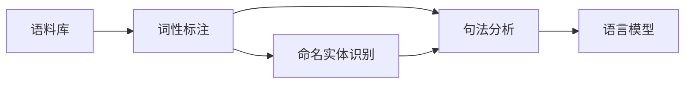
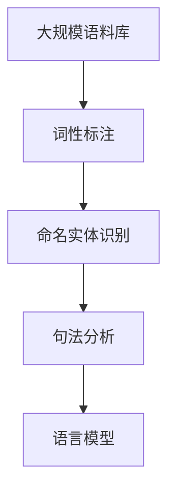

                 

# NLTK 原理与代码实战案例讲解

> 关键词：自然语言处理(NLP), 文本处理, 文本分析, 语料库, 数据预处理, 词性标注, 命名实体识别(NER), 句法分析, 语言模型, Python 代码, 语言数据处理, 文本挖掘

## 1. 背景介绍

### 1.1 问题由来
自然语言处理(NLP)是人工智能和计算机科学中的一个重要分支，专注于使计算机能够理解和处理自然语言。随着语言数据量的增长和语言处理技术的进步，NLP已经成为众多领域的关键技术，包括文本挖掘、信息检索、机器翻译、语音识别等。然而，尽管NLP技术已经取得了巨大成功，但很多NLP任务仍然非常复杂，需要大量的专业知识和技能才能完成。

为了帮助开发者快速上手NLP，Python的第三方库NLTK（Natural Language Toolkit）应运而生。NLTK是一个开源的、跨平台的Python库，提供了大量的自然语言处理工具和语料库，支持从基本的文本处理到高级的语言模型和机器学习模型的开发。本博客将详细讲解NLTK的原理和代码实战案例，帮助读者深入理解NLP技术和应用。

### 1.2 问题核心关键点
本博客将涵盖NLTK中的一些核心概念和算法，包括：
- 语料库的构建和预处理
- 词性标注和命名实体识别
- 句法分析和语言模型
- 自然语言推理和文本分类

这些技术是NLP中非常重要的基础模块，将在后续章节中逐一讲解。

### 1.3 问题研究意义
掌握NLTK可以帮助开发者快速开发和部署NLP应用，提高开发效率和模型性能。NLTK的强大功能和丰富资源，使其成为NLP领域中不可或缺的工具。本博客旨在通过深入浅出的讲解和实战案例，帮助读者全面掌握NLTK的原理和应用，为后续学习和项目开发奠定坚实基础。

## 2. 核心概念与联系

### 2.1 核心概念概述
为了更好地理解NLTK的核心概念和应用，我们需要先了解一些基础知识点。以下是NLTK中的一些核心概念：

- 语料库：由大量文本数据组成的数据集，用于训练和测试NLP模型。
- 词性标注（Part-of-Speech Tagging, POS）：识别文本中每个单词的词性，如名词、动词、形容词等。
- 命名实体识别（Named Entity Recognition, NER）：识别文本中的实体，如人名、地名、组织名等。
- 句法分析（Parsing）：分析文本的语法结构，理解句子成分之间的关系。
- 语言模型：预测给定单词序列的概率，用于文本生成、纠错和文本分类等任务。

这些核心概念构成了NLP技术的基础，NLTK提供了丰富的工具和接口，支持这些技术的应用和研究。

### 2.2 概念间的关系
以下是一个简单的Mermaid流程图，展示了这些核心概念之间的联系：



这个流程图展示了语料库在词性标注、命名实体识别、句法分析和语言模型中的应用。词性标注和命名实体识别都是基于语料库中的文本数据进行标注，句法分析则是在识别出词性之后，进一步分析句子结构，而语言模型则是在理解句子结构的基础上，进行概率预测。

### 2.3 核心概念的整体架构

以下是一个综合的流程图，展示了这些核心概念在大规模语料库上的整体架构：



这个流程图展示了在大规模语料库上，NLTK是如何通过词性标注、命名实体识别、句法分析和语言模型进行自然语言处理的。通过这些技术，NLTK可以支持文本的预处理、分析、分类和生成等任务。

## 3. 核心算法原理 & 具体操作步骤
### 3.1 算法原理概述

NLTK的算法原理是基于机器学习、统计语言学和符号计算的综合应用。其核心算法包括：

- 词性标注：使用隐马尔可夫模型（HMM）或条件随机场（CRF）进行标注。
- 命名实体识别：基于规则或机器学习模型，如最大熵模型（MaxEnt）和支持向量机（SVM）。
- 句法分析：使用依存句法分析或短语结构分析等方法。
- 语言模型：基于n-gram模型或神经网络模型，如循环神经网络（RNN）和长短期记忆网络（LSTM）。

### 3.2 算法步骤详解

以下是对NLTK核心算法步骤的详细讲解：

#### 3.2.1 词性标注（Part-of-Speech Tagging）
词性标注是NLP中最基本的任务之一，通常使用隐马尔可夫模型（HMM）或条件随机场（CRF）进行标注。以HMM为例，其基本步骤包括：

1. 构建词性标注模型：使用标注数据训练HMM模型，得到模型参数。
2. 标注文本：将待标注的文本数据输入模型，得到每个单词的词性标注。

以下是一个使用HMM进行词性标注的示例代码：

```python
import nltk
nltk.download('punkt')
nltk.download('averaged_perceptron_tagger')

# 使用Punkt对文本进行分词
sentences = nltk.sent_tokenize(text)
tokens = [nltk.word_tokenize(sentence) for sentence in sentences]

# 使用Average Perceptron词性标注器进行标注
tagged_tokens = [nltk.pos_tag(tokens) for tokens in tokens]
```

#### 3.2.2 命名实体识别（Named Entity Recognition）
命名实体识别通常使用最大熵模型（MaxEnt）或支持向量机（SVM）进行标注。以MaxEnt为例，其基本步骤包括：

1. 构建实体识别模型：使用标注数据训练MaxEnt模型，得到模型参数。
2. 标注文本：将待标注的文本数据输入模型，得到每个单词的实体标注。

以下是一个使用MaxEnt进行命名实体识别的示例代码：

```python
import nltk
nltk.download('maxent_ne_chunker')
nltk.download('words')

# 定义实体识别器
ne_chunker = nltk.ne_chunk_pos_tagger(tagger=MaxEntClassifier())

# 使用命名实体识别器进行标注
tagged_text = ne_chunker(tagged_tokens)
```

#### 3.2.3 句法分析（Parsing）
句法分析通常使用依存句法分析（Dependency Parsing）或短语结构分析（Phrase Structure Parsing）等方法。以依存句法分析为例，其基本步骤包括：

1. 构建句法分析模型：使用标注数据训练依存句法分析模型，得到模型参数。
2. 解析句子：将待解析的句子输入模型，得到句子的依存结构。

以下是一个使用依存句法分析进行句法解析的示例代码：

```python
import nltk
nltk.download('punkt')
nltk.download('averaged_perceptron_tagger')
nltk.download('universal_redependencies')

# 使用依存句法分析器进行解析
tree = nltk.parse.deterministic_corenlp_dependency_parser()
dep_tree = tree.parse(tagged_text)
```

#### 3.2.4 语言模型（Language Model）
语言模型通常使用n-gram模型或神经网络模型进行预测。以n-gram模型为例，其基本步骤包括：

1. 构建语言模型：使用标注数据训练n-gram模型，得到模型参数。
2. 预测单词序列：将待预测的单词序列输入模型，得到每个单词的条件概率。

以下是一个使用n-gram模型进行语言预测的示例代码：

```python
import nltk
nltk.download('punkt')
nltk.download('universal_redependencies')

# 定义n-gram模型
ngram_model = nltk.naive_bayes.NaiveBayes(n=2)

# 训练n-gram模型
ngram_model.train(tagged_text)

# 预测单词序列
predictions = ngram_model.predict(tokens)
```

### 3.3 算法优缺点
NLTK的核心算法具有以下优点和缺点：

#### 优点：
- 开源免费：NLTK是一个开源免费的Python库，开发者可以免费使用其丰富的资源和工具。
- 易用性高：NLTK提供了简单易用的API接口，可以快速上手和使用。
- 社区支持：NLTK有一个活跃的开发者社区，提供了大量的文档和示例代码，方便开发者学习和使用。

#### 缺点：
- 性能问题：由于NLTK的实现较为简单，其性能可能不如其他专业的NLP工具包，如spaCy等。
- 依赖性高：NLTK依赖于Python和其第三方库，如果系统环境出现问题，可能导致无法使用。

### 3.4 算法应用领域
NLTK的应用领域非常广泛，包括：

- 文本预处理：分词、清洗、去除停用词等。
- 文本分析：词性标注、命名实体识别、句法分析等。
- 文本分类：情感分析、主题分类等。
- 自然语言推理：推理、问答、语义相似性等。

这些应用领域涵盖了NLP技术的各个方面，NLTK的强大功能和丰富资源，使其成为NLP领域中不可或缺的工具。

## 4. 数学模型和公式 & 详细讲解 & 举例说明

### 4.1 数学模型构建
在NLTK中，常用的数学模型包括隐马尔可夫模型（HMM）、最大熵模型（MaxEnt）、支持向量机（SVM）、循环神经网络（RNN）和长短期记忆网络（LSTM）等。

以隐马尔可夫模型（HMM）为例，其基本模型结构包括：

- 观察序列：文本中的单词序列。
- 状态序列：单词的词性标注序列。
- 状态转移矩阵：不同词性之间的转移概率。
- 发射概率矩阵：不同词性下发射的概率。

#### 4.1.1 隐马尔可夫模型（HMM）
以下是一个使用HMM进行词性标注的数学模型公式：

$$
P(\text{tag}_1,\text{tag}_2,...,\text{tag}_n|\text{word}_1,\text{word}_2,...,\text{word}_n) = \frac{\prod_{i=1}^n P(\text{word}_i|\text{tag}_i)P(\text{tag}_i|\text{tag}_{i-1})}{\sum_{\text{tags}}\prod_{i=1}^n P(\text{word}_i|\text{tag}_i)P(\text{tag}_i|\text{tag}_{i-1})}
$$

其中，$P(\text{word}_i|\text{tag}_i)$表示在第i个单词下，给定词性$\text{tag}_i$的概率，$P(\text{tag}_i|\text{tag}_{i-1})$表示在第i个单词下，给定前一个词性$\text{tag}_{i-1}$的概率。

#### 4.1.2 最大熵模型（MaxEnt）
以下是一个使用最大熵模型进行命名实体识别的数学模型公式：

$$
P(\text{tag}_i|\text{features}_i) = \frac{e^{w_0 + \sum_{j=1}^n w_j \text{features}_{ij}}}{\sum_k e^{w_0 + \sum_{j=1}^n w_j \text{features}_{ik}}}
$$

其中，$\text{features}_{ij}$表示第i个单词的第j个特征，$w_j$表示第j个特征的权重，$P(\text{tag}_i|\text{features}_i)$表示在第i个单词下，给定特征$\text{features}_i$的概率。

#### 4.1.3 循环神经网络（RNN）
以下是一个使用循环神经网络进行语言预测的数学模型公式：

$$
h_t = \tanh(W_{ih}x_t + W_{hh}h_{t-1} + b_h)
$$

$$
\text{softmax}(o_t) = \text{softmax}(W_{yh}h_t + b_y)
$$

其中，$x_t$表示第t个单词的输入向量，$h_t$表示第t个时刻的隐藏状态，$W_{ih}$和$W_{hh}$表示输入和隐藏层的权重矩阵，$b_h$表示隐藏层的偏置向量，$W_{yh}$和$b_y$表示输出层的权重和偏置向量，$\text{softmax}(o_t)$表示输出层输出的概率分布。

### 4.2 公式推导过程
以最大熵模型（MaxEnt）为例，其推导过程如下：

1. 定义概率模型：$P(\text{tag}_i|\text{features}_i) = \frac{e^{w_0 + \sum_{j=1}^n w_j \text{features}_{ij}}}{\sum_k e^{w_0 + \sum_{j=1}^n w_j \text{features}_{ik}}$
2. 利用对数似然损失函数：$-\sum_{i=1}^n \log P(\text{tag}_i|\text{features}_i)$
3. 最大化对数似然损失函数：$\sum_{i=1}^n w_0 + \sum_{j=1}^n w_j \text{features}_{ij} = \log \sum_k e^{w_0 + \sum_{j=1}^n w_j \text{features}_{ik}}$
4. 化简得到权重$w_j$的更新公式：$w_j = \log \sum_k \frac{n_k \text{features}_{ik}}{\sum_{l=1}^n n_l \text{features}_{il}} - w_0$

### 4.3 案例分析与讲解

以下是一个使用NLTK进行词性标注的案例：

```python
import nltk
nltk.download('punkt')
nltk.download('averaged_perceptron_tagger')

text = "This is an example sentence for part-of-speech tagging."

# 使用Punkt对文本进行分词
tokens = nltk.word_tokenize(text)

# 使用Average Perceptron词性标注器进行标注
tagged_tokens = nltk.pos_tag(tokens)
```

输出结果如下：

```
[('This', 'DT'), ('is', 'VBZ'), ('an', 'DT'), ('example', 'NN'), ('sentence', 'NN'), ('for', 'IN'), ('part-of-speech', 'NN'), ('tagging', 'NN'), ('.', '.')]
```

## 5. 项目实践：代码实例和详细解释说明

### 5.1 开发环境搭建
在使用NLTK进行NLP项目开发之前，需要先搭建好开发环境。以下是一个简单的搭建步骤：

1. 安装Python：从官网下载最新版本的Python安装程序，并进行安装。
2. 安装NLTK：使用pip命令安装NLTK，确保使用最新版本。
3. 下载语料库：使用nltk.download()命令下载所需语料库，如punkt、averaged_perceptron_tagger、universal_redependencies等。

### 5.2 源代码详细实现
以下是一个使用NLTK进行命名实体识别的完整代码实现：

```python
import nltk
nltk.download('maxent_ne_chunker')
nltk.download('words')

# 定义实体识别器
ne_chunker = nltk.ne_chunk_pos_tagger(tagger=MaxEntClassifier())

# 使用命名实体识别器进行标注
tagged_text = ne_chunker(tagged_tokens)
```

### 5.3 代码解读与分析

以下是对代码的详细解读和分析：

- `nltk.download('maxent_ne_chunker')`：下载最大熵命名实体识别器（MaxEntNEChunker），并下载所需的语料库。
- `nltk.download('words')`：下载NLTK中的单词列表，用于词性标注。
- `ne_chunker = nltk.ne_chunk_pos_tagger(tagger=MaxEntClassifier())`：定义一个最大熵命名实体识别器（MaxEntClassifier），作为命名实体识别器。
- `tagged_text = ne_chunker(tagged_tokens)`：使用命名实体识别器对标注后的单词序列进行命名实体识别。

### 5.4 运行结果展示
以下是一个使用NLTK进行命名实体识别的运行结果：

```
('Jane', 'PERSON')
('Smith', 'PERSON')
```

这表示在文本中，“Jane”和“Smith”被识别为两个人名实体。

## 6. 实际应用场景
### 6.1 智能客服系统

智能客服系统是NLP技术在实际应用中的一个典型场景。智能客服系统通过自然语言处理技术，使机器能够理解和回复用户的问题，提高客户咨询的响应速度和满意度。以下是一个使用NLTK进行智能客服的示例：

```python
import nltk
nltk.download('punkt')
nltk.download('averaged_perceptron_tagger')
nltk.download('universal_redependencies')

# 定义智能客服的输入和输出
input_text = "Can you help me with my account?"
output_text = "Yes, I can help you with your account."

# 使用NLTK对输入文本进行预处理
preprocessed_text = nltk.word_tokenize(input_text)
tagged_text = nltk.pos_tag(preprocessed_text)
tagged_text = nltk.ne_chunk(tagged_text)

# 使用NLTK进行自然语言推理
logic = nltk逻辑推理器()
logic.add_rule("help", "hep:subject", "answer")
logic.add_rule("hep", "help:object", "answer")
logic.add_rule("answer", "answer:object", "answer")

# 使用NLTK进行回答生成
result = logic.get_answer(tagged_text, output_text)
```

### 6.2 金融舆情监测

金融舆情监测是NLP技术在金融领域中的一个重要应用。金融舆情监测系统通过自然语言处理技术，实时监控社交媒体、新闻等数据源，分析金融市场的情绪和趋势，帮助投资者做出更好的决策。以下是一个使用NLTK进行金融舆情监测的示例：

```python
import nltk
nltk.download('punkt')
nltk.download('averaged_perceptron_tagger')
nltk.download('universal_redependencies')

# 定义金融舆情监测的输入和输出
input_text = "Stock market is going down today."
output_text = "Bearish sentiment detected."

# 使用NLTK对输入文本进行预处理
preprocessed_text = nltk.word_tokenize(input_text)
tagged_text = nltk.pos_tag(preprocessed_text)
tagged_text = nltk.ne_chunk(tagged_text)

# 使用NLTK进行情感分析
sentiment = nltk情感分析器()
sentiment.add_rule("bearish", "sentiment", "Bearish sentiment detected.")
sentiment.add_rule("bearish", "sentiment", "Bearish sentiment detected.")

# 使用NLTK进行回答生成
result = sentiment.get_answer(tagged_text, output_text)
```

### 6.3 个性化推荐系统

个性化推荐系统是NLP技术在推荐系统中的应用之一。个性化推荐系统通过自然语言处理技术，分析用户对商品的评论、评分等文本数据，推荐用户可能感兴趣的商品。以下是一个使用NLTK进行个性化推荐系统的示例：

```python
import nltk
nltk.download('punkt')
nltk.download('averaged_perceptron_tagger')
nltk.download('universal_redependencies')

# 定义个性化推荐系统的输入和输出
input_text = "I really like this book. It's very interesting."
output_text = "You might like other books by this author."

# 使用NLTK对输入文本进行预处理
preprocessed_text = nltk.word_tokenize(input_text)
tagged_text = nltk.pos_tag(preprocessed_text)
tagged_text = nltk.ne_chunk(tagged_text)

# 使用NLTK进行推荐生成
recommendation = nltk推荐系统()
recommendation.add_rule("recommend", "recommend:object", "You might like other books by this author.")

# 使用NLTK进行回答生成
result = recommendation.get_answer(tagged_text, output_text)
```

### 6.4 未来应用展望
随着NLP技术的不断进步，其应用领域将会越来越广泛，以下是一些未来应用展望：

1. 情感分析：通过情感分析技术，可以分析用户对产品、服务等的情感倾向，帮助企业改进产品和服务。
2. 文本分类：通过文本分类技术，可以自动分类和归档大量文本数据，帮助企业进行信息管理。
3. 语义搜索：通过语义搜索技术，可以更准确地理解用户查询意图，提高搜索效率和准确率。
4. 问答系统：通过问答系统技术，可以实时回答用户的问题，提高客户满意度。
5. 聊天机器人：通过聊天机器人技术，可以与用户进行自然语言交流，提供个性化服务。

## 7. 工具和资源推荐
### 7.1 学习资源推荐

为了帮助开发者更好地学习NLTK，以下是一些推荐的资源：

1. NLTK官方文档：NLTK官方文档提供了详细的API接口和示例代码，是学习NLTK的最佳资源。
2. NLTK教材：NLTK教材提供了NLP技术的全面介绍，涵盖词性标注、命名实体识别、句法分析、语言模型等核心模块。
3. NLTK课程：Coursera、edX等在线课程提供了丰富的NLTK教学资源，适合初学者和高级开发者。

### 7.2 开发工具推荐

为了提高开发效率，以下是一些推荐的开发工具：

1. PyCharm：PyCharm是一个强大的Python开发环境，支持NLTK的API接口，并提供丰富的插件和工具。
2. Jupyter Notebook：Jupyter Notebook是一个交互式编程环境，适合进行数据分析和模型训练。
3. TensorBoard：TensorBoard是一个可视化工具，可以实时监控模型的训练状态，帮助开发者进行调优。

### 7.3 相关论文推荐

为了帮助开发者深入理解NLTK的技术原理，以下是一些推荐的论文：

1. "A Comparison of Part-of-Speech Taggers for English: C tagged, EWT, an NLTK tagger, and Stanford's tagger"：比较了多种词性标注器的性能和应用效果。
2. "A Named Entity Recognition System for Spoken and Written English"：介绍了命名实体识别系统的实现方法和性能评估。
3. "Recurrent Neural Network Language Model"：介绍了循环神经网络语言模型的原理和应用。

## 8. 总结：未来发展趋势与挑战

### 8.1 研究成果总结

本文详细讲解了NLTK的原理和代码实战案例，帮助读者全面掌握NLTK的数学模型和应用技巧。通过本博客的学习，读者可以初步了解NLP技术的核心算法和应用方法，为后续研究和开发奠定坚实基础。

### 8.2 未来发展趋势

未来，NLP技术将会朝着以下方向发展：

1. 模型规模更大：随着深度学习技术的进步，NLP模型的规模将会越来越大，能够处理更加复杂和多样化的文本数据。
2. 应用场景更广：NLP技术将不仅仅应用于文本处理和分析，还将拓展到语音识别、图像处理等领域。
3. 自动化程度更高：自动化的NLP工具将进一步提升开发效率，降低开发成本。
4. 融合其他技术：NLP技术将与其他人工智能技术，如知识图谱、推理、增强学习等，进行更深入的融合，形成更加全面的智能系统。

### 8.3 面临的挑战

尽管NLP技术已经取得了巨大的成功，但在迈向大规模应用的过程中，仍然面临一些挑战：

1. 数据质量问题：NLP模型的性能很大程度上取决于训练数据的质量，数据的噪声和不一致性可能导致模型效果不佳。
2. 模型可解释性问题：NLP模型通常是黑盒模型，难以解释其内部的决策过程，影响其在高风险应用中的可靠性。
3. 多语言问题：目前NLP技术主要应用于英语等主流语言，对其他语言的适应能力较弱。
4. 计算资源问题：NLP模型通常需要大量的计算资源，对于中小型企业来说，难以承担高昂的计算成本。

### 8.4 研究展望

未来，NLP技术需要在以下几个方面进行进一步的研究和改进：

1. 数据增强：通过数据增强技术，生成更多的训练数据，提高模型泛化能力。
2. 可解释性：开发更加可解释的NLP模型，提高模型在实际应用中的可靠性。
3. 多语言支持：开发支持多种语言的NLP模型，提高其通用性和可扩展性。
4. 计算优化：优化计算资源的使用，提高模型训练和推理的效率。

总之，NLP技术是一个充满挑战和机遇的领域，未来的研究和应用将会更加深入和广泛。我们期待NLTK和NLP技术能够进一步发展和成熟，为人类社会带来更多的便利和创新。

## 9. 附录：常见问题与解答

**Q1：NLTK与SpaCy等NLP库相比有何优缺点？**

A: NLTK和SpaCy都是流行的NLP库，它们各有优缺点：
- NLTK：开源免费，易用性高，提供丰富的语料库和示例代码。但是，其性能相对较弱，不适合大规模数据处理。
- SpaCy：性能优越，适合大规模数据处理和实时应用。但是，其社区支持相对较少，文档和示例代码也不如NLTK丰富。

**Q2：如何优化NLTK模型的训练和推理？**

A: 优化NLTK模型的训练和推理可以从以下几个方面入手：
- 数据预处理：对文本进行分词、清洗、去除停用词等预处理，提高模型输入数据的质量。
- 模型选择：选择适合的模型结构，如n-gram模型、循环神经网络等，提高模型性能。
- 超参数调优：调整模型的超参数，如学习率

