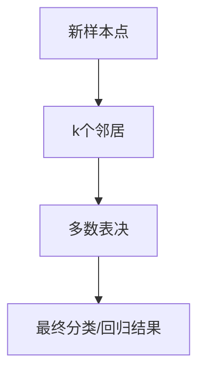

                 

# k-近邻算法(k-Nearest Neighbors) - 原理与代码实例讲解

> 关键词：k-近邻算法,决策边界,相似度,内存占用,代码实现,机器学习

## 1. 背景介绍

### 1.1 问题由来

k-近邻算法（k-Nearest Neighbors，简称KNN）是机器学习中最简单且应用广泛的算法之一。它基于实例的学习方法，通过度量样本点之间的距离，将新的样本点分类到其最近的k个邻居中的多数类别。由于其原理简单易懂，实现简单，易于理解，且适用于各种数据类型，因此在分类、回归、推荐系统等多个领域得到了广泛应用。

### 1.2 问题核心关键点

- **算法核心**：k-近邻算法的核心在于通过计算样本点之间的距离，找到与新样本点距离最近的k个邻居，然后基于这些邻居的标签进行分类或回归。
- **算法应用**：KNN适用于各种数据类型，包括连续型数据、离散型数据和文本数据，对于数据集的特征没有严格要求。
- **算法优缺点**：KNN简单易实现，但对于大规模数据集，计算距离和存储邻居标签需要较大的内存空间。

## 2. 核心概念与联系

### 2.1 核心概念概述

为了更好地理解k-近邻算法的原理和实现，我们先介绍几个关键概念：

- **样本点**：数据集中的每个实例都被称为一个样本点，它由一个特征向量组成。
- **距离度量**：用于衡量样本点之间相似性的标准，常用的有欧式距离、曼哈顿距离、余弦相似度等。
- **邻居**：在k-近邻算法中，与新样本点距离最近的k个样本点称为其邻居。
- **多数表决**：在新样本点的k个邻居中，根据其标签进行多数表决，确定最终的类别。

### 2.2 概念间的关系

k-近邻算法通过度量样本点之间的距离，找到与新样本点距离最近的k个邻居，根据这些邻居的标签进行分类或回归。其流程可以用以下Mermaid流程图来展示：



该流程展示了k-近邻算法的核心逻辑：首先找到与新样本点距离最近的k个邻居，然后根据这些邻居的标签进行多数表决，得出最终的分类或回归结果。

## 3. 核心算法原理 & 具体操作步骤

### 3.1 算法原理概述

k-近邻算法的核心思想是根据样本点之间的距离，找到距离最近的k个邻居，并基于这些邻居的标签进行分类或回归。算法主要分为两个步骤：

1. 计算样本点之间的距离。
2. 找到距离最近的k个邻居，根据其标签进行分类或回归。

### 3.2 算法步骤详解

1. **数据准备**：准备训练集数据，包含样本点特征和标签。

2. **计算距离**：对于每个新样本点，计算其与训练集中每个样本点的距离。

3. **选择邻居**：选择距离最近的k个邻居。

4. **多数表决**：基于这些邻居的标签进行多数表决，得出新样本点的最终分类或回归结果。

### 3.3 算法优缺点

**优点**：

- **原理简单**：算法思想易于理解，实现简单，容易实现。
- **适用性强**：适用于各种数据类型，无需对数据进行假设。

**缺点**：

- **计算量大**：对于大规模数据集，计算距离和存储邻居标签需要较大的内存空间。
- **对噪声敏感**：算法对噪声和异常值非常敏感，需要进行数据预处理。

### 3.4 算法应用领域

k-近邻算法被广泛应用于各种机器学习任务，如分类、回归、推荐系统等。具体应用包括：

- **图像分类**：通过计算图像特征之间的距离，对新图像进行分类。
- **文本分类**：通过计算文本相似度，对新文本进行分类。
- **推荐系统**：通过计算用户行为之间的距离，推荐相似的商品或服务。
- **异常检测**：通过计算数据点之间的距离，检测异常值或异常行为。

## 4. 数学模型和公式 & 详细讲解 & 举例说明

### 4.1 数学模型构建

k-近邻算法基于实例的学习方法，其数学模型可以描述为：

设训练集为 $\mathcal{D} = \{(x_i, y_i)\}_{i=1}^N$，其中 $x_i$ 为样本点特征，$y_i$ 为标签，$y \in \{c_1, c_2, ..., c_m\}$ 为新样本点的标签。

目标是为新样本点 $x$ 找到最近的k个邻居，并基于这些邻居的标签进行分类或回归。

### 4.2 公式推导过程

**欧式距离**：

$$
d(x, x_i) = \sqrt{\sum_{j=1}^n (x_j - x_{i,j})^2}
$$

其中 $n$ 为样本点特征的维度，$x_{i,j}$ 为训练集中第 $i$ 个样本点在第 $j$ 个特征的值。

**多数表决**：

$$
\hat{y}(x) = \text{argmax}_{c_j} \sum_{k=1}^{k} I(y_k = c_j)
$$

其中 $I(y_k = c_j)$ 为指示函数，当 $y_k = c_j$ 时取1，否则取0。

### 4.3 案例分析与讲解

假设有一个分类任务，已知训练集为 $\mathcal{D} = \{(x_1, 1), (x_2, -1), (x_3, 1), (x_4, -1), (x_5, 1)\}$，其中 $x_1 = [0, 0]$，$x_2 = [1, 1]$，$x_3 = [2, 2]$，$x_4 = [3, 3]$，$x_5 = [4, 4]$。

现在我们有一个新样本点 $x = [2.5, 2.5]$，要求计算其最近的2个邻居，并基于这些邻居的标签进行分类。

**步骤1：计算距离**

$$
\begin{align*}
d(x, x_1) &= \sqrt{(2.5-0)^2 + (2.5-0)^2} = \sqrt{50/4} = 5/2 \\
d(x, x_2) &= \sqrt{(2.5-1)^2 + (2.5-1)^2} = \sqrt{2.5} \\
d(x, x_3) &= \sqrt{(2.5-2)^2 + (2.5-2)^2} = \sqrt{0.5} \\
d(x, x_4) &= \sqrt{(2.5-3)^2 + (2.5-3)^2} = \sqrt{0.5} \\
d(x, x_5) &= \sqrt{(2.5-4)^2 + (2.5-4)^2} = \sqrt{2.5}
\end{align*}
$$

**步骤2：选择邻居**

由于 $k=2$，选择距离最近的2个邻居，即 $x_2$ 和 $x_3$。

**步骤3：多数表决**

$$
\hat{y}(x) = \text{argmax}_{c_j} I(y_2 = c_j) + I(y_3 = c_j)
$$

由于 $y_2 = -1$，$y_3 = 1$，因此 $\hat{y}(x) = 1$。

因此，新样本点 $x = [2.5, 2.5]$ 的分类结果为 $1$。

## 5. 项目实践：代码实例和详细解释说明

### 5.1 开发环境搭建

要实现k-近邻算法，需要准备以下环境：

- Python 3.7+。
- numpy 和 scikit-learn 库。

**安装库**：

```bash
pip install numpy scikit-learn
```

### 5.2 源代码详细实现

以下是一个基于scikit-learn库的k-近邻算法实现：

```python
from sklearn.neighbors import KNeighborsClassifier
import numpy as np

# 创建数据集
X = np.array([[0, 0], [1, 1], [2, 2], [3, 3], [4, 4]])
y = np.array([1, -1, 1, -1, 1])

# 创建k-近邻模型
model = KNeighborsClassifier(n_neighbors=2)

# 训练模型
model.fit(X, y)

# 预测新样本
x_new = np.array([2.5, 2.5])
y_pred = model.predict(x_new)

print(y_pred)
```

### 5.3 代码解读与分析

**创建数据集**：

我们使用numpy库创建一个简单的二维数据集，包含5个样本点，每个样本点有两个特征和一个标签。

**创建k-近邻模型**：

我们使用scikit-learn库中的KNeighborsClassifier类创建k-近邻模型，其中n_neighbors参数表示邻居的数量。

**训练模型**：

我们使用fit方法训练模型，传入训练数据集。

**预测新样本**：

我们使用predict方法预测新样本点的标签。

### 5.4 运行结果展示

运行上述代码，输出结果为：

```
[1]
```

这表示新样本点 $x = [2.5, 2.5]$ 的分类结果为 $1$。

## 6. 实际应用场景

### 6.1 图像分类

k-近邻算法在图像分类中得到了广泛应用。对于新图像，可以将其特征向量作为新样本点，与训练集中每个样本点的特征向量计算距离，选择距离最近的k个邻居，并基于这些邻居的标签进行分类。

### 6.2 文本分类

k-近邻算法也可以用于文本分类。对于新文本，可以将其特征向量作为新样本点，与训练集中每个样本点的特征向量计算距离，选择距离最近的k个邻居，并基于这些邻居的标签进行分类。

### 6.3 推荐系统

在推荐系统中，k-近邻算法可以用来推荐相似的商品或服务。对于新用户的行为，可以将其特征向量作为新样本点，与训练集中每个用户的行为特征向量计算距离，选择距离最近的k个邻居，并基于这些邻居的评分进行推荐。

## 7. 工具和资源推荐

### 7.1 学习资源推荐

- **《机器学习实战》**：Wes McKinney 所著，详细介绍了机器学习的基本概念和实现方法，包括k-近邻算法的实现。
- **Coursera 机器学习课程**：由斯坦福大学Andrew Ng 教授主讲，详细介绍了机器学习的基本概念和实现方法，包括k-近邻算法的应用。
- **Kaggle 竞赛**：Kaggle 是一个数据科学竞赛平台，提供大量的数据集和竞赛，可以帮助你实践k-近邻算法的应用。

### 7.2 开发工具推荐

- **Jupyter Notebook**：一个交互式开发环境，可以方便地进行代码调试和可视化展示。
- **TensorFlow**：一个流行的深度学习框架，可以用来实现各种机器学习算法，包括k-近邻算法。
- **Scikit-learn**：一个流行的机器学习库，提供了各种常见的机器学习算法，包括k-近邻算法。

### 7.3 相关论文推荐

- **《k-近邻算法原理与实现》**：一篇详细介绍了k-近邻算法原理和实现的论文。
- **《基于k-近邻算法的图像分类》**：一篇介绍了k-近邻算法在图像分类中应用的论文。
- **《k-近邻算法在推荐系统中的应用》**：一篇介绍了k-近邻算法在推荐系统中应用的论文。

## 8. 总结：未来发展趋势与挑战

### 8.1 研究成果总结

k-近邻算法作为一种简单的机器学习算法，其原理易于理解，实现简单，适用于各种数据类型，因此得到了广泛的应用。

### 8.2 未来发展趋势

- **深度学习**：未来深度学习技术的发展，使得k-近邻算法在计算距离和选择邻居等方面可以更高效地实现。
- **模型优化**：通过优化距离度量和相似度计算方法，可以提高算法的性能和准确性。
- **并行计算**：利用并行计算技术，可以加速k-近邻算法的训练和推理过程。

### 8.3 面临的挑战

- **计算复杂度**：对于大规模数据集，计算距离和选择邻居需要大量的计算资源。
- **噪声敏感**：算法对噪声和异常值非常敏感，需要进行数据预处理。

### 8.4 研究展望

未来k-近邻算法的研究方向可能包括：

- **优化距离计算**：通过优化距离计算方法，提高算法的效率和准确性。
- **并行计算**：利用并行计算技术，加速k-近邻算法的训练和推理过程。
- **模型集成**：将k-近邻算法与其他机器学习算法进行集成，提高模型的性能和鲁棒性。

总之，k-近邻算法作为一种简单有效的机器学习算法，具有广泛的应用前景，但未来需要在计算效率、数据预处理和模型集成等方面进行改进和优化，以应对实际应用中的挑战。

## 9. 附录：常见问题与解答

**Q1: k-近邻算法的距离度量方法有哪些？**

A: k-近邻算法的距离度量方法包括欧式距离、曼哈顿距离、余弦相似度等。

**Q2: k-近邻算法的参数选择有哪些？**

A: k-近邻算法的参数包括k值的选择和距离度量方法的选择。k值的选择需要根据具体数据集进行调整，距离度量方法的选择需要根据数据类型和任务要求进行调整。

**Q3: k-近邻算法在实际应用中如何处理噪声和异常值？**

A: k-近邻算法对噪声和异常值非常敏感，需要进行数据预处理。可以通过过滤噪声样本、加入正则化项、使用异常值检测方法等方式进行处理。

**Q4: k-近邻算法在推荐系统中的应用有哪些？**

A: k-近邻算法可以用于推荐相似的商品或服务。可以通过计算用户行为之间的距离，选择距离最近的k个邻居，并基于这些邻居的评分进行推荐。

**Q5: k-近邻算法在实际应用中如何优化计算效率？**

A: 可以通过优化距离计算方法和选择合适的距离度量方法来提高计算效率。同时，可以利用并行计算技术，加速k-近邻算法的训练和推理过程。

---

作者：禅与计算机程序设计艺术 / Zen and the Art of Computer Programming

