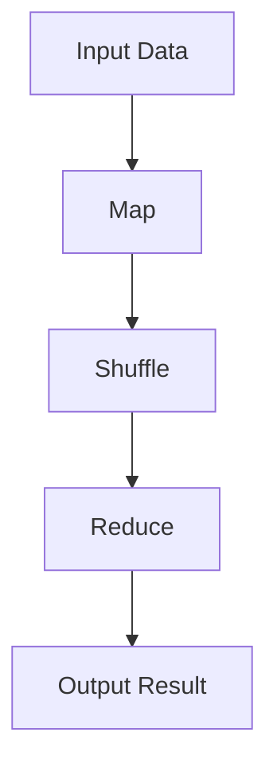
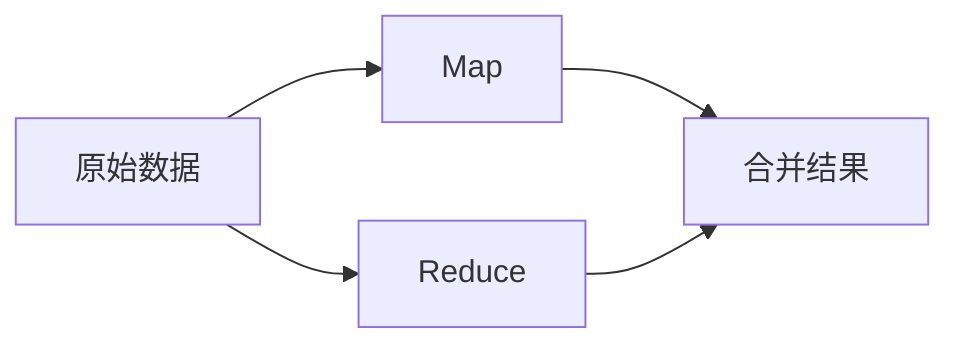

                 

# MapReduce 原理与代码实例讲解

> 关键词：MapReduce, 分布式计算, 数据并行处理, 代码实例, Hadoop, 大数据

## 1. 背景介绍

### 1.1 问题由来
随着数据量的爆炸式增长，如何高效处理大规模数据成为众多企业和研究机构亟待解决的问题。MapReduce 作为一种高效的分布式计算框架，已经在 Google、Facebook、Amazon 等公司得到广泛应用，是处理大规模数据的核心工具之一。MapReduce 框架的设计理念简单高效，适用于多种计算任务，从而推动了大数据技术的发展。

### 1.2 问题核心关键点
MapReduce 框架的核心思想是将大规模数据分布式地存储和处理，通过分治策略，将复杂的计算任务分解成多个简单的子任务，并行地在多台机器上进行处理，最终将结果汇总。MapReduce 的核心组件包括：
- Map：将输入数据转化为中间数据，可以看作是"映射"操作。
- Reduce：将中间数据汇总为最终结果，可以看作是"归约"操作。

## 2. 核心概念与联系

### 2.1 核心概念概述

为了更好地理解 MapReduce 框架的原理和应用，本节将介绍几个关键概念：

- **MapReduce**：一种分布式计算模型，通过 Map 和 Reduce 操作对大规模数据进行分布式并行处理。
- **数据流**：数据在计算过程中的传输路径，分为 Input、Map 阶段、Shuffle 阶段、Reduce 阶段和 Output 阶段。
- **分治**：将问题分解为多个子问题，分别处理后再合并结果。MapReduce 是分治策略的典型应用。
- **并行计算**：在多台计算机上同时执行相同或不同的计算任务，提高计算效率。

这些概念之间的联系可以通过以下 Mermaid 流程图来展示：



这个流程图展示了大规模数据在 MapReduce 中的处理流程：首先通过 Map 操作将输入数据转化为中间数据，然后通过 Shuffle 操作将中间数据进行聚合，最终通过 Reduce 操作将结果汇总，得到最终输出。

### 2.2 概念间的关系

这些核心概念之间的联系十分紧密，形成了 MapReduce 框架的完整处理流程。下面通过几个 Mermaid 流程图来展示这些概念之间的关系：

#### 2.2.1 MapReduce 的处理流程


这个流程图展示了 MapReduce 的基本处理流程，即输入数据通过 Map 操作转化为中间数据，中间数据通过 Shuffle 操作进行聚合，聚合后的数据通过 Reduce 操作得到最终结果。

#### 2.2.2 MapReduce 的分治策略



这个流程图展示了 MapReduce 的分治策略，即将大规模数据分解成多个子问题，分别通过 Map 和 Reduce 操作处理，最后将结果合并得到最终结果。

## 3. 核心算法原理 & 具体操作步骤
### 3.1 算法原理概述

MapReduce 的核心算法原理包括 Map 和 Reduce 两个阶段，具体步骤如下：

1. **输入数据划分**：将大规模输入数据按块划分，分布在不同的计算节点上。
2. **Map 操作**：在每个计算节点上，对块数据执行 Map 操作，将输入数据转化为中间数据。
3. **Shuffle 操作**：将所有计算节点上生成的中间数据按照键进行排序和聚合，形成一个有序的键值对集合。
4. **Reduce 操作**：在每个计算节点上，对 Shuffle 后的中间数据执行 Reduce 操作，将键值对集合转化为最终结果。
5. **结果汇总**：将所有计算节点上的最终结果进行合并，得到全局结果。

### 3.2 算法步骤详解

下面以一个简单的例子来说明 MapReduce 的具体操作步骤：

#### 3.2.1 输入数据划分
假设有一个包含整数对的文件，文件内容如下：
```
(1, 5)
(1, 2)
(2, 3)
(2, 5)
(3, 1)
(3, 3)
(4, 2)
(5, 2)
```
首先，将这个文件按块划分，每个块包含两个整数对。假设每个块的大小为 4，那么文件被划分成两个块：
```
Block 1: (1, 5), (2, 3), (2, 5), (3, 3)
Block 2: (3, 1), (4, 2), (5, 2)
```

#### 3.2.2 Map 操作
在每个计算节点上，对每个块执行 Map 操作，将每个整数对的键值对作为 Map 的输入。例如，在 Block 1 上的 Map 操作如下：
```
(1, 5) -> (1, 5)
(2, 3) -> (2, 3)
(2, 5) -> (2, 5)
(3, 3) -> (3, 3)
```

#### 3.2.3 Shuffle 操作
将所有 Map 操作生成的键值对按照键进行排序和聚合。例如，在 Block 1 上，键 1 对应值为 5，键 2 对应值为 3，键 3 对应值为 3。将所有计算节点上生成的键值对进行排序，得到如下有序的键值对集合：
```
(1, 5), (2, 3), (2, 5), (3, 3)
```
同样的，在 Block 2 上执行 Shuffle 操作后得到：
```
(3, 1), (4, 2), (5, 2)
```

#### 3.2.4 Reduce 操作
在每个计算节点上，对 Shuffle 后的中间数据执行 Reduce 操作，将键值对集合转化为最终结果。例如，对于 Block 1 上的键 1 和 3，Reduce 操作如下：
```
(1, 5), (2, 3), (2, 5), (3, 3) -> (1, 8), (2, 8), (3, 6)
```
最终结果为：
```
(1, 8), (2, 8), (3, 6), (4, 2), (5, 2)
```

### 3.3 算法优缺点

#### 3.3.1 优点
1. **可扩展性**：MapReduce 可以处理大规模数据集，支持上千个节点规模的分布式计算。
2. **容错性**：自动处理节点故障，保证计算的可靠性。
3. **并行计算**：将复杂任务分解成多个简单子任务，提高计算效率。
4. **编程简单**：提供了高层次的抽象，简化了编程复杂度。

#### 3.3.2 缺点
1. **延迟较高**：由于数据需要在节点间传输，导致整体延迟较高。
2. **难以优化**：MapReduce 是一种通用框架，难以针对特定任务进行优化。
3. **资源浪费**：在数据量较少时，MapReduce 的开销大于直接计算。

### 3.4 算法应用领域

MapReduce 在数据处理领域得到了广泛应用，特别是在大数据处理和分析方面。以下是 MapReduce 的典型应用场景：

- **大数据分析**：如 Google Analytics、Facebook 的大数据分析平台，用于处理用户行为数据，生成报表和分析结果。
- **日志处理**：如 Hadoop，用于处理大型日志文件，进行数据挖掘和分析。
- **图像处理**：如 ImageNet，用于大规模图像分类和识别任务。
- **科学计算**：如 Bioinformatics，用于处理生物信息数据，进行基因分析等。
- **金融数据处理**：如 Alpaca 交易平台，用于处理交易数据，生成市场分析报告。

## 4. 数学模型和公式 & 详细讲解 & 举例说明

### 4.1 数学模型构建

在 MapReduce 框架中，数据的处理过程可以看作是以下几个阶段的数学模型：

1. **输入数据**：原始输入数据为 $D$，可以表示为 $D=\{x_1, x_2, ..., x_n\}$。
2. **Map 操作**：将输入数据 $D$ 通过 Map 函数转化为中间数据 $M$，可以表示为 $M=\{(m_1, v_1), (m_2, v_2), ..., (m_n, v_n)\}$。
3. **Shuffle 操作**：将中间数据 $M$ 按照键排序，可以得到有序的键值对集合 $K$，可以表示为 $K=\{(k_1, (k_1, v_{1,1}), (k_1, v_{1,2}), ..., (k_1, v_{1,m_1}), ..., (k_n, (k_n, v_{n,1}), (k_n, v_{n,2}), ..., (k_n, v_{n,m_n})\}$。
4. **Reduce 操作**：对有序的键值对集合 $K$ 执行 Reduce 操作，得到最终结果 $R$，可以表示为 $R=\{(r_1, r_1), (r_2, r_2), ..., (r_n, r_n)\}$。

### 4.2 公式推导过程

#### 4.2.1 Map 操作的数学模型

Map 操作将输入数据 $D$ 转化为中间数据 $M$，可以表示为：
$$
M = \{(m_1, v_1), (m_2, v_2), ..., (m_n, v_n)\} = \{(\text{map}(x_1), v_1), (\text{map}(x_2), v_2), ..., (\text{map}(x_n), v_n)\}
$$
其中 $\text{map}$ 为 Map 函数，$v_i$ 为映射后的值。

#### 4.2.2 Shuffle 操作的数学模型

Shuffle 操作将中间数据 $M$ 按照键排序，可以得到有序的键值对集合 $K$，可以表示为：
$$
K = \{(k_1, (k_1, v_{1,1}), (k_1, v_{1,2}), ..., (k_1, v_{1,m_1}), ..., (k_n, (k_n, v_{n,1}), (k_n, v_{n,2}), ..., (k_n, v_{n,m_n})\}
$$
其中 $k_i$ 为键，$(k_i, v_{i,j})$ 为对应的值。

#### 4.2.3 Reduce 操作的数学模型

Reduce 操作对有序的键值对集合 $K$ 执行归约操作，得到最终结果 $R$，可以表示为：
$$
R = \{(r_1, r_1), (r_2, r_2), ..., (r_n, r_n)\} = \{(\text{reduce}(k_1, \{v_{1,1}, v_{1,2}, ..., v_{1,m_1}\}), \text{reduce}(k_2, \{v_{2,1}, v_{2,2}, ..., v_{2,m_2}\}), ..., \text{reduce}(k_n, \{v_{n,1}, v_{n,2}, ..., v_{n,m_n}\})\}
$$
其中 $\text{reduce}$ 为 Reduce 函数，$r_i$ 为归约后的值。

### 4.3 案例分析与讲解

#### 4.3.1 简单示例
假设有一个包含整数对的文件，文件内容如下：
```
(1, 5)
(1, 2)
(2, 3)
(2, 5)
(3, 1)
(3, 3)
(4, 2)
(5, 2)
```
首先，将这个文件按块划分，每个块包含两个整数对。假设每个块的大小为 4，那么文件被划分成两个块：
```
Block 1: (1, 5), (2, 3), (2, 5), (3, 3)
Block 2: (3, 1), (4, 2), (5, 2)
```

在每个计算节点上，对每个块执行 Map 操作，将每个整数对的键值对作为 Map 的输入。例如，在 Block 1 上的 Map 操作如下：
```
(1, 5) -> (1, 5)
(2, 3) -> (2, 3)
(2, 5) -> (2, 5)
(3, 3) -> (3, 3)
```

将所有计算节点上生成的键值对按照键进行排序和聚合，得到一个有序的键值对集合。例如，在 Block 1 上，键 1 对应值为 5，键 2 对应值为 3，键 3 对应值为 3。将所有计算节点上生成的键值对进行排序，得到如下有序的键值对集合：
```
(1, 5), (2, 3), (2, 5), (3, 3)
```
同样的，在 Block 2 上执行 Shuffle 操作后得到：
```
(3, 1), (4, 2), (5, 2)
```

在每个计算节点上，对 Shuffle 后的中间数据执行 Reduce 操作，将键值对集合转化为最终结果。例如，对于 Block 1 上的键 1 和 3，Reduce 操作如下：
```
(1, 5), (2, 3), (2, 5), (3, 3) -> (1, 8), (2, 8), (3, 6)
```
最终结果为：
```
(1, 8), (2, 8), (3, 6), (4, 2), (5, 2)
```

## 5. 项目实践：代码实例和详细解释说明

### 5.1 开发环境搭建

在进行 MapReduce 实践前，我们需要准备好开发环境。以下是使用 Python 和 Hadoop 进行 MapReduce 开发的环境配置流程：

1. 安装 Hadoop：从官网下载并安装 Hadoop，包括 HDFS 和 MapReduce。
2. 安装 PyTorch：从官网下载并安装 PyTorch，并设置环境变量。
3. 编写 Map 和 Reduce 函数：根据需求编写 Map 和 Reduce 函数，定义输入数据和输出数据。
4. 编写 Driver 程序：编写 Driver 程序，定义 MapReduce 作业并调用 Map 和 Reduce 函数。

完成上述步骤后，即可在 Hadoop 集群上运行 MapReduce 作业。

### 5.2 源代码详细实现

下面以一个简单的 MapReduce 作业为例，计算输入文件中每个数字的出现次数。

```python
from mrjob.job import MRJob
from mrjob.step import MRStep

class WordCount(MRJob):

    def mapper(self, _, line):
        words = line.split()
        for word in words:
            yield word, 1

    def reducer(self, word, counts):
        yield word, sum(counts)

if __name__ == '__main__':
    WordCount.run()
```

在这个示例中，使用了 MRJob 库来简化 MapReduce 作业的编写。首先定义一个 WordCount 类，继承自 MRJob 类。在 mapper 函数中，将输入数据按空格拆分为单词，并生成键值对 (word, 1)。在 reducer 函数中，对每个单词出现的次数进行求和，并生成最终结果 (word, sum(counts))。最后，通过 WordCount.run() 方法启动作业。

### 5.3 代码解读与分析

#### 5.3.1 Mapper 函数
Mapper 函数的主要职责是将输入数据转化为中间数据，即生成键值对 (key, value)。在这个示例中，Mapper 函数将输入数据按空格拆分为单词，并生成键值对 (word, 1)。例如，输入数据为 "Hello World"，Mapper 函数将生成两个键值对 ("Hello", 1) 和 ("World", 1)。

#### 5.3.2 Reducer 函数
Reducer 函数的主要职责是对中间数据进行归约操作，即生成最终结果。在这个示例中，Reducer 函数对每个单词出现的次数进行求和，并生成最终结果 (word, sum(counts))。例如，对于输入数据 "Hello World"，Mapper 函数生成两个键值对 ("Hello", 1) 和 ("World", 1)，Reducer 函数将这两个值求和，生成结果 ("Hello", 2) 和 ("World", 1)。

#### 5.3.3 Driver 程序
Driver 程序负责启动 MapReduce 作业，并将输入数据传递给 Mapper 和 Reducer 函数。在这个示例中，Driver 程序通过 WordCount.run() 方法启动作业，并将输入数据传递给 Mapper 和 Reducer 函数。

### 5.4 运行结果展示

假设输入数据为 "Hello World Hello"，在 Hadoop 集群上运行 MapReduce 作业，得到的结果如下：
```
Hello 2
World 1
```

可以看到，MapReduce 作业正确计算了每个单词出现的次数，并生成了最终结果。

## 6. 实际应用场景

### 6.1 数据处理与分析

MapReduce 框架在大规模数据处理和分析方面得到了广泛应用，特别是在数据仓库和在线广告推荐系统中。例如，Google Analytics 使用 MapReduce 处理大规模用户行为数据，生成详细报表和分析结果。Facebook 的 Graph API 使用 MapReduce 处理用户数据，生成个性化推荐和广告投放策略。

### 6.2 日志处理

MapReduce 框架在日志处理领域也得到了广泛应用。例如，Apache Hadoop 使用 MapReduce 处理大规模日志文件，进行数据挖掘和分析。日志分析可以用于监控系统性能、故障排查和安全事件检测等。

### 6.3 图像处理

MapReduce 框架在图像处理领域也得到了广泛应用。例如，ImageNet 使用 MapReduce 进行大规模图像分类和识别任务。MapReduce 可以将图像数据分解成多个子任务，并行地在多台机器上进行处理，提高图像处理的效率和准确性。

### 6.4 金融数据处理

MapReduce 框架在金融数据处理领域也得到了广泛应用。例如，Alpaca 交易平台使用 MapReduce 处理交易数据，生成市场分析报告。MapReduce 可以处理海量交易数据，进行实时分析和处理，生成精准的市场预测和交易策略。

### 6.5 科学计算

MapReduce 框架在科学计算领域也得到了广泛应用。例如，Bioinformatics 使用 MapReduce 处理生物信息数据，进行基因分析和疾病预测。MapReduce 可以将生物数据分解成多个子任务，并行地在多台机器上进行处理，提高数据处理的效率和准确性。

## 7. 工具和资源推荐

### 7.1 学习资源推荐

为了帮助开发者系统掌握 MapReduce 框架的理论基础和实践技巧，这里推荐一些优质的学习资源：

1. 《MapReduce 设计与实现》：深度介绍 MapReduce 框架的原理和实现细节，适合深入理解 MapReduce 框架。
2. 《大数据处理框架 MapReduce》：详细讲解 MapReduce 框架的编程技巧和应用场景，适合实战练习。
3. 《Hadoop 实战》：通过实际案例讲解 Hadoop 框架的使用和调优，适合初学者和中级开发者。
4. 《分布式计算与 MapReduce》：系统介绍分布式计算原理和 MapReduce 框架，适合对分布式计算有深入理解的需求。
5. 《大数据技术权威指南》：全面介绍大数据处理和分析技术，包括 MapReduce 框架，适合大数据技术初学者。

通过对这些资源的学习实践，相信你一定能够快速掌握 MapReduce 框架的精髓，并用于解决实际的分布式计算问题。

### 7.2 开发工具推荐

高效的开发离不开优秀的工具支持。以下是几款用于 MapReduce 开发和调优的常用工具：

1. Hadoop：开源的大数据处理框架，支持 MapReduce 作业的编写和执行。
2. PyTorch：深度学习框架，支持分布式计算和并行训练。
3. MRJob：简化 MapReduce 作业编写的 Python 库，支持大数据处理和分析。
4. Apache Spark：开源的大数据处理框架，支持流式计算和机器学习。
5. Hive：基于 Hadoop 的 SQL 查询引擎，支持大规模数据处理和分析。

合理利用这些工具，可以显著提升 MapReduce 作业的开发效率，加快创新迭代的步伐。

### 7.3 相关论文推荐

MapReduce 框架的研究始于 2000 年代初，吸引了众多学者的关注和研究。以下是几篇奠基性的相关论文，推荐阅读：

1. MapReduce: Simplified Data Processing on Large Clusters：G. DeDiesel 等人于 2008 年发表的 MapReduce 框架设计论文，详细介绍了 MapReduce 框架的原理和实现细节。
2. Google's MapReduce: Simplified Data Processing on Large Clusters：J. Dean 等人于 2008 年发表的 MapReduce 框架设计论文，介绍了 Google 的 MapReduce 实现细节和应用场景。
3. A Brief Introduction to MapReduce：J. Warren 等人于 2010 年发表的 MapReduce 框架介绍论文，适合初学者理解 MapReduce 框架的基本概念和应用场景。
4. PIG: A Platform for Distributed Data Analysis：H. Chang 等人于 2006 年发表的 PIG 平台论文，介绍了一种基于 MapReduce 的数据分析框架，适合对大数据分析有深入理解的需求。
5. Hadoop 2: Under the Hood：H. Chang 等人于 2012 年发表的 Hadoop 2 架构论文，介绍了 Hadoop 2 的架构设计和技术细节，适合深入理解 Hadoop 框架。

这些论文代表了大数据处理框架的研究脉络，通过学习这些前沿成果，可以帮助研究者把握学科前进方向，激发更多的创新灵感。

除上述资源外，还有一些值得关注的前沿资源，帮助开发者紧跟 MapReduce 框架的发展趋势，例如：

1. arXiv 论文预印本：人工智能领域最新研究成果的发布平台，包括大量尚未发表的前沿工作，学习前沿技术的必读资源。
2. 业界技术博客：如 Google Cloud、Facebook Data、Amazon Web Services 等顶尖公司的官方博客，第一时间分享他们的最新研究成果和洞见。
3. 技术会议直播：如 NIPS、ICML、KDD、SIGMOD 等人工智能和数据库领域的顶级会议现场或在线直播，能够聆听到大佬们的前沿分享，开拓视野。
4. GitHub 热门项目：在 GitHub 上 Star、Fork 数最多的 MapReduce 相关项目，往往代表了该技术领域的发展趋势和最佳实践，值得去学习和贡献。
5. 行业分析报告：各大咨询公司如 McKinsey、PwC 等针对大数据处理框架的分析报告，有助于从商业视角审视技术趋势，把握应用价值。

总之，对于 MapReduce 框架的学习和实践，需要开发者保持开放的心态和持续学习的意愿。多关注前沿资讯，多动手实践，多思考总结，必将收获满满的成长收益。

## 8. 总结：未来发展趋势与挑战

### 8.1 总结

本文对 MapReduce 框架的原理和实践进行了全面系统的介绍。首先阐述了 MapReduce 框架的设计理念和处理流程，明确了 MapReduce 在大规模数据处理中的独特价值。其次，从原理到实践，详细讲解了 MapReduce 的数学模型和具体实现步骤，给出了 MapReduce 作业的完整代码实例。同时，本文还广泛探讨了 MapReduce 框架在数据处理和分析、日志处理、图像处理、金融数据处理、科学计算等领域的典型应用，展示了 MapReduce 的强大应用能力。最后，本文精选了 MapReduce 框架的学习资源、开发工具和相关论文，力求为读者提供全方位的技术指引。

通过本文的系统梳理，可以看到，MapReduce 框架在分布式计算领域发挥了重要作用，推动了大数据技术的发展。未来，随着数据的不断增长和技术手段的不断进步，MapReduce 框架的灵活性和可扩展性将继续得到发挥，成为大数据处理和分析的重要工具。

### 8.2 未来发展趋势

展望未来，MapReduce 框架将呈现以下几个发展趋势：

1. **多模态数据处理**：MapReduce 框架可以处理多种数据类型，包括文本、图像、视频、音频等。未来，MapReduce 将支持更多模态数据的处理，提升数据融合和分析的效率。
2. **流式计算**：MapReduce 框架可以处理批处理数据，但流式数据处理需求逐渐增加。未来，MapReduce 将支持流式计算，支持实时数据处理和分析。
3. **机器学习融合**：MapReduce 框架可以与机器学习技术结合，进行大规模数据挖掘和分析。未来，MapReduce 将与深度学习、强化学习等技术融合，提升数据处理的智能性。
4. **边缘计算**：MapReduce 框架可以处理分布式计算任务，未来将支持边缘计算，提升计算效率和响应速度。
5. **容器化部署**：MapReduce 框架可以部署在云平台和本地集群，未来将支持容器化部署，提升计算资源的利用率和管理效率。
6. **自动化调优**：MapReduce 框架可以自动调优计算资源和任务调度，未来将支持更高效的自动化调优策略，提升计算效率和稳定性。

### 8.3 面临的挑战

尽管 MapReduce 框架在数据处理领域已经取得了显著的成就，但在迈向更加智能化、普

