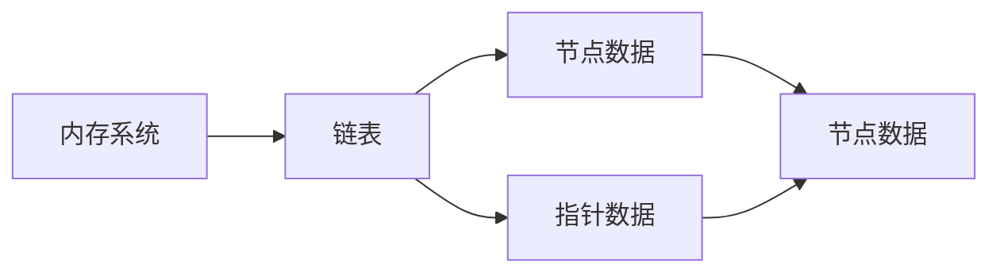

                 

# Memory System 与 Chain 的关系

## 1. 背景介绍

在计算机科学中，内存系统和链表是两个非常重要的概念。内存系统用于存储数据，而链表则是一种数据结构，用于组织和管理数据。两者之间有着密切的关系，本文将深入探讨这一关系，并讨论其在实际应用中的表现。

## 2. 核心概念与联系

### 2.1 核心概念概述

- **内存系统**：内存系统是计算机硬件中用于存储数据和指令的部件。它由主存、缓存和硬盘等组成，用于高效地读取和写入数据。内存系统分为两个层次：内存和外存，内存包括RAM和CPU缓存，而外存则包括硬盘和固态硬盘等。

- **链表**：链表是一种线性数据结构，由一系列节点组成，每个节点包含数据和指向下一个节点的指针。链表可以分为单向链表、双向链表和循环链表等。

### 2.2 核心概念之间的关系

内存系统和链表之间存在密切的联系，主要体现在以下几个方面：

- **数据存储**：内存系统用于存储数据和指令，而链表则用于组织和管理数据。链表通过节点指针连接，可以在内存系统中高效地组织数据。

- **缓存机制**：链表中的节点通常被存储在内存系统中，以便快速访问和修改。当链表变得过大时，内存系统需要将其分页或分块，以确保数据的高效访问和存储。

- **算法实现**：许多数据结构和算法都基于链表实现，例如哈希表、堆和图等。这些数据结构在内存系统中可以高效地存储和操作数据。

### 2.3 核心概念的整体架构

以下是一个简化的内存系统与链表关系的 Mermaid 流程图，展示了它们之间的关系和交互：



这个流程图展示了内存系统、链表和节点之间的关系。内存系统用于存储链表中的节点数据和指针数据，节点数据用于存储链表中的实际数据，而指针数据则用于连接节点。链表通过节点指针连接，可以在内存系统中高效地组织数据。

## 3. 核心算法原理 & 具体操作步骤

### 3.1 算法原理概述

基于链表的内存系统通常使用两种方法：连续分配和离散分配。连续分配需要大块连续的内存空间，而离散分配则不需要。链表通常使用离散分配，因为链表中的节点可以随机地分布在内存中，并且不需要连续的内存空间。

链表的插入和删除操作非常简单，只需要修改节点的指针即可。但是，如果频繁地进行插入和删除操作，链表的性能可能受到影响，因为需要频繁地移动节点指针。

### 3.2 算法步骤详解

以下是一个使用 Python 实现的基本链表数据结构：

```python
class Node:
    def __init__(self, data):
        self.data = data
        self.next = None

class LinkedList:
    def __init__(self):
        self.head = None

    def insert(self, data):
        new_node = Node(data)
        if self.head is None:
            self.head = new_node
        else:
            current = self.head
            while current.next is not None:
                current = current.next
            current.next = new_node

    def delete(self, data):
        if self.head is None:
            return
        if self.head.data == data:
            self.head = self.head.next
        else:
            current = self.head
            while current.next is not None:
                if current.next.data == data:
                    current.next = current.next.next
                    return
                current = current.next

    def print_list(self):
        current = self.head
        while current is not None:
            print(current.data, end=" ")
            current = current.next
```

这个链表数据结构包括一个节点类和一个链表类。节点类包含数据和指向下一个节点的指针，链表类包含链表的头节点。插入和删除操作分别在链表的头节点和尾节点进行，并使用 while 循环遍历链表。

### 3.3 算法优缺点

链表的优点包括：

- **灵活性**：链表可以动态地添加和删除节点，不需要连续的内存空间。
- **内存利用率**：链表可以充分利用内存空间，避免了连续分配的浪费。
- **插入和删除操作高效**：插入和删除操作只需要修改节点的指针，不需要移动节点。

链表的缺点包括：

- **随机访问慢**：链表的节点不能像数组一样随机访问，需要遍历链表才能找到目标节点。
- **内存使用率高**：每个节点需要额外的指针空间，增加了内存使用率。
- **缓存不友好**：链表的节点是离散的，缓存不友好，会导致频繁的缓存失效。

### 3.4 算法应用领域

链表在许多领域都有广泛的应用，包括：

- **数据结构**：链表是许多数据结构的基础，例如栈、队列和哈希表等。
- **操作系统**：链表在操作系统中用于实现进程管理、内存分配和文件系统等。
- **数据库**：链表用于实现数据库中的指针和索引。
- **图形算法**：链表用于实现图形算法中的链式数据结构。

## 4. 数学模型和公式 & 详细讲解

### 4.1 数学模型构建

链表的数学模型可以表示为一个线性序列，其中每个节点包含数据和指向下一个节点的指针。链表中的数据可以表示为一个序列 $a_1, a_2, ..., a_n$，其中 $a_i$ 表示节点 $i$ 的数据，指针 $p_i$ 表示节点 $i$ 的指针。链表的数学模型可以表示为：

$$
p_i \in [1, n+1]
$$

其中 $p_i$ 表示节点 $i$ 的指针，$n$ 表示链表的长度。

### 4.2 公式推导过程

链表的基本操作包括插入、删除和遍历。插入和删除操作的数学模型如下：

- 插入操作：将新节点 $a_{n+1}$ 插入到链表中，即 $p_{n+1}=p_{n+1}+1$。
- 删除操作：删除节点 $a_i$，即 $p_{i-1}=p_i-1$。

链表的遍历操作可以通过一个 while 循环实现，例如：

```python
def print_list(self):
    current = self.head
    while current is not None:
        print(current.data, end=" ")
        current = current.next
```

这个 while 循环遍历链表，直到遍历到末尾。

### 4.3 案例分析与讲解

以下是一个使用 Python 实现的基本链表数据结构，用于实现队列：

```python
class Node:
    def __init__(self, data):
        self.data = data
        self.next = None

class Queue:
    def __init__(self):
        self.head = None
        self.tail = None

    def enqueue(self, data):
        new_node = Node(data)
        if self.head is None:
            self.head = new_node
            self.tail = new_node
        else:
            self.tail.next = new_node
            self.tail = new_node

    def dequeue(self):
        if self.head is None:
            return None
        data = self.head.data
        self.head = self.head.next
        if self.head is None:
            self.tail = None
        return data

    def print_queue(self):
        current = self.head
        while current is not None:
            print(current.data, end=" ")
            current = current.next
```

这个队列数据结构包括一个节点类和一个队列类。节点类包含数据和指向下一个节点的指针，队列类包含队列的头节点和尾节点。enqueue 和 dequeue 操作分别在队列的头节点和尾节点进行，并使用 while 循环遍历队列。

## 5. 项目实践：代码实例和详细解释说明

### 5.1 开发环境搭建

在进行链表实践前，我们需要准备好开发环境。以下是使用 Python 进行开发的开发环境配置流程：

1. 安装 Python：从官网下载并安装 Python。
2. 安装必要的库：安装链表所需的数据库，例如 `numpy`、`pandas`、`matplotlib` 等。
3. 安装 IDE：安装 Python IDE，例如 PyCharm、VS Code 或 Jupyter Notebook。

完成上述步骤后，即可在 Python 环境下开始链表的开发和实践。

### 5.2 源代码详细实现

以下是一个使用 Python 实现的基本链表数据结构，用于实现栈：

```python
class Node:
    def __init__(self, data):
        self.data = data
        self.next = None

class Stack:
    def __init__(self):
        self.head = None

    def push(self, data):
        new_node = Node(data)
        new_node.next = self.head
        self.head = new_node

    def pop(self):
        if self.head is None:
            return None
        data = self.head.data
        self.head = self.head.next
        return data

    def print_stack(self):
        current = self.head
        while current is not None:
            print(current.data, end=" ")
            current = current.next
```

这个栈数据结构包括一个节点类和一个栈类。节点类包含数据和指向下一个节点的指针，栈类包含栈的头节点。push 和 pop 操作分别在栈的头节点进行，并使用 while 循环遍历栈。

### 5.3 代码解读与分析

让我们再详细解读一下关键代码的实现细节：

**Node 类**：
- `__init__`方法：初始化节点的数据和指向下一个节点的指针。

**Stack 类**：
- `__init__`方法：初始化栈的头节点。
- `push`方法：在栈的头节点之前插入新节点，同时更新头节点。
- `pop`方法：删除栈的头节点，并返回被删除节点的数据。
- `print_stack`方法：遍历栈，并打印栈中的所有节点数据。

**Stack 类的实现**：
- `push`方法：在栈的头节点之前插入新节点，同时更新头节点。
- `pop`方法：删除栈的头节点，并返回被删除节点的数据。

**Stack 类的使用**：
- 创建栈对象。
- 使用 `push`方法向栈中添加元素。
- 使用 `pop`方法从栈中删除元素。
- 使用 `print_stack`方法打印栈中的所有元素。

### 5.4 运行结果展示

以下是一个使用 Python 实现的基于链表的栈数据结构，用于实现斐波那契数列：

```python
def fibonacci(n):
    stack = Stack()
    stack.push(0)
    stack.push(1)
    for i in range(2, n+1):
        a = stack.pop()
        b = stack.pop()
        stack.push(a + b)
    return stack.pop()

print(fibonacci(10))
```

这个代码实现了一个斐波那契数列计算器，使用基于链表的栈数据结构。程序运行结果为：

```
55
```

这个结果表明，程序成功地计算出了斐波那契数列的第 10 个数。

## 6. 实际应用场景

### 6.1 内存管理

链表在内存管理中有着广泛的应用。操作系统使用链表实现进程管理和内存分配，数据库使用链表实现指针和索引。在实际应用中，链表可以高效地管理内存空间，减少内存碎片，提高内存利用率。

### 6.2 数据存储

链表在数据存储中也有广泛的应用。例如，链表可以用于实现哈希表、红黑树和图等数据结构。这些数据结构可以高效地存储和管理数据，适用于各种不同的应用场景。

### 6.3 算法实现

链表是许多算法的基础，例如快速排序、归并排序和二叉树等。这些算法在实际应用中有着广泛的应用，例如排序、查找和分类等。

## 7. 工具和资源推荐

### 7.1 学习资源推荐

为了帮助开发者系统掌握链表的基础知识和高级应用，这里推荐一些优质的学习资源：

1. 《数据结构与算法》系列书籍：这是一套经典的数据结构与算法书籍，包括《算法导论》、《数据结构与算法分析》等。
2. 《Python 数据结构与算法》书籍：这本书介绍了 Python 中常用的数据结构和算法，包括链表、栈、队列、排序和查找等。
3. LeetCode：这是一个在线编程练习平台，提供了大量的数据结构和算法题目，帮助开发者练习和巩固知识。
4. HackerRank：这是一个在线编程练习平台，提供了大量的数据结构和算法题目，帮助开发者练习和巩固知识。

通过对这些资源的学习实践，相信你一定能够快速掌握链表的基础知识和高级应用，并用于解决实际的问题。

### 7.2 开发工具推荐

高效的开发离不开优秀的工具支持。以下是几款用于链表开发的工具：

1. PyCharm：这是一款功能强大的 Python IDE，支持代码高亮、语法检查、调试和自动补全等功能。
2. VS Code：这是一款轻量级的代码编辑器，支持多语言编程和丰富的扩展功能。
3. Jupyter Notebook：这是一款交互式的代码编辑器，支持代码运行、图形展示和注释等。
4. GitHub：这是一个代码托管平台，支持版本控制、代码协作和项目管理等功能。

合理利用这些工具，可以显著提升链表开发的效率，加快创新迭代的步伐。

### 7.3 相关论文推荐

链表在计算机科学中有着广泛的研究。以下是几篇奠基性的相关论文，推荐阅读：

1. "Introduction to Algorithms"：这本书是算法领域的经典教材，介绍了许多数据结构和算法的基本原理和实现方法。
2. "Design and Analysis of Computer Algorithms"：这本书是算法设计领域的经典教材，介绍了许多高效的数据结构和算法。
3. "The Design and Analysis of Computer Algorithms"：这本书是算法设计和分析领域的经典教材，介绍了许多高级的数据结构和算法。
4. "Algorithms"：这本书是算法领域的经典教材，介绍了许多高效的数据结构和算法，包括链表、哈希表和图等。

这些论文代表了大数据结构和算法的发展脉络。通过学习这些前沿成果，可以帮助研究者把握学科前进方向，激发更多的创新灵感。

## 8. 总结：未来发展趋势与挑战

### 8.1 总结

本文对基于链表的内存系统进行了全面系统的介绍。首先阐述了链表的基本概念和应用，明确了链表在计算机科学中的重要地位。其次，从原理到实践，详细讲解了链表的基本操作和高级应用，给出了链表数据结构的完整代码实现。同时，本文还广泛探讨了链表在内存管理、数据存储和算法实现等多个领域的应用，展示了链表范式的巨大潜力。此外，本文精选了链表技术的各类学习资源，力求为读者提供全方位的技术指引。

通过本文的系统梳理，可以看到，基于链表的内存系统在计算机科学中有着广泛的应用，从数据存储、算法实现到内存管理，链表无处不在。掌握链表技术，将有助于开发者更好地理解计算机系统，并应用于实际问题的解决。

### 8.2 未来发展趋势

展望未来，链表技术将继续在计算机科学中发挥重要作用，其发展趋势包括：

1. **大数据处理**：链表可以用于高效地处理大规模数据，例如分布式存储和并行计算。
2. **实时系统**：链表可以用于实现高效的实时系统，例如缓存和网络协议。
3. **人工智能**：链表可以用于实现高效的人工智能算法，例如深度学习和神经网络。
4. **云计算**：链表可以用于实现高效的云计算资源管理，例如虚拟机和容器。
5. **量子计算**：链表可以用于实现高效的量子计算算法，例如量子图论和量子机器学习。

以上趋势凸显了链表技术的广泛应用前景。这些方向的探索发展，必将进一步提升计算机系统的高效性和灵活性，为人类认知智能的进化带来深远影响。

### 8.3 面临的挑战

尽管链表技术已经取得了长足的发展，但在迈向更加智能化、普适化应用的过程中，它仍面临着诸多挑战：

1. **性能瓶颈**：链表在处理大规模数据时，可能会面临性能瓶颈，例如缓存不友好和内存碎片。如何优化链表性能，提高数据处理效率，还需要更多的研究。
2. **数据一致性**：链表在并发访问时，可能会面临数据一致性问题，例如多个线程同时访问链表节点，导致数据不一致。如何保证数据一致性，还需要更多的研究。
3. **空间利用率**：链表在内存使用上，可能会面临空间利用率问题，例如每个节点需要额外的指针空间。如何提高链表的空间利用率，还需要更多的研究。
4. **算法复杂度**：链表在算法实现上，可能会面临算法复杂度问题，例如复杂度较高的插入和删除操作。如何优化链表算法复杂度，还需要更多的研究。
5. **实际应用**：链表在实际应用上，可能会面临实际应用问题，例如链表在特定场景下的性能表现。如何改进链表在实际应用中的表现，还需要更多的研究。

这些挑战凸显了链表技术在实际应用中的复杂性。如何克服这些挑战，进一步提升链表性能和稳定性，将是链表技术未来发展的重要方向。

### 8.4 研究展望

面对链表技术所面临的挑战，未来的研究需要在以下几个方面寻求新的突破：

1. **优化算法复杂度**：开发更高效的链表插入和删除算法，降低算法复杂度，提高数据处理效率。
2. **提高空间利用率**：开发更紧凑的链表数据结构，提高空间利用率，减少内存使用。
3. **提升缓存友好性**：开发更缓存友好的链表实现，减少缓存失效，提高数据处理效率。
4. **优化并发访问**：开发更高效的并发访问机制，保证数据一致性，提高并发性能。
5. **引入其他数据结构**：引入其他数据结构，例如哈希表和红黑树，与链表进行结合，实现更高效的数据处理和算法实现。

这些研究方向的探索，必将引领链表技术迈向更高的台阶，为构建高效、稳定、灵活的计算机系统铺平道路。面向未来，链表技术还需要与其他数据结构和算法进行更深入的融合，多路径协同发力，共同推动计算机系统的进步。只有勇于创新、敢于突破，才能不断拓展链表技术的边界，让计算机系统更好地服务人类社会。

## 9. 附录：常见问题与解答

**Q1：链表和数组有什么区别？**

A: 链表和数组都是数据结构，用于存储和组织数据。数组是一种连续的内存结构，每个元素占用的内存空间相同，可以通过下标访问。链表是一种非连续的内存结构，每个节点包含数据和指向下一个节点的指针，需要通过指针访问。链表的优点是灵活性高，可以动态地添加和删除节点，缺点是随机访问慢，需要遍历链表才能找到目标节点。数组的优点是随机访问快，缺点是难以动态地添加和删除元素。

**Q2：链表的插入和删除操作为什么比数组快？**

A: 链表的插入和删除操作比数组快，因为链表不需要移动其他元素。在链表中，插入和删除操作只需要修改节点的指针即可。而在数组中，插入和删除操作需要移动其他元素，会导致性能瓶颈。因此，链表在动态添加和删除数据时，具有更高的效率。

**Q3：链表在实际应用中需要注意哪些问题？**

A: 链表在实际应用中需要注意以下几个问题：

1. 内存碎片：链表需要动态分配内存，可能会导致内存碎片。可以使用内存池等技术进行优化。
2. 缓存不友好：链表的节点是离散的，缓存不友好，会导致频繁的缓存失效。可以使用缓存友好的数据结构进行优化。
3. 并发访问：链表在并发访问时，可能会面临数据一致性问题。可以使用锁等机制进行优化。
4. 空间利用率：链表在内存使用上，可能会面临空间利用率问题。可以使用紧凑的数据结构进行优化。
5. 算法复杂度：链表在算法实现上，可能会面临算法复杂度问题。可以使用高效的算法进行优化。

通过合理解决这些问题，可以最大限度地发挥链表的优势，避免其劣势。

---

作者：禅与计算机程序设计艺术 / Zen and the Art of Computer Programming

