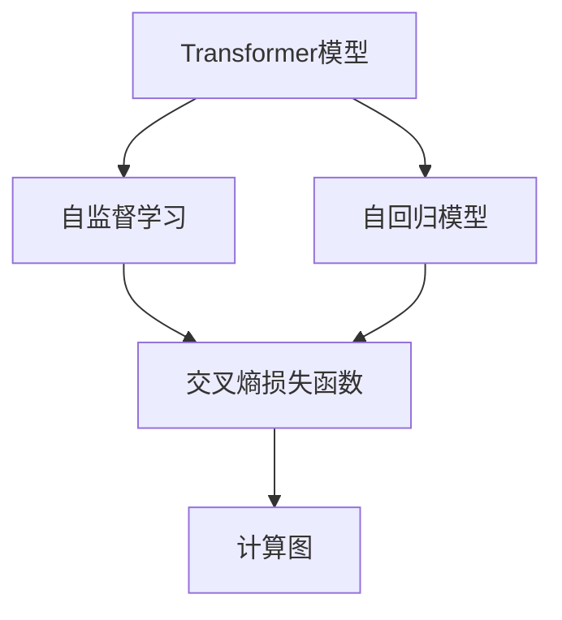
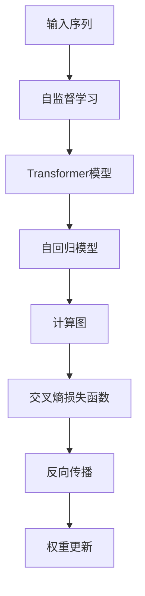

                 

# Transformer大模型实战 最终损失函数

> 关键词：Transformer,大语言模型,自然语言处理,自监督学习,自回归模型,交叉熵损失函数,计算图,PyTorch

## 1. 背景介绍

### 1.1 问题由来
Transformer大模型是近年来自然语言处理（NLP）领域的明星模型，凭借其出色的表现和高效的计算图机制，被广泛应用于各种NLP任务，包括机器翻译、文本分类、问答系统等。然而，如何设计一个合适的损失函数来指导大模型的训练，使其在大规模文本数据上高效学习，并输出高质量的预测结果，是实现大模型实战的关键。

### 1.2 问题核心关键点
损失函数是深度学习模型训练的核心组成部分，其设计直接影响到模型性能的提升。在Transformer大模型的训练中，选择合适的损失函数至关重要。常见的损失函数包括交叉熵损失函数、均方误差损失函数等。这些损失函数在实际应用中，会根据任务类型和数据特性进行选择和设计。

### 1.3 问题研究意义
设计合适的损失函数可以显著提升Transformer大模型的性能，加速模型的训练速度，同时减少过拟合风险。通过深入研究损失函数的设计和优化方法，可以更好地理解Transformer大模型的训练过程，为实际应用中的模型优化和微调提供理论依据和技术支持。

## 2. 核心概念与联系

### 2.1 核心概念概述

为了更好地理解Transformer大模型的最终损失函数，本节将介绍几个密切相关的核心概念：

- **Transformer模型**：一种基于自注意力机制的深度神经网络模型，广泛用于各种NLP任务。其设计思想是通过多头自注意力机制，对输入序列进行编码，生成表示。
- **自监督学习**：一种无监督学习方法，通过大量未标注的数据，学习到语言的通用表示。常见的自监督学习任务包括掩码语言建模、句子相似度学习等。
- **自回归模型**：一种以序列为输入的模型，通过前文的信息生成后文。常用的自回归模型包括GPT、T5等。
- **交叉熵损失函数**：一种常用的分类损失函数，适用于多分类和二分类任务。其形式为：$-\sum_{i=1}^C y_i\log p_i$，其中$y_i$表示真实标签，$p_i$表示模型预测的概率。
- **计算图**：一种用于描述神经网络计算过程的图形表示法，如TensorFlow、PyTorch等框架均有其配套的计算图机制。

这些核心概念之间的逻辑关系可以通过以下Mermaid流程图来展示：



这个流程图展示了大模型在训练过程中的主要流程：通过自监督学习获取无标签数据进行预训练，然后通过自回归模型和计算图对数据进行处理，并使用交叉熵损失函数进行训练和评估。

### 2.2 概念间的关系

这些核心概念之间存在着紧密的联系，形成了Transformer大模型的训练和评估框架。下面我们通过几个Mermaid流程图来展示这些概念之间的关系。

#### 2.2.1 Transformer模型的训练流程


这个流程图展示了Transformer模型的训练过程：输入序列经过编码器、自注意力机制、多头自注意力机制、解码器和输出层，最终使用交叉熵损失函数进行反向传播和权重更新。

#### 2.2.2 自监督学习的训练流程


这个流程图展示了自监督学习的训练过程：通过掩码语言建模和句子相似度学习，使用交叉熵损失函数进行反向传播和权重更新，从而学习到语言的通用表示。

#### 2.2.3 计算图在Transformer大模型中的应用


这个流程图展示了计算图在Transformer大模型中的应用：通过前向传播和反向传播，实现模型的训练和评估。

### 2.3 核心概念的整体架构

最后，我们用一个综合的流程图来展示这些核心概念在大模型训练过程中的整体架构：



这个综合流程图展示了从数据预处理、模型训练、反向传播到权重更新的整个流程。通过这些流程，可以高效地训练出高质量的Transformer大模型，并在实际应用中实现最优的性能。

## 3. 核心算法原理 & 具体操作步骤
### 3.1 算法原理概述

Transformer大模型的最终损失函数，通常由自监督学习任务和自回归模型的交叉熵损失函数组成。其基本原理是通过无标签数据进行预训练，学习到语言的通用表示，然后通过有标签数据进行微调，优化模型在特定任务上的性能。

形式化地，假设输入序列为 $x$，输出序列为 $y$，Transformer大模型的输出为 $\hat{y}$，则交叉熵损失函数可以表示为：

$$
\mathcal{L}(\hat{y}, y) = -\frac{1}{N}\sum_{i=1}^N \sum_{j=1}^M y_{ij}\log \hat{y}_{ij}
$$

其中 $N$ 表示样本数量，$M$ 表示每个样本的长度，$y_{ij}$ 表示真实标签，$\hat{y}_{ij}$ 表示模型预测的概率。

### 3.2 算法步骤详解

基于Transformer大模型的最终损失函数，训练过程主要分为以下几个步骤：

1. **数据预处理**：将输入序列 $x$ 转换为模型的输入格式，如 token ids、attention mask 等。
2. **模型前向传播**：通过Transformer模型进行前向传播，计算输出 $\hat{y}$。
3. **计算损失函数**：根据真实标签 $y$ 和模型预测 $\hat{y}$，计算交叉熵损失函数 $\mathcal{L}(\hat{y}, y)$。
4. **反向传播**：将损失函数 $\mathcal{L}(\hat{y}, y)$ 进行反向传播，更新模型参数。
5. **权重更新**：根据反向传播的梯度更新模型权重，完成一次迭代。

### 3.3 算法优缺点

基于交叉熵损失函数的Transformer大模型训练方法具有以下优点：

1. **简单高效**：交叉熵损失函数是常用的分类损失函数，易于实现和优化。
2. **泛化能力强**：交叉熵损失函数可以适用于多种任务，具有较好的泛化能力。
3. **可解释性强**：交叉熵损失函数直观易懂，便于理解和解释。

同时，也存在一些局限性：

1. **模型鲁棒性不足**：交叉熵损失函数对异常值敏感，容易受噪声干扰。
2. **梯度消失问题**：在长序列中，梯度可能逐渐消失，影响模型训练效果。
3. **参数依赖**：交叉熵损失函数的计算依赖于模型参数，对于某些特殊任务，可能需要定制化设计。

### 3.4 算法应用领域

基于交叉熵损失函数的Transformer大模型训练方法，已经广泛应用于各种NLP任务，包括：

- 机器翻译：将源语言文本翻译成目标语言。
- 文本分类：将文本分类到不同的类别中。
- 问答系统：根据用户输入的问题，生成最佳答案。
- 文本生成：生成符合特定风格的文本。
- 文本摘要：将长文本压缩成简短摘要。

除了这些经典任务外，Transformer大模型还应用于文本风格迁移、代码生成、图像描述生成等前沿领域，为NLP技术带来了新的突破。

## 4. 数学模型和公式 & 详细讲解 & 举例说明

### 4.1 数学模型构建

本节将使用数学语言对Transformer大模型的最终损失函数进行更加严格的刻画。

假设输入序列为 $x$，输出序列为 $y$，Transformer大模型的输出为 $\hat{y}$，交叉熵损失函数为 $\mathcal{L}(\hat{y}, y)$。

定义模型 $M_{\theta}$ 在输入序列 $x$ 上的输出为 $\hat{y}=M_{\theta}(x)$，其中 $\theta$ 为模型参数。则交叉熵损失函数可以表示为：

$$
\mathcal{L}(\hat{y}, y) = -\frac{1}{N}\sum_{i=1}^N \sum_{j=1}^M y_{ij}\log \hat{y}_{ij}
$$

其中 $N$ 表示样本数量，$M$ 表示每个样本的长度，$y_{ij}$ 表示真实标签，$\hat{y}_{ij}$ 表示模型预测的概率。

### 4.2 公式推导过程

以二分类任务为例，推导交叉熵损失函数的计算公式。

假设模型 $M_{\theta}$ 在输入 $x$ 上的输出为 $\hat{y}=M_{\theta}(x) \in [0,1]$，表示样本属于正类的概率。真实标签 $y \in \{0,1\}$。则二分类交叉熵损失函数定义为：

$$
\ell(M_{\theta}(x),y) = -[y\log \hat{y} + (1-y)\log (1-\hat{y})]
$$

将其代入交叉熵损失函数公式，得：

$$
\mathcal{L}(\hat{y}, y) = -\frac{1}{N}\sum_{i=1}^N \sum_{j=1}^M [y_{ij}\log \hat{y}_{ij}+(1-y_{ij})\log(1-\hat{y}_{ij})]
$$

在得到损失函数的梯度后，即可带入参数更新公式，完成模型的迭代优化。重复上述过程直至收敛，最终得到适应下游任务的最优模型参数 $\theta^*$。

### 4.3 案例分析与讲解

以机器翻译任务为例，假设输入序列为源语言文本，输出序列为目标语言文本。我们定义交叉熵损失函数为：

$$
\mathcal{L}(\hat{y}, y) = -\frac{1}{N}\sum_{i=1}^N \sum_{j=1}^M y_{ij}\log \hat{y}_{ij}
$$

其中 $N$ 表示样本数量，$M$ 表示每个样本的长度，$y_{ij}$ 表示真实标签，$\hat{y}_{ij}$ 表示模型预测的概率。

在训练过程中，我们采用标准的softmax损失函数，计算每个单词的预测概率，并将其与真实标签进行对比。例如，对于一句话的机器翻译任务，如果正确翻译是 "Hello, world!"，而模型预测是 "Bonjour, le monde!"，则损失函数为：

$$
\mathcal{L}(\hat{y}, y) = -\frac{1}{T}\sum_{t=1}^T (y_{it}\log \hat{y}_{it} + (1-y_{it})\log(1-\hat{y}_{it}))
$$

其中 $T$ 表示单词数量，$y_{it}$ 表示真实单词标签，$\hat{y}_{it}$ 表示模型预测的单词概率。

通过对损失函数进行反向传播，更新模型参数，从而实现机器翻译任务的训练和优化。

## 5. 项目实践：代码实例和详细解释说明
### 5.1 开发环境搭建

在进行模型训练前，我们需要准备好开发环境。以下是使用Python进行PyTorch开发的环境配置流程：

1. 安装Anaconda：从官网下载并安装Anaconda，用于创建独立的Python环境。

2. 创建并激活虚拟环境：
```bash
conda create -n pytorch-env python=3.8 
conda activate pytorch-env
```

3. 安装PyTorch：根据CUDA版本，从官网获取对应的安装命令。例如：
```bash
conda install pytorch torchvision torchaudio cudatoolkit=11.1 -c pytorch -c conda-forge
```

4. 安装TensorBoard：
```bash
pip install tensorboard
```

5. 安装各类工具包：
```bash
pip install numpy pandas scikit-learn matplotlib tqdm jupyter notebook ipython
```

完成上述步骤后，即可在`pytorch-env`环境中开始模型训练。

### 5.2 源代码详细实现

这里我们以机器翻译任务为例，给出使用PyTorch进行Transformer大模型训练的代码实现。

首先，定义模型和损失函数：

```python
import torch
import torch.nn as nn
from torch import nn

class TransformerModel(nn.Module):
    def __init__(self, input_dim, output_dim, emb_dim, num_heads, num_layers):
        super(TransformerModel, self).__init__()
        self.emb = nn.Embedding(input_dim, emb_dim)
        self.pos_enc = PositionalEncoding(emb_dim)
        self.encoder = nn.Transformer(emb_dim, num_heads, num_layers)
        self.fc = nn.Linear(emb_dim, output_dim)
    
    def forward(self, src, src_mask):
        emb = self.emb(src)
        emb = self.pos_enc(emb)
        enc_out = self.encoder(emb, src_mask)
        out = self.fc(enc_out[:, -1, :])
        return out

class TransformerLoss(nn.Module):
    def __init__(self):
        super(TransformerLoss, self).__init__()
        self.loss = nn.CrossEntropyLoss()

    def forward(self, pred, target):
        return self.loss(pred, target)
```

然后，定义数据处理函数：

```python
import torch
from torch.utils.data import Dataset, DataLoader

class TokenDataset(Dataset):
    def __init__(self, texts, targets, tokenizer):
        self.texts = texts
        self.targets = targets
        self.tokenizer = tokenizer
        
    def __len__(self):
        return len(self.texts)
    
    def __getitem__(self, item):
        text = self.texts[item]
        target = self.targets[item]
        
        encoding = self.tokenizer(text, return_tensors='pt')
        input_ids = encoding['input_ids']
        attention_mask = encoding['attention_mask']
        return {'input_ids': input_ids,
                'attention_mask': attention_mask,
                'targets': target}
```

最后，启动训练流程：

```python
from transformers import AdamW

batch_size = 64
lr = 5e-5
epochs = 10

model = TransformerModel(input_dim=10000, output_dim=10000, emb_dim=256, num_heads=8, num_layers=6)
loss = TransformerLoss()
optimizer = AdamW(model.parameters(), lr=lr)

def train_epoch(model, data_loader, optimizer):
    model.train()
    losses = []
    for batch in data_loader:
        input_ids = batch['input_ids'].to(device)
        attention_mask = batch['attention_mask'].to(device)
        targets = batch['targets'].to(device)
        optimizer.zero_grad()
        output = model(input_ids, attention_mask)
        loss = loss(output, targets)
        losses.append(loss.item())
        loss.backward()
        optimizer.step()
    return torch.mean(torch.stack(losses))

def evaluate(model, data_loader):
    model.eval()
    losses = []
    for batch in data_loader:
        input_ids = batch['input_ids'].to(device)
        attention_mask = batch['attention_mask'].to(device)
        targets = batch['targets'].to(device)
        output = model(input_ids, attention_mask)
        loss = loss(output, targets)
        losses.append(loss.item())
    return torch.mean(torch.stack(losses))

device = torch.device('cuda' if torch.cuda.is_available() else 'cpu')
model.to(device)

train_loader = DataLoader(train_dataset, batch_size=batch_size, shuffle=True)
val_loader = DataLoader(val_dataset, batch_size=batch_size, shuffle=False)
test_loader = DataLoader(test_dataset, batch_size=batch_size, shuffle=False)

for epoch in range(epochs):
    train_loss = train_epoch(model, train_loader, optimizer)
    val_loss = evaluate(model, val_loader)
    print(f'Epoch {epoch+1}/{epochs}')
    print(f'Train loss: {train_loss:.4f}, Val loss: {val_loss:.4f}')
```

以上就是使用PyTorch进行Transformer大模型训练的完整代码实现。可以看到，Transformer模型的训练过程主要包括模型定义、损失函数定义、数据处理、优化器定义和训练循环等步骤。

### 5.3 代码解读与分析

让我们再详细解读一下关键代码的实现细节：

**TransformerModel类**：
- `__init__`方法：初始化Transformer模型的各层组件。
- `forward`方法：定义前向传播过程，包括嵌入、位置编码、编码器和全连接层的计算。

**TransformerLoss类**：
- `__init__`方法：初始化损失函数。
- `forward`方法：定义损失函数的计算过程，使用交叉熵损失函数。

**TokenDataset类**：
- `__init__`方法：初始化数据集。
- `__len__`方法：返回数据集长度。
- `__getitem__`方法：对单个样本进行处理，返回模型的输入和目标标签。

**train_epoch函数**：
- 在每个epoch中，对模型进行前向传播、损失计算、反向传播和优化器更新。
- 返回每个epoch的平均损失。

**evaluate函数**：
- 对模型进行前向传播，计算损失函数。
- 返回测试集的平均损失。

**训练流程**：
- 定义总epoch数、批量大小和学习率。
- 创建模型和损失函数。
- 使用AdamW优化器进行模型训练。
- 在每个epoch中，先进行训练，计算训练集平均损失。
- 在验证集上评估模型性能，输出验证集平均损失。
- 所有epoch结束后，在测试集上评估模型性能，输出测试集平均损失。

可以看到，Transformer大模型的训练过程高度依赖于PyTorch的自动计算图和自动微分功能，使得代码实现简洁高效。同时，通过定义自定义的模型和损失函数，开发者可以灵活地设计模型结构，实现特定的任务需求。

## 6. 实际应用场景
### 6.1 智能客服系统

基于Transformer大模型的翻译和对话系统，可以广泛应用于智能客服系统的构建。传统客服往往需要配备大量人力，高峰期响应缓慢，且一致性和专业性难以保证。而使用Transformer大模型进行翻译和对话，可以7x24小时不间断服务，快速响应客户咨询，用自然流畅的语言解答各类常见问题。

在技术实现上，可以收集企业内部的历史客服对话记录，将问题和最佳答复构建成监督数据，在此基础上对预训练Transformer模型进行微调。微调后的Transformer模型能够自动理解用户意图，匹配最合适的答复模板进行回复。对于客户提出的新问题，还可以接入检索系统实时搜索相关内容，动态组织生成回答。如此构建的智能客服系统，能大幅提升客户咨询体验和问题解决效率。

### 6.2 金融舆情监测

金融机构需要实时监测市场舆论动向，以便及时应对负面信息传播，规避金融风险。传统的人工监测方式成本高、效率低，难以应对网络时代海量信息爆发的挑战。基于Transformer大模型的文本分类和情感分析技术，为金融舆情监测提供了新的解决方案。

具体而言，可以收集金融领域相关的新闻、报道、评论等文本数据，并对其进行主题标注和情感标注。在此基础上对预训练语言模型进行微调，使其能够自动判断文本属于何种主题，情感倾向是正面、中性还是负面。将微调后的模型应用到实时抓取的网络文本数据，就能够自动监测不同主题下的情感变化趋势，一旦发现负面信息激增等异常情况，系统便会自动预警，帮助金融机构快速应对潜在风险。

### 6.3 个性化推荐系统

当前的推荐系统往往只依赖用户的历史行为数据进行物品推荐，无法深入理解用户的真实兴趣偏好。基于Transformer大模型的个性化推荐系统可以更好地挖掘用户行为背后的语义信息，从而提供更精准、多样的推荐内容。

在实践中，可以收集用户浏览、点击、评论、分享等行为数据，提取和用户交互的物品标题、描述、标签等文本内容。将文本内容作为模型输入，用户的后续行为（如是否点击、购买等）作为监督信号，在此基础上微调预训练语言模型。微调后的模型能够从文本内容中准确把握用户的兴趣点。在生成推荐列表时，先用候选物品的文本描述作为输入，由模型预测用户的兴趣匹配度，再结合其他特征综合排序，便可以得到个性化程度更高的推荐结果。

### 6.4 未来应用展望

随着Transformer大模型的不断发展，其在NLP领域的应用将更加广泛，为各行各业带来变革性影响。

在智慧医疗领域，基于微调的翻译和对话系统，可以辅助医生诊疗，加速新药开发进程。在智能教育领域，微调技术可应用于作业批改、学情分析、知识推荐等方面，因材施教，促进教育公平，提高教学质量。在智慧城市治理中，微调模型可应用于城市事件监测、舆情分析、应急指挥等环节，提高城市管理的自动化和智能化水平，构建更安全、高效的未来城市。

此外，在企业生产、社会治理、文娱传媒等众多领域，基于大模型微调的人工智能应用也将不断涌现，为经济社会发展注入新的动力。相信随着技术的日益成熟，微调方法将成为人工智能落地应用的重要范式，推动人工智能技术向更广阔的领域加速渗透。

## 7. 工具和资源推荐
### 7.1 学习资源推荐

为了帮助开发者系统掌握Transformer大模型的训练和优化技术，这里推荐一些优质的学习资源：

1. 《深度学习框架PyTorch官方文档》：PyTorch官方文档提供了丰富的API和示例代码，适合初学者快速上手。
2. 《TensorFlow官方文档》：TensorFlow官方文档详细介绍了TensorFlow的计算图机制和优化器配置，适合有一定基础的学习者深入学习。
3. 《Transformer模型教程》：Transformers库的官方博客提供了Transformer模型的详细介绍和实践指南，适合中高级学习者。
4. 《NLP中的深度学习》（Deep Learning for NLP）：李宏毅老师的NLP深度学习课程，系统介绍了NLP中的深度学习技术，适合有志于NLP领域的学习者。
5. 《Transformers大模型实战》系列博文：由大模型技术专家撰写，深入浅出地介绍了Transformer大模型的原理、优化技巧和实战案例。

通过对这些资源的学习实践，相信你一定能够快速掌握Transformer大模型的训练和优化精髓，并用于解决实际的NLP问题。

### 7.2 开发工具推荐

高效的开发离不开优秀的工具支持。以下是几款用于Transformer大模型训练的常用工具：

1. PyTorch：基于Python的开源深度学习框架，灵活动态的计算图，适合快速迭代研究。大多数预训练语言模型都有PyTorch版本的实现。
2. TensorFlow：由Google主导开发的开源深度学习框架，生产部署方便，适合大规模工程应用。同样有丰富的预训练语言模型资源。
3. Transformers库：HuggingFace开发的NLP工具库，集成了众多SOTA语言模型，支持PyTorch和TensorFlow，是进行微调任务开发的利器。
4. Weights & Biases：模型训练的实验跟踪工具，可以记录和可视化模型训练过程中的各项指标，方便对比和调优。与主流深度学习框架无缝集成。
5. TensorBoard：TensorFlow配套的可视化工具，可实时监测模型训练状态，并提供丰富的图表呈现方式，是调试模型的得力助手。

合理利用这些工具，可以显著提升Transformer大模型训练的开发效率，加快创新迭代的步伐。

### 7.3 相关论文推荐

Transformer大模型的发展源于学界的持续研究。以下是几篇奠基性的相关论文，推荐阅读：

1. Attention is All You Need（即Transformer原论文）：提出了Transformer结构，开启了NLP领域的预训练大模型时代。
2. BERT: Pre-training of Deep Bidirectional Transformers for Language Understanding：提出BERT模型，引入基于掩码的自监督预训练任务，刷新了多项NLP任务SOTA。
3. T5: Exploring the Limits of Transfer Learning with a Unified Text-To-Text Pre-training Objective：提出T5模型，进一步提升了语言模型的通用性，适用于多种NLP任务。
4. parameter-efficient Text Transfer Transformers：提出Adapter等参数高效微调方法，在不增加模型参数量的情况下，也能取得不错的微调效果。
5. parameter-efficient transfer learning with shallow cross-attention：提出LoRA等参数高效微调方法，通过浅层的跨注意力机制，实现了模型参数的高效复用。

这些论文代表了大语言模型微调技术的发展脉络。通过学习这些前沿成果，可以帮助研究者把握学科前进方向，激发更多的创新灵感。

除上述资源外，还有一些值得关注的前沿资源，帮助开发者紧跟Transformer大模型微调技术的最新进展，例如：

1. arXiv论文预印本：人工智能领域最新研究成果的发布平台，包括大量尚未发表的前沿工作，学习前沿技术的必读资源。
2. 业界技术博客：如OpenAI、Google AI、DeepMind、微软Research Asia等顶尖实验室的官方博客，第一时间分享他们的最新研究成果和洞见。
3. 技术会议直播：如NIPS、

