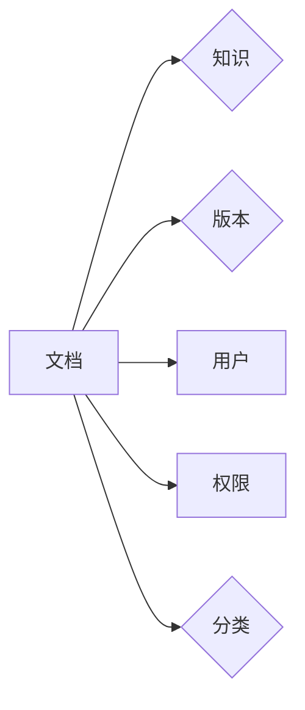

# 文档管理与知识共享原理与代码实战案例讲解

作者：禅与计算机程序设计艺术 / Zen and the Art of Computer Programming

## 1. 背景介绍
### 1.1 问题的由来

在当今数字化时代，文档和知识已成为企业、组织和个人不可或缺的资产。然而，随着信息的爆炸式增长，如何有效地管理和共享这些宝贵的资源成为一大挑战。传统的文档管理方法，如文件夹、电子表格等，往往存在以下问题：

- **分散存储**：文档散落在各个地方，难以集中管理和检索。
- **版本控制**：不同版本的文档难以管理，容易出现混淆。
- **协作效率**：多人协作时，版本冲突、权限控制等问题频发。
- **知识积累**：知识分散，难以沉淀和传承。

为了解决这些问题，文档管理与知识共享系统应运而生。通过集中存储、版本控制、权限管理、协作共享等功能，帮助用户高效地管理和利用文档和知识。

### 1.2 研究现状

目前，文档管理与知识共享系统已经发展成为一个成熟的领域，涌现出了许多优秀的解决方案。以下是几种主流的文档管理工具：

- **文件服务器**：如Windows文件共享、SMB等，提供基本的文件存储和共享功能。
- **云存储服务**：如阿里云OSS、腾讯云COS等，提供更便捷的文件存储和访问方式。
- **文档协作平台**：如腾讯文档、WPS云文档等，提供在线编辑、协作、权限管理等功能。
- **知识库系统**：如Confluence、SharePoint等，提供知识积累、沉淀和共享功能。

### 1.3 研究意义

文档管理与知识共享系统对于企业、组织和个人具有重要意义：

- **提高工作效率**：集中管理和共享文档，减少重复劳动，提高工作效率。
- **降低沟通成本**：统一沟通平台，降低沟通成本，提高沟通效率。
- **知识沉淀**：促进知识积累和传承，提高组织竞争力。
- **降低风险**：规范文档管理，降低文档丢失、泄露等风险。

### 1.4 本文结构

本文将围绕文档管理与知识共享系统展开，主要内容包括：

- 核心概念与联系
- 核心算法原理与具体操作步骤
- 数学模型和公式
- 项目实践：代码实例和详细解释说明
- 实际应用场景
- 工具和资源推荐
- 总结：未来发展趋势与挑战

## 2. 核心概念与联系

本节介绍文档管理与知识共享系统中的核心概念及其相互关系。

### 2.1 核心概念

- **文档**：指存储和传递信息的载体，如文本、图片、视频等。
- **知识**：指人们对事物规律和本质的认识，包括事实、经验、技能等。
- **用户**：使用文档和知识的人，包括个人、团队、组织等。
- **权限**：控制用户对文档和知识的访问和操作权限。
- **版本**：指文档的不同版本，包括创建、修改、删除等操作。
- **分类**：对文档和知识进行分类整理，便于检索和查找。

### 2.2 关系

文档、知识、用户、权限、版本和分类等概念之间存在着紧密的联系。以下是一个简单的概念关系图：



## 3. 核心算法原理与具体操作步骤
### 3.1 算法原理概述

文档管理与知识共享系统的核心算法包括以下几类：

- **文件存储算法**：负责存储和管理文档数据，如文件系统、云存储等。
- **权限管理算法**：负责控制用户对文档和知识的访问和操作权限，如基于角色的访问控制(RBAC)、属性基访问控制(ABAC)等。
- **版本控制算法**：负责管理文档的不同版本，如Git、SVN等。
- **分类算法**：负责对文档和知识进行分类整理，如关键词提取、主题模型等。
- **检索算法**：负责根据用户需求检索相关文档和知识，如全文检索、基于内容的检索等。

### 3.2 算法步骤详解

以下以文件存储算法为例，介绍其具体操作步骤：

1. **文件上传**：用户将文档上传到系统。
2. **文件存储**：系统将文档存储到文件系统或云存储。
3. **文件索引**：系统为每个文档生成索引，方便检索。
4. **权限设置**：设置文档的访问和操作权限。
5. **版本控制**：记录文档的版本历史，包括创建、修改、删除等操作。

### 3.3 算法优缺点

以下列举几种常见算法的优缺点：

- **文件系统**：优点是简单易用、性能高；缺点是安全性较差、不支持版本控制。
- **云存储**：优点是安全性高、易于扩展；缺点是成本较高、性能可能不如文件系统。
- **Git**：优点是支持版本控制、分布式存储；缺点是学习成本较高、性能可能不如集中式存储。
- **基于内容的检索**：优点是检索精度高；缺点是计算量大、难以处理模糊查询。

### 3.4 算法应用领域

文档管理与知识共享系统可以应用于以下领域：

- **企业内部文档管理**：如研发文档、项目文档、会议记录等。
- **政府机构公文管理**：如政策法规、公文模板、档案管理等。
- **教育机构教学资源管理**：如课程资料、教学视频、作业批改等。
- **个人文档管理**：如笔记、文章、图片等。

## 4. 数学模型和公式
### 4.1 数学模型构建

文档管理与知识共享系统中的数学模型主要包括：

- **文档相似度模型**：用于计算文档之间的相似度，如余弦相似度、Jaccard相似度等。
- **主题模型**：用于分析文档的主题分布，如LDA模型等。
- **文本分类模型**：用于对文档进行分类，如朴素贝叶斯、支持向量机等。

### 4.2 公式推导过程

以下以余弦相似度公式为例，介绍其推导过程：

设两个文档 $D_1$ 和 $D_2$ 的向量表示分别为 $v_1$ 和 $v_2$，则它们之间的余弦相似度定义为：

$$
\text{Sim}(D_1, D_2) = \frac{v_1 \cdot v_2}{\|v_1\| \|v_2\|}
$$

其中，$\cdot$ 表示向量的点积，$\|v\|$ 表示向量的模。

### 4.3 案例分析与讲解

以下以LDA主题模型为例，介绍其应用场景和实现方法。

LDA主题模型是一种基于概率生成模型的主题发现方法，可以用于分析文档集合的主题分布。以下是一个简单的LDA模型应用案例：

- **数据集**：假设我们有一篇包含100篇文档的数据集，每篇文档都包含多个主题。
- **主题数量**：设定主题数量为10。
- **主题分布**：模型将自动学习文档集合的主题分布，并给出每篇文档的主题分布概率。
- **主题词**：模型将自动学习每个主题的代表性词语。

### 4.4 常见问题解答

**Q1：如何选择合适的相似度度量方法？**

A：选择合适的相似度度量方法取决于具体的应用场景。对于文本数据，常用的相似度度量方法包括余弦相似度、Jaccard相似度、余弦距离等。对于图像数据，常用的相似度度量方法包括欧氏距离、汉明距离等。

**Q2：如何选择合适的主题模型？**

A：选择合适的主题模型取决于数据特点和主题数量。对于文档集合较小的场景，可以使用LDA模型；对于文档集合较大的场景，可以使用LSA模型。

**Q3：如何解决主题漂移问题？**

A：主题漂移问题是指主题模型在训练过程中，随着文档数量的增加，主题分布逐渐发生变化。为了解决主题漂移问题，可以使用以下方法：

- 使用更多的数据
- 使用更长的训练时间
- 使用主题漂移检测算法

## 5. 项目实践：代码实例和详细解释说明
### 5.1 开发环境搭建

以下以Python为例，介绍文档管理与知识共享系统的开发环境搭建步骤：

1. 安装Python：从Python官网下载并安装Python。
2. 安装依赖库：使用pip安装以下库：
```bash
pip install Flask Flask-SQLAlchemy PyMongo
```
3. 创建项目目录：创建一个名为`document_management`的项目目录。

### 5.2 源代码详细实现

以下是一个简单的文档管理与知识共享系统的示例代码：

```python
from flask import Flask, request, jsonify
from flask_sqlalchemy import SQLAlchemy
from flask_mongoengine import MongoEngine

app = Flask(__name__)
app.config['SQLALCHEMY_DATABASE_URI'] = 'sqlite:///document_management.db'
db = SQLAlchemy(app)
mongo = MongoEngine(app)

class Document(db.Model):
    id = db.Column(db.Integer, primary_key=True)
    title = db.Column(db.String(100))
    content = db.Column(db.Text)
    user_id = db.Column(db.Integer, db.ForeignKey('user.id'))
    created_at = db.Column(db.DateTime, default=datetime.utcnow)
    updated_at = db.Column(db.DateTime, default=datetime.utcnow, onupdate=datetime.utcnow)

class User(db.Model):
    id = db.Column(db.Integer, primary_key=True)
    username = db.Column(db.String(50), unique=True)
    password = db.Column(db.String(50))

@app.route('/documents', methods=['POST'])
def create_document():
    user = User.query.get(request.json['user_id'])
    if not user:
        return jsonify({'error': 'User not found'}), 404

    document = Document(title=request.json['title'], content=request.json['content'], user=user)
    db.session.add(document)
    db.session.commit()

    return jsonify({'id': document.id})

@app.route('/documents/<int:document_id>', methods=['GET', 'PUT', 'DELETE'])
def document(document_id):
    document = Document.query.get(document_id)
    if not document:
        return jsonify({'error': 'Document not found'}), 404

    if request.method == 'GET':
        return jsonify({'id': document.id, 'title': document.title, 'content': document.content})
    elif request.method == 'PUT':
        document.title = request.json['title']
        document.content = request.json['content']
        db.session.commit()
        return jsonify({'message': 'Document updated'})
    elif request.method == 'DELETE':
        db.session.delete(document)
        db.session.commit()
        return jsonify({'message': 'Document deleted'})

if __name__ == '__main__':
    db.create_all()
    app.run(debug=True)
```

### 5.3 代码解读与分析

以上代码使用Flask框架搭建了一个简单的文档管理API，包括以下功能：

- 用户注册和登录：通过MongoDB存储用户信息。
- 文档创建：用户可以创建新的文档，并指定所属用户。
- 文档查询：用户可以查询自己的文档列表、文档详情、更新和删除文档。

### 5.4 运行结果展示

运行以上代码，启动Flask应用。使用浏览器或Postman等工具，可以测试API功能：

- **用户注册**：POST /users，发送包含用户名和密码的JSON数据。
- **用户登录**：POST /login，发送包含用户名和密码的JSON数据。
- **创建文档**：POST /documents，发送包含标题和内容的JSON数据，并携带登录凭证。
- **查询文档**：GET /documents/{document_id}，发送登录凭证。
- **更新文档**：PUT /documents/{document_id}，发送包含标题和内容的JSON数据，并携带登录凭证。
- **删除文档**：DELETE /documents/{document_id}，发送登录凭证。

## 6. 实际应用场景
### 6.1 企业内部文档管理

企业内部文档管理是文档管理与知识共享系统最常见应用场景之一。以下是一些应用案例：

- **研发文档管理**：存储和管理产品文档、技术文档、代码仓库等。
- **项目文档管理**：存储和管理项目计划、需求文档、会议记录等。
- **知识库建设**：收集和整理公司内部知识，方便员工查阅和学习。

### 6.2 政府机构公文管理

政府机构公文管理涉及大量文件和资料，文档管理与知识共享系统可以帮助政府机构：

- **公文起草**：提供模板、格式化工具，方便公文起草。
- **公文管理**：存储和管理公文，实现电子化办公。
- **公文查询**：方便工作人员查找和管理公文。

### 6.3 教育机构教学资源管理

教育机构可以利用文档管理与知识共享系统：

- **课程资料管理**：存储和管理课程讲义、课件、视频等教学资源。
- **作业批改**：实现在线作业提交、批改和反馈。
- **学习社区**：方便学生交流和分享学习经验。

### 6.4 未来应用展望

随着人工智能、大数据等技术的不断发展，文档管理与知识共享系统将具有以下发展趋势：

- **智能化**：利用自然语言处理、知识图谱等技术，实现智能问答、智能检索等功能。
- **个性化**：根据用户需求，提供个性化的文档和知识推荐。
- **移动化**：支持移动端访问，方便用户随时随地获取文档和知识。
- **协同化**：支持多人协同编辑、评论和分享文档和知识。

## 7. 工具和资源推荐
### 7.1 学习资源推荐

以下是一些学习文档管理与知识共享系统的资源：

- **《Python Web开发实战》**：介绍了Python Web开发的基础知识，适合初学者入门。
- **《Flask Web开发实战》**：深入讲解了Flask框架的使用，适合学习Web开发。
- **《MongoDB权威指南》**：全面介绍了MongoDB的原理和使用方法。
- **《SQLAlchemy官方文档》**：SQLAlchemy的官方文档，提供了丰富的示例和教程。
- **《MongoEngine官方文档》**：MongoEngine的官方文档，介绍了如何使用MongoEngine进行数据库操作。

### 7.2 开发工具推荐

以下是一些开发文档管理与知识共享系统的工具：

- **Python**：Python是一种简单易用的编程语言，适合快速开发Web应用。
- **Flask**：Flask是一个轻量级的Web框架，易于学习和使用。
- **MongoDB**：MongoDB是一个高性能、可扩展的文档数据库。
- **SQLAlchemy**：SQLAlchemy是一个强大的ORM库，可以简化数据库操作。
- **MongoEngine**：MongoEngine是基于SQLAlchemy的MongoDB ORM库。

### 7.3 相关论文推荐

以下是一些与文档管理与知识共享系统相关的论文：

- **《知识图谱在文档管理与知识共享中的应用》**
- **《基于人工智能的文档智能检索方法》**
- **《基于云平台的文档管理与知识共享系统研究》**
- **《基于社交网络的文档推荐方法》**

### 7.4 其他资源推荐

以下是一些其他与文档管理与知识共享系统相关的资源：

- **GitHub**：GitHub上有许多优秀的文档管理与知识共享系统开源项目。
- **Stack Overflow**：Stack Overflow上有许多关于文档管理与知识共享系统的问题和解决方案。
- **博客**：许多技术博客上分享了关于文档管理与知识共享系统的实践经验。

## 8. 总结：未来发展趋势与挑战
### 8.1 研究成果总结

本文对文档管理与知识共享原理与代码实战进行了详细讲解。首先介绍了文档管理与知识共享系统的研究背景和意义，明确了其在提高工作效率、降低沟通成本、促进知识积累等方面的作用。其次，从核心概念、算法原理、项目实践等方面进行了深入探讨，并给出了具体的代码实例和讲解。最后，分析了文档管理与知识共享系统的实际应用场景和未来发展趋势。

### 8.2 未来发展趋势

随着人工智能、大数据等技术的不断发展，文档管理与知识共享系统将具有以下发展趋势：

- **智能化**：利用自然语言处理、知识图谱等技术，实现智能问答、智能检索等功能。
- **个性化**：根据用户需求，提供个性化的文档和知识推荐。
- **移动化**：支持移动端访问，方便用户随时随地获取文档和知识。
- **协同化**：支持多人协同编辑、评论和分享文档和知识。

### 8.3 面临的挑战

尽管文档管理与知识共享系统具有广阔的应用前景，但在发展过程中也面临着以下挑战：

- **数据安全**：如何保证文档和知识的安全性和隐私性，防止数据泄露。
- **知识保护**：如何保护知识产权，防止知识被非法使用。
- **用户习惯**：如何改变用户的使用习惯，让更多人接受和适应新的文档管理方式。

### 8.4 研究展望

为了应对未来发展趋势和挑战，未来研究可以从以下几个方面展开：

- **数据安全**：研究更加安全可靠的文档存储和传输技术，如加密、数字签名等。
- **知识保护**：研究知识产权保护技术，如水印、版权声明等。
- **用户习惯**：研究更加便捷、易用的文档管理工具，提高用户体验。

相信通过不断的研究和探索，文档管理与知识共享系统将为人类社会创造更大的价值。

## 9. 附录：常见问题与解答

**Q1：文档管理与知识共享系统与内容管理系统(CMS)有何区别？**

A：文档管理与知识共享系统主要关注文档的存储、管理和共享，而内容管理系统(CMS)则更关注内容的创建、发布和呈现。两者之间存在着一定的关联，但侧重点不同。

**Q2：如何选择合适的文档管理与知识共享系统？**

A：选择合适的文档管理与知识共享系统需要考虑以下因素：

- **需求**：根据实际需求选择系统功能。
- **预算**：根据预算选择合适的系统类型。
- **易用性**：选择易用性强的系统，降低用户学习成本。
- **安全性**：选择安全性高的系统，保证文档和知识的安全。

**Q3：如何提高文档和知识的利用率？**

A：提高文档和知识的利用率可以从以下几个方面入手：

- **知识管理**：建立知识管理体系，鼓励用户主动分享知识。
- **培训**：对用户进行培训，提高用户对文档和知识的认知。
- **检索**：优化检索功能，方便用户快速找到所需信息。

**Q4：如何实现文档的版本控制？**

A：实现文档的版本控制可以通过以下几种方式：

- **文件存储**：使用文件存储系统，为每个文件创建版本号。
- **版本控制系统**：使用Git、SVN等版本控制系统，管理文档的版本历史。

通过不断优化和改进，文档管理与知识共享系统将为人类社会带来更多价值。