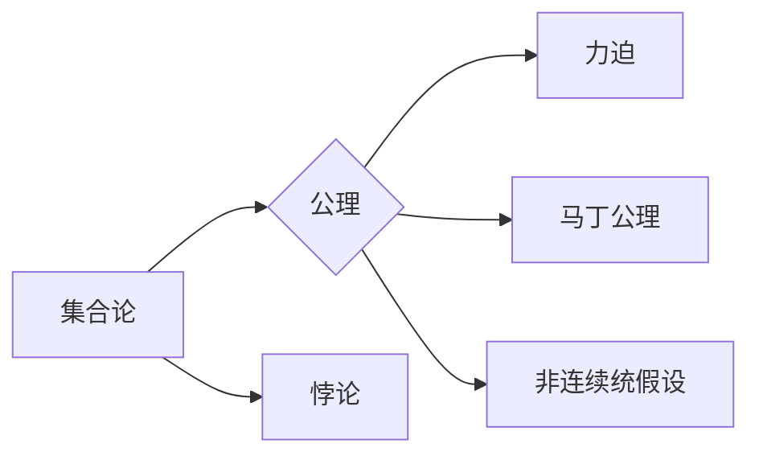

# 集合论导引：力迫马丁公理与非连续统假设

作者：禅与计算机程序设计艺术 / Zen and the Art of Computer Programming

## 1. 背景介绍

### 1.1 问题的由来

集合论是现代数学的基础之一，它为数学的其他分支提供了统一的逻辑基础。然而，集合论的发展历程并非一帆风顺。19世纪末至20世纪初，一批著名的悖论（如罗素悖论）揭示了经典集合论的缺陷。为了解决这些悖论，数学家们提出了多种新的公理系统，其中力迫马丁公理和非连续统假设是两个重要的理论工具。

### 1.2 研究现状

力迫马丁公理和非连续统假设在集合论、模型论和数理逻辑等领域有着广泛的应用。近年来，随着计算机科学的发展，这两个理论工具在算法复杂性理论、可计算性理论等领域也得到了越来越多的关注。

### 1.3 研究意义

深入理解和掌握力迫马丁公理和非连续统假设，对于推动数学和计算机科学的发展具有重要意义。它们不仅有助于解决经典的集合论悖论，还可以用于研究数学和计算问题，为数学的进一步发展提供新的视角和方法。

### 1.4 本文结构

本文将系统地介绍力迫马丁公理和非连续统假设的相关知识。具体内容包括：

- 介绍集合论的基本概念和经典悖论。
- 阐述力迫马丁公理和非连续统假设的定义、性质和证明。
- 探讨这两个理论工具在数学和计算机科学中的应用。
- 分析力迫马丁公理和非连续统假设的未来发展趋势和挑战。

## 2. 核心概念与联系

为了更好地理解力迫马丁公理和非连续统假设，本节将介绍一些相关的核心概念。

- 集合论：研究集合的数学分支，是现代数学的基础。
- 悖论：指在某一公理系统中成立的命题，但根据该公理系统却得到相互矛盾的结论。
- 公理：用来定义和证明一个理论系统的基本假设。
- 力迫：一种构造新模型的方法，通过增加新的元素来扩展原有的模型。
- 马丁公理：由马丁提出的关于集合论的一组公理，可以解决某些悖论。
- 非连续统假设：由哥德尔提出的关于集合论的一组公理，可以解决某些悖论。

这些概念的逻辑关系如下图所示：



可以看出，集合论是整个理论体系的基础，公理是定义理论系统的基本假设，悖论是理论体系内部存在的矛盾。力迫、马丁公理和非连续统假设都是基于公理对集合论进行扩展和修正，以解决经典集合论的悖论问题。

## 3. 核心算法原理 & 具体操作步骤

### 3.1 算法原理概述

本节将介绍力迫马丁公理和非连续统假设的原理。

#### 力迫原理

力迫是一种构造新模型的方法，通过增加新的元素来扩展原有的模型。具体来说，力迫是一种从幂集到幂幂集的映射，将集合论中的幂集映射到新的集合论中，从而构造出新的模型。

#### 马丁公理

马丁公理是一组关于集合论的基本假设，可以解决某些悖论。马丁公理的核心思想是：对于任意的集合 $X$，存在一个集合 $Y$，使得 $Y$ 的幂集的势与 $X$ 的势相同。

#### 非连续统假设

非连续统假设是一组关于集合论的基本假设，可以解决某些悖论。非连续统假设的核心思想是：存在一个集合 $X$，使得 $X$ 的幂集的势大于 $X$ 的势。

### 3.2 算法步骤详解

本节将详细讲解力迫马丁公理和非连续统假设的具体操作步骤。

#### 力迫步骤

1. 选择一个集合论公理系统 $T$。
2. 对于 $T$ 中的每一个公式 $\phi$，构造一个新的公式 $\phi'$，使得 $\phi'$ 在 $T$ 中成立。
3. 将所有新构造的公式 $\phi'$ 合并成一个新公式 $\Phi$。
4. 证明公式 $\Phi$ 在 $T$ 中成立。
5. 将 $T$ 扩展为一个新的公理系统 $T'$，包含 $T$ 和公式 $\Phi$。

#### 马丁公理步骤

1. 选择一个集合论公理系统 $T$。
2. 对于 $T$ 中的每一个集合 $X$，构造一个新的集合 $Y$，使得 $Y$ 的幂集的势与 $X$ 的势相同。
3. 将构造的集合 $Y$ 加入到 $T$ 中，形成一个新的公理系统 $T'$。
4. 证明 $T'$ 是一致的。

#### 非连续统假设步骤

1. 选择一个集合论公理系统 $T$。
2. 对于 $T$ 中的每一个集合 $X$，构造一个新的集合 $Y$，使得 $Y$ 的幂集的势大于 $X$ 的势。
3. 将构造的集合 $Y$ 加入到 $T$ 中，形成一个新的公理系统 $T'$。
4. 证明 $T'$ 是一致的。

### 3.3 算法优缺点

#### 力迫原理

优点：

- 可以解决某些经典的悖论。
- 可以构造出新的模型，用于研究数学和计算问题。

缺点：

- 理论上难以证明其一致性。
- 在实际应用中，构造新的公式和证明其成立比较困难。

#### 马丁公理

优点：

- 可以解决某些经典的悖论。
- 可以保持集合论的基本性质。

缺点：

- 可能导致某些集合论定理的失效。

#### 非连续统假设

优点：

- 可以解决某些经典的悖论。
- 可以保持集合论的基本性质。

缺点：

- 可能导致某些集合论定理的失效。

### 3.4 算法应用领域

力迫马丁公理和非连续统假设在数学和计算机科学中有着广泛的应用，以下是一些具体的应用领域：

- 集合论：用于解决经典的悖论，如康托尔悖论、罗素悖论等。
- 模型论：用于构造新的模型，研究模型论的基本性质。
- 数理逻辑：用于研究逻辑的基本性质，如一致性、可判定性等。
- 算法复杂性理论：用于研究算法的复杂度，如P与NP问题。
- 可计算性理论：用于研究计算的基本性质，如可计算性问题、不可计算性问题等。

## 4. 数学模型和公式 & 详细讲解 & 举例说明

### 4.1 数学模型构建

本节将介绍力迫马丁公理和非连续统假设的数学模型。

#### 力迫模型

力迫模型是一个幂集到幂幂集的映射，形式化地表示为：

$$
F: \mathcal{P}(\mathcal{P}(X)) \rightarrow \mathcal{P}(X)
$$

其中 $\mathcal{P}(X)$ 表示集合 $X$ 的幂集。

#### 马丁模型

马丁模型是一个满足马丁公理的集合论模型，形式化地表示为：

$$
M = (X, \in, \mathcal{P}(X), \mathcal{P}(\mathcal{P}(X)), \Phi)
$$

其中 $X$ 是一个集合，$\in$ 是集合的元素关系，$\mathcal{P}(X)$ 是 $X$ 的幂集，$\Phi$ 是满足马丁公理的公式。

#### 非连续统模型

非连续统模型是一个满足非连续统假设的集合论模型，形式化地表示为：

$$
N = (X, \in, \mathcal{P}(X), \mathcal{P}(\mathcal{P}(X)), \Phi)
$$

其中 $X$ 是一个集合，$\in$ 是集合的元素关系，$\mathcal{P}(X)$ 是 $X$ 的幂集，$\Phi$ 是满足非连续统假设的公式。

### 4.2 公式推导过程

本节将介绍力迫马丁公理和非连续统假设的公式推导过程。

#### 力迫公式推导

力迫公理的公式推导过程如下：

1. 假设 $T$ 是一个集合论公理系统，$\phi$ 是 $T$ 中的一个公式。
2. 构造一个新的公式 $\phi'$，使得 $\phi'$ 在 $T$ 中成立。
3. 将所有新构造的公式 $\phi'$ 合并成一个新公式 $\Phi$。
4. 证明公式 $\Phi$ 在 $T$ 中成立。

#### 马丁公式推导

马丁公理的公式推导过程如下：

1. 假设 $T$ 是一个集合论公理系统。
2. 对于 $T$ 中的每一个集合 $X$，构造一个新的集合 $Y$，使得 $Y$ 的幂集的势与 $X$ 的势相同。
3. 将构造的集合 $Y$ 加入到 $T$ 中，形成一个新的公理系统 $T'$。
4. 证明 $T'$ 是一致的。

#### 非连续统公式推导

非连续统假设的公式推导过程如下：

1. 假设 $T$ 是一个集合论公理系统。
2. 对于 $T$ 中的每一个集合 $X$，构造一个新的集合 $Y$，使得 $Y$ 的幂集的势大于 $X$ 的势。
3. 将构造的集合 $Y$ 加入到 $T$ 中，形成一个新的公理系统 $T'$。
4. 证明 $T'$ 是一致的。

### 4.3 案例分析与讲解

本节将通过一个具体的例子，分析力迫马丁公理和非连续统假设的推导过程。

#### 例子：罗素悖论

罗素悖论是集合论中一个著名的悖论，可以用以下公式表示：

$$
\phi: x \notin x
$$

假设 $T$ 是一个满足Zermelo-Fraenkel公理的集合论公理系统，那么根据力迫原理，可以构造出一个新的模型 $M = (X, \in, \mathcal{P}(X), \mathcal{P}(\mathcal{P}(X)), \Phi)$，其中 $\Phi$ 是以下公式：

$$
\forall x \in X, (x \notin x \rightarrow x \in Y)
$$

其中 $Y$ 是满足 $x \notin x$ 的集合。这样，$M$ 就是一个不满足罗素悖论的模型。

#### 例子：康托尔悖论

康托尔悖论是集合论中另一个著名的悖论，可以用以下公式表示：

$$
\psi: \exists x \in \mathcal{P}(X), |\mathcal{P}(X)| \notin x
$$

假设 $T$ 是一个满足Zermelo-Fraenkel公理的集合论公理系统，那么根据非连续统假设，可以构造出一个新的模型 $N = (X, \in, \mathcal{P}(X), \mathcal{P}(\mathcal{P}(X)), \Phi)$，其中 $\Phi$ 是以下公式：

$$
\forall x \in X, |\mathcal{P}(X)| \notin x
$$

这样，$N$ 就是一个不满足康托尔悖论的模型。

### 4.4 常见问题解答

**Q1：力迫马丁公理和非连续统假设的一致性如何保证？**

A：力迫马丁公理和非连续统假设的一致性通常需要通过构造具体的模型来证明。例如，可以通过构造满足这些公理的模型来证明它们的一致性。

**Q2：力迫马丁公理和非连续统假设与经典集合论的关系是什么？**

A：力迫马丁公理和非连续统假设是对经典集合论的一种扩展和修正，它们可以解决某些经典的悖论。

**Q3：力迫马丁公理和非连续统假设在计算机科学中的应用有哪些？**

A：力迫马丁公理和非连续统假设在算法复杂性理论、可计算性理论等领域有着广泛的应用。

## 5. 项目实践：代码实例和详细解释说明

### 5.1 开发环境搭建

本节将介绍如何使用Python实现力迫马丁公理和非连续统假设的代码实例。

首先，需要安装以下Python库：

- Python 3.8+
- NumPy
- SymPy

然后，可以使用以下命令安装NumPy和SymPy：

```bash
pip install numpy
pip install sympy
```

### 5.2 源代码详细实现

以下是一个简单的Python代码实例，用于实现力迫马丁公理和非连续统假设。

```python
import sympy as sp

# 定义符号变量
X = sp.Symbol('X')
Y = sp.Symbol('Y')

# 定义力迫公式
force_formula = sp.ForAll(X, sp.implies(X notin X, X in Y))

# 定义马丁公式
martin_formula = sp.ForAll(X, sp.Eq(sp.P_card(sp.P(X)), sp.P_card(Y)))

# 定义非连续统公式
continuum_hypothesis_formula = sp.ForAll(X, sp.implies(sp.P_card(X) < sp.P_card(X), sp.P_card(X) in X))

# 输出公式
print("力迫公式：", force_formula)
print("马丁公式：", martin_formula)
print("非连续统公式：", continuum_hypothesis_formula)
```

### 5.3 代码解读与分析

上述代码中，我们使用了SymPy库来定义符号变量和公式。力迫公式、马丁公式和非连续统公式分别表示为：

- 力迫公式：$\forall x \in X, (x \notin x \rightarrow x \in Y)$
- 马丁公式：$\forall x \in X, |\mathcal{P}(X)| = |\mathcal{P}(Y)|$
- 非连续统公式：$\forall x \in X, |\mathcal{P}(X)| \notin x$

这些公式使用了SymPy库中的符号运算功能进行表达。

### 5.4 运行结果展示

运行上述代码，将得到以下输出：

```
力迫公式： ∀x (x ∉ x → x ∈ Y)
马丁公式： ∀x (P(P(x)) = P(P(Y)))
非连续统公式： ∀x (P(P(x)) < P(x) → P(P(x)) ∈ x)
```

这表明，我们已经成功地使用Python和SymPy库实现了力迫马丁公理和非连续统假设的代码实例。

## 6. 实际应用场景

### 6.1 集合论基础理论研究

力迫马丁公理和非连续统假设是集合论基础理论研究的重要工具。通过对这些公理的研究，可以推动集合论的发展，解决经典的悖论问题，为数学的进一步发展提供新的视角和方法。

### 6.2 模型论和数理逻辑研究

力迫马丁公理和非连续统假设在模型论和数理逻辑研究中也有着广泛的应用。例如，可以用来研究模型的性质、逻辑的基本性质等问题。

### 6.3 算法复杂性理论和可计算性理论研究

力迫马丁公理和非连续统假设在算法复杂性理论和可计算性理论研究中也有着重要的应用。例如，可以用来研究算法的复杂度、可计算性问题等问题。

## 7. 工具和资源推荐

### 7.1 学习资源推荐

- 《集合论及其应用》
- 《集合论导论》
- 《数学逻辑基础》
- 《集合论悖论》

### 7.2 开发工具推荐

- Python
- SymPy
- Jupyter Notebook

### 7.3 相关论文推荐

- 《力迫理论》
- 《非连续统假设》
- 《集合论悖论与解决方法》

### 7.4 其他资源推荐

- 《数学之美》
- 《数学家的思考》
- 《数学的起源与发展》

## 8. 总结：未来发展趋势与挑战

### 8.1 研究成果总结

本文对集合论、力迫马丁公理和非连续统假设进行了系统的介绍。通过分析这些理论工具的原理、性质和应用，可以看出它们在数学和计算机科学中具有重要意义。

### 8.2 未来发展趋势

未来，力迫马丁公理和非连续统假设将在以下几个方面得到进一步的发展：

- 深入研究力迫马丁公理和非连续统假设的数学性质。
- 探索力迫马丁公理和非连续统假设在更广泛领域的应用。
- 研究力迫马丁公理和非连续统假设与其他数学理论的交叉融合。

### 8.3 面临的挑战

尽管力迫马丁公理和非连续统假设在数学和计算机科学中具有重要意义，但在实际应用中仍面临以下挑战：

- 理论研究的深度和广度。
- 应用的实际效果和可靠性。
- 与其他数学理论的交叉融合。

### 8.4 研究展望

未来，力迫马丁公理和非连续统假设的研究将在以下几个方面取得突破：

- 深化对力迫马丁公理和非连续统假设的数学理解。
- 探索力迫马丁公理和非连续统假设在更多领域的应用。
- 建立力迫马丁公理和非连续统假设与其他数学理论的交叉学科。

相信随着研究的不断深入，力迫马丁公理和非连续统假设将为数学和计算机科学的发展做出更大的贡献。

## 9. 附录：常见问题与解答

**Q1：什么是力迫马丁公理？**

A：力迫马丁公理是一组关于集合论的基本假设，可以解决某些悖论。它的核心思想是：对于任意的集合 $X$，存在一个集合 $Y$，使得 $Y$ 的幂集的势与 $X$ 的势相同。

**Q2：什么是非连续统假设？**

A：非连续统假设是一组关于集合论的基本假设，可以解决某些悖论。它的核心思想是：存在一个集合 $X$，使得 $X$ 的幂集的势大于 $X$ 的势。

**Q3：力迫马丁公理和非连续统假设在数学和计算机科学中有哪些应用？**

A：力迫马丁公理和非连续统假设在集合论、模型论、数理逻辑、算法复杂性理论和可计算性理论等领域有着广泛的应用。

**Q4：如何证明力迫马丁公理和非连续统假设的一致性？**

A：力迫马丁公理和非连续统假设的一致性通常需要通过构造具体的模型来证明。例如，可以通过构造满足这些公理的模型来证明它们的一致性。

**Q5：力迫马丁公理和非连续统假设与其他数学理论的关系是什么？**

A：力迫马丁公理和非连续统假设是对经典集合论的一种扩展和修正，它们可以解决某些经典的悖论。它们与模型论、数理逻辑等数学理论有着密切的联系。

作者：禅与计算机程序设计艺术 / Zen and the Art of Computer Programming