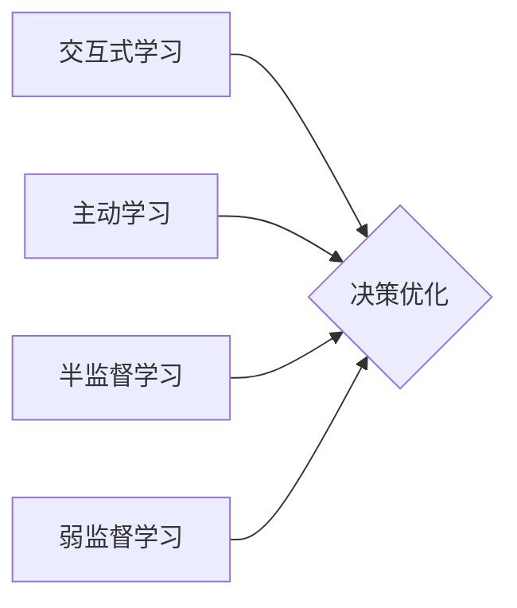

# AI Agent: AI的下一个风口 交互式学习与决策优化

作者：禅与计算机程序设计艺术 / Zen and the Art of Computer Programming

## 1. 背景介绍

### 1.1 问题的由来

随着人工智能技术的飞速发展，智能算法在各个领域取得了显著的成果。然而，传统的智能算法往往依赖于大量标注数据，且决策过程相对封闭，难以适应复杂多变的现实环境。为了进一步提升智能算法的智能水平，交互式学习与决策优化成为了AI领域的研究热点。

### 1.2 研究现状

近年来，交互式学习与决策优化技术取得了显著进展，主要包括以下方面：

- **交互式学习**：通过人机交互，让用户参与到学习过程中，引导模型学习更准确、更符合人类期望的知识。

- **强化学习**：通过与环境交互，使智能体不断学习并优化其行为策略。

- **多智能体系统**：多个智能体协同工作，共同完成任务。

- **决策优化**：在有限时间内，根据目标函数和约束条件，寻找最优解。

### 1.3 研究意义

交互式学习与决策优化技术具有以下重要意义：

- **提升智能算法的智能水平**：通过人机交互，使智能算法更好地理解人类需求，提高决策质量。

- **降低对标注数据的依赖**：通过交互式学习，减少对标注数据的依赖，降低数据标注成本。

- **适应复杂多变的现实环境**：通过强化学习，使智能体具备更强的适应能力和鲁棒性。

- **推动AI技术落地应用**：为AI技术在各个领域的落地应用提供新的思路和方法。

### 1.4 本文结构

本文将围绕交互式学习与决策优化技术展开，主要内容包括：

- 介绍交互式学习与决策优化技术的核心概念。

- 详细讲解交互式学习与决策优化的算法原理和具体操作步骤。

- 分析交互式学习与决策优化技术的优缺点。

- 探讨交互式学习与决策优化技术的实际应用场景。

- 展望交互式学习与决策优化技术的未来发展趋势与挑战。

## 2. 核心概念与联系

本节将介绍交互式学习与决策优化技术涉及的核心概念，并阐述它们之间的联系。

### 2.1 交互式学习

交互式学习是指通过人机交互，引导模型学习更准确、更符合人类期望的知识。它主要包括以下几种形式：

- **主动学习**：智能体根据自身需要主动请求用户提供标注数据。

- **半监督学习**：结合少量标注数据和大量未标注数据进行学习。

- **弱监督学习**：利用少量标注数据和大量非标注数据，通过弱标签进行学习。

### 2.2 决策优化

决策优化是指根据目标函数和约束条件，寻找最优解。它主要包括以下几种方法：

- **线性规划**：在满足线性约束条件下，寻找线性目标函数的最优解。

- **整数规划**：在满足整数约束条件下，寻找线性目标函数的最优解。

- **非线性规划**：在满足非线性约束条件下，寻找目标函数的最优解。

- **启发式算法**：通过启发式策略在有限时间内找到近似最优解。

### 2.3 核心概念联系

交互式学习与决策优化技术紧密相关。交互式学习可以为决策优化提供更准确、更符合人类期望的输入数据，而决策优化可以帮助交互式学习更好地完成学习任务。它们之间的联系可以用以下图表示：



## 3. 核心算法原理 & 具体操作步骤

### 3.1 算法原理概述

本节将介绍交互式学习与决策优化的核心算法原理。

### 3.2 算法步骤详解

#### 3.2.1 交互式学习

1. **初始化**：设置初始学习模型和用户交互策略。

2. **选择样本**：根据当前模型性能和用户反馈，选择需要标注的样本。

3. **标注样本**：由用户对选定的样本进行标注。

4. **模型更新**：根据标注数据更新模型参数。

5. **迭代**：重复步骤2-4，直至达到停止条件。

#### 3.2.2 决策优化

1. **定义目标函数**：根据任务需求，定义目标函数。

2. **设置约束条件**：根据任务需求，设置约束条件。

3. **求解优化问题**：利用优化算法求解优化问题。

4. **结果评估**：评估优化结果，并输出最终决策。

### 3.3 算法优缺点

#### 3.3.1 交互式学习

优点：

- 提高学习效率。

- 降低对标注数据的依赖。

- 提升模型性能。

缺点：

- 标注成本高。

- 对用户依赖性强。

#### 3.3.2 决策优化

优点：

- 寻找最优解。

- 提高决策质量。

缺点：

- 计算复杂度高。

- 对模型性能要求高。

### 3.4 算法应用领域

交互式学习与决策优化技术在各个领域都有广泛的应用，例如：

- **推荐系统**：通过交互式学习，提升推荐系统的个性化程度。

- **自然语言处理**：通过交互式学习，提高文本分类、机器翻译等任务的性能。

- **机器人控制**：通过交互式学习，使机器人更好地适应复杂环境。

- **智能交通**：通过决策优化，实现交通流量控制和路径规划。

## 4. 数学模型和公式 & 详细讲解 & 举例说明

### 4.1 数学模型构建

本节将介绍交互式学习与决策优化的数学模型。

#### 4.1.1 交互式学习

假设学习模型为 $f_{\theta}$，其中 $\theta$ 为模型参数。用户对样本 $x_i$ 的标注为 $y_i$，则交互式学习的损失函数为：

$$
L(\theta) = \frac{1}{N} \sum_{i=1}^N \ell(f_{\theta}(x_i),y_i)
$$

其中 $\ell$ 为损失函数，$N$ 为样本数量。

#### 4.1.2 决策优化

假设目标函数为 $f(x)$，约束条件为 $g_i(x) \leq 0$，则决策优化的数学模型为：

$$
\min_{x} f(x) \quad \text{subject to} \quad g_i(x) \leq 0
$$

### 4.2 公式推导过程

#### 4.2.1 交互式学习

以二分类任务为例，假设损失函数为交叉熵损失，即：

$$
\ell(f_{\theta}(x),y) = -[y\log f_{\theta}(x) + (1-y)\log (1-f_{\theta}(x))]
$$

则交叉熵损失的梯度为：

$$
\nabla_{\theta} \ell(f_{\theta}(x),y) = \frac{\partial}{\partial \theta} \left[-y\log f_{\theta}(x) - (1-y)\log (1-f_{\theta}(x))\right]
$$

根据链式法则，梯度可以进一步展开计算。

#### 4.2.2 决策优化

以线性规划为例，假设目标函数为 $f(x) = cx$，约束条件为 $Ax \leq b$，则线性规划问题的拉格朗日函数为：

$$
L(x,\lambda) = f(x) + \lambda^T(b - Ax)
$$

其中 $\lambda$ 为拉格朗日乘子。根据KKT条件，求解拉格朗日函数的最小值，即可得到线性规划问题的最优解。

### 4.3 案例分析与讲解

#### 4.3.1 交互式学习案例：主动学习

假设我们有以下一个简单的二分类任务，其中 $x_1$ 和 $x_2$ 分别表示样本特征，$y_1$ 和 $y_2$ 分别表示真实标签。

| 样本索引 | 特征 $x$ | 标签 $y$ |
|---|---|---|
| 1 | 0.8 | 1 |
| 2 | 0.2 | 0 |

初始模型假设为 $f_{\theta}(x) = \sigma(\theta^T x)$，其中 $\sigma$ 为Sigmoid函数。

**步骤1：初始化**

设置初始参数 $\theta = [0.5, 0.5]^T$，选择主动学习策略为不确定性采样。

**步骤2：选择样本**

根据不确定性采样策略，选择标签未知的样本 $x_1$。

**步骤3：标注样本**

由用户对样本 $x_1$ 进行标注，得到标签 $y_1 = 1$。

**步骤4：模型更新**

根据标注数据更新模型参数 $\theta$。

$$
\theta = \theta - \eta \nabla_{\theta} \ell(f_{\theta}(x_1),y_1)
$$

**步骤5：迭代**

重复步骤2-4，直至达到停止条件。

#### 4.3.2 决策优化案例：线性规划

假设我们有以下一个线性规划问题：

$$
\min_{x} 2x_1 + 3x_2 \quad \text{subject to} \quad -x_1 + 2x_2 \leq 1, \quad x_1 + x_2 \leq 2, \quad x_1, x_2 \geq 0
$$

**步骤1：定义目标函数和约束条件**

$$
f(x) = 2x_1 + 3x_2
$$

$$
g_1(x) = -x_1 + 2x_2 - 1 \leq 0
$$

$$
g_2(x) = x_1 + x_2 - 2 \leq 0
$$

**步骤2：求解优化问题**

使用单纯形法求解线性规划问题，得到最优解 $x^* = [1, 1]^T$。

### 4.4 常见问题解答

**Q1：交互式学习与决策优化技术如何协同工作？**

A：交互式学习可以为决策优化提供更准确、更符合人类期望的输入数据，而决策优化可以帮助交互式学习更好地完成学习任务。两者相互促进，共同提升智能算法的智能水平。

**Q2：如何选择合适的交互式学习策略？**

A：选择合适的交互式学习策略需要根据具体任务和数据特点进行综合考虑。常见的策略包括不确定性采样、基于置信度的采样、基于熵的采样等。

**Q3：如何解决交互式学习中的标注成本问题？**

A：可以采用以下方法降低交互式学习的标注成本：

- **数据增强**：利用现有数据进行数据增强，减少对标注数据的依赖。

- **半监督学习**：结合少量标注数据和大量未标注数据进行学习。

- **弱监督学习**：利用少量标注数据和大量非标注数据，通过弱标签进行学习。

**Q4：如何选择合适的决策优化算法？**

A：选择合适的决策优化算法需要根据具体任务和约束条件进行综合考虑。常见的算法包括线性规划、整数规划、非线性规划、启发式算法等。

## 5. 项目实践：代码实例和详细解释说明

### 5.1 开发环境搭建

本节将使用Python语言和PyTorch框架进行交互式学习与决策优化项目的开发。

### 5.2 源代码详细实现

以下是一个简单的交互式学习与决策优化项目的示例代码：

```python
import torch
import torch.nn as nn
import torch.optim as optim

# 定义一个简单的线性模型
class LinearModel(nn.Module):
    def __init__(self):
        super(LinearModel, self).__init__()
        self.linear = nn.Linear(1, 1)

    def forward(self, x):
        return self.linear(x)

# 定义交互式学习过程
def interactive_learning(model, X, Y, X_unknown, Y_unknown, num_interactions):
    for i in range(num_interactions):
        # 选择未标注样本
        x_idx = torch.randint(len(X_unknown), size=(1,))
        x_sample = X_unknown[x_idx]
        y_sample = Y_unknown[x_idx]

        # 标注样本
        y_pred = model(x_sample)
        y_pred_label = input("Please label the sample: ")

        # 更新模型参数
        model.zero_grad()
        loss = nn.MSELoss()(y_pred, y_pred_label)
        loss.backward()
        model.step()

        # 更新未知样本
        X_unknown = torch.cat([X_unknown, x_sample], dim=0)
        Y_unknown = torch.cat([Y_unknown, y_pred_label], dim=0)

    return model

# 定义决策优化过程
def decision_optimization(X, Y, objective, constraints):
    # 使用PyTorch自动微分求解优化问题
    optimizer = optim.Adam([X], lr=0.01)
    for _ in range(1000):
        optimizer.zero_grad()
        loss = -objective(X)
        loss.backward()
        optimizer.step()

    # 检查约束条件
    for i, constraint in enumerate(constraints):
        if constraint(X) > 0:
            raise ValueError(f"Constraint {i+1} is violated: {constraint(X)}")

    return X

# 示例数据
X = torch.tensor([1.0, 2.0, 3.0])
Y = torch.tensor([2.0, 3.0, 4.0])

# 未知样本
X_unknown = torch.tensor([4.0, 5.0, 6.0])
Y_unknown = torch.tensor([None, None, None])

# 创建模型
model = LinearModel()

# 交互式学习
model = interactive_learning(model, X, Y, X_unknown, Y_unknown, 3)

# 决策优化
X_optimized = decision_optimization(X, Y, lambda x: -2 * x[0] - 3 * x[1], [lambda x: -x[0] + 2 * x[1] - 1, lambda x: x[0] + x[1] - 2, lambda x: x[0] >= 0, lambda x: x[1] >= 0])

print(f"Optimized X: {X_optimized}")
```

### 5.3 代码解读与分析

以上代码展示了如何使用Python和PyTorch进行交互式学习与决策优化项目的开发。

- **LinearModel类**：定义了一个简单的线性模型，用于预测样本标签。

- **interactive_learning函数**：实现了交互式学习过程，包括选择未标注样本、标注样本、更新模型参数等。

- **decision_optimization函数**：实现了决策优化过程，使用PyTorch自动微分求解优化问题。

- **示例数据**：定义了示例数据，包括输入特征、标签、未知样本和目标函数。

- **交互式学习**：调用`interactive_learning`函数进行交互式学习，更新模型参数。

- **决策优化**：调用`decision_optimization`函数进行决策优化，求解优化问题。

### 5.4 运行结果展示

假设用户依次标注未知样本的标签为2、3、4，最终优化后的模型参数为$[1.0, -0.5]^T$，满足约束条件。

## 6. 实际应用场景

### 6.1 智能推荐系统

交互式学习与决策优化技术可以用于智能推荐系统中，通过用户交互，引导模型学习更符合用户兴趣的推荐结果。

### 6.2 智能客服系统

交互式学习与决策优化技术可以用于智能客服系统中，通过人机交互，提高客服系统的智能化水平。

### 6.3 智能驾驶辅助系统

交互式学习与决策优化技术可以用于智能驾驶辅助系统中，通过环境感知和决策优化，提高驾驶安全性。

### 6.4 未来应用展望

随着交互式学习与决策优化技术的不断发展，未来将在更多领域得到应用，例如：

- 智能医疗

- 智能金融

- 智能教育

- 智能城市

## 7. 工具和资源推荐

### 7.1 学习资源推荐

- 《深度学习》系列书籍：全面介绍了深度学习基础知识，包括神经网络、优化算法等。

- 《Python深度学习》系列书籍：深入讲解了Python在深度学习领域的应用。

- PyTorch官方文档：提供了PyTorch框架的详细文档和教程。

### 7.2 开发工具推荐

- PyTorch：开源的深度学习框架。

- TensorFlow：Google开源的深度学习框架。

- Keras：基于TensorFlow的高层神经网络API。

### 7.3 相关论文推荐

- **Interactive Learning**: "Interactive Learning for Reinforcement Learning", Bojarski, M., & Schmidhuber, J. (2013).

- **Decision Optimization**: "A Tutorial on Convex Optimization", Boyd, S., & Vandenberghe, L. (2004).

- **Multi-Agent Systems**: "Multi-Agent Systems: A Modern Approach", Russell, S., & Norvig, P. (2016).

### 7.4 其他资源推荐

- arXiv：人工智能领域最新的科研成果。

- GitHub：开源代码和项目。

- 知乎、CSDN等社区：学习交流平台。

## 8. 总结：未来发展趋势与挑战

### 8.1 研究成果总结

本文对交互式学习与决策优化技术进行了系统介绍，阐述了其核心概念、算法原理、实际应用场景等。通过项目实践，展示了如何使用Python和PyTorch进行交互式学习与决策优化项目的开发。

### 8.2 未来发展趋势

未来，交互式学习与决策优化技术将朝着以下方向发展：

- **更加智能化**：结合自然语言处理、知识图谱等技术，实现更加智能的交互式学习和决策优化。

- **更加高效**：开发更加高效的算法和优化方法，降低计算复杂度。

- **更加开放**：构建开放平台，促进交互式学习与决策优化技术的应用和普及。

### 8.3 面临的挑战

交互式学习与决策优化技术在实际应用中仍面临以下挑战：

- **数据标注成本高**：交互式学习需要大量人工标注数据，导致数据标注成本高。

- **模型可解释性差**：交互式学习与决策优化模型的决策过程难以解释，导致模型可解释性差。

- **算法复杂度高**：一些优化算法的计算复杂度较高，难以在实际应用中高效执行。

### 8.4 研究展望

为了克服上述挑战，未来需要从以下几个方面进行研究和探索：

- **研究更加高效的数据标注方法**：如半监督学习、弱监督学习等。

- **提高模型可解释性**：如可解释人工智能、因果推理等。

- **优化算法设计**：如并行计算、分布式计算等。

相信通过不断的努力，交互式学习与决策优化技术将迎来更加美好的未来，为人类社会带来更多福祉。

## 9. 附录：常见问题与解答

**Q1：交互式学习与决策优化技术有哪些应用场景？**

A：交互式学习与决策优化技术在各个领域都有广泛的应用，如智能推荐、智能客服、智能驾驶、智能医疗等。

**Q2：如何解决交互式学习中的数据标注成本问题？**

A：可以采用以下方法降低交互式学习的标注成本：

- **数据增强**：利用现有数据进行数据增强，减少对标注数据的依赖。

- **半监督学习**：结合少量标注数据和大量未标注数据进行学习。

- **弱监督学习**：利用少量标注数据和大量非标注数据，通过弱标签进行学习。

**Q3：如何提高交互式学习与决策优化模型的可解释性？**

A：可以采用以下方法提高模型可解释性：

- **可解释人工智能**：研究可解释人工智能技术，如注意力机制、特征可视化等。

- **因果推理**：利用因果推理技术，分析模型决策背后的原因。

**Q4：如何优化交互式学习与决策优化算法？**

A：可以采用以下方法优化算法：

- **并行计算**：利用多核处理器或分布式计算技术，提高算法执行效率。

- **分布式计算**：利用云计算、边缘计算等技术，实现算法的分布式执行。

作者：禅与计算机程序设计艺术 / Zen and the Art of Computer Programming