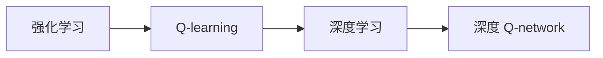

# 深度 Q-learning：探寻机器预知未来的可能性

作者：禅与计算机程序设计艺术 / Zen and the Art of Computer Programming


## 1. 背景介绍
### 1.1 问题的由来

从古至今，人类一直对未来的预测抱有浓厚的兴趣。然而，预测未来并非易事，往往受到信息不全、模型复杂等因素的制约。随着人工智能技术的飞速发展，机器学习算法为预测未来提供了新的可能性。其中，深度 Q-learning 作为一种强化学习算法，在预测未来领域展现出巨大的潜力。

### 1.2 研究现状

近年来，深度 Q-learning 在多个领域取得了显著成果，如游戏、自动驾驶、机器人控制等。然而，在预测未来领域，深度 Q-learning 仍处于探索阶段，面临着诸多挑战。本文将深入探讨深度 Q-learning 在预测未来的应用，分析其原理、方法、优缺点以及面临的挑战。

### 1.3 研究意义

研究深度 Q-learning 在预测未来的应用，具有重要的理论意义和实际应用价值：

1. **理论意义**：推动强化学习算法在预测领域的应用研究，丰富机器学习算法体系。
2. **实际应用价值**：为天气预报、金融预测、城市规划等领域的未来预测提供新的思路和方法。

### 1.4 本文结构

本文将围绕以下内容展开：

- 介绍深度 Q-learning 的核心概念与联系。
- 深入分析深度 Q-learning 的原理、方法和步骤。
- 结合实际案例，讲解深度 Q-learning 在预测未来的应用。
- 探讨深度 Q-learning 在预测领域的挑战和未来发展方向。

## 2. 核心概念与联系

为了更好地理解深度 Q-learning 在预测未来的应用，我们先介绍几个核心概念：

- **强化学习（Reinforcement Learning, RL）**：一种通过与环境交互，学习最优策略的机器学习方法。强化学习算法通过奖励信号来指导模型学习，最终目标是获得最大化的累积奖励。
- **Q-learning**：一种基于值函数的强化学习算法，通过学习值函数来指导决策，实现最优策略的寻找。
- **深度学习（Deep Learning, DL）**：一种模拟人脑神经网络结构，通过多层非线性变换提取特征并进行学习的方法。
- **深度 Q-network（DQN）**：将 Q-learning 与深度神经网络结合，将 Q-learning 的值函数逼近为深度神经网络，实现更复杂的决策过程。

这些概念之间的联系如下所示：



可以看出，深度 Q-learning 是 Q-learning 和深度学习相结合的产物，通过深度神经网络逼近 Q-learning 的值函数，实现更复杂的决策过程。

## 3. 核心算法原理 & 具体操作步骤
### 3.1 算法原理概述

深度 Q-learning 是一种基于值函数的强化学习算法，其核心思想是学习一个 Q 函数，该函数可以预测在给定状态下采取特定动作所能获得的最大累积奖励。通过不断学习 Q 函数，模型最终可以找到最优策略。

深度 Q-learning 的基本原理如下：

1. **初始化**：初始化 Q 函数参数，通常采用随机初始化或经验初始化。
2. **环境交互**：在给定状态下，根据 Q 函数选择一个动作。
3. **获取奖励**：执行选定的动作，根据环境反馈获取奖励。
4. **更新 Q 函数**：根据新的状态、动作和奖励，更新 Q 函数参数。

### 3.2 算法步骤详解

以下是深度 Q-learning 的具体操作步骤：

1. **初始化**：
   - 初始化 Q 函数参数 $\theta$，通常采用随机初始化或经验初始化。
   - 初始化动作空间 $A$ 和状态空间 $S$。
   - 初始化探索策略 $\epsilon$。

2. **状态-动作选择**：
   - 在状态 $s_t$ 下，根据 Q 函数和探索策略选择一个动作 $a_t$。
   - $a_t = \argmax_a Q(\theta, s_t) + \epsilon \cdot \text{random\_action}(A)$

3. **执行动作**：
   - 执行动作 $a_t$，进入新的状态 $s_{t+1}$。
   - 获取奖励 $r_t$。

4. **更新 Q 函数**：
   - 根据新的状态 $s_{t+1}$ 和动作 $a_t$，更新 Q 函数参数 $\theta$。
   - $Q(\theta, s_t, a_t) \leftarrow Q(\theta, s_t, a_t) + \alpha \cdot [r_t + \gamma \cdot \max_{a' \in A} Q(\theta, s_{t+1}, a') - Q(\theta, s_t, a_t)]$

其中，$\alpha$ 为学习率，$\gamma$ 为折扣因子，表示未来奖励的重要性。

5. **重复步骤 2-4，直到达到终止条件**。

### 3.3 算法优缺点

深度 Q-learning 具有以下优点：

1. **适用于复杂决策问题**：深度 Q-learning 可以处理具有高维状态和动作空间的复杂决策问题。
2. **可扩展性**：通过增加神经网络的层数和神经元数量，可以扩展 Q 函数的表达能力，提高决策质量。
3. **易于实现**：深度 Q-learning 的实现相对简单，可以使用现有的深度学习框架进行开发。

然而，深度 Q-learning 也存在以下缺点：

1. **训练时间长**：深度 Q-learning 需要大量的训练数据和时间来收敛到最优策略。
2. **样本效率低**：深度 Q-learning 对样本的利用率较低，容易陷入过拟合。
3. **不适用于连续动作空间**：深度 Q-learning 主要针对离散动作空间，对于连续动作空间，需要采用其他方法进行近似。

### 3.4 算法应用领域

深度 Q-learning 在以下领域具有潜在应用价值：

1. **游戏**：例如围棋、国际象棋等。
2. **自动驾驶**：例如车辆控制、路径规划等。
3. **机器人控制**：例如机器人行走、抓取等。
4. **金融预测**：例如股票价格预测、市场趋势分析等。
5. **天气预报**：例如温度预测、降水预测等。

## 4. 数学模型和公式 & 详细讲解 & 举例说明
### 4.1 数学模型构建

深度 Q-learning 的数学模型主要由以下部分组成：

- **状态空间 $S$**：表示环境的当前状态，通常由多个维度组成。
- **动作空间 $A$**：表示在当前状态下可采取的动作集合。
- **奖励函数 $R(s, a)$**：表示在状态 $s$ 下采取动作 $a$ 所获得的奖励。
- **状态转移函数 $P(s', s, a)$**：表示在状态 $s$ 下采取动作 $a$ 转移到状态 $s'$ 的概率。
- **Q 函数 $Q(s, a; \theta)$**：表示在状态 $s$ 下采取动作 $a$ 所能获得的最大累积奖励，其中 $\theta$ 表示 Q 函数的参数。

以下是深度 Q-learning 的数学公式：

- **Q 函数**：$Q(s, a; \theta) = \sum_{s'} P(s', s, a) R(s, a) + \gamma \max_{a'} Q(s', a'; \theta)$
- **Q 函数参数更新**：$Q(\theta, s_t, a_t) \leftarrow Q(\theta, s_t, a_t) + \alpha \cdot [r_t + \gamma \cdot \max_{a'} Q(\theta, s_{t+1}, a') - Q(\theta, s_t, a_t)]$

### 4.2 公式推导过程

以下是 Q 函数公式的推导过程：

1. **定义 Q 函数**：$Q(s, a; \theta) = \sum_{s'} P(s', s, a) R(s, a) + \gamma \max_{a'} Q(s', a'; \theta)$
2. **递归展开**：将公式中的 $Q(s', a'; \theta)$ 替换为递归形式：$Q(s, a; \theta) = \sum_{s'} P(s', s, a) R(s, a) + \gamma \max_{a'} \left[ \sum_{s''} P(s'', s', a') R(s', a') + \gamma \max_{a''} Q(s'', a''; \theta) \right]$
3. **简化**：由于 $R(s, a)$ 是常数，可以将其合并到求和符号中：$Q(s, a; \theta) = \sum_{s'} P(s', s, a) \left[ R(s, a) + \gamma \max_{a'} \left[ \sum_{s''} P(s'', s', a') R(s', a') + \gamma \max_{a''} Q(s'', a''; \theta) \right] \right]$
4. **展开求和符号**：将求和符号展开，得到：$Q(s, a; \theta) = \sum_{s'} P(s', s, a) \left[ R(s, a) + \gamma \left( \sum_{a'} P(s', a') \left[ R(s', a') + \gamma \max_{a''} Q(s'', a''; \theta) \right] \right) \right]$
5. **简化**：由于 $R(s, a)$ 和 $R(s', a')$ 是常数，可以将其合并到求和符号中：$Q(s, a; \theta) = \sum_{s'} P(s', s, a) \left[ \sum_{a'} P(s', a') \left[ R(s, a) + R(s', a') + \gamma \max_{a''} Q(s'', a''; \theta) \right] \right]$
6. **合并项**：合并相同项，得到：$Q(s, a; \theta) = \sum_{s'} P(s', s, a) \left[ R(s, a) + R(s', a') + \gamma \max_{a''} Q(s'', a''; \theta) \right]$
7. **最终结果**：$Q(s, a; \theta) = \sum_{s'} P(s', s, a) \left[ R(s, a) + R(s', a') + \gamma \max_{a'} Q(s', a'; \theta) \right]$

### 4.3 案例分析与讲解

以下我们以一个简单的例子，讲解深度 Q-learning 的应用。

假设有一个简单的游戏，玩家可以通过上、下、左、右四个方向移动，最终目标是到达游戏地图的底部。游戏地图如下所示：

```
0 0 0 0 0
0 1 1 1 0
0 0 1 0 0
1 1 1 1 1
0 0 0 0 0
```

初始状态为左上角(0, 0)，目标状态为右下角(4, 4)。奖励函数定义为到达目标状态获得 +1 分，其他状态下获得 -1 分。

我们可以使用深度 Q-learning 算法来训练一个智能体，使其能够学习到到达目标状态的策略。

首先，初始化 Q 函数参数、状态空间、动作空间和探索策略。

然后，根据深度 Q-learning 算法进行训练。

最终，智能体能够学习到到达目标状态的策略，并在游戏中获得更高的分数。

### 4.4 常见问题解答

**Q1：如何选择合适的探索策略？**

A：常用的探索策略包括 ε-greedy 策略、Softmax 策略等。ε-greedy 策略在初始阶段以一定的概率随机选择动作，随着经验的积累逐渐减少随机动作的概率。Softmax 策略将动作的概率分布作为动作选择依据，概率分布取决于动作的 Q 值。

**Q2：如何处理连续动作空间？**

A：对于连续动作空间，可以使用离散化方法将连续动作空间转化为离散动作空间，再使用深度 Q-learning 算法进行训练。另外，也可以使用一些基于梯度下降的优化算法进行近似。

**Q3：如何处理具有多个目标的问题？**

A：对于具有多个目标的问题，可以采用多目标优化方法，如加权法、约束法等。将多个目标转化为单目标，再使用深度 Q-learning 算法进行训练。

## 5. 项目实践：代码实例和详细解释说明
### 5.1 开发环境搭建

在进行深度 Q-learning 项目实践前，我们需要准备好开发环境。以下是使用 Python 和 PyTorch 进行开发的环境配置流程：

1. 安装 Anaconda：从官网下载并安装 Anaconda，用于创建独立的 Python 环境。
2. 创建并激活虚拟环境：
```bash
conda create -n rl-env python=3.8
conda activate rl-env
```
3. 安装 PyTorch 和其他依赖库：
```bash
conda install pytorch torchvision torchaudio cudatoolkit=11.1 -c pytorch -c conda-forge
pip install numpy pandas gym
```

### 5.2 源代码详细实现

以下是一个使用 PyTorch 和 Gym 实现深度 Q-learning 的简单示例。

```python
import torch
import torch.nn as nn
import torch.optim as optim
import gym
import random

# 定义 DQN 网络结构
class DQN(nn.Module):
    def __init__(self, state_dim, action_dim, hidden_dim):
        super(DQN, self).__init__()
        self.fc1 = nn.Linear(state_dim, hidden_dim)
        self.fc2 = nn.Linear(hidden_dim, hidden_dim)
        self.fc3 = nn.Linear(hidden_dim, action_dim)

    def forward(self, x):
        x = torch.relu(self.fc1(x))
        x = torch.relu(self.fc2(x))
        return self.fc3(x)

# 定义深度 Q-learning 算法
class DQNAgent:
    def __init__(self, state_dim, action_dim, hidden_dim, learning_rate=0.001, gamma=0.99):
        self.state_dim = state_dim
        self.action_dim = action_dim
        self.hidden_dim = hidden_dim
        self.gamma = gamma
        self.epsilon = 1.0
        self.epsilon_min = 0.01
        self.epsilon_decay = 0.995
        self.learning_rate = learning_rate
        self.model = DQN(state_dim, action_dim, hidden_dim).to(device)
        self.target_model = DQN(state_dim, action_dim, hidden_dim).to(device)
        self.target_model.load_state_dict(self.model.state_dict())
        self.optimizer = optim.Adam(self.model.parameters(), lr=self.learning_rate)
        self.loss_fn = nn.MSELoss()

    def select_action(self, state):
        if random.random() < self.epsilon:
            return random.randrange(self.action_dim)
        with torch.no_grad():
            state = torch.FloatTensor(state).to(device)
            action_values = self.model(state)
            return action_values.argmax().item()

    def update(self, batch):
        states, actions, rewards, next_states, dones = batch
        state_values = self.model(torch.FloatTensor(states).to(device))
        next_state_values = self.target_model(torch.FloatTensor(next_states).to(device))
        Q_targets = rewards + (self.gamma * next_state_values * (1 - dones))

        Q_expected = state_values.clone()
        Q_expected[range(len(Q_expected)), actions] = Q_targets

        loss = self.loss_fn(state_values, Q_expected)
        self.optimizer.zero_grad()
        loss.backward()
        self.optimizer.step()

    def update_target_model(self):
        self.target_model.load_state_dict(self.model.state_dict())

# 定义训练和评估函数
def train(env, agent, episodes, max_steps):
    for episode in range(episodes):
        state = env.reset()
        done = False
        for step in range(max_steps):
            action = agent.select_action(state)
            next_state, reward, done, _ = env.step(action)
            agent.memory.append((state, action, reward, next_state, done))
            if len(agent.memory) >= BATCH_SIZE:
                agent.update(agent.memory)
            state = next_state
            if done:
                break
        agent.epsilon = max(agent.epsilon_min, agent.epsilon_decay)
        agent.update_target_model()

def evaluate(env, agent, episodes, max_steps):
    for episode in range(episodes):
        state = env.reset()
        done = False
        for step in range(max_steps):
            action = agent.select_action(state)
            next_state, reward, done, _ = env.step(action)
            state = next_state
            if done:
                break

# 设置环境
env = gym.make('CartPole-v1')

# 创建 DQNAgent 实例
agent = DQNAgent(state_dim=4, action_dim=2, hidden_dim=24)

# 训练和评估
train(env, agent, episodes=1000, max_steps=500)
evaluate(env, agent, episodes=5, max_steps=500)
```

### 5.3 代码解读与分析

以下是代码关键部分的解读和分析：

- **DQN 类**：定义了 DQN 网络结构，包括两个隐藏层和输出层。
- **DQNAgent 类**：实现了 DQNAgent 的主要功能，包括选择动作、更新 Q 函数和目标网络。
- **train 函数**：负责训练 DQNAgent，包括将经验存储到经验池、更新 Q 函数和目标网络。
- **evaluate 函数**：负责评估 DQNAgent 的性能，即在测试环境中进行测试。

### 5.4 运行结果展示

运行上述代码，将得到 CartPole-v1 游戏的奖励曲线，展示训练过程中的性能变化。

## 6. 实际应用场景
### 6.1 自动驾驶

深度 Q-learning 可以应用于自动驾驶领域，帮助车辆在复杂环境中做出最优决策。例如，通过模拟自动驾驶场景，让车辆学习在不同交通状况下如何选择合适的行驶路径、控制车速和转向。

### 6.2 机器人控制

深度 Q-learning 可以应用于机器人控制领域，帮助机器人学习在未知环境中完成特定任务。例如，让机器人学习在仓库中进行物品分类、搬运等任务。

### 6.3 金融预测

深度 Q-learning 可以应用于金融预测领域，帮助投资者预测股票价格、市场趋势等。例如，通过分析历史股票数据，学习到影响股价变化的因素，从而预测未来股价走势。

### 6.4 未来应用展望

随着深度 Q-learning 技术的不断发展，其在预测未来的应用将更加广泛。以下是一些未来可能的应用场景：

1. **智能交通**：通过预测交通流量、事故概率等信息，优化交通信号灯控制，缓解交通拥堵。
2. **能源管理**：通过预测电力需求、可再生能源产量等信息，优化能源分配和调度，提高能源利用效率。
3. **医疗健康**：通过预测疾病发生概率、患者健康状况等信息，实现早期诊断和干预，提高医疗水平。
4. **环境监测**：通过预测污染物浓度、气候变化等信息，实现环境监测和预警，保护生态环境。

## 7. 工具和资源推荐
### 7.1 学习资源推荐

以下是一些学习深度 Q-learning 的资源：

1. 《Reinforcement Learning: An Introduction》
2. 《Artificial Intelligence: A Modern Approach》
3. 《Deep Reinforcement Learning》
4. [OpenAI Academy](https://openai.com/research/academy/)

### 7.2 开发工具推荐

以下是一些开发深度 Q-learning 的工具：

1. [TensorFlow](https://www.tensorflow.org/)
2. [PyTorch](https://pytorch.org/)
3. [Gym](https://gym.openai.com/)

### 7.3 相关论文推荐

以下是一些与深度 Q-learning 相关的论文：

1. [Deep Q-Network](https://arxiv.org/abs/1309.4299)
2. [Asynchronous Methods for Deep Reinforcement Learning](https://arxiv.org/abs/1602.01783)
3. [Prioritized Experience Replay](https://arxiv.org/abs/1511.05952)
4. [Dueling Network Architectures for Deep Reinforcement Learning](https://arxiv.org/abs/1511.06581)

### 7.4 其他资源推荐

以下是一些其他资源：

1. [Reinforcement Learning Tutorials](https://github.com/dennybritz/reinforcement-learning-tutorial)
2. [Reinforcement Learning in Python](https://pythonprogramming.net/)

## 8. 总结：未来发展趋势与挑战
### 8.1 研究成果总结

本文介绍了深度 Q-learning 的原理、方法和应用，分析了其在预测未来的潜力。通过结合深度学习和强化学习，深度 Q-learning 为预测未来提供了新的思路和方法。

### 8.2 未来发展趋势

以下是一些未来深度 Q-learning 的发展趋势：

1. **模型结构优化**：探索更加高效的模型结构，如使用更小的神经网络、改进网络连接方式等。
2. **算法改进**：研究更加有效的算法，如改进探索策略、提高样本效率等。
3. **多智能体强化学习**：研究多智能体强化学习，实现多个智能体之间的协同合作。

### 8.3 面临的挑战

以下是一些深度 Q-learning 面临的挑战：

1. **训练时间**：深度 Q-learning 的训练时间较长，需要大量的计算资源。
2. **样本效率**：深度 Q-learning 的样本效率较低，容易陷入过拟合。
3. **可解释性**：深度 Q-learning 的决策过程难以解释，难以理解其内部工作机制。

### 8.4 研究展望

为了应对深度 Q-learning 面临的挑战，未来需要在以下方面进行深入研究：

1. **算法优化**：改进探索策略、提高样本效率，降低训练时间。
2. **模型结构优化**：探索更加高效的模型结构，提高模型性能。
3. **可解释性研究**：研究模型的可解释性，提高模型的可信度和可靠性。

总之，深度 Q-learning 作为一种强大的预测未来工具，具有巨大的潜力。通过不断探索和改进，深度 Q-learning 将在预测未来领域发挥越来越重要的作用。

## 9. 附录：常见问题与解答

**Q1：深度 Q-learning 和其他强化学习算法相比，有哪些优缺点？**

A：与其他强化学习算法相比，深度 Q-learning 具有以下优点：

- 适用于复杂决策问题。
- 可扩展性强。
- 易于实现。

然而，深度 Q-learning 也存在以下缺点：

- 训练时间长。
- 样本效率低。
- 不适用于连续动作空间。

**Q2：深度 Q-learning 的探索策略有哪些？**

A：常用的探索策略包括：

- ε-greedy 策略。
- Softmax 策略。
- UCB 策略。

**Q3：如何处理具有多个目标的问题？**

A：对于具有多个目标的问题，可以采用以下方法：

- 加权法。
- 约束法。
- 多智能体强化学习。

**Q4：深度 Q-learning 在预测未来领域有哪些应用场景？**

A：深度 Q-learning 在预测未来领域有以下应用场景：

- 自动驾驶。
- 机器人控制。
- 金融预测。
- 智能交通。
- 能源管理。
- 医疗健康。
- 环境监测。