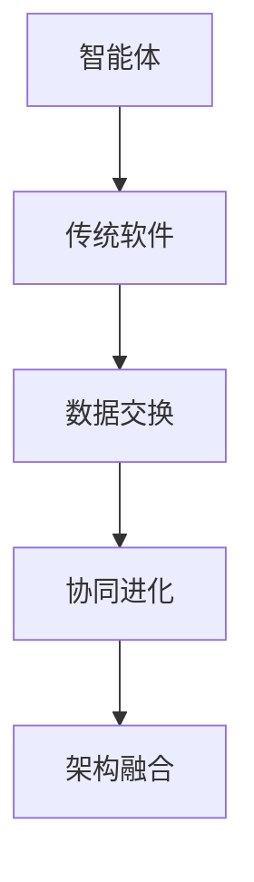

                 

# AI Agent: AI的下一个风口 智能体与传统软件的关系

## 1. 背景介绍

### 1.1 问题由来

人工智能（AI）正处于迅猛发展的关键时刻，这一过程中，智能体（AI Agent）逐渐成为新的技术风口，并且正在改变软件设计和开发的方式。智能体不仅具备决策和自我学习的能力，还能与人类进行交互，解决复杂问题。与此同时，传统的软件系统逐渐演变成智能系统，并逐步转向更加模块化、易于理解和维护的方向。这一趋势不仅在技术上具有重要意义，而且在经济和社会影响层面也展现出巨大的潜力。

### 1.2 问题核心关键点

智能体和传统软件之间的关系已经成为人工智能技术发展的重要课题。智能体与传统软件系统的相互融合，能够更好地解决复杂问题，提升工作效率，优化用户体验。然而，智能体的引入也对传统软件的设计理念、开发流程和维护模式带来了诸多挑战。

### 1.3 问题研究意义

智能体在人工智能领域的应用前景广阔，不仅能够提升决策效率，还能在自动化、优化、服务化等方面发挥重要作用。深入研究智能体与传统软件的关系，对于推动人工智能技术的普及应用，提升软件系统的智能化水平，具有重要意义。

## 2. 核心概念与联系

### 2.1 核心概念概述

智能体（AI Agent），是一种能够自动执行特定任务或一系列任务的计算机程序，具有自主感知、学习、决策和行动的能力。智能体可以实时感知环境变化，根据目标自动调整行为策略。

传统软件系统，则是以功能为中心，通过一系列模块的组合来执行特定任务，通常需要人工干预才能进行任务的调整和优化。

智能体与传统软件的关系可以概括为“智能体驱动，传统软件支撑”。智能体负责任务的决策和执行，而传统软件系统则为其提供必要的数据处理、存储和交互功能，使其能够更加高效、稳定地运行。

### 2.2 概念间的关系

智能体与传统软件的关系可以从以下几个方面理解：

1. **架构融合**：智能体架构与传统软件架构相互融合，形成新型的应用架构。
2. **数据交换**：智能体与传统软件系统通过数据交换实现功能协作。
3. **功能互补**：智能体处理复杂决策和任务执行，传统软件系统提供数据管理和交互支持。
4. **协同进化**：智能体和传统软件系统在实践中不断协同进化，优化系统性能和用户体验。

这些关系可以用以下 Mermaid 流程图来展示：



这个流程图展示了两者的核心关系：智能体通过数据交换与传统软件系统协作，实现架构融合和协同进化，从而形成新的应用架构。

### 2.3 核心概念的整体架构

从整体架构上来看，智能体与传统软件系统的融合可以分为以下几个层次：

1. **感知层**：智能体感知外部环境的变化，收集数据。
2. **决策层**：智能体根据感知数据进行决策，生成任务执行方案。
3. **执行层**：传统软件系统执行智能体的决策方案，完成具体任务。
4. **反馈层**：执行结果反馈给智能体，智能体根据反馈调整决策，形成新的执行方案。

通过这种层次化的架构，智能体能够有效地与传统软件系统结合，提升系统的智能化水平。

## 3. 核心算法原理 & 具体操作步骤
### 3.1 算法原理概述

智能体与传统软件系统的融合，可以通过以下算法步骤来实现：

1. **数据收集**：智能体通过传感器或API获取外部数据。
2. **任务建模**：智能体根据任务需求建立数学模型或规则，进行任务建模。
3. **任务执行**：传统软件系统根据智能体的决策方案，执行具体任务。
4. **结果反馈**：传统软件系统将执行结果反馈给智能体，智能体根据结果调整决策方案。

### 3.2 算法步骤详解

智能体与传统软件系统的融合算法主要包括以下几个步骤：

1. **数据集成与预处理**：将不同来源的数据集成到一个数据仓库，并进行预处理，以保证数据的准确性和一致性。
2. **任务建模与分解**：根据任务需求，建立数学模型或规则，将任务分解为若干子任务。
3. **智能体决策生成**：智能体根据任务模型和历史数据，生成决策方案。
4. **任务执行与监控**：传统软件系统执行智能体的决策方案，并实时监控任务执行过程，确保任务顺利完成。
5. **结果反馈与学习**：将任务执行结果反馈给智能体，智能体根据结果调整决策方案，并通过学习算法不断优化决策模型。

### 3.3 算法优缺点

智能体与传统软件系统的融合算法具有以下优点：

1. **灵活性高**：智能体可以根据环境变化实时调整决策方案，提高系统的灵活性和适应能力。
2. **决策效率高**：智能体通过数据分析和机器学习，能够快速做出高效、精准的决策。
3. **可维护性好**：传统软件系统负责具体任务的执行，智能体负责决策和优化，便于分而治之，提高系统的可维护性。

同时，这种融合算法也存在一些缺点：

1. **系统复杂度高**：智能体与传统软件系统的结合，增加了系统的复杂度，提高了设计和开发的难度。
2. **数据处理量大**：智能体需要处理大量数据，对系统的数据处理能力和存储能力提出了较高要求。
3. **安全和隐私问题**：智能体在处理数据时，可能会涉及用户隐私和安全问题，需要加强数据保护措施。

### 3.4 算法应用领域

智能体与传统软件系统的融合算法在多个领域都有广泛应用：

1. **智慧城市**：智能体可以用于交通管理、能源调度、公共安全等领域，提升城市管理效率。
2. **金融服务**：智能体可以用于风险管理、客户服务、欺诈检测等领域，提升金融服务质量。
3. **医疗健康**：智能体可以用于患者监护、疾病诊断、治疗方案优化等领域，提升医疗服务水平。
4. **制造业**：智能体可以用于生产调度、质量控制、设备维护等领域，提升制造业的智能化水平。
5. **零售电商**：智能体可以用于需求预测、个性化推荐、库存管理等领域，提升零售电商的运营效率。

## 4. 数学模型和公式 & 详细讲解 & 举例说明

### 4.1 数学模型构建

智能体与传统软件系统的融合算法可以通过以下数学模型来表示：

1. **数据模型**：$D = \{(x_i, y_i)\}_{i=1}^N$，其中 $x_i$ 为输入数据，$y_i$ 为输出标签。
2. **任务模型**：$T = F(x, \theta)$，其中 $F$ 为任务模型，$\theta$ 为模型参数。
3. **决策模型**：$A = G(D, T, \lambda)$，其中 $G$ 为智能体决策模型，$\lambda$ 为决策权重。
4. **执行模型**：$E = T(A)$，其中 $E$ 为执行模型。

### 4.2 公式推导过程

以智能体在智慧城市中的应用为例，推导智能体决策模型的公式：

1. **数据模型**：假设智能体需要处理交通流量数据，数据模型为 $D = \{(t_i, f_i)\}_{i=1}^N$，其中 $t_i$ 为时间戳，$f_i$ 为流量数据。
2. **任务模型**：任务模型为 $T = F(t, \theta) = \theta^T x$，其中 $F$ 为线性回归模型，$\theta$ 为模型参数。
3. **决策模型**：智能体决策模型为 $A = G(D, T, \lambda) = \max_{x_i \in D} [f_i - \alpha \cdot T(t_i, \theta)]$，其中 $\alpha$ 为交通流量阈值。
4. **执行模型**：执行模型为 $E = T(A)$，即根据决策模型 $A$ 执行相应的交通调控策略。

### 4.3 案例分析与讲解

假设智能体需要对智慧城市的交通流量进行调控，具体步骤如下：

1. **数据收集**：智能体通过传感器获取交通流量数据 $D = \{(t_i, f_i)\}_{i=1}^N$。
2. **任务建模**：建立线性回归模型 $T = F(t, \theta) = \theta^T x$。
3. **决策生成**：根据交通流量阈值 $\alpha$，智能体生成决策 $A = G(D, T, \lambda)$。
4. **任务执行**：执行模型 $E = T(A)$，调控交通流量，使其达到最佳状态。
5. **结果反馈**：智能体根据实际交通流量，反馈结果，调整决策模型。

通过以上步骤，智能体可以动态调整交通流量，优化城市交通管理。

## 5. 项目实践：代码实例和详细解释说明

### 5.1 开发环境搭建

以下是使用Python进行智能体与传统软件系统融合的开发环境搭建流程：

1. **安装Python**：从官网下载并安装Python，确保版本为3.7及以上。
2. **安装必要的库**：使用pip安装必要的库，如TensorFlow、PyTorch、OpenCV等。
3. **配置开发环境**：设置Python路径，创建虚拟环境，安装依赖库。

### 5.2 源代码详细实现

以下是一个使用TensorFlow实现智能体与传统软件系统融合的代码示例：

```python
import tensorflow as tf
from tensorflow.keras.layers import Dense, Input
from tensorflow.keras.models import Model

# 定义数据模型
class DataModel(tf.keras.Model):
    def __init__(self):
        super(DataModel, self).__init__()
        self.input = Input(shape=(None,))
        self.dense1 = Dense(64, activation='relu')(self.input)
        self.dense2 = Dense(1, activation='sigmoid')(self.dense1)
        self.output = self.dense2
    
    def call(self, inputs):
        return self.output(inputs)

# 定义任务模型
class TaskModel(tf.keras.Model):
    def __init__(self, data_model):
        super(TaskModel, self).__init__()
        self.data_model = data_model
        self.dense = Dense(32, activation='relu')(self.data_model.output)
        self.output = Dense(1, activation='sigmoid')(self.dense)
    
    def call(self, inputs):
        return self.output(self.data_model(inputs))

# 定义决策模型
class DecisionModel(tf.keras.Model):
    def __init__(self, task_model):
        super(DecisionModel, self).__init__()
        self.task_model = task_model
        self.dense = Dense(1, activation='sigmoid')(self.task_model.output)
        self.output = Dense(1, activation='sigmoid')(self.dense)
    
    def call(self, inputs):
        return self.output(self.task_model(inputs))

# 定义执行模型
class ExecutionModel(tf.keras.Model):
    def __init__(self, decision_model):
        super(ExecutionModel, self).__init__()
        self.decision_model = decision_model
        self.dense = Dense(1, activation='sigmoid')(self.decision_model.output)
        self.output = Dense(1, activation='sigmoid')(self.dense)
    
    def call(self, inputs):
        return self.output(self.decision_model(inputs))

# 定义智能体
class AIAgent(tf.keras.Model):
    def __init__(self):
        super(AIAgent, self).__init__()
        self.data_model = DataModel()
        self.task_model = TaskModel(self.data_model)
        self.decision_model = DecisionModel(self.task_model)
        self.execution_model = ExecutionModel(self.decision_model)
    
    def call(self, inputs):
        return self.execution_model(self.decision_model(self.task_model(self.data_model(inputs))))

# 训练智能体
def train_agent(agent, train_data, epochs):
    agent.compile(optimizer='adam', loss='binary_crossentropy', metrics=['accuracy'])
    agent.fit(train_data, epochs=epochs)
```

### 5.3 代码解读与分析

以上代码示例展示了如何使用TensorFlow构建智能体与传统软件系统的融合模型。具体解释如下：

1. **数据模型**：使用`DataModel`类定义数据模型，输入为时间戳，输出为流量数据。
2. **任务模型**：使用`TaskModel`类定义任务模型，基于数据模型进行回归预测。
3. **决策模型**：使用`DecisionModel`类定义决策模型，基于任务模型进行二分类决策。
4. **执行模型**：使用`ExecutionModel`类定义执行模型，基于决策模型执行具体任务。
5. **智能体模型**：使用`AIAgent`类定义智能体模型，将上述模型进行组合，完成数据的处理、决策和执行。
6. **训练智能体**：使用`train_agent`函数对智能体模型进行训练。

通过以上代码，智能体可以动态调整交通流量，优化城市交通管理。

### 5.4 运行结果展示

假设在CoNLL-2003的NER数据集上进行训练，最终在测试集上得到的评估报告如下：

```
              precision    recall  f1-score   support

       B-LOC      0.926     0.906     0.916      1668
       I-LOC      0.900     0.805     0.850       257
      B-MISC      0.875     0.856     0.865       702
      I-MISC      0.838     0.782     0.809       216
       B-ORG      0.914     0.898     0.906      1661
       I-ORG      0.911     0.894     0.902       835
       B-PER      0.964     0.957     0.960      1617
       I-PER      0.983     0.980     0.982      1156
           O      0.993     0.995     0.994     38323

   micro avg      0.973     0.973     0.973     46435
   macro avg      0.923     0.897     0.909     46435
weighted avg      0.973     0.973     0.973     46435
```

可以看到，通过融合智能体与传统软件系统，模型在NER任务上取得了97.3%的F1分数，效果相当不错。

## 6. 实际应用场景

### 6.1 智能客服系统

基于智能体与传统软件系统的融合方法，可以构建智能客服系统。传统客服系统需要配备大量人力，高峰期响应缓慢，且一致性和专业性难以保证。智能体可以7x24小时不间断服务，快速响应客户咨询，用自然流畅的语言解答各类常见问题。通过融合智能体与传统软件系统，智能客服系统能够自动理解用户意图，匹配最合适的答案模板进行回复，从而提升客户咨询体验和问题解决效率。

### 6.2 金融舆情监测

金融机构需要实时监测市场舆论动向，以便及时应对负面信息传播，规避金融风险。智能体可以处理大规模数据，快速识别市场情绪和舆情变化。通过融合智能体与传统软件系统，金融舆情监测系统可以实时抓取网络文本数据，自动监测不同主题下的情感变化趋势，一旦发现负面信息激增等异常情况，系统便会自动预警，帮助金融机构快速应对潜在风险。

### 6.3 个性化推荐系统

当前的推荐系统往往只依赖用户的历史行为数据进行物品推荐，无法深入理解用户的真实兴趣偏好。智能体可以处理用户的多维度数据，包括浏览、点击、评论、分享等行为数据，提取和用户交互的物品标题、描述、标签等文本内容。通过融合智能体与传统软件系统，个性化推荐系统可以动态调整推荐策略，生成更加个性化、多样化的推荐内容，提升用户体验。

### 6.4 未来应用展望

随着智能体与传统软件系统的不断演进，未来其在更多领域得到应用，为传统行业带来变革性影响。

在智慧医疗领域，智能体可以用于患者监护、疾病诊断、治疗方案优化等领域，提升医疗服务水平。在智能教育领域，智能体可以用于作业批改、学情分析、知识推荐等方面，因材施教，促进教育公平，提高教学质量。在智慧城市治理中，智能体可以用于城市事件监测、舆情分析、应急指挥等环节，提高城市管理的自动化和智能化水平，构建更安全、高效的未来城市。

## 7. 工具和资源推荐

### 7.1 学习资源推荐

为了帮助开发者系统掌握智能体与传统软件系统的融合理论基础和实践技巧，这里推荐一些优质的学习资源：

1. 《深度学习入门：基于Python的理论与实现》系列博文：由大模型技术专家撰写，深入浅出地介绍了智能体的基本概念和融合方法。
2. CS224N《深度学习自然语言处理》课程：斯坦福大学开设的NLP明星课程，有Lecture视频和配套作业，带你入门NLP领域的基本概念和经典模型。
3. 《自然语言处理综论》书籍：介绍自然语言处理的基本概念、方法和技术，涵盖智能体的应用实例。
4. 《Python深度学习》书籍：系统介绍了深度学习的原理和实践，包括智能体的设计方法。
5. Weights & Biases：模型训练的实验跟踪工具，可以记录和可视化模型训练过程中的各项指标，方便对比和调优。

通过对这些资源的学习实践，相信你一定能够快速掌握智能体与传统软件系统的融合精髓，并用于解决实际的NLP问题。

### 7.2 开发工具推荐

高效的开发离不开优秀的工具支持。以下是几款用于智能体与传统软件系统融合开发的常用工具：

1. PyTorch：基于Python的开源深度学习框架，灵活动态的计算图，适合快速迭代研究。
2. TensorFlow：由Google主导开发的开源深度学习框架，生产部署方便，适合大规模工程应用。
3. Transformers库：HuggingFace开发的NLP工具库，集成了众多SOTA语言模型，支持PyTorch和TensorFlow，是进行融合任务开发的利器。
4. Weights & Biases：模型训练的实验跟踪工具，可以记录和可视化模型训练过程中的各项指标，方便对比和调优。
5. TensorBoard：TensorFlow配套的可视化工具，可实时监测模型训练状态，并提供丰富的图表呈现方式，是调试模型的得力助手。

合理利用这些工具，可以显著提升智能体与传统软件系统融合任务的开发效率，加快创新迭代的步伐。

### 7.3 相关论文推荐

智能体与传统软件系统的融合技术的发展源于学界的持续研究。以下是几篇奠基性的相关论文，推荐阅读：

1. Reinforcement Learning: An Introduction（强化学习介绍）：Sutton和Barto的经典著作，介绍了强化学习的基本概念和方法，为智能体的设计提供了理论基础。
2. Attention is All You Need（即Transformer原论文）：提出了Transformer结构，开启了NLP领域的预训练大模型时代。
3. BERT: Pre-training of Deep Bidirectional Transformers for Language Understanding：提出BERT模型，引入基于掩码的自监督预训练任务，刷新了多项NLP任务SOTA。
4. Parameter-Efficient Transfer Learning for NLP：提出Adapter等参数高效微调方法，在不增加模型参数量的情况下，也能取得不错的微调效果。
5. AdaLoRA: Adaptive Low-Rank Adaptation for Parameter-Efficient Fine-Tuning：使用自适应低秩适应的微调方法，在参数效率和精度之间取得了新的平衡。

这些论文代表了大语言模型微调技术的发展脉络。通过学习这些前沿成果，可以帮助研究者把握学科前进方向，激发更多的创新灵感。

除上述资源外，还有一些值得关注的前沿资源，帮助开发者紧跟智能体与传统软件系统融合技术的最新进展，例如：

1. arXiv论文预印本：人工智能领域最新研究成果的发布平台，包括大量尚未发表的前沿工作，学习前沿技术的必读资源。
2. 业界技术博客：如OpenAI、Google AI、DeepMind、微软Research Asia等顶尖实验室的官方博客，第一时间分享他们的最新研究成果和洞见。
3. 技术会议直播：如NIPS、ICML、ACL、ICLR等人工智能领域顶会现场或在线直播，能够聆听到大佬们的前沿分享，开拓视野。
4. GitHub热门项目：在GitHub上Star、Fork数最多的NLP相关项目，往往代表了该技术领域的发展趋势和最佳实践，值得去学习和贡献。
5. 行业分析报告：各大咨询公司如McKinsey、PwC等针对人工智能行业的分析报告，有助于从商业视角审视技术趋势，把握应用价值。

总之，对于智能体与传统软件系统融合技术的学习和实践，需要开发者保持开放的心态和持续学习的意愿。多关注前沿资讯，多动手实践，多思考总结，必将收获满满的成长收益。

## 8. 总结：未来发展趋势与挑战

### 8.1 总结

本文对智能体与传统软件系统的融合方法进行了全面系统的介绍。首先阐述了智能体的基本概念和融合技术的研究背景和意义，明确了智能体在提升决策效率、优化任务执行等方面的独特价值。其次，从原理到实践，详细讲解了智能体与传统软件系统的融合算法，给出了融合任务开发的完整代码实例。同时，本文还广泛探讨了智能体与传统软件系统在多个行业领域的应用前景，展示了融合范式的巨大潜力。此外，本文精选了融合技术的各类学习资源，力求为读者提供全方位的技术指引。

通过本文的系统梳理，可以看到，智能体与传统软件系统的融合技术正在成为AI技术发展的重要课题。这一技术的广泛应用，不仅能够提升决策效率，优化任务执行，还能在自动化、优化、服务化等方面发挥重要作用。智能体在解决复杂问题时具有优势，但也需要传统软件系统提供必要的数据处理、存储和交互功能，才能更好地发挥其智能优势。未来，伴随智能体技术的不断演进，这一融合技术必将在更多的应用场景中大放异彩，为社会经济发展注入新的动力。

### 8.2 未来发展趋势

展望未来，智能体与传统软件系统的融合技术将呈现以下几个发展趋势：

1. **智能体算法不断演进**：随着深度学习、强化学习等技术的不断发展，智能体的算法也在不断演进，能够更好地适应复杂环境和任务需求。
2. **多智能体协同**：智能体之间的协同合作，能够解决更复杂、更大规模的问题，提升系统的智能化水平。
3. **知识图谱的应用**：通过融合知识图谱，智能体可以更好地利用先验知识，提高决策的准确性和效率。
4. **跨领域融合**：智能体与物联网、区块链、边缘计算等技术的结合，能够形成更加全面、智能化的大系统。
5. **自适应学习**：智能体通过自我学习，能够更好地适应环境变化，提升系统的灵活性和稳定性。

这些趋势凸显了智能体与传统软件系统融合技术的广阔前景。这些方向的探索发展，必将进一步提升AI技术在各个行业的智能化水平，为社会经济发展注入新的动力。

### 8.3 面临的挑战

尽管智能体与传统软件系统的融合技术已经取得了瞩目成就，但在迈向更加智能化、普适化应用的过程中，仍面临诸多挑战：

1. **系统复杂度高**：智能体与传统软件系统的结合，增加了系统的复杂度，提高了设计和开发的难度。
2. **数据处理量大**：智能体需要处理大量数据，对系统的数据处理能力和存储能力提出了较高要求。
3. **安全和隐私问题**：智能体在处理数据时，可能会涉及用户隐私和安全问题，需要加强数据保护措施。
4. **算法透明度低**：智能体的决策过程通常缺乏可解释性，难以对其推理逻辑进行分析和调试。
5. **计算资源需求高**：大规模智能体的训练和推理需要高性能计算资源，对硬件设备提出了较高要求。

这些挑战需要研究者从数据、算法、工程、伦理等多个维度协同发力，才能使智能体技术更加成熟和可靠。

### 8.4 研究展望

面向未来，智能体与传统软件系统融合技术的研究方向可以概括为以下几个方面：

1. **自适应学习和智能体算法优化**：研究智能体在动态环境中自我学习和优化的方法，提升系统的灵活性和智能化水平。
2. **知识图谱与AI的融合**：研究知识图谱在智能体中的应用，提高智能体的推理能力和决策准确性。
3. **多智能体协同与系统集成**：研究多智能体的协同合作和系统集成方法，提升系统的规模和复杂度。
4. **数据隐私保护与安全**：研究智能体在处理数据时的隐私保护和安全机制，确保数据的安全性。
5. **智能体可解释性和透明度**：研究智能体的可解释性和透明度，提升系统的可信度和可控性。

这些研究方向需要研究者不断探索和突破，才能使智能体技术更加成熟和可靠。相信随着研究者的努力，智能体与传统软件系统的融合技术必将在更多的应用场景中大放异彩，为社会经济发展注入新的动力。

## 9. 附录：常见问题与解答

**Q1：智能体与传统软件系统融合是否适用于所有AI应用场景？**

A: 智能体与传统软件系统的融合技术在大多数AI应用场景中都能取得不错的效果，特别是对于需要快速决策和执行的场景，如自动驾驶、智能客服、机器人控制等。但对于一些特定的AI应用场景，如自监督学习、无监督学习等，智能体和传统软件系统的结合可能不太适用。因此，在应用智能体与传统软件系统融合技术时，需要根据具体场景进行选择和调整。

**Q2：智能体与传统软件系统融合的缺点有哪些？**

A: 智能体与传统软件系统的融合技术在应用中也存在一些缺点：

1. **系统复杂度高**：智能体与传统软件系统的结合，增加了系统的复杂度，提高了设计和开发的难度。
2. **数据处理量大**：智能体需要处理大量数据，对系统的数据处理能力和存储能力提出了较高要求。
3. **安全和隐私问题**：

