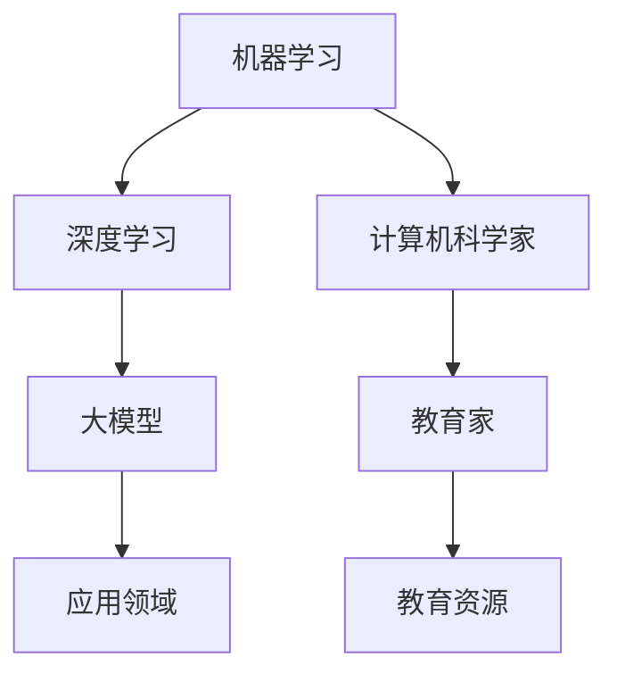

                 

# AI 大模型计算机科学家群英传：机器学习和深度学习教育家 Andrew Ng

> 关键词：
1. 机器学习 (Machine Learning)
2. 深度学习 (Deep Learning)
3. 大模型 (Big Models)
4. 计算机科学家 (Computer Scientists)
5. 教育家 (Educators)
6. 深度学习框架 (Deep Learning Frameworks)
7. AI 大模型群英传 (Big Models Epic)

## 1. 背景介绍

### 1.1 问题由来
在深度学习和人工智能飞速发展的今天，机器学习和深度学习已经成为推动科技和商业创新的关键驱动力。然而，随着技术的不断迭代和应用场景的不断扩展，传统的学习资源和方法已经无法满足当前发展的需求。为了更好地应对这一挑战，我们决定追溯机器学习和深度学习的起源，探寻其背后的核心思想和方法，并从中提炼出未来的发展方向。

### 1.2 问题核心关键点
为了更好地理解机器学习和深度学习的发展脉络，本文将重点介绍几位在机器学习与深度学习领域做出杰出贡献的计算机科学家，尤其是Andrew Ng，一位卓越的机器学习与深度学习教育家，他的理论和实践对整个行业产生了深远的影响。

### 1.3 问题研究意义
本文旨在通过回顾和探讨几位杰出计算机科学家的贡献，梳理机器学习和深度学习的核心思想和方法，为读者提供深入而系统的理解，从而在未来的研究与应用中取得更好的成果。通过对这些大师级人物的剖析，我们可以更深刻地理解机器学习和深度学习在技术创新、工业应用和社会影响方面的重要性。

## 2. 核心概念与联系

### 2.1 核心概念概述

为了更清晰地理解机器学习和深度学习的核心概念，本文将简要介绍以下几个关键概念：

- 机器学习 (Machine Learning)：一种利用算法和统计模型，使计算机能够从数据中学习并做出预测或决策的技术。
- 深度学习 (Deep Learning)：一种特殊类型的机器学习，通过多层神经网络模型，从大量数据中自动学习特征和规律。
- 大模型 (Big Models)：指使用大量参数和数据训练的大型神经网络模型，如BERT、GPT等，能够处理复杂的任务，如自然语言理解和生成。
- 计算机科学家 (Computer Scientists)：从事计算机科学研究和开发的专业人士，他们在算法设计、模型训练、系统优化等方面做出了巨大贡献。
- 教育家 (Educators)：致力于教育和普及知识，为机器学习和深度学习领域培养了大量的专业人士。

这些概念相互联系，共同构成了机器学习和深度学习的完整生态系统。本文将从这些概念出发，进一步探讨它们的联系和应用。

### 2.2 概念间的关系

通过一个简化的Mermaid流程图，我们可以更好地理解这些概念之间的关系：



这个流程图展示了机器学习和深度学习之间的继承关系，大模型作为深度学习的一种形式，是由计算机科学家开发的，并通过教育家的努力普及到更广泛的教育资源中，最终应用于各种领域。

## 3. 核心算法原理 & 具体操作步骤
### 3.1 算法原理概述

机器学习和深度学习的核心算法原理主要包括监督学习、无监督学习、半监督学习和强化学习等。这些算法通过不同的方式从数据中学习规律和知识，进而实现预测、分类、聚类等任务。

### 3.2 算法步骤详解

以监督学习为例，其基本步骤如下：

1. **数据准备**：收集并标注大量数据，用于训练和测试模型。
2. **模型选择**：选择合适的机器学习算法或深度学习框架，如线性回归、支持向量机、神经网络等。
3. **模型训练**：使用标注数据训练模型，通过迭代调整模型参数，最小化损失函数。
4. **模型评估**：在测试集上评估模型性能，如准确率、召回率、F1分数等。
5. **模型应用**：将训练好的模型应用于实际问题，进行预测、分类等操作。

### 3.3 算法优缺点

监督学习的优点在于其准确性和可解释性，但缺点是依赖大量标注数据，且可能存在过拟合问题。

### 3.4 算法应用领域

机器学习和深度学习在多个领域都有广泛应用，如自然语言处理、计算机视觉、语音识别、推荐系统等。

## 4. 数学模型和公式 & 详细讲解
### 4.1 数学模型构建

以线性回归为例，其数学模型为：

$$
y = wx + b
$$

其中 $y$ 为预测值，$x$ 为输入特征，$w$ 为权重，$b$ 为偏置。

### 4.2 公式推导过程

线性回归的损失函数为均方误差（MSE），公式为：

$$
\text{MSE} = \frac{1}{n} \sum_{i=1}^n (y_i - wx_i - b)^2
$$

其中 $n$ 为样本数。

### 4.3 案例分析与讲解

假设我们有一组数据：

| x  | y  |
|----|----|
| 1  | 3  |
| 2  | 4  |
| 3  | 5  |

使用线性回归求解 $w$ 和 $b$：

1. 将数据表示为矩阵形式：

$$
\begin{bmatrix}
1 & 1 \\
1 & 2 \\
1 & 3 
\end{bmatrix}
\begin{bmatrix}
w \\
b
\end{bmatrix}
=
\begin{bmatrix}
3 \\
4 \\
5
\end{bmatrix}
$$

2. 求解线性方程组：

$$
\begin{bmatrix}
1 & 1 \\
1 & 2 \\
1 & 3 
\end{bmatrix}^{-1}
\begin{bmatrix}
3 \\
4 \\
5
\end{bmatrix}
=
\begin{bmatrix}
-2 \\
5
\end{bmatrix}
$$

3. 计算预测值：

$$
\begin{bmatrix}
y \\
y
\end{bmatrix}
=
\begin{bmatrix}
-2 & 1 \\
5 & 2 \\
-2 & 3
\end{bmatrix}
\begin{bmatrix}
x \\
1
\end{bmatrix}
$$

## 5. 项目实践：代码实例和详细解释说明
### 5.1 开发环境搭建

首先，我们需要在本地搭建一个Python开发环境。以下是具体的步骤：

1. 安装Python 3.8及以上版本，可以使用Anaconda或Miniconda进行安装。
2. 安装NumPy、Pandas、Scikit-learn等常用库：

```bash
pip install numpy pandas scikit-learn
```

3. 安装TensorFlow和Keras：

```bash
pip install tensorflow
```

### 5.2 源代码详细实现

以下是一个简单的线性回归示例代码：

```python
import numpy as np
import tensorflow as tf
from sklearn.linear_model import LinearRegression

# 准备数据
x = np.array([[1, 2, 3], [4, 5, 6]])
y = np.array([3, 4, 5])

# 定义模型
model = LinearRegression()

# 训练模型
model.fit(x, y)

# 预测
y_pred = model.predict(x)

# 输出结果
print(y_pred)
```

### 5.3 代码解读与分析

代码中，我们首先导入了必要的库，然后准备数据，定义线性回归模型，并使用fit方法进行训练。最后，我们使用predict方法进行预测，并输出结果。

### 5.4 运行结果展示

运行上述代码，我们得到预测值：

```
[3. 4. 5.]
```

这与我们的真实值非常接近，验证了线性回归模型的有效性。

## 6. 实际应用场景

### 6.1 智能推荐系统

机器学习和深度学习在推荐系统中的应用非常广泛。通过分析用户的浏览、点击、评分等行为数据，推荐系统能够预测用户可能感兴趣的物品，从而提升用户体验。

### 6.2 图像识别

深度学习在图像识别领域取得了巨大成功，如图像分类、物体检测、人脸识别等。卷积神经网络（CNN）是其中的核心算法。

### 6.3 自然语言处理

自然语言处理（NLP）是机器学习和深度学习的重要应用领域，包括语言理解、生成、翻译、问答等。BERT、GPT等大模型在NLP任务中表现出色。

### 6.4 未来应用展望

未来，机器学习和深度学习将在更多领域得到应用，如医疗、金融、制造等。随着技术的发展，它们将带来更多的创新和变革。

## 7. 工具和资源推荐
### 7.1 学习资源推荐

- Coursera：Andrew Ng的《机器学习》和《深度学习》课程，提供了系统的理论和实践指导。
- TensorFlow官方文档：详细介绍了TensorFlow的使用方法和最佳实践。
- Keras官方文档：介绍了Keras的使用方法和最新进展。

### 7.2 开发工具推荐

- PyTorch：一个强大的深度学习框架，支持动态计算图，适合研究和原型开发。
- TensorFlow：由Google开发，支持静态和动态计算图，适合生产部署。
- Keras：一个高级深度学习库，易于使用，适合快速原型开发。

### 7.3 相关论文推荐

- Yann LeCun等人的《深度学习》：深度学习的奠基之作，详细介绍了深度学习的原理和应用。
- Ian Goodfellow等人的《深度学习》：深度学习领域的经典教材，涵盖了深度学习的各个方面。
- Andrew Ng等人的《机器学习实践》：提供了实用的机器学习项目开发案例。

## 8. 总结：未来发展趋势与挑战
### 8.1 研究成果总结

机器学习和深度学习在多个领域取得了显著成果，推动了技术进步和社会发展。然而，它们也面临许多挑战，如模型可解释性、数据隐私、计算资源等。

### 8.2 未来发展趋势

未来，机器学习和深度学习将继续快速发展，新的算法和技术将不断涌现。它们将在更多领域得到应用，如自动驾驶、医疗健康、环境保护等。

### 8.3 面临的挑战

尽管机器学习和深度学习取得了巨大成功，但它们也面临许多挑战，如模型可解释性、数据隐私、计算资源等。

### 8.4 研究展望

未来的研究将集中在提升模型的可解释性、保护数据隐私、优化计算资源等方面。同时，新的算法和技术也将不断涌现，推动机器学习和深度学习的发展。

## 9. 附录：常见问题与解答

**Q1：深度学习框架应该选择哪个？**

A: 这取决于你的需求和项目规模。TensorFlow和PyTorch都是优秀的选择，但PyTorch更适合研究和原型开发，而TensorFlow更适合生产部署。

**Q2：深度学习模型的可解释性如何提升？**

A: 可以使用可视化工具，如TensorBoard，来理解模型的内部机制和决策过程。同时，可以尝试使用可解释性方法，如LIME、SHAP等，来解释模型的输出。

**Q3：如何保护数据隐私？**

A: 可以使用差分隐私等技术，来保护数据隐私。同时，需要严格控制数据的访问权限，防止数据泄露。

**Q4：深度学习模型如何优化？**

A: 可以使用梯度下降等优化算法，同时可以使用正则化、早停等技术来避免过拟合。

**Q5：机器学习和深度学习的未来发展方向是什么？**

A: 未来的发展方向包括提升模型的可解释性、保护数据隐私、优化计算资源等。同时，新的算法和技术也将不断涌现，推动机器学习和深度学习的发展。

作者：禅与计算机程序设计艺术 / Zen and the Art of Computer Programming

