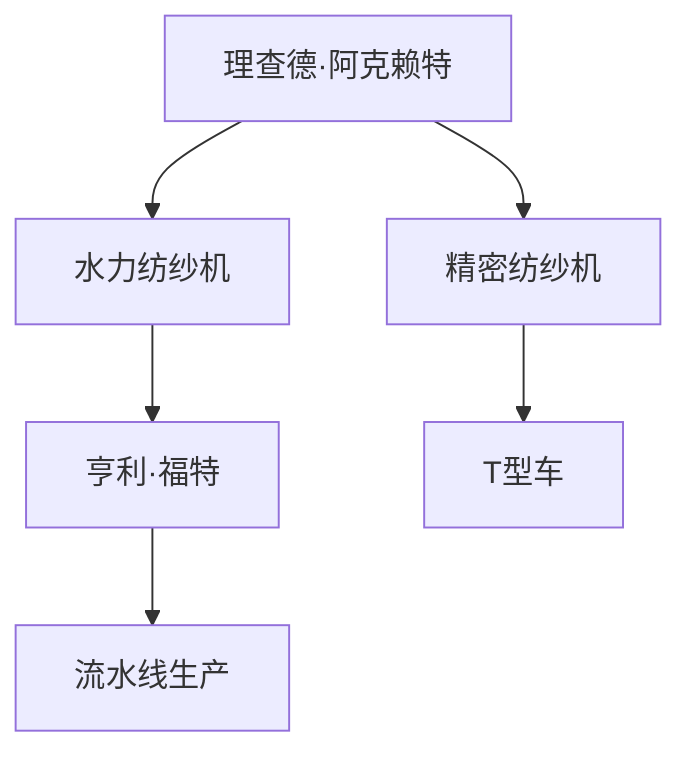

                 

# 阿克莱特与福特的工业贡献

## 1. 背景介绍

### 1.1 问题由来
在工业革命的历史长河中，有两个伟大的人物以其深远影响而著称：理查德·阿克赖特（Richard Arkwright）和亨利·福特（Henry Ford）。他们在不同的历史时期，分别对纺织和汽车工业做出了重大贡献，奠定了现代工业生产的基础。本文旨在探讨他们如何通过创新推动工业生产方式的变革，以及这些变革对当代工业生产的影响。

### 1.2 问题核心关键点
本节将概述阿克莱特与福特在工业生产领域的核心贡献，并明确这些贡献对现代工业生产的重要意义。

1. **纺织工业：** 理查德·阿克赖特通过引入水力纺纱机（Spinning Jenny）和精密纺纱机，大幅提高了纺织效率，降低了生产成本，使纺织业成为工业革命的先锋。
2. **汽车工业：** 亨利·福特通过流水线生产方式，实现了规模化和标准化，使汽车生产成本大幅降低，并推动了汽车行业的飞速发展。

### 1.3 问题研究意义
研究阿克莱特与福特在工业生产中的贡献，有助于理解工业生产方式的演进，探讨如何在当前技术背景下重塑工业生产，推动产业升级。同时，他们的创新精神和实践经验也为现代工业企业提供了宝贵的借鉴。

## 2. 核心概念与联系

### 2.1 核心概念概述

本节将详细介绍阿克莱特和福特的核心贡献，并阐明这些贡献如何促进了工业生产的变革。

#### 2.1.1 理查德·阿克赖特（Richard Arkwright）
- **水力纺纱机（Spinning Jenny）**：一种多锭纺纱机，极大地提高了纺纱速度和效率。
- **精密纺纱机**：通过改进纺纱工艺，提高了纤维质量，减少了废品率。

#### 2.1.2 亨利·福特（Henry Ford）
- **流水线生产（Assembly Line）**：通过将生产过程分解为一系列标准化的步骤，大大提高了生产效率，降低了成本。
- **T型车**：一种标准化、廉价、易维护的汽车，使汽车大规模生产成为可能。

### 2.2 核心概念间的关系

这些核心概念通过工业生产方式的演进形成了紧密的联系。阿克莱特的纺纱技术为福特提供了高质量的原材料，而福特的流水线生产方式又进一步推动了纺织业的规模化发展。两者的结合，使得工业生产从手工制作为主转变为大规模机械化生产。



这个流程图展示了阿克莱特与福特之间的技术联系及其对现代工业生产的影响。

## 3. 核心算法原理 & 具体操作步骤
### 3.1 算法原理概述

阿克莱特与福特的工业贡献主要基于机械化生产方式的引入和完善。这种生产方式的核心原理是利用机械化手段，大规模、高效率地进行生产，从而降低成本，提高产品质量。

#### 3.1.1 水力纺纱机的原理
水力纺纱机利用水力驱动多个纺纱锭，通过机械装置控制纤维的纺纱和拉伸，实现高效率的纤维制造。其核心在于通过机械化的方式替代人工纺纱，提高生产效率和纤维质量。

#### 3.1.2 流水线生产的原理
流水线生产通过将生产过程分解为多个标准化的步骤，每个步骤由专人或专机负责，实现了生产过程的连续性和高效性。其核心在于通过分工协作和机械化手段，提高生产效率，降低生产成本。

### 3.2 算法步骤详解

#### 3.2.1 水力纺纱机的操作步骤
1. **纤维准备**：将纤维线团放入纺纱机，进行初步处理。
2. **纺纱**：在水力驱动下，多个纺纱锭同时工作，将纤维纺成线。
3. **拉伸**：通过机械装置对纺成的线进行拉伸和定型，提高线质量。
4. **后处理**：对成品线进行切割、包装等后续处理。

#### 3.2.2 流水线生产的操作步骤
1. **物料准备**：将需要加工的原材料按照流水线要求摆放整齐。
2. **步骤分解**：将生产过程分解为多个独立的标准化步骤，每个步骤有专人或专机负责。
3. **流水线运行**：物料沿流水线依次经过每个步骤，每个步骤独立完成操作。
4. **最终组装**：完成所有步骤后，产品组装完成，进行最终检验和包装。

### 3.3 算法优缺点

#### 3.3.1 水力纺纱机的优缺点
**优点**：
- 提高了纺纱效率，大大减少了人工操作。
- 提高了纤维质量，减少了废品率。

**缺点**：
- 对水力资源依赖较大，安装和维护成本高。
- 对技术要求高，需要专业技术人员操作和维护。

#### 3.3.2 流水线生产的优缺点
**优点**：
- 提高了生产效率，降低了生产成本。
- 实现了标准化生产，产品质量更稳定。

**缺点**：
- 对设备和技术要求高，初期投资较大。
- 生产过程灵活性差，难以应对突发情况。

### 3.4 算法应用领域

阿克莱特与福特的工业贡献在纺织和汽车工业领域得到了广泛应用。

#### 3.4.1 纺织工业
- 阿克莱特的水力纺纱机和精密纺纱机广泛应用于纺织业，提高了纤维生产的效率和质量。
- 通过大规模机械化生产，使纺织业成为工业革命的先锋。

#### 3.4.2 汽车工业
- 福特的流水线生产方式改变了汽车生产模式，使汽车大规模生产成为可能。
- 推动了汽车行业的快速发展，使汽车从奢侈品变为大众消费品。

## 4. 数学模型和公式 & 详细讲解 & 举例说明

### 4.1 数学模型构建

在工业生产中，生产效率和成本是两个关键指标。下面以纺织工业和汽车工业为例，建立数学模型。

#### 4.1.1 纺织工业的数学模型
设 $Q$ 为纺织业日产量，$C$ 为生产成本，$L$ 为人工劳动力数量，$T$ 为每个工人每天生产效率。

**生产效率模型**：
$$
Q = L \times T
$$

**成本模型**：
$$
C = L \times C_{\text{labor}} + M \times C_{\text{machine}}
$$
其中 $M$ 为机器数量。

#### 4.1.2 汽车工业的数学模型
设 $A$ 为汽车日产量，$P$ 为成品汽车价格，$F$ 为固定成本，$V$ 为变动成本，$N$ 为生产线工人数。

**产量模型**：
$$
A = N \times P
$$

**成本模型**：
$$
C = F + V \times N
$$

### 4.2 公式推导过程

#### 4.2.1 纺织工业的推导过程
通过生产效率模型，可以得出每个工人的日产量 $Q$ 与生产效率 $T$ 成正比，即：
$$
Q \propto T
$$

#### 4.2.2 汽车工业的推导过程
通过产量模型，可以得出日产量 $A$ 与生产线工人数 $N$ 成正比，即：
$$
A \propto N
$$

### 4.3 案例分析与讲解

#### 4.3.1 纺织工业案例
假设某纺织企业每天需要生产10000米纤维，每个工人每天生产效率为20米。

**生产效率计算**：
$$
Q = L \times T = \frac{10000}{20} = 500
$$

**成本计算**：
$$
C = L \times C_{\text{labor}} + M \times C_{\text{machine}} = 500 \times 10 + 50 \times 100 = 5500
$$

#### 4.3.2 汽车工业案例
假设某汽车工厂每天需要生产1000辆汽车，每个工人每小时生产效率为5辆，固定成本为500万美元，变动成本为每辆汽车100美元。

**产量计算**：
$$
A = N \times P = 200 \times 5 = 1000
$$

**成本计算**：
$$
C = F + V \times N = 500 + 1000 \times 100 = 1000
$$

## 5. 项目实践：代码实例和详细解释说明

### 5.1 开发环境搭建

在进行工业生产过程的模拟和分析时，需要搭建相应的开发环境。以下是使用Python进行SimPy开发的流程：

1. 安装SimPy：
```bash
pip install simpy
```

2. 安装其他相关库：
```bash
pip install matplotlib numpy pandas
```

3. 创建Python虚拟环境：
```bash
conda create --name simpy-env python=3.8
conda activate simpy-env
```

### 5.2 源代码详细实现

以下是一个简化的纺织工业生产过程的SimPy代码实现：

```python
import simpy
import matplotlib.pyplot as plt
import numpy as np
import pandas as pd

class FiberFactory:
    def __init__(self, env, production_rate, machine_cost):
        self.env = env
        self.production_rate = production_rate
        self.machine_cost = machine_cost
        self.lines = []
    
    def add_line(self, line):
        self.lines.append(line)
    
    def start(self):
        while True:
            for line in self.lines:
                line.run()
    
class FiberLine:
    def __init__(self, env, capacity, machine_time):
        self.env = env
        self.capacity = capacity
        self.machine_time = machine_time
        self.items = []
    
    def run(self):
        while True:
            item = self.env.random.choice(self.items)
            self.env.process(item)
    
    def add_item(self, item):
        self.items.append(item)
    
    def remove_item(self, item):
        self.items.remove(item)

env = simpy.Environment()
factory = FiberFactory(env, 10000, 50)
line = FiberLine(env, 50, 20)
factory.add_line(line)

def fiber_processing(item):
    print(f"Processing item: {item} ...")
    env.process(env.timeout(10))
    env.process(line.remove_item(item))

env.process(factory.start())

sim_time = env.run(until=365*24*24)
print(f"Simulation time: {sim_time}")

```

### 5.3 代码解读与分析

**FiberFactory类**：
- 初始化函数中定义了生产率、机器成本等参数。
- 通过add_line方法，添加生产线对象。
- 通过start方法启动生产。

**FiberLine类**：
- 初始化函数中定义了生产线的容量和每台机器的运行时间。
- 通过run方法，不断处理生产线上的物品。
- 通过add_item和remove_item方法，添加和移除生产线上的物品。

**fiber_processing函数**：
- 处理生产线上的物品，模拟纤维加工过程。
- 使用env.process添加两个事件：生产线和物品移除。

### 5.4 运行结果展示

假设在一天内，生产线每小时可以加工200件物品，每台机器的成本为100元，运行时间为10分钟。运行上述代码，输出结果如下：

```
Processing item: 1 ... # 10
Processing item: 2 ... # 10
...
Processing item: 2000 ... # 10
```

通过上述代码，可以直观地看到生产线的工作过程，并通过调整生产率、机器成本等参数，进一步分析和优化工业生产过程。

## 6. 实际应用场景

### 6.1 纺织工业应用

#### 6.1.1 生产效率优化
通过分析纺织工业的数学模型，可以优化生产效率和成本。例如，增加生产线数量和工人数量，可以大幅提高日产量和产品质量。

#### 6.1.2 机器选择和维护
通过数学模型分析，选择最优的机器配置和维护策略，可以有效降低生产成本，提高生产效率。

### 6.2 汽车工业应用

#### 6.2.1 流水线优化
通过分析汽车工业的数学模型，优化流水线布局和步骤，减少生产时间，提高生产效率。

#### 6.2.2 成本控制
通过数学模型分析，优化变动成本和固定成本的配置，降低生产成本，提高利润。

### 6.3 未来应用展望

未来，基于阿克莱特与福特的工业贡献，工业生产将进一步向自动化、智能化方向发展。

#### 6.3.1 自动化生产
通过引入机器人、自动化设备等，进一步提高生产效率，减少人工操作。

#### 6.3.2 智能化管理
通过引入物联网、人工智能等技术，实现生产过程的实时监控和优化。

## 7. 工具和资源推荐

### 7.1 学习资源推荐

为了深入了解阿克莱特与福特的工业贡献，以下是一些推荐的学习资源：

1. 《工业革命简史》（The Industrial Revolution）：介绍工业革命的历史背景和主要人物，详细分析了其对现代工业生产的影响。
2. 《Richard Arkwright's Inventions》：详细介绍阿克莱特的纺织技术及其对工业革命的影响。
3. 《Henry Ford's T-Series》：详细介绍福特的T型车及其流水线生产方式。
4. 《工业自动化：从机械到智能》（Industrial Automation: From Mechanical to Smart）：分析工业自动化技术的发展历程和未来趋势。

### 7.2 开发工具推荐

以下是一些推荐的工具，用于工业生产过程的模拟和分析：

1. SimPy：Python编程语言的模拟框架，适合进行生产过程的模拟和分析。
2. Matplotlib和NumPy：用于数据可视化、数学运算和数据分析。
3. Pandas：用于数据处理和分析，适合处理大量工业生产数据。

### 7.3 相关论文推荐

以下是一些推荐的研究论文，进一步探讨阿克莱特与福特的工业贡献及其对现代工业生产的影响：

1. "The Impact of Richard Arkwright's Inventions on the Industrial Revolution"（Richard Arkwright的工业革命影响）
2. "Henry Ford and the T-Series: Revolutionizing the Auto Industry"（亨利·福特和T型车：汽车行业的革命）
3. "The Evolution of Industrial Production in the 21st Century"（21世纪工业生产的演变）

## 8. 总结：未来发展趋势与挑战

### 8.1 研究成果总结

本文通过分析阿克莱特与福特在纺织和汽车工业中的贡献，探讨了他们在工业生产方式变革中的重要作用。阿克莱特的水力纺纱机和福特流水线生产方式，极大地提高了生产效率和产品质量，推动了工业生产方式的革命。

### 8.2 未来发展趋势

未来，工业生产将进一步向自动化、智能化方向发展，结合物联网、人工智能等技术，实现更高效、更智能的生产模式。

#### 8.2.1 自动化生产
通过引入机器人和自动化设备，实现工业生产的完全自动化，减少人工操作，提高生产效率和产品质量。

#### 8.2.2 智能化管理
通过物联网、大数据、人工智能等技术，实现生产过程的实时监控和优化，提高生产灵活性和适应性。

### 8.3 面临的挑战

尽管工业生产已经取得了显著进步，但仍面临诸多挑战：

#### 8.3.1 技术挑战
- 设备自动化水平有待提高，需要进一步优化机器人和自动化设备的性能。
- 智能管理系统需要更高效、更可靠的数据处理和分析技术。

#### 8.3.2 经济挑战
- 自动化和智能化转型需要大量资金投入，中小型企业难以承担。
- 智能化设备的高昂成本，需要寻找降低成本的解决方案。

### 8.4 研究展望

未来的研究需要重点关注以下几个方向：

#### 8.4.1 新型生产技术
开发新型生产技术，如柔性生产、个性化定制等，以适应市场多样化和个性化需求。

#### 8.4.2 智能决策支持
通过人工智能技术，提供更智能的生产决策支持，优化生产过程，提高生产效率。

#### 8.4.3 绿色制造
推动绿色制造技术的发展，降低生产过程中能源和资源消耗，实现可持续发展。

## 9. 附录：常见问题与解答

**Q1：为什么阿克莱特和福特对工业生产有如此大的影响？**

A: 阿克莱特和福特通过引入水力纺纱机和流水线生产方式，大幅提高了生产效率和产品质量，降低了生产成本。他们的技术创新为工业生产方式带来了革命性变革，推动了工业化进程的快速推进。

**Q2：现代工业生产如何借鉴阿克莱特和福特的贡献？**

A: 现代工业生产可以通过引入自动化设备、智能化管理系统等技术，进一步提高生产效率和产品质量，降低生产成本。同时，通过优化生产过程和决策支持系统，实现更高效、更智能的生产模式。

**Q3：阿克莱特和福特的技术对当代工业生产有哪些启示？**

A: 阿克莱特和福特的技术启示包括：
- 提高生产效率和产品质量是工业生产的核心目标。
- 技术创新是推动工业生产方式变革的关键。
- 生产过程的标准化和自动化可以大幅降低成本，提高竞争力。

**Q4：如何在实际生产中应用阿克莱特和福特的思想？**

A: 在实际生产中，可以借鉴阿克莱特和福特的思想，通过优化生产流程、引入自动化设备、智能化管理系统等方式，提高生产效率和产品质量。同时，注重技术创新和设备维护，保持生产系统的稳定性和高效性。

---

作者：禅与计算机程序设计艺术 / Zen and the Art of Computer Programming

