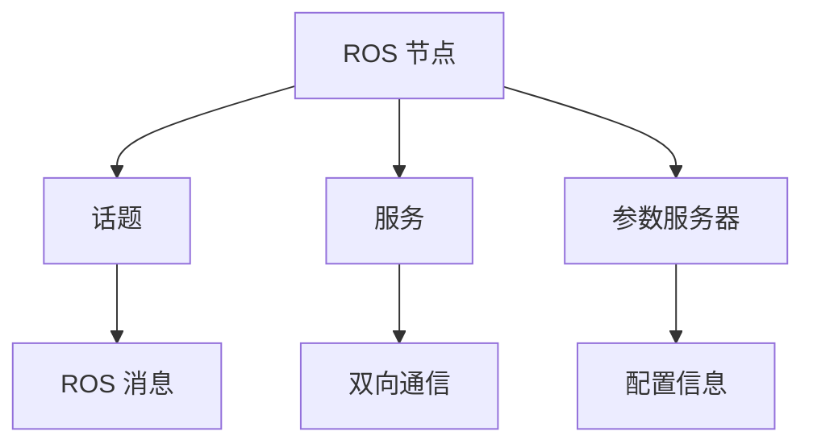

                 

# Robot Operating System (ROS) 原理与代码实战案例讲解

> 关键词：ROS, 机器人, 编程, 感知与控制, 案例分析, 开发工具, 学习资源

## 1. 背景介绍

### 1.1 问题由来
Robot Operating System (ROS) 是一种专门为机器人编程设计的开源操作系统，它提供了一系列的工具和库，用于构建、调试和测试机器人应用。ROS 最初由斯坦福大学机器人实验室的研发团队开发，并逐步成为机器人领域的事实标准。近年来，ROS 不断更新迭代，不仅支持多传感器融合、移动操作、视觉定位、导航等功能，还扩展到了自主移动机器人、服务机器人、无人机、智能家居等领域，成为全球机器人研究与应用的核心基础设施。

### 1.2 问题核心关键点
ROS 的核心优势在于其模块化、灵活性和开放性。模块化设计使得 ROS 能够方便地实现各个功能的分离与组合；灵活性体现在 ROS 支持多种编程语言，能够满足不同机器人的需求；开放性则是 ROS 社区不断扩展、贡献者众多，能够快速获取最新资源和支持。然而，ROS 学习曲线较陡峭，对于初学者来说有一定门槛，尤其在使用复杂系统时，调试和优化也较为困难。

### 1.3 问题研究意义
深入理解 ROS 原理，掌握其在实际项目中的应用，对于机器人领域的开发者和研究人员来说至关重要。掌握 ROS 不仅能够提升机器人系统的开发效率，还能灵活地应对各种复杂的机器人场景。此外，ROS 的原理与应用还能够帮助开发人员理解机器人感知与控制的核心技术，如 SLAM、路径规划、避障等，从而在更高层次上推动机器人技术的发展。

## 2. 核心概念与联系

### 2.1 核心概念概述

为了更好地理解 ROS 的基本概念和原理，本节将介绍几个关键概念，并展示其间的联系：

- **ROS 节点(Node)**: ROS 中的基本运行单元，负责执行特定的功能。每个节点通过发布话题和订阅话题与其他节点通信。
- **话题(Topic)**: ROS 节点之间通过话题进行数据传输。话题可以理解为一种数据流，发布者向话题发布数据，订阅者从话题接收数据。
- **服务(Server)**: ROS 节点之间通过服务进行双向通信。服务提供者接收客户端的请求并返回响应。
- **参数服务器(Parameter Server)**: ROS 节点中的配置信息存放在参数服务器上，可以通过参数名称查找和设置参数值。
- **ROS 包(Package)**: ROS 支持模块化编程，将功能打包成独立的包，便于管理和共享。
- **ROS 消息(Message)**: ROS 中的数据交换单位，类似于 C++ 中的结构体。

这些概念之间的关系可以用以下 Mermaid 流程图来展示：



### 2.2 概念间的关系

这些核心概念构成了 ROS 系统的基本框架。每个节点通过话题和服务进行通信，从参数服务器中获取配置信息，并以 ROS 消息的形式与其他节点交换数据。ROS 包则用于封装和管理这些模块，使得 ROS 系统具有高度的可复用性和可扩展性。

## 3. 核心算法原理 & 具体操作步骤

### 3.1 算法原理概述

ROS 的算法原理主要基于分布式计算和事件驱动编程。每个节点通过话题进行数据发布和订阅，形成了一个高度松耦合的分布式系统。服务则是实现节点之间双向通信的重要手段。参数服务器用于存储和管理全局配置信息，节点通过其获取运行参数。

### 3.2 算法步骤详解

以下是 ROS 系统的主要步骤：

**Step 1: 搭建 ROS 环境**

1. 安装 ROS 安装程序包
2. 创建 ROS 工作空间
3. 克隆所需 ROS 包

**Step 2: 创建 ROS 节点**

1. 创建节点文件，包括发布话题、订阅话题、发布服务、订阅服务等
2. 在节点文件中进行数据处理和逻辑实现
3. 编译节点并生成可执行文件

**Step 3: 启动 ROS 节点**

1. 启动节点，通过话题和服务进行通信
2. 在参数服务器中设置节点参数
3. 监控节点状态和输出数据

### 3.3 算法优缺点

ROS 的优点在于其模块化、灵活性和开放性，能够适应各种机器人场景，支持多种编程语言，具有高度的可复用性。但 ROS 的缺点也较为明显，包括学习曲线较陡峭，系统复杂度高，调试和优化难度较大。此外，由于其分布式特性，ROS 系统也面临着消息队列阻塞、网络延迟等问题。

### 3.4 算法应用领域

ROS 的应用领域广泛，涵盖机器人、自主移动平台、无人机、智能家居等多个领域。它支持多传感器融合、路径规划、视觉定位、避障等功能，能够构建各种机器人应用系统。此外，ROS 还被用于军事、航空航天、教育等领域，成为机器人领域的事实标准。

## 4. 数学模型和公式 & 详细讲解 & 举例说明

### 4.1 数学模型构建

ROS 中的节点、话题、服务、参数服务器和消息都是基于数据的对象，每个对象都有自己的数据结构和生命周期管理。节点之间通过话题进行通信，话题的发布者和订阅者之间存在着一对多或多对一的关系。服务则是实现双向通信的机制，服务提供者和客户端通过服务进行交互。

### 4.2 公式推导过程

ROS 中的话题和服务的交互可以表示为：

$$
\text{Publisher} \rightarrow \text{Topic} \rightarrow \text{Subscriber}
$$

其中，$\text{Publisher}$ 为话题的发布者，$\text{Subscriber}$ 为话题的订阅者。话题作为数据流，将 $\text{Publisher}$ 发布的数据传输给 $\text{Subscriber}$。

### 4.3 案例分析与讲解

假设我们有一个简单的 ROS 系统，用于实现一个简单的移动机器人导航功能。

1. 创建一个ROS节点，用于发布机器人的位置和速度信息。
2. 创建一个ROS节点，用于订阅机器人的位置和速度信息，并计算导航路径。
3. 创建一个ROS服务，用于设置机器人的速度和方向。

使用代码实现上述功能：

```python
from sensor_msgs.msg import Odometry
from nav_msgs.msg import Odometry
from nav_msgs.msg import Odometry
from tf.transformations import euler_from_quaternion

class RobotNode:
    def __init__(self):
        self.odom = Odometry()
        self.vel_pub = rospy.Publisher('/robot/velocity', Odometry, queue_size=10)
        self.vel_sub = rospy.Subscriber('/robot/velocity', Odometry, self.vel_callback)

    def vel_callback(self, data):
        self.odom.header = data.header
        self.odom.child_frame_id = 'base_link'
        self.odom.pose.pose.position.x = data.pose.pose.position.x
        self.odom.pose.pose.position.y = data.pose.pose.position.y
        self.odom.pose.pose.position.z = 0.0
        self.odom.pose.pose.orientation = data.pose.pose.orientation
        self.odom.pose.pose.orientation.x = data.pose.pose.orientation.x
        self.odom.pose.pose.orientation.y = data.pose.pose.orientation.y
        self.odom.pose.pose.orientation.z = data.pose.pose.orientation.z
        self.odom.pose.pose.orientation.w = data.pose.pose.orientation.w
        self.vel_pub.publish(self.odom)

if __name__ == "__main__":
    rospy.init_node('robot_node', anonymous=True)
    robot = RobotNode()
    rospy.spin()
```

## 5. 项目实践：代码实例和详细解释说明

### 5.1 开发环境搭建

要搭建 ROS 开发环境，需要遵循以下步骤：

1. 安装 ROS 安装程序包：从官网下载 ROS 安装程序包，并按照说明进行安装。
2. 创建 ROS 工作空间：在工作目录下创建 ROS 工作空间，包括 catkin、build、src 和 cmake 等子目录。
3. 克隆所需 ROS 包：通过 ROS 包管理工具（如 catkin_make）克隆所需的 ROS 包，并将其添加到 src 目录中。
4. 配置 ROS 环境：在 ROS 配置文件（如 .bashrc、.bash_profile）中添加 ROS 环境变量。

### 5.2 源代码详细实现

下面以一个简单的 ROS 节点为例，展示其详细实现过程。

**节点名称**：robot_node，用于发布机器人的位置和速度信息。

```python
from sensor_msgs.msg import Odometry
from nav_msgs.msg import Odometry
from tf.transformations import euler_from_quaternion

class RobotNode:
    def __init__(self):
        self.odom = Odometry()
        self.vel_pub = rospy.Publisher('/robot/velocity', Odometry, queue_size=10)
        self.vel_sub = rospy.Subscriber('/robot/velocity', Odometry, self.vel_callback)

    def vel_callback(self, data):
        self.odom.header = data.header
        self.odom.child_frame_id = 'base_link'
        self.odom.pose.pose.position.x = data.pose.pose.position.x
        self.odom.pose.pose.position.y = data.pose.pose.position.y
        self.odom.pose.pose.position.z = 0.0
        self.odom.pose.pose.orientation = data.pose.pose.orientation
        self.odom.pose.pose.orientation.x = data.pose.pose.orientation.x
        self.odom.pose.pose.orientation.y = data.pose.pose.orientation.y
        self.odom.pose.pose.orientation.z = data.pose.pose.orientation.z
        self.odom.pose.pose.orientation.w = data.pose.pose.orientation.w
        self.vel_pub.publish(self.odom)

if __name__ == "__main__":
    rospy.init_node('robot_node', anonymous=True)
    robot = RobotNode()
    rospy.spin()
```

### 5.3 代码解读与分析

在上述代码中，我们定义了一个名为 RobotNode 的 ROS 节点，其主要功能包括：

1. 创建 Odometry 对象，用于存储机器人的位置和速度信息。
2. 创建一个名为 vel_pub 的发布话题，用于发布机器人的位置和速度信息。
3. 创建一个名为 vel_sub 的订阅话题，用于接收其他节点发布的位置和速度信息。
4. 实现一个 vel_callback 函数，用于处理订阅到的消息，并将其存储在 Odometry 对象中。
5. 在节点启动时，调用 vel_callback 函数。

### 5.4 运行结果展示

运行上述 ROS 节点后，可以在 ROS 中看到机器人位置和速度的实时输出。在 ROS 界面中，可以通过话题管理器（rostopic）查看话题的状态，确认节点是否正确发布和订阅数据。

## 6. 实际应用场景

### 6.1 智能无人车

智能无人车是 ROS 应用的重要场景之一。通过 ROS，可以方便地实现无人车的传感器融合、路径规划、避障等功能。智能无人车在自动驾驶、物流配送、环境监控等领域具有广泛的应用前景。

### 6.2 无人机

ROS 被广泛应用于无人机的自主飞行和路径规划。通过 ROS，可以方便地实现无人机的控制、避障、任务调度等功能。无人机在军事侦察、农业植保、灾害救援等领域具有重要的应用价值。

### 6.3 服务机器人

服务机器人是 ROS 在服务行业的重要应用方向。通过 ROS，可以方便地实现服务机器人的路径规划、语音识别、智能问答等功能。服务机器人在教育、医疗、物流等领域具有广泛的应用前景。

### 6.4 未来应用展望

随着机器人技术的不断进步，ROS 将会在更多的领域发挥重要作用。未来的 ROS 系统可能会更加智能、灵活和可扩展，能够实现更高层次的自动化和智能化。例如，ROS 可能会结合深度学习、强化学习等技术，实现更加复杂的机器人应用场景。此外，ROS 系统还可能会与其他人工智能技术进行更深入的融合，如视觉定位、路径规划等，推动机器人技术的发展。

## 7. 工具和资源推荐

### 7.1 学习资源推荐

要深入学习 ROS，可以参考以下学习资源：

1. ROS 官方文档：ROS 官方文档提供了全面的系统介绍和 API 文档，是学习 ROS 的重要参考资料。
2. ROS 教程：ROS 官网提供了一系列教程，涵盖ROS系统安装、节点编程、话题服务等基础内容。
3. ROS 课程：Coursera、Udemy、edX等在线教育平台提供了大量的 ROS 课程，涵盖ROS系统开发、高级编程、实用技巧等内容。
4. ROS 社区：ROS 社区提供了丰富的学习资源，包括博客、视频、论文等，是获取最新信息和技术支持的良好渠道。

### 7.2 开发工具推荐

以下是 ROS 开发中常用的开发工具：

1. Catkin：Catkin 是 ROS 的包管理工具，用于构建、编译和管理 ROS 包。
2. ROS Navigator：ROS Navigator 是一个基于 ROS 的导航软件，提供了丰富的地图和工具，用于实现无人车的路径规划和避障。
3. Gazebo：Gazebo 是一个基于 ROS 的仿真环境，用于模拟机器人环境和进行传感器测试。
4. RViz：RViz 是 ROS 的可视化工具，用于查看和操作 ROS 系统中的数据。

### 7.3 相关论文推荐

以下是一些与 ROS 相关的经典论文，推荐阅读：

1. ROS：An open-source toolkit for robotics：ROS 系统设计与实现的论文，介绍了 ROS 的核心架构和主要功能。
2. A Survey of Robot Operating System（ROS）in Robotics：ROS 系统的综述论文，总结了 ROS 在机器人领域的应用和发展。
3. ROS 2：The next generation of the Robot Operating System：ROS 2 系统的介绍和设计，强调了 ROS 2 系统的可扩展性和并发性。

## 8. 总结：未来发展趋势与挑战

### 8.1 研究成果总结

ROS 系统自推出以来，已经在机器人领域得到了广泛应用，成为机器人研究与应用的核心基础设施。通过ROS系统，开发者可以方便地实现各种机器人应用，提升了机器人系统的开发效率。

### 8.2 未来发展趋势

未来 ROS 系统可能会朝着以下几个方向发展：

1. ROS 2：ROS 2 系统更加注重可扩展性和并发性，能够支持大规模、高实时性的机器人应用。
2. 分布式 ROS：分布式 ROS 系统能够支持多机器人协同工作，提升系统的协作能力和应用范围。
3. 跨平台支持：ROS 系统可能会支持更多平台和硬件，提升系统的可移植性和可扩展性。
4. 深度学习结合：ROS 系统可能会结合深度学习、强化学习等技术，实现更加复杂的机器人应用场景。
5. 人工智能融合：ROS 系统可能会与其他人工智能技术进行更深入的融合，提升系统的智能化和自动化水平。

### 8.3 面临的挑战

尽管 ROS 系统已经取得了显著成果，但仍面临以下挑战：

1. 学习曲线较陡峭：ROS 系统的复杂性使得初学者需要较长的时间才能掌握其基本原理和编程方法。
2. 系统复杂度高：ROS 系统涉及的话题、服务、参数等众多组件，增加了系统的复杂性和调试难度。
3. 网络延迟和阻塞：ROS 系统中的消息队列可能出现阻塞和延迟，影响系统的实时性。
4. 资源消耗高：ROS 系统需要占用大量的 CPU 和内存资源，限制了其在资源受限环境中的应用。

### 8.4 研究展望

面对 ROS 系统面临的挑战，未来的研究需要在以下几个方面寻求新的突破：

1. 简化学习曲线：通过编写简单易懂的教程和示例，帮助初学者快速入门 ROS 系统。
2. 优化系统架构：优化 ROS 系统的组件和数据流，减少系统的复杂性和调试难度。
3. 提升网络性能：优化消息队列和管理机制，提升系统的实时性和稳定性。
4. 降低资源消耗：优化 ROS 系统的资源使用，提高系统的可移植性和可扩展性。

总之，ROS 系统在未来机器人领域仍将发挥重要作用，其不断优化和升级，将为机器人技术的发展提供更坚实的基础。

## 9. 附录：常见问题与解答

**Q1：ROS 系统学习曲线较陡峭，初学者应该如何入门？**

A: 初学者可以按照以下步骤逐步掌握 ROS 系统：

1. 学习 ROS 基础：从 ROS 官方教程入手，学习 ROS 的基本概念和编程方法。
2. 编写小项目：逐步编写小的 ROS 项目，了解 ROS 的核心功能和组件。
3. 参考开源项目：参考开源 ROS 项目，了解实际应用场景和解决方案。
4. 加入社区：加入 ROS 社区，获取技术支持和交流学习经验。

**Q2：ROS 系统中的话题和服务如何实现双向通信？**

A: ROS 系统中的服务通过调用和响应来实现双向通信。服务提供者使用 ROS service 的 publish 和 subscribe 方法，将服务信息发布到话题上。服务客户端使用 ROS service 的 call 方法，向话题上请求服务信息，并在收到响应后进行后续处理。

**Q3：ROS 系统中的参数服务器如何管理全局配置信息？**

A: ROS 系统中的参数服务器用于存储和管理全局配置信息，每个 ROS 节点通过参数名称获取和设置参数值。参数服务器使用参数命名空间（namespace）来组织参数，节点可以在不同的命名空间中查找和设置参数值。

**Q4：ROS 系统中的话题如何实现数据传输？**

A: ROS 系统中的话题是用于数据传输的消息流。话题的发布者和订阅者之间通过话题进行数据传输。发布者使用 ROS publisher 的 publish 方法，将数据发布到话题上。订阅者使用 ROS subscriber 的 subscribe 方法，订阅话题并处理数据。

**Q5：ROS 系统中的节点如何实现多线程通信？**

A: ROS 系统中的节点可以同时订阅多个话题，并使用多线程处理数据。在节点代码中，可以创建多个订阅话题的实例，并在不同的线程中处理数据。同时，节点可以使用回调函数（callback function）和信号量（semaphore）等机制，实现数据的异步处理和线程同步。

