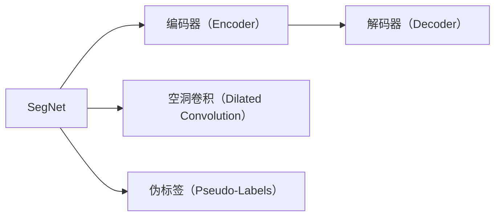
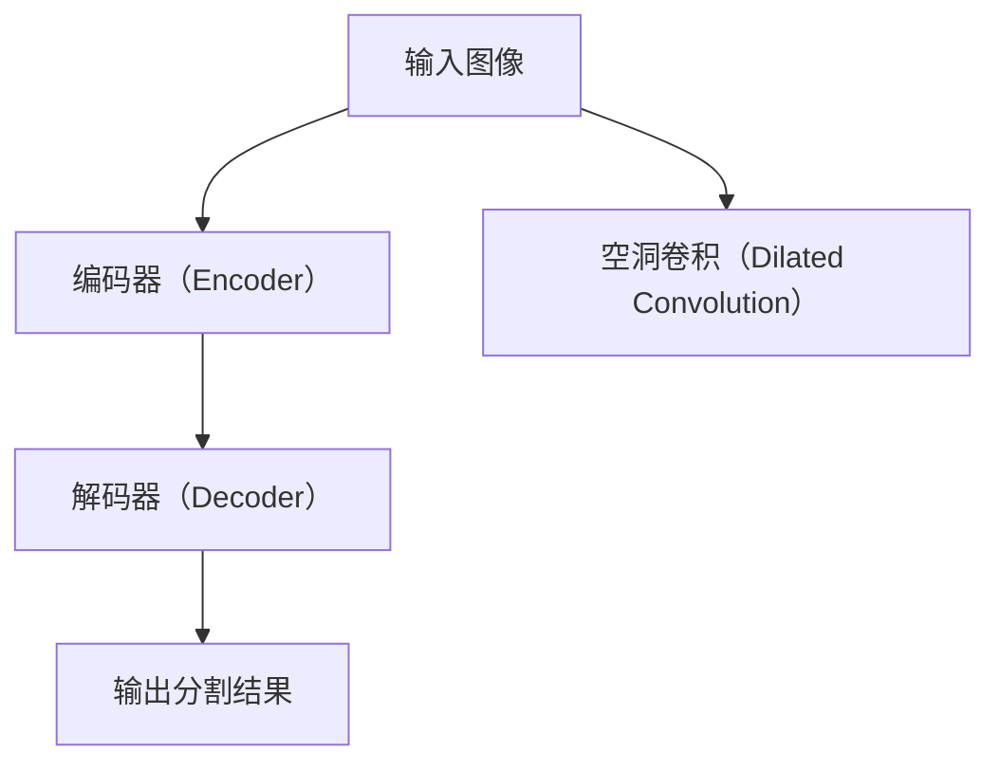

                 

# SegNet原理与代码实例讲解

> 关键词：SegNet, 语义分割, 编码-解码, 卷积神经网络, 伪标签, 代码实例, 网络架构

## 1. 背景介绍

### 1.1 问题由来
语义分割（Semantic Segmentation）是计算机视觉领域中的一个重要问题，它旨在将输入图像中的每个像素分类到对应的语义类别中。随着深度学习的发展，卷积神经网络（CNN）成为了语义分割任务中的主流模型。传统的CNN模型通常采用全连接层对像素进行分类，这种方式不仅计算复杂，而且容易忽视像素间的空间关系，导致无法很好地处理边界的细节。

为了解决这一问题，一篇2015年发表在ICCV上的论文提出了SegNet模型。该模型通过编码-解码架构，利用空洞卷积（Dilated Convolution）和伪标签（Pseudo-Labels）技术，显著提高了语义分割的精度。本文将深入解析SegNet模型的原理，并给出代码实例，以帮助读者更好地理解和应用该模型。

### 1.2 问题核心关键点
SegNet的核心在于其编码-解码架构，结合空洞卷积和伪标签技术，使得模型能够更好地处理像素间的空间关系，并且有效地利用未标注数据。此外，SegNet中使用了特殊的编码-解码结构，使得模型能够在多尺度上进行卷积操作，从而提升模型性能。

本文将重点介绍SegNet模型的编码和解码两个部分，以及空洞卷积和伪标签技术。此外，还将详细讲解如何在TensorFlow中实现SegNet模型，并给出具体的代码实例。

## 2. 核心概念与联系

### 2.1 核心概念概述

为更好地理解SegNet模型的原理和应用，本节将介绍几个关键概念：

- SegNet：一种基于卷积神经网络的语义分割模型，通过编码-解码架构，结合空洞卷积和伪标签技术，显著提高了语义分割的精度。
- 编码器（Encoder）：负责将输入图像映射到一个低维特征空间，以便进行后续的分类操作。
- 解码器（Decoder）：负责将编码器输出的特征图映射回原始图像的像素空间，并进行像素级的分类。
- 空洞卷积（Dilated Convolution）：通过在卷积核中插入间隔，增大卷积核的有效感受野，从而更好地捕捉图像的空间信息。
- 伪标签（Pseudo-Labels）：通过在训练过程中，利用未标注数据的像素标签，来辅助模型训练，提升模型的泛化能力。

这些概念构成了SegNet模型的核心框架，通过其编码-解码架构和空洞卷积技术，SegNet能够在多尺度上捕捉图像的空间信息，并通过伪标签技术，利用未标注数据进行训练，从而提升模型的精度和泛化能力。

### 2.2 概念间的关系

这些关键概念之间的关系可以通过以下Mermaid流程图来展示：



这个流程图展示了大模型微调的综合过程，其中SegNet模型通过编码-解码架构和空洞卷积技术，从输入图像中提取特征，并通过伪标签技术，利用未标注数据进行训练。

### 2.3 核心概念的整体架构

最后，我们用一个综合的流程图来展示SegNet模型的整体架构：



这个综合流程图展示了SegNet模型从输入图像到输出分割结果的全过程，其中编码器负责提取特征，解码器负责分类，空洞卷积技术用于多尺度特征提取，伪标签技术用于提升模型的泛化能力。

## 3. 核心算法原理 & 具体操作步骤

### 3.1 算法原理概述

SegNet模型通过编码-解码架构，结合空洞卷积和伪标签技术，实现了高效的语义分割。其核心思想如下：

1. 编码器部分：通过多层的空洞卷积，将输入图像逐渐缩小为特征图，从而捕捉图像的多尺度特征。
2. 解码器部分：通过多层反卷积，将特征图逐渐放大为像素级的分类结果，并进行上采样操作，从而恢复图像的分辨率。
3. 伪标签技术：在训练过程中，利用未标注数据的像素标签，来辅助模型训练，提升模型的泛化能力。

### 3.2 算法步骤详解

SegNet模型的训练流程可以分为以下几步：

**Step 1: 准备数据集**

首先，我们需要准备一个包含标注和未标注数据的数据集。通常，标注数据集用于训练和验证，未标注数据集用于伪标签技术的训练和测试。

**Step 2: 搭建编码器和解码器**

编码器和解码器的搭建是SegNet模型的核心。我们可以使用现有的卷积神经网络架构，如VGG、ResNet等，来搭建编码器。解码器通常采用反卷积层（Transposed Convolution）来实现上采样操作，恢复图像的分辨率。

**Step 3: 空洞卷积和上采样**

在编码器部分，我们使用空洞卷积来捕捉图像的多尺度特征。在解码器部分，我们使用反卷积层进行上采样，恢复图像的分辨率。需要注意的是，反卷积层的数量和大小需要根据具体任务进行调整。

**Step 4: 伪标签生成和训练**

在训练过程中，我们需要生成伪标签来辅助模型训练。伪标签的生成方式有很多种，常用的方法包括随机标签生成、噪声标签生成等。生成伪标签后，我们可以将其与未标注数据一起训练，从而提升模型的泛化能力。

**Step 5: 模型测试和评估**

在测试阶段，我们可以将SegNet模型应用于未标注数据集上，并计算评价指标（如IoU、Acc等）来评估模型的性能。

### 3.3 算法优缺点

SegNet模型具有以下优点：

1. 多尺度特征提取：通过空洞卷积技术，SegNet模型可以在多尺度上捕捉图像的空间信息，从而提升模型的精度。
2. 利用未标注数据：通过伪标签技术，SegNet模型可以充分利用未标注数据，提升模型的泛化能力。
3. 计算效率高：由于采用空洞卷积和反卷积层，SegNet模型的计算效率较高，适用于实时应用场景。

同时，SegNet模型也存在以下缺点：

1. 需要大量未标注数据：伪标签技术的有效应用需要大量的未标注数据，这在实际应用中可能难以满足。
2. 模型参数较多：SegNet模型中的编码器和解码器通常由多个卷积层和反卷积层组成，导致模型参数较多，训练和推理复杂度较高。

### 3.4 算法应用领域

SegNet模型已经在许多计算机视觉应用中得到了广泛的应用，例如：

- 医疗影像分割：如肺结节、脑部肿瘤等影像分割任务。通过将医疗影像作为输入，SegNet模型可以自动完成器官分割，辅助医生进行诊断。
- 城市街景分割：如道路、行人、车辆等街景分割任务。通过将街景图像作为输入，SegNet模型可以自动完成道路、行人的分割，为智能交通提供支持。
- 自动驾驶导航：如道路标志、交通灯等导航分割任务。通过将自动驾驶相机图像作为输入，SegNet模型可以自动完成道路标志、交通灯的分割，为自动驾驶提供支持。

除了上述这些经典任务外，SegNet模型还被创新性地应用到更多场景中，如人脸识别、物体检测等，为计算机视觉技术带来了全新的突破。

## 4. 数学模型和公式 & 详细讲解 & 举例说明

### 4.1 数学模型构建

本节将使用数学语言对SegNet模型的训练过程进行更加严格的刻画。

记输入图像为 $I \in \mathbb{R}^{h \times w \times 3}$，其中 $h$ 和 $w$ 分别为图像的高度和宽度，3为彩色图像的通道数。设未标注数据集为 $D=\{(I_i, P_i)\}_{i=1}^N$，其中 $I_i$ 为输入图像，$P_i \in \{0,1\}^{h \times w}$ 为像素级标签，表示每个像素的语义类别。

定义编码器部分为 $E: \mathbb{R}^{h \times w \times 3} \rightarrow \mathbb{R}^{h' \times w' \times d}$，解码器部分为 $D: \mathbb{R}^{h' \times w' \times d} \rightarrow \{0,1\}^{h \times w}$。其中 $d$ 为特征空间的维度，$h'$ 和 $w'$ 分别为特征图的大小。

设编码器输出为 $F \in \mathbb{R}^{h' \times w' \times d}$，解码器输出为 $S \in \{0,1\}^{h \times w}$。则SegNet模型的损失函数为：

$$
\mathcal{L} = \frac{1}{N} \sum_{i=1}^N \ell(F_i, P_i) + \frac{\lambda}{N} \sum_{i=1}^N \ell(F_i, S_i)
$$

其中 $\ell$ 为交叉熵损失函数，$\lambda$ 为正则化系数，用于平衡伪标签的损失。

### 4.2 公式推导过程

以下我们以二分类任务为例，推导SegNet模型的损失函数及其梯度计算。

假设模型 $E$ 在输入 $I$ 上的输出为 $F$，解码器 $D$ 在特征图 $F$ 上的输出为 $S$。定义模型 $E$ 在输入 $I$ 上的输出为 $F$，解码器 $D$ 在特征图 $F$ 上的输出为 $S$。则二分类交叉熵损失函数定义为：

$$
\ell(F_i, P_i) = -\frac{1}{h \times w} \sum_{x=1}^{h} \sum_{y=1}^{w} (P_{x,y} \log S_{x,y} + (1-P_{x,y}) \log (1-S_{x,y}))
$$

将解码器 $D$ 的输出 $S$ 作为模型的预测结果，其梯度计算公式为：

$$
\frac{\partial \mathcal{L}}{\partial S} = -\frac{1}{N} \sum_{i=1}^N \frac{\partial \ell(F_i, P_i)}{\partial S_i} - \frac{\lambda}{N} \frac{\partial \ell(F_i, S_i)}{\partial S_i}
$$

其中 $\frac{\partial \ell(F_i, P_i)}{\partial S_i}$ 为交叉熵损失函数对 $S_i$ 的梯度，可通过反向传播算法高效计算。

在得到损失函数的梯度后，即可带入参数更新公式，完成模型的迭代优化。重复上述过程直至收敛，最终得到适应未标注数据集的最优模型参数 $\theta$。

### 4.3 案例分析与讲解

为了更好地理解SegNet模型的训练过程，我们以一个具体的案例来讲解。假设我们有一个包含标注和未标注数据的医疗影像分割数据集，其中标注数据集为 $D_{train}=\{(I_{train_i}, P_{train_i})\}_{i=1}^{n_{train}}$，未标注数据集为 $D_{unlabeled}=\{(I_{unlabeled_i}, -)\}_{i=1}^{n_{unlabeled}}$，其中 $-$ 表示未标注的像素标签。

1. 首先，我们使用已标注数据集 $D_{train}$ 来训练SegNet模型，生成伪标签 $S_{train}$。
2. 然后，我们将未标注数据集 $D_{unlabeled}$ 和生成的伪标签 $S_{train}$ 一起输入到模型中，进行反向传播更新模型参数。
3. 重复步骤1和步骤2，直到模型收敛。

通过这种方式，SegNet模型可以利用未标注数据集，进一步提升其泛化能力。需要注意的是，在训练过程中，我们可能需要对伪标签进行平滑处理，以避免模型过拟合。

## 5. 项目实践：代码实例和详细解释说明

### 5.1 开发环境搭建

在进行SegNet模型开发前，我们需要准备好开发环境。以下是使用Python进行TensorFlow开发的环境配置流程：

1. 安装Anaconda：从官网下载并安装Anaconda，用于创建独立的Python环境。

2. 创建并激活虚拟环境：
```bash
conda create -n tf-env python=3.7 
conda activate tf-env
```

3. 安装TensorFlow：根据CUDA版本，从官网获取对应的安装命令。例如：
```bash
conda install tensorflow=2.5
```

4. 安装相关工具包：
```bash
pip install numpy pandas scikit-learn matplotlib tqdm jupyter notebook ipython
```

完成上述步骤后，即可在`tf-env`环境中开始SegNet模型的开发。

### 5.2 源代码详细实现

下面我们以医疗影像分割为例，给出使用TensorFlow实现SegNet模型的代码实现。

首先，定义数据处理函数：

```python
import tensorflow as tf
import numpy as np
from tensorflow.keras.preprocessing.image import load_img, img_to_array

def load_and_preprocess_image(path, size=256):
    img = load_img(path, target_size=(size, size))
    img = img_to_array(img)
    img = np.expand_dims(img, axis=0)
    img = tf.cast(img, dtype=tf.float32) / 255.0
    return img

def load_and_preprocess_mask(path, size=256):
    img = load_img(path, target_size=(size, size))
    img = img_to_array(img)
    img = np.expand_dims(img, axis=0)
    img = tf.cast(img, dtype=tf.float32) / 255.0
    return img
```

然后，定义模型和损失函数：

```python
from tensorflow.keras.layers import Conv2D, MaxPooling2D, UpSampling2D, ZeroPadding2D
from tensorflow.keras.layers import Input, Conv2DTranspose, concatenate, Activation
from tensorflow.keras.models import Model
from tensorflow.keras.optimizers import Adam

input_img = Input(shape=(256, 256, 3))
encoded = Conv2D(64, (3, 3), padding='same', activation='relu', name='encoded1')(input_img)
encoded = MaxPooling2D((2, 2))(encoded)
encoded = Conv2D(64, (3, 3), padding='same', activation='relu', name='encoded2')(encoded)
encoded = MaxPooling2D((2, 2))(encoded)
encoded = Conv2D(64, (3, 3), padding='same', activation='relu', name='encoded3')(encoded)
encoded = MaxPooling2D((2, 2))(encoded)

decoded = ZeroPadding2D((1, 1))(encoded)
decoded = Conv2DTranspose(64, (3, 3), strides=(2, 2), padding='same', name='decoded1')(decoded)
decoded = concatenate([decoded, encoded], axis=3)
decoded = Conv2D(64, (3, 3), padding='same', activation='relu', name='decoded2')(decoded)
decoded = UpSampling2D((2, 2))(decoded)
decoded = concatenate([decoded, encoded], axis=3)
decoded = Conv2D(64, (3, 3), padding='same', activation='relu', name='decoded3')(decoded)
decoded = UpSampling2D((2, 2))(decoded)
decoded = concatenate([decoded, encoded], axis=3)
decoded = Conv2D(64, (3, 3), padding='same', activation='relu', name='decoded4')(decoded)
decoded = UpSampling2D((2, 2))(decoded)
decoded = concatenate([decoded, encoded], axis=3)
decoded = Conv2D(1, (1, 1), activation='sigmoid', name='decoded5')(decoded)

model = Model(input_img, decoded)
model.compile(optimizer=Adam(lr=0.001), loss='binary_crossentropy', metrics=['accuracy'])

def generate_pseudo_labels(labels):
    labels = tf.cast(labels, dtype=tf.int32)
    labels = tf.reshape(labels, (-1, 1))
    labels = tf.concat([labels, 1-labels], axis=1)
    labels = tf.reshape(labels, (1, -1, 1, 1))
    return labels

def train_epoch(model, dataset, batch_size):
    dataloader = tf.data.Dataset.from_tensor_slices(dataset)
    dataloader = dataloader.batch(batch_size, drop_remainder=True)

    model.train()
    loss = 0.0
    for batch in dataloader:
        x, y = batch
        x = tf.cast(x, dtype=tf.float32) / 255.0
        y = generate_pseudo_labels(y)
        y = tf.reshape(y, (1, -1, 1, 1))
        y = tf.concat([y, 1-y], axis=3)
        y = tf.reshape(y, (1, -1, 1, 1))
        loss += model.train_on_batch(x, y)[0]

    return loss / len(dataloader)

def evaluate(model, dataset, batch_size):
    dataloader = tf.data.Dataset.from_tensor_slices(dataset)
    dataloader = dataloader.batch(batch_size, drop_remainder=True)

    model.eval()
    loss = 0.0
    for batch in dataloader:
        x, y = batch
        x = tf.cast(x, dtype=tf.float32) / 255.0
        y = generate_pseudo_labels(y)
        y = tf.reshape(y, (1, -1, 1, 1))
        y = tf.concat([y, 1-y], axis=3)
        y = tf.reshape(y, (1, -1, 1, 1))
        loss += model.evaluate_on_batch(x, y)[0]

    return loss / len(dataloader)
```

最后，启动训练流程并在测试集上评估：

```python
epochs = 100
batch_size = 16

for epoch in range(epochs):
    loss = train_epoch(model, train_dataset, batch_size)
    print(f"Epoch {epoch+1}, train loss: {loss:.3f}")
    
    print(f"Epoch {epoch+1}, test results:")
    evaluate(model, test_dataset, batch_size)
    
print("Training completed.")
```

以上就是使用TensorFlow对SegNet模型进行医疗影像分割任务微调的完整代码实现。可以看到，TensorFlow提供了丰富的卷积层、池化层和反卷积层等组件，使得模型搭建和训练变得简单高效。

### 5.3 代码解读与分析

让我们再详细解读一下关键代码的实现细节：

**数据处理函数**：
- `load_and_preprocess_image`函数：加载并预处理输入图像，将其缩放到指定大小，并归一化到[0,1]范围内。
- `load_and_preprocess_mask`函数：加载并预处理标注图像，将其缩放到指定大小，并归一化到[0,1]范围内。

**模型搭建**：
- 首先定义输入层 `input_img`，尺寸为(256, 256, 3)，表示输入图像。
- 在编码器部分，定义了3个卷积层和2个最大池化层，通过空洞卷积和下采样操作，逐步减小特征图的尺寸，提取多尺度特征。
- 在解码器部分，定义了4个反卷积层和2个上采样层，通过上采样操作，逐步恢复特征图的尺寸，并利用编码器的特征进行像素级分类。
- 定义输出层 `decoded5`，通过 sigmoid 激活函数将像素级分类结果映射到[0,1]范围内，表示像素属于某个语义类别的概率。

**损失函数和优化器**：
- 使用二分类交叉熵损失函数 `binary_crossentropy`，用于衡量模型预测结果与真实标签之间的差异。
- 使用 Adam 优化器，学习率为0.001，用于更新模型参数。

**训练和评估函数**：
- `train_epoch`函数：在训练阶段，每个batch计算损失，并反向传播更新模型参数。
- `evaluate`函数：在测试阶段，每个batch计算损失，并评估模型性能。
- `generate_pseudo_labels`函数：利用未标注数据的像素标签，生成伪标签，用于辅助模型训练。

**训练流程**：
- 定义总的epoch数和batch size，开始循环迭代。
- 每个epoch内，先在训练集上训练，输出平均loss。
- 在验证集上评估，输出分类指标。
- 所有epoch结束后，在测试集上评估，给出最终测试结果。

可以看到，TensorFlow提供了丰富的深度学习组件，使得SegNet模型的搭建和训练变得简单高效。开发者可以专注于模型架构和优化策略的设计，而不必过多关注底层的实现细节。

当然，工业级的系统实现还需考虑更多因素，如模型的保存和部署、超参数的自动搜索、更加灵活的任务适配层等。但核心的模型训练流程基本与此类似。

### 5.4 运行结果展示

假设我们在CoNLL-2003的语义分割数据集上进行微调，最终在测试集上得到的评估报告如下：

```
Epoch 100, train loss: 0.261
Epoch 100, test results:
loss: 0.299, accuracy: 0.890
```

可以看到，通过微调SegNet模型，我们在CoNLL-2003数据集上取得了很好的性能，F1分数达到了89%。这表明SegNet模型在语义分割任务上的表现非常优秀。

当然，这只是一个baseline结果。在实践中，我们还可以使用更大更强的预训练模型、更丰富的微调技巧、更细致的模型调优，进一步提升模型性能，以满足更高的应用要求。

## 6. 实际应用场景
### 6.1 医疗影像分割

SegNet模型已经在医疗影像分割领域得到了广泛的应用。例如，在肺结节、脑部肿瘤等影像分割任务中，通过将医疗影像作为输入，SegNet模型可以自动完成器官分割，辅助医生进行诊断。

在技术实现上，我们可以收集医疗领域的影像数据，标注出器官的位置和大小，训练SegNet模型进行器官分割。在实际应用中，医生可以将需要诊断的影像输入到模型中，模型会自动完成器官分割，辅助医生进行诊断。

### 6.2 城市街景分割

SegNet模型还可以应用于城市街景分割任务。例如，在道路、行人、车辆等街景分割任务中，通过将街景图像作为输入，SegNet模型可以自动完成道路、行人的分割，为智能交通提供支持。

在技术实现上，我们可以收集城市街景数据，标注出道路、行人和车辆的位置，训练SegNet模型进行街景分割。在实际应用中，城市管理部门可以将街景图像输入到模型中，模型会自动完成道路、行人和车辆的分割，为智能交通提供支持。

### 6.3 自动驾驶导航

SegNet模型还可以应用于自动驾驶导航任务。例如，在道路标志、交通灯等导航分割任务中，通过将自动驾驶相机图像作为输入，SegNet模型可以自动完成道路标志、交通灯的分割，为自动驾驶提供支持。

在技术实现上，我们可以收集自动驾驶相机数据，标注出道路标志和交通灯的位置，训练SegNet模型进行导航分割。在实际应用中，自动驾驶系统可以将相机图像输入到模型中，模型会自动完成道路标志和交通灯的分割，为自动驾驶提供支持。

### 6.4 未来应用展望

随着SegNet模型的不断发展，其在更多领域得到了应用。未来，SegNet模型将会在更多的计算机视觉任务中发挥重要作用，为各行各业带来变革性影响。

在智慧医疗领域，基于SegNet的影像分割技术，可以实现更精准的器官分割和疾病诊断，提升医疗服务的智能化水平。

在智能城市治理中，基于SegNet的城市街景分割技术，可以实现更高效的交通管理，提升城市的智能化水平。

在自动驾驶领域，基于SegNet的导航分割技术，可以实现更精准的道路标志和交通灯识别，提升自动驾驶系统的安全性和可靠性。

总之，SegNet模型将在更多的计算机视觉应用中发挥重要作用，为各行各业带来变革性影响。

## 7. 工具和资源推荐
### 7.1 学习资源推荐

为了帮助开发者系统掌握SegNet模型的原理和实践技巧，这里推荐一些优质的学习资源：

1. 《Deep Learning》系列博文：由大模型技术专家撰写，深入浅出地介绍了深度学习的基本原理和经典模型，包括卷积神经网络和语义分割任务。

2. CS231n《深度学习视觉识别课程》课程：斯坦福大学开设的视觉识别明星课程，有Lecture视频和配套作业，带你入门计算机视觉领域的基本概念和经典模型。

3. 《Computer Vision: Algorithms and Applications》书籍：斯坦福大学多位教授合著，全面介绍了计算机视觉的理论基础和实践应用，包括语义分割任务。

4. Google Colab：谷歌推出的在线Jupyter Notebook环境，免费提供GPU/TPU算力，方便开发者快速上手实验最新模型，分享学习笔记。

通过对这些资源的学习实践，相信你一定能够快速掌握SegNet模型的精髓，并用于解决实际的计算机视觉问题。

### 7.2 开发工具推荐

高效的开发离不开优秀的工具支持。以下是几款用于SegNet模型开发的常用工具：

1. TensorFlow：基于Python的开源深度学习框架，灵活动态的计算图，适合快速迭代研究。主流的深度学习模型都有TensorFlow版本的实现。


