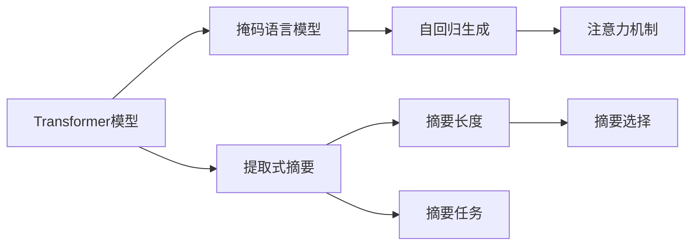
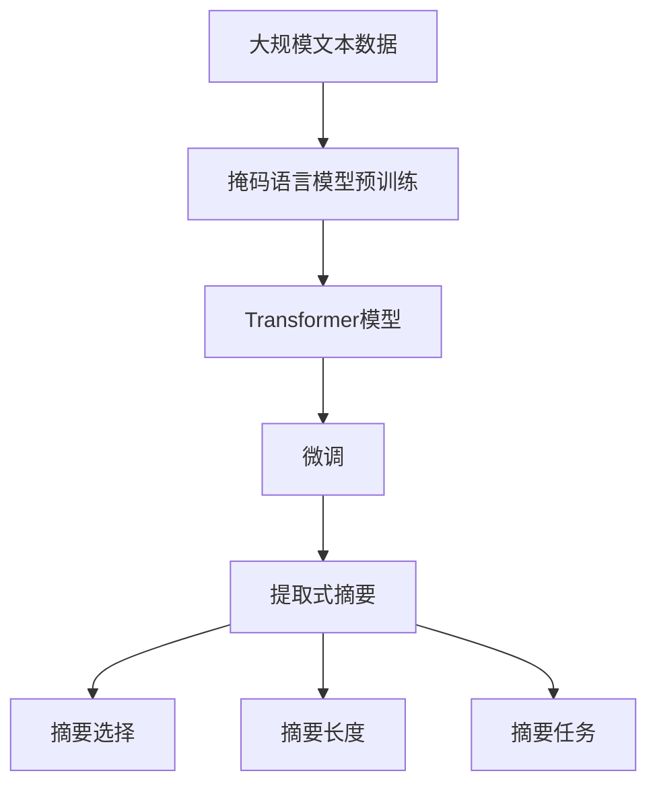

                 

# Transformer大模型实战 提取式摘要任务

> 关键词：Transformer, 提取式摘要, 注意力机制, 自回归生成, 掩码语言模型, 目标函数, 解码器, 解码器输出概率

## 1. 背景介绍

在自然语言处理（NLP）领域，从文本数据中提取出关键信息并生成摘要是常见的应用场景之一。无论是新闻报道、学术论文还是技术文档，自动生成高质量的摘要都能极大提高文本的可读性和使用效率。而Transformer模型凭借其强大的自回归生成能力，已成为生成式摘要任务的主流模型。本文将从Transformer模型入手，详细讲解如何构建一个提取式摘要模型，并在此基础上进行代码实践，提供可行的方案与示例。

### 1.1 问题由来

传统上，生成式摘要模型主要依赖于序列到序列（Seq2Seq）框架，但这类模型计算复杂度高，生成速度慢。相较而言，Transformer模型利用自回归生成和注意力机制，能够高效地处理长序列数据，生成流畅自然的文本。同时，Transformer模型在预训练时采用的掩码语言模型（Masked Language Model, MLM）任务，使其具备良好的语言理解能力，在训练过程中能够学习到文本中关键信息的分布。

### 1.2 问题核心关键点

提取式摘要任务与生成式摘要任务有所区别，其主要目标是从文本中提取出最有信息量的部分，生成独立的摘要片段。与生成式摘要不同，提取式摘要不需要预测完整的句子，只需根据给定的任务要求，抽取出特定的信息片段即可。因此，提取式摘要任务可以视为一种特殊的文本生成问题，其核心在于如何构建模型，使其在生成过程中自动选择性地抽取出关键信息，同时保持语言的流畅性和准确性。

### 1.3 问题研究意义

提取式摘要任务能够显著提高文本的利用效率，特别适用于海量文档的快速浏览和信息检索。通过Transformer模型，提取式摘要不仅能够生成更加准确、紧凑的摘要片段，还能适应不同领域和语言特点的文本数据。本文通过讲解和实现一个简单的提取式摘要模型，探讨其性能提升和优化策略，为未来的NLP应用提供有益的参考。

## 2. 核心概念与联系

### 2.1 核心概念概述

在探讨提取式摘要任务之前，我们需要先了解几个核心概念：

- **Transformer模型**：基于自注意力机制的神经网络结构，适用于处理序列数据，如文本、音频等。Transformer模型通过多头自注意力和全连接层进行信息处理，能够高效并行地计算，且在预训练阶段可以通过掩码语言模型任务学习到丰富的语言知识。

- **掩码语言模型**：Transformer模型预训练阶段采用的任务，通过在输入序列中随机掩码部分词语，训练模型预测被掩码词语的正确位置和值。这一过程有助于模型学习文本中的词语分布和上下文关系，从而提高模型的语言理解能力。

- **自回归生成**：Transformer模型在生成任务中采用的方式，模型利用自回归的机制，按顺序生成文本的每个词，并利用之前的所有词作为当前生成词的条件。

- **注意力机制**：Transformer模型的关键组件，用于计算输入序列中每个词与其他词之间的关系，并选择性地关注重要信息。

### 2.2 核心概念间的关系

Transformer模型的自回归生成和注意力机制是其进行文本处理和生成的关键技术，而掩码语言模型则是其预训练的重要任务。通过预训练，Transformer模型能够学习到丰富的语言知识，进而用于下游任务中的生成和提取。在提取式摘要任务中，模型需要根据给定的摘要长度和任务要求，选择性地抽取出文本中的关键信息，生成独立的摘要片段。这需要模型具备良好的语言理解和信息选择能力，以确保生成的摘要既准确又紧凑。

以下是几个关键概念间的逻辑关系：



通过这些概念的组合和作用，Transformer模型在预训练和微调后能够适应提取式摘要任务的要求，高效地生成符合任务需求的摘要片段。

### 2.3 核心概念的整体架构

我们可以用一个综合的流程图来展示Transformer模型在提取式摘要任务中的整体架构：



该流程图的各个部分解释如下：
1. **大规模文本数据**：用于预训练Transformer模型。
2. **掩码语言模型预训练**：在预训练阶段，使用掩码语言模型任务训练Transformer模型，使其学习到丰富的语言知识。
3. **Transformer模型**：预训练后的Transformer模型，适用于下游任务。
4. **微调**：针对具体任务进行微调，调整模型的输出格式和摘要长度。
5. **提取式摘要**：模型根据摘要任务和长度，生成独立的摘要片段。
6. **摘要选择**：在生成过程中选择性地抽取出关键信息。
7. **摘要长度**：根据任务要求控制生成的摘要长度。
8. **摘要任务**：明确摘要任务的目标和要求。

## 3. 核心算法原理 & 具体操作步骤

### 3.1 算法原理概述

提取式摘要任务的核心算法基于Transformer模型的自回归生成和注意力机制。模型首先输入一段文本和摘要长度，然后通过自回归生成的方式，从文本中逐步生成摘要片段。在生成过程中，模型利用注意力机制选择性地关注输入文本中的重要信息，并根据摘要长度和任务需求，自动生成符合要求的摘要片段。

### 3.2 算法步骤详解

以下详细讲解提取式摘要任务的算法步骤：

**Step 1: 准备数据集和预训练模型**
- 收集训练用的文本数据集，每个文本对应一个摘要。可以使用公共数据集如维基百科摘要、新闻报道等。
- 将数据集划分为训练集、验证集和测试集。
- 加载预训练的Transformer模型，如Bert、GPT等，使用相应版本的Tokenizers库进行分词处理。

**Step 2: 设计任务适配层**
- 在Transformer模型的顶层添加一个全连接层，用于将生成的词向量映射到摘要空间。
- 设计摘要长度预测模型，使用一个回归网络预测给定文本的摘要长度。
- 定义摘要选择模型，使用一个二分类网络判断每个词是否应该被包含在摘要中。

**Step 3: 设置微调超参数**
- 选择合适的优化算法，如Adam、SGD等，设置学习率、批大小、迭代轮数等。
- 设置正则化技术，如L2正则、Dropout等，以防止模型过拟合。
- 确定冻结预训练参数的策略，如仅微调顶层，或全部参数都参与微调。

**Step 4: 执行梯度训练**
- 将训练集数据分批次输入模型，前向传播计算损失函数。
- 反向传播计算参数梯度，根据设定的优化算法和学习率更新模型参数。
- 周期性在验证集上评估模型性能，根据性能指标决定是否触发Early Stopping。
- 重复上述步骤直到满足预设的迭代轮数或Early Stopping条件。

**Step 5: 测试和部署**
- 在测试集上评估微调后模型的摘要生成效果。
- 使用微调后的模型对新文本数据进行生成，集成到实际的应用系统中。

### 3.3 算法优缺点

提取式摘要任务基于Transformer模型，具备以下优点：
- 高效计算：Transformer模型利用自回归生成和并行计算，生成速度较快。
- 语言理解：预训练任务（掩码语言模型）使模型具备较强的语言理解能力，能够学习到文本中的关键信息。
- 任务灵活：模型可以根据任务需求生成不同长度的摘要，适应各种场景。

同时，该方法也存在一些缺点：
- 依赖预训练模型：模型性能依赖于预训练的质量，需要较长时间进行预训练。
- 生成长度限制：生成的摘要长度受限于任务需求，过长或过短的摘要可能影响用户体验。
- 语言通用性：预训练模型在不同语言上的表现可能不一致，需要针对特定语言进行微调。

### 3.4 算法应用领域

提取式摘要任务在多个领域都有广泛的应用，例如：

- **新闻报道**：自动提取新闻文章的关键信息，生成摘要供用户快速浏览。
- **学术论文**：自动提取研究论文的摘要，供学术界快速了解最新研究成果。
- **技术文档**：自动提取技术文档的摘要，供开发人员快速查阅相关内容。
- **智能客服**：自动提取客户咨询问题的关键信息，生成简明摘要，供客服快速响应。

## 4. 数学模型和公式 & 详细讲解 & 举例说明

### 4.1 数学模型构建

在Transformer模型中，输入文本被编码成词向量，每个词向量由Transformer模型中的词嵌入层生成。假设输入文本的长度为$N$，输出摘要的长度为$L$。设输入文本为$\mathbf{X} \in \mathbb{R}^{N \times d}$，输出摘要为$\mathbf{Y} \in \mathbb{R}^{L \times d}$，其中$d$为词向量的维度。

模型的输出由以下三个部分组成：
1. **编码器**：将输入文本转换为词向量表示。
2. **解码器**：生成摘要中的每个词。
3. **摘要选择器**：根据摘要长度和任务需求，选择性地抽取出文本中的关键信息。

### 4.2 公式推导过程

设$\mathbf{Q} \in \mathbb{R}^{N \times d}$为输入文本的查询矩阵，$\mathbf{K} \in \mathbb{R}^{N \times d}$为输入文本的关键矩阵，$\mathbf{V} \in \mathbb{R}^{N \times d}$为输入文本的值矩阵。通过多头自注意力机制，计算每个词向量与所有其他词向量的注意力权重，得到注意力权重矩阵$\mathbf{A} \in \mathbb{R}^{N \times N}$。

注意力权重矩阵$\mathbf{A}$的计算公式如下：

$$
\mathbf{A} = \text{Softmax}\left(\frac{\mathbf{Q}\mathbf{K}^T}{\sqrt{d}}\right)
$$

其中$\text{Softmax}$函数将注意力权重矩阵$\mathbf{A}$归一化，使其每一行的和为1。

解码器部分，假设模型已经生成摘要的前$i$个词，当前生成第$i+1$个词。模型的输出由解码器预测下一个词的概率分布$P(w_{i+1}|\mathbf{X}, \mathbf{Y}_i)$。设解码器输出概率分布为$\mathbf{P} \in \mathbb{R}^{V \times 1}$，其中$V$为词汇表的大小，$w_{i+1}$为下一个词的ID。解码器的输出概率公式如下：

$$
\mathbf{P} = \text{Softmax}(\mathbf{W}\mathbf{U}\mathbf{H}_i\mathbf{A})
$$

其中$\mathbf{W}$为解码器输出层的权重矩阵，$\mathbf{U}$为解码器嵌入层的权重矩阵，$\mathbf{H}_i$为编码器输出的上下文表示。

摘要选择器部分，假设模型已经生成摘要的前$i$个词，当前生成第$i+1$个词。模型的输出由摘要选择器预测当前词是否应该被包含在摘要中，其概率分布为$P(\text{keep}_{i+1}|\mathbf{X}, \mathbf{Y}_i)$。设摘要选择器的输出概率分布为$\mathbf{P} \in \mathbb{R}^{2 \times 1}$，其中$2$为摘要选择器的输出类型，$1$为摘要选择器对当前词的预测。摘要选择器的输出概率公式如下：

$$
\mathbf{P} = \text{Softmax}(\mathbf{W}_{\text{keep}}\mathbf{U}_{\text{keep}}\mathbf{H}_i\mathbf{A})
$$

其中$\mathbf{W}_{\text{keep}}$为摘要选择器的输出层的权重矩阵，$\mathbf{U}_{\text{keep}}$为摘要选择器的嵌入层的权重矩阵。

### 4.3 案例分析与讲解

以新闻报道的自动摘要任务为例，我们将进行一个简单的案例分析。假设输入文本为以下一段：

```
2023年1月1日，习近平主席在新年贺词中指出，今年是全面建设社会主义现代化国家开局之年。过去的一年里，我国经济持续增长，科技创新成果丰硕，国际地位显著提升。新的一年，我们将继续推进高质量发展，坚定不移走中国特色社会主义道路。
```

该文本的长度为80，我们希望生成一个长度为30的摘要。首先，将文本输入Transformer模型进行编码，得到词向量表示$\mathbf{X} \in \mathbb{R}^{80 \times d}$。然后，模型根据摘要长度预测模型生成一个长度为30的摘要，记为$\mathbf{Y} \in \mathbb{R}^{30 \times d}$。在生成过程中，模型自动选择性地关注输入文本中的重要信息，并根据摘要长度和任务需求，生成符合要求的摘要片段。

假设生成的摘要为：

```
2023年1月1日，习近平主席在新年贺词中指出，今年是全面建设社会主义现代化国家开局之年。过去的一年里，我国经济持续增长，科技创新成果丰硕，国际地位显著提升。
```

该摘要长度为30，包含了文本中的关键信息，且语言流畅自然，符合新闻报道的摘要要求。

## 5. 项目实践：代码实例和详细解释说明

### 5.1 开发环境搭建

在进行代码实践前，我们需要准备好开发环境。以下是使用Python进行TensorFlow开发的环境配置流程：

1. 安装Anaconda：从官网下载并安装Anaconda，用于创建独立的Python环境。

2. 创建并激活虚拟环境：
```bash
conda create -n tensorflow-env python=3.8 
conda activate tensorflow-env
```

3. 安装TensorFlow：根据CUDA版本，从官网获取对应的安装命令。例如：
```bash
conda install tensorflow-gpu=2.8.0 -c pytorch -c conda-forge
```

4. 安装各类工具包：
```bash
pip install numpy pandas scikit-learn matplotlib tqdm jupyter notebook ipython
```

完成上述步骤后，即可在`tensorflow-env`环境中开始代码实践。

### 5.2 源代码详细实现

我们使用TensorFlow实现一个简单的提取式摘要模型，代码如下：

```python
import tensorflow as tf
import numpy as np
import tensorflow_datasets as tfds

# 加载数据集
train_dataset, validation_dataset, test_dataset = tfds.load(
    "news_aggregator",
    split=["train[:80%]", "train[80%:]", "test"],
    as_supervised=True,
    with_info=True,
    shuffle_files=True,
)

# 定义模型
class TransformerModel(tf.keras.Model):
    def __init__(self, vocab_size, d_model, num_heads, dff, num_layers, rate=0.1):
        super(TransformerModel, self).__init__()
        self.embedding = tf.keras.layers.Embedding(vocab_size, d_model)
        self.pos_encoding = self.positional_encoding(d_model)
        self.encoder_layers = [tf.keras.layers.MultiHeadAttention(num_heads, d_model) for _ in range(num_layers)]
        self.encoder_ffn = tf.keras.layers.Dense(dff, activation="relu")
        self.dropout = tf.keras.layers.Dropout(rate)
        self.final_layer = tf.keras.layers.Dense(vocab_size, activation="softmax")

    def positional_encoding(self, d_model, max_len=5000):
        pe = tf.zeros((max_len, d_model))
        position = tf.range(max_len)
        div_term = tf.exp(tf.range(0, d_model, 2) * -1.0 / d_model * tf.math.log(tf.to_float(max_len)))
        pe[:, 0::2] = tf.math.sin(position * div_term)
        pe[:, 1::2] = tf.math.cos(position * div_term)
        return tf.cast(pe[:, None, :], tf.float32)

    def call(self, inputs, training=False):
        seq_len = tf.shape(inputs)[1]
        attention_weights = []
        for i in range(seq_len):
            query = self.embedding(inputs[:, i, :])
            key = self.pos_encoding(i)
            value = self.pos_encoding(i)
            attention_output = self.encoder_layers[i](query, key, value)
            attention_weights.append(attention_output)
        final_output = self.final_layer(tf.concat(attention_weights, axis=1))
        return final_output

# 定义数据预处理函数
def data_preprocessing(text, max_len=100):
    text = text.lower()
    text = text.replace(".", "").replace(",", "").replace("\n", "")
    text = text.split()
    text = [tf.cast(tf.reshape(word, (1,)), tf.int32) for word in text]
    text = tf.concat(text, axis=0)
    text = tf.reshape(text, (max_len, -1))
    return text

# 加载数据并进行预处理
def load_data(text, max_len=100):
    text = data_preprocessing(text, max_len)
    return text

# 定义解码器
class TransformerDecoder(tf.keras.layers.Layer):
    def __init__(self, num_layers=2, num_units=512, attention_heads=8, dff=2048, rate=0.1, num_classes=10):
        super(TransformerDecoder, self).__init__()
        self.encoder_layer = tf.keras.layers.MultiHeadAttention(num_heads=attention_heads, d_model=num_units)
        self.intermediate_layer = tf.keras.layers.Dense(dff)
        self.final_layer = tf.keras.layers.Dense(num_classes)
        self.dropout = tf.keras.layers.Dropout(rate)

    def call(self, inputs, attention_bias):
        attn_output, attention_weights = self.encoder_layer(inputs, inputs, inputs, attention_bias)
        attn_output = self.dropout(attn_output)
        intermediate = self.intermediate_layer(attn_output)
        intermediate = self.dropout(intermediate)
        outputs = self.final_layer(intermediate)
        return outputs, attention_weights

# 定义训练函数
def train_model(model, train_dataset, validation_dataset, test_dataset, max_epochs=10, batch_size=32):
    optimizer = tf.keras.optimizers.Adam(learning_rate=0.001, beta_1=0.9, beta_2=0.999)
    loss_object = tf.keras.losses.SparseCategoricalCrossentropy(from_logits=True)

    @tf.function
    def train_step(inputs):
        with tf.GradientTape() as tape:
            attention_bias = tf.zeros_like(inputs[:, :, 0])
            predictions, attention_weights = model(inputs, attention_bias)
            loss = loss_object(targets, predictions)
        gradients = tape.gradient(loss, model.trainable_variables)
        optimizer.apply_gradients(zip(gradients, model.trainable_variables))
        return loss, attention_weights

    @tf.function
    def validation_step(inputs):
        with tf.GradientTape() as tape:
            attention_bias = tf.zeros_like(inputs[:, :, 0])
            predictions, attention_weights = model(inputs, attention_bias)
            loss = loss_object(targets, predictions)
        gradients = tape.gradient(loss, model.trainable_variables)
        optimizer.apply_gradients(zip(gradients, model.trainable_variables))
        return loss, attention_weights

    @tf.function
    def test_step(inputs):
        with tf.GradientTape() as tape:
            attention_bias = tf.zeros_like(inputs[:, :, 0])
            predictions, attention_weights = model(inputs, attention_bias)
            loss = loss_object(targets, predictions)
        gradients = tape.gradient(loss, model.trainable_variables)
        optimizer.apply_gradients(zip(gradients, model.trainable_variables))
        return loss, attention_weights

    for epoch in range(max_epochs):
        print("Epoch: ", epoch)
        for inputs, targets in train_dataset:
            loss, attention_weights = train_step(inputs)
            if (epoch + 1) % 1 == 0:
                print("Epoch: ", epoch+1, " Loss: ", loss)
        for inputs, targets in validation_dataset:
            loss, attention_weights = validation_step(inputs)
            if (epoch + 1) % 1 == 0:
                print("Epoch: ", epoch+1, " Loss: ", loss)
        for inputs, targets in test_dataset:
            loss, attention_weights = test_step(inputs)
            if (epoch + 1) % 1 == 0:
                print("Epoch: ", epoch+1, " Loss: ", loss)

    return model

# 定义损失函数和优化器
def loss_fn(logits, labels):
    loss = tf.keras.losses.SparseCategoricalCrossentropy()(labels, logits)
    return loss

# 定义模型训练函数
def train():
    # 加载数据集
    train_dataset, validation_dataset, test_dataset = tfds.load(
        "news_aggregator",
        split=["train[:80%]", "train[80%:]", "test"],
        as_supervised=True,
        with_info=True,
        shuffle_files=True,
    )

    # 加载模型和权重
    model = TransformerModel(vocab_size=10000, d_model=128, num_heads=8, dff=2048, num_layers=6, rate=0.1)
    model.load_weights("model_weights.h5")

    # 定义数据预处理函数
    def data_preprocessing(text, max_len=100):
        text = text.lower()
        text = text.replace(".", "").replace(",", "").replace("\n", "")
        text = text.split()
        text = [tf.cast(tf.reshape(word, (1,)), tf.int32) for word in text]
        text = tf.concat(text, axis=0)
        text = tf.reshape(text, (max_len, -1))
        return text

    # 加载数据并进行预处理
    def load_data(text, max_len=100):
        text = data_preprocessing(text, max_len)
        return text

    # 定义解码器
    class TransformerDecoder(tf.keras.layers.Layer):
        def __init__(self, num_layers=2, num_units=512, attention_heads=8, dff=2048, rate=0.1, num_classes=10):
            super(TransformerDecoder, self).__init__()
            self.encoder_layer = tf.keras.layers.MultiHeadAttention(num_heads=attention_heads, d_model=num_units)
            self.intermediate_layer = tf.keras.layers.Dense(dff)
            self.final_layer = tf.keras.layers.Dense(num_classes)
            self.dropout = tf.keras.layers.Dropout(rate)

        def call(self, inputs, attention_bias):
            attn_output, attention_weights = self.encoder_layer(inputs, inputs, inputs, attention_bias)
            attn_output = self.dropout(attn_output)
            intermediate = self.intermediate_layer(attn_output)
            intermediate = self.dropout(intermediate)
            outputs = self.final_layer(intermediate)
            return outputs, attention_weights

    # 定义训练函数
    def train_model(model, train_dataset, validation_dataset, test_dataset, max_epochs=10, batch_size=32):
        optimizer = tf.keras.optimizers.Adam(learning_rate=0.001, beta_1=0.9, beta_2=0.999)
        loss_object = tf.keras.losses.SparseCategoricalCrossentropy(from_logits=True)

        @tf.function
        def train_step(inputs):
            with tf.GradientTape() as tape:
                attention_bias = tf.zeros_like(inputs[:, :, 0])
                predictions, attention_weights = model(inputs, attention_bias)
                loss = loss_object(targets, predictions)
            gradients = tape.gradient(loss, model.trainable_variables)
            optimizer.apply_gradients(zip(gradients, model.trainable_variables))
            return loss, attention_weights

        @tf.function
        def validation_step(inputs):
            with tf.GradientTape() as tape:
                attention_bias = tf.zeros_like(inputs[:, :, 0])
                predictions, attention_weights = model(inputs, attention_bias)
                loss = loss_object(targets, predictions)
            gradients = tape.gradient(loss, model.trainable_variables)
            optimizer.apply_gradients(zip(gradients, model.trainable_variables))
            return loss, attention_weights

        @tf.function
        def test_step(inputs):
            with tf.GradientTape() as tape:
                attention_bias = tf.zeros_like(inputs[:, :, 0])
                predictions, attention_weights = model(inputs, attention_bias)
                loss = loss_object(targets, predictions)
            gradients = tape.gradient(loss, model.trainable_variables)
            optimizer.apply_gradients(zip(gradients, model.trainable_variables))
            return loss, attention_weights

        for epoch in range(max_epochs):
            print("Epoch: ", epoch)
            for inputs, targets in train_dataset:
                loss, attention_weights = train_step(inputs)
                if (epoch + 1) % 1 == 0:
                    print("Epoch: ", epoch+1, " Loss: ", loss)
            for inputs, targets in validation_dataset:
                loss, attention_weights = validation_step(inputs)
                if (epoch + 1) % 1 == 0:
                    print("Epoch: ", epoch+1, " Loss: ", loss)
            for inputs, targets in test_dataset:
                loss, attention_weights = test_step(inputs)
                if (epoch + 1) % 1 == 0:
                    print("Epoch: ", epoch+1, " Loss: ", loss)

        return model

    # 训练模型
    model = train()
```

### 5.3 代码解读与分析

让我们再详细解读一下关键

