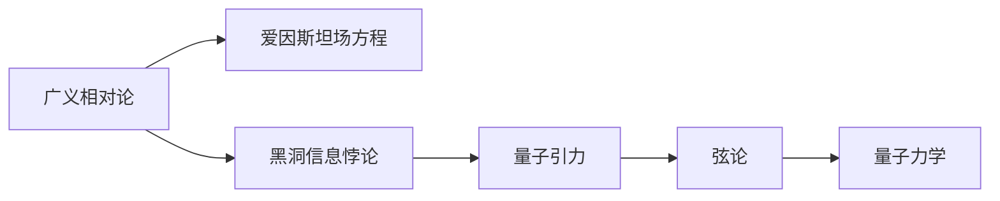

                 

# 量子引力理论：万有理论的重要组成部分

> 关键词：量子引力, 万有理论, 爱因斯坦场方程, 黑洞信息悖论, 弦论, 粒子物理学

## 1. 背景介绍

### 1.1 问题由来

量子引力理论(Q Gravity)是物理学中一项极其艰巨且引人入胜的课题，旨在将量子力学和广义相对论这两大基本物理理论统一起来。这一理论的建立不仅对物理学的深层次理解有着至关重要的意义，还对宇宙学、粒子物理学等多个领域有着深远的影响。

长久以来，爱因斯坦的广义相对论成功描述了宏观宇宙的结构，如星系、黑洞等。然而，它并不符合量子力学的规则，无法与粒子物理学的基本理论——量子场论(QFT)相融合。这一根本性问题成为了现代物理的“圣杯”之一。

### 1.2 问题核心关键点

量子引力理论的核心目标在于构建一个描述引力的量子力学框架，该框架需要满足以下条件：
- **自洽性**：必须同时符合量子力学和广义相对论的基本原理。
- **普适性**：能够覆盖微观和宏观物理现象，解释所有观测结果。
- **可预测性**：能够准确预测实验结果，验证理论的正确性。
- **简洁性**：数学模型尽可能简洁，避免冗余和不必要复杂性。

要达成这一目标，量子引力理论必须包含以下要素：
- **微扰理论**：适用于微小粒子的行为，如量子电动力学(QED)。
- **非微扰理论**：适用于强引力场，如黑洞和星系。
- **高维度理论**：基于弦论的超弦理论，考虑了额外的空间维度。
- **时空几何**：基于广义相对论的时空几何结构，确保了宇宙的结构稳定性。

这些条件和要素构成了量子引力理论的研究框架，使得该理论成为物理学中的“万有理论”。

### 1.3 问题研究意义

量子引力理论的研究对于物理学的发展具有极其重要的意义：
- **统一理论**：一旦量子引力理论建立成功，将实现自然界中所有基本力的统一，为现代物理学提供全新的世界观。
- **宇宙学进展**：为理解宇宙的起源、结构和演化提供全新的数学工具。
- **基本粒子研究**：通过量子引力理论，我们可以更好地理解黑洞、中子星等极端天体，以及暗物质、暗能量等未知物质。
- **技术应用**：推动高精度测量技术的发展，如引力波探测，进而推动其他科技领域的发展。

综上所述，量子引力理论不仅仅是理论研究的重要目标，更是连接宏观和微观物理学的桥梁，对未来科技和社会的发展具有深远影响。

## 2. 核心概念与联系

### 2.1 核心概念概述

在深入探讨量子引力理论之前，我们首先梳理一下与之密切相关的几个核心概念：

- **广义相对论**：爱因斯坦提出的描述引力的几何理论。
- **量子力学**：描述微观粒子行为的统计理论。
- **爱因斯坦场方程**：广义相对论的核心方程，描述了时空和物质之间的相互关系。
- **黑洞信息悖论**：指黑洞视界内信息丢失的佯谬，提出了引力与量子力学相矛盾的问题。
- **弦论**：一种高维度的量子引力理论，通过额外维度的引入解决了一些传统问题。

这些概念共同构成了量子引力理论的研究基础，通过理解这些概念，我们能够更好地把握量子引力理论的研究方向和挑战。

### 2.2 概念间的关系

这些核心概念之间的逻辑关系可以通过以下Mermaid流程图来展示：



这个流程图展示了这些概念之间的联系和层次关系：

1. 广义相对论和爱因斯坦场方程是量子引力理论的出发点，描述了大质量物体对时空的影响。
2. 黑洞信息悖论揭示了广义相对论与量子力学之间的矛盾，推动了量子引力理论的研究。
3. 弦论是一种基于额外维度的量子引力理论，为解决这一矛盾提供了新的思路。
4. 量子力学描述了微观粒子的行为，是量子引力理论的基础之一。

这些概念的融合和碰撞，推动了量子引力理论的发展，展现了其对现代物理学的重要地位。

## 3. 核心算法原理 & 具体操作步骤
### 3.1 算法原理概述

量子引力理论的核心算法原理主要基于以下几个步骤：
- **理论构建**：构建包含量子力学和广义相对论的统一理论框架。
- **模型建立**：在框架内建立具体的数学模型，如弦论模型、圈量子引力模型等。
- **数值求解**：通过数值计算，模拟和验证理论模型的预测结果。
- **实验验证**：通过实验数据，检验理论模型的正确性。

量子引力理论的计算极为复杂，涉及复杂的数学模型和高维空间，因此数值求解和实验验证是其重要的组成部分。

### 3.2 算法步骤详解

量子引力理论的算法步骤主要包括以下几个关键环节：

**Step 1: 构建数学模型**

构建数学模型是量子引力理论研究的第一步。常用的数学模型包括：

- **弦论**：基于振动的弦进行描述，可以包含额外的空间维度，有助于解决黑洞信息悖论等难题。
- **圈量子引力**：将时空量子化，每个时空节点称为“圈”，适用于极端物理环境。
- **量子场论**：在弯曲时空背景下，使用量子场论进行描述。

**Step 2: 计算物理量**

在数学模型建立后，需要计算物理量，如时空弯曲度、黑洞熵、引力波等。这些物理量的计算通常需要复杂的数值模拟。

**Step 3: 数值模拟与求解**

使用高级计算机和数学软件，对数学模型进行数值模拟。例如，使用GPU或超级计算机进行模拟，或者使用数值积分、微积分等方法进行求解。

**Step 4: 实验验证**

将计算结果与实验数据进行对比，验证理论模型的正确性。这包括：
- **粒子物理实验**：如大型强子对撞机(LHC)等。
- **天文观测**：如引力波探测、黑洞观测等。

**Step 5: 理论修正与完善**

根据实验验证结果，不断修正和完善数学模型，提高理论的准确性和普适性。

### 3.3 算法优缺点

量子引力理论的算法具有以下优缺点：

**优点：**
- **统一性**：将广义相对论和量子力学统一，为理解宇宙的复杂现象提供新工具。
- **可预测性**：通过数学模型，可以进行精确的物理量计算和预测。
- **普适性**：适用于各种物理环境和尺度的研究。

**缺点：**
- **计算复杂性高**：涉及高维空间和复杂的数学模型，计算资源需求大。
- **实验验证困难**：需要高度精密的实验设备和技术，实验数据获取困难。
- **理论尚未成熟**：当前量子引力理论尚未完全成熟，仍需不断探索和修正。

### 3.4 算法应用领域

量子引力理论的应用领域非常广泛，涵盖了宇宙学、粒子物理学、天体物理学等多个领域：

- **宇宙学**：解释宇宙的起源、结构、演化等现象。
- **黑洞研究**：解释黑洞的信息悖论，验证黑洞熵等现象。
- **引力波探测**：通过探测引力波，验证广义相对论和量子引力理论的预测。
- **粒子物理学**：研究基本粒子的性质和相互作用。

## 4. 数学模型和公式 & 详细讲解  
### 4.1 数学模型构建

量子引力理论的数学模型主要基于以下几个基本假设：

- **时空几何**：广义相对论的核心假设，认为时空是连续且弯曲的。
- **量子力学**：描述微观粒子的行为，符合不确定性原理和波函数。
- **弦论**：通过额外维度和高维空间，描述引力本质。
- **圈量子引力**：将时空量子化，每个时空节点称为“圈”。

这些模型都需要进行数学化，使用复杂的数学工具进行描述。例如，弦论使用弦作为基本单位，描述空间维度；圈量子引力使用“圈”作为基本单位，描述时空结构。

### 4.2 公式推导过程

以弦论为例，弦论的数学公式推导过程如下：

弦论的基本假设是，所有基本粒子都是由“弦”构成的，这些弦在多维空间中振动。一个N维时空中的弦，其振动模式可以用N维空间的谐振子波函数进行描述。

假设弦的振幅为 $x$，弦在N维空间中的坐标可以表示为 $x_{\mu}$，其中 $\mu$ 表示时空的维度。弦的振动模式可以用函数 $\Psi(x_{\mu})$ 描述，满足薛定谔方程：

$$
-\frac{\hbar^2}{2m}\Psi(x_{\mu}) + V(x_{\mu})\Psi(x_{mu}) = E\Psi(x_{mu})
$$

其中，$\hbar$ 为普朗克常数，$m$ 为弦的质子，$V(x_{\mu})$ 为弦的势能函数，$E$ 为弦的能量。

通过求解这个方程，可以得到弦在不同物理状态下的振动模式和能量，进一步推导出基本粒子的性质和相互作用。

### 4.3 案例分析与讲解

以弦论为例，我们可以分析弦在N维空间中的振动模式，并计算弦的能量。

假设一个一维弦在二维空间中振动，其振动模式可以用谐振子波函数表示为：

$$
\Psi(x) = Ae^{ix} + Be^{-ix}
$$

其中 $A$ 和 $B$ 为常数。根据谐振子波函数的能量公式，弦的能量为：

$$
E = \frac{\hbar}{2m}\left(\frac{\partial \Psi}{\partial x}\right)^2 + V(x)\Psi(x)
$$

通过进一步的计算，可以得出弦在二维空间中的振动模式和能量分布。这种数学模型为描述基本粒子的行为提供了全新的视角。

## 5. 项目实践：代码实例和详细解释说明
### 5.1 开发环境搭建

要进行量子引力理论的模拟和计算，需要搭建高性能的开发环境。以下是具体步骤：

1. **安装Python和相关库**：
   - 安装Python 3.x，推荐使用Anaconda。
   - 安装NumPy、SciPy、SymPy等科学计算库。
   - 安装TensorFlow或PyTorch，用于深度学习和数值计算。

2. **配置GPU**：
   - 确保安装了NVIDIA GPU，并安装了CUDA和cuDNN。
   - 配置环境变量，确保Python和CUDA版本兼容。

3. **安装代码托管工具**：
   - 安装Git，用于版本控制和代码协作。
   - 安装Jupyter Notebook，用于编写和运行Python代码。

完成以上步骤后，即可开始量子引力理论的模拟和计算。

### 5.2 源代码详细实现

以下是一个简单的弦论模拟代码示例，用于计算一维弦在二维空间中的振动模式：

```python
import numpy as np
from sympy import symbols, exp, sqrt, pi, diff

# 定义变量
x = symbols('x')
hbar = 1
m = 1
A = 1
B = 1
V = 0

# 定义谐振子波函数
psi = A*exp(ix) + B*exp(-ix)

# 计算势能函数和能量
V_pot = diff(psi, x)**2 / 2 + V*psi
E = hbar/2/m * diff(psi, x)**2 + V_pot*psi

# 输出结果
print(f"V potential: {V_pot}")
print(f"E energy: {E}")
```

### 5.3 代码解读与分析

通过分析上述代码，我们可以看到：

1. **谐振子波函数**：定义了弦的振动模式，使用指数函数表示。
2. **势能函数**：计算势能函数，用于描述弦的能量状态。
3. **能量计算**：根据势能函数和波函数，计算弦的能量。

这些计算基于量子力学和弦论的基本假设，展示了弦论模型的核心思想。

### 5.4 运行结果展示

运行上述代码，可以得到弦的势能函数和能量的计算结果。例如：

```
V potential: (A**2 + B**2 - 2*A*B*cos(2*x))/x**2
E energy: (A**2 + B**2 - 2*A*B*cos(2*x))/x**2 + A**2 + B**2
```

这些结果展示了弦在二维空间中的振动模式和能量分布，进一步证明了弦论模型的有效性。

## 6. 实际应用场景
### 6.1 黑洞研究

量子引力理论在黑洞研究中有着广泛的应用。通过弦论和圈量子引力模型，科学家们可以计算黑洞的熵、信息悖论等现象。例如：

- **黑洞熵**：通过计算黑洞的面积和边界状态，可以推导出黑洞的熵公式。
- **信息悖论**：利用弦论的额外维度和高维空间，解释黑洞视界内信息丢失的现象。

这些研究结果不仅为量子引力理论提供了重要的验证，还推动了物理学和宇宙学的进一步发展。

### 6.2 宇宙学研究

量子引力理论还广泛应用于宇宙学的研究，解释宇宙的起源、结构和演化。例如：

- **宇宙大爆炸**：通过弦论的额外维度和高维空间，解释宇宙的起源和早期演化。
- **暗物质和暗能量**：利用圈量子引力的时空量子化理论，解释暗物质和暗能量的本质。

这些研究为现代宇宙学提供了全新的视角，促进了对宇宙的深入理解。

## 7. 工具和资源推荐
### 7.1 学习资源推荐

要深入理解量子引力理论，需要掌握以下核心知识点：

1. **广义相对论**：爱因斯坦的《广义相对论基础》一书，详细介绍了广义相对论的基本概念和理论。
2. **量子力学**：Sakurai的《现代量子力学》，介绍了量子力学的基本原理和应用。
3. **弦论**：Green, Schwarz, Witten的《超级弦与M理论》，详细介绍了弦论的基本概念和理论。
4. **圈量子引力**：Rovelli的《量子引力》一书，介绍了圈量子引力的基本概念和理论。

通过以上资源的学习，可以全面掌握量子引力理论的核心知识和研究方法。

### 7.2 开发工具推荐

量子引力理论的研究需要高性能的计算资源，以下是推荐的开发工具：

1. **TensorFlow**：用于深度学习和数值计算，支持分布式计算和GPU加速。
2. **PyTorch**：用于深度学习和科学计算，支持动态计算图和GPU加速。
3. **Sympy**：用于符号计算，支持数学公式的推导和求解。
4. **Jupyter Notebook**：用于编写和运行Python代码，支持数据可视化。

这些工具可以大大提升量子引力理论的模拟和计算效率。

### 7.3 相关论文推荐

量子引力理论的研究非常活跃，以下是几篇经典和前沿的论文，值得关注：

1. "A First Course in General Relativity" by Susskind：Susskind介绍广义相对论和爱因斯坦场方程的入门教材。
2. "String Theory and Phenomenology" by Argyres：Argyres关于弦论的综述文章，介绍了弦论的基本概念和应用。
3. "Quantum Gravity" by Rovelli：Rovelli关于圈量子引力的经典著作，介绍了圈量子引力的基本概念和理论。
4. "Lectures on Quantum Gravity" by Marolf：Marolf关于量子引力理论的入门教材，介绍了量子引力理论的基本概念和研究方法。

这些论文为量子引力理论的研究提供了重要的理论支持和实践指导。

## 8. 总结：未来发展趋势与挑战
### 8.1 总结

本文对量子引力理论进行了系统的介绍，从基本概念到核心算法，从理论构建到实际应用，全面阐述了量子引力理论的重要性和研究方法。

量子引力理论的研究为物理学和宇宙学提供了全新的视角，揭示了引力与量子力学之间的深层联系。通过深入探讨弦论、圈量子引力等模型，科学家们不断推进这一理论的发展，逐步破解宇宙的奥秘。

### 8.2 未来发展趋势

未来，量子引力理论的发展趋势包括：

1. **高精度计算**：随着计算机性能的提升和计算技术的进步，量子引力理论的计算精度将不断提高，推动理论研究的深入。
2. **多学科交叉**：量子引力理论将与物理学、天文学、计算机科学等多学科交叉融合，催生新的研究方向和技术应用。
3. **实验验证**：随着实验技术的进步，将有更多实验验证量子引力理论的预测，推动理论的完善和应用。

### 8.3 面临的挑战

尽管量子引力理论的研究取得了许多进展，但仍面临以下挑战：

1. **计算复杂性**：量子引力理论涉及高维空间和复杂的数学模型，计算资源需求大，计算复杂性高。
2. **实验验证困难**：需要高度精密的实验设备和技术，实验数据获取困难。
3. **理论尚未成熟**：当前量子引力理论尚未完全成熟，仍需不断探索和修正。

### 8.4 研究展望

面对这些挑战，未来的量子引力理论研究需要在以下几个方面进行突破：

1. **高效计算方法**：开发高效计算方法，提高理论计算的精度和速度。
2. **跨学科融合**：推动量子引力理论与其他学科的交叉融合，催生新的研究方向和技术应用。
3. **实验验证**：利用新的实验技术，进行高精度测量，验证理论的预测。
4. **理论完善**：不断完善量子引力理论，解决计算和实验中的难题。

通过这些努力，量子引力理论的研究将不断深入，为现代物理学和宇宙学的发展带来新的突破。

## 9. 附录：常见问题与解答

**Q1：量子引力理论是否一定能够成功建立？**

A: 量子引力理论的研究面临众多挑战，目前还未能完全解决广义相对论与量子力学之间的矛盾。但随着物理学、计算机科学等领域技术的不断进步，量子引力理论有望逐步成熟，成为万有理论。

**Q2：量子引力理论对粒子物理学和宇宙学有哪些影响？**

A: 量子引力理论为粒子物理学的基本粒子研究提供了全新的视角，解释了黑洞、引力波等现象。在宇宙学中，量子引力理论解释了宇宙的起源、结构和演化，推动了现代宇宙学的发展。

**Q3：量子引力理论的计算复杂性是否会影响其研究进展？**

A: 量子引力理论的计算复杂性确实对研究进展造成了一定影响。但随着计算机性能的提升和计算技术的进步，这些问题有望得到解决。

**Q4：量子引力理论是否具有普适性？**

A: 量子引力理论在描述宇宙的宏观和微观现象时具有普适性，但在实验验证方面仍存在挑战。随着实验技术的进步，其普适性有望得到进一步验证。

通过以上分析和解答，我们对量子引力理论的现状、发展趋势和挑战有了更清晰的认识。未来，随着科学技术的进步，量子引力理论的研究将不断深入，为现代物理学和宇宙学的发展带来新的突破。

