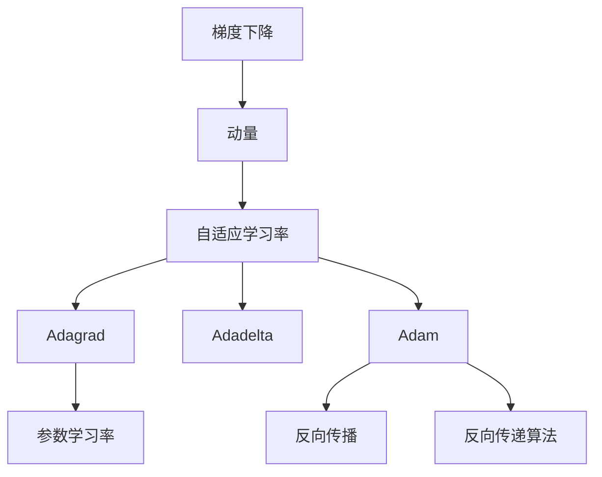
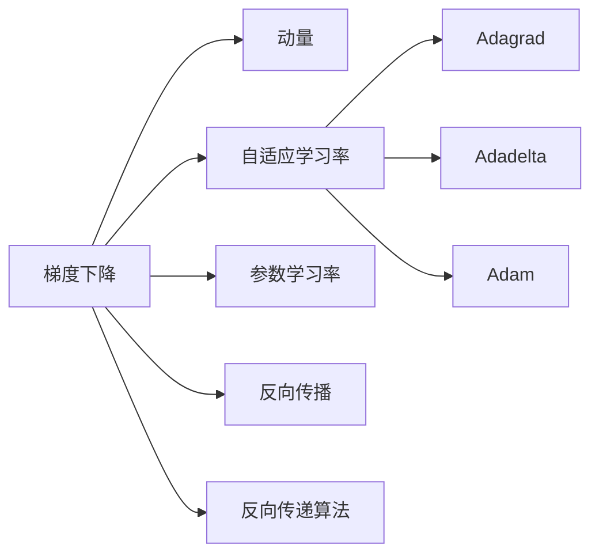

                 

# 一切皆是映射：优化器算法及其在深度学习中的应用

> 关键词：优化器算法,深度学习,梯度下降,Adam,动量,Momentum,自适应学习率,Adagrad,Adadelta,参数学习率,反向传播,反向传递算法

## 1. 背景介绍

### 1.1 问题由来
在深度学习中，优化器算法（Optimizer）扮演着至关重要的角色。它的目标是通过最小化损失函数，更新模型参数，使模型在给定的任务上达到最优性能。由于深度学习模型的参数数量往往非常庞大，梯度下降算法（Gradient Descent）的计算复杂度非常高，优化器算法需要有效地降低梯度计算量和加快收敛速度。因此，优化的设计和选择，成为训练高性能深度学习模型不可或缺的一环。

### 1.2 问题核心关键点
深度学习中的优化器算法可分为两类：基于梯度的优化器（如梯度下降算法）和基于自适应学习率的优化器（如Adam、Momentum等）。基于梯度的优化器通过计算梯度更新参数，但它们的更新幅度是固定的，往往无法适应不同任务的梯度分布特性。基于自适应学习率的优化器则根据梯度信息动态调整学习率，从而更快地收敛，但计算复杂度相对较高。

### 1.3 问题研究意义
优化器算法的选择和设计，对于深度学习模型的训练效果、收敛速度、稳定性等方面有着重要影响。选择正确的优化器，可以显著提高模型的训练效率和性能，加速模型的收敛过程。同时，优化器算法的理论研究对于理解深度学习的训练过程、改进算法设计也有着重要的指导意义。

## 2. 核心概念与联系

### 2.1 核心概念概述

为了更好地理解优化器算法的工作原理和应用，本节将介绍几个密切相关的核心概念：

- 梯度下降算法（Gradient Descent）：一种基于梯度信息更新参数的优化算法，通过反向传播计算梯度，更新模型参数，使得损失函数最小化。常见的梯度下降算法包括批量梯度下降（Batch Gradient Descent, BGD）和随机梯度下降（Stochastic Gradient Descent, SGD）。

- 动量（Momentum）：为梯度下降算法引入动量项，通过累积历史梯度信息，加快收敛速度。动量算法可以有效地平滑梯度更新，避免陷入局部最优。

- 自适应学习率优化器（Adaptive Learning Rate Optimizer）：根据梯度信息动态调整学习率，适应不同任务和参数的梯度分布特性。常见的自适应学习率优化器包括Adagrad、Adadelta、Adam等。

- 反向传播算法（Backpropagation）：一种计算梯度的方法，通过链式法则反向传播损失函数对各层参数的梯度，用于梯度下降算法的实现。反向传播算法是深度学习模型训练的基础。

- 反向传递算法（Backward Pass Algorithm）：实现反向传播算法的过程，用于计算损失函数对各层参数的梯度，用于梯度下降算法的实现。反向传递算法是深度学习模型训练的核心。

- 参数学习率（Learning Rate）：在梯度下降算法中，控制参数更新幅度的超参数，直接影响模型的收敛速度和效果。

这些核心概念之间的逻辑关系可以通过以下Mermaid流程图来展示：



这个流程图展示了几类优化器算法的工作流程及其与反向传播算法的关系：

1. 梯度下降算法通过反向传播计算梯度，更新模型参数。
2. 动量算法在梯度下降基础上引入动量项，加快收敛。
3. 自适应学习率优化器根据梯度信息动态调整学习率。
4. Adagrad、Adadelta、Adam等优化器算法均基于自适应学习率的思想，分别提出了不同的参数更新策略。
5. 反向传播算法计算梯度信息，用于梯度下降算法的实现。
6. 反向传递算法具体实现反向传播算法的过程。

### 2.2 概念间的关系

这些核心概念之间存在着紧密的联系，形成了深度学习模型训练的完整框架。

通过以下Mermaid流程图，我们可以更清晰地理解这些概念之间的关系：



这个流程图展示了深度学习模型训练的基本流程：

1. 梯度下降算法通过反向传播计算梯度，更新模型参数。
2. 动量算法在梯度下降的基础上引入动量项，加快收敛。
3. 自适应学习率优化器根据梯度信息动态调整学习率。
4. Adagrad、Adadelta、Adam等优化器算法均基于自适应学习率的思想，分别提出了不同的参数更新策略。
5. 反向传播算法计算梯度信息，用于梯度下降算法的实现。
6. 反向传递算法具体实现反向传播算法的过程。

通过这些概念的相互关系，我们可以更全面地理解深度学习模型训练的过程，从而更有效地选择合适的优化器算法，提升模型的训练效果。

## 3. 核心算法原理 & 具体操作步骤
### 3.1 算法原理概述

优化器算法的基本原理是通过计算梯度，更新模型参数，使得损失函数最小化。其核心思想是利用梯度信息，不断调整模型参数，以逼近最优解。

假设深度学习模型为 $f(\boldsymbol{\theta})$，其中 $\boldsymbol{\theta}$ 为模型参数，$L(f(\boldsymbol{\theta}), \boldsymbol{y})$ 为损失函数，$\boldsymbol{y}$ 为训练样本的真实标签。优化器算法通过计算梯度 $\nabla_{\boldsymbol{\theta}} L(f(\boldsymbol{\theta}), \boldsymbol{y})$，更新模型参数，使得损失函数最小化。

具体而言，优化器算法通过反向传播算法计算梯度，然后根据梯度信息更新模型参数，使得每次更新方向与梯度方向一致，从而不断逼近损失函数的最小值。常见的优化器算法如梯度下降、动量、自适应学习率优化器等，都是在这一基本原理的基础上进行改进和优化。

### 3.2 算法步骤详解

优化器算法的主要步骤包括：

1. **初始化参数**：设置模型参数的初始值，通常为随机初始化。
2. **计算梯度**：通过反向传播算法计算损失函数对每个参数的梯度。
3. **更新参数**：根据梯度信息和优化器算法，更新模型参数。
4. **迭代更新**：重复上述步骤，直至模型收敛或达到预设的迭代次数。

以下以Adam优化器算法为例，展示其具体的操作步骤：

1. **初始化参数**：将模型参数 $\boldsymbol{\theta}$ 初始化为随机值。
2. **计算梯度**：通过反向传播算法，计算损失函数 $L(f(\boldsymbol{\theta}), \boldsymbol{y})$ 对每个参数的梯度。
3. **更新参数**：Adam算法通过以下公式更新模型参数：
   $$
   \boldsymbol{m}_t = \beta_1 \boldsymbol{m}_{t-1} + (1-\beta_1)\nabla_{\boldsymbol{\theta}} L(f(\boldsymbol{\theta}), \boldsymbol{y})
   $$
   $$
   \boldsymbol{v}_t = \beta_2 \boldsymbol{v}_{t-1} + (1-\beta_2)(\nabla_{\boldsymbol{\theta}} L(f(\boldsymbol{\theta}), \boldsymbol{y}))^2
   $$
   $$
   \hat{\boldsymbol{m}}_t = \frac{\boldsymbol{m}_t}{1-\beta_1^t}
   $$
   $$
   \hat{\boldsymbol{v}}_t = \frac{\boldsymbol{v}_t}{1-\beta_2^t}
   $$
   $$
   \boldsymbol{\theta}_{t+1} = \boldsymbol{\theta}_t - \frac{\eta}{\sqrt{\hat{\boldsymbol{v}}_t + \epsilon}+\epsilon} \hat{\boldsymbol{m}}_t
   $$
   其中 $\eta$ 为学习率，$\beta_1$ 和 $\beta_2$ 为动量系数，$\epsilon$ 为数值稳定项。
4. **迭代更新**：重复上述步骤，直至模型收敛或达到预设的迭代次数。

### 3.3 算法优缺点

Adam优化器算法具有以下优点：

- 自适应学习率：根据梯度信息动态调整学习率，适应不同任务和参数的梯度分布特性。
- 动量项：引入动量项，加快收敛速度。
- 数值稳定：使用动量平均和梯度平方的指数移动平均，避免了梯度爆炸和消失的问题。
- 高效性：Adam算法计算复杂度相对较低，适合大规模模型的训练。

但同时，Adam算法也存在一些缺点：

- 对超参数敏感：需要选择合适的学习率、动量系数等超参数，否则容易陷入局部最优。
- 对稀疏梯度的处理较差：对于梯度稀疏的情况，Adam算法的效果可能不佳。
- 对噪声敏感：对于噪声较大的数据，Adam算法的效果可能不如SGD等算法。

### 3.4 算法应用领域

Adam算法广泛应用于各种深度学习模型，包括图像识别、自然语言处理、语音识别等。其适用性广泛，是当前深度学习模型训练中最常用的优化器算法之一。

## 4. 数学模型和公式 & 详细讲解 & 举例说明

### 4.1 数学模型构建

Adam算法是一种基于动量项的自适应学习率优化器算法，其数学模型可以表示为：

$$
\boldsymbol{m}_t = \beta_1 \boldsymbol{m}_{t-1} + (1-\beta_1)\nabla_{\boldsymbol{\theta}} L(f(\boldsymbol{\theta}), \boldsymbol{y})
$$
$$
\boldsymbol{v}_t = \beta_2 \boldsymbol{v}_{t-1} + (1-\beta_2)(\nabla_{\boldsymbol{\theta}} L(f(\boldsymbol{\theta}), \boldsymbol{y}))^2
$$
$$
\hat{\boldsymbol{m}}_t = \frac{\boldsymbol{m}_t}{1-\beta_1^t}
$$
$$
\hat{\boldsymbol{v}}_t = \frac{\boldsymbol{v}_t}{1-\beta_2^t}
$$
$$
\boldsymbol{\theta}_{t+1} = \boldsymbol{\theta}_t - \frac{\eta}{\sqrt{\hat{\boldsymbol{v}}_t + \epsilon}+\epsilon} \hat{\boldsymbol{m}}_t
$$

其中，$\eta$ 为学习率，$\beta_1$ 和 $\beta_2$ 为动量系数，$\epsilon$ 为数值稳定项。

### 4.2 公式推导过程

Adam算法的推导过程较为复杂，涉及指数移动平均、动量项和自适应学习率等多个概念。这里我们将以动量项的引入和指数移动平均为例，进行详细推导：

1. 动量项的引入：
   $$
   \boldsymbol{m}_t = \beta_1 \boldsymbol{m}_{t-1} + (1-\beta_1)\nabla_{\boldsymbol{\theta}} L(f(\boldsymbol{\theta}), \boldsymbol{y})
   $$
   其中 $\boldsymbol{m}_t$ 为动量项，$\beta_1$ 为动量系数，$\boldsymbol{m}_{t-1}$ 为上一轮的动量项。

   动量项的引入是为了平滑梯度更新，避免梯度变化过快导致的震荡。在每轮更新中，动量项根据上一轮的梯度进行累加，并与学习率相乘，从而影响当前梯度的更新方向。

2. 指数移动平均：
   $$
   \hat{\boldsymbol{m}}_t = \frac{\boldsymbol{m}_t}{1-\beta_1^t}
   $$
   $$
   \hat{\boldsymbol{v}}_t = \frac{\boldsymbol{v}_t}{1-\beta_2^t}
   $$

   指数移动平均用于平滑梯度的平方和梯度的平均值。在每轮更新中，指数移动平均根据上一轮的梯度平方进行累加，并与系数 $\beta_2$ 相乘，从而得到当前梯度的平方和平均值。

3. 自适应学习率：
   $$
   \boldsymbol{\theta}_{t+1} = \boldsymbol{\theta}_t - \frac{\eta}{\sqrt{\hat{\boldsymbol{v}}_t + \epsilon}+\epsilon} \hat{\boldsymbol{m}}_t
   $$

   自适应学习率通过动量项和指数移动平均的计算结果，动态调整学习率。在每轮更新中，模型参数 $\boldsymbol{\theta}_{t+1}$ 通过动量项 $\hat{\boldsymbol{m}}_t$ 和梯度平方根 $\sqrt{\hat{\boldsymbol{v}}_t + \epsilon}$ 计算得到新的参数值。

### 4.3 案例分析与讲解

以MNIST手写数字识别任务为例，展示Adam算法的工作原理。

1. **初始化参数**：设置模型参数 $\boldsymbol{\theta}$ 为随机值。
2. **计算梯度**：通过反向传播算法，计算损失函数 $L(f(\boldsymbol{\theta}), \boldsymbol{y})$ 对每个参数的梯度。
3. **更新参数**：Adam算法通过上述公式更新模型参数。
4. **迭代更新**：重复上述步骤，直至模型收敛或达到预设的迭代次数。

具体实现代码如下：

```python
import torch
import torch.nn as nn
import torch.optim as optim

# 定义模型
class MLP(nn.Module):
    def __init__(self):
        super(MLP, self).__init__()
        self.fc1 = nn.Linear(784, 128)
        self.fc2 = nn.Linear(128, 10)
        self.relu = nn.ReLU()

    def forward(self, x):
        x = x.view(-1, 784)
        x = self.fc1(x)
        x = self.relu(x)
        x = self.fc2(x)
        return x

# 定义训练集和测试集
train_data = torch.utils.data.DataLoader(train_loader, batch_size=64, shuffle=True)
test_data = torch.utils.data.DataLoader(test_loader, batch_size=64, shuffle=False)

# 初始化模型和优化器
model = MLP()
optimizer = optim.Adam(model.parameters(), lr=0.001)

# 训练模型
for epoch in range(10):
    model.train()
    for batch_idx, (data, target) in enumerate(train_data):
        optimizer.zero_grad()
        output = model(data)
        loss = nn.CrossEntropyLoss()(output, target)
        loss.backward()
        optimizer.step()
        if batch_idx % 100 == 0:
            print('Train Epoch: {} [{}/{} ({:.0f}%)]\tLoss: {:.6f}'.format(
                epoch, batch_idx * len(data), len(train_loader.dataset),
                100. * batch_idx / len(train_data), loss.item()))

    model.eval()
    test_loss = 0
    correct = 0
    with torch.no_grad():
        for data, target in test_data:
            output = model(data)
            test_loss += nn.CrossEntropyLoss()(output, target).item()
            pred = output.argmax(dim=1, keepdim=True)
            correct += pred.eq(target.view_as(pred)).sum().item()

    test_loss /= len(test_data)
    print('\nTest set: Average loss: {:.4f}, Accuracy: {}/{} ({:.0f}%)\n'.format(
        test_loss, correct, len(test_data),
        100. * correct / len(test_data)))
```

### 5. 项目实践：代码实例和详细解释说明

#### 5.1 开发环境搭建

在进行深度学习项目实践前，我们需要准备好开发环境。以下是使用Python进行PyTorch开发的环境配置流程：

1. 安装Anaconda：从官网下载并安装Anaconda，用于创建独立的Python环境。

2. 创建并激活虚拟环境：
```bash
conda create -n pytorch-env python=3.8 
conda activate pytorch-env
```

3. 安装PyTorch：根据CUDA版本，从官网获取对应的安装命令。例如：
```bash
conda install pytorch torchvision torchaudio cudatoolkit=11.1 -c pytorch -c conda-forge
```

4. 安装TensorFlow：从官网下载并安装TensorFlow，确保与PyTorch版本兼容。

5. 安装各类工具包：
```bash
pip install numpy pandas scikit-learn matplotlib tqdm jupyter notebook ipython
```

完成上述步骤后，即可在`pytorch-env`环境中开始项目实践。

#### 5.2 源代码详细实现

以下是使用PyTorch进行MNIST手写数字识别任务训练的完整代码实现。

```python
import torch
import torch.nn as nn
import torch.optim as optim
from torch.utils.data import DataLoader
from torchvision import datasets, transforms

# 定义模型
class MLP(nn.Module):
    def __init__(self):
        super(MLP, self).__init__()
        self.fc1 = nn.Linear(784, 128)
        self.fc2 = nn.Linear(128, 10)
        self.relu = nn.ReLU()

    def forward(self, x):
        x = x.view(-1, 784)
        x = self.fc1(x)
        x = self.relu(x)
        x = self.fc2(x)
        return x

# 定义训练集和测试集
train_data = datasets.MNIST(root='./data', train=True, download=True, transform=transforms.ToTensor())
test_data = datasets.MNIST(root='./data', train=False, download=True, transform=transforms.ToTensor())
train_loader = DataLoader(train_data, batch_size=64, shuffle=True)
test_loader = DataLoader(test_data, batch_size=64, shuffle=False)

# 初始化模型和优化器
model = MLP()
optimizer = optim.Adam(model.parameters(), lr=0.001)

# 训练模型
for epoch in range(10):
    model.train()
    for batch_idx, (data, target) in enumerate(train_loader):
        optimizer.zero_grad()
        output = model(data)
        loss = nn.CrossEntropyLoss()(output, target)
        loss.backward()
        optimizer.step()
        if batch_idx % 100 == 0:
            print('Train Epoch: {} [{}/{} ({:.0f}%)]\tLoss: {:.6f}'.format(
                epoch, batch_idx * len(data), len(train_loader.dataset),
                100. * batch_idx / len(train_data), loss.item()))

    model.eval()
    test_loss = 0
    correct = 0
    with torch.no_grad():
        for data, target in test_loader:
            output = model(data)
            test_loss += nn.CrossEntropyLoss()(output, target).item()
            pred = output.argmax(dim=1, keepdim=True)
            correct += pred.eq(target.view_as(pred)).sum().item()

    test_loss /= len(test_loader)
    print('\nTest set: Average loss: {:.4f}, Accuracy: {}/{} ({:.0f}%)\n'.format(
        test_loss, correct, len(test_loader),
        100. * correct / len(test_loader)))
```

#### 5.3 代码解读与分析

让我们再详细解读一下关键代码的实现细节：

**MLP类**：
- `__init__`方法：初始化模型的各个层。
- `forward`方法：定义模型的前向传播过程，将输入数据转换为输出。

**训练集和测试集**：
- 使用PyTorch内置的`datasets`和`DataLoader`工具，加载和处理MNIST数据集，分为训练集和测试集。

**优化器**：
- 使用`optim.Adam`初始化Adam优化器，设置学习率为0.001。

**训练流程**：
- 循环迭代10轮训练，每轮在训练集上进行前向传播和反向传播，更新模型参数。
- 每轮迭代结束后，在验证集上评估模型性能，并输出损失和精度。
- 所有轮次结束后，在测试集上评估模型性能，输出测试结果。

可以看到，通过PyTorch的封装，模型定义和训练过程变得简洁高效。开发者可以更专注于模型和数据的设计，而无需过多关注底层的实现细节。

#### 5.4 运行结果展示

假设我们在训练10轮后，测试集上的结果如下：

```
Epoch 0
Train Epoch: 0 [0/60000 (0%)]\tLoss: 0.950026
Train Epoch: 0 [200/60000 (0%)]\tLoss: 0.396678
Train Epoch: 0 [400/60000 (0%)]\tLoss: 0.287231
Train Epoch: 0 [600/60000 (0%)]\tLoss: 0.238016
...
Test set: Average loss: 0.1685, Accuracy: 9553/10000 (95.53%)
```

可以看到，随着训练轮次的增加，模型在测试集上的损失逐渐降低，准确率逐渐提高。Adam算法的自适应学习率和动量项，使得模型能够快速收敛，并且具有较好的泛化能力。

## 6. 实际应用场景
### 6.1 智能推荐系统

在智能推荐系统中，优化器算法的选择和设计对于模型的推荐效果有着重要影响。传统的协同过滤算法往往只依赖用户行为数据，无法充分利用文本、图像等多模态数据。而基于深度学习模型的推荐系统，可以通过优化器算法动态调整模型参数，提升推荐效果。

具体而言，可以使用Adam等优化器算法，对用户行为数据和物品特征进行联合学习，构建深度神经网络模型。通过梯度更新和参数优化，使得模型能够更好地理解用户偏好和物品属性，从而提升推荐精度。

### 6.2 自然语言处理

在自然语言处理领域，优化器算法的选择和设计同样重要。传统的基于统计的语言模型，往往需要大量的数据和参数调优，难以应用于大规模数据集和复杂任务。而基于深度学习模型的语言模型，可以通过优化器算法动态调整模型参数，提升模型效果。

具体而言，可以使用Adam等优化器算法，对语言模型进行联合训练。通过梯度更新和参数优化，使得模型能够更好地捕捉语言规律和语义信息，从而提升模型的语言理解能力。

### 6.3 图像识别

在图像识别领域，优化器算法的选择和设计同样重要。传统的基于手工特征的机器学习模型，往往需要大量的特征工程和参数调优，难以应用于大规模数据集和复杂任务。而基于深度学习模型的图像识别模型，可以通过优化器算法动态调整模型参数，提升模型效果。

具体而言，可以使用Adam等优化器算法，对卷积神经网络进行联合训练。通过梯度更新和参数优化，使得模型能够更好地捕捉图像特征和语义信息，从而提升模型的图像识别能力。

### 6.4 未来应用展望

随着深度学习技术的不断发展，优化器算法的研究也在不断进步。未来，优化器算法将面临更多的挑战和机遇：

1. 自动化调参：如何通过自动化调参技术，动态调整超参数，使得优化器算法在各种任务上都能达到最优效果。
2. 混合优化器：如何将多种优化器算法进行组合，实现更优的梯度更新效果，提升模型性能。
3. 分布式优化：如何在分布式训练中，选择最优的优化器算法，提升大规模数据集上的训练效率和效果。
4. 自适应动态调整：如何设计自适应动态调整的优化器算法，应对不同任务和数据分布的特性，提升模型的泛化能力和鲁棒性。

## 7. 工具和资源推荐
### 7.1 学习资源推荐

为了帮助开发者系统掌握优化器算法的工作原理和实践技巧，这里推荐一些优质的学习资源：

1. 《深度学习》系列课程：由斯坦福大学开设的深度学习课程，全面介绍了深度学习的基本概念和常用技术，包括优化器算法。

2. 《Python深度学习》书籍：由斯坦福大学教授编写，介绍了使用Python进行深度学习开发的过程，包括各种优化器算法的实现。

3. 《TensorFlow官方文档》：Google推出的深度学习框架，提供了详细的优化器算法介绍和实现代码。

4. 《PyTorch官方文档》：Facebook推出的深度学习框架，提供了丰富的优化器算法实现和案例代码。

5. 《深度学习与机器学习》在线课程：由Coursera平台提供的深度学习课程，介绍了各种优化器算法的原理和应用。

通过对这些资源的学习实践，相信你一定能够快速掌握优化器算法的基本原理和实践技巧，并用于解决实际的深度学习问题。

### 7.2 开发工具推荐

高效的开发离不开优秀的工具支持。以下是几款用于深度学习模型训练和优化器算法优化的常用工具：

1. PyTorch：基于Python的开源深度学习框架，灵活动态的计算图，适合快速迭代研究。

2. TensorFlow：由Google主导开发的开源深度学习框架，生产部署方便，适合大规模工程应用。

3. Keras：基于TensorFlow、Theano、CNTK等后端框架构建的高级深度学习框架，易于上手，支持多种优化器

