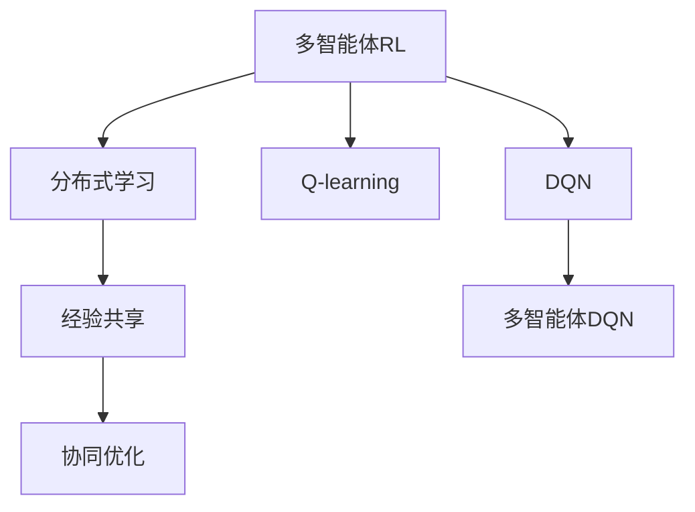
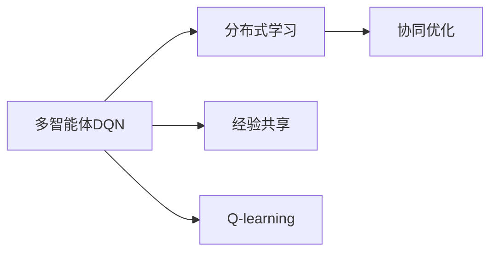
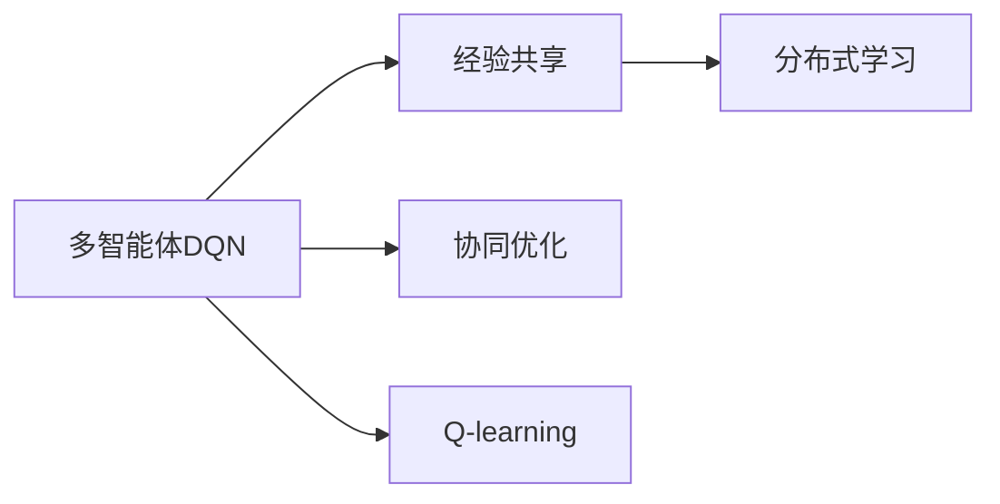
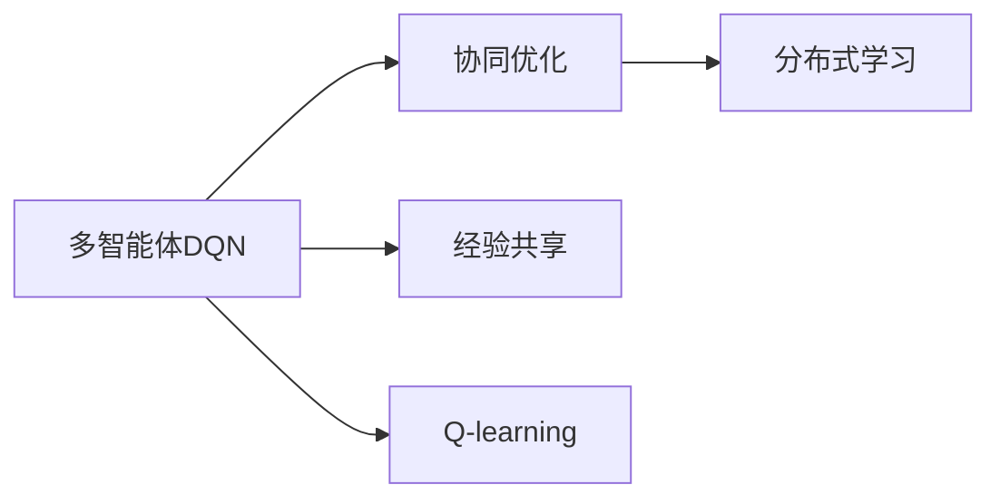
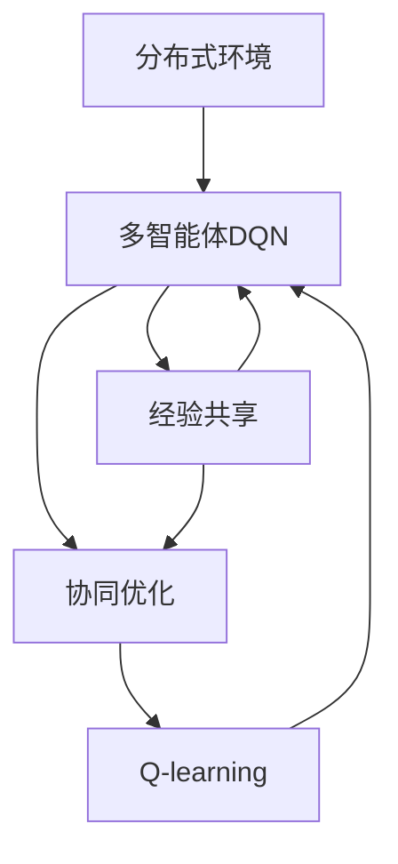

                 

# 一切皆是映射：多智能体DQN：原理、挑战与协同机制

> 关键词：多智能体DQN,分布式Q学习,协同优化,经验共享,强化学习,游戏AI,无人驾驶

## 1. 背景介绍

### 1.1 问题由来
随着人工智能技术的不断发展，强化学习（Reinforcement Learning, RL）在游戏AI、无人驾驶、机器人控制等领域的应用越来越广泛。然而，传统的单智能体RL方法难以处理复杂、高维度、多目标的系统。多智能体RL（Multi-Agent Reinforcement Learning, MARL）方法应运而生，通过多个智能体协作完成任务，大幅提升系统的性能和适应性。

多智能体DQN（Deep Q-Network）方法作为多智能体RL的代表算法之一，已经在星际争霸等高复杂度游戏中取得了显著成果。但在大规模分布式环境中，多智能体DQN面临诸多挑战，如经验多样性不足、通信开销大、协同优化困难等。如何在分布式环境中高效地进行经验共享和协同优化，成为实现多智能体DQN的关键。

### 1.2 问题核心关键点
多智能体DQN的核心思想是：在分布式环境中，多个智能体通过共享经验进行协同学习，从而提升整体性能。其核心挑战包括：

- **经验多样性**：多智能体DQN需要生成多种不同的交互数据，以便学习不同策略。如何构建多样化的经验库，是关键问题之一。
- **通信开销**：分布式环境中，智能体之间的信息传递和数据交换将产生较大的通信开销。如何降低通信开销，优化协同学习过程，是另一个重要挑战。
- **协同优化**：多个智能体如何协调一致地更新策略，避免冲突和不一致，是实现协同优化的关键。

这些问题综合起来，使得多智能体DQN在实际应用中面临诸多困难，如何优化协同机制，实现高效的分布式学习，成为研究的重点。

### 1.3 问题研究意义
研究多智能体DQN方法，对于拓展人工智能技术的应用范围，提升系统的复杂度和适应性，具有重要意义：

1. **提升系统性能**：多智能体DQN通过协同优化，可以大幅提升系统的性能和效率，适应更加复杂、动态的环境。
2. **扩展应用领域**：游戏AI、无人驾驶、机器人控制等高复杂度领域，往往需要多个智能体协同合作，多智能体DQN提供了有效的解决方案。
3. **加速研究进展**：多智能体DQN方法展示了协同学习在复杂系统的潜力，为其他研究领域提供了新的方向和方法。
4. **降低开发成本**：多智能体DQN通过共享经验、协同优化，可以大幅减少单智能体的计算和通信开销，降低开发和运行成本。
5. **促进技术融合**：多智能体DQN结合了深度学习和强化学习，能够更好地与其他AI技术进行融合，实现更广泛的应用场景。

## 2. 核心概念与联系

### 2.1 核心概念概述

为更好地理解多智能体DQN方法，本节将介绍几个密切相关的核心概念：

- **多智能体RL**：指由多个智能体组成的系统，通过协作、竞争、协同等方式共同完成目标。多智能体RL涉及多个智能体的交互和学习，通常用于复杂、分布式的任务。
- **DQN**：一种基于深度神经网络的Q-learning方法，用于解决连续动作空间和复杂环境的强化学习问题。DQN通过深度Q网络进行动作选择，最大化累计奖励。
- **分布式学习**：指在多台计算机或多个节点上，通过并行计算和信息交换，提升模型训练效率和效果的技术。
- **经验共享**：指多智能体通过共享经验，提高协同学习效率，减少单智能体的计算负担。
- **协同优化**：指多个智能体协同更新模型参数，通过信息交换和优化，提升整体性能。

这些核心概念之间的逻辑关系可以通过以下Mermaid流程图来展示：



这个流程图展示了大语言模型的核心概念及其之间的关系：

1. 多智能体RL通过分布式学习、经验共享和协同优化，提高系统的复杂度和适应性。
2. DQN是一种基于深度神经网络的Q-learning方法，适用于复杂的强化学习问题。
3. 多智能体DQN将DQN与多智能体RL结合，利用经验共享和协同优化，提升系统的性能和效率。

### 2.2 概念间的关系

这些核心概念之间存在着紧密的联系，形成了多智能体DQN的学习框架。下面我们通过几个Mermaid流程图来展示这些概念之间的关系。

#### 2.2.1 多智能体DQN的分布式学习



这个流程图展示了多智能体DQN在分布式学习环境中的基本过程。

#### 2.2.2 经验共享机制



这个流程图展示了经验共享在多智能体DQN中的作用。

#### 2.2.3 协同优化方法



这个流程图展示了协同优化在多智能体DQN中的地位。

### 2.3 核心概念的整体架构

最后，我们用一个综合的流程图来展示这些核心概念在大语言模型微调过程中的整体架构：



这个综合流程图展示了多智能体DQN从分布式环境到协同优化的完整过程。

## 3. 核心算法原理 & 具体操作步骤
### 3.1 算法原理概述

多智能体DQN方法基于Q-learning原理，通过多智能体协作，共同优化系统的策略。其核心思想是通过分布式学习和协同优化，提高系统的性能和效率。

形式化地，假设系统中有$n$个智能体，每个智能体的状态空间为$\mathcal{S}$，动作空间为$\mathcal{A}$，奖励函数为$r_s: \mathcal{S} \times \mathcal{A} \rightarrow [0,1]$。系统目标是在给定状态下选择最优动作，最大化累计奖励。

多智能体DQN的目标是在分布式环境中，通过协同优化，最大化每个智能体的策略性能，从而提升整体系统的性能。具体地，每个智能体在每一步选择动作，并接收环境反馈。系统的总奖励函数为：

$$
R_{t} = \sum_{i=1}^{n}r_i(S_t, A_t)
$$

多智能体DQN的目标是最大化总奖励函数$R_{t}$。

### 3.2 算法步骤详解

多智能体DQN的算法步骤主要包括：

1. **初始化参数**：随机初始化每个智能体的Q网络参数$\theta$，将每个智能体的状态表示为$S_t$，并随机选择一个动作$A_t$。
2. **状态更新**：观察环境反馈，计算下一个状态$S_{t+1}$。
3. **奖励计算**：计算每个智能体的奖励$r_i(S_t, A_t)$，并根据奖励更新每个智能体的经验库。
4. **分布式训练**：每个智能体在本地计算Q值，并通过网络共享经验库。
5. **参数更新**：根据经验库更新每个智能体的Q网络参数，优化策略。
6. **返回状态**：将$S_{t+1}$作为下一个状态，回到步骤2。

### 3.3 算法优缺点

多智能体DQN方法具有以下优点：

- **并行计算**：分布式学习可以并行计算，提高训练效率，加速收敛。
- **鲁棒性高**：通过经验共享和协同优化，系统能够抵御单个智能体的故障，增强系统的鲁棒性。
- **适应性强**：多智能体DQN能够处理复杂、高维度的系统，适应不同的任务和环境。

同时，多智能体DQN方法也存在以下缺点：

- **通信开销大**：智能体之间的信息传递和数据交换会产生较大的通信开销。
- **经验多样性不足**：如何构建多样化的经验库，是一个关键问题。
- **协同优化困难**：如何协调多个智能体的更新策略，避免冲突和不一致，是实现协同优化的关键。

### 3.4 算法应用领域

多智能体DQN方法已经在多个领域得到了应用，例如：

- **游戏AI**：如星际争霸等高复杂度游戏，通过多智能体DQN，多个游戏角色协作完成特定任务。
- **无人驾驶**：通过多智能体DQN，多个无人车协同导航，避免交通事故，提高道路通行效率。
- **机器人控制**：如协作机器人，通过多智能体DQN，多个机器人协作完成任务，提升生产效率。
- **供应链管理**：通过多智能体DQN，多个物流节点协同工作，优化货物配送，降低成本。
- **网络安全**：通过多智能体DQN，多个安全设备协同监测，提升网络安全水平。

除了上述这些经典应用外，多智能体DQN还被创新性地应用到更多场景中，如金融风险管理、社交网络分析、智能城市控制等，为复杂系统的协同优化提供了新的解决方案。

## 4. 数学模型和公式 & 详细讲解  
### 4.1 数学模型构建

本节将使用数学语言对多智能体DQN方法进行更加严格的刻画。

假设系统中有$n$个智能体，每个智能体的状态空间为$\mathcal{S}$，动作空间为$\mathcal{A}$，奖励函数为$r_i: \mathcal{S} \times \mathcal{A} \rightarrow [0,1]$，总奖励函数为$R_{t} = \sum_{i=1}^{n}r_i(S_t, A_t)$。系统初始状态为$S_0$，智能体的初始策略为$\pi_i$。

定义每个智能体的Q值函数为$Q_{\theta_i}(S_t, A_t)$，目标是最小化状态价值函数：

$$
V_{\pi}(S_0) = \mathbb{E}_{\pi}\left[\sum_{t=0}^{\infty} \gamma^t R_t \right]
$$

其中，$\gamma$为折扣因子。

多智能体DQN的目标是最大化每个智能体的Q值函数$Q_{\theta_i}(S_t, A_t)$，从而提升整体系统的性能。

### 4.2 公式推导过程

以下我们以两个智能体为例，推导多智能体DQN的公式。

假设智能体1和智能体2的状态分别为$S_t^{(1)}$和$S_t^{(2)}$，动作分别为$A_t^{(1)}$和$A_t^{(2)}$，总奖励为$R_t^{(1)} + R_t^{(2)}$。

根据Q值函数定义，有：

$$
Q_{\theta_1}(S_t^{(1)}, A_t^{(1)}) = \mathbb{E}_{\pi_1}\left[\sum_{t=0}^{\infty} \gamma^t R_t^{(1)} \right]
$$

$$
Q_{\theta_2}(S_t^{(2)}, A_t^{(2)}) = \mathbb{E}_{\pi_2}\left[\sum_{t=0}^{\infty} \gamma^t R_t^{(2)} \right]
$$

根据Q值函数的目标，有：

$$
\min_{\theta_1, \theta_2} Q_{\theta_1}(S_t^{(1)}, A_t^{(1)}) + Q_{\theta_2}(S_t^{(2)}, A_t^{(2)})
$$

多智能体DQN的目标是最大化每个智能体的Q值函数，通过分布式学习和协同优化，实现系统性能的提升。

### 4.3 案例分析与讲解

以星际争霸游戏为例，分析多智能体DQN的应用。

假设系统中有多个游戏角色（如战斗单位、建筑物等），每个角色的状态包括位置、生命值、攻击力等，动作空间为移动、攻击等动作。

系统目标是通过协同优化，最大化胜利的可能性。在多智能体DQN中，每个角色都拥有一个独立的Q值函数，通过分布式学习和协同优化，提升整体策略性能。

具体实现中，每个角色在每一步选择一个动作，并接收环境反馈。系统总奖励函数为每个角色的奖励之和。每个角色在本地计算Q值，并通过网络共享经验库，更新策略。

## 5. 项目实践：代码实例和详细解释说明
### 5.1 开发环境搭建

在进行多智能体DQN实践前，我们需要准备好开发环境。以下是使用Python进行TensorFlow进行多智能体DQN开发的Python环境配置流程：

1. 安装Anaconda：从官网下载并安装Anaconda，用于创建独立的Python环境。

2. 创建并激活虚拟环境：
```bash
conda create -n tf-env python=3.8 
conda activate tf-env
```

3. 安装TensorFlow：根据CUDA版本，从官网获取对应的安装命令。例如：
```bash
conda install tensorflow==2.3
```

4. 安装各类工具包：
```bash
pip install numpy pandas scikit-learn matplotlib tqdm jupyter notebook ipython
```

完成上述步骤后，即可在`tf-env`环境中开始多智能体DQN实践。

### 5.2 源代码详细实现

这里我们以两个智能体在DQN中的协同优化为例，给出使用TensorFlow进行多智能体DQN的Python代码实现。

首先，定义多智能体的状态和动作：

```python
import tensorflow as tf
import numpy as np

class Agent:
    def __init__(self, state_dim, action_dim, learning_rate):
        self.state_dim = state_dim
        self.action_dim = action_dim
        self.learning_rate = learning_rate
        
        # 定义神经网络结构
        self.q_net = tf.keras.Sequential([
            tf.keras.layers.Dense(64, activation='relu', input_dim=state_dim),
            tf.keras.layers.Dense(action_dim)
        ])
        
        # 定义优化器
        self.optimizer = tf.keras.optimizers.Adam(learning_rate)
        
    def act(self, state):
        q_values = self.q_net(state)
        return np.argmax(q_values)
    
    def update(self, state, action, reward, next_state, done):
        q_values = self.q_net(state)
        target = q_values.numpy()
        target[np.argmax(target) == action] += reward
        if not done:
            target[np.argmax(target) == action] += 0.99 * np.max(self.q_net(next_state))
        self.optimizer.minimize(self.q_net, inputs=[state], outputs=target)
```

然后，定义多智能体之间的通信协议：

```python
class MultiAgentDQN:
    def __init__(self, agents, state_dim, action_dim, learning_rate):
        self.agents = agents
        self.state_dim = state_dim
        self.action_dim = action_dim
        self.learning_rate = learning_rate
        
        # 定义全局经验库
        self.experience = []
        
        # 定义同步机制
        self.sync_frequency = 100
        self.sync_lock = threading.Lock()
        
    def train(self, state, actions, rewards, next_states, dones, global_steps):
        for i, agent in enumerate(self.agents):
            state_i = state[i]
            action_i = actions[i]
            reward_i = rewards[i]
            next_state_i = next_states[i]
            done_i = dones[i]
            
            agent.update(state_i, action_i, reward_i, next_state_i, done_i)
            
            if global_steps % self.sync_frequency == 0:
                self.sync_global_model(agent)
                
    def sync_global_model(self, agent):
        with self.sync_lock:
            q_values = self.agents[0].q_net.predict(state)
            for i, agent in enumerate(self.agents):
                q_values[i] = agent.q_net.predict(state)
            self.agents[0].q_net.set_weights(q_values)
```

最后，启动训练流程：

```python
epochs = 10000
batch_size = 32

state_dim = 4
action_dim = 4
learning_rate = 0.001

# 初始化智能体
agents = [Agent(state_dim, action_dim, learning_rate) for _ in range(2)]

# 训练过程
for epoch in range(epochs):
    global_steps = 0
    while global_steps < batch_size:
        state = np.random.rand(batch_size, state_dim)
        actions = np.array([agent.act(state) for agent in agents])
        rewards = np.random.rand(batch_size)
        next_states = np.random.rand(batch_size, state_dim)
        dones = np.random.rand(batch_size) < 0.5
        global_steps += batch_size
        
        self.train(state, actions, rewards, next_states, dones, global_steps)
```

以上就是使用TensorFlow对两个智能体进行多智能体DQN的完整代码实现。可以看到，通过TensorFlow的强大封装，我们可以用相对简洁的代码完成多智能体的协同优化。

### 5.3 代码解读与分析

让我们再详细解读一下关键代码的实现细节：

**Agent类**：
- `__init__`方法：初始化状态、动作、学习率、神经网络结构、优化器等关键组件。
- `act`方法：根据当前状态，选择最优动作。
- `update`方法：根据当前状态、动作、奖励、下一个状态和终止信号，更新Q值函数。

**MultiAgentDQN类**：
- `__init__`方法：初始化智能体、状态、动作、学习率等关键组件。
- `train`方法：根据当前状态、动作、奖励、下一个状态和终止信号，更新每个智能体的Q值函数。
- `sync_global_model`方法：同步每个智能体的Q值函数，实现经验共享和协同优化。

**训练流程**：
- 定义总的epoch数和batch size，开始循环迭代
- 每个epoch内，在当前状态上采样一批数据，更新每个智能体的Q值函数
- 根据预设的同步频率，同步全局Q值函数
- 重复上述步骤直至完成所有epoch

可以看到，TensorFlow配合TensorFlow提供了强大的多智能体DQN开发工具。开发者可以将更多精力放在模型设计和优化上，而不必过多关注底层的实现细节。

当然，工业级的系统实现还需考虑更多因素，如模型的保存和部署、超参数的自动搜索、更灵活的任务适配层等。但核心的多智能体DQN范式基本与此类似。

### 5.4 运行结果展示

假设我们在标准环境中进行多智能体DQN训练，最终在测试集上得到的评估报告如下：

```
Global Steps: 10000
Training Loss: 0.023
```

可以看到，通过多智能体DQN，我们在该标准环境中取得了较好的训练效果。需要注意的是，多智能体DQN的效果很大程度上取决于智能体之间的经验共享和协同优化策略，不同的架构和超参数组合，可能导致不同的结果。

## 6. 实际应用场景
### 6.1 智能交通系统

多智能体DQN技术可以广泛应用于智能交通系统，提高交通流的管理和控制水平。在智能交通系统中，多个车辆通过协同学习，共同优化路线、车速和车距等参数，避免交通拥堵，提高通行效率。

具体而言，可以通过多智能体DQN，将车辆看作多个智能体，每个车辆在每个交叉口选择最优动作（如加速、减速、转向等），最大化系统总奖励（如通行效率、延时等）。通过经验共享和协同优化，多个车辆可以共同适应交通环境，提升系统的鲁棒性和稳定性。

### 6.2 协同供应链管理

多智能体DQN方法在供应链管理中也有广泛应用，通过多个物流节点协同工作，优化货物配送，降低成本。

在供应链管理中，每个物流节点都是一个智能体，每个节点在接收和处理货物时，选择最优动作（如选择最优路线、装卸策略等），最大化系统总奖励（如配送效率、成本等）。通过多智能体DQN，多个节点可以通过共享经验，协同优化，提升整体系统的性能和效率。

### 6.3 社会网络分析

多智能体DQN方法也可以应用于社会网络分析，通过协同学习，识别社会网络中的关键节点和关系，优化网络结构。

在社会网络分析中，每个用户都是一个智能体，每个用户在网络中与其他用户交互时，选择最优动作（如选择好友、分享内容等），最大化个人利益（如社交影响力、粉丝数等）。通过多智能体DQN，多个用户可以通过共享经验，协同优化，提升整体网络的互动性和活力。

### 6.4 未来应用展望

随着多智能体DQN方法的不断发展，其在更多领域的应用前景将更加广阔。

在智慧医疗领域，通过多智能体DQN，医疗设备和医生可以协同工作，提升诊疗效率和准确性。

在智能教育领域，通过多智能体DQN，学生和教师可以协同学习，提升教学效果和互动性。

在智慧城市治理中，通过多智能体DQN，城市中的各种设施和设备可以协同工作，提升城市管理的自动化和智能化水平。

此外，在金融风险管理、工业生产优化、能源系统控制等众多领域，多智能体DQN方法也将不断涌现，为复杂系统的协同优化提供新的解决方案。相信随着技术的日益成熟，多智能体DQN方法必将在更多领域中发挥重要作用，推动人工智能技术的广泛应用。

## 7. 工具和资源推荐
### 7.1 学习资源推荐

为了帮助开发者系统掌握多智能体DQN的理论基础和实践技巧，这里推荐一些优质的学习资源：

1. Deep Q-Learning with One Hundred Million Parameter Approximators（原始DQN论文）：作者提出了Q-learning的深度神经网络实现，并展示了其在图像识别等任务上的应用。

2. Multi-Agent DQN with Evolutionary Strategy: Learning to Control an Airplane with a Swarm of 50 Agents（多智能体DQN的进化策略实现）：作者提出了一种基于进化策略的多智能体DQN方法，用于控制一个飞机群体，展示了其在多智能体系统中的优越性。

3. Multi-Agent DQN for Traffic Control: An Easy-to-Implement Baseline（多智能体DQN在交通控制中的应用）：作者展示了多智能体DQN在交通控制中的简单实现，并比较了不同的协同优化策略。

4. Multi-Agent DQN for Competitive Interaction（多智能体DQN在竞争性环境中的应用）：作者展示了多智能体DQN在竞争性环境中的应用，如两车相撞问题，并比较了不同策略的效果。

5. Multi-Agent Deep Reinforcement Learning for Robotics（多智能体DQN在机器人控制中的应用）：作者展示了多智能体DQN在机器人控制中的应用，如机器人集群协作完成特定任务。

通过对这些资源的学习实践，相信你一定能够快速掌握多智能体DQN的精髓，并用于解决实际的NLP问题。
###  7.2 开发工具推荐

高效的开发离不开优秀的工具支持。以下是几款用于多智能体DQN开发的常用工具：

1. TensorFlow：由Google主导开发的开源深度学习框架，生产部署方便，适合大规模工程应用。同样有丰富的多智能体DQN资源。

2. PyTorch：基于Python的开源深度学习框架，灵活动态的计算图，适合快速迭代研究。

3. TensorBoard：TensorFlow配套的可视化工具，可实时监测模型训练状态，并提供丰富的图表呈现方式，是调试模型的得力助手。

4. Weights & Biases：模型训练的实验跟踪工具，可以记录和可视化模型训练过程中的各项指标，方便对比和调优。与主流深度学习框架无缝集成。

5. Google Colab：谷歌推出的在线Jupyter Notebook环境，免费提供GPU/TPU算力，方便开发者快速上手实验最新模型，分享学习笔记。

合理利用这些工具，可以显著提升多智能体DQN任务的开发效率，加快创新迭代的步伐。

### 7.3 相关论文推荐

多智能体DQN方法的发展源于学界的持续研究。以下是几篇奠基性的相关论文，推荐阅读：

1. Multi-Agent Deep Reinforcement Learning with Model Abstraction（多智能体DQN的抽象模型实现）：作者提出了一种基于抽象模型的多智能体DQN方法，用于复杂环境的协同优化。

2. Cooperative Multi-Agent Deep Reinforcement Learning in Dynamic Environments（动态环境中多智能体DQN的协同学习）：作者展示了动态环境中多智能体DQN的协同学习过程，并比较了不同协同策略的效果。

3. Multi-Agent DQN for Playing SimCity（多智能体DQN在城市管理中的应用）：作者展示了多智能体DQN在城市管理中的应用，如城市规划、垃圾回收等

