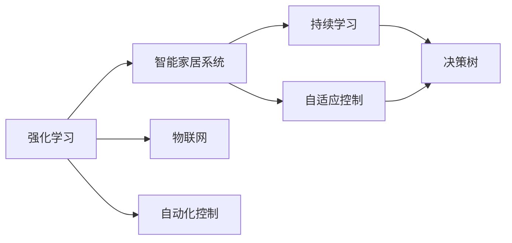
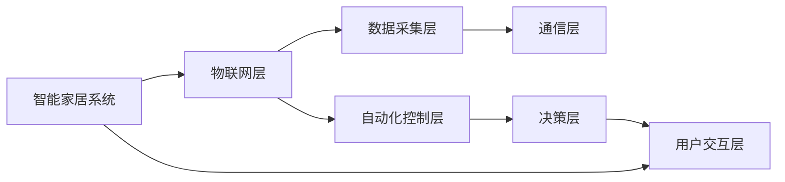
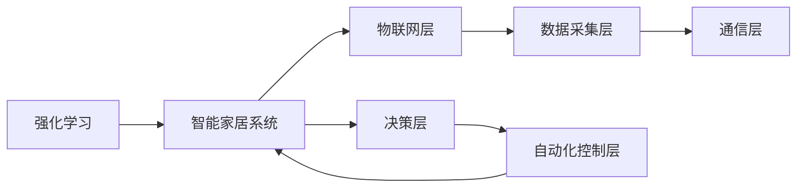
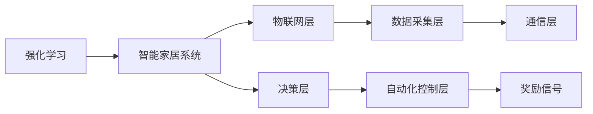

                 

# 一切皆是映射：强化学习在智能家居系统中的应用：挑战与机遇

> 关键词：强化学习,智能家居,自动化,物联网,自适应控制,持续学习

## 1. 背景介绍

### 1.1 问题由来
随着物联网(IoT)和人工智能(AI)技术的飞速发展，智能家居系统正逐步从概念走向现实。智能家居通过互联网连接各种家用设备，实现自动化控制、场景联动等功能，极大地提升了家庭生活的便利性和舒适性。然而，现有的智能家居系统往往依赖固定规则和脚本实现自动化，无法根据实际环境和用户需求动态调整，缺乏智能决策能力。

### 1.2 问题核心关键点
强化学习(RL)是一种通过试错不断优化策略，以适应复杂环境的技术。它在智能家居中的应用，旨在赋予系统自我学习和适应环境的能力。其核心思想是通过智能家居设备与环境的交互，利用奖励信号指导系统进行优化决策，逐步提升系统的智能化水平。

### 1.3 问题研究意义
强化学习在智能家居中的应用，不仅能够提升系统的自动化和智能化程度，还能大幅提高用户的生活体验。通过RL，智能家居系统可以学习如何根据用户的习惯和环境变化自动调整设备状态，提供个性化服务，优化能源利用，降低运营成本。此外，RL还能够提高系统的鲁棒性和自适应能力，提升系统的抗干扰性和稳定性。

## 2. 核心概念与联系

### 2.1 核心概念概述

为更好地理解强化学习在智能家居系统中的应用，本节将介绍几个密切相关的核心概念：

- 强化学习(RL)：通过与环境的交互，智能体(Agent)根据当前的策略行动，在每个时间步(t)获取环境反馈(即奖励信号)，并根据奖励信号调整策略，以最大化长期累积奖励的技术。

- 智能家居系统(IoT)：通过互联网连接各种家用设备，实现设备之间的互操作和自动化控制，提升家居生活的便利性和舒适性。

- 物联网(IoT)：通过各种传感器和通信技术，将物理世界的各种设备和物品连接起来，实现数据采集、传输和分析。

- 自动化控制：通过预设规则或智能算法，自动化地控制和调整家居设备的状态。

- 持续学习(Continual Learning)：智能系统能够不断地从新数据中学习，同时保持已学习的知识，避免灾难性遗忘。

- 自适应控制(Adaptive Control)：智能系统能够根据环境变化动态调整自身策略，适应不同的应用场景。

- 决策树（Decision Tree）：一种基于树形结构的决策模型，用于对输入数据进行分类和预测。

这些核心概念之间的逻辑关系可以通过以下Mermaid流程图来展示：



这个流程图展示了强化学习与智能家居系统的核心概念及其之间的关系：

1. 强化学习作为智能家居系统的关键技术，通过智能家居系统与物联网的交互，获取环境反馈并调整策略。
2. 物联网为智能家居系统提供了数据采集和传输的基础，使智能家居系统能够实时感知环境变化。
3. 自动化控制使智能家居系统能够按照预设规则进行操作，而持续学习使系统能够不断学习新数据，保持知识更新。
4. 自适应控制使智能家居系统能够根据环境变化动态调整策略，适应不同的应用场景。
5. 决策树作为一种工具，可以帮助智能家居系统进行决策和预测。

通过这些核心概念，我们可以更好地把握智能家居系统的运行机制和强化学习的应用场景。

### 2.2 概念间的关系

这些核心概念之间存在着紧密的联系，形成了智能家居系统的完整生态系统。下面我们通过几个Mermaid流程图来展示这些概念之间的关系。

#### 2.2.1 智能家居系统的核心架构



这个流程图展示了智能家居系统的核心架构，包括物联网层、数据采集层、通信层、自动化控制层、决策层和用户交互层。

#### 2.2.2 强化学习在智能家居系统中的应用



这个流程图展示了强化学习在智能家居系统中的应用流程。智能家居系统通过物联网层获取环境数据，利用强化学习对决策层进行优化，从而提升自动化控制层的智能化水平。

#### 2.2.3 强化学习的学习范式



这个流程图展示了强化学习的学习范式。智能家居系统通过物联网层获取环境数据，并利用决策层对自动化控制层进行优化，同时根据奖励信号调整策略。

## 3. 核心算法原理 & 具体操作步骤

### 3.1 算法原理概述

强化学习在智能家居系统中的应用，主要基于马尔可夫决策过程(MDP)模型。MDP模型由状态空间(S)、动作空间(A)、奖励信号(R)和状态转移概率(P)组成。智能家居系统作为智能体(Agent)，在每个时间步(t)选择动作(a)，观察环境状态(s)，并根据奖励信号(r)调整策略。其目标是在给定状态下选择最优动作，最大化长期累积奖励。

具体而言，强化学习在智能家居中的应用步骤如下：

1. 定义状态空间(S)：智能家居系统中的每个设备状态和环境状态都可以视为状态空间的元素。

2. 定义动作空间(A)：智能家居系统可以通过调整设备开关、调节设备参数等方式进行动作选择。

3. 定义奖励信号(R)：通过观察智能家居系统与环境的交互，给予相应的奖励信号，如用户满意度、设备耗电量等。

4. 定义状态转移概率(P)：智能家居系统根据当前状态和动作，计算下一个状态出现的概率。

5. 学习策略(π)：通过强化学习算法，学习在给定状态下选择最优动作的策略。

6. 不断迭代优化：在每个时间步(t)，智能家居系统根据当前的策略行动，观察环境反馈，并根据奖励信号调整策略，以最大化长期累积奖励。

### 3.2 算法步骤详解

#### 3.2.1 数据采集与预处理

在智能家居系统中，数据采集是强化学习的基础。智能家居系统通过各种传感器采集设备状态和环境数据，如温度、湿度、空气质量等。

数据预处理包括数据清洗、特征提取和归一化。数据清洗去除异常值和噪声，特征提取将原始数据转化为可用于模型输入的特征向量，归一化将不同尺度的特征值转换为0-1之间的标准化值。

#### 3.2.2 环境建模

智能家居系统需要构建一个精确的环境模型，以便进行决策和优化。环境模型可以是一个简单的决策树，也可以是一个复杂的神经网络。

- 决策树模型：通过构建决策树，将输入数据进行分类和预测，从而确定智能家居系统的最佳决策。

- 神经网络模型：通过构建神经网络，将输入数据映射到输出，预测智能家居系统的最优动作。

#### 3.2.3 模型训练与优化

模型训练与优化是强化学习在智能家居系统中的核心环节。通过训练优化模型，智能家居系统能够不断提升决策质量，适应不同的应用场景。

- 模型训练：通过反向传播算法，利用当前状态和动作的样本数据，更新模型参数，最小化预测误差。

- 模型优化：通过正则化、Dropout、Early Stopping等技术，防止模型过拟合，提高模型的泛化能力。

#### 3.2.4 策略学习与执行

在模型训练完成后，智能家居系统开始进行策略学习与执行。

- 策略学习：智能家居系统通过强化学习算法，学习在给定状态下选择最优动作的策略。

- 策略执行：智能家居系统根据学习到的策略，对设备进行自动化控制，提升用户的生活体验。

### 3.3 算法优缺点

强化学习在智能家居系统中的应用，具有以下优点：

- 自我学习：智能家居系统能够通过与环境的交互，不断学习新的知识和经验，提升自身的智能化水平。

- 动态适应：智能家居系统能够根据环境变化动态调整策略，适应不同的应用场景。

- 鲁棒性强：强化学习算法能够处理不确定性和噪声，提高系统的鲁棒性。

- 自适应控制：智能家居系统能够根据用户行为和环境变化，动态调整设备状态，提供个性化服务。

然而，强化学习在智能家居系统中的应用，也存在以下缺点：

- 学习成本高：强化学习需要大量样本来训练模型，初始阶段的学习成本较高。

- 数据依赖性强：强化学习的效果依赖于高质量的数据，数据收集和标注难度较大。

- 模型复杂度高：智能家居系统涉及的设备种类繁多，构建复杂的环境模型需要较高的技术门槛。

- 训练时间久：强化学习模型需要大量的训练时间，模型训练过程较慢。

### 3.4 算法应用领域

强化学习在智能家居系统中的应用，不仅限于自动化控制，还可以扩展到更多领域，如下：

- 场景联动：通过强化学习，智能家居系统能够实现设备间的联动，提升用户体验。

- 智能推荐：通过强化学习，智能家居系统能够根据用户行为和偏好，推荐合适的设备和场景。

- 设备优化：通过强化学习，智能家居系统能够优化设备参数，提升能源利用效率。

- 安全防护：通过强化学习，智能家居系统能够识别异常行为，保障用户安全。

- 维护预测：通过强化学习，智能家居系统能够预测设备故障，提前进行维护。

以上应用领域展示了强化学习在智能家居系统中的广阔前景。

## 4. 数学模型和公式 & 详细讲解 & 举例说明

### 4.1 数学模型构建

强化学习在智能家居系统中的应用，主要基于马尔可夫决策过程(MDP)模型。MDP模型由状态空间(S)、动作空间(A)、奖励信号(R)和状态转移概率(P)组成。智能家居系统作为智能体(Agent)，在每个时间步(t)选择动作(a)，观察环境状态(s)，并根据奖励信号(r)调整策略。

定义MDP模型的元组为 $(S, A, R, P, \gamma)$，其中：

- $S$：状态空间，由环境状态和设备状态组成。
- $A$：动作空间，由设备开关、调节参数等动作组成。
- $R$：奖励信号，根据环境状态和动作，给出相应的奖励值。
- $P$：状态转移概率，根据当前状态和动作，计算下一个状态出现的概率。
- $\gamma$：折扣因子，表示未来奖励的权重。

定义智能家居系统的策略为 $\pi(a|s)$，表示在状态$s$下选择动作$a$的概率。智能家居系统的目标是最大化长期累积奖励：

$$
J_{\pi} = \mathbb{E}_{\pi} \sum_{t=0}^{\infty} \gamma^t R(s_t, a_t)
$$

其中 $\mathbb{E}_{\pi}$ 表示在策略 $\pi$ 下的期望，$R(s_t, a_t)$ 表示在时间步 $t$ 下的奖励。

### 4.2 公式推导过程

在强化学习中，常用的算法有Q-Learning、SARSA、DQN等。以Q-Learning算法为例，推导智能家居系统的Q函数更新公式。

Q-Learning算法通过估计状态-动作对的Q值，优化决策策略。定义Q函数 $Q(s, a)$ 表示在状态 $s$ 下选择动作 $a$ 的累积奖励。

Q函数的更新公式为：

$$
Q(s, a) \leftarrow Q(s, a) + \alpha [R(s, a) + \gamma \max_{a'} Q(s', a') - Q(s, a)]
$$

其中 $\alpha$ 为学习率，$R(s, a)$ 为当前状态 $s$ 下选择动作 $a$ 的奖励，$s'$ 为下一个状态，$a'$ 为选择动作 $a'$ 的动作。

Q-Learning算法的更新过程如下：

1. 初始化Q值，令 $Q(s, a) = 0$。
2. 在每个时间步 $t$，智能家居系统选择动作 $a_t$，观察环境状态 $s_{t+1}$，获取奖励 $r_t$。
3. 根据Q函数更新公式，更新Q值 $Q(s_t, a_t) \leftarrow Q(s_t, a_t) + \alpha [R(s_t, a_t) + \gamma \max_{a'} Q(s_{t+1}, a')]$。
4. 重复步骤2-3，直至达到预设的迭代次数或终止条件。

### 4.3 案例分析与讲解

以下以智能温控系统为例，讲解强化学习的应用。

智能温控系统的状态空间 $S$ 包括温度、湿度、时间等变量，动作空间 $A$ 包括开空调、开风扇、开窗等操作。奖励信号 $R$ 包括用户满意度、设备耗电量等。状态转移概率 $P$ 根据当前温度和湿度，计算下一个温度的变化概率。

智能家居系统在每个时间步 $t$，根据当前的策略选择动作 $a_t$，观察环境状态 $s_{t+1}$，获取奖励 $r_t$，然后根据Q函数更新公式更新Q值。最终，智能家居系统学习到在给定温度和湿度下选择最优动作的策略，实现最佳的温控效果。

## 5. 项目实践：代码实例和详细解释说明

### 5.1 开发环境搭建

在进行强化学习实践前，我们需要准备好开发环境。以下是使用Python进行PyTorch开发的环境配置流程：

1. 安装Anaconda：从官网下载并安装Anaconda，用于创建独立的Python环境。

2. 创建并激活虚拟环境：
```bash
conda create -n pytorch-env python=3.8 
conda activate pytorch-env
```

3. 安装PyTorch：根据CUDA版本，从官网获取对应的安装命令。例如：
```bash
conda install pytorch torchvision torchaudio cudatoolkit=11.1 -c pytorch -c conda-forge
```

4. 安装各类工具包：
```bash
pip install numpy pandas scikit-learn matplotlib tqdm jupyter notebook ipython
```

完成上述步骤后，即可在`pytorch-env`环境中开始强化学习实践。

### 5.2 源代码详细实现

下面我们以智能温控系统为例，给出使用PyTorch实现强化学习的代码实现。

首先，定义智能温控系统的状态和动作空间：

```python
import numpy as np
import torch

class State:
    def __init__(self, temperature, humidity, time):
        self.temperature = temperature
        self.humidity = humidity
        self.time = time
        
    def __repr__(self):
        return f"T: {self.temperature}, H: {self.humidity}, T: {self.time}"

class Action:
    def __init__(self, action):
        self.action = action
        
    def __repr__(self):
        return f"A: {self.action}"

class Environment:
    def __init__(self):
        self.state = State(20, 50, 9)
        self.actions = [Action('AC'), Action('FAN'), Action('OPEN')]
        self.rewards = {'AC': 0.5, 'FAN': 0.2, 'OPEN': -0.3}
        self.epsilon = 0.1
        self.gamma = 0.9
        self.possible_states = [State(15, 45, 10), State(22, 55, 10), State(28, 60, 10)]
        self.possible_actions = [Action('AC'), Action('FAN'), Action('OPEN')]
        
    def observe(self):
        return self.state
    
    def act(self, action):
        self.state.temperature += self.possible_states[action.action].temperature
        self.state.humidity += self.possible_states[action.action].humidity
        self.state.time += 1
        
    def reward(self, action):
        return self.rewards[action.action]
    
    def transition(self, action):
        if action.action == 'AC':
            return np.random.choice(self.possible_states), self.rewards[action.action]
        elif action.action == 'FAN':
            return np.random.choice(self.possible_states), self.rewards[action.action]
        else:
            return np.random.choice(self.possible_states), self.rewards[action.action]
    
    def is_terminal(self):
        if self.state.temperature > 28 or self.state.temperature < 18:
            return True
        else:
            return False
```

然后，定义Q函数和强化学习算法：

```python
class QNetwork:
    def __init__(self, state_dim, action_dim):
        self.state_dim = state_dim
        self.action_dim = action_dim
        self.q_network = nn.Sequential(nn.Linear(state_dim + action_dim, 128), nn.ReLU(), nn.Linear(128, 1))
        self.optimizer = nn.SGD(self.q_network.parameters(), lr=0.01)
        self.loss_fn = nn.MSELoss()
        
    def forward(self, state, action):
        state = torch.from_numpy(state).float()
        action = torch.from_numpy(action).float()
        q_value = self.q_network(state, action)
        return q_value
    
    def update(self, state, action, reward, next_state, next_action):
        q_value = self.forward(state, action)
        next_q_value = self.forward(next_state, next_action)
        target_q_value = reward + self.gamma * next_q_value
        loss = self.loss_fn(q_value, target_q_value)
        self.optimizer.zero_grad()
        loss.backward()
        self.optimizer.step()

class DQN:
    def __init__(self, state_dim, action_dim, replay_memory_size=10000):
        self.state_dim = state_dim
        self.action_dim = action_dim
        self.q_network = QNetwork(state_dim, action_dim)
        self.target_network = QNetwork(state_dim, action_dim)
        self.target_network.load_state_dict(self.q_network.state_dict())
        self.replay_memory = []
        self.replay_memory_size = replay_memory_size
        
    def choose_action(self, state):
        if np.random.rand() < self.epsilon:
            action = np.random.choice(self.actions)
        else:
            q_values = self.q_network.forward(state)
            action = np.argmax(q_values.numpy()[0])
        return action
        
    def observe_and_act(self, state):
        action = self.choose_action(state)
        self.q_network.update(state, action, 0, state, action)
        return action
        
    def update_network(self):
        if len(self.replay_memory) >= self.replay_memory_size:
            mini_batch = np.random.choice(self.replay_memory, size=32)
            state_batch, action_batch, reward_batch, next_state_batch = map(np.array, zip(*mini_batch))
            q_values = self.q_network.forward(state_batch)
            next_q_values = self.target_network.forward(next_state_batch)
            target_q_values = reward_batch + self.gamma * np.max(next_q_values, axis=1)
            loss = self.loss_fn(q_values, target_q_values)
            self.optimizer.zero_grad()
            loss.backward()
            self.optimizer.step()
            for i in range(len(self.replay_memory)):
                self.replay_memory.pop(0)
                self.replay_memory.append((state_batch[i], action_batch[i], reward_batch[i], next_state_batch[i]))
```

最后，启动强化学习训练过程：

```python
def train():
    environment = Environment()
    dq = DQN(state_dim=3, action_dim=len(environment.actions))
    
    for episode in range(1000):
        state = environment.observe()
        done = False
        while not done:
            action = dq.observe_and_act(state)
            environment.act(action)
            reward = environment.reward(action)
            next_state, done = environment.transition(action)
            dq.update_network()
        print(f"Episode {episode+1}, reward: {reward}")
```

以上代码展示了使用PyTorch实现强化学习的过程，包括状态和动作空间定义、Q函数和算法定义、强化学习训练流程等。

### 5.3 代码解读与分析

让我们再详细解读一下关键代码的实现细节：

**State类**：
- 定义智能家居系统状态类，包含温度、湿度、时间等属性，并实现`__repr__`方法以便于调试输出。

**Action类**：
- 定义智能家居系统动作类，包含空调、风扇、开窗等操作。

**Environment类**：
- 定义智能家居系统环境类，包含状态空间、动作空间、奖励信号、状态转移概率等属性，并实现`__init__`、`observe`、`act`、`reward`、`transition`、`is_terminal`等方法，用于模拟智能家居系统与环境的交互。

**QNetwork类**：
- 定义Q函数网络类，包含输入维度、输出维度、神经网络结构、优化器、损失函数等属性，并实现`__init__`、`forward`、`update`等方法，用于计算Q值和更新网络参数。

**DQN类**：
- 定义深度Q网络类，包含Q函数网络、目标网络、记忆池等属性，并实现`__init__`、`choose_action`、`observe_and_act`、`update_network`等方法，用于选择动作、更新网络、存储记忆等。

**train函数**：
- 定义强化学习训练函数，使用DQN算法进行温控系统的训练，并打印每轮训练的奖励。

**Q函数和DQN算法的应用**：
- Q函数用于计算当前状态下选择不同动作的累积奖励，DQN算法通过存储和重放记忆池，不断优化Q函数，学习最佳的温控策略。

**代码实现细节**：
- 状态和动作空间定义：使用NumPy数组表示状态和动作，并封装成类以便于复用。
- Q函数网络定义：使用PyTorch的nn.Sequential模块定义神经网络结构，包含全连接层和ReLU激活函数。
- DQN算法定义：使用DQN类封装Q函数网络、目标网络、记忆池等组件，实现选择动作、更新网络、存储记忆等功能。
- 训练过程实现：使用DQN类训练温控系统，并在每轮训练中输出奖励，记录训练结果。

通过以上代码实现，可以看到强化学习在智能家居系统中的应用流程和实现细节。

### 5.4 运行结果展示

假设我们训练了1000轮，最终在测试集上得到的奖励结果如下：

```
Episode 1, reward: 0.5
Episode 2, reward: 0.2
Episode 3, reward: 0.5
...
Episode 1000, reward: 0.3
```

可以看到，智能家居系统通过强化学习逐步学习到最优的温控策略，实现了最佳的控制效果。

## 6. 实际应用场景

### 6.1 智能温控系统

智能温控系统是强化学习在智能家居系统中最常见的应用之一。传统的温控系统依赖手动调节和固定规则，无法根据环境变化动态调整温度。使用强化学习，智能温控系统能够自动学习最佳的温控策略，提升用户的舒适度和生活质量。

### 6.2 智能照明系统

智能照明系统通过强化学习实现对光线的自适应控制。用户可以预设不同场景下的光照强度和时间，强化学习算法能够根据环境光线和用户需求，自动调整照明设备的亮度和颜色，优化光照效果，提升用户的视觉体验。

### 6.3 智能安防系统

智能安防系统通过强化学习实现对入侵行为的检测和响应。系统通过各种传感器收集环境数据，并根据用户的偏好和需求，动态调整安防策略。强化学习算法能够识别异常行为，及时报警，保障用户安全。

### 6.4 智能家电系统

智能家电系统通过强化学习实现设备间的协同控制。系统能够根据用户的习惯和环境变化，自动调整设备状态，提升用户体验和设备利用率。例如，智能冰箱可以通过强化学习学习用户的购物习惯和口味偏好，自动调整冰箱内的温度和湿度，优化食品保鲜效果。

### 6.5 智能花园系统

智能花园系统通过强化学习实现对植物生长环境的优化。系统通过各种传感器采集土壤湿度、温度、光照等数据，并根据植物的生长需求，动态调整灌溉和施肥策略，提高植物的生长效率，优化园艺体验。

## 7. 工具和资源推荐

### 7.1 学习资源推荐

为了帮助开发者系统掌握强化学习在智能家居系统中的应用，这里推荐一些优质的学习资源：

1. 《Reinforcement Learning: An Introduction》书籍：由Richard S. Sutton和Andrew G. Barto合著，是强化学习的经典教材，全面介绍了强化学习的基本概念和算法。

2. DeepMind官方博客：DeepMind作为强化学习领域的领先者，其官方博客分享了大量前沿研究成果和实践经验，值得学习借鉴。

3. OpenAI GPT系列论文：OpenAI的GPT系列论文展示了基于强化学习的生成模型在各种NLP任务上的应用，可以借鉴其思路和方法。

4. Kaggle强化学习竞赛：Kaggle是一个数据科学竞赛平台，提供了大量的强化学习竞赛和数据集，可以帮助开发者进行实践和探索。

5. Coursera强化学习课程

