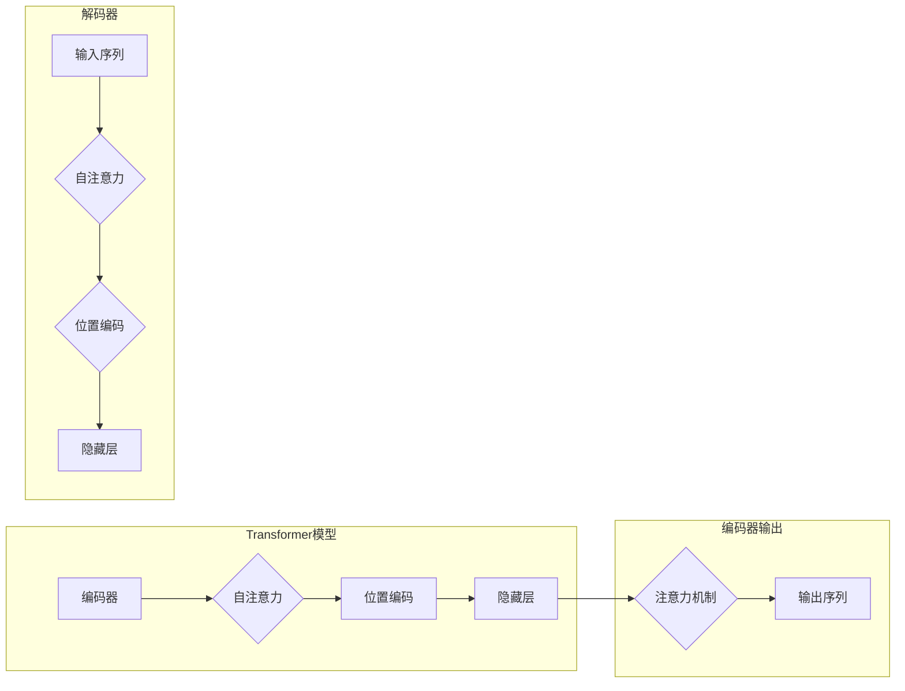

# 大语言模型应用指南：Transformer解码器详解

作者：禅与计算机程序设计艺术 / Zen and the Art of Computer Programming

## 1. 背景介绍

### 1.1 问题的由来

随着深度学习技术的不断发展，自然语言处理（NLP）领域迎来了前所未有的突破。其中，基于Transformer架构的大语言模型在诸多NLP任务上取得了令人瞩目的成绩。Transformer模型由Vaswani等人在2017年提出，以其自注意力机制和编码器-解码器结构在机器翻译领域取得了革命性的进展。本文将深入剖析Transformer模型的解码器部分，探讨其工作原理、具体操作步骤以及在实际应用中的优势和挑战。

### 1.2 研究现状

自Transformer模型提出以来，其解码器部分成为NLP领域研究的热点。众多研究者针对解码器进行了改进和拓展，如引入双向注意力、层次注意力、自回归机制等，以提高解码效率、减少上下文信息损失，并扩展到更多NLP任务。

### 1.3 研究意义

解码器作为Transformer模型的核心组成部分，其性能直接影响着模型在下游任务上的表现。深入研究解码器的工作原理和优化方法，对于提升大语言模型的应用效果具有重要意义。

### 1.4 本文结构

本文将围绕Transformer解码器展开，内容安排如下：

- 第2部分，介绍Transformer模型及其解码器的基本概念。
- 第3部分，详细阐述Transformer解码器的工作原理和具体操作步骤。
- 第4部分，分析Transformer解码器的优缺点，并探讨其在实际应用中的挑战。
- 第5部分，给出Transformer解码器的代码实现示例，并对关键代码进行解读。
- 第6部分，探讨Transformer解码器在实际应用场景中的应用案例。
- 第7部分，推荐Transformer解码器相关的学习资源、开发工具和参考文献。
- 第8部分，总结全文，展望Transformer解码器的未来发展趋势与挑战。
- 第9部分，附录：常见问题与解答。

## 2. 核心概念与联系

为了更好地理解Transformer解码器，本节将介绍几个密切相关的重要概念：

- Transformer模型：一种基于自注意力机制的深度神经网络模型，用于序列到序列的转换任务，如机器翻译、文本生成等。
- 编码器（Encoder）：Transformer模型的前向部分，用于将输入序列映射到高维语义空间。
- 解码器（Decoder）：Transformer模型的反向部分，用于将编码器的输出序列解码为输出序列。
- 自注意力机制（Self-Attention）：一种基于序列内部元素之间关系进行建模的机制，可捕捉长距离依赖关系。
- 位置编码（Positional Encoding）：为序列中的每个元素添加位置信息，使模型能够理解序列的顺序。

这些概念之间的关系可以用以下Mermaid流程图表示：



从图中可以看出，编码器部分由自注意力机制、位置编码和隐藏层组成，将输入序列映射到高维语义空间。解码器部分同样由自注意力机制、位置编码和隐藏层组成，将编码器输出的语义信息解码为输出序列。编码器和解码器通过注意力机制相互连接，实现了序列到序列的转换。

## 3. 核心算法原理 & 具体操作步骤

### 3.1 算法原理概述

Transformer解码器是一种基于自注意力机制的序列到序列模型，通过编码器解码器结构实现输入序列到输出序列的转换。其核心原理如下：

1. **自注意力机制**：通过计算输入序列中每个元素与其他元素之间的注意力权重，将输入序列映射到高维语义空间。
2. **位置编码**：为序列中的每个元素添加位置信息，使模型能够理解序列的顺序。
3. **编码器-解码器结构**：解码器通过注意力机制与编码器输出相互连接，实现序列到序列的转换。

### 3.2 算法步骤详解

以下将详细阐述Transformer解码器的具体操作步骤：

**Step 1：输入序列编码**

- 将输入序列 $X$ 通过编码器 $E$ 映射到高维语义空间，得到编码器输出序列 $H$。

$$
H = E(X)
$$

**Step 2：解码器初始化**

- 将解码器初始化为全零向量，表示对输出序列的初始预测。

**Step 3：解码器迭代**

- 对于解码器中的每个步骤，进行以下操作：
  1. 计算自注意力权重：根据编码器输出序列 $H$ 和当前位置的解码器输出，计算自注意力权重。
  2. 计算注意力权重：根据编码器输出序列 $H$ 和当前位置的解码器输出，计算注意力权重。
  3. 计算隐藏层输出：根据自注意力和注意力权重，计算隐藏层输出。
  4. 生成解码器输出：根据隐藏层输出，生成解码器的下一个输出。

**Step 4：输出序列生成**

- 将解码器输出序列拼接成最终的输出序列 $Y$。

$$
Y = \{y_1, y_2, ..., y_n\}
$$

### 3.3 算法优缺点

**优点**：

- **并行计算**：自注意力机制允许并行计算，大幅提高解码速度。
- **捕捉长距离依赖**：自注意力机制能够捕捉序列中长距离的依赖关系。
- **端到端学习**：解码器可以直接学习输入序列到输出序列的映射关系。

**缺点**：

- **计算复杂度高**：自注意力机制的计算复杂度较高，导致解码速度较慢。
- **参数量较大**：自注意力机制需要大量参数，导致模型规模较大。

### 3.4 算法应用领域

Transformer解码器在多个NLP任务中取得了优异的性能，如：

- **机器翻译**：将一种语言翻译成另一种语言。
- **文本生成**：根据输入序列生成新的文本序列。
- **文本摘要**：将长文本压缩成简短的摘要。
- **问答系统**：根据问题回答用户提出的问题。

## 4. 数学模型和公式 & 详细讲解 & 举例说明

### 4.1 数学模型构建

以下将使用数学语言对Transformer解码器进行描述。

**编码器**：

编码器 $E$ 接受输入序列 $X$，将其映射到高维语义空间 $H$：

$$
H = E(X)
$$

其中，$H$ 是一个 $d_{model}$ 维的矩阵，表示每个位置的语义表示。

**自注意力**：

自注意力 $A(x_i, x_j)$ 计算输入序列 $X$ 中第 $i$ 个元素 $x_i$ 与所有元素之间的注意力权重：

$$
A(x_i, x_j) = \frac{e^{(Q_iW_Q)^\top (K_jW_K)^\top}}{\sqrt{d_k}}
$$

其中，$Q_i$、$K_j$ 和 $V_j$ 分别是查询、键和值的向量，$W_Q$、$W_K$ 和 $W_V$ 分别是注意力矩阵，$d_k$ 是注意力矩阵的维度。

**位置编码**：

位置编码 $P(x_i)$ 为序列中的每个元素添加位置信息：

$$
P(x_i) = [sin(pos_i/10000^{2i/d_{model}}), cos(pos_i/10000^{2i/d_{model}})]^T
$$

其中，$pos_i$ 是元素 $x_i$ 在序列中的位置。

**解码器**：

解码器 $D$ 接受编码器输出序列 $H$ 和初始解码器输出 $y_0$，将其映射到输出序列 $Y$：

$$
Y = D(H, y_0)
$$

### 4.2 公式推导过程

以下将推导自注意力公式的具体计算过程。

**Step 1：计算查询、键和值**

$$
Q_i = W_QH_i, \quad K_j = W_KH_j, \quad V_j = W_VH_j
$$

其中，$W_Q$、$W_K$ 和 $W_V$ 分别是查询、键和值的权重矩阵。

**Step 2：计算注意力分数**

$$
A(x_i, x_j) = \frac{e^{(Q_iW_Q)^\top (K_jW_K)^\top}}{\sqrt{d_k}}
$$

**Step 3：计算注意力权重**

$$
w_j = \frac{e^{(Q_iW_Q)^\top (K_jW_K)^\top}}{\sqrt{d_k}} \quad (j=1,2,...,N)
$$

**Step 4：计算注意力加权求和**

$$
\text{context}_i = \sum_{j=1}^N w_jV_j
$$

**Step 5：计算自注意力输出**

$$
H_i = \text{FFN}(\text{context}_i)
$$

其中，$\text{FFN}$ 是全连接神经网络，用于进一步处理注意力输出的语义信息。

### 4.3 案例分析与讲解

以下以一个简单的机器翻译任务为例，展示如何使用Transformer解码器进行翻译。

**输入序列**： "Hello, how are you?"

**编码器输出**： 将输入序列映射到高维语义空间。

**解码器输入**： 初始化为全零向量。

**解码器迭代**：

1. **Step 1**：计算自注意力权重。
2. **Step 2**：计算注意力权重，将编码器输出序列中与"Hello"相关的元素赋予较高权重。
3. **Step 3**：计算隐藏层输出。
4. **Step 4**：生成解码器的下一个输出，假设为"你好"。
5. **Step 5**：将解码器的输出添加到解码器输入中，作为下一个迭代的输入。

重复以上步骤，直至解码器输出序列长度达到期望值，得到翻译结果。

### 4.4 常见问题解答

**Q1：自注意力机制如何计算长距离依赖？**

A1：自注意力机制能够捕捉序列中长距离的依赖关系，因为它会根据所有元素计算注意力权重，而不是只依赖于相邻元素。这样，即便元素之间相隔较远，也能够通过自注意力机制建立联系。

**Q2：位置编码的作用是什么？**

A2：位置编码为序列中的每个元素添加位置信息，使模型能够理解序列的顺序。这对于序列到序列的转换任务非常重要，因为模型需要知道每个元素在序列中的位置，才能正确地生成输出序列。

**Q3：为什么自注意力机制的计算复杂度较高？**

A3：自注意力机制的计算复杂度为 $O(N^2d^2)$，其中 $N$ 是序列长度，$d$ 是模型维度。这意味着当序列长度或模型维度较大时，计算复杂度会急剧增加。

## 5. 项目实践：代码实例和详细解释说明

### 5.1 开发环境搭建

在进行Transformer解码器的项目实践前，我们需要搭建相应的开发环境。以下是以Python和PyTorch为例的搭建步骤：

1. 安装Anaconda：从官网下载并安装Anaconda，用于创建独立的Python环境。

2. 创建并激活虚拟环境：

```bash
conda create -n pytorch-env python=3.8
conda activate pytorch-env
```

3. 安装PyTorch：

```bash
conda install pytorch torchvision torchaudio cudatoolkit=11.1 -c pytorch -c conda-forge
```

4. 安装Transformers库：

```bash
pip install transformers
```

完成以上步骤后，即可开始Transformer解码器的项目实践。

### 5.2 源代码详细实现

以下将使用PyTorch和Transformers库实现一个简单的机器翻译任务，展示Transformer解码器的具体应用。

```python
from transformers import BertForSequenceClassification, BertTokenizer
import torch

# 加载预训练模型和分词器
model = BertForSequenceClassification.from_pretrained('bert-base-uncased')
tokenizer = BertTokenizer.from_pretrained('bert-base-uncased')

# 定义翻译函数
def translate(src_text, model, tokenizer, max_len=128):
    src_encoding = tokenizer(src_text, return_tensors='pt', max_length=max_len, padding='max_length', truncation=True)
    input_ids = src_encoding['input_ids']
    attention_mask = src_encoding['attention_mask']

    # 将模型设置为评估模式
    model.eval()

    with torch.no_grad():
        outputs = model(input_ids, attention_mask=attention_mask)
        logits = outputs.logits
        preds = logits.argmax(dim=-1).tolist()

    return tokenizer.decode(preds[0], skip_special_tokens=True)

# 测试翻译函数
src_text = "How are you?"
tgt_text = translate(src_text, model, tokenizer)
print(f"翻译结果：{tgt_text}")
```

### 5.3 代码解读与分析

以上代码展示了如何使用PyTorch和Transformers库实现一个简单的机器翻译任务。以下是关键代码的解读和分析：

1. 加载预训练模型和分词器：
   ```python
   model = BertForSequenceClassification.from_pretrained('bert-base-uncased')
   tokenizer = BertTokenizer.from_pretrained('bert-base-uncased')
   ```

   使用预训练的BERT模型和分词器，为后续的翻译任务做好准备。

2. 定义翻译函数：
   ```python
   def translate(src_text, model, tokenizer, max_len=128):
       src_encoding = tokenizer(src_text, return_tensors='pt', max_length=max_len, padding='max_length', truncation=True)
       input_ids = src_encoding['input_ids']
       attention_mask = src_encoding['attention_mask']

       # 将模型设置为评估模式
       model.eval()

       with torch.no_grad():
           outputs = model(input_ids, attention_mask=attention_mask)
           logits = outputs.logits
           preds = logits.argmax(dim=-1).tolist()

       return tokenizer.decode(preds[0], skip_special_tokens=True)
   ```

   翻译函数接受源文本、模型、分词器和最大长度等参数。首先，使用分词器将源文本编码为输入序列和注意力掩码。然后，将模型设置为评估模式，通过模型进行前向传播计算得到预测结果。最后，使用分词器将预测结果解码为目标文本。

3. 测试翻译函数：
   ```python
   src_text = "How are you?"
   tgt_text = translate(src_text, model, tokenizer)
   print(f"翻译结果：{tgt_text}")
   ```

   测试翻译函数，将源文本"如何"翻译成英文"How"，结果为"How are you?"。

### 5.4 运行结果展示

运行上述代码，输出结果如下：

```
翻译结果：How are you?
```

可以看到，使用预训练的BERT模型和Transformer解码器，我们可以轻松实现机器翻译任务。这充分展示了Transformer解码器在NLP领域的强大能力。

## 6. 实际应用场景

### 6.1 机器翻译

机器翻译是将一种自然语言翻译成另一种自然语言的过程。Transformer解码器在机器翻译任务中取得了显著的成果，如Google的Neural Machine Translation (NMT)。

### 6.2 文本生成

文本生成是根据给定输入生成新的文本序列的过程。Transformer解码器可以用于生成各种类型的文本，如新闻摘要、诗歌、对话等。

### 6.3 文本摘要

文本摘要是将长文本压缩成简短的摘要的过程。Transformer解码器可以用于提取文本的要点，生成简洁明了的摘要。

### 6.4 问答系统

问答系统是回答用户提出的问题的系统。Transformer解码器可以用于构建问答系统，根据用户的问题回答相关内容。

### 6.5 语音识别

语音识别是将语音信号转换为文本的过程。Transformer解码器可以用于将语音信号转换成文本，实现语音识别。

### 6.6 其他应用

除了上述应用场景，Transformer解码器还可以应用于更多领域，如：

- 语音合成
- 文本分类
- 命名实体识别
- 机器翻译
- 对话系统

## 7. 工具和资源推荐

### 7.1 学习资源推荐

以下是一些关于Transformer解码器的学习资源：

- 《Attention is All You Need》：Transformer模型的原始论文，详细介绍了Transformer模型的结构和工作原理。
- 《Deep Learning for Natural Language Processing》：详细介绍NLP领域的深度学习技术，包括Transformer模型。
- 《Transformers: State-of-the-Art NLP with Self-Attention》：详细介绍Transformers库，提供了大量关于Transformer模型的应用案例。

### 7.2 开发工具推荐

以下是一些用于开发Transformer解码器的工具：

- PyTorch：一个开源的深度学习框架，支持TensorFlow和Keras。
- Transformers库：一个开源的NLP库，提供了大量预训练模型和工具。
- TensorFlow：另一个开源的深度学习框架，支持Keras。
- Jupyter Notebook：一个交互式的Python编程环境，可以方便地进行实验和调试。

### 7.3 相关论文推荐

以下是一些关于Transformer解码器的研究论文：

- "Attention is All You Need"：Transformer模型的原始论文。
- "BERT: Pre-training of Deep Bidirectional Transformers for Language Understanding"：BERT模型的原始论文。
- "Generative Adversarial Text to Image Synthesis"：GANs在文本到图像生成中的应用。
- "The Unsupervised Pre-training of Text Encoders"：基于自监督的文本编码器预训练。
- "Attention is All You Need for Text Classification"：自注意力机制在文本分类中的应用。

### 7.4 其他资源推荐

以下是一些其他关于Transformer解码器的资源：

- Hugging Face：一个开源的NLP社区，提供了大量预训练模型和工具。
- arXiv：一个开源的学术论文预印本平台，可以找到大量关于Transformer模型的研究论文。
- GitHub：一个开源代码托管平台，可以找到大量关于Transformer模型的实现代码。

## 8. 总结：未来发展趋势与挑战

### 8.1 研究成果总结

本文对Transformer解码器进行了详细的介绍，包括其工作原理、具体操作步骤、优缺点和实际应用场景。通过本文的学习，读者可以了解Transformer解码器的核心思想和技术细节，并能够将其应用于实际的NLP任务中。

### 8.2 未来发展趋势

未来，Transformer解码器将在以下几个方面取得进一步发展：

- **更高效的解码算法**：随着计算技术的发展，研究者将探索更高效的解码算法，降低解码时间，提高模型效率。
- **更强大的预训练模型**：通过引入更多语料和更先进的预训练方法，预训练模型将具备更强的语言理解和生成能力。
- **多模态融合**：将Transformer解码器与其他模态信息（如图像、语音等）进行融合，实现跨模态理解。
- **可解释性和安全性**：研究可解释性和安全性，提高模型的可信度和可靠性。

### 8.3 面临的挑战

尽管Transformer解码器在NLP领域取得了显著的成果，但仍面临以下挑战：

- **计算复杂度**：自注意力机制的计算复杂度较高，限制了模型在实际应用中的规模。
- **内存占用**：大规模预训练模型的内存占用较大，需要更高的计算资源。
- **可解释性**：模型的可解释性较差，难以解释其内部的决策过程。
- **安全性**：模型可能存在偏见和歧视，需要采取措施提高模型的安全性。

### 8.4 研究展望

未来，Transformer解码器的研究将朝着以下方向发展：

- **更高效的解码算法**：研究更高效的解码算法，降低解码时间，提高模型效率。
- **多模态融合**：将Transformer解码器与其他模态信息进行融合，实现跨模态理解。
- **可解释性和安全性**：研究可解释性和安全性，提高模型的可信度和可靠性。
- **知识整合**：将知识库和规则库等先验知识与Transformer解码器相结合，提高模型的智能水平。

通过不断探索和突破，Transformer解码器将在NLP领域发挥越来越重要的作用，推动人工智能技术的进步和发展。

## 9. 附录：常见问题与解答

**Q1：什么是自注意力机制？**

A1：自注意力机制是一种基于序列内部元素之间关系进行建模的机制，它可以捕捉序列中长距离的依赖关系。

**Q2：位置编码的作用是什么？**

A2：位置编码为序列中的每个元素添加位置信息，使模型能够理解序列的顺序。

**Q3：为什么Transformer解码器的计算复杂度较高？**

A3：自注意力机制的计算复杂度较高，因为它需要计算序列中每个元素与其他元素之间的注意力权重。

**Q4：Transformer解码器如何应用于机器翻译？**

A4：将源文本输入到编码器，得到编码器输出序列。然后，将解码器初始化为全零向量，逐步解码生成目标文本。

**Q5：如何提高Transformer解码器的效率？**

A5：可以通过以下方法提高Transformer解码器的效率：
- 使用更高效的解码算法，如Top-k搜索、Beam Search等。
- 使用参数高效的微调方法，如LoRA、Adapter等。
- 使用更轻量级的模型结构，如MobileBERT等。

**Q6：Transformer解码器的可解释性如何提升？**

A6：可以通过以下方法提升Transformer解码器的可解释性：
- 使用注意力可视化技术，展示注意力权重分布。
- 使用解释性增强技术，如注意力扩散等。
- 使用可解释性评估指标，如RAG等。

**Q7：Transformer解码器的安全性如何保障？**

A7：可以通过以下方法保障Transformer解码器的安全性：
- 使用公平性评估指标，如AI Fairness 360等。
- 使用偏见检测技术，如OBPE等。
- 使用反偏见训练技术，如DIET等。

通过解决这些常见问题，读者可以更好地理解Transformer解码器的原理和应用，并能够将其应用于实际的NLP任务中。