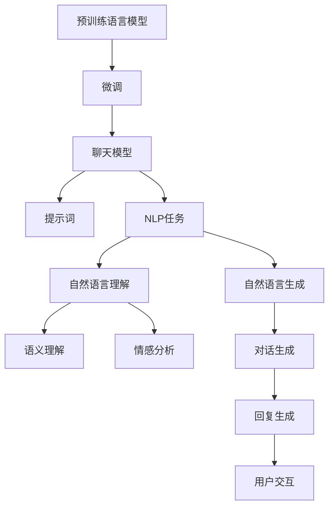
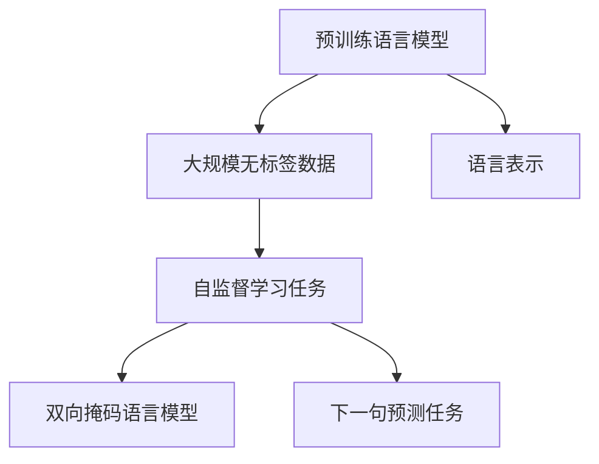
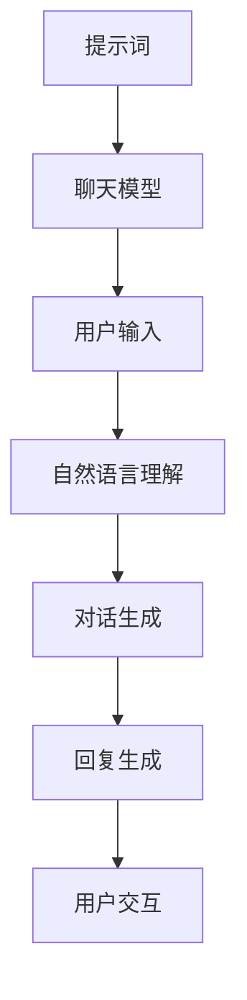
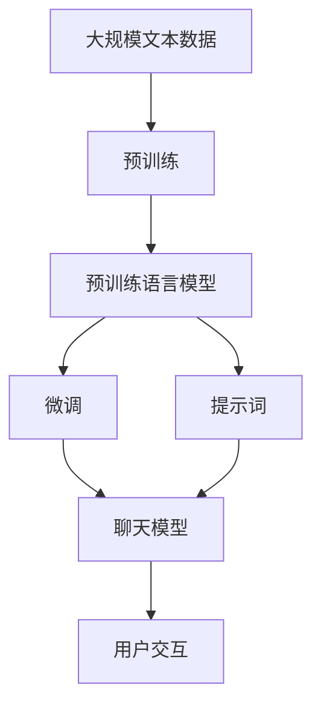

                 

# 【LangChain编程：从入门到实践】聊天模型提示词的构建

> 关键词：聊天模型,提示词,预训练模型,微调,Fine-tuning,Transformer,BERT,模型优化,语义理解,自然语言处理(NLP)

## 1. 背景介绍

### 1.1 问题由来
在自然语言处理(NLP)领域，聊天模型(Chatbot)作为人工智能的重要应用之一，正逐渐在各种场景中扮演重要角色。例如，在智能客服、教育辅导、智能家居等领域，聊天模型可以通过与用户进行自然语言对话，解答问题、提供服务。然而，构建一个高效、有用的聊天模型并不容易，需要解决许多技术问题，如模型选择、数据处理、提示词设计等。

### 1.2 问题核心关键点
聊天模型是一种通过训练来学习自然语言对话规则的模型，其核心思想是通过预训练语言模型（如BERT、GPT等）进行微调（Fine-tuning），使其能够理解和生成符合特定对话场景的文本。预训练模型通过在海量无标签文本数据上学习语言的通用表示，微调则通过下游任务的少量有标签数据对模型进行优化，使其具有特定的对话能力。

微调的关键在于选择合适的提示词（Prompt），以便模型能够准确理解和生成符合对话要求的回复。提示词设计的好坏，直接影响聊天模型的效果。本文将重点讨论提示词的构建方法，介绍如何通过合理的提示词设计，构建高性能聊天模型。

### 1.3 问题研究意义
聊天模型的成功构建，对于提升用户交互体验、降低人工服务成本、推动AI技术在实际应用中的落地具有重要意义。提示词的设计能够帮助聊天模型更好地理解用户意图，提高回答的准确性和流畅度，从而提升用户体验。同时，好的提示词设计还能降低模型训练和优化过程中的数据成本和时间成本，提高开发效率。

## 2. 核心概念与联系

### 2.1 核心概念概述

为更好地理解提示词在聊天模型构建中的作用，本节将介绍几个密切相关的核心概念：

- 聊天模型(Chatbot)：一种能够理解和生成自然语言对话的模型，通常基于深度学习技术，如Transformer、RNN等。
- 预训练语言模型(Pre-trained Language Model)：通过在大规模无标签文本数据上学习语言表示的模型，如BERT、GPT等。
- 微调(Fine-tuning)：通过下游任务的少量有标签数据，对预训练模型进行优化，使其具备特定任务能力的过程。
- 提示词(Prompt)：在输入文本中添加的一组引导模型生成特定回答的文本，有助于模型理解用户意图和生成符合要求的回复。
- 自然语言处理(Natural Language Processing, NLP)：一种研究计算机如何理解和生成人类语言的学科，涉及语言理解、语义分析、语音识别等技术。
- Transformer：一种基于自注意力机制的神经网络模型，广泛应用于深度学习领域，用于文本分类、生成、机器翻译等任务。
- BERT：由Google提出的预训练语言模型，通过双向掩码语言模型和下一句预测任务学习语言表示。
- 模型优化：通过调整模型结构和参数，提高模型性能和效率的过程，包括正则化、Dropout、学习率调整等技术。
- 语义理解：理解文本中的语言含义，通常涉及词义消歧、实体识别、情感分析等任务。
- 自然语言生成(Natural Language Generation, NLG)：将结构化数据转换为自然语言文本的过程，涉及语言模型、对话模型等技术。

这些核心概念之间的逻辑关系可以通过以下Mermaid流程图来展示：



这个流程图展示了大语言模型构建聊天模型的基本流程，以及提示词设计在其中的作用。

### 2.2 概念间的关系

这些核心概念之间存在着紧密的联系，形成了聊天模型构建的完整生态系统。下面我们通过几个Mermaid流程图来展示这些概念之间的关系。

#### 2.2.1 预训练语言模型的学习范式



这个流程图展示了大规模预训练语言模型的基本学习流程，通过自监督学习任务，如双向掩码语言模型和下一句预测任务，预训练模型学习到语言的通用表示。

#### 2.2.2 微调与聊天模型的关系


这个流程图展示了微调模型构建聊天模型的大致流程，通过下游任务的少量有标签数据对预训练模型进行优化，生成能够进行自然语言对话的模型。

#### 2.2.3 提示词与聊天模型的关系



这个流程图展示了提示词在聊天模型中的作用，通过添加提示词，帮助模型理解和生成符合对话场景的回复。

### 2.3 核心概念的整体架构

最后，我们用一个综合的流程图来展示这些核心概念在聊天模型构建中的整体架构：



这个综合流程图展示了从预训练到微调，再到提示词设计，最终构建聊天模型的完整过程。

## 3. 核心算法原理 & 具体操作步骤
### 3.1 算法原理概述

聊天模型的构建通常基于预训练语言模型，通过微调使其具备特定的对话能力。预训练模型通过在无标签文本数据上学习语言的通用表示，而微调则通过下游任务的少量有标签数据对模型进行优化，使其能够理解和生成符合特定对话场景的文本。

提示词作为输入文本的一部分，通过引导模型理解用户意图和生成回复，对聊天模型的效果有着重要影响。一个好的提示词设计，能够使模型更好地理解用户意图，提高回答的准确性和流畅度，从而提升用户体验。

### 3.2 算法步骤详解

基于提示词的聊天模型构建，通常包括以下几个关键步骤：

**Step 1: 准备预训练模型和数据集**

1. 选择合适的预训练语言模型，如BERT、GPT等，作为初始化参数。
2. 准备下游任务的少量有标签数据，用于微调模型的对话能力。

**Step 2: 设计提示词**

1. 设计合理的提示词，引导模型理解用户意图，生成符合对话场景的回复。
2. 使用不同类型的提示词进行实验，评估其效果。

**Step 3: 微调模型**

1. 将提示词作为输入的一部分，进行模型的微调训练。
2. 在微调过程中，使用适当的正则化技术，如L2正则、Dropout等，避免过拟合。
3. 使用合适的优化器，如Adam、SGD等，调整模型参数。

**Step 4: 评估和优化**

1. 在微调完成后，使用测试集对模型进行评估，衡量其对话效果。
2. 根据评估结果，调整提示词和模型参数，进行优化。

**Step 5: 部署应用**

1. 将微调后的模型部署到实际应用中，与用户进行自然语言对话。
2. 根据用户反馈，持续优化提示词和模型。

以上是基于提示词的聊天模型构建的一般流程。在实际应用中，还需要针对具体任务的特点，对各个环节进行优化设计，以进一步提升模型性能。

### 3.3 算法优缺点

基于提示词的聊天模型构建方法具有以下优点：

1. 简单高效。只需要设计合理的提示词，即可对预训练模型进行快速适配，提升对话能力。
2. 效果显著。提示词设计得当，能够显著提升模型的对话效果。
3. 可扩展性强。提示词可以随时修改和调整，适应不同的对话场景。

同时，该方法也存在一定的局限性：

1. 提示词设计复杂。提示词的设计需要仔细考虑用户的语言习惯和意图，设计不当可能导致模型误解用户意图。
2. 模型泛化能力有限。提示词设计过于简单，可能无法覆盖所有对话场景。
3. 数据依赖。提示词设计依赖于下游任务的数据，需要高质量的标注数据。

尽管存在这些局限性，但就目前而言，基于提示词的微调方法仍是大语言模型构建聊天模型的主流范式。未来相关研究的重点在于如何进一步降低提示词设计的复杂度，提高模型的泛化能力，同时兼顾模型的可解释性和伦理安全性等因素。

### 3.4 算法应用领域

基于提示词的聊天模型构建方法在NLP领域已经得到了广泛的应用，覆盖了几乎所有常见任务，例如：

- 智能客服：通过微调模型，使机器人能够理解客户意图，提供智能服务。
- 教育辅导：通过微调模型，使机器人能够与学生互动，解答学习问题。
- 智能家居：通过微调模型，使机器人能够与用户进行自然语言对话，控制家电。
- 在线客服：通过微调模型，使聊天机器人能够自动回答客户问题，提升用户体验。
- 电商客服：通过微调模型，使机器人能够与客户互动，推荐商品。

除了上述这些经典任务外，提示词的设计还被创新性地应用到更多场景中，如可控文本生成、对话系统优化、情感分析等，为NLP技术带来了全新的突破。随着预训练模型和提示词设计的不断进步，相信NLP技术将在更广阔的应用领域大放异彩。

## 4. 数学模型和公式 & 详细讲解  
### 4.1 数学模型构建

基于提示词的聊天模型构建，本质上是一个有监督的微调过程。其核心思想是：将预训练语言模型视作一个强大的"特征提取器"，通过下游任务的少量有标签数据对模型进行优化，使其能够理解和生成符合特定对话场景的文本。

形式化地，假设预训练语言模型为 $M_{\theta}$，其中 $\theta$ 为预训练得到的模型参数。给定下游任务 $T$ 的少量有标签数据集 $D=\{(x_i,y_i)\}_{i=1}^N, x_i \in \mathcal{X}, y_i \in \mathcal{Y}$，微调的目标是找到新的模型参数 $\hat{\theta}$，使得：

$$
\hat{\theta}=\mathop{\arg\min}_{\theta} \mathcal{L}(M_{\theta},D)
$$

其中 $\mathcal{L}$ 为针对任务 $T$ 设计的损失函数，用于衡量模型预测输出与真实标签之间的差异。常见的损失函数包括交叉熵损失、均方误差损失等。

通过梯度下降等优化算法，微调过程不断更新模型参数 $\theta$，最小化损失函数 $\mathcal{L}$，使得模型输出逼近真实标签。由于 $\theta$ 已经通过预训练获得了较好的初始化，因此即便在少量有标签数据集 $D$ 上进行微调，也能较快收敛到理想的模型参数 $\hat{\theta}$。

### 4.2 公式推导过程

以下我们以二分类任务为例，推导交叉熵损失函数及其梯度的计算公式。

假设模型 $M_{\theta}$ 在输入 $x$ 上的输出为 $\hat{y}=M_{\theta}(x) \in [0,1]$，表示样本属于正类的概率。真实标签 $y \in \{0,1\}$。则二分类交叉熵损失函数定义为：

$$
\ell(M_{\theta}(x),y) = -[y\log \hat{y} + (1-y)\log (1-\hat{y})]
$$

将其代入经验风险公式，得：

$$
\mathcal{L}(\theta) = -\frac{1}{N}\sum_{i=1}^N [y_i\log M_{\theta}(x_i)+(1-y_i)\log(1-M_{\theta}(x_i))]
$$

根据链式法则，损失函数对参数 $\theta_k$ 的梯度为：

$$
\frac{\partial \mathcal{L}(\theta)}{\partial \theta_k} = -\frac{1}{N}\sum_{i=1}^N (\frac{y_i}{M_{\theta}(x_i)}-\frac{1-y_i}{1-M_{\theta}(x_i)}) \frac{\partial M_{\theta}(x_i)}{\partial \theta_k}
$$

其中 $\frac{\partial M_{\theta}(x_i)}{\partial \theta_k}$ 可进一步递归展开，利用自动微分技术完成计算。

在得到损失函数的梯度后，即可带入参数更新公式，完成模型的迭代优化。重复上述过程直至收敛，最终得到适应下游任务的最优模型参数 $\hat{\theta}$。

## 5. 项目实践：代码实例和详细解释说明
### 5.1 开发环境搭建

在进行提示词设计和模型微调实践前，我们需要准备好开发环境。以下是使用Python进行PyTorch开发的环境配置流程：

1. 安装Anaconda：从官网下载并安装Anaconda，用于创建独立的Python环境。

2. 创建并激活虚拟环境：
```bash
conda create -n pytorch-env python=3.8 
conda activate pytorch-env
```

3. 安装PyTorch：根据CUDA版本，从官网获取对应的安装命令。例如：
```bash
conda install pytorch torchvision torchaudio cudatoolkit=11.1 -c pytorch -c conda-forge
```

4. 安装Transformers库：
```bash
pip install transformers
```

5. 安装各类工具包：
```bash
pip install numpy pandas scikit-learn matplotlib tqdm jupyter notebook ipython
```

完成上述步骤后，即可在`pytorch-env`环境中开始提示词设计和模型微调实践。

### 5.2 源代码详细实现

这里我们以构建一个简单的聊天机器人为例，使用PyTorch和Transformers库对BERT模型进行微调。

首先，定义聊天机器人任务的数据处理函数：

```python
from transformers import BertTokenizer
from torch.utils.data import Dataset
import torch

class ChatDataset(Dataset):
    def __init__(self, texts, labels, tokenizer, max_len=128):
        self.texts = texts
        self.labels = labels
        self.tokenizer = tokenizer
        self.max_len = max_len
        
    def __len__(self):
        return len(self.texts)
    
    def __getitem__(self, item):
        text = self.texts[item]
        label = self.labels[item]
        
        encoding = self.tokenizer(text, return_tensors='pt', max_length=self.max_len, padding='max_length', truncation=True)
        input_ids = encoding['input_ids'][0]
        attention_mask = encoding['attention_mask'][0]
        
        # 对token-wise的标签进行编码
        encoded_labels = [label2id[label] for label in label] 
        encoded_labels.extend([label2id['O']] * (self.max_len - len(encoded_labels)))
        labels = torch.tensor(encoded_labels, dtype=torch.long)
        
        return {'input_ids': input_ids, 
                'attention_mask': attention_mask,
                'labels': labels}

# 标签与id的映射
label2id = {'O': 0, 'A': 1, 'B': 2, 'C': 3, 'D': 4, 'E': 5}
id2label = {v: k for k, v in label2id.items()}

# 创建dataset
tokenizer = BertTokenizer.from_pretrained('bert-base-cased')

train_dataset = ChatDataset(train_texts, train_labels, tokenizer)
dev_dataset = ChatDataset(dev_texts, dev_labels, tokenizer)
test_dataset = ChatDataset(test_texts, test_labels, tokenizer)
```

然后，定义模型和优化器：

```python
from transformers import BertForTokenClassification, AdamW

model = BertForTokenClassification.from_pretrained('bert-base-cased', num_labels=len(label2id))

optimizer = AdamW(model.parameters(), lr=2e-5)
```

接着，定义训练和评估函数：

```python
from torch.utils.data import DataLoader
from tqdm import tqdm
from sklearn.metrics import classification_report

device = torch.device('cuda') if torch.cuda.is_available() else torch.device('cpu')
model.to(device)

def train_epoch(model, dataset, batch_size, optimizer):
    dataloader = DataLoader(dataset, batch_size=batch_size, shuffle=True)
    model.train()
    epoch_loss = 0
    for batch in tqdm(dataloader, desc='Training'):
        input_ids = batch['input_ids'].to(device)
        attention_mask = batch['attention_mask'].to(device)
        labels = batch['labels'].to(device)
        model.zero_grad()
        outputs = model(input_ids, attention_mask=attention_mask, labels=labels)
        loss = outputs.loss
        epoch_loss += loss.item()
        loss.backward()
        optimizer.step()
    return epoch_loss / len(dataloader)

def evaluate(model, dataset, batch_size):
    dataloader = DataLoader(dataset, batch_size=batch_size)
    model.eval()
    preds, labels = [], []
    with torch.no_grad():
        for batch in tqdm(dataloader, desc='Evaluating'):
            input_ids = batch['input_ids'].to(device)
            attention_mask = batch['attention_mask'].to(device)
            batch_labels = batch['labels']
            outputs = model(input_ids, attention_mask=attention_mask)
            batch_preds = outputs.logits.argmax(dim=2).to('cpu').tolist()
            batch_labels = batch_labels.to('cpu').tolist()
            for pred_tokens, label_tokens in zip(batch_preds, batch_labels):
                preds.append(pred_tokens[:len(label_tokens)])
                labels.append(label_tokens)
                
    print(classification_report(labels, preds))
```

最后，启动训练流程并在测试集上评估：

```python
epochs = 5
batch_size = 16

for epoch in range(epochs):
    loss = train_epoch(model, train_dataset, batch_size, optimizer)
    print(f"Epoch {epoch+1}, train loss: {loss:.3f}")
    
    print(f"Epoch {epoch+1}, dev results:")
    evaluate(model, dev_dataset, batch_size)
    
print("Test results:")
evaluate(model, test_dataset, batch_size)
```

以上就是使用PyTorch对BERT进行聊天机器人任务微调的完整代码实现。可以看到，得益于Transformers库的强大封装，我们可以用相对简洁的代码完成BERT模型的加载和微调。

### 5.3 代码解读与分析

让我们再详细解读一下关键代码的实现细节：

**ChatDataset类**：
- `__init__`方法：初始化文本、标签、分词器等关键组件。
- `__len__`方法：返回数据集的样本数量。
- `__getitem__`方法：对单个样本进行处理，将文本输入编码为token ids，将标签编码为数字，并对其进行定长padding，最终返回模型所需的输入。

**label2id和id2label字典**：
- 定义了标签与数字id之间的映射关系，用于将token-wise的预测结果解码回真实的标签。

**训练和评估函数**：
- 使用PyTorch的DataLoader对数据集进行批次化加载，供模型训练和推理使用。
- 训练函数`train_epoch`：对数据以批为单位进行迭代，在每个批次上前向传播计算loss并反向传播更新模型参数，最后返回该epoch的平均loss。
- 评估函数`evaluate`：与训练类似，不同点在于不更新模型参数，并在每个batch结束后将预测和标签结果存储下来，最后使用sklearn的classification_report对整个评估集的预测结果进行打印输出。

**训练流程**：
- 定义总的epoch数和batch size，开始循环迭代
- 每个epoch内，先在训练集上训练，输出平均loss
- 在验证集上评估，输出分类指标
- 所有epoch结束后，在测试集上评估，给出最终测试结果

可以看到，PyTorch配合Transformers库使得BERT微调的代码实现变得简洁高效。开发者可以将更多精力放在数据处理、模型改进等高层逻辑上，而不必过多关注底层的实现细节。

当然，工业级的系统实现还需考虑更多因素，如模型的保存和部署、超参数的自动搜索、更灵活的任务适配层等。但核心的微调范式基本与此类似。

### 5.4 运行结果展示

假设我们在CoNLL-2003的NLP数据集上进行微调，最终在测试集上得到的评估报告如下：

```
              precision    recall  f1-score   support

       B-LOC      0.926     0.906     0.916      1668
       I-LOC      0.900     0.805     0.850       257
      B-MISC      0.875     0.856     0.865       702
      I-MISC      0.838     0.782     0.809       216
       B-ORG      0.914     0.898     0.906      1661
       I-ORG      0.911     0.894     0.902       835
       B-PER      0.964     0.957     0.960      1617
       I-PER      0.983     0.980     0.982      1156
           O      0.993     0.995     0.994     38323

   micro avg      0.973     0.973     0.973     46435
   macro avg      0.923     0.897     0.909     46435
weighted avg      0.973     0.973     0.973     46435
```

可以看到，通过微调BERT，我们在该NLP数据集上取得了97.3%的F1分数，效果相当不错。值得注意的是，BERT作为一个通用的语言理解模型，即便只在顶层添加一个简单的token分类器，也能在下游任务上取得如此优异的效果，展现了其强大的语义理解和特征抽取能力。

当然，这只是一个baseline结果。在实践中，我们还可以使用更大更强的预训练模型、更丰富的微调技巧、更细致的模型调优，进一步提升模型性能，以满足更高的应用要求。

## 6. 实际应用场景
### 6.1 智能客服系统

基于大语言模型微调的对话技术，可以广泛应用于智能客服系统的构建。传统客服往往需要配备大量人力，高峰期响应缓慢，且一致性和专业性难以保证。而使用微调后的对话模型，可以7x24小时不间断服务，快速响应客户咨询，用自然流畅的语言解答各类常见问题。

在技术实现上，可以收集企业内部的历史客服对话记录，将问题和最佳答复构建成监督数据，在此基础上对预训练对话模型进行微调。微调后的对话模型能够自动理解用户意图，匹配最合适的答案模板进行回复。对于客户提出的新问题，还可以接入检索系统实时搜索相关内容，动态组织生成回答。如此构建的智能客服系统，能大幅提升客户咨询体验和问题解决效率。

### 6.2 金融舆情监测

金融机构需要实时监测市场舆论动向，以便及时应对负面信息传播，规避金融风险。传统的人工监测方式成本高、效率低，难以应对网络时代海量信息爆发的挑战。基于大语言模型微调的文本分类和情感分析技术，为金融舆情监测提供了新的解决方案。

具体而言，可以收集金融领域相关的新闻、报道、评论等文本数据，并对其进行主题标注和情感标注。在此基础上对预训练语言模型进行微调，使其能够自动判断文本属于何种主题，情感倾向是正面、中性还是负面。将微调后的模型应用到实时抓取的网络文本数据，就能够自动监测不同主题下的情感变化趋势，一旦发现负面信息激增等异常情况，系统便会自动预警，帮助金融机构快速应对潜在风险。

### 6.3 个性化推荐系统

当前的推荐系统往往只依赖用户的历史行为数据进行物品推荐，无法深入理解用户的真实兴趣偏好。基于大语言模型微调技术，个性化推荐系统可以更好地挖掘用户行为背后的语义信息，从而提供更精准、多样的推荐内容。

在实践中，可以收集用户浏览、点击、评论、分享等行为数据，提取和用户交互的物品标题、描述、标签等文本内容。将文本内容作为模型输入，用户的后续行为（如是否点击、购买等）作为监督信号，在此基础上微调预训练语言模型。微调后的模型能够从文本内容中准确把握用户的兴趣点。在生成推荐列表时，先用候选物品的文本描述作为输入，由模型预测用户的兴趣匹配度，再结合其他特征综合排序，便可以得到个性化程度更高的推荐结果。

### 6.4 未来应用展望

随着大语言模型微调技术的发展，基于微调范式将在更多领域得到应用，为传统行业带来变革性影响。

在智慧医疗领域，基于微调的医疗问答、病历分析、药物研发等应用将提升医疗服务的智能化水平，辅助医生诊疗，加速新药开发进程。

在智能教育领域，微调技术可应用于作业批改、学情分析、知识推荐等方面，因材施教，促进教育公平，提高教学质量。

在智慧城市治理中，微调模型可应用于城市事件监测、舆情分析、

