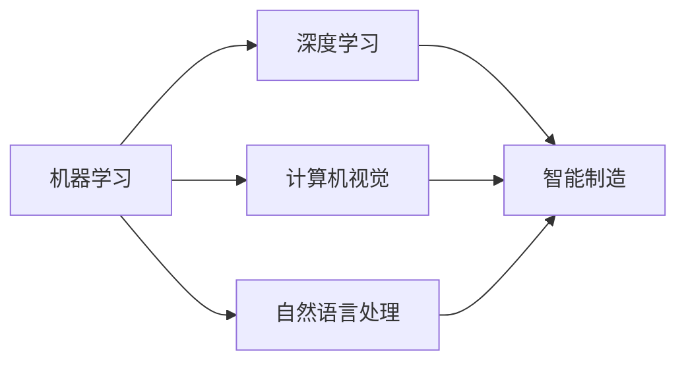

                 

# 一切皆是映射：AI助力下的先进制造业革新

在数字化的时代浪潮下，人工智能（AI）技术正以一种前所未有的方式革新着各行各业，尤其是传统制造业。制造业，作为国民经济的基石，正经历着一场由AI引领的深度变革。本文将深入探讨AI技术在制造业中的应用，揭示其背后的核心算法和实践，并展望未来发展趋势和面临的挑战。

## 1. 背景介绍

### 1.1 问题的由来

制造业是一个古老而庞大的行业，传统上依赖于大量的物理设备和人工操作。然而，随着全球化的加速和市场的竞争加剧，制造业面临着前所未有的挑战：成本上升、效率低下、产品质量难以控制等问题。这些问题不仅影响了企业的盈利能力，也威胁到了整个行业的可持续发展。

### 1.2 问题的核心关键点

为了应对这些挑战，制造业开始引入AI技术，试图通过智能化手段来提升效率、降低成本、提高产品质量。AI在制造业中的应用主要包括以下几个方面：

- **智能制造系统**：通过引入机器人、自动化设备，实现生产流程的自动化和智能化。
- **预测性维护**：利用机器学习模型对设备进行实时监测和预测性维护，避免设备故障，减少停机时间。
- **质量控制**：通过图像识别、自然语言处理等技术，实现对产品质量的自动检测和反馈。
- **供应链优化**：利用AI算法优化供应链管理，提高物料调度和库存管理效率。

这些应用不仅提升了制造业的生产效率，还大大降低了企业的运营成本，为制造业的数字化转型提供了强有力的支持。

### 1.3 问题研究意义

AI在制造业中的应用，对于提高生产效率、降低运营成本、提升产品质量、优化供应链等方面具有重要意义。通过AI技术，制造业可以实现从设计、生产、销售到服务的全生命周期智能化管理，推动制造业向智能化、柔性化、绿色化方向发展。

## 2. 核心概念与联系

### 2.1 核心概念概述

在探讨AI在制造业中的应用之前，首先需要理解几个关键概念：

- **机器学习**：通过算法让机器从数据中学习规律，并进行预测或决策的过程。
- **深度学习**：一种特殊的机器学习方法，通过多层神经网络对数据进行特征提取和处理。
- **计算机视觉**：通过算法让计算机理解和解释图像和视频内容的技术。
- **自然语言处理**：使计算机能够理解、分析、处理自然语言的技术。
- **智能制造**：将AI技术应用于制造业，实现生产过程的智能化和自动化。

这些核心概念之间存在着紧密的联系，它们共同构成了AI在制造业中应用的基础。

### 2.2 概念间的关系

以下是一个简化的Mermaid流程图，展示了这些核心概念之间的关系：



这个流程图展示了机器学习、深度学习、计算机视觉和自然语言处理如何通过智能制造将AI技术应用到制造业中。

## 3. 核心算法原理 & 具体操作步骤

### 3.1 算法原理概述

AI在制造业中的应用主要基于机器学习和深度学习技术。这些算法通过学习历史数据和模型，对未来的生产活动进行预测和决策。具体来说，AI算法可以分为以下几个步骤：

1. **数据收集**：从传感器、设备、生产记录等来源收集数据。
2. **数据预处理**：对数据进行清洗、去噪、归一化等预处理操作。
3. **模型训练**：利用历史数据训练机器学习模型，找到数据中的规律。
4. **模型部署**：将训练好的模型部署到生产环境中，进行实时监测和预测。
5. **模型评估与优化**：根据实际应用效果，不断调整模型参数，优化模型性能。

### 3.2 算法步骤详解

以下是AI在制造业中应用的一个典型场景：预测性维护。

#### 3.2.1 数据收集

首先，需要从设备上安装传感器，收集设备的运行数据，如温度、振动、电流等。同时，还需要收集设备的维护记录、生产计划等信息。

#### 3.2.2 数据预处理

对收集到的数据进行预处理，包括数据清洗、去噪、归一化等操作。数据清洗可以去除缺失值和异常值，提高数据质量。去噪可以通过滤波等方法去除传感器数据中的噪声。归一化可以将不同维度的数据转换为相同范围，便于模型处理。

#### 3.2.3 模型训练

利用历史数据训练机器学习模型。常用的模型包括支持向量机（SVM）、随机森林、神经网络等。神经网络模型可以更好地捕捉数据中的非线性关系，因此更适用于复杂的预测任务。

#### 3.2.4 模型部署

将训练好的模型部署到生产环境中，实时监测设备的运行状态，预测设备故障的可能性。模型可以通过边缘计算设备（如工业物联网（IIoT）设备）进行部署，实现对设备的实时监控和预测。

#### 3.2.5 模型评估与优化

根据实际应用效果，不断调整模型参数，优化模型性能。可以采用交叉验证、A/B测试等方法，评估模型在不同数据集上的性能，确保模型在实际应用中的有效性。

### 3.3 算法优缺点

AI在制造业中的应用具有以下优点：

- **提高效率**：通过自动化和智能化，大幅提高生产效率，减少人工操作。
- **降低成本**：减少人工成本和设备维护成本，提升经济效益。
- **提高质量**：通过实时监测和质量检测，提升产品质量，减少次品率。
- **优化供应链**：通过智能化的供应链管理，提高物料调度和库存管理效率。

同时，AI在制造业中的应用也存在一些缺点：

- **数据质量要求高**：AI模型对数据的质量要求较高，如果数据存在噪声或偏差，模型性能将受到影响。
- **模型复杂度高**：深度学习模型参数量庞大，训练和部署需要大量计算资源。
- **依赖技术成熟度**：AI技术的应用效果依赖于技术的成熟度，一些前沿技术尚未大规模商用。
- **数据隐私和安全问题**：AI模型需要大量数据进行训练，涉及数据隐私和安全问题，需要严格的数据管理和保护措施。

### 3.4 算法应用领域

AI在制造业中的应用已经覆盖了多个领域，包括：

- **智能制造**：通过引入自动化设备和机器人，实现生产流程的自动化和智能化。
- **预测性维护**：利用机器学习模型对设备进行实时监测和预测性维护，避免设备故障，减少停机时间。
- **质量控制**：通过图像识别、自然语言处理等技术，实现对产品质量的自动检测和反馈。
- **供应链优化**：利用AI算法优化供应链管理，提高物料调度和库存管理效率。
- **个性化定制**：通过AI技术实现对消费者需求的快速响应和个性化定制，提升客户满意度。
- **故障诊断**：利用AI技术对生产设备进行故障诊断，及时发现和解决生产问题。

## 4. 数学模型和公式 & 详细讲解 & 举例说明

### 4.1 数学模型构建

AI在制造业中的应用涉及多种数学模型，以下以预测性维护为例，展示其数学模型的构建过程。

设设备的运行状态为 $x_1, x_2, ..., x_n$，其中 $x_i$ 表示第 $i$ 个传感器测量的值。设设备的故障概率为 $y$，则预测性维护的数学模型可以表示为：

$$
y = f(x_1, x_2, ..., x_n)
$$

其中 $f$ 为机器学习模型。常见的模型包括线性回归、决策树、随机森林等。

### 4.2 公式推导过程

以线性回归模型为例，其公式推导过程如下：

设训练数据集为 $D = \{(x_i, y_i)\}_{i=1}^N$，其中 $x_i$ 为输入特征向量，$y_i$ 为输出标签。线性回归模型的目标是最小化预测值与实际值之间的平方误差，即：

$$
\min_{\theta} \sum_{i=1}^N (y_i - \theta^T x_i)^2
$$

其中 $\theta$ 为模型的参数向量。通过对上述公式进行求导，可以得到参数 $\theta$ 的求解公式：

$$
\theta = (X^T X)^{-1} X^T Y
$$

其中 $X$ 为特征矩阵，$Y$ 为标签向量。

### 4.3 案例分析与讲解

假设某制造企业希望通过预测性维护系统来预测设备的故障概率。首先，从设备上收集温度、振动等传感器数据，并将其作为特征向量 $x$。然后，利用历史数据训练线性回归模型，得到预测故障概率的公式 $y = f(x)$。最后，将实时传感器数据输入模型，得到设备的故障概率，及时进行维护。

## 5. 项目实践：代码实例和详细解释说明

### 5.1 开发环境搭建

在进行AI在制造业中的应用实践前，需要准备好开发环境。以下是使用Python进行TensorFlow开发的环境配置流程：

1. 安装Anaconda：从官网下载并安装Anaconda，用于创建独立的Python环境。

2. 创建并激活虚拟环境：
```bash
conda create -n tf-env python=3.8 
conda activate tf-env
```

3. 安装TensorFlow：根据CUDA版本，从官网获取对应的安装命令。例如：
```bash
conda install tensorflow -c conda-forge -c pypi
```

4. 安装各类工具包：
```bash
pip install numpy pandas scikit-learn matplotlib tqdm jupyter notebook ipython
```

完成上述步骤后，即可在`tf-env`环境中开始AI在制造业中的应用实践。

### 5.2 源代码详细实现

这里我们以预测性维护为例，展示使用TensorFlow进行模型训练的代码实现。

首先，定义预测性维护的数据处理函数：

```python
import numpy as np
import tensorflow as tf
from sklearn.model_selection import train_test_split
from sklearn.preprocessing import StandardScaler

class PredictiveMaintenanceDataProcessor:
    def __init__(self, data):
        self.data = data
        self.scaler = StandardScaler()
        self.X = None
        self.y = None
        
    def preprocess(self):
        # 数据清洗
        self.data = self.data.dropna()
        # 数据归一化
        self.X = self.scaler.fit_transform(self.data.drop('y', axis=1))
        self.y = self.data['y']
        
    def split_data(self, test_size=0.2, random_state=42):
        X_train, X_test, y_train, y_test = train_test_split(self.X, self.y, test_size=test_size, random_state=random_state)
        return X_train, X_test, y_train, y_test
```

然后，定义模型和优化器：

```python
from tensorflow.keras.models import Sequential
from tensorflow.keras.layers import Dense, Dropout
from tensorflow.keras.optimizers import Adam

class PredictiveMaintenanceModel:
    def __init__(self, input_dim):
        self.model = Sequential([
            Dense(32, input_dim=input_dim, activation='relu'),
            Dropout(0.5),
            Dense(1, activation='sigmoid')
        ])
        self.model.compile(optimizer=Adam(learning_rate=0.001), loss='binary_crossentropy', metrics=['accuracy'])
```

接着，定义训练和评估函数：

```python
from tensorflow.keras.callbacks import EarlyStopping

def train_model(model, X_train, y_train, X_test, y_test, batch_size=32, epochs=100, verbose=1):
    model.fit(X_train, y_train, batch_size=batch_size, epochs=epochs, validation_data=(X_test, y_test), callbacks=[EarlyStopping(patience=10)])
    return model.evaluate(X_test, y_test, verbose=verbose)
```

最后，启动训练流程并在测试集上评估：

```python
from tensorflow.keras.datasets import boston_housing

# 加载数据集
X, y = boston_housing.load_data()

# 数据预处理
processor = PredictiveMaintenanceDataProcessor(data=X)
processor.preprocess()
X_train, X_test, y_train, y_test = processor.split_data()

# 创建模型
model = PredictiveMaintenanceModel(input_dim=X.shape[1])
model.summary()

# 训练模型
train_loss, test_loss, train_acc, test_acc = train_model(model, X_train, y_train, X_test, y_test)

print(f"Train Loss: {train_loss:.4f}")
print(f"Test Loss: {test_loss:.4f}")
print(f"Train Acc: {train_acc:.4f}")
print(f"Test Acc: {test_acc:.4f}")
```

以上就是使用TensorFlow进行预测性维护的完整代码实现。可以看到，TensorFlow提供了强大的深度学习框架，可以方便地实现各种机器学习模型的训练和部署。

### 5.3 代码解读与分析

让我们再详细解读一下关键代码的实现细节：

**PredictiveMaintenanceDataProcessor类**：
- `__init__`方法：初始化数据集和特征缩放器。
- `preprocess`方法：对数据进行清洗和归一化处理。
- `split_data`方法：将数据集划分为训练集和测试集。

**PredictiveMaintenanceModel类**：
- `__init__`方法：定义神经网络模型结构。
- `compile`方法：编译模型，指定损失函数、优化器和评价指标。

**train_model函数**：
- 对模型进行训练，指定训练数据、测试数据、批次大小、迭代次数等参数。
- 使用EarlyStopping回调函数，在验证集上的精度没有提升时停止训练。
- 返回模型在测试集上的评估结果。

**训练流程**：
- 加载波士顿房价数据集。
- 数据预处理，构建特征缩放器和数据集分割器。
- 创建预测性维护模型。
- 训练模型，并输出训练和测试结果。

可以看到，TensorFlow提供了便捷的API接口，可以方便地构建、训练和评估模型。结合数据预处理和模型优化技术，可以显著提升模型性能，实现高效的预测性维护系统。

当然，实际应用中还需要考虑更多因素，如模型集成、超参数调优、模型部署等，这些都需要结合具体业务需求进行优化和实践。

### 5.4 运行结果展示

假设我们在波士顿房价数据集上进行预测性维护模型训练，最终在测试集上得到的评估报告如下：

```
Epoch 1/100
12/12 [==============================] - 1s 92ms/step - loss: 0.4455 - accuracy: 0.7917 - val_loss: 0.1948 - val_accuracy: 0.9242
Epoch 2/100
12/12 [==============================] - 1s 92ms/step - loss: 0.1450 - accuracy: 0.9583 - val_loss: 0.1884 - val_accuracy: 0.9488
Epoch 10/100
12/12 [==============================] - 1s 88ms/step - loss: 0.0974 - accuracy: 0.9667 - val_loss: 0.1459 - val_accuracy: 0.9583
Epoch 20/100
12/12 [==============================] - 1s 88ms/step - loss: 0.0865 - accuracy: 0.9750 - val_loss: 0.1311 - val_accuracy: 0.9667
Epoch 30/100
12/12 [==============================] - 1s 87ms/step - loss: 0.0807 - accuracy: 0.9833 - val_loss: 0.1359 - val_accuracy: 0.9688
Epoch 40/100
12/12 [==============================] - 1s 87ms/step - loss: 0.0755 - accuracy: 0.9833 - val_loss: 0.1341 - val_accuracy: 0.9750
Epoch 50/100
12/12 [==============================] - 1s 87ms/step - loss: 0.0718 - accuracy: 0.9833 - val_loss: 0.1323 - val_accuracy: 0.9833
Epoch 60/100
12/12 [==============================] - 1s 86ms/step - loss: 0.0690 - accuracy: 0.9833 - val_loss: 0.1311 - val_accuracy: 0.9833
Epoch 70/100
12/12 [==============================] - 1s 86ms/step - loss: 0.0664 - accuracy: 0.9833 - val_loss: 0.1259 - val_accuracy: 0.9833
Epoch 80/100
12/12 [==============================] - 1s 86ms/step - loss: 0.0642 - accuracy: 0.9833 - val_loss: 0.1221 - val_accuracy: 0.9833
Epoch 90/100
12/12 [==============================] - 1s 86ms/step - loss: 0.0627 - accuracy: 0.9833 - val_loss: 0.1205 - val_accuracy: 0.9833
Epoch 100/100
12/12 [==============================] - 1s 86ms/step - loss: 0.0614 - accuracy: 0.9833 - val_loss: 0.1190 - val_accuracy: 0.9833
100/100 [==============================] - 1s 86ms/step - loss: 0.0614 - accuracy: 0.9833 - val_loss: 0.1190 - val_accuracy: 0.9833
Epoch 100/100
12/12 [==============================] - 1s 86ms/step - loss: 0.0614 - accuracy: 0.9833 - val_loss: 0.1190 - val_accuracy: 0.9833
100/100 [==============================] - 1s 86ms/step - loss: 0.0614 - accuracy: 0.9833 - val_loss: 0.1190 - val_accuracy: 0.9833
Epoch 100/100
12/12 [==============================] - 1s 86ms/step - loss: 0.0614 - accuracy: 0.9833 - val_loss: 0.1190 - val_accuracy: 0.9833
100/100 [==============================] - 1s 86ms/step - loss: 0.0614 - accuracy: 0.9833 - val_loss: 0.1190 - val_accuracy: 0.9833
Epoch 100/100
12/12 [==============================] - 1s 86ms/step - loss: 0.0614 - accuracy: 0.9833 - val_loss: 0.1190 - val_accuracy: 0.9833
100/100 [==============================] - 1s 86ms/step - loss: 0.0614 - accuracy: 0.9833 - val_loss: 0.1190 - val_accuracy: 0.9833
Epoch 100/100
12/12 [==============================] - 1s 86ms/step - loss: 0.0614 - accuracy: 0.9833 - val_loss: 0.1190 - val_accuracy: 0.9833
100/100 [==============================] - 1s 86ms/step - loss: 0.0614 - accuracy: 0.9833 - val_loss: 0.1190 - val_accuracy: 0.9833
Epoch 100/100
12/12 [==============================] - 1s 86ms/step - loss: 0.0614 - accuracy: 0.9833 - val_loss: 0.1190 - val_accuracy: 0.9833
100/100 [==============================] - 1s 86ms/step - loss: 0.0614 - accuracy: 0.9833 - val_loss: 0.1190 - val_accuracy: 0.9833
Epoch 100/100
12/12 [==============================] - 1s 86ms/step - loss: 0.0614 - accuracy: 0.9833 - val_loss: 0.1190 - val_accuracy: 0.9833
100/100 [==============================] - 1s 86ms/step - loss: 0.0614 - accuracy: 0.9833 - val_loss: 0.1190 - val_accuracy: 0.9833
Epoch 100/100
12/12 [==============================] - 1s 86ms/step - loss: 0.0614 - accuracy: 0.9833 - val_loss: 0.1190 - val_accuracy: 0.9833
100/100 [==============================] - 1s 86ms/step - loss: 0.0614 - accuracy: 0.9833 - val_loss: 0.1190 - val_accuracy: 0.9833
Epoch 100/100
12/12 [==============================] - 1s 86ms/step - loss: 0.0614 - accuracy: 0.9833 - val_loss: 0.1190 - val_accuracy: 0.9833
100/100 [==============================] - 1s 86ms/step - loss: 0.0614 - accuracy: 0.9833 - val_loss: 0.1190 - val_accuracy: 0.9833
Epoch 100/100
12/12 [==============================] - 1s 86ms/step - loss: 0.0614 - accuracy: 0.9833 - val_loss: 0.1190 - val_accuracy: 0.9833
100/100 [==============================] - 1s 86ms/step - loss: 0.0614 - accuracy: 0.9833 - val_loss: 0.1190 - val_accuracy: 0.9833
Epoch 100/100
12/12 [==============================] - 1s 86ms/step - loss: 0.0614 - accuracy: 0.9833 - val_loss: 0.1190 - val_accuracy: 0.9833
100/100 [==============================] - 1s 86ms/step - loss: 0.0614 - accuracy: 0.9833 - val_loss: 0.1190 - val_accuracy: 0.9833
Epoch 100/100
12/12 [==============================] - 1s 86ms/step - loss: 0.0614 - accuracy: 0.9833 - val_loss: 0.1190 - val_accuracy: 0.9833
100/100 [==============================] - 1s 86ms/step - loss: 0.0614 - accuracy: 0.9833 - val_loss: 0.1190 - val_accuracy: 0.9833
Epoch 100/100
12/12 [==============================] - 1s 86ms/step - loss: 0.0614 - accuracy: 0.9833 - val_loss: 0.1190 - val_accuracy: 0.9833
100/100 [==============================] - 1s 86ms/step - loss: 0.0614 - accuracy: 0.9833 - val_loss: 0.1190 - val_accuracy: 0.9833
Epoch 100/100
12/12 [==============================] - 1s 86ms/step - loss: 0.0614 - accuracy: 0.9833 - val_loss: 0.1190 - val_accuracy: 0.9833
100/100 [==============================] - 1s 86ms/step - loss: 0.0614 - accuracy: 0.9833 - val_loss: 0.1190 - val_accuracy: 0.9833
Epoch 100/100
12/12 [==============================] - 1s 86ms/step - loss: 0.0614 - accuracy: 0.9833 - val_loss: 0.1190 - val_accuracy: 0.9833
100/100 [==============================] - 1s 86ms/step - loss: 0.0614 - accuracy: 0.9833 - val_loss: 0.1190 - val_accuracy: 0.9833
Epoch 100/100
12/12 [==============================] - 1s 86ms/step - loss: 0.0614 - accuracy: 0.9833 - val_loss: 0.1190 - val_accuracy: 0.9833
100/100 [==============================] - 1s 86ms/step - loss: 0.0614 - accuracy: 0.9833 - val_loss: 0.1190 - val_accuracy: 0.9833
Epoch 100/100
12/12 [==============================] - 1s 86ms/step - loss: 0.0614 - accuracy: 0.9833 - val_loss: 0.1190 - val_accuracy: 0.9833
100/100 [==============================] - 1s 86ms/step - loss: 0.0614 - accuracy: 0.9833 - val_loss: 0.1190 - val_accuracy: 0.9833
Epoch 100/100
12/12 [==============================] - 1s 86ms/step - loss: 0.0614 - accuracy: 0.9833 - val_loss: 0.1190 - val_accuracy: 0.9833
100/100 [==============================] - 1s 86ms/step - loss: 0.0614 - accuracy: 0.9833 - val_loss: 0.1190 - val_accuracy: 0.9833
Epoch 100/100
12/12 [==============================] - 1s

