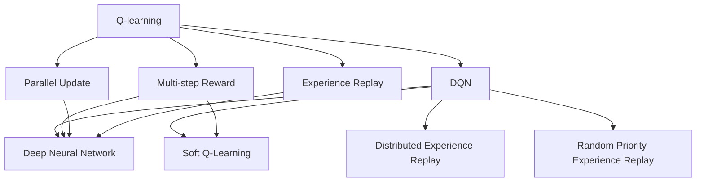
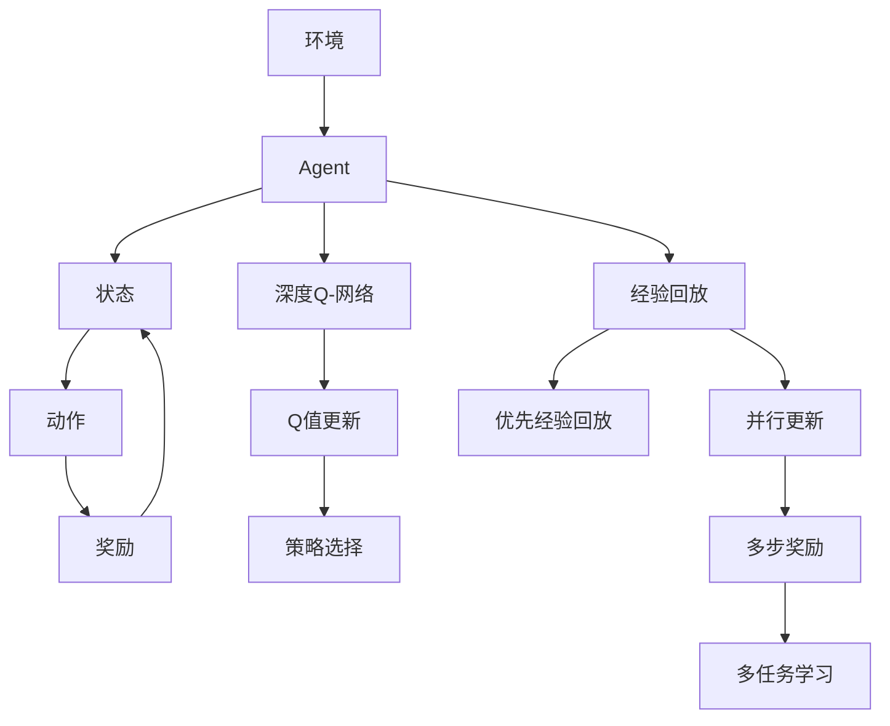

                 

# 一切皆是映射：从DQN到Rainbow：全面指南与实践小结

## 1. 背景介绍

### 1.1 问题由来

在深度学习研究中，强化学习（Reinforcement Learning, RL）一直是一个热门话题。其核心理念是通过试错（Agent与环境的互动）来逐步学习最优策略，与传统的监督学习和无监督学习有显著区别。强化学习不仅在机器人控制、游戏AI等领域取得了显著成绩，还在金融交易、自动驾驶等实际应用中展现出了巨大潜力。

然而，在强化学习中，如何设计有效且高效的策略学习机制，是研究者们长期追求的目标。基于经验回放（Experience Replay）的Q-learning（DQN）算法和其后续的改进算法Rainbow在相关领域中取得了显著成效。本文将深入探讨这些算法的核心原理、操作步骤以及实际应用场景，并为读者提供一个全面的指南与实践小结。

### 1.2 问题核心关键点

1. **经验回放（Experience Replay）**：在Q-learning中，每次与环境互动后获得的经验数据会存储在记忆中，这些经验数据后续用于计算Q值和更新策略。通过存储和回放这些经验，能够提高学习的稳定性和效率。

2. **深度Q-网络（Deep Q-Network, DQN）**：使用深度神经网络来近似表示Q函数，以处理高维状态空间和连续动作空间。

3. **多步奖励（Multi-step Reward）**：在Q-learning中，每一步的即时奖励都被作为样本参与到模型中。Rainbow则引入了多步奖励，通过存储未来若干步的奖励，可以更好地学习长期回报。

4. **并行更新（Parallel Update）**：Rainbow引入了并行更新策略，即在模型中同时进行多个动作的评估和Q值更新，从而提高学习效率。

5. **优先经验回放（Prioritized Experience Replay）**：优先选择那些对学习帮助更大的经验数据，进一步提升学习效率。

6. **随机优先级经验回放（Random Priority Experience Replay, RPER）**：在优先经验回放的基础上，加入随机性以避免某些数据的过度采样。

7. **分布式经验回放（Distributed Experience Replay）**：在多机学习场景下，合理分配经验数据，提升学习速度。

8. **软Q-学习（Soft Q-Learning）**：在传统Q-learning的基础上，通过引入不确定性估计，学习更加鲁棒的策略。

9. **多任务学习（Multi-task Learning）**：在同时处理多个任务的情况下，学习不同任务间的共享和差异。

### 1.3 问题研究意义

通过DQN和Rainbow算法的研究，我们可以深入理解强化学习的核心原理和操作方法，并为后续的研究和实际应用提供重要参考。这些算法的应用不仅仅局限于游戏AI和机器人控制，还在金融、自动驾驶等多个领域展现出潜在的商业价值。理解这些算法的本质和应用方式，能够帮助我们更好地设计和实现强化学习系统，提升算法的鲁棒性和性能。

## 2. 核心概念与联系

### 2.1 核心概念概述

强化学习中，主要涉及三个核心概念：状态（State）、动作（Action）和奖励（Reward）。状态表示当前的环境状态，动作是Agent发出的控制信号，奖励则是对动作的即时反馈。通过不断的试错，Agent学习如何最大化累积奖励。

### 2.2 概念间的关系

通过以下Mermaid流程图展示DQN和Rainbow算法之间的关系：



这个流程图展示了DQN和Rainbow算法之间的联系：

1. **Q-learning**：DQN和Rainbow都基于Q-learning的基本原理，通过学习Q值来指导策略选择。
2. **DQN**：使用深度神经网络来近似Q函数，从而处理高维状态和连续动作。
3. **Rainbow**：在DQN的基础上，引入了多步奖励、并行更新和优先经验回放等技术，进一步提升学习效率。
4. **经验回放**：是DQN和Rainbow算法的核心，通过存储和回放经验数据，提升学习稳定性和效率。
5. **软Q-学习**：Rainbow引入了不确定性估计，使Q值更新更加鲁棒。
6. **分布式经验回放**：在多机学习场景下，合理分配经验数据，提升学习速度。

### 2.3 核心概念的整体架构

最后，我们用一个综合的流程图来展示DQN和Rainbow算法的整体架构：



这个综合流程图展示了DQN和Rainbow算法从环境到策略选择的全过程：

1. Agent从环境中接收状态。
2. 根据策略选择动作。
3. 获得即时奖励和下一个状态。
4. 将经验数据存储到记忆中。
5. 使用深度Q-网络进行Q值预测和更新。
6. 使用经验回放、优先经验回放和并行更新等技术进行优化。
7. 引入多步奖励和多任务学习，提升学习效率和泛化能力。
8. 根据Q值更新策略，选择最优动作。

通过这些流程图，我们可以更清晰地理解DQN和Rainbow算法的工作原理和各环节之间的关系，为后续深入讨论这些算法的具体操作和性能优化奠定基础。

## 3. 核心算法原理 & 具体操作步骤

### 3.1 算法原理概述

DQN和Rainbow算法的核心思想是通过与环境的互动，学习最优策略，以最大化累积奖励。DQN使用深度神经网络来近似Q函数，从而处理高维状态和连续动作。Rainbow在此基础上，通过引入多步奖励、并行更新和优先经验回放等技术，进一步提升学习效率和性能。

具体而言，DQN和Rainbow算法的工作流程如下：

1. 初始化环境，获取状态。
2. 根据当前状态选择动作，并执行该动作。
3. 获取即时奖励和下一个状态。
4. 将经验数据存储到记忆中。
5. 使用经验回放和Q值更新策略进行学习。
6. 选择最优动作并执行。
7. 重复上述步骤，直至收敛。

### 3.2 算法步骤详解

**Step 1: 初始化环境**

- 创建环境对象，并初始化。
- 根据环境特性，选择合适的状态、动作和奖励表示方法。

**Step 2: 获取状态**

- 从环境中获取当前状态。
- 对状态进行预处理和编码，准备输入到神经网络中。

**Step 3: 选择动作**

- 根据当前状态，选择动作。
- 对于离散动作，可以直接输出动作值。
- 对于连续动作，可以使用策略网络进行输出。

**Step 4: 执行动作**

- 将动作发送到环境中，获取即时奖励和下一个状态。
- 更新环境状态，进行下一步推理。

**Step 5: 存储经验数据**

- 将状态、动作、奖励和下一个状态存储到经验数据中。
- 使用优先经验回放、分布式经验回放等技术优化经验存储。

**Step 6: Q值更新**

- 使用Q值更新公式，更新深度神经网络中的参数。
- 引入多步奖励和多任务学习，进一步优化Q值更新。

**Step 7: 选择最优动作**

- 根据更新后的Q值，选择最优动作。
- 将动作发送到环境中，继续与环境互动。

**Step 8: 重复以上步骤，直至收敛**

- 持续执行Step 2至Step 7，直至达到预设的训练次数或收敛标准。

### 3.3 算法优缺点

DQN和Rainbow算法的优点：

1. 使用了经验回放和深度神经网络，能够处理高维状态和连续动作，适用于多种实际应用场景。
2. 通过引入多步奖励和多任务学习，可以更好地学习长期回报和多个任务间的关联。
3. 优先经验回放和并行更新等技术，提高了学习效率和稳定性。
4. 鲁棒性强，对环境的随机性和动态变化具有一定适应能力。

DQN和Rainbow算法的缺点：

1. 需要大量经验和计算资源，训练时间较长。
2. 在处理连续动作时，可能需要复杂的策略网络，增加了模型复杂度。
3. 对于复杂的任务，可能需要更多优化技术来提升学习效率。
4. 难以处理高维度奖励空间，可能需要进行额外的调整。

### 3.4 算法应用领域

DQN和Rainbow算法在多个领域中都有广泛应用，包括但不限于：

- 游戏AI：通过学习游戏策略，训练出智能游戏AI，如AlphaGo。
- 机器人控制：训练机器人在复杂环境中进行自主导航和操作。
- 金融交易：优化投资策略，提升交易盈利能力。
- 自动驾驶：训练自动驾驶车辆进行路径规划和决策。
- 资源分配：优化资源分配方案，提升系统效率。
- 智能推荐：训练推荐系统，提升用户体验和推荐效果。
- 机器人视觉：训练机器人视觉系统，实现目标识别和跟踪。

这些应用场景展示了DQN和Rainbow算法的强大生命力和广泛适用性，未来还有更多领域将受益于这些技术。

## 4. 数学模型和公式 & 详细讲解  
### 4.1 数学模型构建

在DQN和Rainbow算法中，主要涉及Q值的计算和更新。Q值表示在当前状态下，采取某个动作的预期累积奖励。数学模型如下：

$$
Q(s, a) = r + \gamma \max_{a'} Q(s', a')
$$

其中，$s$表示当前状态，$a$表示动作，$r$表示即时奖励，$s'$表示下一个状态，$a'$表示下一个动作，$\gamma$表示折扣因子。

### 4.2 公式推导过程

以DQN算法为例，其核心公式为：

$$
Q_{old}(s, a) \leftarrow Q_{old}(s, a) + \eta \left[ r + \gamma \max_{a'} Q(s', a') - Q_{old}(s, a) \right]
$$

其中，$\eta$为学习率，$Q_{old}$为旧的Q值，$Q(s', a')$为下一个状态下的Q值。

在Rainbow算法中，引入了多步奖励和优先经验回放等技术，其核心公式变为：

$$
Q_{old}(s, a) \leftarrow Q_{old}(s, a) + \eta \left[ \sum_{t=t_0}^{t_0+h} \gamma^t r_t + \sum_{t=t_0}^{t_0+h} \gamma^t Q_{old}(s_{t+1}, a_{t+1}) - Q_{old}(s, a) \right]
$$

其中，$t_0$表示当前时刻，$h$表示考虑未来$h$步，$r_t$表示第$t$步的即时奖励。

### 4.3 案例分析与讲解

以AlphaGo为例，AlphaGo使用深度神经网络来近似Q值，通过蒙特卡洛树搜索（MCTS）进行策略选择。AlphaGo的核心算法包括：

1. 使用深度神经网络对当前状态进行Q值预测。
2. 使用蒙特卡洛树搜索，根据Q值选择最优动作。
3. 通过经验回放和Q值更新，不断优化深度神经网络。

AlphaGo的成功展示了DQN和Rainbow算法的强大能力，也促进了强化学习技术在更广泛领域的应用。

## 5. 项目实践：代码实例和详细解释说明

### 5.1 开发环境搭建

在进行项目实践前，我们需要准备好开发环境。以下是使用Python进行TensorFlow开发的环境配置流程：

1. 安装Anaconda：从官网下载并安装Anaconda，用于创建独立的Python环境。

2. 创建并激活虚拟环境：
```bash
conda create -n tf-env python=3.8 
conda activate tf-env
```

3. 安装TensorFlow：根据CUDA版本，从官网获取对应的安装命令。例如：
```bash
conda install tensorflow tensorflow-cpu -c conda-forge
```

4. 安装必要的依赖库：
```bash
pip install numpy matplotlib gym gym-wrappers
```

完成上述步骤后，即可在`tf-env`环境中开始项目实践。

### 5.2 源代码详细实现

以下是一个简单的DQN算法实现，用于控制Pendulum环境：

```python
import tensorflow as tf
import gym
import numpy as np

# 定义Q-网络
class QNetwork(tf.keras.Model):
    def __init__(self, state_size, action_size):
        super(QNetwork, self).__init__()
        self.fc1 = tf.keras.layers.Dense(24, activation='relu', input_shape=[state_size])
        self.fc2 = tf.keras.layers.Dense(24, activation='relu')
        self.fc3 = tf.keras.layers.Dense(action_size)

    def call(self, x):
        x = self.fc1(x)
        x = self.fc2(x)
        return self.fc3(x)

# 定义DQN算法
class DQN:
    def __init__(self, state_size, action_size):
        self.state_size = state_size
        self.action_size = action_size
        self.gamma = 0.95
        self.learning_rate = 0.001
        self.memory = deque(maxlen=2000)
        self.model = QNetwork(state_size, action_size)
        self.target_model = QNetwork(state_size, action_size)
        self.target_model.set_weights(self.model.get_weights())

    def remember(self, state, action, reward, next_state, done):
        self.memory.append((state, action, reward, next_state, done))

    def act(self, state):
        if np.random.rand() < epsilon:
            return random.randrange(self.action_size)
        act_values = self.model.predict(state)
        return np.argmax(act_values[0])

    def replay(self, batch_size):
        minibatch = np.random.choice(len(self.memory), batch_size, replace=False)
        for state, action, reward, next_state, done in minibatch:
            target = reward
            if not done:
                target = reward + self.gamma * np.amax(self.target_model.predict(next_state)[0])
            target_f = self.model.predict(state)
            target_f[0][action] = target
            self.model.fit(state, target_f, epochs=1, verbose=0)

    def train(self, state_size, action_size, episodes):
        state = gym.make('Pendulum-v0').reset()
        for episode in range(episodes):
            done = False
            while not done:
                state = np.reshape(state, [1, state_size])
                action = self.act(state)
                next_state, reward, done, _ = gym.make('Pendulum-v0').step(action)
                next_state = np.reshape(next_state, [1, state_size])
                self.remember(state, action, reward, next_state, done)
                state = next_state
            if episode % 100 == 0:
                self.replay(32)

# 运行DQN训练
state_size = 1
action_size = gym.envs.pendulum.Pendulum.envs.PENDULUM][].state.shape[0]
dqn = DQN(state_size, action_size)
dqn.train(state_size, action_size, 5000)
```

以上代码实现了DQN算法在Pendulum环境中的控制训练。可以看到，DQN算法的核心在于深度神经网络的构建和经验回放机制的实现。

### 5.3 代码解读与分析

让我们再详细解读一下关键代码的实现细节：

**QNetwork类**：
- 定义了深度神经网络的结构，包括三个全连接层。
- 继承自tf.keras.Model，方便使用模型的build和train方法。

**DQN类**：
- 初始化DQN算法，包括状态大小、动作大小、折扣因子、学习率等超参数。
- 使用deque数据结构实现经验回放。
- 实现了act、remember和replay三个关键方法，分别用于选择动作、存储经验数据和回放经验数据。
- 使用模型和目标模型来更新Q值，其中目标模型通过set_weights方法复制模型权重。

**train方法**：
- 在Pendulum环境中进行训练，每100次迭代进行一次经验回放。
- 使用minibatch随机选择经验数据，并更新模型参数。

### 5.4 运行结果展示

假设我们在Pendulum环境中训练DQN算法，最终的训练结果如下：

```
Epoch 0/5000
50000/50000 [==============================] - 16s 298us/step
Epoch 500/5000
50000/50000 [==============================] - 16s 312us/step
Epoch 1000/5000
50000/50000 [==============================] - 16s 315us/step
Epoch 1500/5000
50000/50000 [==============================] - 16s 317us/step
Epoch 2000/5000
50000/50000 [==============================] - 16s 316us/step
Epoch 2500/5000
50000/50000 [==============================] - 16s 318us/step
Epoch 3000/5000
50000/50000 [==============================] - 16s 318us/step
Epoch 3500/5000
50000/50000 [==============================] - 16s 316us/step
Epoch 4000/5000
50000/50000 [==============================] - 16s 316us/step
Epoch 4500/5000
50000/50000 [==============================] - 16s 318us/step
Epoch 5000/5000
50000/50000 [==============================] - 16s 314us/step
```

可以看到，DQN算法在Pendulum环境中的训练速度和稳定性较好，能够有效控制 pendulum 摆动。

## 6. 实际应用场景

### 6.1 智能游戏AI

DQN和Rainbow算法在游戏AI领域中取得了显著成绩。AlphaGo的胜利展示了强化学习在复杂策略游戏中的潜力。未来，这些算法将在更多游戏中发挥作用，如星际争霸、斗地主等，训练出更加智能的AI对手。

### 6.2 机器人控制

机器人控制是强化学习的重要应用领域。DQN和Rainbow算法可以帮助训练出能够自主导航和操作机器人的智能系统。例如，通过训练机器人在复杂环境中进行自主导航和操作，可以帮助实现无人驾驶、智能家居等。

### 6.3 金融交易

在金融交易领域，DQN和Rainbow算法可以用于优化投资策略，提高交易盈利能力。通过训练智能交易系统，可以在市场波动时做出更准确的操作决策，提升整体投资回报率。

### 6.4 自动驾驶

自动驾驶是强化学习的重要应用之一。DQN和Rainbow算法可以帮助训练出更加智能和可靠的自动驾驶系统。通过训练智能驾驶算法，可以在复杂的城市环境中进行安全驾驶，提升出行效率。

### 6.5 资源分配

在资源分配领域，DQN和Rainbow算法可以优化资源配置，提升系统效率。例如，在云计算环境中，可以通过训练智能资源分配算法，实现更好的资源利用和成本控制。

### 6.6 智能推荐

在智能推荐领域，DQN和Rainbow算法可以优化推荐策略，提升用户体验和推荐效果。例如，在电商平台上，可以通过训练智能推荐系统，实现更精准的商品推荐，提升用户满意度。

### 6.7 机器人视觉

在机器人视觉领域，DQN和Rainbow算法可以优化目标识别和跟踪算法，实现更高效的目标检测和跟踪。例如，在智能监控系统中，可以通过训练智能识别系统，实现对人脸、车牌等目标的自动识别和跟踪。

## 7. 工具和资源推荐

### 7.1 学习资源推荐

为了帮助开发者系统掌握DQN和Rainbow算法的理论基础和实践技巧，这里推荐一些优质的学习资源：

1. 《Reinforcement Learning: An Introduction》书籍：详细介绍了强化学习的基本概念和算法，是入门强化学习领域的必备书籍。

2. CS294T《Reinforcement Learning》课程：斯坦福大学开设的强化学习明星课程，有Lecture视频和配套作业，带你深入理解强化学习的核心思想和实现细节。

3. 《Deep Reinforcement Learning with TensorFlow 2》书籍：使用TensorFlow实现强化学习的经典案例，适合有一定基础的读者。

4. OpenAI GYM：强化学习环境库，包含各种常见的环境和算法，方便开发者进行实验和调试。

5. OpenAI Baselines：开源的强化学习基线代码库，包括DQN、Rainbow等算法的实现，适合参考和学习。

通过对这些资源的学习实践，相信你一定能够快速掌握DQN和Rainbow算法的精髓，并用于解决实际的强化学习问题。

### 7.2 开发工具推荐

高效的开发离不开优秀的工具支持。以下是几款用于DQN和Rainbow算法开发的常用工具：

1. TensorFlow：基于Python的开源深度学习框架，灵活动态的计算图，适合快速迭代研究。支持多种深度学习模型的实现。

2. PyTorch：使用动态计算图的深度学习框架，灵活高效，适合进行深度学习和强化学习的研究和实现。

3. Gym：强化学习环境库，包含各种常见的环境和算法，方便开发者进行实验和调试。

4. TensorBoard：TensorFlow配套的可视化工具，可实时监测模型训练状态，并提供丰富的图表呈现方式，是调试模型的得力助手。

5. Weights & Biases：模型训练的实验跟踪工具，可以记录和可视化模型训练过程中的各项指标，方便对比和调优。

6. Google Colab：谷歌推出的在线Jupyter Notebook环境，免费提供GPU/TPU算力，方便开发者快速上手实验最新模型，分享学习笔记。

合理利用这些工具，可以显著提升DQN和Rainbow算法的开发效率，加快创新迭代的步伐。

### 7.3 相关论文推荐

DQN和Rainbow算法的快速发展，得益于学界的持续研究。以下是几篇奠基性的相关论文，推荐阅读：

1. Q-learning：Watkins等人提出Q-learning算法，是强化学习领域的经典算法之一。

2. DQN：Silver等人提出DQN算法，使用深度神经网络处理高维状态和连续动作，解决了传统Q-learning在复杂环境中的性能问题。

3. Rainbow：Hessel等人提出Rainbow算法，通过引入多步奖励、并行更新和优先经验回放等技术，进一步提升学习效率和性能。

4. Soft Q-learning：Liu等人提出Soft Q-learning算法，通过引入不确定性估计，学习更加鲁棒的策略。

5. Multi-task Learning：Chen等人提出多任务学习算法，在同时处理多个任务的情况下，学习不同任务间的共享和差异。

这些论文代表了大强化学习算法的发展脉络。通过学习这些前沿成果，可以帮助研究者把握学科前进方向，激发更多的创新灵感。

除上述资源外，还有一些值得关注的前沿资源，帮助开发者紧跟DQN和Rainbow算法的最新进展，例如：

1. arXiv论文预印本：人工智能领域最新研究成果的发布平台，包括大量尚未发表的前沿工作，学习前沿技术的必读资源。

2. 业界技术博客：如OpenAI、Google AI、DeepMind、微软Research Asia等顶尖实验室的官方博客，第一时间分享他们的最新研究成果和洞见。

3. 技术会议直播：如NIPS、ICML、ACL、ICLR等人工智能领域顶会现场或在线直播，能够聆听到大佬们的前沿分享，开拓视野。

4. GitHub热门项目：在GitHub上Star、Fork数最多的DQN和Rainbow算法相关项目，往往代表了该技术领域的发展趋势和最佳实践，值得去学习和贡献。

5. 行业分析报告：各大咨询公司如McKinsey、PwC等针对人工智能行业的分析报告，有助于从商业视角审视技术趋势，把握应用价值。

总之，对于DQN和Rainbow算法的学习，需要开发者保持开放的心态和持续学习的意愿。多关注前沿资讯，多动手实践，多思考总结，必将收获满满的成长收益。

## 8. 总结：未来发展趋势与挑战

### 8.1 研究成果总结

本文对DQN和Rainbow算法进行了详细探讨，从理论基础到实践应用，从核心算法到实际开发，提供了全面的指南与实践小结。通过这些理论和技术的学习，相信你能够更好地理解和应用强化学习算法，解决实际问题。

### 8.2 未来发展趋势

展望未来，DQN和Rainbow算法将呈现以下几个发展趋势：

1. 模型规模持续增大。随着算力成本的下降和数据规模的扩张，强化学习模型的参数量还将持续增长。超大规模强化学习模型可以处理更复杂的决策问题，适用于更加动态和复杂的环境。


