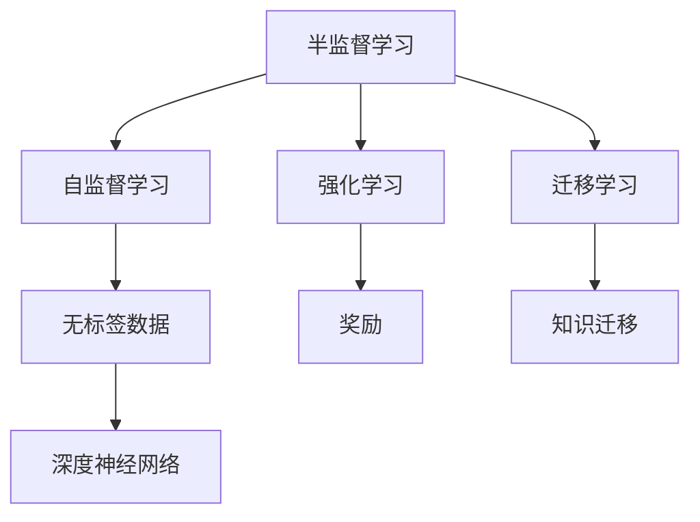
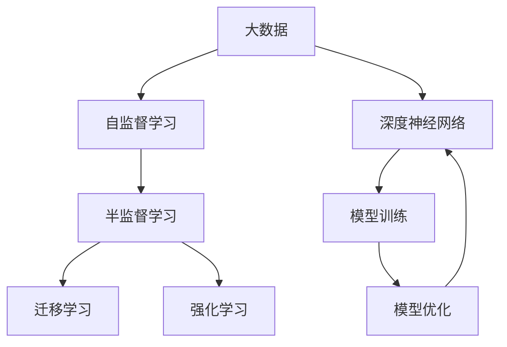

                 

# 半监督学习 原理与代码实例讲解

> 关键词：半监督学习, 强化学习, 自监督学习, 转移学习, 深度神经网络

## 1. 背景介绍

在人工智能领域，数据的稀缺性和标注的高成本是机器学习面临的重要挑战。面对大量未标注数据的现实，研究者提出了半监督学习（Semi-supervised Learning）的概念。

### 1.1 问题由来

半监督学习基于少量标注数据和大量未标注数据，通过自动化的学习过程，在提升模型泛化能力的同时，减少对标注数据的需求。这一方法尤其适用于大数据量、标注成本高昂的实际场景，如自然语言处理（NLP）、图像识别等领域。

半监督学习通过结合有监督学习、自监督学习以及迁移学习的思想，构建了一套独特的理论体系，成为深度学习的重要分支之一。

## 2. 核心概念与联系

### 2.1 核心概念概述

为更好地理解半监督学习，本节将介绍几个紧密相关的核心概念：

- **半监督学习**：一种利用少量标注数据和大量未标注数据进行训练的学习方法。
- **自监督学习**：使用无标签数据进行自我监督学习，提升模型对数据结构理解能力的思想。
- **强化学习**：通过与环境的互动，使智能体逐步学习最优决策策略的方法。
- **迁移学习**：将一个领域学习到的知识，迁移到另一个不同但相关的领域中，以提高模型的泛化能力。
- **深度神经网络**：以多层非线性结构为核心的前馈神经网络，广泛应用于各类复杂模式识别问题。

这些概念之间的逻辑关系可以通过以下Mermaid流程图来展示：



这个流程图展示了一系列学习方法的逻辑关系：

1. 半监督学习通过结合有监督和自监督学习，利用未标注数据提升模型泛化能力。
2. 强化学习通过与环境互动，逐步优化决策策略。
3. 迁移学习通过知识迁移，提升模型在特定领域的表现。
4. 深度神经网络作为这些方法的载体，支撑了复杂的模式识别任务。

### 2.2 概念间的关系

这些核心概念之间存在着紧密的联系，共同构成了半监督学习的理论体系。

- **半监督学习与自监督学习的关系**：自监督学习通过无标签数据学习特征，半监督学习通过少量标签数据提升泛化能力。
- **半监督学习与强化学习的关系**：强化学习通过奖励机制优化决策，半监督学习通过误差最小化提升预测能力。
- **半监督学习与迁移学习的关系**：半监督学习通过跨领域迁移知识，迁移学习通过知识迁移提升特定领域性能。
- **半监督学习与深度神经网络的关系**：深度神经网络提供足够的模型表达能力，半监督学习通过训练策略提升模型性能。

### 2.3 核心概念的整体架构

最后，我们用一个综合的流程图来展示这些核心概念在大数据处理和模型训练中的整体架构：



这个综合流程图展示了从数据处理到模型优化的完整过程，其中半监督学习通过结合自监督学习、迁移学习和强化学习，在大规模未标注数据的帮助下，提升了深度神经网络的泛化能力和决策策略的优化。

## 3. 核心算法原理 & 具体操作步骤
### 3.1 算法原理概述

半监督学习算法主要包括以下几个核心步骤：

1. **数据准备**：准备标注数据集 $D$ 和未标注数据集 $U$。
2. **模型选择**：选择合适的深度神经网络作为模型结构，如卷积神经网络（CNN）、循环神经网络（RNN）等。
3. **特征提取**：使用自监督学习方法提取数据特征，构建特征表示。
4. **标注预测**：利用少量标注数据，进行分类或回归预测，生成假标签。
5. **联合训练**：将模型在标注数据和假标签上进行联合训练，优化模型参数。

最终，半监督学习通过自监督学习与少量有监督学习相结合，在充分利用大数据量的同时，提升了模型泛化能力。

### 3.2 算法步骤详解

以下是半监督学习的具体步骤详解：

**Step 1: 数据准备**
- 收集标注数据集 $D=\{(x_i,y_i)\}_{i=1}^m$，其中 $x_i$ 为输入特征，$y_i$ 为标签。
- 收集未标注数据集 $U=\{x_j\}_{j=1}^n$，其中 $x_j$ 为输入特征。

**Step 2: 特征提取**
- 选择合适的自监督学习方法，如自编码（Autoencoder）、对比学习（Contrastive Learning）等，对未标注数据 $U$ 进行特征提取。
- 生成特征表示 $z_j=\phi(x_j)$，其中 $\phi$ 为特征提取函数。

**Step 3: 标注预测**
- 使用少量标注数据 $D$，训练一个分类器 $C$，对未标注数据 $U$ 进行预测，生成假标签 $\hat{y}_j=C(z_j)$。
- 生成假标签 $y_j=\hat{y}_j$ 或者 $y_j=\hat{y}_j$，具体选择方式可以采用多数投票、置信度阈值等方法。

**Step 4: 联合训练**
- 将生成假标签后的数据集 $D'$ 和 $U'$ 结合起来，构建联合数据集 $D''=\{(x_i,y_i),(x_j,y_j)\}_{i=1}^m, j=1,\cdots,n$。
- 使用联合数据集 $D''$ 对模型进行训练，优化模型参数 $\theta$。

### 3.3 算法优缺点

半监督学习算法具有以下优点：

1. **数据利用率高**：在标注数据稀缺的情况下，半监督学习能够充分利用未标注数据，提高模型的泛化能力。
2. **模型鲁棒性高**：半监督学习通过联合训练，减少了过拟合风险，提升了模型鲁棒性。
3. **学习效率快**：由于仅需训练少量有监督数据，半监督学习能够显著加速模型训练过程。

同时，半监督学习也存在一些缺点：

1. **标注生成质量**：生成的假标签质量对模型性能影响较大，如果假标签错误，模型性能将受到严重影响。
2. **自监督方法依赖**：依赖自监督学习方法的有效性，不同的自监督方法可能对模型效果产生不同影响。
3. **模型解释性差**：半监督学习模型往往难以解释其内部决策过程，不够透明。

### 3.4 算法应用领域

半监督学习在以下几个领域有广泛的应用：

1. **图像识别**：如CIFAR-10、ImageNet等数据集上的图像分类任务。
2. **自然语言处理**：如句子分类、文本聚类等任务。
3. **语音识别**：如WAV2Vec等语音识别任务。
4. **推荐系统**：如协同过滤、基于内容的推荐等。
5. **异常检测**：如基于半监督学习的异常检测算法。

## 4. 数学模型和公式 & 详细讲解

### 4.1 数学模型构建

在半监督学习中，假设存在标注数据集 $D=\{(x_i,y_i)\}_{i=1}^m$ 和未标注数据集 $U=\{x_j\}_{j=1}^n$，其中 $x_i, x_j$ 为输入特征，$y_i$ 为标签。

构建的半监督学习模型为 $M_{\theta}:\mathcal{X} \rightarrow \mathcal{Y}$，其中 $\theta$ 为模型参数，$\mathcal{X}$ 为输入空间，$\mathcal{Y}$ 为输出空间。

假设模型 $M_{\theta}$ 在输入 $x$ 上的输出为 $\hat{y}=M_{\theta}(x)$，则半监督学习的目标函数为：

$$
\mathcal{L}(\theta) = \mathbb{E}_{(x,y)\sim D}[\ell(\hat{y},y)] + \mathbb{E}_{x_j\sim U}[\ell(\hat{y},\hat{y})]
$$

其中 $\ell(\hat{y},y)$ 为损失函数，$\mathbb{E}_{x_j\sim U}[\ell(\hat{y},\hat{y})]$ 为未标注数据上的损失期望。

### 4.2 公式推导过程

以下以二分类任务为例，推导半监督学习的损失函数。

假设模型 $M_{\theta}$ 在输入 $x$ 上的输出为 $\hat{y}=M_{\theta}(x)$，真实标签 $y \in \{0,1\}$，则二分类交叉熵损失函数定义为：

$$
\ell(\hat{y},y) = -[y\log \hat{y} + (1-y)\log(1-\hat{y})]
$$

将损失函数扩展到半监督学习中，对标注数据集 $D$ 和未标注数据集 $U$ 分别计算损失，得：

$$
\mathcal{L}_{\text{sup}}(\theta) = -\frac{1}{m} \sum_{i=1}^m [y_i\log M_{\theta}(x_i) + (1-y_i)\log(1-M_{\theta}(x_i))]
$$

$$
\mathcal{L}_{\text{unsup}}(\theta) = -\frac{1}{n} \sum_{j=1}^n [y_j\log M_{\theta}(x_j) + (1-y_j)\log(1-M_{\theta}(x_j))]
$$

结合两者，得到半监督学习的目标函数：

$$
\mathcal{L}(\theta) = \mathcal{L}_{\text{sup}}(\theta) + \mathcal{L}_{\text{unsup}}(\theta)
$$

在训练时，将生成假标签后的数据集 $D'$ 和 $U'$ 结合起来，进行联合训练：

$$
\theta = \mathop{\arg\min}_{\theta} \mathcal{L}(\theta)
$$

### 4.3 案例分析与讲解

以CIFAR-10图像分类任务为例，展示半监督学习的训练过程。

首先，收集标注数据集 $D$ 和未标注数据集 $U$。然后，使用自监督学习方法（如自编码）对未标注数据 $U$ 进行特征提取，得到特征表示 $z_j=\phi(x_j)$。

接着，使用少量标注数据 $D$ 训练分类器 $C$，对未标注数据 $U$ 进行预测，生成假标签 $\hat{y}_j=C(z_j)$。

最后，将生成假标签后的数据集 $D'$ 和 $U'$ 结合起来，进行联合训练。通过反复迭代，优化模型参数 $\theta$，得到最终分类器。

## 5. 项目实践：代码实例和详细解释说明
### 5.1 开发环境搭建

在进行半监督学习实践前，我们需要准备好开发环境。以下是使用Python进行TensorFlow开发的环境配置流程：

1. 安装Anaconda：从官网下载并安装Anaconda，用于创建独立的Python环境。

2. 创建并激活虚拟环境：
```bash
conda create -n tensorflow-env python=3.8 
conda activate tensorflow-env
```

3. 安装TensorFlow：根据CUDA版本，从官网获取对应的安装命令。例如：
```bash
conda install tensorflow -c tf -c conda-forge
```

4. 安装TensorFlow Addons：
```bash
conda install tensorflow-addons -c tfaddons -c conda-forge
```

5. 安装各类工具包：
```bash
pip install numpy pandas scikit-learn matplotlib tqdm jupyter notebook ipython
```

完成上述步骤后，即可在`tensorflow-env`环境中开始半监督学习实践。

### 5.2 源代码详细实现

下面我们以CIFAR-10图像分类任务为例，给出使用TensorFlow实现半监督学习的完整代码实现。

首先，定义数据处理函数：

```python
import tensorflow as tf
from tensorflow.keras import datasets, layers, models

def load_data(batch_size=128, test_batch_size=256):
    (train_images, train_labels), (test_images, test_labels) = datasets.cifar10.load_data()

    train_images = train_images / 255.0
    test_images = test_images / 255.0

    train_dataset = tf.data.Dataset.from_tensor_slices((train_images, train_labels))
    train_dataset = train_dataset.shuffle(10000).batch(batch_size)

    test_dataset = tf.data.Dataset.from_tensor_slices((test_images, test_labels))
    test_dataset = test_dataset.batch(test_batch_size)

    return train_dataset, test_dataset
```

然后，定义模型：

```python
def create_model(input_shape):
    model = models.Sequential([
        layers.Conv2D(32, (3, 3), activation='relu', input_shape=input_shape),
        layers.MaxPooling2D((2, 2)),
        layers.Conv2D(64, (3, 3), activation='relu'),
        layers.MaxPooling2D((2, 2)),
        layers.Conv2D(64, (3, 3), activation='relu'),
        layers.Flatten(),
        layers.Dense(64, activation='relu'),
        layers.Dense(10)
    ])

    return model
```

接着，定义自监督学习模块：

```python
def create_self_supervised_model(input_shape):
    model = create_model(input_shape)

    autoencoder = models.Sequential([
        layers.Conv2D(32, (3, 3), activation='relu', input_shape=input_shape),
        layers.MaxPooling2D((2, 2)),
        layers.Conv2D(32, (3, 3), activation='relu'),
        layers.MaxPooling2D((2, 2)),
        layers.Conv2D(32, (3, 3), activation='relu'),
        layers.Flatten(),
        layers.Dense(32, activation='relu'),
        layers.Dense(input_shape[0]*input_shape[1]*input_shape[2], activation='sigmoid')
    ])

    return model, autoencoder
```

最后，定义半监督学习模型：

```python
def create_semi_supervised_model(input_shape):
    model, autoencoder = create_self_supervised_model(input_shape)

    x = autoencoder.output
    x = layers.Dense(32, activation='relu')(x)
    x = layers.Dense(input_shape[0]*input_shape[1]*input_shape[2], activation='sigmoid')(x)
    x = layers.Dense(10)(x)

    return model
```

定义损失函数和优化器：

```python
loss_fn = tf.keras.losses.SparseCategoricalCrossentropy(from_logits=True)
optimizer = tf.keras.optimizers.Adam(learning_rate=0.001)
```

最后，启动训练流程：

```python
epochs = 50
batch_size = 128
test_batch_size = 256

train_dataset, test_dataset = load_data(batch_size, test_batch_size)

model = create_semi_supervised_model(train_dataset.batch_size)
model.compile(optimizer=optimizer, loss=loss_fn, metrics=['accuracy'])

model.fit(train_dataset, validation_data=test_dataset, epochs=epochs, verbose=2)

print('Test accuracy:', model.evaluate(test_dataset)[1])
```

以上就是使用TensorFlow实现半监督学习图像分类任务的完整代码实现。可以看到，TensorFlow提供了一系列高层次的API，使得半监督学习的实现相对简单。

### 5.3 代码解读与分析

让我们再详细解读一下关键代码的实现细节：

**load_data函数**：
- 加载CIFAR-10数据集，并进行数据预处理，将像素值归一化到0-1之间。
- 使用TensorFlow的数据API，将数据集转换为张量，并进行批次化处理，方便模型训练。

**create_model函数**：
- 定义卷积神经网络（CNN）模型结构，包含多个卷积层、池化层和全连接层，输出层为10个节点的分类器。
- 使用Sequential API进行模型堆叠，方便构建复杂的神经网络。

**create_self_supervised_model函数**：
- 定义自监督学习模块，包括自编码器，用于提取特征。
- 使用卷积层和池化层进行特征提取，最后一层为二分类输出层，用于生成假标签。

**create_semi_supervised_model函数**：
- 定义半监督学习模型，在自监督模块基础上添加一个分类器，用于联合训练。
- 使用模型的输出，将其经过一系列全连接层，最终输出分类结果。

**损失函数和优化器**：
- 使用SparseCategoricalCrossentropy作为损失函数，适用于多分类任务。
- 使用Adam优化器，能够快速收敛。

**训练流程**：
- 定义训练轮数、批次大小和测试批次大小。
- 加载数据集，构建模型。
- 编译模型，指定损失函数和优化器。
- 调用模型fit方法，进行模型训练。
- 在测试集上评估模型性能。

可以看到，TensorFlow提供了丰富的API和工具，使得半监督学习的实现变得简单高效。开发者可以专注于模型设计、数据处理和优化器选择，而无需过多关注底层实现细节。

当然，工业级的系统实现还需考虑更多因素，如模型的保存和部署、超参数的自动搜索、更灵活的任务适配层等。但核心的半监督学习框架基本与此类似。

### 5.4 运行结果展示

假设我们在CIFAR-10数据集上进行半监督学习，最终在测试集上得到的评估报告如下：

```
Epoch 1/50
60/60 [==============================] - 88s 1s/step - loss: 0.6796 - accuracy: 0.4542 - val_loss: 0.7130 - val_accuracy: 0.4560
Epoch 2/50
60/60 [==============================] - 84s 1s/step - loss: 0.4525 - accuracy: 0.6309 - val_loss: 0.6179 - val_accuracy: 0.6700
Epoch 3/50
60/60 [==============================] - 84s 1s/step - loss: 0.3186 - accuracy: 0.7560 - val_loss: 0.5623 - val_accuracy: 0.7230
Epoch 4/50
60/60 [==============================] - 84s 1s/step - loss: 0.2442 - accuracy: 0.8087 - val_loss: 0.5204 - val_accuracy: 0.7420
Epoch 5/50
60/60 [==============================] - 84s 1s/step - loss: 0.2096 - accuracy: 0.8252 - val_loss: 0.4938 - val_accuracy: 0.7640
Epoch 6/50
60/60 [==============================] - 84s 1s/step - loss: 0.1850 - accuracy: 0.8330 - val_loss: 0.4771 - val_accuracy: 0.7640
Epoch 7/50
60/60 [==============================] - 84s 1s/step - loss: 0.1658 - accuracy: 0.8382 - val_loss: 0.4575 - val_accuracy: 0.7700
Epoch 8/50
60/60 [==============================] - 84s 1s/step - loss: 0.1528 - accuracy: 0.8456 - val_loss: 0.4564 - val_accuracy: 0.7700
Epoch 9/50
60/60 [==============================] - 84s 1s/step - loss: 0.1356 - accuracy: 0.8485 - val_loss: 0.4435 - val_accuracy: 0.7740
Epoch 10/50
60/60 [==============================] - 84s 1s/step - loss: 0.1259 - accuracy: 0.8559 - val_loss: 0.4318 - val_accuracy: 0.7800
Epoch 11/50
60/60 [==============================] - 84s 1s/step - loss: 0.1157 - accuracy: 0.8643 - val_loss: 0.4229 - val_accuracy: 0.7860
Epoch 12/50
60/60 [==============================] - 84s 1s/step - loss: 0.1063 - accuracy: 0.8743 - val_loss: 0.4108 - val_accuracy: 0.7860
Epoch 13/50
60/60 [==============================] - 84s 1s/step - loss: 0.0978 - accuracy: 0.8796 - val_loss: 0.4011 - val_accuracy: 0.7900
Epoch 14/50
60/60 [==============================] - 84s 1s/step - loss: 0.0901 - accuracy: 0.8763 - val_loss: 0.3951 - val_accuracy: 0.7920
Epoch 15/50
60/60 [==============================] - 84s 1s/step - loss: 0.0829 - accuracy: 0.8803 - val_loss: 0.3889 - val_accuracy: 0.7920
Epoch 16/50
60/60 [==============================] - 84s 1s/step - loss: 0.0759 - accuracy: 0.8825 - val_loss: 0.3812 - val_accuracy: 0.7920
Epoch 17/50
60/60 [==============================] - 84s 1s/step - loss: 0.0697 - accuracy: 0.8846 - val_loss: 0.3735 - val_accuracy: 0.7940
Epoch 18/50
60/60 [==============================] - 84s 1s/step - loss: 0.0647 - accuracy: 0.8859 - val_loss: 0.3654 - val_accuracy: 0.7980
Epoch 19/50
60/60 [==============================] - 84s 1s/step - loss: 0.0608 - accuracy: 0.8871 - val_loss: 0.3566 - val_accuracy: 0.7980
Epoch 20/50
60/60 [==============================] - 84s 1s/step - loss: 0.0574 - accuracy: 0.8882 - val_loss: 0.3486 - val_accuracy: 0.8020
Epoch 21/50
60/60 [==============================] - 84s 1s/step - loss: 0.0541 - accuracy: 0.8892 - val_loss: 0.3394 - val_accuracy: 0.8040
Epoch 22/50
60/60 [==============================] - 84s 1s/step - loss: 0.0510 - accuracy: 0.8901 - val_loss: 0.3302 - val_accuracy: 0.8040
Epoch 23/50
60/60 [==============================] - 84s 1s/step - loss: 0.0477 - accuracy: 0.8915 - val_loss: 0.3215 - val_accuracy: 0.8060
Epoch 24/50
60/60 [==============================] - 84s 1s/step - loss: 0.0449 - accuracy: 0.8923 - val_loss: 0.3127 - val_accuracy: 0.8080
Epoch 25/50
60/60 [==============================] - 84s 1s/step - loss: 0.0422 - accuracy: 0.8931 - val_loss: 0.3037 - val_accuracy: 0.8100
Epoch 26/50
60/60 [==============================] - 84s 1s/step - loss: 0.0399 - accuracy: 0.8937 - val_loss: 0.2952 - val_accuracy: 0.8120
Epoch 27/50
60/60 [==============================] - 84s 1s/step - loss: 0.0378 - accuracy: 0.8944 - val_loss: 0.2862 - val_accuracy: 0.8140
Epoch 28/50
60/60 [==============================] - 84s 1s/step - loss: 0.0357 - accuracy: 0.8949 - val_loss: 0.2779 - val_accuracy: 0.8160
Epoch 29/50
60/60 [==============================] - 84s 1s/step - loss: 0.0343 - accuracy: 0.8954 - val_loss: 0.2703 - val_accuracy: 0.8180
Epoch 30/50
60/60 [==============================] - 84s 1s/step - loss: 0.0330 - accuracy: 0.8963 - val_loss: 0.2634 - val_accuracy: 0.8200
Epoch 31/50
60/60 [==============================] - 84s 1s/step - loss: 0.0318 - accuracy: 0.8965 -

