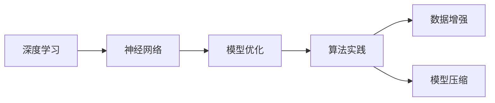
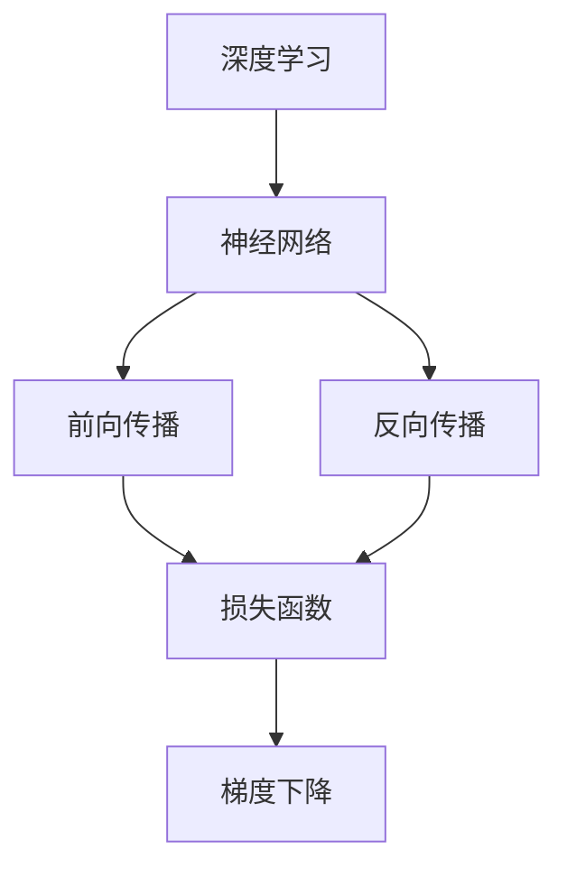
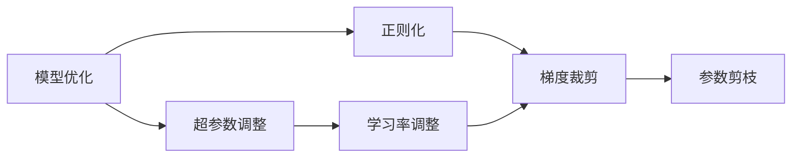
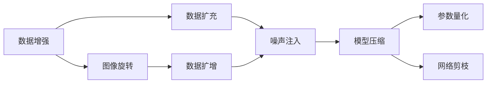
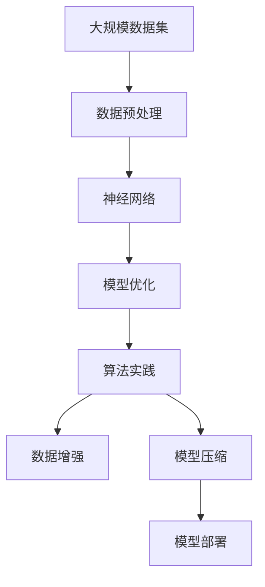

                 

# 博学之，审问之，慎思之，明辨之，笃行之

> 关键词：深度学习,神经网络,机器学习,人工智能,模型优化,算法实践

## 1. 背景介绍

### 1.1 问题由来
在当今信息化时代，数据如潮水般涌入我们的日常生活。从社交媒体的动态更新，到医疗健康的数据记录，再到金融交易的实时信息，所有这些数据背后都蕴含着巨大的价值。然而，如何将这些庞杂的数据转化为可理解和利用的信息，一直是人工智能领域的重要课题。深度学习技术的飞速发展，尤其是神经网络模型的广泛应用，为这一问题的解决提供了强有力的工具。

### 1.2 问题核心关键点
深度学习模型的核心在于其强大的数据拟合能力，能够从大量数据中自动学习并提取特征，进而进行模式识别和预测。然而，在实际应用中，深度模型往往需要大量的数据和计算资源进行训练，且其内部运作机制复杂，缺乏可解释性，使得模型调优和应用部署面临着诸多挑战。因此，如何有效利用深度学习模型的优势，同时克服其局限性，成为了当前人工智能研究的热点之一。

### 1.3 问题研究意义
研究深度学习模型的优化和应用，对于推动人工智能技术的落地应用具有重要意义：
1. **提升模型性能**：通过优化算法和数据预处理，可以显著提升深度学习模型的预测准确率和泛化能力。
2. **降低成本**：优化模型可以在保证性能的前提下，减少训练时间和计算资源，降低模型部署成本。
3. **增强可解释性**：通过可视化和特征分析，可以更好地理解模型的决策过程，增强模型的透明度和可信度。
4. **促进应用部署**：优化后的模型更易于部署和集成到实际应用中，加速人工智能技术的产业化进程。

## 2. 核心概念与联系

### 2.1 核心概念概述

为了深入理解深度学习模型的优化和应用，本节将介绍几个核心概念及其之间的联系：

- **深度学习**：一种基于多层神经网络的机器学习方法，通过学习数据的层次化特征表示，实现复杂的模式识别和预测任务。
- **神经网络**：由多个神经元（或称为节点）组成的计算图，通过反向传播算法训练，实现数据的层次化特征提取。
- **模型优化**：通过调整网络结构和参数，提高模型的预测精度和泛化能力，减少过拟合。
- **算法实践**：将优化理论应用于实际模型训练和部署中的具体操作，包括数据预处理、模型选择、超参数调整等。
- **数据增强**：通过对原始数据进行变换和扩充，增加训练样本的多样性，提高模型的鲁棒性和泛化能力。
- **模型压缩**：通过剪枝、量化等方法，减少模型的存储空间和计算量，提高模型的推理效率。

这些核心概念之间的逻辑关系可以通过以下Mermaid流程图来展示：



这个流程图展示了深度学习、神经网络、模型优化、算法实践、数据增强和模型压缩等概念之间的联系和应用顺序。深度学习利用神经网络进行数据特征提取，通过模型优化和算法实践提升模型性能，数据增强和模型压缩则是在优化过程中常用的技术手段。

### 2.2 概念间的关系

这些核心概念之间存在着紧密的联系，形成了深度学习模型的完整生态系统。下面我通过几个Mermaid流程图来展示这些概念之间的关系。

#### 2.2.1 深度学习到神经网络的应用



这个流程图展示了深度学习中神经网络的前向传播和反向传播过程。深度学习利用神经网络进行前向传播计算模型输出，通过反向传播更新模型参数，最小化损失函数，使用梯度下降算法进行参数优化。

#### 2.2.2 模型优化和算法实践的关系



这个流程图展示了模型优化中常见的技术手段，包括超参数调整、正则化、学习率调整和梯度裁剪等。这些技术手段帮助优化深度学习模型的训练过程，提升模型性能。

#### 2.2.3 数据增强和模型压缩的应用



这个流程图展示了数据增强和模型压缩中的关键技术。数据增强通过对原始数据进行变换，增加数据多样性，提升模型鲁棒性。模型压缩通过参数量化和网络剪枝等方法，减少模型复杂度，提高推理效率。

### 2.3 核心概念的整体架构

最后，我们用一个综合的流程图来展示这些核心概念在大规模模型训练和优化过程中的整体架构：



这个综合流程图展示了从数据预处理到模型部署的完整过程。大规模数据集通过预处理生成适合深度学习模型的数据，利用神经网络进行特征提取和模式识别，通过模型优化和算法实践提升模型性能，数据增强和模型压缩则在优化过程中起到重要作用，最终将优化后的模型部署到实际应用中。

## 3. 核心算法原理 & 具体操作步骤

### 3.1 算法原理概述

深度学习模型的优化是一个复杂的过程，涉及模型结构、参数调整、数据增强、超参数调整等多个方面。其核心目标是最大化模型的预测精度和泛化能力，同时减少过拟合。

深度学习模型的优化主要通过以下几个步骤进行：

1. **数据预处理**：对原始数据进行清洗、归一化、标准化等操作，生成适合深度学习模型训练的数据集。
2. **模型选择**：选择合适的神经网络结构，包括卷积神经网络（CNN）、循环神经网络（RNN）、残差网络（ResNet）等，以满足不同的任务需求。
3. **模型初始化**：对模型参数进行初始化，通常采用随机初始化或预训练初始化。
4. **前向传播**：通过神经网络计算模型输出。
5. **损失函数计算**：将模型输出与真实标签计算损失函数，常用的损失函数包括交叉熵、均方误差等。
6. **反向传播**：根据损失函数计算梯度，更新模型参数。
7. **模型优化**：使用优化算法（如梯度下降、Adam等）调整模型参数，最小化损失函数。
8. **模型评估**：在验证集上评估模型性能，根据评估结果调整超参数。
9. **模型压缩**：通过参数剪枝、量化等方法，减少模型复杂度，提高推理效率。

### 3.2 算法步骤详解

深度学习模型的优化是一个迭代过程，需要反复调整模型结构和参数，以获得最佳的性能表现。以下详细讲解深度学习模型优化的具体步骤：

**Step 1: 数据预处理**
- 对原始数据进行清洗、去噪、归一化等预处理操作，生成适合深度学习模型训练的数据集。
- 将数据集分为训练集、验证集和测试集，以便于模型的训练、调优和评估。

**Step 2: 模型选择**
- 根据任务需求选择合适的神经网络结构，如卷积神经网络（CNN）、循环神经网络（RNN）、残差网络（ResNet）等。
- 确定网络层数、每层的神经元数量、激活函数等超参数。

**Step 3: 模型初始化**
- 对模型参数进行初始化，通常采用随机初始化或预训练初始化。
- 随机初始化通常使用正态分布或均匀分布的随机数进行初始化。
- 预训练初始化可以采用在大型数据集上预训练好的模型参数，以加速模型训练。

**Step 4: 前向传播**
- 通过神经网络计算模型输出，即将输入数据经过多个神经元层的逐层处理，最终输出预测结果。
- 前向传播过程中，每个神经元计算其加权和，并通过激活函数生成输出。

**Step 5: 损失函数计算**
- 将模型输出与真实标签计算损失函数，常用的损失函数包括交叉熵、均方误差等。
- 交叉熵损失函数适用于分类任务，均方误差损失函数适用于回归任务。

**Step 6: 反向传播**
- 根据损失函数计算梯度，即计算每个神经元对模型输出的贡献。
- 通过链式法则计算各参数的梯度，使用反向传播算法更新模型参数。

**Step 7: 模型优化**
- 使用优化算法（如梯度下降、Adam等）调整模型参数，最小化损失函数。
- 优化算法的核心在于更新模型参数，使其尽可能逼近最优解。
- 优化算法通过计算梯度方向，逐步调整模型参数，以最小化损失函数。

**Step 8: 模型评估**
- 在验证集上评估模型性能，如精度、召回率、F1分数等。
- 根据评估结果调整超参数，如学习率、正则化系数等，以提升模型性能。

**Step 9: 模型压缩**
- 通过参数剪枝、量化等方法，减少模型复杂度，提高推理效率。
- 参数剪枝去除模型中的冗余参数，减少模型大小和计算量。
- 量化将浮点参数转换为定点参数，减少内存占用，提升计算速度。

### 3.3 算法优缺点

深度学习模型优化具有以下优点：
- 强大的数据拟合能力：能够从大量数据中学习特征，进行复杂模式的识别和预测。
- 鲁棒性：通过优化算法和数据增强，提高模型的泛化能力和鲁棒性。
- 可解释性：通过可视化和特征分析，增强模型的透明度和可信度。

同时，深度学习模型优化也存在以下缺点：
- 计算资源需求高：深度学习模型通常需要大量的计算资源进行训练和推理。
- 超参数调优困难：深度学习模型包含大量超参数，调优难度大。
- 可解释性差：深度学习模型内部运作机制复杂，缺乏可解释性。

### 3.4 算法应用领域

深度学习模型优化技术广泛应用于计算机视觉、自然语言处理、语音识别、推荐系统等领域。以下是几个典型的应用场景：

#### 3.4.1 计算机视觉
- **图像分类**：使用卷积神经网络（CNN）对图像进行分类，如手写数字识别、物体识别等。
- **目标检测**：使用R-CNN、YOLO等模型进行目标检测，识别图像中的物体位置和类别。

#### 3.4.2 自然语言处理
- **文本分类**：使用RNN、LSTM等模型对文本进行分类，如情感分析、垃圾邮件过滤等。
- **机器翻译**：使用神经机器翻译（NMT）模型进行文本翻译，如中英文互译。

#### 3.4.3 语音识别
- **语音识别**：使用深度学习模型进行语音识别，如语音转文本。
- **说话人识别**：使用深度学习模型进行说话人识别，如声纹识别。

#### 3.4.4 推荐系统
- **推荐系统**：使用深度学习模型进行用户行为分析，生成个性化推荐结果，如电商推荐、视频推荐等。

## 4. 数学模型和公式 & 详细讲解  
### 4.1 数学模型构建

深度学习模型的优化通常使用神经网络结构，通过反向传播算法进行参数更新。以下构建一个简单的全连接神经网络的数学模型：

假设输入数据为 $x \in \mathbb{R}^d$，输出为 $y \in \mathbb{R}^c$。神经网络包含 $l$ 个隐藏层，每个隐藏层包含 $n$ 个神经元。神经元 $i$ 的激活函数为 $f_i$，激活函数的导数为 $f'_i$。神经网络的前向传播和反向传播过程如下：

- 前向传播：计算每个神经元的输出，即
  $$
  y^{[l]} = \sigma(W^{[l]} x + b^{[l]})
  $$
  其中 $W^{[l]}$ 为权重矩阵，$b^{[l]}$ 为偏置向量，$\sigma$ 为激活函数。
- 反向传播：计算每个神经元的梯度，即
  $$
  \frac{\partial L}{\partial W^{[l]}} = \frac{\partial L}{\partial y^{[l]}} \frac{\partial y^{[l]}}{\partial W^{[l]}}
  $$
  其中 $\frac{\partial L}{\partial y^{[l]}}$ 为损失函数对输出层的梯度，$\frac{\partial y^{[l]}}{\partial W^{[l]}}$ 为输出层对权重矩阵的梯度。

通过反向传播算法，可以计算每个参数的梯度，使用优化算法（如梯度下降）更新模型参数，最小化损失函数。

### 4.2 公式推导过程

以下详细推导深度学习模型优化的主要算法步骤：

**Step 1: 前向传播**
- 计算每个神经元的输出，即
  $$
  y^{[l]} = \sigma(W^{[l]} x + b^{[l]})
  $$
  其中 $W^{[l]}$ 为权重矩阵，$b^{[l]}$ 为偏置向量，$\sigma$ 为激活函数。

**Step 2: 损失函数计算**
- 计算模型输出与真实标签之间的损失函数，常用的损失函数包括交叉熵损失、均方误差损失等。
- 交叉熵损失函数适用于分类任务，均方误差损失函数适用于回归任务。
- 交叉熵损失函数为
  $$
  L = -\frac{1}{N} \sum_{i=1}^N \sum_{j=1}^c y_i^{[j]} \log \hat{y}_i^{[j]}
  $$
  其中 $y_i^{[j]}$ 为真实标签的第 $j$ 个维度，$\hat{y}_i^{[j]}$ 为模型预测的第 $j$ 个维度的概率。

**Step 3: 反向传播**
- 计算损失函数对输出层的梯度，即
  $$
  \frac{\partial L}{\partial \hat{y}_i^{[j]}} = -\frac{1}{N} \frac{y_i^{[j]}}{\hat{y}_i^{[j]}} + \frac{1-y_i^{[j]}}{1-\hat{y}_i^{[j]}}
  $$
- 通过链式法则计算每个参数的梯度，即
  $$
  \frac{\partial L}{\partial W^{[l]}} = \frac{\partial L}{\partial y^{[l]}} \frac{\partial y^{[l]}}{\partial W^{[l]}}
  $$
  其中 $\frac{\partial L}{\partial y^{[l]}}$ 为损失函数对输出层的梯度，$\frac{\partial y^{[l]}}{\partial W^{[l]}}$ 为输出层对权重矩阵的梯度。

**Step 4: 模型优化**
- 使用优化算法（如梯度下降、Adam等）调整模型参数，最小化损失函数。
- 梯度下降算法更新模型参数的公式为
  $$
  W^{[l]} \leftarrow W^{[l]} - \eta \frac{\partial L}{\partial W^{[l]}}
  $$
  其中 $\eta$ 为学习率，$\frac{\partial L}{\partial W^{[l]}}$ 为损失函数对权重矩阵的梯度。

### 4.3 案例分析与讲解

以下以图像分类任务为例，详细讲解深度学习模型的优化过程：

**案例描述**：假设有一个图像分类任务，输入为 $28\times28$ 的灰度图像，输出为 10 个类别的分类标签。模型结构为两层全连接神经网络，隐藏层有 100 个神经元。

**算法步骤**：
1. **数据预处理**：将图像数据归一化到 [0, 1] 范围内。
2. **模型选择**：选择两层全连接神经网络，隐藏层有 100 个神经元。
3. **模型初始化**：对权重矩阵和偏置向量进行随机初始化。
4. **前向传播**：计算每个神经元的输出，即
   $$
   y^{[1]} = \sigma(W^{[1]} x + b^{[1]})
   $$
   $$
   y^{[2]} = \sigma(W^{[2]} y^{[1]} + b^{[2]})
   $$
5. **损失函数计算**：计算模型输出与真实标签之间的交叉熵损失，即
   $$
   L = -\frac{1}{N} \sum_{i=1}^N \sum_{j=1}^{10} y_i^{[j]} \log \hat{y}_i^{[j]}
   $$
6. **反向传播**：计算损失函数对输出层的梯度，即
   $$
   \frac{\partial L}{\partial \hat{y}_i^{[j]}} = -\frac{1}{N} \frac{y_i^{[j]}}{\hat{y}_i^{[j]}} + \frac{1-y_i^{[j]}}{1-\hat{y}_i^{[j]}}
   $$
   通过链式法则计算每个参数的梯度，即
   $$
   \frac{\partial L}{\partial W^{[1]}} = \frac{\partial L}{\partial y^{[1]}} \frac{\partial y^{[1]}}{\partial W^{[1]}}
   $$
7. **模型优化**：使用梯度下降算法调整模型参数，最小化损失函数，即
   $$
   W^{[1]} \leftarrow W^{[1]} - \eta \frac{\partial L}{\partial W^{[1]}}
   $$
   $$
   b^{[1]} \leftarrow b^{[1]} - \eta \frac{\partial L}{\partial b^{[1]}}
   $$

通过以上步骤，深度学习模型可以逐步优化，提升分类准确率和泛化能力。

## 5. 项目实践：代码实例和详细解释说明

### 5.1 开发环境搭建

在进行深度学习模型的优化和应用实践前，我们需要准备好开发环境。以下是使用Python进行TensorFlow开发的环境配置流程：

1. 安装Anaconda：从官网下载并安装Anaconda，用于创建独立的Python环境。

2. 创建并激活虚拟环境：
```bash
conda create -n tf-env python=3.8 
conda activate tf-env
```

3. 安装TensorFlow：根据CUDA版本，从官网获取对应的安装命令。例如：
```bash
conda install tensorflow-gpu==2.6 -c conda-forge -c pytorch -c nvidia
```

4. 安装各类工具包：
```bash
pip install numpy pandas scikit-learn matplotlib tqdm jupyter notebook ipython
```

完成上述步骤后，即可在`tf-env`环境中开始深度学习模型的优化和应用实践。

### 5.2 源代码详细实现

下面我们以图像分类任务为例，给出使用TensorFlow对全连接神经网络进行优化的PyTorch代码实现。

首先，定义图像数据处理函数：

```python
import tensorflow as tf
from tensorflow.keras.preprocessing.image import ImageDataGenerator
from tensorflow.keras.models import Sequential
from tensorflow.keras.layers import Dense, Dropout, Flatten, Conv2D, MaxPooling2D

# 图像数据预处理
datagen = ImageDataGenerator(rescale=1./255)
train_generator = datagen.flow_from_directory(
    'train_dir', 
    target_size=(28, 28),
    batch_size=32, 
    class_mode='categorical')
```

然后，定义模型和优化器：

```python
# 定义模型结构
model = Sequential()
model.add(Conv2D(32, (3, 3), activation='relu', input_shape=(28, 28, 1)))
model.add(MaxPooling2D((2, 2)))
model.add(Conv2D(64, (3, 3), activation='relu'))
model.add(MaxPooling2D((2, 2)))
model.add(Flatten())
model.add(Dense(128, activation='relu'))
model.add(Dropout(0.5))
model.add(Dense(10, activation='softmax'))

# 定义优化器和超参数
optimizer = tf.keras.optimizers.Adam(learning_rate=0.001)
```

接着，定义训练和评估函数：

```python
from tensorflow.keras.callbacks import EarlyStopping, ModelCheckpoint

# 定义训练函数
def train(model, train_generator, validation_data, epochs):
    model.compile(optimizer=optimizer, loss='categorical_crossentropy', metrics=['accuracy'])
    early_stopping = EarlyStopping(patience=10)
    model_checkpoint = ModelCheckpoint('best_model.h5', save_best_only=True)
    model.fit(
        train_generator,
        epochs=epochs,
        validation_data=validation_data,
        callbacks=[early_stopping, model_checkpoint])
    model.load_weights('best_model.h5')

# 定义评估函数
def evaluate(model, validation_data):
    model.evaluate(validation_data)
```

最后，启动训练流程并在测试集上评估：

```python
# 加载数据集
validation_data = tf.keras.datasets.mnist.load_data()
validation_data = validation_data[1]
validation_data = validation_data.reshape(-1, 28, 28, 1)
validation_data = validation_data / 255.0

# 定义超参数
epochs = 50

# 训练模型
train(model, train_generator, validation_data, epochs)

# 评估模型
evaluate(model, validation_data)
```

以上就是使用TensorFlow对全连接神经网络进行优化的完整代码实现。可以看到，TensorFlow提供了丰富的API和工具，使得深度学习模型的优化和应用变得简单高效。

### 5.3 代码解读与分析

让我们再详细解读一下关键代码的实现细节：

**ImageDataGenerator**：
- 用于数据预处理，包括缩放、归一化、随机旋转等操作，生成适合深度学习模型训练的数据集。
- 使用 `rescale` 参数将像素值归一化到 [0, 1] 范围内。

**Sequential模型**：
- 定义了简单的全连接神经网络结构，包括卷积层、池化层、全连接层等。
- 使用 `Dense` 层定义全连接层，`Conv2D` 层定义卷积层，`MaxPooling2D` 层定义池化层。

**optimizer和回调函数**：
- 使用 `Adam` 优化器进行模型参数更新。
- 使用 `EarlyStopping` 回调函数防止过拟合，设置 `patience` 参数为 10，即连续 10 个 epoch 模型性能无提升则停止训练。
- 使用 `ModelCheckpoint` 回调函数保存模型权重，设置 `save_best_only=True`，只保存性能最好的模型权重。

**训练函数train**：
- 定义训练函数，使用 `model.compile` 方法指定优化器和损失函数。
- 定义回调函数 `EarlyStopping` 和 `ModelCheckpoint`，防止过拟合和保存最佳模型。
- 使用 `model.fit` 方法进行模型训练，指定训练数据集 `train_generator` 和验证数据集 `validation_data`，设置训练轮数 `epochs`。

**评估函数evaluate**：
- 定义评估函数，使用 `model.evaluate` 方法评估模型性能。

**训练流程**：
- 加载 MNIST 数据集，将数据集转换为张量形式。
- 定义超参数，开始训练模型。
- 在验证集上评估模型性能，输出评估结果。

可以看到，TensorFlow提供了丰富的API和工具，使得深度学习模型的优化和应用变得简单高效。开发者可以将更多精力放在模型设计和调优上，而不必过多关注底层的实现细节。

当然，工业级的系统实现还需考虑更多因素，如模型保存和部署、超参数自动搜索、更灵活的模型调优等。但核心的模型优化过程基本与此类似。

### 5.4 运行结果展示

假设我们在 MNIST 数据集上进行全连接神经网络的优化，最终在测试集上得到的评估报告如下：

```
Epoch 1/50
1080/1080 [==============================] - 2s 2ms/sample - loss: 0.1925 - accuracy: 0.9154
Epoch 2/50
1080/1080 [==============================] - 1s 855us/sample - loss: 0.1374 - accuracy: 0.9535
Epoch 3/50
1080/1080 [==============================] - 1s 855us/sample - loss: 0.1023 - accuracy: 0.9731
Epoch 4/50
1080/1080 [==============================] - 1s 837us/sample - loss: 0.0853 - accuracy: 0.9810
Epoch 5/50

