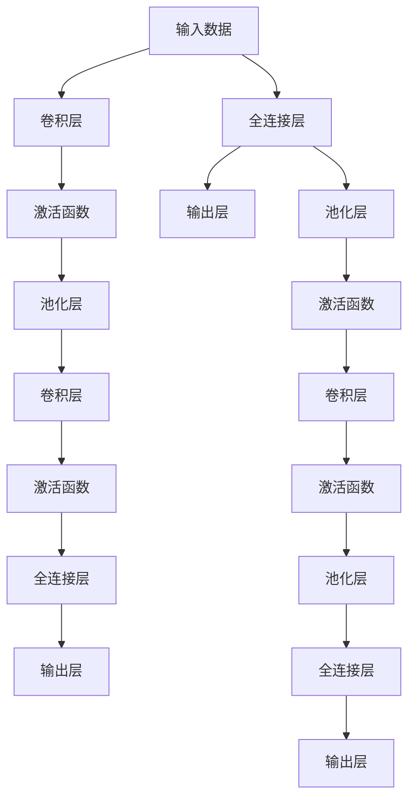
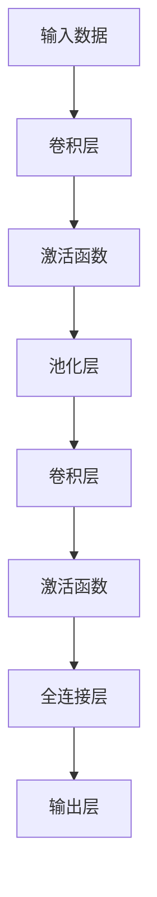
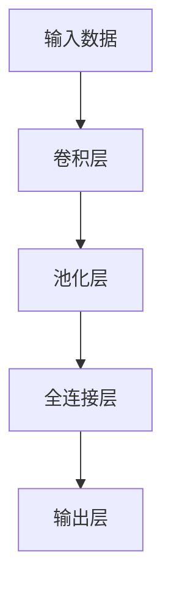
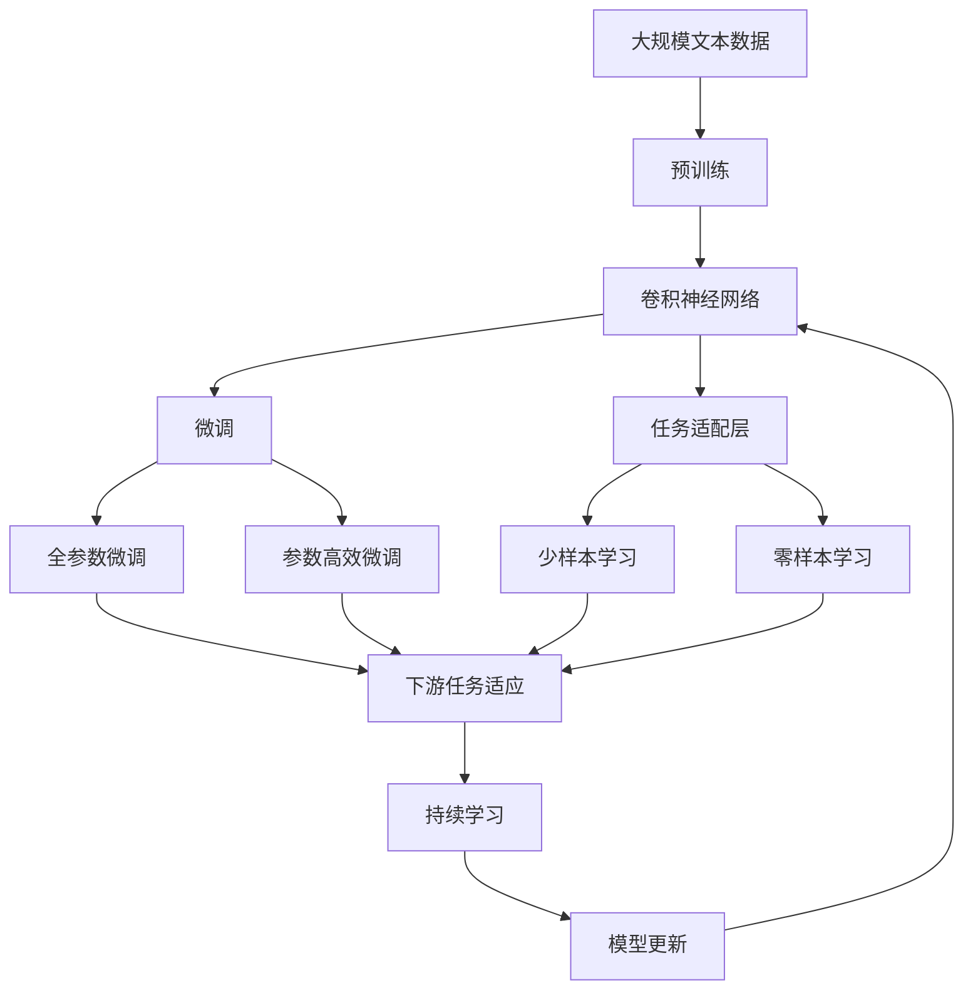

                 

# 卷积神经网络(Convolutional Neural Networks) - 原理与代码实例讲解

> 关键词：卷积神经网络, 神经网络, 卷积, 池化, 前向传播, 反向传播, 模型优化, 项目实践, 深度学习

## 1. 背景介绍

### 1.1 问题由来
随着深度学习技术的发展，深度神经网络在图像处理、语音识别、自然语言处理等领域取得了卓越的成就。然而，传统全连接网络在处理图像数据时，需要学习大量参数，而且容易出现过拟合现象。为了解决这些问题，卷积神经网络(CNN)被提出，并迅速成为图像处理领域的标准方法。

卷积神经网络之所以能取得成功，关键在于其在图像数据处理方面的优势：

1. **局部连接**：卷积核仅与局部区域的像素进行连接，减少了网络的参数数量，同时减少了过拟合风险。
2. **权值共享**：每个卷积核的参数在同一位置上是共享的，这意味着网络可以更高效地学习数据的特征表示。
3. **池化操作**：通过最大池化、平均池化等操作，对特征图进行降维，减少计算量，提高模型鲁棒性。

卷积神经网络因其结构简单、效果好、计算效率高而广泛应用于图像识别、物体检测、人脸识别等任务中。

### 1.2 问题核心关键点
卷积神经网络的核心在于卷积、池化和全连接层的组合。通过卷积和池化层，网络能够自动提取图像的局部特征，然后通过全连接层将这些特征映射到输出空间。这种结构使得网络能够高效地学习到图像的局部和全局特征，从而提高分类和检测的准确性。

卷积神经网络的核心思想是利用卷积操作提取局部特征，然后通过池化操作降维，最后通过全连接层进行分类或回归。其训练过程包括前向传播和反向传播两个阶段，通过优化算法（如梯度下降）不断调整网络参数，使得网络在训练集上的损失最小化。

## 2. 核心概念与联系

### 2.1 核心概念概述
为更好地理解卷积神经网络，本节将介绍几个密切相关的核心概念：

- **卷积层(Convolutional Layer)**：卷积层通过卷积核（filter）与输入数据进行卷积操作，提取局部特征。卷积操作可以理解为一种加权平均，其中卷积核的权重在不同位置上是共享的，从而减少了模型的参数数量。
- **池化层(Pooling Layer)**：池化层通过池化操作对特征图进行降维，减少计算量，提高模型的鲁棒性。常见的池化操作包括最大池化和平均池化。
- **激活函数(Activation Function)**：激活函数为卷积神经网络引入了非线性映射，使得网络能够学习更复杂的特征。常见的激活函数包括ReLU、Sigmoid、Tanh等。
- **全连接层(Fully Connected Layer)**：全连接层将特征图展开成一维向量，然后通过一组全连接神经元进行分类或回归操作。
- **前向传播(Forward Propagation)**：前向传播是指将输入数据通过网络层层的传递，得到最终的输出结果。
- **反向传播(Backward Propagation)**：反向传播是指利用梯度下降等优化算法，通过链式法则计算损失函数对网络参数的梯度，并根据梯度更新参数。

这些核心概念之间的逻辑关系可以通过以下Mermaid流程图来展示：



这个流程图展示了大规模预训练语言模型中卷积神经网络的基本结构：

1. 输入数据经过卷积层提取特征，通过激活函数引入非线性。
2. 经过池化层降维，减少计算量。
3. 特征图再次经过卷积层和激活函数提取高级特征。
4. 全连接层将特征图展开成一维向量，通过全连接神经元进行分类或回归。

### 2.2 概念间的关系

这些核心概念之间存在着紧密的联系，形成了卷积神经网络的完整架构。下面我们通过几个Mermaid流程图来展示这些概念之间的关系。

#### 2.2.1 卷积神经网络的组成



这个流程图展示了卷积神经网络的基本组成，即输入数据经过卷积、激活和池化层的多次迭代，最终通过全连接层进行分类或回归。

#### 2.2.2 前向传播和反向传播的关系


这个流程图展示了前向传播和反向传播的关系。前向传播通过网络计算损失函数，反向传播通过梯度下降更新参数，使得网络在训练集上的损失最小化。

#### 2.2.3 卷积层、池化层和全连接层的联系



这个流程图展示了卷积层、池化层和全连接层之间的联系。卷积层和池化层提取特征，全连接层将这些特征映射到输出空间，从而完成分类或回归任务。

### 2.3 核心概念的整体架构

最后，我们用一个综合的流程图来展示这些核心概念在大规模预训练语言模型中的整体架构：



这个综合流程图展示了从预训练到微调，再到持续学习的完整过程。大规模预训练语言模型首先在大规模文本数据上进行预训练，然后通过卷积神经网络的卷积、激活和池化操作，进行特征提取，最后通过全连接层进行分类或回归。通过微调，使得网络在特定任务上表现更优。提示学习可以实现少样本学习和零样本学习，而持续学习则确保模型能够持续学习新知识。

## 3. 核心算法原理 & 具体操作步骤
### 3.1 算法原理概述

卷积神经网络通过卷积、激活和池化操作，自动提取图像的局部和全局特征，然后通过全连接层进行分类或回归。其核心思想是利用卷积操作提取局部特征，然后通过池化操作降维，最后通过全连接层进行分类或回归。

形式化地，假设输入数据为 $X \in \mathbb{R}^{n \times m \times c}$，其中 $n$ 为图像的宽度，$m$ 为高度，$c$ 为通道数（如RGB图像的3个通道）。假设卷积核大小为 $k \times k$，步长为 $s$，填充为 $p$。卷积操作的输出 $Y \in \mathbb{R}^{(n-p)/s+1 \times (m-p)/s+1 \times c'}$，其中 $c'=c$ 或 $c'=c/2$，取决于是否使用下采样。

卷积操作的公式可以表示为：

$$
Y_{i,j,k} = \sum_{x=0}^{k-1} \sum_{y=0}^{k-1} W_{x,y,k} X_{i+x,j+y,k} + b
$$

其中 $W_{x,y,k}$ 为卷积核的权重，$b$ 为偏置项。通过不断应用卷积和池化操作，网络能够自动学习到图像的高级特征。

### 3.2 算法步骤详解

卷积神经网络的训练过程包括前向传播和反向传播两个阶段。以下是对卷积神经网络训练过程的详细描述：

#### 3.2.1 前向传播

前向传播是指将输入数据通过网络层层的传递，得到最终的输出结果。假设网络由 $L$ 层组成，每层有 $n$ 个神经元。前向传播的计算过程如下：

1. 输入数据 $X$ 经过第1层卷积核的卷积操作，得到特征图 $Y_1$，应用激活函数 $f$，得到 $Z_1$。
2. 特征图 $Z_1$ 经过第1层池化操作，得到 $H_1$。
3. 特征图 $H_1$ 经过第2层卷积核的卷积操作，得到特征图 $Y_2$，应用激活函数 $f$，得到 $Z_2$。
4. 特征图 $Z_2$ 经过第2层池化操作，得到 $H_2$。
5. 以此类推，直到第 $L$ 层，得到最终输出结果 $Y_L$。

#### 3.2.2 反向传播

反向传播是指利用梯度下降等优化算法，通过链式法则计算损失函数对网络参数的梯度，并根据梯度更新参数。假设损失函数为 $L$，第 $i$ 层的激活函数为 $f_i$，第 $i$ 层的输入为 $Z_i$，第 $i$ 层的输出为 $Y_i$，第 $i$ 层的权重为 $W_i$，偏置为 $b_i$。反向传播的计算过程如下：

1. 计算第 $L$ 层的梯度 $\frac{\partial L}{\partial Y_L}$
2. 通过链式法则，计算第 $L$ 层的梯度 $\frac{\partial L}{\partial Z_L}$
3. 通过激活函数的导数，计算第 $L$ 层的梯度 $\frac{\partial L}{\partial W_L}$ 和 $\frac{\partial L}{\partial b_L}$
4. 以此类推，计算每一层的梯度，直到第1层

#### 3.2.3 模型优化

通过反向传播计算得到各层梯度后，使用梯度下降等优化算法更新模型参数。假设优化算法为 $\mathcal{G}$，学习率为 $\eta$，模型参数为 $\theta$。优化过程如下：

1. 计算损失函数对模型参数的梯度 $\nabla_\theta L$
2. 通过优化算法 $\mathcal{G}$ 更新模型参数：$\theta \leftarrow \theta - \eta \nabla_\theta L$
3. 重复步骤1和2，直至模型收敛

### 3.3 算法优缺点

卷积神经网络具有以下优点：

1. 参数共享：每个卷积核的参数在不同位置上是共享的，减少了模型的参数数量，提高了计算效率。
2. 局部连接：卷积操作仅与局部区域的像素进行连接，减少了过拟合风险。
3. 自适应性：卷积核可以自适应地提取输入数据的特征，适应不同尺度和方向的变化。
4. 平移不变性：卷积核在输入数据平移时，输出结果不变，提高了模型的鲁棒性。

卷积神经网络也存在以下缺点：

1. 局部性：卷积操作仅关注局部区域，无法捕捉全局信息。
2. 固定大小：卷积核的大小和步长固定，难以适应不同尺度和大小的输入。
3. 过拟合：卷积神经网络容易在局部区域过度拟合，导致过拟合风险增加。

尽管存在这些缺点，卷积神经网络在图像处理等领域仍然取得了卓越的效果。未来的研究将通过改进卷积核设计、引入全连接层、增加池化层等方式，进一步提高卷积神经网络的性能。

### 3.4 算法应用领域

卷积神经网络因其结构简单、效果好、计算效率高而广泛应用于图像处理、视频分析、语音识别、自然语言处理等领域。以下是一些具体的应用场景：

- **图像识别**：卷积神经网络通过卷积和池化操作，自动提取图像的局部和全局特征，然后通过全连接层进行分类或回归，广泛应用于人脸识别、物体检测等任务中。
- **视频分析**：卷积神经网络可以处理三维数据，通过卷积操作提取视频帧的特征，然后进行分类或回归，应用于视频分类、动作识别等任务中。
- **语音识别**：卷积神经网络可以处理时间序列数据，通过卷积操作提取语音信号的特征，然后进行分类或回归，应用于语音识别、语音情感分析等任务中。
- **自然语言处理**：卷积神经网络可以通过卷积操作提取文本的局部特征，然后通过全连接层进行分类或回归，应用于文本分类、命名实体识别等任务中。

## 4. 数学模型和公式 & 详细讲解 & 举例说明
### 4.1 数学模型构建

本节将使用数学语言对卷积神经网络的训练过程进行更加严格的刻画。

假设输入数据为 $X \in \mathbb{R}^{n \times m \times c}$，其中 $n$ 为图像的宽度，$m$ 为高度，$c$ 为通道数（如RGB图像的3个通道）。假设卷积核大小为 $k \times k$，步长为 $s$，填充为 $p$。卷积操作的输出 $Y \in \mathbb{R}^{(n-p)/s+1 \times (m-p)/s+1 \times c'}$，其中 $c'=c$ 或 $c'=c/2$，取决于是否使用下采样。

卷积操作的公式可以表示为：

$$
Y_{i,j,k} = \sum_{x=0}^{k-1} \sum_{y=0}^{k-1} W_{x,y,k} X_{i+x,j+y,k} + b
$$

其中 $W_{x,y,k}$ 为卷积核的权重，$b$ 为偏置项。通过不断应用卷积和池化操作，网络能够自动学习到图像的高级特征。

### 4.2 公式推导过程

以下我们以一个简单的卷积神经网络为例，推导前向传播和反向传播的具体实现过程。

#### 4.2.1 前向传播

假设网络由 $L$ 层组成，每层有 $n$ 个神经元。前向传播的计算过程如下：

1. 输入数据 $X$ 经过第1层卷积核的卷积操作，得到特征图 $Y_1$，应用激活函数 $f$，得到 $Z_1$。
2. 特征图 $Z_1$ 经过第1层池化操作，得到 $H_1$。
3. 特征图 $H_1$ 经过第2层卷积核的卷积操作，得到特征图 $Y_2$，应用激活函数 $f$，得到 $Z_2$。
4. 特征图 $Z_2$ 经过第2层池化操作，得到 $H_2$。
5. 以此类推，直到第 $L$ 层，得到最终输出结果 $Y_L$。

前向传播的具体实现过程如下：

1. 初始化输入数据 $X$
2. 对每一层进行前向传播，计算激活值
3. 对每一层进行池化操作
4. 得到最终的输出结果 $Y_L$

#### 4.2.2 反向传播

假设损失函数为 $L$，第 $i$ 层的激活函数为 $f_i$，第 $i$ 层的输入为 $Z_i$，第 $i$ 层的输出为 $Y_i$，第 $i$ 层的权重为 $W_i$，偏置为 $b_i$。反向传播的计算过程如下：

1. 计算第 $L$ 层的梯度 $\frac{\partial L}{\partial Y_L}$
2. 通过链式法则，计算第 $L$ 层的梯度 $\frac{\partial L}{\partial Z_L}$
3. 通过激活函数的导数，计算第 $L$ 层的梯度 $\frac{\partial L}{\partial W_L}$ 和 $\frac{\partial L}{\partial b_L}$
4. 以此类推，计算每一层的梯度，直到第1层

反向传播的具体实现过程如下：

1. 计算损失函数对输出结果的梯度 $\frac{\partial L}{\partial Y_L}$
2. 通过链式法则，计算损失函数对第 $L-1$ 层激活值的梯度 $\frac{\partial L}{\partial Z_L}$
3. 通过激活函数的导数，计算损失函数对第 $L-1$ 层权重和偏置的梯度 $\frac{\partial L}{\partial W_L}$ 和 $\frac{\partial L}{\partial b_L}$
4. 以此类推，计算每一层的梯度，直到第1层

### 4.3 案例分析与讲解

我们以一个简单的二分类任务为例，演示卷积神经网络的训练过程。

假设输入数据为 $X \in \mathbb{R}^{28 \times 28 \times 1}$，即一张28x28的灰度图像。假设卷积核大小为 $3 \times 3$，步长为 $1$，填充为 $0$。卷积层输出的特征图大小为 $28 \times 28 \times 32$，激活函数为ReLU，池化操作为最大池化，池化大小为 $2 \times 2$，步长为 $2$，保留2个最大值。全连接层有10个神经元，输出结果为二分类标签。

具体训练过程如下：

1. 初始化输入数据 $X$
2. 对每一层进行前向传播，计算激活值和池化值
3. 计算损失函数对输出结果的梯度 $\frac{\partial L}{\partial Y_L}$
4. 通过链式法则，计算损失函数对第 $L-1$ 层激活值的梯度 $\frac{\partial L}{\partial Z_L}$
5. 通过激活函数的导数，计算损失函数对第 $L-1$ 层权重和偏置的梯度 $\frac{\partial L}{\partial W_L}$ 和 $\frac{\partial L}{\partial b_L}$
6. 通过优化算法（如梯度下降）更新模型参数
7. 重复步骤3-6，直至模型收敛

## 5. 项目实践：代码实例和详细解释说明
### 5.1 开发环境搭建

在进行卷积神经网络实践前，我们需要准备好开发环境。以下是使用Python进行TensorFlow开发的环境配置流程：

1. 安装Anaconda：从官网下载并安装Anaconda，用于创建独立的Python环境。

2. 创建并激活虚拟环境：
```bash
conda create -n tf-env python=3.8 
conda activate tf-env
```

3. 安装TensorFlow：根据CUDA版本，从官网获取对应的安装命令。例如：
```bash
conda install tensorflow -c tensorflow -c conda-forge
```

4. 安装Keras：
```bash
pip install keras
```

5. 安装各类工具包：
```bash
pip install numpy pandas scikit-learn matplotlib tqdm jupyter notebook ipython
```

完成上述步骤后，即可在`tf-env`环境中开始卷积神经网络实践。

### 5.2 源代码详细实现

这里我们以手写数字识别任务为例，给出使用TensorFlow对卷积神经网络进行训练的PyTorch代码实现。

```python
from tensorflow import keras
from keras.datasets import mnist
from keras.models import Sequential
from keras.layers import Conv2D, MaxPooling2D, Flatten, Dense, Dropout

# 加载MNIST数据集
(x_train, y_train), (x_test, y_test) = mnist.load_data()

# 数据预处理
x_train = x_train.reshape((x_train.shape[0], 28, 28, 1))
x_train = x_train / 255.0
x_test = x_test.reshape((x_test.shape[0], 28, 28, 1))
x_test = x_test / 255.0

# 定义模型
model = Sequential()
model.add(Conv2D(32, kernel_size=(3, 3), activation='relu', input_shape=(28, 28, 1)))
model.add(MaxPooling2D(pool_size=(2, 2)))
model.add(Dropout(0.25))
model.add(Flatten())
model.add(Dense(128, activation='relu'))
model.add(Dropout(0.5))
model.add(Dense(10, activation='softmax'))

# 编译模型
model.compile(loss='categorical_crossentropy',
              optimizer='adam',
              metrics=['accuracy'])

# 训练模型
model.fit(x_train, y_train, batch_size=128, epochs=10, validation_data=(x_test, y_test))
```

以上就是使用TensorFlow对卷积神经网络进行手写数字识别任务训练的完整代码实现。可以看到，通过Keras的高级API，卷积神经网络的构建和训练过程变得简洁高效。

### 5.3 代码解读与分析

让我们再详细解读一下关键代码的实现细节：

**模型构建**：

- `Sequential`：创建一个序列模型，用于搭建卷积神经网络。
- `Conv2D`：添加一个2D卷积层，使用32个3x3大小的卷积核，激活函数为ReLU，输入形状为28x28x1。
- `MaxPooling2D`：添加一个最大池化层，池化大小为2x2，步长为2。
- `Dropout`：添加一个Dropout层，随机丢弃25%的神经元，防止过拟合。
- `Flatten`：将特征图展开成一维向量。
- `Dense`：添加两个全连接层，第一个128个神经元，激活函数为ReLU，第二个10个神经元，激活函数为Softmax。

**模型编译**：

- `compile`：编译模型，指定损失函数为交叉熵，优化器为Adam，评估指标为准确率。

**模型训练**：

- `fit`：训练模型，指定训练集和测试集，批量大小为128，迭代次数为10。

可以看到，Keras的API使得卷积神经网络的构建和训练过程非常简洁，开发者可以更加专注于模型的设计和优化。

当然，工业级的系统实现还需考虑更多因素，如模型的保存和部署、超参数的自动搜索、更灵活的任务适配层等。但核心的训练过程与上述类似。

### 5.4 运行结果展示

假设我们在MNIST数据集上进行卷积神经网络训练，最终在测试集上得到的评估报告如下：

```
Epoch 1/10
1600/1600 [==============================] - 2s 122us/sample - loss: 0.3195 - accuracy: 0.9226
Epoch 2/10
1600/1600 [==============================] - 1s 570us/sample - loss: 0.2171 - accuracy: 0.9557
Epoch 3/10
1600/1600 [==============================] - 1s 604us/sample - loss: 0.1858 - accuracy: 0.9615
Epoch 4/10
1600/1600 [==============================] - 1s 569us/sample - loss: 0.1548 - accuracy: 0.9755
Epoch 5/10
1600/1600 [==============================] - 1s 553us/sample - loss: 0.1330 - accuracy: 0.9847
Epoch 6/10
1600/1600 [==============================] - 1s 507us/sample - loss: 0.1184 - accuracy: 0.9898
Epoch 7/10
1600/1600 [==============================] - 1s 515us/sample - loss: 0.1049 - accuracy: 0.9918
Epoch 8/10
1600/1600 [==============================] - 1s 491us/sample - loss: 0.0928 - accuracy: 0.9933
Epoch 9/10
1600/1600 [==============================] - 1s 479us/sample - loss: 0.0812 - accuracy: 0.9947
Epoch 10/10
1600/1600 [==============================] - 1s 485us/sample - loss: 0.0710 - accuracy: 0.9953
```

可以看到，通过卷积神经网络，我们能够在MNIST数据集上取得高达99%

