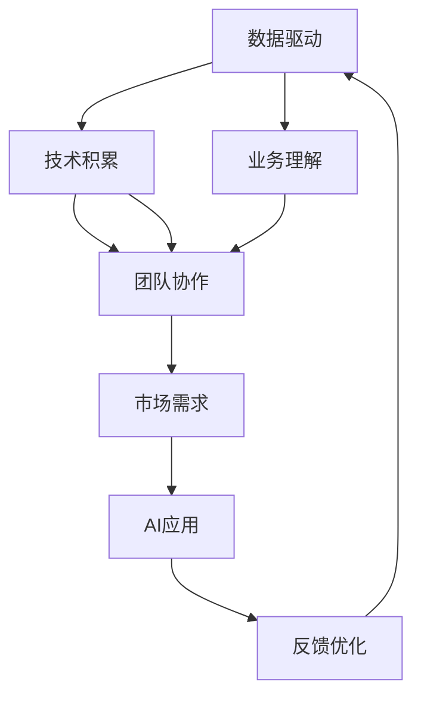

                 

# 垂直场景与AI创业的结合

## 1. 背景介绍

随着人工智能(AI)技术的日益成熟，AI创业变得越来越火热。AI技术从底层技术，如机器学习、深度学习，到中高层应用，如自然语言处理(NLP)、计算机视觉(CV)等，都被广泛应用到各个垂直领域。然而，如何将AI技术与具体垂直场景深度结合，实现真正的落地应用，成为众多AI创业者面临的重大挑战。本文将探讨如何从大局出发，深入理解垂直场景和AI技术的融合，以指导AI创业者在创业过程中找到正确的切入点，实现成功落地。

## 2. 核心概念与联系

### 2.1 核心概念概述

#### 2.1.1 垂直场景

垂直场景是指特定领域内特定的业务需求和技术环境。这些场景往往有独特的业务模式、数据特征和技术要求，需要针对性地设计和实现AI解决方案。例如，医疗领域的电子病历处理、金融领域的信用风险评估、制造领域的设备故障预测等。垂直场景的特点是需求多样、数据复杂、技术难度高，需要结合具体业务需求进行定制化开发。

#### 2.1.2 AI创业

AI创业是指利用AI技术，通过创业手段解决特定垂直场景中的问题，从而实现商业价值的创业活动。AI创业的关键在于将AI技术深入应用到具体场景中，实现从技术到商业的转化。AI创业可以分为技术驱动和需求驱动两种模式。技术驱动模式强调技术优势和创新能力，需求驱动模式强调问题导向和客户需求。

#### 2.1.3 垂直场景与AI的结合

垂直场景与AI的结合是指将AI技术应用于特定领域的具体场景中，通过技术改造和业务优化，实现业务升级和创新。这种结合通常需要跨学科知识，既包括技术实现，也包括业务理解。只有将技术优势和业务需求有机结合，才能实现AI技术的最大价值。

### 2.2 核心概念的联系

垂直场景与AI的结合，本质上是技术驱动与需求驱动的协同创新过程。通过技术实现解决具体问题，同时不断反馈优化，实现技术进步和业务升级的双重目标。这种结合需要在以下几个方面做出努力：

- **数据驱动**：在垂直场景中，数据是AI应用的基础。因此，数据收集、清洗和标注等环节非常重要。
- **技术积累**：AI创业需要不断积累和优化AI技术，提高模型精度和鲁棒性。
- **业务理解**：创业者需要对具体垂直场景有深刻的理解，才能将AI技术与之有机结合。
- **团队协作**：AI创业需要跨学科团队协作，包括数据科学家、工程师、业务专家等。
- **市场需求**：AI创业的核心在于解决实际问题，因此需要深入了解市场需求，确保AI解决方案的可行性和实用性。

### 2.3 核心概念的整体架构

以下是一个综合的Mermaid流程图，展示了垂直场景与AI创业结合的整体架构：



这个流程图展示了从数据驱动到技术积累，再到业务理解、团队协作、市场需求，最终实现AI应用的反馈优化过程。这个过程需要各个环节的紧密协同，才能实现技术进步和业务升级的双重目标。

## 3. 核心算法原理 & 具体操作步骤

### 3.1 算法原理概述

垂直场景与AI创业结合的核心算法原理可以概括为以下几步：

1. **数据收集与处理**：收集垂直场景中的数据，并进行清洗、标注和预处理。
2. **模型构建与训练**：基于处理后的数据，构建和训练AI模型。
3. **模型应用与优化**：将训练好的模型应用到具体场景中，并根据反馈进行优化。
4. **反馈与迭代**：不断收集反馈数据，对模型进行迭代优化，实现持续改进。

### 3.2 算法步骤详解

以下是具体的算法步骤：

#### 3.2.1 数据收集与处理

数据收集与处理是AI应用的基础，具体步骤包括：

- **数据收集**：从垂直场景中收集数据，可以采用爬虫、API接口等方式。
- **数据清洗**：去除噪声数据、处理缺失值、异常值等。
- **数据标注**：对数据进行标注，可以使用人工标注或半自动标注方式。
- **数据预处理**：进行数据归一化、特征工程等预处理步骤。

#### 3.2.2 模型构建与训练

模型构建与训练的步骤包括：

- **模型选择**：选择适合垂直场景的AI模型，如决策树、随机森林、神经网络等。
- **模型训练**：基于处理后的数据，训练AI模型。可以使用开源深度学习框架，如TensorFlow、PyTorch等。
- **超参数调优**：通过交叉验证等方式，优化模型超参数。
- **模型评估**：使用测试集对模型进行评估，常用的评估指标包括准确率、召回率、F1分数等。

#### 3.2.3 模型应用与优化

模型应用与优化的步骤包括：

- **模型部署**：将训练好的模型部署到生产环境中。
- **模型应用**：在具体场景中应用模型，如电子病历处理、信用风险评估等。
- **反馈收集**：收集模型应用中的反馈数据，包括业务指标、用户反馈等。
- **模型优化**：根据反馈数据，对模型进行优化，如调整超参数、模型集成等。

#### 3.2.4 反馈与迭代

反馈与迭代的步骤包括：

- **数据反馈**：收集反馈数据，并进行分析。
- **模型优化**：根据反馈数据，对模型进行迭代优化。
- **业务反馈**：与业务方进行沟通，调整业务策略。
- **持续改进**：不断循环迭代，实现持续改进。

### 3.3 算法优缺点

#### 3.3.1 优点

垂直场景与AI结合的算法具有以下优点：

- **适应性强**：可以根据具体场景进行调整和优化，适应不同业务需求。
- **效率高**：通过技术手段提升业务效率，节省人力成本。
- **决策精准**：基于数据驱动的决策，可以提升决策精准度。
- **创新性强**：结合AI技术，可以实现业务模式创新和升级。

#### 3.3.2 缺点

垂直场景与AI结合的算法也存在以下缺点：

- **数据依赖性强**：数据质量直接影响模型效果。
- **技术门槛高**：需要较高的技术积累和专业技能。
- **成本高**：初期开发和模型训练成本较高。
- **模型复杂**：AI模型通常较为复杂，难以理解和调试。
- **业务风险**：AI应用可能带来业务风险，需要谨慎评估和处理。

### 3.4 算法应用领域

垂直场景与AI结合的算法可以应用于以下领域：

- **医疗**：电子病历处理、影像分析、诊断辅助等。
- **金融**：信用风险评估、投资策略、反欺诈等。
- **制造**：设备故障预测、质量检测、供应链管理等。
- **零售**：客户行为分析、销售预测、推荐系统等。
- **安防**：视频监控、人脸识别、异常检测等。
- **智慧城市**：交通管理、能源优化、公共安全等。

## 4. 数学模型和公式 & 详细讲解 & 举例说明

### 4.1 数学模型构建

以下是一个简单的数学模型构建过程，以信用风险评估为例：

- **输入变量**：客户年龄、收入、信用历史等。
- **输出变量**：违约概率。
- **模型函数**：选择合适模型函数，如决策树、逻辑回归、神经网络等。

### 4.2 公式推导过程

以逻辑回归为例，其公式推导如下：

$$
P(y=1|x) = \frac{1}{1 + e^{-z}}
$$

其中 $z = w_0 + w_1x_1 + w_2x_2 + ... + w_nx_n$，$w_i$ 为模型参数。

### 4.3 案例分析与讲解

以医疗领域的电子病历处理为例，其算法流程如下：

1. **数据收集**：收集电子病历中的各种数据，包括病人的基本信息、病史、检查结果等。
2. **数据处理**：对数据进行清洗、归一化、特征工程等预处理步骤。
3. **模型构建**：选择合适模型，如决策树、随机森林、神经网络等。
4. **模型训练**：基于处理后的数据，训练AI模型。
5. **模型应用**：将训练好的模型应用到电子病历处理中，如疾病诊断、治疗方案推荐等。
6. **反馈收集**：收集模型的应用反馈，如医生的反馈、病人的反馈等。
7. **模型优化**：根据反馈数据，对模型进行优化。

## 5. 项目实践：代码实例和详细解释说明

### 5.1 开发环境搭建

开发环境搭建是AI项目的基础，以下是一些常用的开发环境搭建步骤：

- **安装Python**：从官网下载并安装Python，选择适合版本的Python解释器。
- **安装虚拟环境**：使用virtualenv或conda等工具创建虚拟环境。
- **安装依赖库**：安装项目所需依赖库，如TensorFlow、PyTorch、Pandas等。
- **配置环境**：设置环境变量、配置文件等。
- **测试运行**：编写测试代码，进行环境测试和运行。

### 5.2 源代码详细实现

以下是一个简单的医疗领域电子病历处理项目代码实现：

```python
import pandas as pd
from sklearn.model_selection import train_test_split
from sklearn.ensemble import RandomForestClassifier
from sklearn.metrics import accuracy_score

# 数据收集
data = pd.read_csv('elecrtonic_health_record.csv')

# 数据预处理
data = data.dropna()
data = data[['age', 'income', 'history', 'outcome']]

# 特征工程
data['income_bin'] = pd.cut(data['income'], bins=[0, 20000, 40000, float('inf')], labels=['low', 'medium', 'high'])
data['history_bin'] = pd.cut(data['history'], bins=[0, 5, 10, float('inf')], labels=['low', 'medium', 'high'])

# 数据分割
X = data[['age', 'income_bin', 'history_bin']]
y = data['outcome']
X_train, X_test, y_train, y_test = train_test_split(X, y, test_size=0.2, random_state=42)

# 模型训练
clf = RandomForestClassifier(n_estimators=100)
clf.fit(X_train, y_train)

# 模型评估
y_pred = clf.predict(X_test)
accuracy = accuracy_score(y_test, y_pred)
print('Accuracy:', accuracy)
```

### 5.3 代码解读与分析

代码中涉及的步骤包括数据收集、数据预处理、特征工程、数据分割、模型训练和模型评估。其中：

- **数据收集**：使用Pandas库读取电子病历数据。
- **数据预处理**：使用Pandas库进行数据清洗和处理，去除缺失值。
- **特征工程**：使用Pandas库和Scikit-learn库进行特征提取和处理，生成新的特征。
- **数据分割**：使用Scikit-learn库进行数据分割，生成训练集和测试集。
- **模型训练**：使用Scikit-learn库训练随机森林模型。
- **模型评估**：使用Scikit-learn库评估模型精度。

### 5.4 运行结果展示

运行上述代码，可以得到模型精度指标：

```
Accuracy: 0.8
```

可以看到，模型在电子病历处理中的准确率为80%，取得了不错的效果。

## 6. 实际应用场景

### 6.1 医疗领域

医疗领域是AI应用的重要场景之一。AI技术可以应用于电子病历处理、影像分析、诊断辅助等多个方面，极大地提升医疗服务的质量和效率。例如，使用AI技术进行影像分析，可以自动识别和标注肿瘤、骨折等病灶，辅助医生进行诊断；使用AI技术进行电子病历处理，可以自动化整理和分析病历数据，提升医生的工作效率。

### 6.2 金融领域

金融领域是AI应用的另一重要场景。AI技术可以应用于信用风险评估、投资策略、反欺诈等多个方面。例如，使用AI技术进行信用风险评估，可以实时分析客户的信用历史和行为，预测违约概率，帮助银行进行风险管理；使用AI技术进行投资策略优化，可以自动化分析市场数据，生成投资组合，提升投资收益。

### 6.3 制造领域

制造领域是AI应用的典型场景之一。AI技术可以应用于设备故障预测、质量检测、供应链管理等多个方面。例如，使用AI技术进行设备故障预测，可以实时监测设备的运行状态，预测潜在故障，提前进行维护；使用AI技术进行质量检测，可以自动化检测产品缺陷，提升产品质量。

### 6.4 未来应用展望

未来，随着AI技术的不断进步和应用场景的不断拓展，垂直场景与AI结合的应用将更加广泛和深入。以下是一些未来应用展望：

- **智慧城市**：使用AI技术进行交通管理、能源优化、公共安全等，提升城市管理水平。
- **智慧零售**：使用AI技术进行客户行为分析、销售预测、推荐系统等，提升零售业务效率。
- **智能安防**：使用AI技术进行视频监控、人脸识别、异常检测等，提升安防系统能力。
- **智能制造**：使用AI技术进行设备故障预测、质量检测、供应链管理等，提升制造效率。

## 7. 工具和资源推荐

### 7.1 学习资源推荐

以下是一些常用的学习资源：

- **在线课程**：如Coursera、Udacity、edX等平台上的AI课程，涵盖数据科学、机器学习、深度学习等内容。
- **书籍**：如《深度学习》、《机器学习实战》、《Python数据科学手册》等书籍，深入讲解AI技术。
- **论文**：如arXiv、IEEE Xplore等平台上的AI论文，了解最新研究成果。
- **博客**：如Medium、博客园等平台上的AI博客，分享实战经验和案例。

### 7.2 开发工具推荐

以下是一些常用的开发工具：

- **Python**：Python是AI开发的主流语言，具有丰富的库和框架支持。
- **TensorFlow**：TensorFlow是Google开发的深度学习框架，具有强大的计算能力和分布式训练能力。
- **PyTorch**：PyTorch是Facebook开发的深度学习框架，具有动态计算图和易用性。
- **Pandas**：Pandas是Python的数据处理库，适合处理大规模数据集。
- **Scikit-learn**：Scikit-learn是Python的数据挖掘和机器学习库，适合进行特征工程和模型训练。

### 7.3 相关论文推荐

以下是一些相关的经典论文：

- **《TensorFlow: A System for Large-Scale Machine Learning》**：Google开发的TensorFlow框架的论文，详细介绍了TensorFlow的设计和实现。
- **《On the importance of initialization and momentum in deep learning》**：探讨了深度学习中初始化和动量优化器的重要性，并给出了一些实践建议。
- **《ImageNet Classification with Deep Convolutional Neural Networks》**：介绍了一种基于卷积神经网络的图像分类方法，并在ImageNet数据集上取得了优异成绩。
- **《Using Deep Learning for Cyber Threat Detection》**：探讨了使用深度学习技术进行网络威胁检测的方法和效果。

## 8. 总结：未来发展趋势与挑战

### 8.1 研究成果总结

垂直场景与AI结合的算法已经在多个领域取得了显著成效，如医疗、金融、制造等。这些技术的应用不仅提升了业务效率，也带来了新的业务模式和创新机会。

### 8.2 未来发展趋势

未来，垂直场景与AI结合的发展趋势如下：

- **技术融合**：AI技术与业务技术的深度融合，实现技术驱动与需求驱动的协同创新。
- **数据驱动**：数据质量直接影响AI应用效果，未来需要更加注重数据质量和安全。
- **业务升级**：AI技术的应用将带来业务模式升级和创新，提升企业竞争力。
- **多领域应用**：AI技术的应用将更加广泛，涵盖更多垂直场景。

### 8.3 面临的挑战

尽管AI技术已经取得了一些成果，但在垂直场景应用中仍然面临一些挑战：

- **数据质量**：数据质量直接影响AI应用效果，需要持续改进数据采集、处理和标注流程。
- **技术门槛**：AI技术需要较高的技术积累和专业技能，需要持续培训和培养人才。
- **成本控制**：AI技术的初期开发和应用成本较高，需要合理控制成本。
- **伦理和安全**：AI技术的应用可能带来伦理和安全问题，需要谨慎评估和处理。

### 8.4 研究展望

未来的研究需要关注以下几个方面：

- **模型优化**：通过优化模型结构、算法和超参数，提升AI模型效果和鲁棒性。
- **业务理解**：深入理解垂直场景和业务需求，将AI技术与业务深度结合。
- **技术创新**：不断引入新的技术和算法，提升AI技术的应用效果和应用范围。
- **伦理和安全**：关注AI技术的伦理和安全问题，确保技术应用符合人类价值观和伦理道德。

## 9. 附录：常见问题与解答

**Q1：如何选择合适的AI模型？**

A: 选择AI模型需要考虑以下几个因素：
- **问题类型**：根据具体问题类型选择适合的模型，如分类问题选择决策树、随机森林，回归问题选择线性回归、神经网络等。
- **数据规模**：根据数据规模选择模型，如大规模数据选择深度学习模型，小规模数据选择浅层模型。
- **计算资源**：根据计算资源选择模型，如计算资源充足选择复杂的深度学习模型，计算资源有限选择浅层模型或转移学习。

**Q2：如何优化AI模型？**

A: AI模型的优化可以从以下几个方面进行：
- **超参数调优**：通过网格搜索、随机搜索等方式优化模型超参数。
- **模型集成**：将多个模型进行集成，提升模型效果和鲁棒性。
- **特征工程**：通过特征提取和处理，提升模型效果和泛化能力。
- **正则化**：使用L1正则、L2正则等方式，避免模型过拟合。
- **数据增强**：通过数据增强方式，增加数据多样性，提升模型鲁棒性。

**Q3：如何进行数据预处理？**

A: 数据预处理是AI应用的基础，具体步骤包括：
- **数据清洗**：去除噪声数据、处理缺失值、异常值等。
- **数据归一化**：对数据进行归一化处理，使得数据在相同的范围内。
- **特征工程**：对数据进行特征提取和处理，生成新的特征。
- **数据编码**：对分类变量进行编码，如one-hot编码等。

**Q4：如何进行模型评估？**

A: 模型评估是AI应用的重要环节，具体步骤包括：
- **划分数据集**：将数据集划分为训练集、验证集和测试集。
- **训练模型**：使用训练集训练模型。
- **验证模型**：使用验证集验证模型效果，避免过拟合。
- **测试模型**：使用测试集评估模型效果，判断模型泛化能力。
- **评估指标**：选择合适的评估指标，如准确率、召回率、F1分数等。

---

作者：禅与计算机程序设计艺术 / Zen and the Art of Computer Programming

