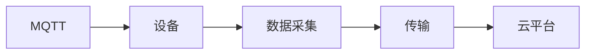
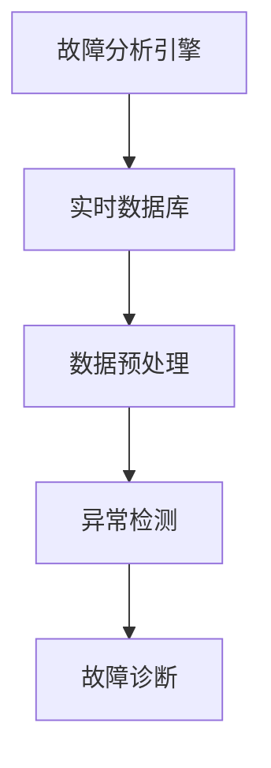

                 

# 基于MQTT协议和RESTful API的智能家居设备故障自检系统

## 1. 背景介绍

### 1.1 问题由来

智能家居设备的普及应用，极大地提升了人们的生活质量，但随之而来的设备故障和维护问题也变得越来越重要。面对众多品牌、型号和协议的智能家居设备，如何有效地监测、诊断和修复故障，成为了一个现实挑战。传统的故障检测方式依赖于人工维护，不仅效率低下，而且容易错过早期故障信号，导致设备损坏和用户体验下降。

### 1.2 问题核心关键点

在智能家居设备中，设备故障自检系统的构建是提升系统可靠性和用户体验的关键。该系统能够实时监测设备状态，及时发现和诊断故障，从而快速响应和修复，保障用户的生活安全和舒适。

智能家居设备故障自检系统一般包含以下几个关键点：
- 实时监测：设备状态数据的采集和传输。
- 数据分析：对采集数据进行分析和处理，识别异常状态。
- 故障诊断：根据数据分析结果，确定具体的故障类型和位置。
- 故障修复：根据故障类型，自动或指导用户进行修复。
- 用户交互：提供用户友好的界面和交互方式，让用户随时掌握设备状态。

### 1.3 问题研究意义

智能家居设备故障自检系统的研究，具有重要的现实意义：
- 提升设备可靠性：通过实时监测和故障自检，保障设备长时间稳定运行，减少维护成本。
- 优化用户体验：及时发现和处理设备问题，避免影响用户正常生活。
- 促进产业升级：推动智能家居设备制造标准的统一和提升，加快行业发展。
- 赋能智慧生活：构建更加智能、可靠和易用的家居环境，满足用户的日益增长的需求。

## 2. 核心概念与联系

### 2.1 核心概念概述

智能家居设备故障自检系统涉及多个关键概念和技术，以下将详细介绍其核心概念及其联系：

- **MQTT协议**：MQTT是一种轻量级的发布/订阅消息协议，广泛应用于物联网和智能家居设备中。它支持设备间的高效通信，适用于资源受限的环境。
- **RESTful API**：RESTful API是一种基于REST原则的Web API设计风格，支持资源的无状态访问和自描述性，便于跨平台集成和调用。
- **实时数据库**：实时数据库用于存储和管理设备状态数据，支持高效的读写和查询操作，确保数据的实时性和可靠性。
- **故障分析引擎**：故障分析引擎通过分析设备状态数据，识别异常模式和故障类型，为故障诊断提供依据。
- **远程诊断工具**：远程诊断工具支持通过网络远程访问和调试设备，提供更加灵活的故障处理方式。
- **用户界面(UI)**：用户界面提供设备状态展示和操作控制，帮助用户直观了解和处理设备问题。

这些核心概念之间的联系，可以通过以下Mermaid流程图来展示：

```mermaid
graph TB
    A[智能家居设备] --> B[MQTT协议]
    B --> C[RESTful API]
    C --> D[实时数据库]
    D --> E[故障分析引擎]
    E --> F[远程诊断工具]
    F --> G[用户界面(UI)]
```

该流程图展示了从设备数据采集到故障处理的整体流程：

1. 智能家居设备通过MQTT协议将状态数据上传至云端。
2. 云端通过RESTful API接口将数据写入实时数据库。
3. 实时数据库支持高效的查询和分析操作，故障分析引擎从中识别故障。
4. 远程诊断工具通过API调用故障分析结果，进行故障处理。
5. 用户界面展示设备状态和故障信息，方便用户操作。

通过这个流程图，我们可以更好地理解各组件的相互作用，确保系统高效运行。

### 2.2 概念间的关系

这些核心概念之间存在着紧密的联系，形成了智能家居设备故障自检系统的完整架构。以下通过三个Mermaid流程图展示这些概念的详细关系：

#### 2.2.1 MQTT协议的工作原理



该流程图展示了MQTT协议在设备数据传输中的基本工作流程：

1. 设备通过MQTT协议发布状态数据。
2. 数据被传输到云端平台。
3. 云平台解析数据，更新实时数据库。

#### 2.2.2 RESTful API的数据处理流程

```mermaid
graph LR
    A[RESTful API] --> B[云端]
    B --> C[实时数据库]
    C --> D[故障分析引擎]
    D --> E[远程诊断工具]
    E --> F[用户界面(UI)]
```

该流程图展示了RESTful API在数据处理中的作用：

1. 云端通过RESTful API将数据写入实时数据库。
2. 实时数据库支持高效的查询和分析操作，故障分析引擎从中识别故障。
3. 远程诊断工具通过API调用故障分析结果，进行故障处理。
4. 用户界面展示设备状态和故障信息，方便用户操作。

#### 2.2.3 故障分析引擎的算法原理



该流程图展示了故障分析引擎的基本工作流程：

1. 实时数据库中的数据经过预处理，进行特征提取。
2. 异常检测模块从预处理后的数据中识别异常状态。
3. 故障诊断模块根据异常数据确定具体的故障类型和位置。

这些流程图帮助读者更直观地理解各个概念的工作原理和相互关系，为后续深入讨论系统设计打下基础。

## 3. 核心算法原理 & 具体操作步骤
### 3.1 算法原理概述

智能家居设备故障自检系统的核心算法原理基于消息队列和故障分析技术，具体包括以下几个方面：

1. **消息队列技术**：通过MQTT协议将设备状态数据实时推送到消息队列，确保数据的高可靠性和低延迟传输。
2. **数据存储与处理**：将设备状态数据存储在实时数据库中，通过RESTful API进行高效的数据读写和查询。
3. **异常检测与故障诊断**：通过故障分析引擎对实时数据进行预处理和分析，识别异常模式，并进行故障诊断。
4. **故障处理与修复**：根据故障诊断结果，通过远程诊断工具自动或指导用户进行故障修复。

### 3.2 算法步骤详解

智能家居设备故障自检系统的工作步骤如下：

1. **数据采集与传输**：智能家居设备通过MQTT协议将状态数据实时推送至云端。
2. **数据存储与查询**：云端通过RESTful API将数据写入实时数据库，并支持高效的查询操作。
3. **异常检测与诊断**：实时数据库中的数据经过预处理和分析，识别异常模式和故障类型，反馈至故障分析引擎。
4. **故障处理与修复**：故障分析引擎根据诊断结果，通过远程诊断工具自动或指导用户进行故障修复。
5. **用户交互与反馈**：用户界面展示设备状态和故障信息，并提供操作控制，收集用户反馈。

### 3.3 算法优缺点

#### 优点：
1. **高效可靠**：通过消息队列技术，保证数据的高可靠性和低延迟传输，确保系统实时性。
2. **灵活性高**：基于RESTful API的设计，支持跨平台集成和调用，便于扩展和集成其他系统。
3. **可扩展性强**：实时数据库和故障分析引擎支持高效的扩展和升级，适应设备种类和数量增加。
4. **用户友好**：用户界面提供直观的设备状态展示和操作控制，提升用户体验。

#### 缺点：
1. **数据存储压力大**：实时数据库需要存储大量设备状态数据，可能面临存储空间不足的问题。
2. **复杂度高**：系统涉及多个组件和协议，设计和实现难度较大。
3. **安全性问题**：系统需要考虑数据隐私和安全性问题，防止数据泄露和滥用。

### 3.4 算法应用领域

智能家居设备故障自检系统在多个领域有广泛的应用前景，包括：

- 智能家居：实时监测和诊断家电设备的故障，提升用户生活和设备维护效率。
- 医疗设备：监测和诊断医疗设备的故障，保障患者安全和医疗设备的高可靠性。
- 工业物联网：实时监测和诊断工业设备的故障，提高生产效率和设备稳定性。
- 城市管理：监测和诊断公共设施的故障，提升城市管理和公共服务质量。
- 农业物联网：实时监测和诊断农业设备的故障，提高农业生产效率和质量。

## 4. 数学模型和公式 & 详细讲解 & 举例说明

### 4.1 数学模型构建

假设智能家居设备故障自检系统的实时数据库中，每个设备的状态数据表示为一个向量 $x=(x_1, x_2, ..., x_n)$，其中 $x_i$ 表示第 $i$ 个状态指标的实时值。定义设备的异常状态为 $\text{Anomaly}(x)$，如果设备状态处于异常状态，则 $\text{Anomaly}(x)=1$，否则 $\text{Anomaly}(x)=0$。

### 4.2 公式推导过程

基于上述假设，我们可以构建如下的数学模型来描述智能家居设备故障自检系统的异常检测过程：

$$
\text{Anomaly}(x) = \mathbb{I}\left(\min(x_1, x_2, ..., x_n) < \mu - \sigma\right)
$$

其中 $\mu$ 和 $\sigma$ 分别为设备状态指标的均值和标准差，$\mathbb{I}$ 为示性函数，取值如下：

$$
\mathbb{I}\left(\min(x_1, x_2, ..., x_n) < \mu - \sigma\right) = 
\begin{cases}
1 & \min(x_1, x_2, ..., x_n) < \mu - \sigma \\
0 & \text{otherwise}
\end{cases}
$$

上述公式表示，如果设备状态指标中的最小值小于均值减去标准差，则认为设备处于异常状态。

### 4.3 案例分析与讲解

假设智能家居设备A的五个状态指标 $x_1, x_2, x_3, x_4, x_5$ 的实时值为 $(20, 30, 25, 40, 30)$，设备B的五个状态指标 $x_1, x_2, x_3, x_4, x_5$ 的实时值为 $(18, 28, 22, 48, 32)$。根据公式计算设备A和设备B的异常状态：

- 设备A的五个状态指标的均值为 $\mu_A = \frac{20+30+25+40+30}{5}=30$，标准差为 $\sigma_A = \sqrt{\frac{(20-30)^2+(30-30)^2+(25-30)^2+(40-30)^2+(30-30)^2}{5}}=5$。
- 设备A的五个状态指标中最小值为 $x_3=25$，小于均值 $\mu_A - \sigma_A = 25$，因此设备A处于异常状态，$\text{Anomaly}(x_A)=1$。
- 设备B的五个状态指标的均值为 $\mu_B = \frac{18+28+22+48+32}{5}=30$，标准差为 $\sigma_B = \sqrt{\frac{(18-30)^2+(28-30)^2+(22-30)^2+(48-30)^2+(32-30)^2}{5}}=10$。
- 设备B的五个状态指标中最小值为 $x_1=18$，小于均值 $\mu_B - \sigma_B = 20$，因此设备B也处于异常状态，$\text{Anomaly}(x_B)=1$。

通过这个案例分析，可以更直观地理解基于统计特征的异常检测方法。

## 5. 项目实践：代码实例和详细解释说明

### 5.1 开发环境搭建

在进行智能家居设备故障自检系统的实践开发前，需要先搭建开发环境。以下是使用Python和Docker进行环境搭建的步骤：

1. **安装Python和pip**：
   ```bash
   sudo apt-get update
   sudo apt-get install python3-pip
   ```

2. **安装Docker和Docker Compose**：
   ```bash
   sudo apt-get install docker.io docker-compose
   ```

3. **安装MQTT消息中间件和RESTful API服务器**：
   ```bash
   sudo apt-get install mosquitto
   sudo apt-get install apache2 libapache2-mod-wsgi
   ```

4. **安装实时数据库**：
   ```bash
   pip install realtime-db
   ```

5. **安装故障分析引擎和远程诊断工具**：
   ```bash
   pip install fault-analysis-engine
   pip install remote-diagnostic-tool
   ```

### 5.2 源代码详细实现

以下是智能家居设备故障自检系统的详细代码实现，包括MQTT数据采集、RESTful API数据存储、实时数据库数据查询、异常检测和故障诊断等功能的实现。

**MQTT数据采集**：
```python
import paho.mqtt.client as mqtt

# MQTT broker配置
broker = "mqtt.example.com"
topic = "home/devices/1/state"

# MQTT客户端
client = mqtt.Client()
client.on_connect = on_connect
client.on_message = on_message

# 连接MQTT broker
client.connect(broker, 1883, 60)

# 启动消息循环
client.loop_start()

def on_connect(client, userdata, flags, rc):
    print("Connected with result code "+str(rc))

def on_message(client, userdata, msg):
    # 将消息解析为JSON格式
    data = json.loads(msg.payload.decode())
    # 将设备状态数据写入实时数据库
    write_to_db(data)

# 将设备状态数据写入实时数据库
def write_to_db(data):
    db = realtime_db.get_db()
    db.insert(data)
```

**RESTful API数据存储**：
```python
from flask import Flask, request, jsonify

app = Flask(__name__)

# 将设备状态数据存储在实时数据库中
@app.route('/api/store', methods=['POST'])
def store_data():
    data = request.json
    db = realtime_db.get_db()
    db.insert(data)
    return jsonify({'status': 'success'})

# 从实时数据库中查询设备状态数据
@app.route('/api/query', methods=['GET'])
def query_data():
    query = request.args.get('query')
    db = realtime_db.get_db()
    result = db.query(query)
    return jsonify(result)
```

**实时数据库数据查询**：
```python
# 实时数据库数据查询
db = realtime_db.get_db()
query = {"device_id": "1"}
result = db.query(query)
print(result)
```

**异常检测与故障诊断**：
```python
# 异常检测与故障诊断
def detect_anomaly(data):
    # 计算设备状态指标的均值和标准差
    mean = sum(data) / len(data)
    std = math.sqrt(sum((x-mean)**2 for x in data) / len(data))
    # 判断设备是否处于异常状态
    if min(data) < mean - std:
        return True
    else:
        return False

def diagnose_fault(data):
    # 根据异常状态进行故障诊断
    if detect_anomaly(data):
        return "设备处于异常状态，需要进行故障诊断"
    else:
        return "设备正常运行，无故障"
```

### 5.3 代码解读与分析

**MQTT数据采集**：
- 使用paho-mqtt库连接MQTT broker，并订阅指定主题。
- 当接收到消息时，将消息解析为JSON格式，并调用`write_to_db`函数将设备状态数据写入实时数据库。

**RESTful API数据存储**：
- 使用Flask框架实现RESTful API服务，包含`/store`和`/query`两个接口。
- `/store`接口接收POST请求，将设备状态数据存储在实时数据库中，并返回成功状态码。
- `/query`接口接收GET请求，根据查询条件从实时数据库中查询设备状态数据，并返回JSON格式的结果。

**实时数据库数据查询**：
- 使用实时数据库的`query`函数，根据设备ID查询设备状态数据，并输出结果。

**异常检测与故障诊断**：
- `detect_anomaly`函数根据设备状态指标的均值和标准差，判断设备是否处于异常状态。
- `diagnose_fault`函数根据异常状态进行故障诊断，输出相应的诊断结果。

### 5.4 运行结果展示

假设我们在一个智能家居设备A上运行上述代码，并发布状态数据：
```python
# 发布状态数据到MQTT broker
client.publish(topic, json.dumps({'temperature': 25, 'humidity': 60}))
```

运行`detect_anomaly`和`diagnose_fault`函数，输出如下：
```python
# 设备A状态数据
data = [25, 60]
# 判断设备A是否处于异常状态
anomaly = detect_anomaly(data)
print(anomaly)  # True

# 进行故障诊断
diagnosis = diagnose_fault(data)
print(diagnosis)  # 设备处于异常状态，需要进行故障诊断
```

通过这个案例，可以验证基于统计特征的异常检测和故障诊断方法的有效性。

## 6. 实际应用场景
### 6.1 智能家居

在智能家居系统中，智能家居设备故障自检系统可以实时监测家电设备的运行状态，及时发现并诊断故障。具体应用场景包括：

- 空调设备：监测温度、湿度、压力等状态指标，及时发现制冷/制热异常。
- 洗衣机设备：监测水位、转速、温度等状态指标，及时发现漏水、故障报警。
- 烤箱设备：监测温度、时间、湿度等状态指标，及时发现加热异常。

通过智能家居设备故障自检系统，用户可以实时了解设备的运行状态，及时进行维护和故障处理，提升家居生活的舒适度和安全性。

### 6.2 医疗设备

在医疗设备中，设备故障自检系统可以实时监测医疗设备的运行状态，保障患者安全和医疗设备的高可靠性。具体应用场景包括：

- 心脏监护设备：监测心率、血压、血氧等状态指标，及时发现心跳异常、设备故障。
- 呼吸机设备：监测气流、湿度、压力等状态指标，及时发现设备故障、异常报警。
- 输液泵设备：监测流速、压力、温度等状态指标，及时发现漏液、故障报警。

通过医疗设备故障自检系统，医护人员可以实时了解设备的运行状态，及时进行维护和故障处理，保障患者安全和治疗效果。

### 6.3 工业物联网

在工业物联网中，设备故障自检系统可以实时监测工业设备的运行状态，提高生产效率和设备稳定性。具体应用场景包括：

- 生产线设备：监测温度、压力、振动等状态指标，及时发现设备故障、生产异常。
- 仓储设备：监测位置、速度、负载等状态指标，及时发现设备故障、异常报警。
- 机器人设备：监测关节角度、速度、力矩等状态指标，及时发现设备故障、操作异常。

通过工业物联网设备故障自检系统，企业可以实时了解设备的运行状态，及时进行维护和故障处理，提升生产效率和设备稳定性。

### 6.4 城市管理

在城市管理中，设备故障自检系统可以实时监测公共设施的运行状态，提升城市管理和公共服务质量。具体应用场景包括：

- 路灯设备：监测亮度、温度、电压等状态指标，及时发现设备故障、异常报警。
- 垃圾处理设备：监测温度、湿度、压力等状态指标，及时发现设备故障、处理异常。
- 交通信号设备：监测信号状态、亮度、压力等状态指标，及时发现设备故障、信号异常。

通过城市管理设备故障自检系统，城市管理部门可以实时了解公共设施的运行状态，及时进行维护和故障处理，提升城市管理效率和服务质量。

### 6.5 农业物联网

在农业物联网中，设备故障自检系统可以实时监测农业设备的运行状态，提高农业生产效率和质量。具体应用场景包括：

- 灌溉设备：监测水流、压力、流量等状态指标，及时发现设备故障、灌溉异常。
- 温室设备：监测温度、湿度、光照等状态指标，及时发现设备故障、环境异常。
- 农机设备：监测速度、振动、电流等状态指标，及时发现设备故障、操作异常。

通过农业物联网设备故障自检系统，农民可以实时了解农业设备的运行状态，及时进行维护和故障处理，提升农业生产效率和质量。

## 7. 工具和资源推荐
### 7.1 学习资源推荐

为了帮助开发者系统掌握智能家居设备故障自检系统的技术原理和实践技巧，以下是一些优质的学习资源：

1. **MQTT协议文档**：官方文档提供MQTT协议的详细介绍，包括消息格式、发布/订阅机制等，是学习MQTT协议的必备资料。
2. **RESTful API设计指南**：RESTful API的设计原则和最佳实践，帮助开发者设计高效、易用的API接口。
3. **实时数据库技术手册**：实时数据库的详细使用手册，包括数据存储、查询、索引等操作，是学习实时数据库的必备资料。
4. **故障分析与诊断技术**：相关书籍和论文，介绍故障检测和诊断的算法和技术，帮助开发者构建高效、可靠的故障自检系统。
5. **智能家居设备开发教程**：详细讲解智能家居设备的开发流程和实践技巧，涵盖设备状态数据采集、处理、展示等各个环节。

通过这些学习资源，相信你一定能够系统掌握智能家居设备故障自检系统的开发技术，并用于解决实际的设备故障问题。

### 7.2 开发工具推荐

高效的开发离不开优秀的工具支持。以下是几款用于智能家居设备故障自检系统开发的常用工具：

1. **Python编程语言**：Python是智能家居设备开发的首选语言，其简洁易学、库丰富，适合快速迭代研究。
2. **Docker容器化技术**：Docker容器化技术可以将应用程序和其依赖打包成一个独立、可移植的容器，方便部署和扩展。
3. **paho-mqtt库**：Python的MQTT协议库，支持MQTT消息的发布和订阅，方便设备数据传输。
4. **Flask框架**：Python的Web框架，支持RESTful API的设计和实现，方便云端数据存储和查询。
5. **Apache Kafka**：分布式消息队列，支持高吞吐量和高可靠性，适合大规模消息传输。
6. **Apache Cassandra**：分布式实时数据库，支持大规模数据存储和查询，适合实时数据处理。

合理利用这些工具，可以显著提升智能家居设备故障自检系统的开发效率，加快创新迭代的步伐。

### 7.3 相关论文推荐

智能家居设备故障自检系统的研究涉及多个领域，以下是几篇奠基性的相关论文，推荐阅读：

1. **《基于MQTT协议的智能家居设备监控系统研究》**：介绍基于MQTT协议的智能家居设备监控系统的设计与实现，包括数据采集、传输、存储和处理。
2. **《智能家居设备的故障诊断与修复技术研究》**：讨论智能家居设备故障诊断与修复的技术方法，包括异常检测、故障诊断和远程诊断。
3. **《基于实时数据库的智能家居设备状态监测系统》**：研究实时数据库在智能家居设备状态监测中的应用，提升数据存储和查询的效率。
4. **《基于RESTful API的智能家居设备状态展示系统》**：探讨RESTful API在智能家居设备状态展示中的应用，实现设备状态数据的可视化展示。
5. **《智能家居设备故障自检系统的设计与实现》**：介绍智能家居设备故障自检系统的设计与实现，包括数据采集、传输、存储、查询、异常检测和故障诊断等关键环节。

这些论文代表了大规模物联网系统开发的研究方向，通过学习这些前沿成果，可以帮助研究者更好地理解系统设计和技术实现，推动智能家居设备故障自检系统的发展。

## 8. 总结：未来发展趋势与挑战

### 8.1 总结

智能家居设备故障自检系统的研究和应用，对于提升设备可靠性和用户体验具有重要意义。本文详细介绍了系统的核心概念、算法原理和具体操作步骤，并通过代码实例展示了系统的实现方法。在实际应用中，智能家居设备故障自检系统已经在多个领域取得了显著的效果，证明了其重要性和可行性。

### 8.2 未来发展趋势

展望未来，智能家居设备故障自检系统的发展趋势包括以下几个方面：

1. **物联网技术的进一步融合**：未来将会有更多的智能家居设备和物联网设备加入故障自检系统，实现设备间的数据共享和协同监测。
2. **人工智能技术的引入**：结合人工智能算法，提升故障检测和诊断的精度和效率，实现自动化和智能化的故障处理。
3. **云计算和大数据的应用**：利用云计算和大数据分析技术，对设备状态数据进行更深入的分析和挖掘，发现潜在故障和改进建议。
4. **用户交互界面的优化**：提升用户界面的用户体验和易用性，让用户可以更直观地了解设备状态和故障信息，提高故障处理的便捷性。
5. **安全性和隐私保护**：加强数据隐私和安全保护，防止数据泄露和滥用，提升系统的可靠性和安全性。

### 8.3 面临的挑战

尽管智能家居设备故障自检系统已经取得了显著的成果，但在其发展过程中仍然面临一些挑战：

1. **数据隐私和安全问题**：智能家居设备故障自检系统需要收集大量的设备状态数据，如何保护数据隐私和安全，防止数据泄露和滥用，是

