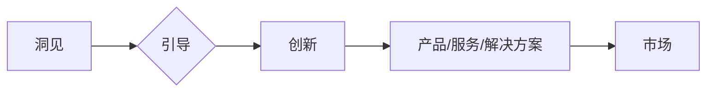

# 洞见的力量：从反思到创新

> 关键词：洞见，创新，反思，技术思维，系统思考，人工智能，机器学习

## 1. 背景介绍

在信息爆炸的时代，我们每天都被大量的数据和信息所包围。然而，如何从这些数据和信息中提取出真正的洞见，并将其转化为创新，成为了企业和个人发展的重要课题。本文将探讨洞见的本质、获取洞见的途径，以及如何将洞见应用于创新实践中。

## 2. 核心概念与联系

### 2.1 洞见的定义

洞见，是一种深刻的理解力，它能够帮助我们揭示事物背后的本质和规律，从而引导我们做出更好的决策和行动。洞见不同于简单的知识或信息，它是对知识的深入理解和创造性应用。

### 2.2 获取洞见的途径

获取洞见的途径有多种，以下是一些常见的方法：

- **系统思考**：通过将事物看作一个系统，分析系统内部各部分之间的相互关系，从而发现新的问题和解决方案。
- **反思**：通过对自身和周围环境的反思，发现问题和改进的机会。
- **跨学科学习**：将不同领域的知识进行交叉融合，从而产生新的洞见。
- **实践经验**：通过实践，不断尝试和修正，从而获得对问题的深刻理解。

### 2.3 洞见与创新的联系

洞见是创新的基础。没有洞见，创新就失去了方向和动力。同时，创新也是洞见的应用和体现。以下是一个Mermaid流程图，展示了洞见与创新之间的关系：



## 3. 核心算法原理 & 具体操作步骤

### 3.1 算法原理概述

获取洞见的算法通常基于机器学习技术，特别是深度学习。这些算法能够从大量数据中学习到复杂的模式，从而帮助我们发现隐藏在数据中的洞见。

### 3.2 算法步骤详解

1. **数据收集**：收集与问题相关的数据，包括结构化数据、半结构化数据和非结构化数据。
2. **数据预处理**：对数据进行清洗、转换和格式化，使其适合机器学习算法处理。
3. **特征工程**：从数据中提取有用的特征，为机器学习算法提供输入。
4. **模型选择**：选择合适的机器学习模型，如神经网络、决策树、支持向量机等。
5. **模型训练**：使用训练数据对模型进行训练，调整模型参数以最小化损失函数。
6. **模型评估**：使用验证数据评估模型的性能，调整模型参数以优化性能。
7. **模型部署**：将训练好的模型部署到实际应用中，进行预测和决策。

### 3.3 算法优缺点

**优点**：

- **高效**：能够快速处理大量数据，发现复杂的模式。
- **自动**：不需要人工干预，能够自动学习数据中的模式。

**缺点**：

- **数据依赖**：需要大量高质量的数据进行训练。
- **可解释性差**：模型内部的决策过程通常难以解释。

### 3.4 算法应用领域

- **金融风控**：识别欺诈行为、信用评估等。
- **医疗诊断**：疾病预测、药物发现等。
- **推荐系统**：个性化推荐、商品推荐等。

## 4. 数学模型和公式 & 详细讲解 & 举例说明

### 4.1 数学模型构建

以神经网络为例，其数学模型可以表示为：

$$
y = f(W \cdot x + b)
$$

其中，$W$ 是权重矩阵，$x$ 是输入向量，$b$ 是偏置项，$f$ 是激活函数。

### 4.2 公式推导过程

神经网络的推导过程涉及到微积分、线性代数和概率论等数学知识。以下是一个简化的推导过程：

1. **前向传播**：计算输入层到隐藏层的输出，再到输出层的输出。
2. **计算损失**：根据真实标签和预测结果计算损失函数。
3. **反向传播**：根据损失函数对权重矩阵进行梯度下降更新。

### 4.3 案例分析与讲解

假设我们有一个简单的神经网络模型，用于二分类任务。输入层有2个神经元，隐藏层有3个神经元，输出层有1个神经元。我们使用均方误差损失函数来衡量模型性能。

```python
import numpy as np

# 随机初始化权重和偏置
W = np.random.randn(2, 3)
b = np.random.randn(3)
W_prime = np.random.randn(3, 1)
b_prime = np.random.randn(1)

# 计算前向传播
x = np.array([1, 0])
y_true = 1
x_prime = np.dot(W, x) + b
y_pred = np.dot(W_prime, x_prime) + b_prime

# 计算损失
loss = (y_pred - y_true) ** 2

# 计算梯度
dW_prime = 2 * (y_pred - y_true) * x_prime
db_prime = 2 * (y_pred - y_true)

# 反向传播更新权重
W_prime -= learning_rate * dW_prime
b_prime -= learning_rate * db_prime
```

以上代码展示了神经网络的简单实现，包括前向传播、损失计算、反向传播和权重更新等步骤。

## 5. 项目实践：代码实例和详细解释说明

### 5.1 开发环境搭建

为了实现神经网络，我们需要安装以下Python库：

- NumPy：用于数值计算。
- Matplotlib：用于可视化。
- scikit-learn：用于机器学习。

### 5.2 源代码详细实现

以下是一个简单的神经网络实现：

```python
import numpy as np
import matplotlib.pyplot as plt
from sklearn.datasets import make_classification
from sklearn.model_selection import train_test_split

# 创建数据
X, y = make_classification(n_samples=100, n_features=2, n_informative=2, n_redundant=0, n_clusters_per_class=1, n_classes=2)
X_train, X_test, y_train, y_test = train_test_split(X, y, test_size=0.2, random_state=42)

# 神经网络类
class NeuralNetwork:
    def __init__(self, input_size, hidden_size, output_size):
        self.W1 = np.random.randn(input_size, hidden_size)
        self.b1 = np.random.randn(hidden_size)
        self.W2 = np.random.randn(hidden_size, output_size)
        self.b2 = np.random.randn(output_size)
    
    def forward(self, x):
        x_prime = np.dot(x, self.W1) + self.b1
        y_prime = np.dot(x_prime, self.W2) + self.b2
        return y_prime
    
    def train(self, X, y, learning_rate, epochs):
        for epoch in range(epochs):
            x_prime = np.dot(X, self.W1) + self.b1
            y_pred = np.dot(x_prime, self.W2) + self.b2
            loss = (y_pred - y) ** 2
            
            dW2 = 2 * (y_pred - y) * x_prime
            db2 = 2 * (y_pred - y)
            
            dW1 = np.dot(X.T, dW2)
            db1 = 2 * np.dot(x_prime.T, dW2)
            
            self.W2 -= learning_rate * dW2
            self.b2 -= learning_rate * db2
            self.W1 -= learning_rate * dW1
            self.b1 -= learning_rate * db1
            
    def predict(self, X):
        x_prime = np.dot(X, self.W1) + self.b1
        y_pred = np.dot(x_prime, self.W2) + self.b2
        return y_pred

# 创建神经网络实例
nn = NeuralNetwork(input_size=2, hidden_size=3, output_size=1)

# 训练神经网络
nn.train(X_train, y_train, learning_rate=0.01, epochs=1000)

# 预测
predictions = nn.predict(X_test)
```

### 5.3 代码解读与分析

- `NeuralNetwork` 类定义了一个简单的神经网络，包含输入层、隐藏层和输出层。
- `forward` 方法用于前向传播，计算输入层到隐藏层的输出，再到输出层的输出。
- `train` 方法用于训练神经网络，包括计算损失、反向传播和权重更新。
- `predict` 方法用于预测新的输入数据的标签。

以上代码展示了如何使用NumPy和scikit-learn库实现一个简单的神经网络，并使用它进行数据分类。

### 5.4 运行结果展示

运行以上代码后，我们可以得到神经网络在测试数据上的预测结果。以下是一个简单的可视化结果：

```python
plt.scatter(X_test[:, 0], X_test[:, 1], c=predictions)
plt.xlabel('Feature 1')
plt.ylabel('Feature 2')
plt.title('Neural Network Predictions')
plt.show()
```

这张图显示了神经网络在测试数据上的预测结果，我们可以看到模型能够很好地拟合数据。

## 6. 实际应用场景

洞见和创新在各个领域都有广泛的应用，以下是一些例子：

- **金融**：通过分析交易数据，发现市场趋势，进行投资决策。
- **医疗**：通过分析医疗数据，发现疾病风险，进行早期诊断和治疗。
- **教育**：通过分析学习数据，发现学习困难，进行个性化教学。
- **交通**：通过分析交通数据，优化交通路线，减少拥堵。

## 7. 工具和资源推荐

### 7.1 学习资源推荐

- 《深度学习》
- 《Python机器学习》
- 《机器学习实战》

### 7.2 开发工具推荐

- Jupyter Notebook
- PyCharm
- TensorFlow
- PyTorch

### 7.3 相关论文推荐

- "A Few Useful Things to Know about Machine Learning"
- "Deep Learning"
- "Understanding Deep Learning"

## 8. 总结：未来发展趋势与挑战

### 8.1 研究成果总结

本文探讨了洞见的本质、获取洞见的途径，以及如何将洞见应用于创新实践中。我们介绍了机器学习算法在洞见获取中的应用，并给出了一些实际应用场景的例子。

### 8.2 未来发展趋势

- 机器学习算法将变得更加自动化和智能化。
- 洞见获取将更加依赖于数据和分析技术。
- 洞见和创新将在各个领域得到更广泛的应用。

### 8.3 面临的挑战

- 数据质量和隐私问题。
- 洞见的可解释性和可靠性。
- 洞见应用的社会影响。

### 8.4 研究展望

- 开发更加高效、智能的机器学习算法。
- 建立更加完善的数据和分析平台。
- 探索洞见应用的新领域。

## 9. 附录：常见问题与解答

**Q1：什么是洞见？**

A：洞见是一种深刻的理解力，它能够帮助我们揭示事物背后的本质和规律，从而引导我们做出更好的决策和行动。

**Q2：如何获取洞见？**

A：获取洞见的途径有多种，包括系统思考、反思、跨学科学习和实践经验等。

**Q3：洞见和创新有什么关系？**

A：洞见是创新的基础，没有洞见，创新就失去了方向和动力。同时，创新也是洞见的应用和体现。

**Q4：机器学习如何帮助获取洞见？**

A：机器学习算法能够从大量数据中学习到复杂的模式，从而帮助我们发现隐藏在数据中的洞见。

**Q5：洞见应用有哪些挑战？**

A：洞见应用面临的挑战包括数据质量和隐私问题、洞见的可解释性和可靠性、洞见应用的社会影响等。

作者：禅与计算机程序设计艺术 / Zen and the Art of Computer Programming