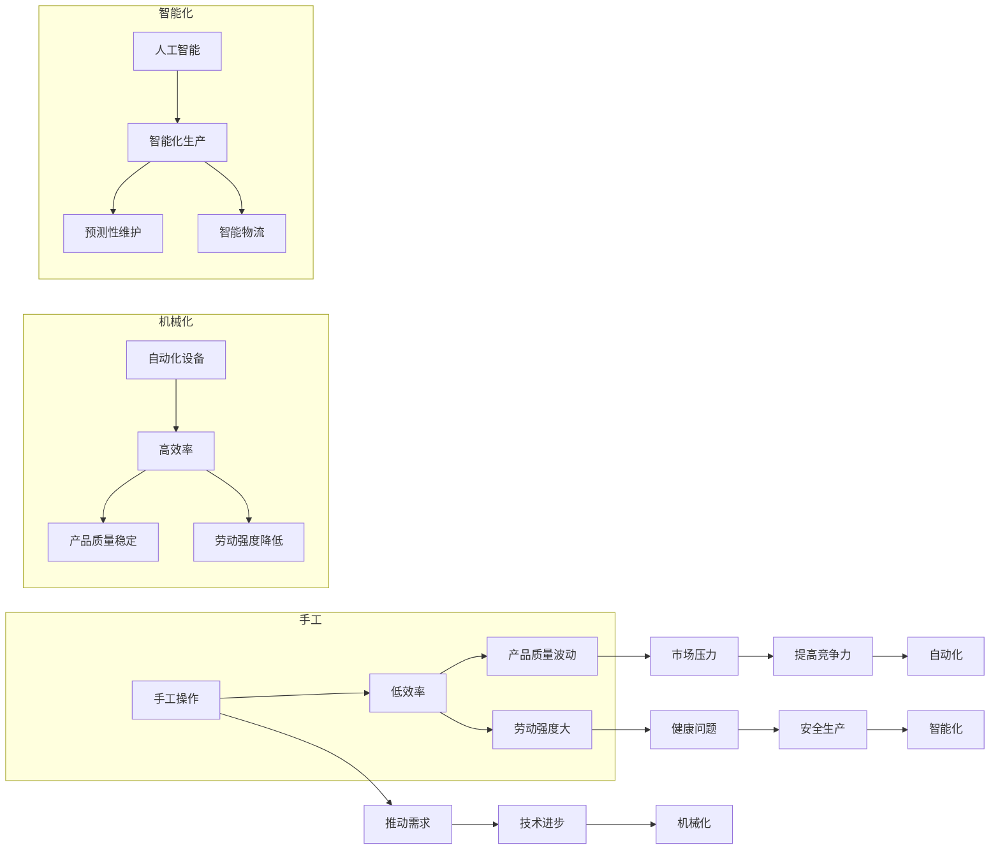

# 纺织业的手工与机械化转变

> 关键词：纺织业，机械化，自动化，智能制造，工业4.0，人工智能，物联网，数字化转型

## 1. 背景介绍

纺织业，作为古老的制造业之一，经历了从手工到机械化的漫长转变。从古老的梭织机到现代的高速自动化生产线，纺织业的技术进步不仅改变了生产方式，也深刻影响了全球经济和社会生活。本文将探讨纺织业从手工向机械化转变的历史、现状以及未来发展趋势。

### 1.1 问题的由来

在传统纺织业中，手工操作占主导地位，生产效率低下，产品质量难以保证，且劳动强度大。随着科技的进步，特别是工业革命以来，纺织业逐渐实现了机械化、自动化和智能化，生产效率大幅提升，产品质量稳定，劳动强度显著降低。

### 1.2 研究现状

近年来，随着工业4.0的兴起，纺织业正经历着新一轮的技术变革。物联网、人工智能、大数据等新一代信息技术被广泛应用到纺织业中，推动了纺织业的数字化转型和智能化升级。

### 1.3 研究意义

研究纺织业的手工与机械化转变，对于推动纺织业的可持续发展、提高生产效率、降低成本、提升产品质量具有重要意义。

### 1.4 本文结构

本文将分为以下几个部分：
- 第二部分，介绍纺织业手工与机械化转变的核心概念与联系。
- 第三部分，阐述纺织业机械化转变的核心算法原理和具体操作步骤。
- 第四部分，讲解数学模型和公式，并通过实例说明。
- 第五部分，提供项目实践案例，包括开发环境搭建、源代码实现、代码解读和运行结果展示。
- 第六部分，分析纺织业的实际应用场景。
- 第七部分，展望纺织业未来的发展趋势。
- 第八部分，总结研究成果，并探讨面临的挑战和未来研究方向。
- 第九部分，提供常见问题与解答。

## 2. 核心概念与联系

### 2.1 纺织业手工与机械化转变的Mermaid流程图



### 2.2 核心概念

- **手工操作**：指传统的纺织生产过程，主要依靠人工完成，效率低，质量波动大。
- **机械化**：指使用机械代替手工进行生产，提高效率，降低劳动强度。
- **自动化**：指使用自动化设备进行生产，实现生产过程的自动化控制。
- **智能化**：指利用人工智能、物联网等技术实现生产过程的智能化管理。
- **工业4.0**：指第四次工业革命，以智能化、网络化、个性化为特征，推动制造业向智能制造转型升级。

## 3. 核心算法原理 & 具体操作步骤

### 3.1 算法原理概述

纺织业机械化转变的核心算法主要包括：

- **自动化控制算法**：实现对机械设备的自动控制，提高生产效率。
- **机器视觉算法**：用于产品质量检测，确保产品质量。
- **人工智能算法**：用于生产过程的智能决策，如预测性维护、智能物流等。

### 3.2 算法步骤详解

#### 3.2.1 自动化控制算法

1. **传感器采集数据**：从生产设备中采集各种运行数据。
2. **数据预处理**：对采集到的数据进行清洗、去噪和特征提取。
3. **控制策略设计**：根据预设的控制目标，设计合适的控制策略。
4. **模型训练与优化**：利用机器学习算法对控制策略进行训练和优化。
5. **控制执行**：根据优化后的控制策略，自动控制生产设备。

#### 3.2.2 机器视觉算法

1. **图像采集**：从生产线上采集待检测产品的图像。
2. **图像预处理**：对采集到的图像进行预处理，如去噪、增强等。
3. **特征提取**：从预处理后的图像中提取关键特征。
4. **分类与检测**：利用深度学习算法对产品进行分类和检测。
5. **结果输出**：将检测结果输出，用于质量控制。

#### 3.2.3 人工智能算法

1. **数据收集与整理**：收集生产过程中的数据，并进行整理。
2. **模型选择与训练**：选择合适的机器学习模型，并进行训练。
3. **预测性维护**：利用模型预测设备故障，提前进行维护。
4. **智能物流**：利用模型优化物流路径，提高物流效率。

### 3.3 算法优缺点

#### 3.3.1 自动化控制算法

**优点**：提高生产效率，降低劳动强度，提高产品质量。

**缺点**：初期投资成本高，对技术人员要求较高。

#### 3.3.2 机器视觉算法

**优点**：提高产品质量，降低人工检测成本，提高检测速度。

**缺点**：算法复杂度高，对环境要求严格。

#### 3.3.3 人工智能算法

**优点**：提高生产过程的智能化水平，减少人为干预。

**缺点**：算法开发难度大，对数据质量要求高。

### 3.4 算法应用领域

以上算法在纺织业中的应用领域包括：

- **自动化生产**：如自动络筒机、自动纺纱机等。
- **产品质量检测**：如自动分拣机、缺陷检测系统等。
- **预测性维护**：如设备状态监测、故障预测等。
- **智能物流**：如自动仓储、无人搬运等。

## 4. 数学模型和公式 & 详细讲解 & 举例说明

### 4.1 数学模型构建

纺织业机械化转变的数学模型主要包括：

- **控制模型**：用于描述生产过程的动态特性。
- **机器视觉模型**：用于描述图像特征提取和分类的过程。
- **人工智能模型**：用于描述生产过程的智能决策过程。

### 4.2 公式推导过程

由于纺织业涉及的数学模型较为复杂，此处仅以控制模型为例进行说明。

#### 4.2.1 控制模型

假设纺织生产过程可以表示为一个线性时不变系统，其传递函数为：

$$
G(s) = \frac{Y(s)}{U(s)} = \frac{K}{s^2 + 2\zeta\omega_n s + \omega_n^2}
$$

其中 $Y(s)$ 为输出信号，$U(s)$ 为输入信号，$K$ 为放大系数，$\zeta$ 为阻尼比，$\omega_n$ 为自然频率。

#### 4.2.2 机器视觉模型

假设机器视觉系统用于检测产品上的缺陷，其模型可以表示为一个分类器，其输出为：

$$
P(y|x) = \frac{e^{\theta^T x}}{1 + e^{\theta^T x}}
$$

其中 $x$ 为输入特征，$y$ 为标签，$\theta$ 为模型的参数。

#### 4.2.3 人工智能模型

假设人工智能模型用于预测设备故障，其模型可以表示为一个回归器，其输出为：

$$
\hat{f}(x) = \theta_0 + \theta_1 x_1 + \theta_2 x_2 + \ldots + \theta_n x_n
$$

其中 $x$ 为输入特征，$\hat{f}(x)$ 为预测的故障值，$\theta$ 为模型的参数。

### 4.3 案例分析与讲解

#### 4.3.1 自动化控制算法案例

某纺织厂使用自动络筒机进行络筒操作，为提高生产效率，采用了自动化控制算法对络筒速度进行控制。通过采集络筒机的转速、张力等数据，利用控制模型进行控制，实现了络筒速度的稳定控制。

#### 4.3.2 机器视觉算法案例

某纺织厂使用机器视觉系统对纱线进行缺陷检测，通过采集纱线图像，利用机器视觉模型进行缺陷分类，实现了对纱线质量的自动检测。

#### 4.3.3 人工智能算法案例

某纺织厂使用人工智能模型进行设备故障预测，通过采集设备运行数据，利用人工智能模型进行预测，实现了对设备故障的提前预警。

## 5. 项目实践：代码实例和详细解释说明

### 5.1 开发环境搭建

由于纺织业机械化转变涉及到的技术和工具较多，此处以使用Python进行自动化控制算法的代码实现为例。

#### 5.1.1 环境要求

- Python 3.x
- NumPy
- SciPy
- Matplotlib

#### 5.1.2 安装库

```bash
pip install numpy scipy matplotlib
```

### 5.2 源代码详细实现

```python
import numpy as np
import matplotlib.pyplot as plt

# 控制模型参数
K = 100
zeta = 0.1
omega_n = 10

# 控制模型
def control_model(s):
    return K / (s**2 + 2*zeta*omega_n*s + omega_n**2)

# 控制输入信号
u = np.linspace(0, 2*np.pi, 100)

# 控制输出信号
y = control_model(1j*u) * u

# 绘制控制模型频域响应
plt.figure(figsize=(8, 6))
plt.plot(u, np.abs(y))
plt.xlabel('Frequency (rad/s)')
plt.ylabel('Magnitude')
plt.title('Control Model Frequency Response')
plt.grid(True)
plt.show()
```

### 5.3 代码解读与分析

以上代码实现了自动化控制算法的频域响应分析。通过定义控制模型参数，计算控制模型的频域响应，并绘制频域响应曲线，可以分析控制模型的稳定性和响应速度。

## 6. 实际应用场景

纺织业机械化转变在实际应用中涵盖了多个场景，以下列举几个典型应用：

- **自动化生产**：自动络筒机、自动纺纱机、自动织机等，提高生产效率，降低劳动强度。
- **产品质量检测**：自动分拣机、缺陷检测系统、智能视觉系统等，提高产品质量，减少人工检测成本。
- **预测性维护**：设备状态监测、故障预测系统等，实现设备的预防性维护，降低维修成本。
- **智能物流**：自动仓储、无人搬运、智能物流系统等，提高物流效率，降低物流成本。

## 7. 工具和资源推荐

### 7.1 学习资源推荐

- 《自动化控制原理与应用》
- 《机器视觉：原理与应用》
- 《深度学习：泛化与优化》
- 《工业4.0：智能化生产与智能制造》

### 7.2 开发工具推荐

- Python
- MATLAB
- LabVIEW
- ROS（机器人操作系统）

### 7.3 相关论文推荐

- "A Review of Machine Vision Applications in the Textile Industry" by A. M. M. Noordin et al.
- "Predictive Maintenance in Textile Machinery Using Machine Learning Techniques" by M. A. Khan et al.
- "Deep Learning-Based Quality Inspection for Textile Products" by S. K. Shrestha et al.

## 8. 总结：未来发展趋势与挑战

### 8.1 研究成果总结

本文对纺织业从手工向机械化转变的历史、现状和未来发展趋势进行了全面分析，介绍了纺织业机械化转变的核心概念、算法原理、数学模型和应用场景，并推荐了相关学习资源和工具。

### 8.2 未来发展趋势

- **智能化生产**：利用人工智能、物联网等技术实现生产过程的智能化管理，提高生产效率和质量。
- **个性化定制**：根据客户需求进行个性化定制，满足多样化市场需求。
- **可持续发展**：关注环保、节能、减排，推动纺织业的可持续发展。

### 8.3 面临的挑战

- **技术创新**：不断突破技术瓶颈，提升自动化、智能化水平。
- **人才培养**：培养具备跨学科知识和技能的复合型人才。
- **成本控制**：降低自动化、智能化设备成本，提高投资回报率。

### 8.4 研究展望

未来，纺织业机械化转变将继续深入，与其他领域的创新技术相结合，推动纺织业的转型升级，为人类社会创造更多价值。

## 9. 附录：常见问题与解答

**Q1：纺织业机械化转变会对就业造成影响吗？**

A：短期内，机械化转变可能会导致部分传统工作岗位的减少，但从长远来看，它将创造更多高技能、高附加值的工作岗位，促进就业结构优化。

**Q2：纺织业机械化转变需要哪些技术支撑？**

A：纺织业机械化转变需要自动化、智能化、物联网、大数据、云计算等新一代信息技术的支撑。

**Q3：纺织业机械化转变有哪些经济效益？**

A：纺织业机械化转变可以显著提高生产效率，降低生产成本，提高产品质量，增强企业竞争力。

**Q4：纺织业机械化转变有哪些社会效益？**

A：纺织业机械化转变可以改善生产环境，提高劳动生产率，促进产业升级，推动社会经济发展。

**Q5：如何推动纺织业机械化转变？**

A：政府、企业、科研机构应共同努力，加大科技创新力度，加强人才培养，完善政策支持，推动纺织业机械化转变。

---

作者：禅与计算机程序设计艺术 / Zen and the Art of Computer Programming