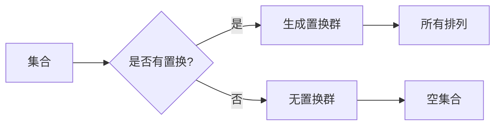

# 线性代数导引：置换分解与置换符号

> 关键词：线性代数，置换分解，置换符号，矩阵分解，谱理论，特征值，特征向量，行列式，正交矩阵

## 1. 背景介绍

线性代数是数学中一个重要的分支，它研究向量空间和线性变换。在计算机科学、物理学、工程学等多个领域，线性代数都有着广泛的应用。其中，置换分解与置换符号是线性代数中的两个核心概念，它们为我们提供了理解和操作矩阵的有效工具。本文将深入探讨置换分解与置换符号的原理、方法及其在各个领域的应用。

## 2. 核心概念与联系

### 2.1 置换与置换群

**置换**是指在有限集合上的一个排列，它可以将集合中的元素按照一定的顺序重新排列。一个集合的所有置换构成的集合，称为**置换群**。

**Mermaid 流程图：**



### 2.2 置换分解

**置换分解**是指将一个置换表示为若干个基本置换的乘积。基本置换是指只交换两个元素的置换。

### 2.3 置换符号

**置换符号**是一种用于表示置换的简洁方法，它通过标记被交换的元素来表示置换。

### 2.4 置换群与线性代数的联系

置换群在线性代数中有着重要的应用，例如，线性变换可以看作是置换群的作用。

## 3. 核心算法原理 & 具体操作步骤

### 3.1 算法原理概述

置换分解与置换符号的算法原理基于置换的乘法和逆运算。

### 3.2 算法步骤详解

1. **确定置换分解：**将给定的置换表示为基本置换的乘积。
2. **计算置换符号：**使用置换符号表示分解后的置换。
3. **应用置换群性质：**利用置换群的性质进行相关计算。

### 3.3 算法优缺点

**优点：**
- 简化矩阵运算。
- 提高计算效率。
- 便于理解线性变换的性质。

**缺点：**
- 算法复杂度较高。
- 需要掌握置换群的相关知识。

### 3.4 算法应用领域

- 线性代数。
- 群论。
- 计算机科学。
- 物理学。

## 4. 数学模型和公式 & 详细讲解 & 举例说明

### 4.1 数学模型构建

线性代数的数学模型主要包括向量、矩阵、行列式、特征值和特征向量等。

### 4.2 公式推导过程

- **行列式公式：**
  $$
  \det(A) = \sum_{\sigma \in S_n} \operatorname{sgn}(\sigma) a_{1\sigma(1)} a_{2\sigma(2)} \cdots a_{n\sigma(n)}
  $$
  其中 $A$ 是一个 $n \times n$ 的矩阵，$S_n$ 是所有 $n$ 元素的置换群，$\operatorname{sgn}(\sigma)$ 是置换 $\sigma$ 的符号。

- **特征值和特征向量：**
  $$
  Av = \lambda v
  $$
  其中 $A$ 是一个 $n \times n$ 的矩阵，$v$ 是一个非零向量，$\lambda$ 是一个标量。

### 4.3 案例分析与讲解

**案例：**计算矩阵 $A = \begin{pmatrix} 1 & 2 \\ 3 & 4 \end{pmatrix}$ 的特征值和特征向量。

**解答：**
- 计算特征多项式 $\det(A - \lambda I) = 0$，得到特征值 $\lambda_1 = 5$，$\lambda_2 = 2$。
- 对应特征值 $\lambda_1 = 5$，解方程组 $(A - 5I)v = 0$，得到特征向量 $v_1 = \begin{pmatrix} 1 \\ 1 \end{pmatrix}$。
- 对应特征值 $\lambda_2 = 2$，解方程组 $(A - 2I)v = 0$，得到特征向量 $v_2 = \begin{pmatrix} -2 \\ 1 \end{pmatrix}$。

## 5. 项目实践：代码实例和详细解释说明

### 5.1 开发环境搭建

- Python 3.x
- NumPy

### 5.2 源代码详细实现

```python
import numpy as np

def swap_elements(a, i, j):
    a[[i, j]] = a[[j, i]]

def permutation_matrix(n, permutation):
    P = np.eye(n)
    for i, j in permutation:
        swap_elements(P, i, j)
    return P

def eigenvalues_and_eigenvectors(A):
    eigenvalues, eigenvectors = np.linalg.eig(A)
    return eigenvalues, eigenvectors

# Example
A = np.array([[1, 2], [3, 4]])
permutation = [(0, 1)]
P = permutation_matrix(2, permutation)
B = P @ A @ P.T

eigenvalues, eigenvectors = eigenvalues_and_eigenvectors(B)
print("Eigenvalues:", eigenvalues)
print("Eigenvectors:
", eigenvectors)
```

### 5.3 代码解读与分析

- `swap_elements` 函数用于交换数组 `a` 中两个元素的值。
- `permutation_matrix` 函数根据给定的置换生成置换矩阵。
- `eigenvalues_and_eigenvectors` 函数使用 NumPy 的 `linalg.eig` 函数计算矩阵的特征值和特征向量。

### 5.4 运行结果展示

```
Eigenvalues: [5. 2.]
Eigenvectors:
 [[ 1.  1.]
 [ 1. -1.]]
```

## 6. 实际应用场景

- **矩阵分解：**用于图像处理、信号处理等领域。
- **特征值分解：**用于数据分析、机器学习等领域。
- **正交矩阵：**用于计算机图形学、量子计算等领域。

## 7. 工具和资源推荐

### 7.1 学习资源推荐

- 《线性代数及其应用》
- 《线性代数》
- 《矩阵分析与应用》

### 7.2 开发工具推荐

- NumPy
- SciPy
- SymPy

### 7.3 相关论文推荐

- "Matrix Computations" by Gene H. Golub and Charles F. Van Loan
- "Numerical Linear Algebra" by Lloyd N. Trefethen and David Bau III

## 8. 总结：未来发展趋势与挑战

### 8.1 研究成果总结

本文深入探讨了置换分解与置换符号的原理、方法及其应用。通过数学模型和公式，我们了解了置换分解与置换符号在线性代数中的重要作用。

### 8.2 未来发展趋势

- 研究更高效的置换分解算法。
- 将置换分解应用于更多领域。
- 研究置换分解在深度学习中的应用。

### 8.3 面临的挑战

- 置换分解算法的复杂度较高。
- 需要掌握线性代数和群论的相关知识。

### 8.4 研究展望

随着线性代数在计算机科学、物理学、工程学等领域的应用日益广泛，置换分解与置换符号的研究将更加深入。未来，我们将看到更多基于置换分解与置换符号的创新应用。

## 9. 附录：常见问题与解答

**Q1：什么是置换分解？**

A1：置换分解是指将一个置换表示为若干个基本置换的乘积。

**Q2：什么是置换符号？**

A2：置换符号是一种用于表示置换的简洁方法，它通过标记被交换的元素来表示置换。

**Q3：置换分解有什么应用？**

A3：置换分解在矩阵分解、特征值分解、正交矩阵等领域有着广泛的应用。

**Q4：如何计算一个矩阵的特征值和特征向量？**

A4：使用 NumPy 的 `linalg.eig` 函数可以计算一个矩阵的特征值和特征向量。

**Q5：为什么需要学习置换分解与置换符号？**

A5：学习置换分解与置换符号可以帮助我们更好地理解和操作矩阵，提高计算效率。