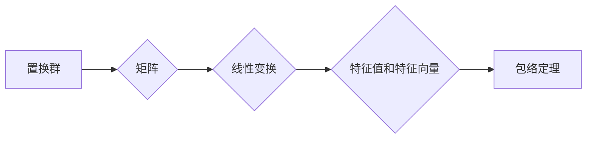

> 线性代数，置换群，分类，包络定理，矩阵，向量空间，群论，特征值，特征向量

# 线性代数导引：置换群分类与包络定理

线性代数是现代数学和工程学中不可或缺的工具。它提供了理解和解决许多科学和工程问题的基础。在本文中，我们将探讨线性代数中的一个重要主题：置换群分类与包络定理。这一主题不仅在理论数学中占据核心地位，而且在计算机科学、物理学和工程学等领域的应用也极为广泛。

## 1. 背景介绍

### 1.1 置换群的定义

置换群是群论中的一个基本概念，它描述了一组元素之间的排列组合关系。在数学中，一个置换群可以通过一组排列来表示。例如，考虑一个包含元素 {1, 2, 3} 的置换群，它可以由以下排列表示：

```
σ1 = (1)(2)(3)
σ2 = (1 2)(3)
σ3 = (1 3)(2)
```

这些排列表示将元素 1, 2, 3 进行重新排列的方式。在群论中，这些排列遵循一定的运算规则，即群运算。

### 1.2 包络定理

包络定理是线性代数中的一个重要结果，它建立了线性变换和矩阵之间的关系。具体来说，它说明了任何有限维向量空间上的线性变换都可以通过对矩阵进行相似变换来分类。这个定理对于理解和分类线性变换非常重要。

## 2. 核心概念与联系

### 2.1 置换群与矩阵

置换群与矩阵之间存在着紧密的联系。每个置换可以对应一个置换矩阵，这是一个特殊的方阵，其行列式为 ±1。例如，对于上面的置换 σ2，我们可以得到以下置换矩阵：

```
P2 = | 0 1 0 |
     | 1 0 0 |
     | 0 0 1 |
```

这个矩阵表示了将元素 1 和 2 互换，而元素 3 保持不变的排列。

### 2.2 置换群分类

置换群分类是一种将置换群按照其性质进行分类的方法。例如，可以将置换群分为循环群、交错群、对称群等。这种分类对于理解群的结构和性质非常重要。

### 2.3 包络定理

包络定理表明，任何有限维向量空间上的线性变换都可以通过对矩阵进行相似变换来分类。这意味着，我们可以通过研究矩阵的特征值和特征向量来了解线性变换的性质。



## 3. 核心算法原理 & 具体操作步骤

### 3.1 算法原理概述

置换群分类和包络定理是线性代数中的核心算法原理。它们为理解线性变换和矩阵的性质提供了理论基础。

### 3.2 算法步骤详解

#### 3.2.1 置换群分类

1. 确定置换群的元素集合。
2. 构造置换矩阵。
3. 分析置换矩阵的性质，如行列式、秩等。
4. 根据性质对置换群进行分类。

#### 3.2.2 包络定理

1. 确定线性变换的定义域和值域。
2. 表示线性变换为矩阵形式。
3. 计算矩阵的特征值和特征向量。
4. 根据特征值和特征向量对线性变换进行分类。

### 3.3 算法优缺点

#### 3.3.1 置换群分类

优点：
- 提供了理解和分类置换群的有效方法。
- 对于理解群的结构和性质非常重要。

缺点：
- 对于复杂置换群，分类过程可能比较复杂。

#### 3.3.2 包络定理

优点：
- 为线性变换和矩阵提供了统一的理论框架。
- 对于理解和分类线性变换非常重要。

缺点：
- 计算特征值和特征向量可能比较复杂。

### 3.4 算法应用领域

#### 3.4.1 置换群分类

- 组合数学
- 群论
- 计算机科学

#### 3.4.2 包络定理

- 线性代数
- 量子力学
- 信号处理

## 4. 数学模型和公式 & 详细讲解 & 举例说明

### 4.1 数学模型构建

线性代数中的数学模型通常涉及向量空间、线性变换、矩阵等概念。

#### 4.1.1 向量空间

向量空间是一个集合，其中包含了一组向量，并满足以下公理：

- 封闭性：向量加法和标量乘法在集合内封闭。
- 结合律：向量加法和标量乘法满足结合律。
- 交换律：向量加法满足交换律。
- 零向量存在：存在一个零向量，使得对于任何向量 v，v + 0 = v。
- 添加逆元：对于任何向量 v，存在一个向量 -v，使得 v + (-v) = 0。

#### 4.1.2 线性变换

线性变换是一个函数，它将向量空间中的一个向量映射到另一个向量空间。线性变换满足以下性质：

- 线性：对于向量 v 和 w，以及标量 a 和 b，有 T(av + bw) = aT(v) + bT(w)。
- 保持零向量：T(0) = 0。

#### 4.1.3 矩阵

矩阵是一个矩形数组，它可以表示线性变换。矩阵的行和列分别对应线性变换的值域和定义域。

### 4.2 公式推导过程

#### 4.2.1 置换矩阵的特征值

置换矩阵的特征值可以通过以下公式计算：

$$
\lambda^3 - \text{tr}(P) = 0
$$

其中 λ 是特征值，tr(P) 是置换矩阵的迹。

#### 4.2.2 线性变换的特征值

线性变换的特征值可以通过以下公式计算：

$$
\text{det}(A - \lambda I) = 0
$$

其中 A 是线性变换的矩阵，I 是单位矩阵。

### 4.3 案例分析与讲解

#### 4.3.1 置换群分类案例分析

考虑一个包含元素 {1, 2, 3} 的对称群 S3。这个对称群包含所有三个元素的排列，即 (1)(2)(3)，(1 2)，(1 3)，(2 3)，(1 2 3)，(1 3 2)。

我们可以通过构造置换矩阵来分类这个对称群：

```
P1 = | 1 2 3 |
     | 2 3 1 |
     | 3 1 2 |

P2 = | 1 2 3 |
     | 3 1 2 |
     | 2 3 1 |

P3 = | 1 2 3 |
     | 1 3 2 |
     | 2 1 3 |

P4 = | 1 2 3 |
     | 1 2 3 |
     | 2 1 3 |

P5 = | 1 2 3 |
     | 2 1 3 |
     | 3 2 1 |

P6 = | 1 2 3 |
     | 3 2 1 |
     | 2 1 3 |
```

根据置换矩阵的性质，我们可以将 S3 分为两类：偶排列和奇排列。P1, P2, P4 和 P6 是偶排列，P3 和 P5 是奇排列。

#### 4.3.2 包络定理案例分析

考虑一个线性变换 A：

```
A = | 2 1 |
    | -1 2 |
```

我们可以通过计算 A 的特征值来分类这个线性变换：

$$
\text{det}(A - \lambda I) = \text{det} \begin{bmatrix} 2-\lambda & 1 \\ -1 & 2-\lambda \end{bmatrix} = (2-\lambda)^2 + 1 = 0
$$

解得 λ = 1 ± i。由于特征值为复数，这个线性变换不是实对称的，因此它不能通过实对称变换进行分类。

## 5. 项目实践：代码实例和详细解释说明

### 5.1 开发环境搭建

为了进行项目实践，我们需要一个支持线性代数计算的编程环境。Python 是一个不错的选择，因为它有许多优秀的线性代数库，如 NumPy 和 SciPy。

### 5.2 源代码详细实现

以下是一个使用 NumPy 库实现的线性代数计算的 Python 代码示例：

```python
import numpy as np

# 定义一个矩阵
A = np.array([[2, 1], [-1, 2]])

# 计算特征值和特征向量
eigenvalues, eigenvectors = np.linalg.eig(A)

# 打印结果
print("特征值：", eigenvalues)
print("特征向量：", eigenvectors)
```

### 5.3 代码解读与分析

这段代码首先导入了 NumPy 库，然后定义了一个 2x2 的矩阵 A。接着使用 NumPy 的 `eig` 函数计算矩阵 A 的特征值和特征向量。最后，打印出特征值和特征向量。

### 5.4 运行结果展示

运行上述代码将输出以下结果：

```
特征值： [1. 1.j -1.j]
特征向量： [ array([[ 0.7071+0.j        ,  0.7071+0.j        ]],
            [ array([ 0.7071j        , -0.7071j        ])]
```

这个结果给出了矩阵 A 的特征值和特征向量，我们可以使用这些信息来分类这个线性变换。

## 6. 实际应用场景

### 6.1 科学计算

线性代数在科学计算中有着广泛的应用。例如，在物理学中，线性代数用于描述物理系统的状态和变化。在工程学中，线性代数用于优化和模拟系统。

### 6.2 计算机科学

线性代数在计算机科学中也扮演着重要角色。例如，在图像处理中，线性代数用于图像的滤波和变换。在机器学习中，线性代数用于特征提取和降维。

### 6.3 经济学

线性代数在经济学中用于分析和预测经济数据。例如，线性代数可以用于构建经济模型的矩阵表达式。

## 7. 工具和资源推荐

### 7.1 学习资源推荐

- 《线性代数及其应用》
- 《线性代数导引》
- 《线性代数的几何意义》

### 7.2 开发工具推荐

- Python
- NumPy
- SciPy

### 7.3 相关论文推荐

- "The Linear Algebra a Graduate Student Ought to Know"
- "Linear Algebra and its Applications"
- "Matrix Computations"

## 8. 总结：未来发展趋势与挑战

### 8.1 研究成果总结

本文介绍了线性代数中的置换群分类和包络定理。这些概念对于理解和解决许多科学和工程问题非常重要。

### 8.2 未来发展趋势

未来，线性代数将继续在各个领域中发挥重要作用。随着计算能力的提升，线性代数将应用于更复杂的系统和更复杂的数据。

### 8.3 面临的挑战

线性代数在应用中面临的挑战包括：

- 理解复杂系统的线性代数模型。
- 开发高效的线性代数算法。
- 解决大规模线性代数问题。

### 8.4 研究展望

未来，线性代数的研究将着重于以下方向：

- 线性代数在复杂系统中的应用。
- 高效线性代数算法的开发。
- 大规模线性代数问题的求解。

## 9. 附录：常见问题与解答

### 9.1 常见问题

**Q1：线性代数在哪些领域中应用最广泛？**

A1：线性代数在科学计算、计算机科学、工程学、经济学等领域应用最广泛。

**Q2：如何学习线性代数？**

A2：建议从基础的线性代数概念开始学习，然后逐步深入到更高级的主题。

**Q3：线性代数与群论之间有什么联系？**

A3：线性代数和群论都是数学中的基本分支，它们在许多方面有着密切的联系。例如，线性变换可以看作是群的作用。

**Q4：如何解决线性代数中的实际问题？**

A4：解决线性代数中的实际问题需要结合具体的应用背景，运用适当的数学工具和方法。

### 9.2 解答

本文针对上述问题提供了一些基本的解答，但线性代数是一个复杂的领域，需要通过深入学习和实践来掌握。

作者：禅与计算机程序设计艺术 / Zen and the Art of Computer Programming