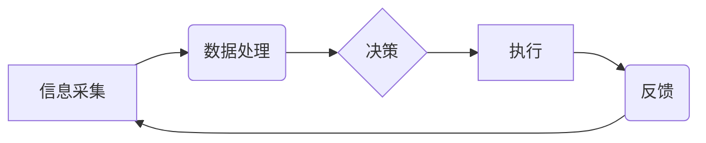

# 自动化技术的未来发展方向

> 关键词：自动化，人工智能，工业4.0，机器学习，边缘计算，物联网，智能制造

## 1. 背景介绍

自动化技术是现代工业生产和社会生活的重要组成部分，它通过使用机器和控制系统替代或辅助人类完成重复性、危险或高精度的工作，极大地提高了生产效率和生活质量。随着信息技术的飞速发展，尤其是人工智能、物联网、大数据等技术的融合，自动化技术正在经历一场深刻的变革。本文将探讨自动化技术的未来发展方向，分析其面临的机遇与挑战。

### 1.1 自动化技术的发展历程

自动化技术的发展经历了以下几个阶段：

1. **机械自动化**：通过简单的机械装置，如齿轮、杠杆和弹簧等，实现简单的自动化工作。
2. **电气自动化**：引入电子元件和控制系统，实现更复杂的自动化流程。
3. **计算机自动化**：计算机技术的应用使得自动化系统更加智能化，能够处理更复杂的数据和信息。
4. **信息化自动化**：互联网、大数据和云计算的兴起，使得自动化系统能够实时收集和处理海量数据，实现更加智能化的决策。
5. **智能化自动化**：人工智能技术的应用，使得自动化系统能够学习和适应环境，实现更加智能化的操作。

### 1.2 自动化技术的现状

目前，自动化技术已经在工业、医疗、交通、家居等多个领域得到广泛应用。工业自动化是自动化技术最为典型的应用领域，通过自动化生产线，企业能够实现生产过程的优化和效率的提升。

## 2. 核心概念与联系

### 2.1 核心概念原理和架构的 Mermaid 流程图



### 2.2 核心概念解释

- **信息采集**：通过传感器、摄像头等设备收集环境数据。
- **数据处理**：对采集到的数据进行处理和分析，提取有价值的信息。
- **决策**：根据处理后的信息，自动化系统做出决策。
- **执行**：执行决策结果，如控制机器人执行特定动作。
- **反馈**：执行结果反馈给系统，用于调整后续的决策和执行。

这些概念构成了自动化系统的基本架构，也是未来自动化技术发展的基础。

## 3. 核心算法原理 & 具体操作步骤

### 3.1 算法原理概述

自动化技术的核心算法主要包括：

- **控制算法**：如PID控制、模糊控制等，用于控制机器人的运动和设备的运行。
- **机器学习算法**：如决策树、支持向量机、神经网络等，用于数据分析和决策。
- **优化算法**：如遗传算法、粒子群算法等，用于优化自动化系统的性能。

### 3.2 算法步骤详解

1. **信息采集**：使用传感器、摄像头等设备收集环境数据。
2. **数据处理**：对采集到的数据进行预处理，如滤波、特征提取等。
3. **决策**：根据处理后的数据，利用机器学习算法进行决策。
4. **执行**：根据决策结果，控制机器人或设备执行特定动作。
5. **反馈**：收集执行结果，用于评估决策效果和调整后续操作。

### 3.3 算法优缺点

- **控制算法**：优点是算法简单，易于实现；缺点是适应性差，难以应对复杂多变的环境。
- **机器学习算法**：优点是适应性强，能够处理复杂问题；缺点是需要大量标注数据，且算法复杂度高。
- **优化算法**：优点是能够优化系统性能；缺点是计算复杂度高，需要较长的计算时间。

### 3.4 算法应用领域

- **控制算法**：应用于工业自动化、智能家居等领域。
- **机器学习算法**：应用于图像识别、语音识别、自然语言处理等领域。
- **优化算法**：应用于物流优化、资源调度等领域。

## 4. 数学模型和公式 & 详细讲解 & 举例说明

### 4.1 数学模型构建

自动化系统的数学模型主要包括：

- **状态空间模型**：描述系统的状态变化规律。
- **控制对象模型**：描述控制对象的行为特征。
- **环境模型**：描述环境对系统的影响。

### 4.2 公式推导过程

以状态空间模型为例，其数学表达式为：

$$
\begin{cases}
x_{k+1} = A x_k + B u_k \\
y_k = C x_k + D u_k
\end{cases}
$$

其中，$x_k$ 为系统状态向量，$u_k$ 为控制输入，$y_k$ 为输出，$A, B, C, D$ 为系统矩阵。

### 4.3 案例分析与讲解

以PID控制算法为例，其数学模型为：

$$
u_k = K_p e_k + K_i \int_{0}^{k} e_k(t) dt + K_d \frac{de_k}{dt}
$$

其中，$e_k$ 为误差，$K_p, K_i, K_d$ 为PID参数。

PID控制算法能够根据误差对控制输入进行调整，从而实现对系统的稳定控制。

## 5. 项目实践：代码实例和详细解释说明

### 5.1 开发环境搭建

由于篇幅限制，这里不提供具体的开发环境搭建步骤。通常需要以下软件和工具：

- **编程语言**：Python、C++等。
- **开发框架**：PyTorch、TensorFlow等。
- **控制算法库**：Control System Toolbox等。

### 5.2 源代码详细实现

以下是一个简单的PID控制算法的Python实现示例：

```python
import numpy as np

class PIDController:
    def __init__(self, Kp, Ki, Kd):
        self.Kp = Kp
        self.Ki = Ki
        self.Kd = Kd
        self.integral = 0
        self.last_error = 0

    def update(self, setpoint, measured_value):
        error = setpoint - measured_value
        self.integral += error
        derivative = error - self.last_error
        output = self.Kp * error + self.Ki * self.integral + self.Kd * derivative
        self.last_error = error
        return output

# 创建PID控制器实例
pid = PIDController(Kp=1.0, Ki=0.1, Kd=0.05)

# 模拟控制过程
setpoint = 100
measured_value = 95
output = pid.update(setpoint, measured_value)
print(output)
```

### 5.3 代码解读与分析

- `PIDController` 类：定义PID控制器，包括比例、积分和微分参数。
- `update` 方法：根据当前误差、积分和微分计算控制输出。

### 5.4 运行结果展示

运行上述代码，将输出控制输出值，用于控制系统。

## 6. 实际应用场景

自动化技术在各个领域都有广泛的应用，以下列举一些典型的应用场景：

- **工业自动化**：生产线自动化、机器人自动化、智能工厂等。
- **医疗自动化**：手术机器人、医疗影像诊断、健康管理等。
- **交通自动化**：无人驾驶、智能交通系统、公共交通管理等。
- **家居自动化**：智能家居、智能家电等。

## 7. 工具和资源推荐

### 7.1 学习资源推荐

- **书籍**：《自动化控制系统》、《机器学习》、《深度学习》等。
- **在线课程**：Coursera、edX、Udacity等平台上的自动化、机器学习、人工智能相关课程。
- **社区**：Stack Overflow、GitHub等。

### 7.2 开发工具推荐

- **编程语言**：Python、C++、Java等。
- **开发框架**：PyTorch、TensorFlow、ROS（Robot Operating System）等。
- **控制算法库**：Control System Toolbox、DSP Builder等。

### 7.3 相关论文推荐

- **控制算法**：《Modern Control Engineering》（现代控制工程）、《Robotics: Modelling, Planning and Control》（机器人：建模、规划和控制）等。
- **机器学习**：《Pattern Recognition and Machine Learning》（模式识别与机器学习）、《Deep Learning》（深度学习）等。

## 8. 总结：未来发展趋势与挑战

### 8.1 研究成果总结

自动化技术经过几十年的发展，已经取得了显著的成果。随着人工智能、物联网等技术的融合，自动化技术正在向更加智能化、高效化、个性化的方向发展。

### 8.2 未来发展趋势

- **智能化**：人工智能技术的应用将使得自动化系统更加智能化，能够自主学习和适应环境。
- **高效化**：边缘计算、云计算等技术的融合将使得自动化系统更加高效。
- **个性化**：自动化系统将根据用户需求提供个性化服务。

### 8.3 面临的挑战

- **数据安全**：自动化系统需要收集和处理大量数据，如何保证数据安全是一个重要挑战。
- **技术融合**：不同技术的融合需要解决兼容性问题。
- **伦理问题**：自动化技术的发展也引发了一些伦理问题，如失业、隐私等。

### 8.4 研究展望

未来，自动化技术将朝着更加智能化、高效化、个性化的方向发展。随着人工智能、物联网、大数据等技术的不断进步，自动化技术将在各个领域发挥更加重要的作用。

## 9. 附录：常见问题与解答

**Q1：自动化技术是什么？**

A：自动化技术是指使用机器和控制系统替代或辅助人类完成重复性、危险或高精度的工作，提高生产效率和生活质量。

**Q2：自动化技术有哪些应用场景？**

A：自动化技术的应用场景非常广泛，包括工业自动化、医疗自动化、交通自动化、家居自动化等。

**Q3：什么是工业4.0？**

A：工业4.0是指利用信息化和智能化技术，将制造业从传统制造业转变为智能化制造业，实现生产过程的自动化、智能化和个性化。

**Q4：什么是边缘计算？**

A：边缘计算是指将计算任务从云端迁移到网络边缘，如物联网设备、传感器等，以实现更快的响应速度和更高的数据处理效率。

**Q5：自动化技术有哪些挑战？**

A：自动化技术面临的挑战包括数据安全、技术融合、伦理问题等。

---

作者：禅与计算机程序设计艺术 / Zen and the Art of Computer Programming