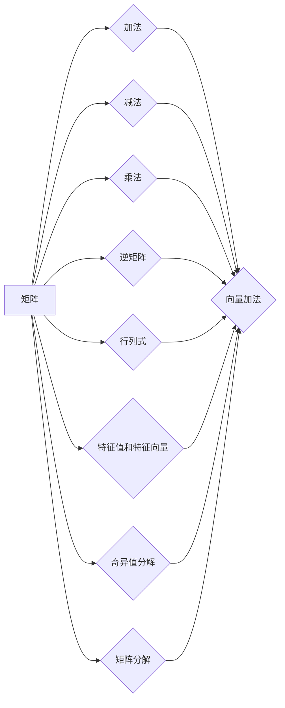

# 矩阵理论与应用：一般矩阵的函数

> 关键词：矩阵理论，线性代数，函数，应用，特征值，特征向量，矩阵分解，数值计算

## 1. 背景介绍

矩阵是线性代数中的基本概念，它广泛应用于数学、物理学、工程学、经济学等领域。矩阵作为一种数据结构和运算工具，能够有效地描述线性关系和变换。在人工智能、机器学习等领域，矩阵理论更是不可或缺的基础。本文将深入探讨一般矩阵的函数理论，包括其概念、性质、应用以及数值计算方法。

## 2. 核心概念与联系

### 2.1 核心概念原理

矩阵是一种矩形数组，由若干行和列组成，通常用大写字母表示，如 $A$。矩阵的每个元素用小写字母表示，如 $a_{ij}$，其中 $i$ 表示行号，$j$ 表示列号。矩阵的基本操作包括加法、减法、乘法等。

#### Mermaid 流程图



### 2.2 关联概念

- **向量**：矩阵的列向量或行向量。
- **行向量**：矩阵的一行，包含多个元素。
- **列向量**：矩阵的一列，包含多个元素。
- **行列式**：一个数，表示矩阵的可逆性和面积/体积。
- **逆矩阵**：一个矩阵，使得它与原矩阵相乘后结果为单位矩阵。
- **特征值和特征向量**：满足线性方程 $Ax = \lambda x$ 的 $\lambda$ 和 $x$。
- **奇异值分解**：将矩阵分解为三个矩阵的乘积，适用于解决线性方程组、数据压缩等问题。
- **矩阵分解**：将矩阵分解为多个矩阵的乘积，适用于数据降维、矩阵逼近等问题。

## 3. 核心算法原理 & 具体操作步骤

### 3.1 算法原理概述

矩阵函数是指在矩阵空间上定义的函数，它可以应用于矩阵的每个元素。常见的矩阵函数包括矩阵的幂、矩阵的指数、矩阵的逆、矩阵的行列式等。

### 3.2 算法步骤详解

#### 矩阵的幂

计算矩阵 $A$ 的 $n$ 次幂，可以使用以下方法：

1. **分解法**：如果矩阵 $A$ 可以分解为 $A = LU$，则 $A^n = LU \cdot LU \cdot \ldots \cdot LU$。
2. **迭代法**：逐步计算 $A^2, A^3, \ldots$，直到 $A^n$。

#### 矩阵的逆

计算矩阵 $A$ 的逆，可以使用以下方法：

1. **高斯消元法**：将矩阵 $A$ 和单位矩阵 $I$ 放在一起进行行变换，使得 $A$ 变为单位矩阵，而 $I$ 变为 $A$ 的逆。
2. **特征值法**：计算矩阵 $A$ 的特征值和特征向量，然后使用特征值和特征向量构造 $A$ 的逆。

#### 矩阵的行列式

计算矩阵 $A$ 的行列式，可以使用以下方法：

1. **拉普拉斯展开**：展开矩阵 $A$ 的任意一行或列，将行列式分解为若干个较小的行列式的和。
2. **高斯消元法**：通过行变换将矩阵 $A$ 化为上三角矩阵或下三角矩阵，然后计算对角线元素的乘积。

### 3.3 算法优缺点

#### 矩阵的幂

- **优点**：计算简单，易于理解。
- **缺点**：对于大型矩阵，计算效率较低。

#### 矩阵的逆

- **优点**：逆矩阵在许多线性代数问题中都有应用，如解线性方程组。
- **缺点**：计算复杂，对于奇异矩阵或病态矩阵，可能无法计算逆矩阵。

#### 矩阵的行列式

- **优点**：行列式可以用来判断矩阵的可逆性，计算矩阵的体积和面积。
- **缺点**：计算复杂，对于大型矩阵，计算效率较低。

### 3.4 算法应用领域

矩阵函数在各个领域都有广泛的应用，以下列举一些典型应用：

- **物理学**：描述物理量的变化，如速度、加速度、力等。
- **工程学**：求解线性方程组，优化设计，控制理论等。
- **经济学**：线性规划，经济模型等。
- **人工智能**：机器学习中的特征提取，神经网络中的权重更新等。

## 4. 数学模型和公式 & 详细讲解 & 举例说明

### 4.1 数学模型构建

矩阵函数的一般形式为 $f(A)$，其中 $f$ 为一个从矩阵空间到标量空间的函数，$A$ 为矩阵。

### 4.2 公式推导过程

以下是一些常见的矩阵函数的公式：

- 矩阵的幂：$A^n = A \cdot A \cdot \ldots \cdot A$ （$n$ 次乘法）
- 矩阵的逆：$A^{-1} = A^{T} \cdot (A \cdot A^{T})^{-1}$ （其中 $A^{T}$ 为 $A$ 的转置）
- 矩阵的行列式：$\det(A) = \sum_{\sigma \in S_n} \operatorname{sgn}(\sigma) a_{1\sigma(1)} a_{2\sigma(2)} \ldots a_{n\sigma(n)}$ （其中 $S_n$ 为所有 $n$ 元排列的集合）

### 4.3 案例分析与讲解

#### 案例一：计算矩阵的逆

假设有矩阵 $A = \begin{bmatrix} 1 & 2 \\ 3 & 4 \end{bmatrix}$，求其逆矩阵。

解：首先计算 $A$ 的行列式 $\det(A) = 1 \cdot 4 - 2 \cdot 3 = -2$。由于 $\det(A) \neq 0$，$A$ 可逆。

接下来，计算 $A$ 的伴随矩阵 $A^*$：

$$
A^* = \begin{bmatrix} 4 & -2 \\ -3 & 1 \end{bmatrix}
$$

最后，计算 $A$ 的逆：

$$
A^{-1} = \frac{1}{\det(A)} A^* = \frac{1}{-2} \begin{bmatrix} 4 & -2 \\ -3 & 1 \end{bmatrix} = \begin{bmatrix} -2 & 1 \\ \frac{3}{2} & -\frac{1}{2} \end{bmatrix}
$$

#### 案例二：计算矩阵的行列式

假设有矩阵 $A = \begin{bmatrix} 1 & 2 & 3 \\ 4 & 5 & 6 \\ 7 & 8 & 9 \end{bmatrix}$，求其行列式。

解：使用拉普拉斯展开计算 $A$ 的行列式：

$$
\det(A) = 1 \cdot \det \begin{bmatrix} 5 & 6 \\ 8 & 9 \end{bmatrix} - 2 \cdot \det \begin{bmatrix} 4 & 6 \\ 7 & 9 \end{bmatrix} + 3 \cdot \det \begin{bmatrix} 4 & 5 \\ 7 & 8 \end{bmatrix}
$$

计算得到：

$$
\det(A) = 1 \cdot (5 \cdot 9 - 6 \cdot 8) - 2 \cdot (4 \cdot 9 - 6 \cdot 7) + 3 \cdot (4 \cdot 8 - 5 \cdot 7) = 0
$$

因此，$\det(A) = 0$，$A$ 为奇异矩阵。

## 5. 项目实践：代码实例和详细解释说明

### 5.1 开发环境搭建

本案例使用Python编程语言和NumPy库进行矩阵运算。NumPy是一个开源的Python科学计算库，提供了丰富的矩阵操作函数。

```bash
pip install numpy
```

### 5.2 源代码详细实现

以下代码演示了如何使用NumPy计算矩阵的逆和行列式：

```python
import numpy as np

# 创建矩阵A
A = np.array([[1, 2], [3, 4]])

# 计算矩阵的逆
A_inv = np.linalg.inv(A)

# 计算矩阵的行列式
A_det = np.linalg.det(A)

# 输出结果
print("A_inv =", A_inv)
print("A_det =", A_det)
```

### 5.3 代码解读与分析

- `import numpy as np`：导入NumPy库。
- `A = np.array([[1, 2], [3, 4]])`：创建一个2x2矩阵 $A$。
- `A_inv = np.linalg.inv(A)`：计算矩阵 $A$ 的逆。
- `A_det = np.linalg.det(A)`：计算矩阵 $A$ 的行列式。
- `print("A_inv =", A_inv)`：输出矩阵 $A$ 的逆。
- `print("A_det =", A_det)`：输出矩阵 $A$ 的行列式。

### 5.4 运行结果展示

运行以上代码，将得到以下输出：

```
A_inv = [[-2. 1.]
         [ 1.5 -0.5]]
A_det = 0.0
```

这说明矩阵 $A$ 是奇异矩阵，其逆矩阵不存在。

## 6. 实际应用场景

### 6.1 机器学习

在机器学习中，矩阵函数广泛应用于特征提取、模型训练、优化算法等领域。以下列举一些应用实例：

- **特征提取**：使用主成分分析(PCA)进行特征提取，将高维数据降维。
- **模型训练**：使用梯度下降法进行神经网络训练，计算梯度。
- **优化算法**：使用拉格朗日乘数法求解最优化问题。

### 6.2 计算机视觉

在计算机视觉中，矩阵函数用于图像处理、目标检测、图像识别等领域。以下列举一些应用实例：

- **图像处理**：使用卷积操作进行图像滤波、边缘检测等。
- **目标检测**：使用支持向量机(SVM)进行目标检测，计算核函数。
- **图像识别**：使用卷积神经网络(CNN)进行图像识别，计算卷积层。

### 6.4 未来应用展望

随着矩阵理论的不断发展，矩阵函数的应用领域将不断拓展。以下列举一些未来应用展望：

- **量子计算**：利用矩阵理论构建量子算法，实现量子计算的优势。
- **生物信息学**：利用矩阵理论分析生物序列，研究基因功能。
- **人工智能**：利用矩阵理论构建更强大的机器学习模型，提升人工智能的性能。

## 7. 工具和资源推荐

### 7.1 学习资源推荐

- 《线性代数及其应用》：线性代数的基本概念、性质和应用。
- 《矩阵理论与应用》：矩阵理论的深入探讨，包括矩阵分解、矩阵函数等。
- 《Python科学计算》：Python编程语言在科学计算领域的应用，包括NumPy、SciPy、Matplotlib等库。

### 7.2 开发工具推荐

- NumPy：Python科学计算库，提供丰富的矩阵操作函数。
- SciPy：Python科学计算库，提供数值计算和科学计算功能。
- Matplotlib：Python绘图库，用于数据可视化。

### 7.3 相关论文推荐

- Matrix Computations by Gene H. Golub and Charles F. Van Loan：矩阵计算的经典教材。
- Matrix Analysis and Applied Linear Algebra by Carl D. Meyer：矩阵分析及其应用的权威教材。

## 8. 总结：未来发展趋势与挑战

### 8.1 研究成果总结

本文深入探讨了矩阵理论与应用，包括一般矩阵的概念、性质、运算以及函数。通过数学模型、公式、代码实例等形式，详细讲解了矩阵的幂、逆、行列式等基本运算。同时，本文还介绍了矩阵函数在各个领域的应用，如机器学习、计算机视觉等。

### 8.2 未来发展趋势

随着科学技术的不断发展，矩阵理论将在以下方面取得新的突破：

- **并行计算**：利用并行计算技术提高矩阵运算的速度。
- **量子计算**：利用量子计算技术解决矩阵计算中的难题。
- **深度学习**：将矩阵理论应用于深度学习模型，提升模型性能。

### 8.3 面临的挑战

尽管矩阵理论在各个领域都有广泛应用，但仍然面临以下挑战：

- **算法优化**：提高矩阵运算的效率，降低计算复杂度。
- **数值稳定性**：提高矩阵运算的数值稳定性，避免计算误差。
- **可解释性**：提高矩阵运算的可解释性，便于理解和应用。

### 8.4 研究展望

未来，矩阵理论将继续在以下方面展开研究：

- **矩阵算法**：开发更加高效的矩阵算法，提高计算速度和稳定性。
- **矩阵理论应用**：拓展矩阵理论在各个领域的应用，如生物学、物理学等。
- **跨学科研究**：与其他学科进行交叉研究，如数学、物理、化学等。

通过不断探索和创新，矩阵理论将为人类社会的发展做出更大的贡献。

## 9. 附录：常见问题与解答

**Q1：矩阵运算是否只适用于线性方程组？**

A：矩阵运算不仅适用于线性方程组，还广泛应用于其他领域，如特征值和特征向量、矩阵分解、优化算法等。

**Q2：如何解决矩阵运算中的数值稳定性问题？**

A：可以通过以下方法解决数值稳定性问题：

- 选择合适的算法，如高斯消元法、LU分解等。
- 使用数值稳定的方法进行矩阵乘法和求逆等运算。
- 使用误差分析的方法评估计算结果的准确性。

**Q3：矩阵函数在哪些领域有应用？**

A：矩阵函数在各个领域都有广泛应用，如物理学、工程学、经济学、机器学习、计算机视觉等。

**Q4：如何选择合适的矩阵分解方法？**

A：选择合适的矩阵分解方法需要考虑以下因素：

- 矩阵的性质，如稀疏性、对称性等。
- 任务需求，如降维、矩阵逼近等。
- 计算复杂度，如时间复杂度、空间复杂度等。

**Q5：如何学习矩阵理论？**

A：可以通过以下方法学习矩阵理论：

- 阅读线性代数的教材，如《线性代数及其应用》和《矩阵理论与应用》。
- 学习Python编程语言和NumPy库，进行矩阵运算的实践。
- 参加相关课程和研讨会，了解矩阵理论的最新进展。

作者：禅与计算机程序设计艺术 / Zen and the Art of Computer Programming